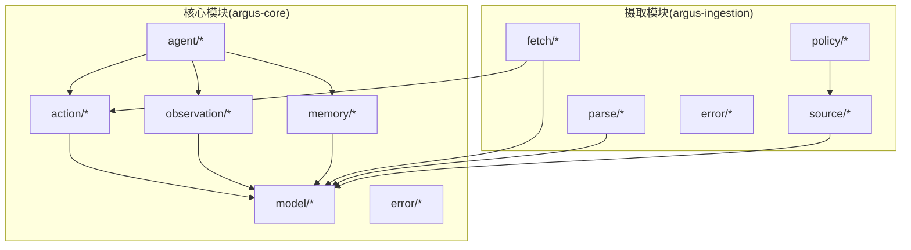
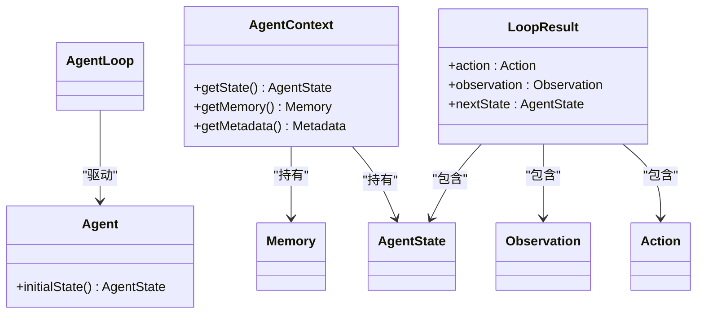
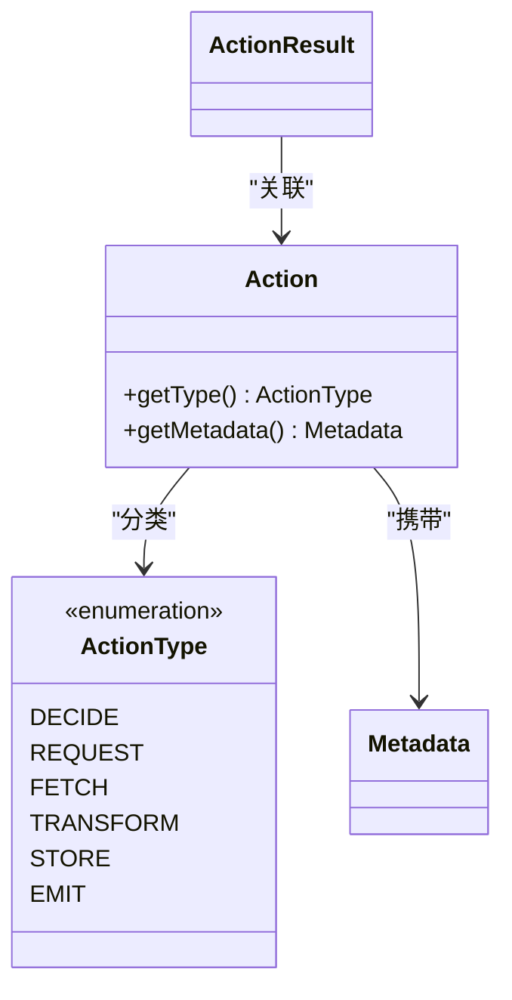
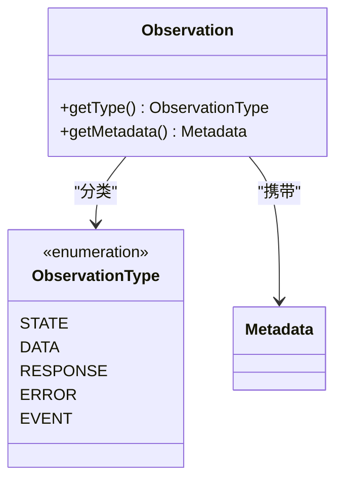
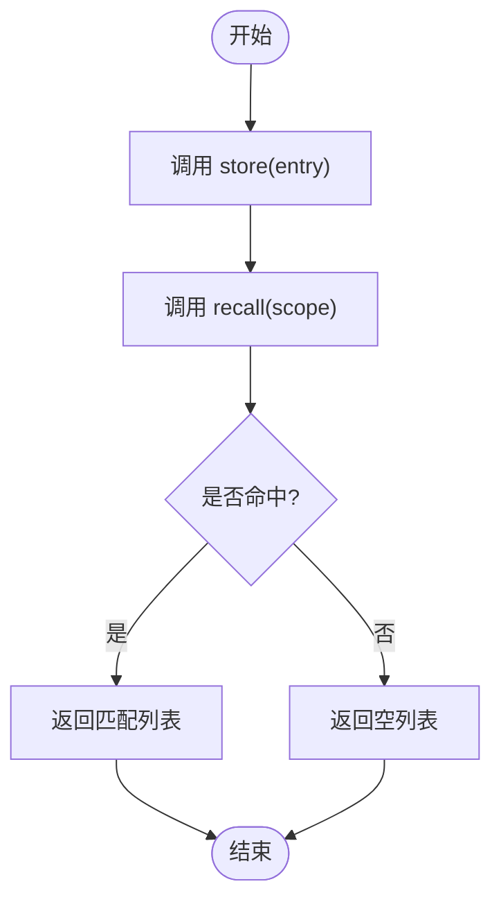
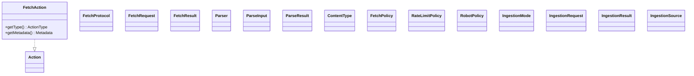
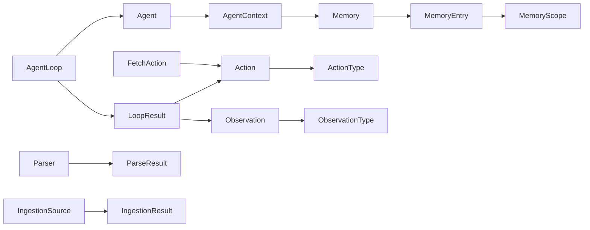

# API参考

<cite>
**本文引用的文件**
- [Agent.java](file://argus-core/src/main/java/io/argus/core/agent/Agent.java)
- [AgentContext.java](file://argus-core/src/main/java/io/argus/core/agent/AgentContext.java)
- [AgentLoop.java](file://argus-core/src/main/java/io/argus/core/agent/AgentLoop.java)
- [AgentState.java](file://argus-core/src/main/java/io/argus/core/agent/AgentState.java)
- [LoopResult.java](file://argus-core/src/main/java/io/argus/core/agent/LoopResult.java)
- [Action.java](file://argus-core/src/main/java/io/argus/core/action/Action.java)
- [ActionResult.java](file://argus-core/src/main/java/io/argus/core/action/ActionResult.java)
- [ActionType.java](file://argus-core/src/main/java/io/argus/core/action/ActionType.java)
- [Observation.java](file://argus-core/src/main/java/io/argus/core/observation/Observation.java)
- [ObservationType.java](file://argus-core/src/main/java/io/argus/core/observation/ObservationType.java)
- [Memory.java](file://argus-core/src/main/java/io/argus/core/memory/Memory.java)
- [MemoryEntry.java](file://argus-core/src/main/java/io/argus/core/memory/MemoryEntry.java)
- [MemoryScope.java](file://argus-core/src/main/java/io/argus/core/memory/MemoryScope.java)
- [Metadata.java](file://argus-core/src/main/java/io/argus/core/model/Metadata.java)
- [FetchAction.java](file://argus-ingestion/src/main/java/io/argus/ingestion/fetch/FetchAction.java)
- [FetchProtocol.java](file://argus-ingestion/src/main/java/io/argus/ingestion/fetch/FetchProtocol.java)
- [FetchRequest.java](file://argus-ingestion/src/main/java/io/argus/ingestion/fetch/FetchRequest.java)
- [FetchResult.java](file://argus-ingestion/src/main/java/io/argus/ingestion/fetch/FetchResult.java)
- [Parser.java](file://argus-ingestion/src/main/java/io/argus/ingestion/parse/Parser.java)
- [ParseInput.java](file://argus-ingestion/src/main/java/io/argus/ingestion/parse/ParseInput.java)
- [ParseResult.java](file://argus-ingestion/src/main/java/io/argus/ingestion/parse/ParseResult.java)
- [ContentType.java](file://argus-ingestion/src/main/java/io/argus/ingestion/parse/ContentType.java)
- [FetchPolicy.java](file://argus-ingestion/src/main/java/io/argus/ingestion/policy/FetchPolicy.java)
- [RateLimitPolicy.java](file://argus-ingestion/src/main/java/io/argus/ingestion/policy/RateLimitPolicy.java)
- [RobotPolicy.java](file://argus-ingestion/src/main/java/io/argus/ingestion/policy/RobotPolicy.java)
- [IngestionMode.java](file://argus-ingestion/src/main/java/io/argus/ingestion/source/IngestionMode.java)
- [IngestionRequest.java](file://argus-ingestion/src/main/java/io/argus/ingestion/source/IngestionRequest.java)
- [IngestionResult.java](file://argus-ingestion/src/main/java/io/argus/ingestion/source/IngestionResult.java)
- [IngestionSource.java](file://argus-ingestion/src/main/java/io/argus/ingestion/source/IngestionSource.java)
- [ArgusException.java](file://argus-core/src/main/java/io/argus/core/error/ArgusException.java)
- [AgentExecutionException.java](file://argus-core/src/main/java/io/argus/core/error/AgentExecutionException.java)
- [FetchFailedException.java](file://argus-ingestion/src/main/java/io/argus/ingestion/error/FetchFailedException.java)
</cite>

## 目录
1. [简介](#简介)
2. [项目结构](#项目结构)
3. [核心组件](#核心组件)
4. [架构总览](#架构总览)
5. [详细组件分析](#详细组件分析)
6. [依赖关系分析](#依赖关系分析)
7. [性能考量](#性能考量)
8. [故障排查指南](#故障排查指南)
9. [结论](#结论)
10. [附录](#附录)

## 简介
本文件为Argus框架的完整API参考，覆盖核心抽象与数据获取组件，重点包括：
- Agent接口族：Agent、AgentContext、AgentLoop、AgentState、LoopResult
- Action接口族：Action、ActionType、ActionResult
- Observation接口族：Observation、ObservationType
- Memory接口族：Memory、MemoryEntry、MemoryScope
- 数据获取组件：FetchAction、FetchProtocol、FetchRequest、FetchResult、Parser、ParseInput、ParseResult、ContentType、FetchPolicy、RateLimitPolicy、RobotPolicy、IngestionMode、IngestionRequest、IngestionResult、IngestionSource
- 异常体系：ArgusException、AgentExecutionException、FetchFailedException
- 元数据模型：Metadata

本参考以“可追溯”的方式标注所有涉及的源文件与行号，便于定位实现细节。

## 项目结构
Argus采用多模块组织，核心能力集中在argus-core，数据摄取能力集中在argus-ingestion，运行时在argus-runtime（当前仓库未包含实现）。



图示来源
- [Agent.java](file://argus-core/src/main/java/io/argus/core/agent/Agent.java#L1-L11)
- [Action.java](file://argus-core/src/main/java/io/argus/core/action/Action.java#L1-L43)
- [Observation.java](file://argus-core/src/main/java/io/argus/core/observation/Observation.java#L1-L37)
- [Memory.java](file://argus-core/src/main/java/io/argus/core/memory/Memory.java#L1-L15)
- [Metadata.java](file://argus-core/src/main/java/io/argus/core/model/Metadata.java#L1-L34)
- [FetchAction.java](file://argus-ingestion/src/main/java/io/argus/ingestion/fetch/FetchAction.java#L1-L21)
- [Parser.java](file://argus-ingestion/src/main/java/io/argus/ingestion/parse/Parser.java#L1-L8)

章节来源
- [Agent.java](file://argus-core/src/main/java/io/argus/core/agent/Agent.java#L1-L11)
- [Action.java](file://argus-core/src/main/java/io/argus/core/action/Action.java#L1-L43)
- [Observation.java](file://argus-core/src/main/java/io/argus/core/observation/Observation.java#L1-L37)
- [Memory.java](file://argus-core/src/main/java/io/argus/core/memory/Memory.java#L1-L15)
- [Metadata.java](file://argus-core/src/main/java/io/argus/core/model/Metadata.java#L1-L34)
- [FetchAction.java](file://argus-ingestion/src/main/java/io/argus/ingestion/fetch/FetchAction.java#L1-L21)
- [Parser.java](file://argus-ingestion/src/main/java/io/argus/ingestion/parse/Parser.java#L1-L8)

## 核心组件
本节梳理Agent、Action、Observation、Memory四大核心抽象及其关键方法、参数、返回值与典型用法。

- Agent接口
  - 方法
    - initialState(): AgentState
  - 说明
    - 返回Agent初始状态快照；AgentState为逻辑快照，需满足不可变性与自足性。
  - 示例路径
    - [Agent.initialState](file://argus-core/src/main/java/io/argus/core/agent/Agent.java#L9-L11)

- AgentContext
  - 方法
    - getState(): AgentState
    - getMemory(): Memory
    - getMetadata(): Metadata
  - 说明
    - 提供Agent运行时上下文访问入口；getMemory返回内存接口，用于存取记忆。
  - 示例路径
    - [AgentContext.getState](file://argus-core/src/main/java/io/argus/core/agent/AgentContext.java)
    - [AgentContext.getMemory](file://argus-core/src/main/java/io/argus/core/agent/AgentContext.java)

- AgentLoop
  - 说明
    - Agent执行循环的抽象；负责驱动Agent执行步骤，产出LoopResult。
  - 示例路径
    - [AgentLoop](file://argus-core/src/main/java/io/argus/core/agent/AgentLoop.java)

- AgentState
  - 说明
    - 不可变的Agent逻辑快照；支持确定性重放与审计。
  - 示例路径
    - [AgentState](file://argus-core/src/main/java/io/argus/core/agent/AgentState.java#L1-L81)

- LoopResult
  - 字段
    - action: Action
    - observation: Observation
    - nextState: AgentState
  - 说明
    - 单次循环的产物：包含发出的动作、产生的观测以及下一步状态。
  - 示例路径
    - [LoopResult](file://argus-core/src/main/java/io/argus/core/agent/LoopResult.java)

- Action接口
  - 方法
    - getType(): ActionType
    - getMetadata(): Metadata
  - 说明
    - 表达Agent的意图；不包含执行细节；通过ActionType定义高层语义类别。
  - 示例路径
    - [Action.getType](file://argus-core/src/main/java/io/argus/core/action/Action.java#L39-L42)

- ActionType枚举
  - 取值
    - DECIDE、REQUEST、FETCH、TRANSFORM、STORE、EMIT
  - 说明
    - 高层动作语义分类；具体协议/技术细节通过Metadata传递。
  - 示例路径
    - [ActionType](file://argus-core/src/main/java/io/argus/core/action/ActionType.java#L1-L143)

- Observation接口
  - 方法
    - getType(): ObservationType
    - getMetadata(): Metadata
  - 说明
    - 表达Agent感知到的事实；不可变；不包含行为指令。
  - 示例路径
    - [Observation.getType](file://argus-core/src/main/java/io/argus/core/observation/Observation.java#L33-L36)

- ObservationType枚举
  - 取值
    - STATE、DATA、RESPONSE、ERROR、EVENT
  - 说明
    - 观测事实的高层语义分类。
  - 示例路径
    - [ObservationType](file://argus-core/src/main/java/io/argus/core/observation/ObservationType.java#L1-L117)

- Memory接口
  - 方法
    - store(entry: MemoryEntry): void
    - recall(scope: MemoryScope): List<MemoryEntry>
  - 说明
    - 存储与检索记忆；支持按作用域检索。
  - 示例路径
    - [Memory.store](file://argus-core/src/main/java/io/argus/core/memory/Memory.java#L11-L12)
    - [Memory.recall](file://argus-core/src/main/java/io/argus/core/memory/Memory.java#L13-L14)

- MemoryEntry
  - 字段
    - id: String
    - scope: MemoryScope
    - value: Object
    - metadata: Metadata
    - timestamp: long
  - 说明
    - 记忆项的数据载体；value承载实际内容；timestamp用于排序/过期策略。
  - 示例路径
    - [MemoryEntry构造与字段访问](file://argus-core/src/main/java/io/argus/core/memory/MemoryEntry.java#L17-L53)

- MemoryScope
  - 说明
    - 记忆作用域枚举；用于召回过滤。
  - 示例路径
    - [MemoryScope](file://argus-core/src/main/java/io/argus/core/memory/MemoryScope.java#L1-L8)

- Metadata
  - 方法
    - get(key: String): Optional<Object>
    - asMap(): Map<String, Object>
    - isEmpty(): boolean
  - 说明
    - 不可变键值对容器；用于承载额外语义信息。
  - 示例路径
    - [Metadata](file://argus-core/src/main/java/io/argus/core/model/Metadata.java#L1-L34)

章节来源
- [Agent.java](file://argus-core/src/main/java/io/argus/core/agent/Agent.java#L1-L11)
- [AgentContext.java](file://argus-core/src/main/java/io/argus/core/agent/AgentContext.java)
- [AgentLoop.java](file://argus-core/src/main/java/io/argus/core/agent/AgentLoop.java)
- [AgentState.java](file://argus-core/src/main/java/io/argus/core/agent/AgentState.java#L1-L81)
- [LoopResult.java](file://argus-core/src/main/java/io/argus/core/agent/LoopResult.java)
- [Action.java](file://argus-core/src/main/java/io/argus/core/action/Action.java#L1-L43)
- [ActionType.java](file://argus-core/src/main/java/io/argus/core/action/ActionType.java#L1-L143)
- [Observation.java](file://argus-core/src/main/java/io/argus/core/observation/Observation.java#L1-L37)
- [ObservationType.java](file://argus-core/src/main/java/io/argus/core/observation/ObservationType.java#L1-L117)
- [Memory.java](file://argus-core/src/main/java/io/argus/core/memory/Memory.java#L1-L15)
- [MemoryEntry.java](file://argus-core/src/main/java/io/argus/core/memory/MemoryEntry.java#L1-L53)
- [MemoryScope.java](file://argus-core/src/main/java/io/argus/core/memory/MemoryScope.java#L1-L8)
- [Metadata.java](file://argus-core/src/main/java/io/argus/core/model/Metadata.java#L1-L34)

## 架构总览
下图展示Agent执行循环与核心抽象之间的交互关系。

```mermaid
sequenceDiagram
participant Agent as "Agent"
participant Ctx as "AgentContext"
participant Loop as "AgentLoop"
participant Act as "Action"
participant Obs as "Observation"
participant Mem as "Memory"
Agent->>Ctx : "获取上下文"
Ctx->>Mem : "getMemory()"
Loop->>Agent : "initialState()"
Loop->>Agent : "step(state)"
Agent->>Act : "生成Action"
Agent->>Obs : "生成Observation"
Agent->>Mem : "store(MemoryEntry)"
Agent-->>Loop : "返回NextState"
Loop-->>Agent : "LoopResult(nextState, observation)"
```

图示来源
- [Agent.java](file://argus-core/src/main/java/io/argus/core/agent/Agent.java#L9-L11)
- [AgentContext.java](file://argus-core/src/main/java/io/argus/core/agent/AgentContext.java)
- [AgentLoop.java](file://argus-core/src/main/java/io/argus/core/agent/AgentLoop.java)
- [Memory.java](file://argus-core/src/main/java/io/argus/core/memory/Memory.java#L11-L14)
- [Action.java](file://argus-core/src/main/java/io/argus/core/action/Action.java#L39-L42)
- [Observation.java](file://argus-core/src/main/java/io/argus/core/observation/Observation.java#L33-L36)

## 详细组件分析

### Agent接口族
- Agent
  - 方法
    - initialState(): AgentState
  - 用途
    - 定义Agent初始状态；返回值为不可变快照。
  - 示例路径
    - [Agent.initialState](file://argus-core/src/main/java/io/argus/core/agent/Agent.java#L9-L11)

- AgentContext
  - 方法
    - getState(): AgentState
    - getMemory(): Memory
    - getMetadata(): Metadata
  - 用途
    - 提供运行时上下文；getMemory用于存取记忆。
  - 示例路径
    - [AgentContext.getState](file://argus-core/src/main/java/io/argus/core/agent/AgentContext.java)
    - [AgentContext.getMemory](file://argus-core/src/main/java/io/argus/core/agent/AgentContext.java)

- AgentLoop
  - 用途
    - 驱动Agent执行循环；产出LoopResult。
  - 示例路径
    - [AgentLoop](file://argus-core/src/main/java/io/argus/core/agent/AgentLoop.java)

- AgentState
  - 合同
    - 不可变；自足快照；支持相等性比较。
  - 示例路径
    - [AgentState](file://argus-core/src/main/java/io/argus/core/agent/AgentState.java#L1-L81)

- LoopResult
  - 字段
    - action: Action
    - observation: Observation
    - nextState: AgentState
  - 示例路径
    - [LoopResult](file://argus-core/src/main/java/io/argus/core/agent/LoopResult.java)

类图（映射到实际源码）


图示来源
- [Agent.java](file://argus-core/src/main/java/io/argus/core/agent/Agent.java#L9-L11)
- [AgentContext.java](file://argus-core/src/main/java/io/argus/core/agent/AgentContext.java)
- [AgentLoop.java](file://argus-core/src/main/java/io/argus/core/agent/AgentLoop.java)
- [AgentState.java](file://argus-core/src/main/java/io/argus/core/agent/AgentState.java#L1-L81)
- [LoopResult.java](file://argus-core/src/main/java/io/argus/core/agent/LoopResult.java)

章节来源
- [Agent.java](file://argus-core/src/main/java/io/argus/core/agent/Agent.java#L1-L11)
- [AgentContext.java](file://argus-core/src/main/java/io/argus/core/agent/AgentContext.java)
- [AgentLoop.java](file://argus-core/src/main/java/io/argus/core/agent/AgentLoop.java)
- [AgentState.java](file://argus-core/src/main/java/io/argus/core/agent/AgentState.java#L1-L81)
- [LoopResult.java](file://argus-core/src/main/java/io/argus/core/agent/LoopResult.java)

### Action接口族
- Action接口
  - 方法
    - getType(): ActionType
    - getMetadata(): Metadata
  - 说明
    - 声明式意图；不包含执行细节；通过ActionType与Metadata表达高层语义与附加信息。
  - 示例路径
    - [Action接口](file://argus-core/src/main/java/io/argus/core/action/Action.java#L37-L43)

- ActionType枚举
  - 取值
    - DECIDE、REQUEST、FETCH、TRANSFORM、STORE、EMIT
  - 说明
    - 动作的高层语义分类；具体协议/技术细节通过Metadata传递。
  - 示例路径
    - [ActionType](file://argus-core/src/main/java/io/argus/core/action/ActionType.java#L22-L143)

- ActionResult
  - 说明
    - 动作执行结果抽象；用于封装动作执行后的产出或状态。
  - 示例路径
    - [ActionResult](file://argus-core/src/main/java/io/argus/core/action/ActionResult.java)

类图（映射到实际源码）


图示来源
- [Action.java](file://argus-core/src/main/java/io/argus/core/action/Action.java#L37-L43)
- [ActionType.java](file://argus-core/src/main/java/io/argus/core/action/ActionType.java#L22-L143)
- [Metadata.java](file://argus-core/src/main/java/io/argus/core/model/Metadata.java#L1-L34)
- [ActionResult.java](file://argus-core/src/main/java/io/argus/core/action/ActionResult.java)

章节来源
- [Action.java](file://argus-core/src/main/java/io/argus/core/action/Action.java#L1-L43)
- [ActionType.java](file://argus-core/src/main/java/io/argus/core/action/ActionType.java#L1-L143)
- [ActionResult.java](file://argus-core/src/main/java/io/argus/core/action/ActionResult.java)
- [Metadata.java](file://argus-core/src/main/java/io/argus/core/model/Metadata.java#L1-L34)

### Observation接口族
- Observation接口
  - 方法
    - getType(): ObservationType
    - getMetadata(): Metadata
  - 说明
    - 表达不可变事实；不包含行为指令；通过ObservationType与Metadata表达语义与上下文。
  - 示例路径
    - [Observation接口](file://argus-core/src/main/java/io/argus/core/observation/Observation.java#L31-L37)

- ObservationType枚举
  - 取值
    - STATE、DATA、RESPONSE、ERROR、EVENT
  - 说明
    - 观测事实的高层语义分类。
  - 示例路径
    - [ObservationType](file://argus-core/src/main/java/io/argus/core/observation/ObservationType.java#L18-L117)

类图（映射到实际源码）


图示来源
- [Observation.java](file://argus-core/src/main/java/io/argus/core/observation/Observation.java#L31-L37)
- [ObservationType.java](file://argus-core/src/main/java/io/argus/core/observation/ObservationType.java#L18-L117)
- [Metadata.java](file://argus-core/src/main/java/io/argus/core/model/Metadata.java#L1-L34)

章节来源
- [Observation.java](file://argus-core/src/main/java/io/argus/core/observation/Observation.java#L1-L37)
- [ObservationType.java](file://argus-core/src/main/java/io/argus/core/observation/ObservationType.java#L1-L117)
- [Metadata.java](file://argus-core/src/main/java/io/argus/core/model/Metadata.java#L1-L34)

### Memory接口族
- Memory接口
  - 方法
    - store(entry: MemoryEntry): void
    - recall(scope: MemoryScope): List<MemoryEntry>
  - 说明
    - 存储与检索记忆；支持按作用域召回。
  - 示例路径
    - [Memory.store](file://argus-core/src/main/java/io/argus/core/memory/Memory.java#L11-L12)
    - [Memory.recall](file://argus-core/src/main/java/io/argus/core/memory/Memory.java#L13-L14)

- MemoryEntry
  - 字段
    - id: String
    - scope: MemoryScope
    - value: Object
    - metadata: Metadata
    - timestamp: long
  - 说明
    - 记忆项载体；value承载实际内容；timestamp用于排序/过期策略。
  - 示例路径
    - [MemoryEntry构造与字段访问](file://argus-core/src/main/java/io/argus/core/memory/MemoryEntry.java#L17-L53)

- MemoryScope
  - 说明
    - 记忆作用域枚举；用于召回过滤。
  - 示例路径
    - [MemoryScope](file://argus-core/src/main/java/io/argus/core/memory/MemoryScope.java#L1-L8)

流程图（存储与召回）


图示来源
- [Memory.java](file://argus-core/src/main/java/io/argus/core/memory/Memory.java#L11-L14)
- [MemoryEntry.java](file://argus-core/src/main/java/io/argus/core/memory/MemoryEntry.java#L17-L53)
- [MemoryScope.java](file://argus-core/src/main/java/io/argus/core/memory/MemoryScope.java#L1-L8)

章节来源
- [Memory.java](file://argus-core/src/main/java/io/argus/core/memory/Memory.java#L1-L15)
- [MemoryEntry.java](file://argus-core/src/main/java/io/argus/core/memory/MemoryEntry.java#L1-L53)
- [MemoryScope.java](file://argus-core/src/main/java/io/argus/core/memory/MemoryScope.java#L1-L8)

### 数据获取组件API规范
- FetchAction
  - 实现接口
    - Action
  - 方法
    - getType(): ActionType
    - getMetadata(): Metadata
  - 说明
    - 表达“获取”类动作意图；具体协议/请求参数通过Metadata传递。
  - 示例路径
    - [FetchAction](file://argus-ingestion/src/main/java/io/argus/ingestion/fetch/FetchAction.java#L11-L21)

- FetchProtocol
  - 说明
    - 获取协议抽象；定义协议级约定。
  - 示例路径
    - [FetchProtocol](file://argus-ingestion/src/main/java/io/argus/ingestion/fetch/FetchProtocol.java)

- FetchRequest
  - 说明
    - 获取请求载体；封装目标、参数、策略等。
  - 示例路径
    - [FetchRequest](file://argus-ingestion/src/main/java/io/argus/ingestion/fetch/FetchRequest.java)

- FetchResult
  - 说明
    - 获取结果载体；封装数据、元信息、状态。
  - 示例路径
    - [FetchResult](file://argus-ingestion/src/main/java/io/argus/ingestion/fetch/FetchResult.java)

- Parser
  - 说明
    - 解析器抽象；负责将原始输入转换为结构化结果。
  - 示例路径
    - [Parser](file://argus-ingestion/src/main/java/io/argus/ingestion/parse/Parser.java#L1-L8)

- ParseInput
  - 说明
    - 解析输入载体；承载待解析数据与上下文。
  - 示例路径
    - [ParseInput](file://argus-ingestion/src/main/java/io/argus/ingestion/parse/ParseInput.java)

- ParseResult
  - 说明
    - 解析结果载体；承载解析后的内容与元信息。
  - 示例路径
    - [ParseResult](file://argus-ingestion/src/main/java/io/argus/ingestion/parse/ParseResult.java)

- ContentType
  - 说明
    - 内容类型枚举；标识数据格式。
  - 示例路径
    - [ContentType](file://argus-ingestion/src/main/java/io/argus/ingestion/parse/ContentType.java)

- FetchPolicy
  - 说明
    - 获取策略抽象；定义获取行为约束。
  - 示例路径
    - [FetchPolicy](file://argus-ingestion/src/main/java/io/argus/ingestion/policy/FetchPolicy.java)

- RateLimitPolicy
  - 说明
    - 速率限制策略；控制请求频率。
  - 示例路径
    - [RateLimitPolicy](file://argus-ingestion/src/main/java/io/argus/ingestion/policy/RateLimitPolicy.java)

- RobotPolicy
  - 说明
    - 机器人协议策略；遵循爬虫/访问规则。
  - 示例路径
    - [RobotPolicy](file://argus-ingestion/src/main/java/io/argus/ingestion/policy/RobotPolicy.java)

- IngestionMode
  - 说明
    - 摄取模式枚举；定义数据摄取方式。
  - 示例路径
    - [IngestionMode](file://argus-ingestion/src/main/java/io/argus/ingestion/source/IngestionMode.java)

- IngestionRequest
  - 说明
    - 摄取请求载体；封装目标、模式、策略等。
  - 示例路径
    - [IngestionRequest](file://argus-ingestion/src/main/java/io/argus/ingestion/source/IngestionRequest.java)

- IngestionResult
  - 说明
    - 摄取结果载体；封装产出与状态。
  - 示例路径
    - [IngestionResult](file://argus-ingestion/src/main/java/io/argus/ingestion/source/IngestionResult.java)

- IngestionSource
  - 说明
    - 摄取源抽象；定义数据来源。
  - 示例路径
    - [IngestionSource](file://argus-ingestion/src/main/java/io/argus/ingestion/source/IngestionSource.java)

类图（映射到实际源码）


图示来源
- [FetchAction.java](file://argus-ingestion/src/main/java/io/argus/ingestion/fetch/FetchAction.java#L11-L21)
- [Action.java](file://argus-core/src/main/java/io/argus/core/action/Action.java#L37-L43)

章节来源
- [FetchAction.java](file://argus-ingestion/src/main/java/io/argus/ingestion/fetch/FetchAction.java#L1-L21)
- [FetchProtocol.java](file://argus-ingestion/src/main/java/io/argus/ingestion/fetch/FetchProtocol.java)
- [FetchRequest.java](file://argus-ingestion/src/main/java/io/argus/ingestion/fetch/FetchRequest.java)
- [FetchResult.java](file://argus-ingestion/src/main/java/io/argus/ingestion/fetch/FetchResult.java)
- [Parser.java](file://argus-ingestion/src/main/java/io/argus/ingestion/parse/Parser.java#L1-L8)
- [ParseInput.java](file://argus-ingestion/src/main/java/io/argus/ingestion/parse/ParseInput.java)
- [ParseResult.java](file://argus-ingestion/src/main/java/io/argus/ingestion/parse/ParseResult.java)
- [ContentType.java](file://argus-ingestion/src/main/java/io/argus/ingestion/parse/ContentType.java)
- [FetchPolicy.java](file://argus-ingestion/src/main/java/io/argus/ingestion/policy/FetchPolicy.java)
- [RateLimitPolicy.java](file://argus-ingestion/src/main/java/io/argus/ingestion/policy/RateLimitPolicy.java)
- [RobotPolicy.java](file://argus-ingestion/src/main/java/io/argus/ingestion/policy/RobotPolicy.java)
- [IngestionMode.java](file://argus-ingestion/src/main/java/io/argus/ingestion/source/IngestionMode.java)
- [IngestionRequest.java](file://argus-ingestion/src/main/java/io/argus/ingestion/source/IngestionRequest.java)
- [IngestionResult.java](file://argus-ingestion/src/main/java/io/argus/ingestion/source/IngestionResult.java)
- [IngestionSource.java](file://argus-ingestion/src/main/java/io/argus/ingestion/source/IngestionSource.java)

### 异常与错误处理
- ArgusException
  - 说明
    - 框架通用异常基类。
  - 示例路径
    - [ArgusException](file://argus-core/src/main/java/io/argus/core/error/ArgusException.java#L1-L8)

- AgentExecutionException
  - 说明
    - Agent执行阶段异常。
  - 示例路径
    - [AgentExecutionException](file://argus-core/src/main/java/io/argus/core/error/AgentExecutionException.java#L1-L8)

- FetchFailedException
  - 说明
    - 获取失败异常。
  - 示例路径
    - [FetchFailedException](file://argus-ingestion/src/main/java/io/argus/ingestion/error/FetchFailedException.java#L1-L8)

序列图（异常传播）
```mermaid
sequenceDiagram
participant Agent as "Agent"
participant Loop as "AgentLoop"
participant Src as "IngestionSource"
participant Ex as "异常"
Agent->>Loop : "step(state)"
Loop->>Src : "发起摄取"
Src-->>Ex : "抛出异常"
Ex-->>Loop : "上抛"
Loop-->>Agent : "包装为执行异常"
Agent-->>Loop : "终止/回滚"
```

图示来源
- [AgentExecutionException.java](file://argus-core/src/main/java/io/argus/core/error/AgentExecutionException.java#L1-L8)
- [FetchFailedException.java](file://argus-ingestion/src/main/java/io/argus/ingestion/error/FetchFailedException.java#L1-L8)

章节来源
- [ArgusException.java](file://argus-core/src/main/java/io/argus/core/error/ArgusException.java#L1-L8)
- [AgentExecutionException.java](file://argus-core/src/main/java/io/argus/core/error/AgentExecutionException.java#L1-L8)
- [FetchFailedException.java](file://argus-ingestion/src/main/java/io/argus/ingestion/error/FetchFailedException.java#L1-L8)

## 依赖关系分析
- 组件耦合
  - Agent依赖AgentContext提供上下文；AgentLoop驱动Agent执行；LoopResult承载单步结果。
  - Action与Observation均依赖Metadata承载语义上下文；Action通过ActionType分类；Observation通过ObservationType分类。
  - MemoryEntry作为记忆载体，被Memory接口存取；MemoryScope用于召回过滤。
  - FetchAction实现Action接口，用于表达“获取”意图；Parser用于数据解析；IngestionSource/IngestionRequest/IngestionResult构成摄取链路。

- 外部依赖
  - 无显式第三方依赖声明；各模块通过包内接口协作。

依赖图


图示来源
- [Agent.java](file://argus-core/src/main/java/io/argus/core/agent/Agent.java#L9-L11)
- [AgentContext.java](file://argus-core/src/main/java/io/argus/core/agent/AgentContext.java)
- [AgentLoop.java](file://argus-core/src/main/java/io/argus/core/agent/AgentLoop.java)
- [LoopResult.java](file://argus-core/src/main/java/io/argus/core/agent/LoopResult.java)
- [Action.java](file://argus-core/src/main/java/io/argus/core/action/Action.java#L37-L43)
- [ActionType.java](file://argus-core/src/main/java/io/argus/core/action/ActionType.java#L22-L143)
- [Observation.java](file://argus-core/src/main/java/io/argus/core/observation/Observation.java#L31-L37)
- [ObservationType.java](file://argus-core/src/main/java/io/argus/core/observation/ObservationType.java#L18-L117)
- [Memory.java](file://argus-core/src/main/java/io/argus/core/memory/Memory.java#L11-L14)
- [MemoryEntry.java](file://argus-core/src/main/java/io/argus/core/memory/MemoryEntry.java#L17-L53)
- [MemoryScope.java](file://argus-core/src/main/java/io/argus/core/memory/MemoryScope.java#L1-L8)
- [FetchAction.java](file://argus-ingestion/src/main/java/io/argus/ingestion/fetch/FetchAction.java#L11-L21)
- [Parser.java](file://argus-ingestion/src/main/java/io/argus/ingestion/parse/Parser.java#L1-L8)
- [IngestionSource.java](file://argus-ingestion/src/main/java/io/argus/ingestion/source/IngestionSource.java)

章节来源
- [Agent.java](file://argus-core/src/main/java/io/argus/core/agent/Agent.java#L1-L11)
- [Action.java](file://argus-core/src/main/java/io/argus/core/action/Action.java#L1-L43)
- [Observation.java](file://argus-core/src/main/java/io/argus/core/observation/Observation.java#L1-L37)
- [Memory.java](file://argus-core/src/main/java/io/argus/core/memory/Memory.java#L1-L15)
- [FetchAction.java](file://argus-ingestion/src/main/java/io/argus/ingestion/fetch/FetchAction.java#L1-L21)
- [Parser.java](file://argus-ingestion/src/main/java/io/argus/ingestion/parse/Parser.java#L1-L8)

## 性能考量
- 不可变性与快照
  - AgentState与MemoryEntry均为不可变设计，有利于并发安全与确定性重放，但需注意对象创建开销。
- 回收与作用域
  - 使用MemoryScope进行召回过滤，避免全量扫描；合理设置时间戳与过期策略，减少无效检索。
- 动作与观测
  - 将具体协议细节放入Metadata，避免在Action/ Observation中嵌入复杂逻辑，降低分支与判断成本。
- 解析与摄取
  - Parser与FetchResult解耦，便于并行与缓存；FetchPolicy/RateLimitPolicy/RobotPolicy可组合以平衡吞吐与合规。

## 故障排查指南
- 常见问题
  - 动作未生效：检查ActionType与Metadata是否正确设置；确认执行器是否识别该类型。
  - 观测缺失：检查ObservationType分类是否准确；确认Metadata是否包含必要上下文。
  - 记忆无法召回：检查MemoryScope与时间戳；确认recall参数与存储时一致。
  - 获取失败：捕获FetchFailedException并结合FetchResult诊断原因。
- 排查步骤
  - 在AgentLoop中打印LoopResult，核对action、observation、nextState。
  - 使用Metadata记录关键上下文，便于审计与回放。
  - 对异常进行分级处理：区分ArgusException与AgentExecutionException。

章节来源
- [AgentExecutionException.java](file://argus-core/src/main/java/io/argus/core/error/AgentExecutionException.java#L1-L8)
- [FetchFailedException.java](file://argus-ingestion/src/main/java/io/argus/ingestion/error/FetchFailedException.java#L1-L8)
- [LoopResult.java](file://argus-core/src/main/java/io/argus/core/agent/LoopResult.java)

## 结论
Argus框架通过清晰的抽象与不可变设计，提供了高内聚、低耦合的Agent执行与数据摄取能力。Action/ Observation/ Memory/ Fetch/ Parse等组件相互独立且职责明确，配合Metadata实现语义扩展，适合构建可审计、可重放、可扩展的智能体系统。

## 附录
- 最佳实践
  - 使用Metadata承载动态语义，避免扩展枚举。
  - 保持Action/ Observation纯意图表达，避免技术细节下沉。
  - 利用MemoryScope与时间戳优化召回性能。
  - 在AgentLoop中统一处理异常与观测，确保一致性。
- 示例路径索引
  - Agent初始化与状态：[Agent.initialState](file://argus-core/src/main/java/io/argus/core/agent/Agent.java#L9-L11)
  - 记忆存储与召回：[Memory.store](file://argus-core/src/main/java/io/argus/core/memory/Memory.java#L11-L12)、[Memory.recall](file://argus-core/src/main/java/io/argus/core/memory/Memory.java#L13-L14)
  - 获取动作实现：[FetchAction](file://argus-ingestion/src/main/java/io/argus/ingestion/fetch/FetchAction.java#L11-L21)
  - 解析器使用：[Parser](file://argus-ingestion/src/main/java/io/argus/ingestion/parse/Parser.java#L1-L8)