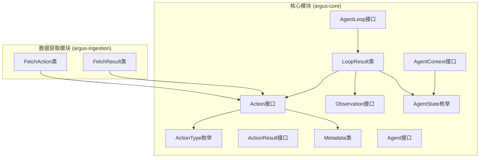
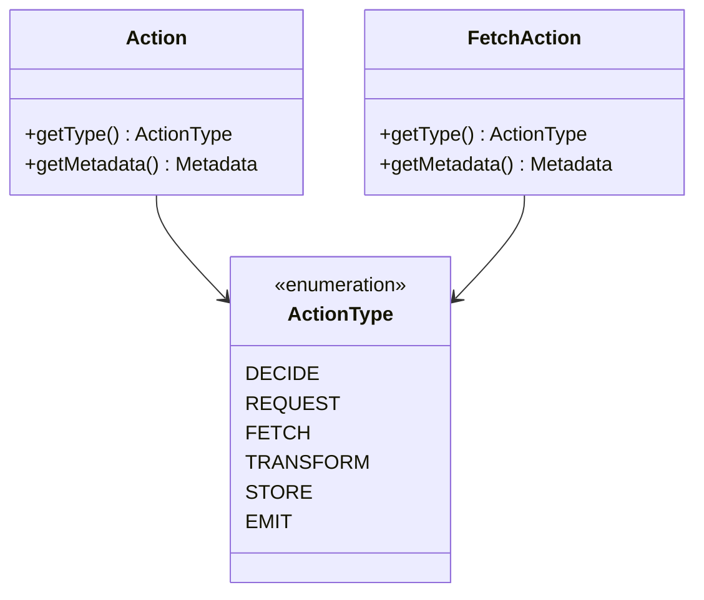
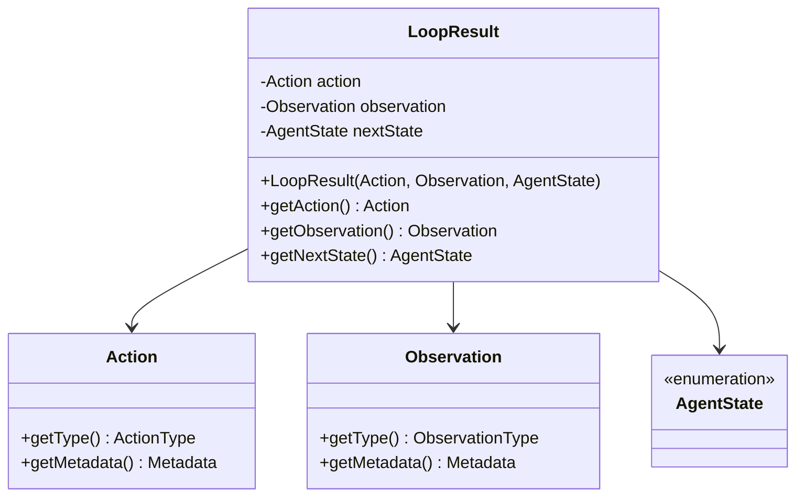
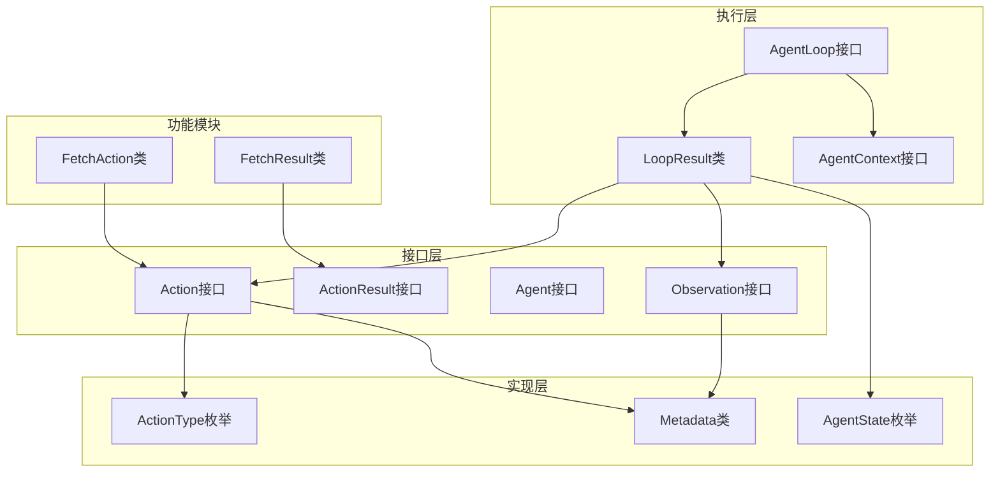

# Action动作API

<cite>
**本文档引用的文件**
- [Action.java](file://argus-core/src/main/java/io/argus/core/action/Action.java)
- [ActionType.java](file://argus-core/src/main/java/io/argus/core/action/ActionType.java)
- [ActionResult.java](file://argus-core/src/main/java/io/argus/core/action/ActionResult.java)
- [Metadata.java](file://argus-core/src/main/java/io/argus/core/model/Metadata.java)
- [AgentLoop.java](file://argus-core/src/main/java/io/argus/core/agent/AgentLoop.java)
- [AgentContext.java](file://argus-core/src/main/java/io/argus/core/agent/AgentContext.java)
- [LoopResult.java](file://argus-core/src/main/java/io/argus/core/agent/LoopResult.java)
- [Agent.java](file://argus-core/src/main/java/io/argus/core/agent/Agent.java)
- [FetchAction.java](file://argus-ingestion/src/main/java/io/argus/ingestion/fetch/FetchAction.java)
- [FetchResult.java](file://argus-ingestion/src/main/java/io/argus/ingestion/fetch/FetchResult.java)
- [Observation.java](file://argus-core/src/main/java/io/argus/core/observation/Observation.java)
- [AgentState.java](file://argus-core/src/main/java/io/argus/core/agent/AgentState.java)
</cite>

## 目录
1. [简介](#简介)
2. [项目结构](#项目结构)
3. [核心组件](#核心组件)
4. [架构概览](#架构概览)
5. [详细组件分析](#详细组件分析)
6. [依赖关系分析](#依赖关系分析)
7. [性能考虑](#性能考虑)
8. [故障排除指南](#故障排除指南)
9. [结论](#结论)

## 简介

Action动作系统是Argus代理框架的核心执行模型，它定义了代理如何表达意图并执行操作。该系统采用声明式设计，将"意图"与"执行"分离，确保代理决策的可审计性、可回放性和可扩展性。

Action系统的核心理念是：代理只表达意图（Action），具体的执行逻辑由运行时环境负责实现。这种设计使得代理可以在不同的执行环境中保持一致的行为模式，同时支持确定性回放和调试。

## 项目结构

Action动作系统主要分布在以下模块中：



**图表来源**
- [Action.java](file://argus-core/src/main/java/io/argus/core/action/Action.java#L1-L43)
- [ActionType.java](file://argus-core/src/main/java/io/argus/core/action/ActionType.java#L1-L143)
- [LoopResult.java](file://argus-core/src/main/java/io/argus/core/agent/LoopResult.java#L1-L115)

**章节来源**
- [Action.java](file://argus-core/src/main/java/io/argus/core/action/Action.java#L1-L43)
- [ActionType.java](file://argus-core/src/main/java/io/argus/core/action/ActionType.java#L1-L143)
- [LoopResult.java](file://argus-core/src/main/java/io/argus/core/agent/LoopResult.java#L1-L115)

## 核心组件

### Action接口

Action接口是整个动作系统的核心，定义了代理意图的标准化表示。

**方法签名规范：**
- `ActionType getType()` - 返回动作的类型分类
- `Metadata getMetadata()` - 返回动作的元数据信息

**实现要求：**
- 动作必须明确分类到特定的ActionType
- 不应在Action中编码执行逻辑
- 元数据信息通过Metadata类传递

**章节来源**
- [Action.java](file://argus-core/src/main/java/io/argus/core/action/Action.java#L37-L43)

### ActionType枚举

ActionType定义了动作的高层语义分类，共有六种基本类型：



**图表来源**
- [ActionType.java](file://argus-core/src/main/java/io/argus/core/action/ActionType.java#L22-L143)
- [Action.java](file://argus-core/src/main/java/io/argus/core/action/Action.java#L37-L43)

**各类型语义说明：**

1. **DECIDE (决策)** - 内部决策行为，不直接作用于外部世界
   - 典型用例：策略选择、规划下一步、内部推理或推断

2. **REQUEST (请求)** - 请求外部能力或服务
   - 典型用例：请求语言模型推理、调用插件或工具、委托任务给外部系统

3. **FETCH (获取)** - 从外部或内部源获取数据
   - 典型用例：获取网页内容、读取文件或数据库、加载资源

4. **TRANSFORM (变换)** - 纯数据变换行为，不应产生外部副作用
   - 典型用例：解析或清理数据、格式转换、特征提取或嵌入计算

5. **STORE (存储)** - 将数据持久化或提交到内存或存储
   - 典型用例：写入代理内存、持久化结果、更新长期状态

6. **EMIT (发射)** - 向外部环境输出信息或信号
   - 典型用例：返回最终输出、发布事件或通知、触发回调或webhook

**章节来源**
- [ActionType.java](file://argus-core/src/main/java/io/argus/core/action/ActionType.java#L22-L143)

### ActionResult结果接口

ActionResult接口定义了动作执行结果的标准表示，目前为空接口，为未来的扩展预留空间。

**设计考量：**
- 当前版本仅定义接口契约
- 未来可扩展为包含执行状态、错误信息等
- 与ActionType形成完整的执行生命周期

**章节来源**
- [ActionResult.java](file://argus-core/src/main/java/io/argus/core/action/ActionResult.java#L1-L8)

### Metadata元数据类

Metadata类提供了动作的附加信息载体，采用不可变设计。

**核心功能：**
- 键值对形式存储元数据
- 提供安全的访问接口
- 支持空值处理和映射转换

**使用场景：**
- 存储动作的具体配置参数
- 传递领域特定的上下文信息
- 支持动作类型的细粒度分类

**章节来源**
- [Metadata.java](file://argus-core/src/main/java/io/argus/core/model/Metadata.java#L12-L34)

## 架构概览

Action动作系统遵循声明式执行模型，通过AgentLoop驱动代理的决策循环：

```mermaid
sequenceDiagram
participant Agent as 代理
participant Loop as AgentLoop
participant Action as Action
participant Runtime as 运行时
participant Observation as Observation
Agent->>Loop : 初始化代理
Loop->>Loop : step(AgentContext)
Loop->>Agent : 获取当前状态
Agent->>Action : 生成Action意图
Action->>Runtime : 解释Action类型
Runtime->>Observation : 执行并返回结果
Observation->>Loop : 返回执行结果
Loop->>Loop : 更新AgentState
Loop-->>Agent : 返回LoopResult
Note over Agent,Runtime : 单步执行周期
```

**图表来源**
- [AgentLoop.java](file://argus-core/src/main/java/io/argus/core/agent/AgentLoop.java#L49-L118)
- [LoopResult.java](file://argus-core/src/main/java/io/argus/core/agent/LoopResult.java#L78-L115)

**执行机制说明：**

1. **声明式意图** - 代理只表达意图，不包含执行逻辑
2. **运行时解释** - 具体的执行逻辑由运行时环境实现
3. **确定性回放** - 通过LoopResult实现可审计的回放
4. **状态隔离** - AgentState与AgentContext严格分离

## 详细组件分析

### AgentLoop执行循环

AgentLoop定义了代理的核心执行语义，提供原子化的决策步骤：

**关键特性：**
- 原子性：每个step代表一个原子决策单元
- 可观测性：通过Action和Observation提供可观测结果
- 可审计性：每个step都是独立的执行事实
- 可扩展性：不限定具体的执行方式

**执行流程：**
1. 评估当前上下文和状态
2. 生成Action作为意图表达
3. 接收Observation作为事实结果
4. 过渡到新的AgentState

**章节来源**
- [AgentLoop.java](file://argus-core/src/main/java/io/argus/core/agent/AgentLoop.java#L49-L118)

### LoopResult执行结果

LoopResult是单步执行的不可变结果记录，包含三个核心要素：



**图表来源**
- [LoopResult.java](file://argus-core/src/main/java/io/argus/core/agent/LoopResult.java#L78-L115)

**设计原则：**
- 不可变性：确保结果的稳定性和可复用性
- 自包含性：包含足够的信息支持确定性回放
- 完整性：记录意图、结果和状态变化

**章节来源**
- [LoopResult.java](file://argus-core/src/main/java/io/argus/core/agent/LoopResult.java#L78-L115)

### FetchAction实现示例

FetchAction展示了如何实现具体的动作类型：

**实现要点：**
- 实现Action接口的所有方法
- 明确指定ActionType为FETCH
- 使用Metadata传递具体的获取参数

**最佳实践：**
- 遵循Action接口的约束条件
- 将技术细节封装在运行时实现中
- 通过Metadata传递必要的配置信息

**章节来源**
- [FetchAction.java](file://argus-ingestion/src/main/java/io/argus/ingestion/fetch/FetchAction.java#L11-L21)

### AgentContext执行上下文

AgentContext提供代理在执行过程中的可变工作环境：

**职责边界：**
- 短期推理缓冲区
- 外部服务客户端
- 速率限制器和执行保护
- 追踪、指标和日志助手
- 内存访问（非权威回忆）

**重要限制：**
- 不应包含权威代理状态
- 不应依赖于回放
- 不应隐藏审计或LoopResult中的副作用

**章节来源**
- [AgentContext.java](file://argus-core/src/main/java/io/argus/core/agent/AgentContext.java#L92-L98)

## 依赖关系分析

Action动作系统具有清晰的层次结构和严格的依赖关系：



**图表来源**
- [Action.java](file://argus-core/src/main/java/io/argus/core/action/Action.java#L37-L43)
- [AgentLoop.java](file://argus-core/src/main/java/io/argus/core/agent/AgentLoop.java#L49-L118)
- [LoopResult.java](file://argus-core/src/main/java/io/argus/core/agent/LoopResult.java#L78-L115)

**依赖特点：**
- 低耦合：接口与实现分离
- 高内聚：相关功能集中在同一模块
- 清晰边界：各层职责明确
- 可扩展：支持新类型和新功能的添加

**章节来源**
- [Action.java](file://argus-core/src/main/java/io/argus/core/action/Action.java#L37-L43)
- [AgentLoop.java](file://argus-core/src/main/java/io/argus/core/agent/AgentLoop.java#L49-L118)
- [LoopResult.java](file://argus-core/src/main/java/io/argus/core/agent/LoopResult.java#L78-L115)

## 性能考虑

### 执行效率优化

1. **不可变对象设计**
   - Metadata采用不可变设计，避免并发问题
   - LoopResult不可变，支持安全的缓存和共享

2. **延迟初始化**
   - Action和Observation可以按需创建
   - 大型元数据可以延迟加载

3. **内存管理**
   - 使用不可变集合减少内存分配
   - 支持对象池化以减少GC压力

### 扩展性考虑

1. **类型扩展**
   - 通过ActionType扩展新动作类型
   - 通过Metadata传递新参数

2. **执行优化**
   - 运行时可以实现并行执行
   - 支持批处理和流水线优化

## 故障排除指南

### 常见问题诊断

**问题1：Action未正确分类**
- 检查Action实现是否返回有效的ActionType
- 确认ActionType枚举值是否符合预期

**问题2：Metadata访问异常**
- 验证Metadata对象是否为null
- 检查键名拼写和大小写

**问题3：执行结果不一致**
- 确认LoopResult的不可变性
- 检查AgentState的正确过渡

**问题4：回放失败**
- 验证LoopResult序列的完整性
- 检查外部副作用的处理

### 调试建议

1. **启用详细日志**
   - 记录Action的生成和执行
   - 跟踪AgentState的变化

2. **使用断点调试**
   - 在AgentLoop.step中设置断点
   - 检查上下文和状态

3. **单元测试**
   - 为自定义Action编写测试
   - 验证回放功能

**章节来源**
- [AgentLoop.java](file://argus-core/src/main/java/io/argus/core/agent/AgentLoop.java#L51-L88)
- [LoopResult.java](file://argus-core/src/main/java/io/argus/core/agent/LoopResult.java#L78-L115)

## 结论

Action动作系统通过声明式设计实现了代理意图与执行逻辑的完美分离。其核心优势包括：

1. **可审计性** - 通过LoopResult记录完整的执行历史
2. **可回放性** - 支持确定性的回放和调试
3. **可扩展性** - 通过ActionType和Metadata轻松扩展新功能
4. **可移植性** - 代理可以在不同环境中保持一致行为

该系统为构建复杂智能代理提供了坚实的基础，支持从简单决策到复杂推理的各种应用场景。通过遵循本文档的规范和最佳实践，开发者可以创建高质量的Action实现，构建强大的AI代理系统。