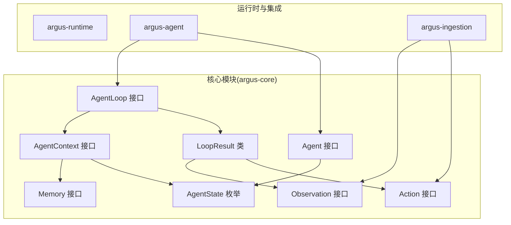
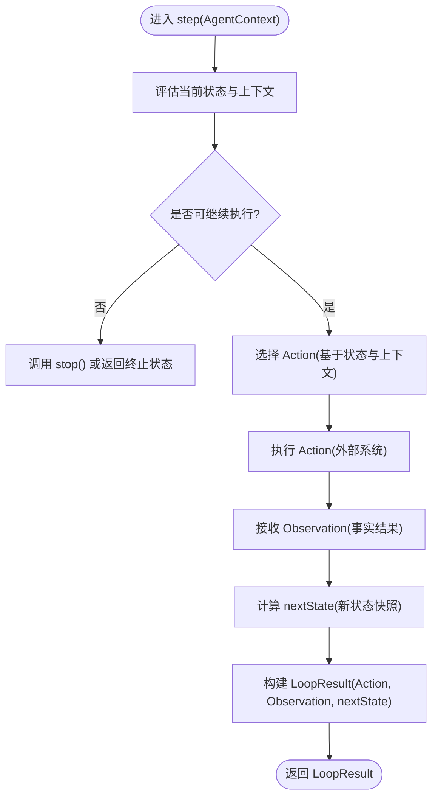
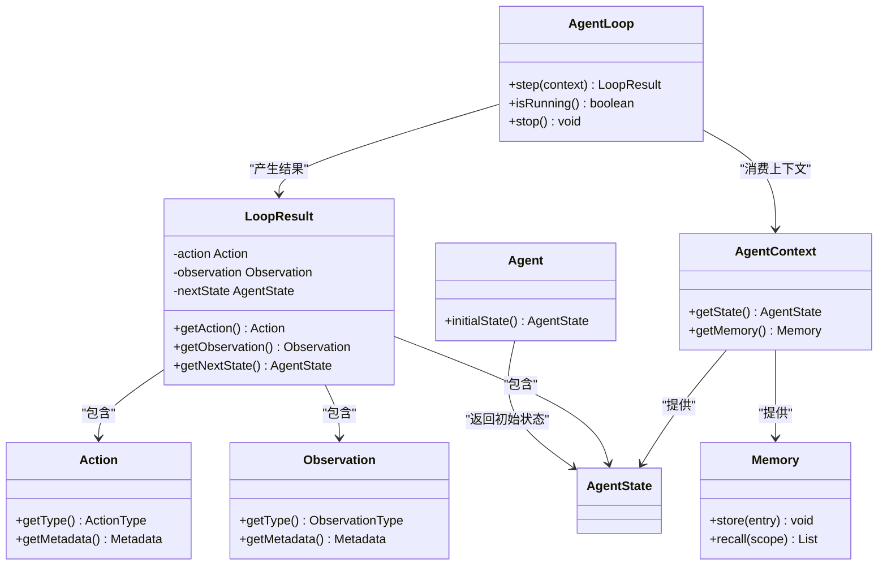

# Agent接口API

<cite>
**本文引用的文件**
- [Agent.java](file://argus-core/src/main/java/io/argus/core/agent/Agent.java)
- [AgentState.java](file://argus-core/src/main/java/io/argus/core/agent/AgentState.java)
- [AgentContext.java](file://argus-core/src/main/java/io/argus/core/agent/AgentContext.java)
- [AgentLoop.java](file://argus-core/src/main/java/io/argus/core/agent/AgentLoop.java)
- [LoopResult.java](file://argus-core/src/main/java/io/argus/core/agent/LoopResult.java)
- [Action.java](file://argus-core/src/main/java/io/argus/core/action/Action.java)
- [ActionType.java](file://argus-core/src/main/java/io/argus/core/action/ActionType.java)
- [Observation.java](file://argus-core/src/main/java/io/argus/core/observation/Observation.java)
- [ObservationType.java](file://argus-core/src/main/java/io/argus/core/observation/ObservationType.java)
- [Memory.java](file://argus-core/src/main/java/io/argus/core/memory/Memory.java)
- [AgentExecutionException.java](file://argus-core/src/main/java/io/argus/core/error/AgentExecutionException.java)
- [package-info.java](file://argus-core/src/main/java/io/argus/core/agent/package-info.java)
- [readme.md](file://readme.md)
</cite>

## 目录
1. [简介](#简介)
2. [项目结构](#项目结构)
3. [核心组件](#核心组件)
4. [架构总览](#架构总览)
5. [详细组件分析](#详细组件分析)
6. [依赖关系分析](#依赖关系分析)
7. [性能考量](#性能考量)
8. [故障排查指南](#故障排查指南)
9. [结论](#结论)
10. [附录](#附录)

## 简介
本文件面向开发者与架构师，系统性梳理 Agent 接口体系的 API 规范与实现约束，重点覆盖以下主题：
- Agent 接口的核心方法与职责边界
- initialState() 方法的实现要求与返回值规范
- AgentState 状态对象的结构、快照语义与管理要点
- AgentLoop 执行循环的工作原理与 step() 方法的实现模式
- AgentContext 上下文对象的作用域、数据传递与职责分离
- 自定义 Agent 的完整实现示例（状态初始化、决策逻辑、执行流程）
- Agent 接口在代理系统中的核心地位与扩展方式

本指南以仓库现有源码为依据，确保所有说明均可在代码中找到对应注释与契约约束。

## 项目结构
Argus 采用模块化分层组织，Agent 接口位于核心模块 argus-core 的 agent 包内，围绕 Agent、AgentLoop、AgentState、AgentContext、LoopResult 以及 Action/Observation 等核心抽象构建。



图表来源
- [Agent.java](file://argus-core/src/main/java/io/argus/core/agent/Agent.java#L1-L11)
- [AgentLoop.java](file://argus-core/src/main/java/io/argus/core/agent/AgentLoop.java#L1-L118)
- [AgentState.java](file://argus-core/src/main/java/io/argus/core/agent/AgentState.java#L1-L81)
- [AgentContext.java](file://argus-core/src/main/java/io/argus/core/agent/AgentContext.java#L1-L98)
- [LoopResult.java](file://argus-core/src/main/java/io/argus/core/agent/LoopResult.java#L1-L115)
- [Action.java](file://argus-core/src/main/java/io/argus/core/action/Action.java#L1-L43)
- [Observation.java](file://argus-core/src/main/java/io/argus/core/observation/Observation.java#L1-L37)
- [Memory.java](file://argus-core/src/main/java/io/argus/core/memory/Memory.java#L1-L15)

章节来源
- [package-info.java](file://argus-core/src/main/java/io/argus/core/agent/package-info.java#L1-L23)
- [readme.md](file://readme.md#L1-L28)

## 核心组件
本节对 Agent 接口及其相关核心类型进行逐项解析，明确职责边界与契约约束。

- Agent 接口
  - 唯一方法：initialState()
  - 职责：返回代理的初始状态快照，作为执行循环的起点
  - 返回值：AgentState 实例，表示初始逻辑快照

- AgentState 枚举
  - 语义：完整的、权威的代理状态快照，代表某一时刻的全部必要信息
  - 不可变性：必须视为不可变；任何状态变更必须产生新实例
  - 快照语义：完整快照，不依赖历史状态即可解释
  - 可审计性：支持确定性回放、时间旅行调试、分支与审计

- AgentContext 接口
  - 语义：代理执行期间的可变工作环境，仅存在于实时执行阶段
  - 职责：短期推理缓冲、外部服务客户端、限流器、度量与日志辅助、非权威记忆访问
  - 禁止：不得承载权威状态、不得用于重建 AgentState、不得存储不可逆决策、不得隐藏副作用

- AgentLoop 接口
  - 语义：通过显式决策步骤驱动代理执行，提供可审计、可回放、可控制的单步执行模型
  - 关键方法：
    - step(AgentContext): LoopResult
    - isRunning(): boolean
    - stop(): void
  - 约束：每一步必须是确定的、可观测的、可审计的；不得包含无界循环；长运行行为需拆分为多次 step

- LoopResult 类
  - 语义：单步执行的不可变结果，记录“意图”、“观测”与“状态转移”
  - 字段：Action、Observation、AgentState(nextState)
  - 回放契约：给定相同初始 AgentState 与有序 LoopResult 序列，可被动回放并重现状态转移

- Action/Observation
  - Action：代理意图的声明式表达，通过 ActionType 分类，Metadata 承载额外信息
  - Observation：代理感知到的事实，通过 ObservationType 分类，Metadata 承载上下文

- Memory
  - 语义：非权威记忆访问接口，支持存储与回忆，供 AgentContext 使用

章节来源
- [Agent.java](file://argus-core/src/main/java/io/argus/core/agent/Agent.java#L1-L11)
- [AgentState.java](file://argus-core/src/main/java/io/argus/core/agent/AgentState.java#L1-L81)
- [AgentContext.java](file://argus-core/src/main/java/io/argus/core/agent/AgentContext.java#L1-L98)
- [AgentLoop.java](file://argus-core/src/main/java/io/argus/core/agent/AgentLoop.java#L1-L118)
- [LoopResult.java](file://argus-core/src/main/java/io/argus/core/agent/LoopResult.java#L1-L115)
- [Action.java](file://argus-core/src/main/java/io/argus/core/action/Action.java#L1-L43)
- [Observation.java](file://argus-core/src/main/java/io/argus/core/observation/Observation.java#L1-L37)
- [Memory.java](file://argus-core/src/main/java/io/argus/core/memory/Memory.java#L1-L15)

## 架构总览
Agent 接口体系以“状态快照 + 循环步骤 + 上下文隔离”的方式构建可审计、可回放的执行模型。AgentLoop 将实时执行与回放解耦：实时执行时使用 AgentContext 提供的可变工作空间；回放时仅依赖 LoopResult 与 AgentState 的权威快照。

```mermaid
sequenceDiagram
participant Runner as "执行器"
participant Agent as "Agent"
participant Loop as "AgentLoop"
participant Ctx as "AgentContext"
participant Act as "Action"
participant Obs as "Observation"
participant State as "AgentState"
participant Result as "LoopResult"
Runner->>Agent : 调用 initialState()
Agent-->>Runner : 返回初始 AgentState
Runner->>Loop : 初始化循环(基于初始状态)
loop 每一步
Runner->>Ctx : 准备上下文
Runner->>Loop : step(Ctx)
Loop->>Agent : 基于当前状态与上下文选择 Action
Agent-->>Loop : Action
Loop->>Act : 执行 Action(外部系统)
Act-->>Loop : 返回 Observation
Loop->>State : 计算 nextState(新状态快照)
Loop-->>Runner : 返回 LoopResult(Action, Observation, nextState)
Runner->>Runner : 存储/审计 LoopResult
end
```

图表来源
- [Agent.java](file://argus-core/src/main/java/io/argus/core/agent/Agent.java#L1-L11)
- [AgentLoop.java](file://argus-core/src/main/java/io/argus/core/agent/AgentLoop.java#L1-L118)
- [LoopResult.java](file://argus-core/src/main/java/io/argus/core/agent/LoopResult.java#L1-L115)
- [AgentContext.java](file://argus-core/src/main/java/io/argus/core/agent/AgentContext.java#L1-L98)

## 详细组件分析

### Agent 接口与 initialState() 方法
- 方法签名与职责
  - 方法：initialState()
  - 返回：AgentState 实例，表示代理的初始逻辑快照
  - 语义：作为 AgentLoop 的起点，确保后续执行与回放的确定性

- 实现要求
  - 必须返回一个完整的、权威的 AgentState 快照
  - 不得依赖外部系统或全局状态
  - 不得暴露可变性；返回值应视为不可变

- 返回值规范
  - 类型：AgentState
  - 语义：完整快照，可独立解释
  - 一致性：同一逻辑状态应等价（结构相等）

章节来源
- [Agent.java](file://argus-core/src/main/java/io/argus/core/agent/Agent.java#L1-L11)
- [AgentState.java](file://argus-core/src/main/java/io/argus/core/agent/AgentState.java#L1-L81)

### AgentState 状态对象
- 结构与语义
  - 类型：枚举（AgentState）
  - 语义：代理在某一时刻的完整、权威快照
  - 快照特性：非增量、不依赖历史状态

- 不可变性契约
  - 必须视为不可变；禁止暴露修改器或原地修改
  - 任何状态变更必须产生新实例

- 回放与审计
  - 支持确定性回放：仅依赖 LoopResult 序列与初始状态
  - 支持时间旅行调试、状态分支与审计

- 相等性与身份
  - 建议实现结构相等；对象身份不得用于正确性判断

章节来源
- [AgentState.java](file://argus-core/src/main/java/io/argus/core/agent/AgentState.java#L1-L81)

### AgentContext 上下文对象
- 作用域与生命周期
  - 仅存在于实时执行阶段；回放时可为空或替换为无操作实现
  - 不应被当作隐藏状态；不可用于重建 AgentState

- 职责边界
  - 允许：短期推理缓冲、外部服务客户端、限流器、度量与日志、非权威记忆访问
  - 禁止：承载权威状态、存储不可逆决策、隐藏副作用

- 数据传递机制
  - 通过 getState() 获取当前 AgentState 快照
  - 通过 getMemory() 访问非权威记忆（如检索、缓存）

章节来源
- [AgentContext.java](file://argus-core/src/main/java/io/argus/core/agent/AgentContext.java#L1-L98)
- [Memory.java](file://argus-core/src/main/java/io/argus/core/memory/Memory.java#L1-L15)

### AgentLoop 执行循环与 step() 方法
- 工作原理
  - 通过显式决策步骤推进代理状态
  - 每次 step 代表一次原子决策周期：评估上下文与状态 → 产出 Action → 接收 Observation → 过渡到新 AgentState

- step() 方法实现模式
  - 输入：AgentContext（包含当前状态与可变工作空间）
  - 输出：LoopResult（包含 Action、Observation、nextState）
  - 约束：确定性、可观测、可审计；不得包含无界循环；长运行行为需拆分为多次 step

- 生命周期控制
  - isRunning()：指示是否继续执行
  - stop()：请求终止（可选择优雅关闭）



图表来源
- [AgentLoop.java](file://argus-core/src/main/java/io/argus/core/agent/AgentLoop.java#L1-L118)
- [LoopResult.java](file://argus-core/src/main/java/io/argus/core/agent/LoopResult.java#L1-L115)

章节来源
- [AgentLoop.java](file://argus-core/src/main/java/io/argus/core/agent/AgentLoop.java#L1-L118)
- [LoopResult.java](file://argus-core/src/main/java/io/argus/core/agent/LoopResult.java#L1-L115)

### LoopResult 执行结果
- 结构字段
  - Action：代理意图
  - Observation：事实结果
  - nextState：新状态快照

- 不可变性与自足性
  - 必须不可变、自包含
  - 足以支持确定性回放

- 回放契约
  - 给定相同初始 AgentState 与有序 LoopResult 序列，可被动回放并重现状态转移
  - 回放必须无副作用、无外部依赖、无时钟/随机性

章节来源
- [LoopResult.java](file://argus-core/src/main/java/io/argus/core/agent/LoopResult.java#L1-L115)

### Action 与 Observation
- Action
  - 语义：代理意图的声明式表达
  - 分类：通过 ActionType 表达高层语义（DECIDE、REQUEST、TRANSFORM、STORE、EMIT）
  - 元数据：通过 Metadata 承载领域特定信息

- Observation
  - 语义：代理感知到的事实
  - 分类：通过 ObservationType 表达高层语义（STATE、DATA、RESPONSE、ERROR、EVENT）
  - 元数据：通过 Metadata 承载上下文信息

章节来源
- [Action.java](file://argus-core/src/main/java/io/argus/core/action/Action.java#L1-L43)
- [ActionType.java](file://argus-core/src/main/java/io/argus/core/action/ActionType.java#L1-L143)
- [Observation.java](file://argus-core/src/main/java/io/argus/core/observation/Observation.java#L1-L37)
- [ObservationType.java](file://argus-core/src/main/java/io/argus/core/observation/ObservationType.java#L1-L117)

### 自定义 Agent 实现示例（步骤说明）
以下为自定义 Agent 的实现步骤说明，不包含具体代码内容，仅给出实现路径与注意事项：

- 步骤一：实现 Agent 接口
  - 实现 initialState()，返回初始 AgentState 快照
  - 示例路径参考：[Agent.java](file://argus-core/src/main/java/io/argus/core/agent/Agent.java#L1-L11)

- 步骤二：定义 AgentState
  - 设计状态结构，确保完整快照与不可变性
  - 示例路径参考：[AgentState.java](file://argus-core/src/main/java/io/argus/core/agent/AgentState.java#L1-L81)

- 步骤三：实现 AgentLoop
  - 实现 step(AgentContext)，在其中：
    - 从 AgentContext.getState() 获取当前状态
    - 基于状态与上下文选择 Action
    - 执行 Action 并接收 Observation
    - 计算 nextState 并封装为 LoopResult
  - 示例路径参考：[AgentLoop.java](file://argus-core/src/main/java/io/argus/core/agent/AgentLoop.java#L1-L118)、[LoopResult.java](file://argus-core/src/main/java/io/argus/core/agent/LoopResult.java#L1-L115)

- 步骤四：准备 AgentContext
  - 提供 getState() 与 getMemory() 的实现
  - 严格遵守“可变工作空间”与“不可承载权威状态”的边界
  - 示例路径参考：[AgentContext.java](file://argus-core/src/main/java/io/argus/core/agent/AgentContext.java#L1-L98)、[Memory.java](file://argus-core/src/main/java/io/argus/core/memory/Memory.java#L1-L15)

- 步骤五：决策与执行流程
  - 在 step() 中遵循“评估 → 决策 → 执行 → 观测 → 状态过渡”的原子周期
  - 示例路径参考：[Action.java](file://argus-core/src/main/java/io/argus/core/action/Action.java#L1-L43)、[Observation.java](file://argus-core/src/main/java/io/argus/core/observation/Observation.java#L1-L37)

- 步骤六：回放与审计
  - 保证 LoopResult 与 AgentState 的可审计性与确定性
  - 示例路径参考：[LoopResult.java](file://argus-core/src/main/java/io/argus/core/agent/LoopResult.java#L1-L115)

章节来源
- [Agent.java](file://argus-core/src/main/java/io/argus/core/agent/Agent.java#L1-L11)
- [AgentLoop.java](file://argus-core/src/main/java/io/argus/core/agent/AgentLoop.java#L1-L118)
- [LoopResult.java](file://argus-core/src/main/java/io/argus/core/agent/LoopResult.java#L1-L115)
- [AgentContext.java](file://argus-core/src/main/java/io/argus/core/agent/AgentContext.java#L1-L98)
- [Memory.java](file://argus-core/src/main/java/io/argus/core/memory/Memory.java#L1-L15)
- [Action.java](file://argus-core/src/main/java/io/argus/core/action/Action.java#L1-L43)
- [Observation.java](file://argus-core/src/main/java/io/argus/core/observation/Observation.java#L1-L37)

## 依赖关系分析
Agent 接口体系各组件之间的依赖关系如下：



图表来源
- [Agent.java](file://argus-core/src/main/java/io/argus/core/agent/Agent.java#L1-L11)
- [AgentLoop.java](file://argus-core/src/main/java/io/argus/core/agent/AgentLoop.java#L1-L118)
- [AgentContext.java](file://argus-core/src/main/java/io/argus/core/agent/AgentContext.java#L1-L98)
- [LoopResult.java](file://argus-core/src/main/java/io/argus/core/agent/LoopResult.java#L1-L115)
- [Action.java](file://argus-core/src/main/java/io/argus/core/action/Action.java#L1-L43)
- [Observation.java](file://argus-core/src/main/java/io/argus/core/observation/Observation.java#L1-L37)
- [Memory.java](file://argus-core/src/main/java/io/argus/core/memory/Memory.java#L1-L15)

章节来源
- [Agent.java](file://argus-core/src/main/java/io/argus/core/agent/Agent.java#L1-L11)
- [AgentLoop.java](file://argus-core/src/main/java/io/argus/core/agent/AgentLoop.java#L1-L118)
- [AgentContext.java](file://argus-core/src/main/java/io/argus/core/agent/AgentContext.java#L1-L98)
- [LoopResult.java](file://argus-core/src/main/java/io/argus/core/agent/LoopResult.java#L1-L115)
- [Action.java](file://argus-core/src/main/java/io/argus/core/action/Action.java#L1-L43)
- [Observation.java](file://argus-core/src/main/java/io/argus/core/observation/Observation.java#L1-L37)
- [Memory.java](file://argus-core/src/main/java/io/argus/core/memory/Memory.java#L1-L15)

## 性能考量
- 不可变状态与快照
  - AgentState 的不可变性与完整快照有利于缓存与并发安全，但需注意对象创建成本
  - 建议在状态变更频繁场景中复用稳定不变的部分，减少不必要的对象分配

- 回放与审计
  - LoopResult 的自足性与确定性回放要求避免外部依赖，有助于提升可重复性与调试效率
  - 建议在回放路径中禁用随机数与外部时钟，确保纯函数式执行

- 上下文隔离
  - AgentContext 的可变性仅限于执行期，避免在回放中引入不确定性
  - 建议将外部服务调用与副作用通过 Action/Observation 明确化，保持上下文的轻量

- 循环粒度
  - 长运行行为拆分为多次 step，有助于控制单步耗时与资源占用
  - 建议在 step 中设置合理的超时与重试策略，避免阻塞

## 故障排查指南
- 常见问题与定位
  - 状态不一致：检查 AgentState 是否满足不可变性与完整快照要求
    - 参考：[AgentState.java](file://argus-core/src/main/java/io/argus/core/agent/AgentState.java#L1-L81)
  - 回放失败：确认 LoopResult 是否自足，回放是否依赖外部状态
    - 参考：[LoopResult.java](file://argus-core/src/main/java/io/argus/core/agent/LoopResult.java#L1-L115)
  - 上下文污染：检查 AgentContext 是否承载权威状态或隐藏副作用
    - 参考：[AgentContext.java](file://argus-core/src/main/java/io/argus/core/agent/AgentContext.java#L1-L98)
  - 执行卡死：检查 step 是否存在无界循环或未拆分的长运行任务
    - 参考：[AgentLoop.java](file://argus-core/src/main/java/io/argus/core/agent/AgentLoop.java#L1-L118)

- 异常处理
  - Agent 执行异常建议封装为专用异常类型，便于统一处理与审计
    - 参考：[AgentExecutionException.java](file://argus-core/src/main/java/io/argus/core/error/AgentExecutionException.java#L1-L8)

章节来源
- [AgentState.java](file://argus-core/src/main/java/io/argus/core/agent/AgentState.java#L1-L81)
- [LoopResult.java](file://argus-core/src/main/java/io/argus/core/agent/LoopResult.java#L1-L115)
- [AgentContext.java](file://argus-core/src/main/java/io/argus/core/agent/AgentContext.java#L1-L98)
- [AgentLoop.java](file://argus-core/src/main/java/io/argus/core/agent/AgentLoop.java#L1-L118)
- [AgentExecutionException.java](file://argus-core/src/main/java/io/argus/core/error/AgentExecutionException.java#L1-L8)

## 结论
Agent 接口体系通过“状态快照 + 循环步骤 + 上下文隔离”的设计，实现了可审计、可控制、可复现的代理执行模型。实现者应严格遵循：
- initialState() 返回完整、权威的 AgentState 快照
- AgentState 的不可变性与完整快照语义
- AgentContext 的可变性与职责边界
- AgentLoop 的原子步骤与确定性约束
- LoopResult 的自足性与回放契约

在此基础上，结合 Action/Observation 的语义分类与 Memory 的非权威访问，可构建高可维护、可扩展的代理系统。

## 附录
- 设计原则与模块概览
  - 参考：[readme.md](file://readme.md#L1-L28)
  - package 注释说明了 Agent 模型的定位与边界
    - 参考：[package-info.java](file://argus-core/src/main/java/io/argus/core/agent/package-info.java#L1-L23)