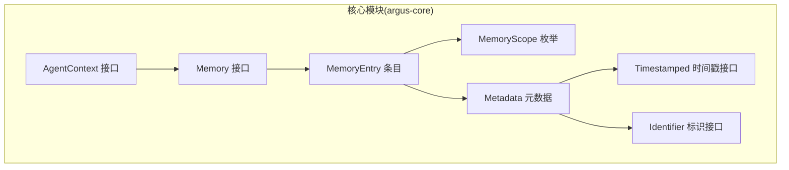
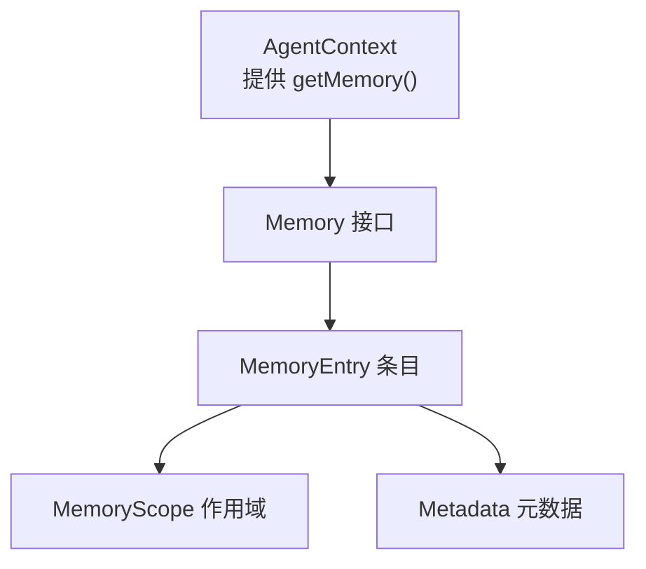
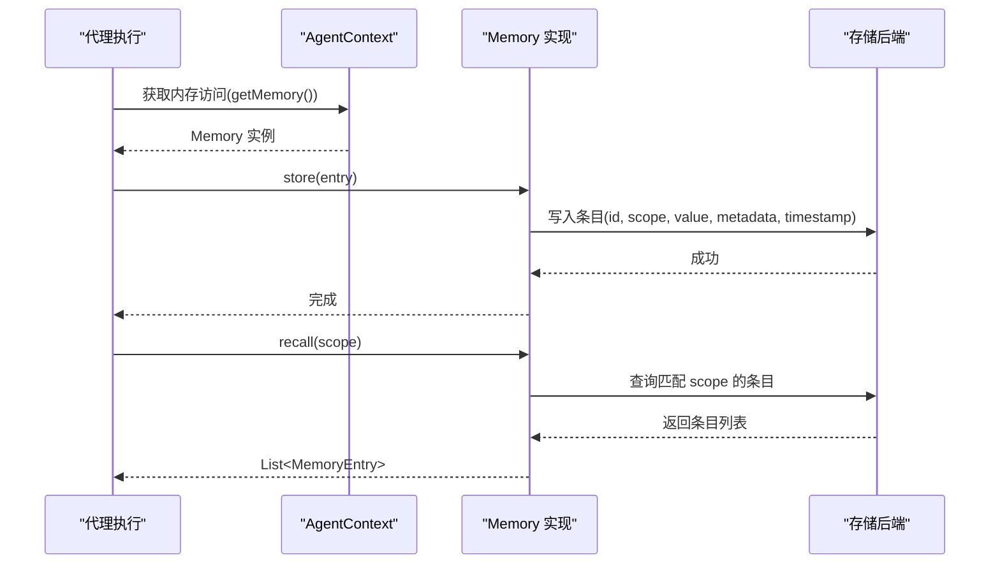
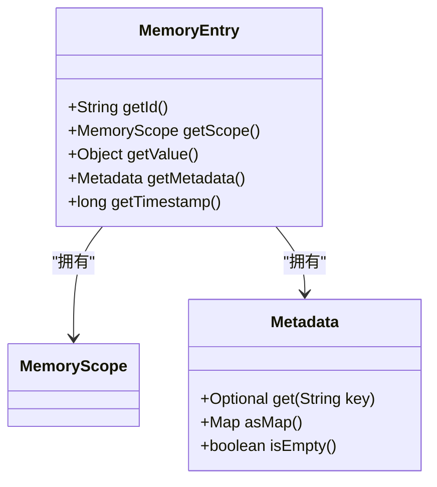
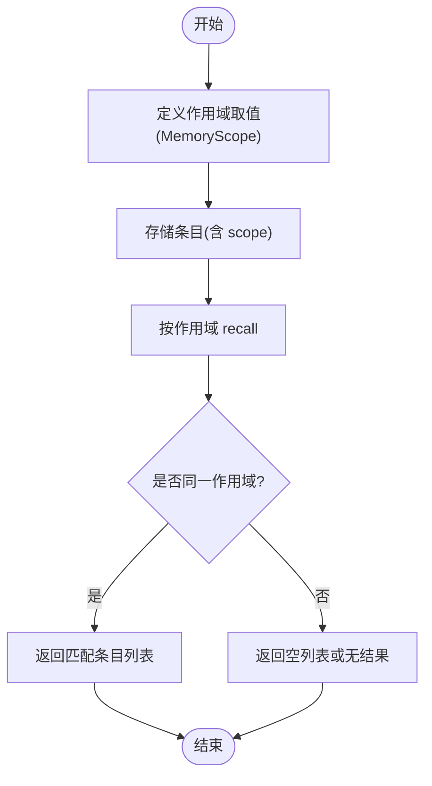
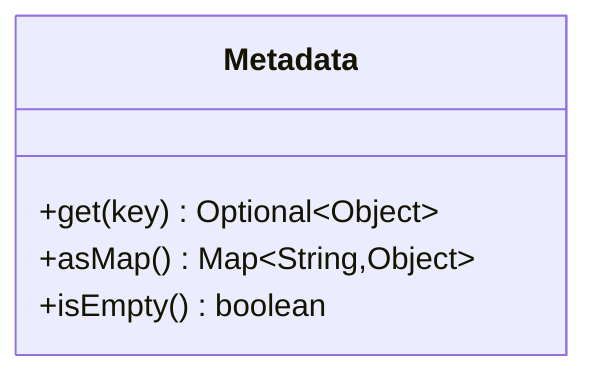
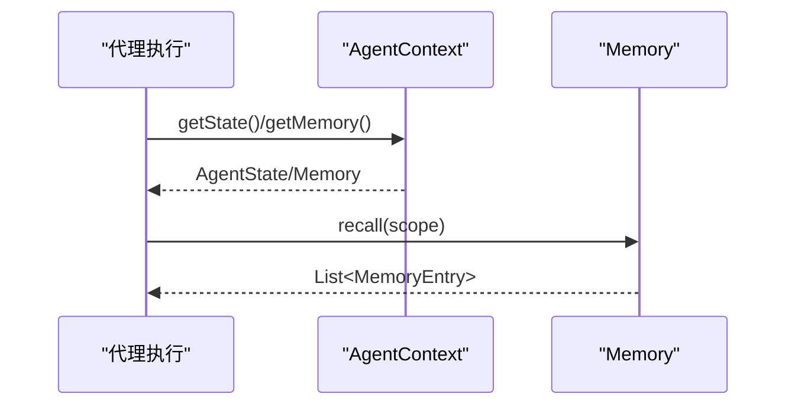
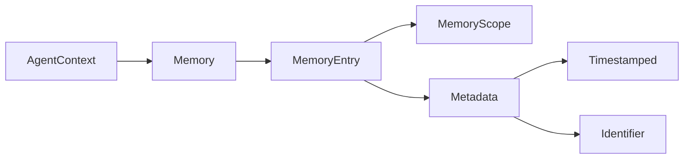

# Memory内存API

<cite>
**本文引用的文件**
- [Memory.java](file://argus-core/src/main/java/io/argus/core/memory/Memory.java)
- [MemoryEntry.java](file://argus-core/src/main/java/io/argus/core/memory/MemoryEntry.java)
- [MemoryScope.java](file://argus-core/src/main/java/io/argus/core/memory/MemoryScope.java)
- [package-info.java](file://argus-core/src/main/java/io/argus/core/memory/package-info.java)
- [AgentContext.java](file://argus-core/src/main/java/io/argus/core/agent/AgentContext.java)
- [Metadata.java](file://argus-core/src/main/java/io/argus/core/model/Metadata.java)
- [Timestamped.java](file://argus-core/src/main/java/io/argus/core/model/Timestamped.java)
- [Identifier.java](file://argus-core/src/main/java/io/argus/core/model/Identifier.java)
- [readme.md](file://readme.md)
</cite>

## 目录
1. [简介](#简介)
2. [项目结构](#项目结构)
3. [核心组件](#核心组件)
4. [架构总览](#架构总览)
5. [详细组件分析](#详细组件分析)
6. [依赖关系分析](#依赖关系分析)
7. [性能考量](#性能考量)
8. [故障排查指南](#故障排查指南)
9. [结论](#结论)
10. [附录](#附录)

## 简介
本文件为 Memory 内存管理系统的完整 API 文档，聚焦以下目标：
- 全面记录 Memory 接口的方法签名、参数规范与返回值语义
- 解释 MemoryEntry 数据条目的结构、字段含义与生命周期管理
- 阐述 MemoryScope 作用域的概念与隔离机制，以及不同作用域间的访问规则
- 提供在代理执行过程中进行数据存储与检索的实践示例与流程图
- 总结内存系统的性能特性与最佳实践（缓存策略、内存回收等）

此外，结合 AgentContext 的职责边界，明确 Memory 在“可审计、可控制、可复现”的运行时中的定位：作为非权威性、仅在执行期存在的“回忆”通道，不参与状态重建。

章节来源
- file://readme.md#L1-L28

## 项目结构
Memory 相关的核心位于 core 模块的 memory 包，同时与 agent 和 model 包存在清晰的边界耦合：
- memory 包：定义 Memory 接口、MemoryEntry 条目、MemoryScope 作用域
- agent 包：AgentContext 提供 getMemory() 访问入口
- model 包：Metadata、Timestamped、Identifier 等通用模型支撑

图表来源
- [Memory.java](file://argus-core/src/main/java/io/argus/core/memory/Memory.java#L1-L15)
- [MemoryEntry.java](file://argus-core/src/main/java/io/argus/core/memory/MemoryEntry.java#L1-L53)
- [MemoryScope.java](file://argus-core/src/main/java/io/argus/core/memory/MemoryScope.java#L1-L8)
- [AgentContext.java](file://argus-core/src/main/java/io/argus/core/agent/AgentContext.java#L1-L98)
- [Metadata.java](file://argus-core/src/main/java/io/argus/core/model/Metadata.java#L1-L34)
- [Timestamped.java](file://argus-core/src/main/java/io/argus/core/model/Timestamped.java#L1-L8)
- [Identifier.java](file://argus-core/src/main/java/io/argus/core/model/Identifier.java#L1-L8)

章节来源
- file://argus-core/src/main/java/io/argus/core/memory/package-info.java#L1-L21

## 核心组件
本节从 API 角度梳理 Memory 接口与相关数据结构，帮助快速理解其职责与用法。

- Memory 接口
  - 方法：store(MemoryEntry)
    - 功能：持久化一条 MemoryEntry 到内存存储
    - 参数：entry - 要存储的条目对象
    - 返回：无
    - 复杂度：由具体实现决定；建议 O(1) 或基于索引的 O(log N)
  - 方法：recall(MemoryScope)
    - 功能：按作用域检索已存储的条目集合
    - 参数：scope - 查询的作用域标识
    - 返回：List<MemoryEntry>，按实现排序或时间顺序返回匹配条目
    - 复杂度：取决于索引策略；建议 O(k + log N)，k 为命中数量

- MemoryEntry 条目
  - 字段：id、scope、value、metadata、timestamp
  - 语义：
    - id：条目唯一标识符，便于后续检索与去重
    - scope：所属作用域，决定可见性与隔离范围
    - value：存储的任意对象（可为简单值、结构化对象或序列化后的数据）
    - metadata：附加属性集合，提供键值对元数据
    - timestamp：条目写入时间戳，用于排序与审计
  - 生命周期：由实现方负责创建、存储、过期与回收；建议提供 TTL、LRU 等策略

- MemoryScope 作用域
  - 定义：枚举类型，用于隔离不同维度的数据可见性
  - 当前现状：接口声明但枚举体为空，需在具体实现中填充有效取值
  - 使用建议：例如按会话、任务、阶段划分作用域，recall 时仅返回同作用域内的条目

- Metadata 元数据
  - 字段：不可变 Map<String, Object>
  - 方法：get(key) -> Optional<Object>、asMap() -> Map、isEmpty() -> boolean
  - 用途：为条目提供扩展属性（如来源、标签、来源 URL、版本号等）

章节来源
- file://argus-core/src/main/java/io/argus/core/memory/Memory.java#L1-L15
- file://argus-core/src/main/java/io/argus/core/memory/MemoryEntry.java#L1-L53
- file://argus-core/src/main/java/io/argus/core/memory/MemoryScope.java#L1-L8
- file://argus-core/src/main/java/io/argus/core/model/Metadata.java#L1-L34

## 架构总览
Memory 在代理执行上下文中的角色定位：
- AgentContext 提供 getMemory() 访问入口，用于非权威性的“回忆”与临时缓冲
- Memory 作为只读/弱一致的回溯通道，不参与状态重建
- Metadata 为条目提供可审计的扩展属性

图表来源
- [AgentContext.java](file://argus-core/src/main/java/io/argus/core/agent/AgentContext.java#L92-L98)
- [Memory.java](file://argus-core/src/main/java/io/argus/core/memory/Memory.java#L1-L15)
- [MemoryEntry.java](file://argus-core/src/main/java/io/argus/core/memory/MemoryEntry.java#L1-L53)
- [Metadata.java](file://argus-core/src/main/java/io/argus/core/model/Metadata.java#L1-L34)

## 详细组件分析

### Memory 接口与调用流程
- 存储流程（store）
  - 输入：MemoryEntry（包含 id、scope、value、metadata、timestamp）
  - 处理：实现方将条目写入内部存储，并维护索引（如按 id、scope、时间）
  - 输出：无异常即完成
- 回忆流程（recall）
  - 输入：MemoryScope
  - 处理：实现方根据 scope 过滤条目，按时间或其他策略排序
  - 输出：匹配的 MemoryEntry 列表

图表来源
- [AgentContext.java](file://argus-core/src/main/java/io/argus/core/agent/AgentContext.java#L92-L98)
- [Memory.java](file://argus-core/src/main/java/io/argus/core/memory/Memory.java#L1-L15)
- [MemoryEntry.java](file://argus-core/src/main/java/io/argus/core/memory/MemoryEntry.java#L1-L53)

章节来源
- file://argus-core/src/main/java/io/argus/core/memory/Memory.java#L1-L15
- file://argus-core/src/main/java/io/argus/core/agent/AgentContext.java#L92-L98

### MemoryEntry 类结构与字段语义

图表来源
- [MemoryEntry.java](file://argus-core/src/main/java/io/argus/core/memory/MemoryEntry.java#L1-L53)
- [MemoryScope.java](file://argus-core/src/main/java/io/argus/core/memory/MemoryScope.java#L1-L8)
- [Metadata.java](file://argus-core/src/main/java/io/argus/core/model/Metadata.java#L1-L34)

章节来源
- file://argus-core/src/main/java/io/argus/core/memory/MemoryEntry.java#L1-L53
- file://argus-core/src/main/java/io/argus/core/model/Metadata.java#L1-L34

### MemoryScope 作用域与隔离机制
- 作用域概念
  - 通过 MemoryScope 对条目进行逻辑隔离，recall 时仅返回同作用域内的条目
  - 适合按会话、任务、阶段等维度划分数据可见性
- 当前现状
  - MemoryScope 枚举体为空，需要在具体实现中定义有效取值
- 访问规则
  - 同一作用域内可互相 recall
  - 不同作用域之间默认不可见（除非实现层显式跨域聚合）

图表来源
- [MemoryScope.java](file://argus-core/src/main/java/io/argus/core/memory/MemoryScope.java#L1-L8)
- [Memory.java](file://argus-core/src/main/java/io/argus/core/memory/Memory.java#L1-L15)

章节来源
- file://argus-core/src/main/java/io/argus/core/memory/MemoryScope.java#L1-L8
- file://argus-core/src/main/java/io/argus/core/memory/Memory.java#L1-L15

### Metadata 元数据模型
- 不可变 Map 包装，提供安全访问
- 支持按键查询、整体导出与判空
- 建议存放来源、标签、版本、来源 URL 等审计信息

图表来源
- [Metadata.java](file://argus-core/src/main/java/io/argus/core/model/Metadata.java#L1-L34)

章节来源
- file://argus-core/src/main/java/io/argus/core/model/Metadata.java#L1-L34

### 与 AgentContext 的集成
- AgentContext 提供 getMemory()，用于在执行期间访问 Memory
- 明确职责边界：AgentContext 是短暂、不可回放的工作区，不应承载权威状态
- Memory 作为“回忆”通道，仅用于非权威性检索与临时缓冲

图表来源
- [AgentContext.java](file://argus-core/src/main/java/io/argus/core/agent/AgentContext.java#L92-L98)
- [Memory.java](file://argus-core/src/main/java/io/argus/core/memory/Memory.java#L1-L15)

章节来源
- file://argus-core/src/main/java/io/argus/core/agent/AgentContext.java#L92-L98

## 依赖关系分析
- Memory 依赖 MemoryEntry 与 MemoryScope
- MemoryEntry 依赖 Metadata
- AgentContext 依赖 Memory，用于执行期访问
- Metadata 与 Timestamped、Identifier 为通用模型接口，提供时间戳与标识能力

图表来源
- [AgentContext.java](file://argus-core/src/main/java/io/argus/core/agent/AgentContext.java#L1-L98)
- [Memory.java](file://argus-core/src/main/java/io/argus/core/memory/Memory.java#L1-L15)
- [MemoryEntry.java](file://argus-core/src/main/java/io/argus/core/memory/MemoryEntry.java#L1-L53)
- [MemoryScope.java](file://argus-core/src/main/java/io/argus/core/memory/MemoryScope.java#L1-L8)
- [Metadata.java](file://argus-core/src/main/java/io/argus/core/model/Metadata.java#L1-L34)
- [Timestamped.java](file://argus-core/src/main/java/io/argus/core/model/Timestamped.java#L1-L8)
- [Identifier.java](file://argus-core/src/main/java/io/argus/core/model/Identifier.java#L1-L8)

章节来源
- file://argus-core/src/main/java/io/argus/core/memory/Memory.java#L1-L15
- file://argus-core/src/main/java/io/argus/core/memory/MemoryEntry.java#L1-L53
- file://argus-core/src/main/java/io/argus/core/memory/MemoryScope.java#L1-L8
- file://argus-core/src/main/java/io/argus/core/agent/AgentContext.java#L1-L98
- file://argus-core/src/main/java/io/argus/core/model/Metadata.java#L1-L34

## 性能考量
- 存储复杂度
  - store：建议基于索引的 O(1) 或 O(log N) 写入
  - recall：建议 O(k + log N)，k 为命中数量；可通过 scope+时间复合索引优化
- 内存回收
  - 建议实现 TTL 清理、LRU 淘汰、容量上限等策略
  - 对高频条目可采用分片/分区存储，降低锁竞争
- 缓存策略
  - 将热点条目放入本地缓存，减少重复检索
  - 对大对象建议延迟加载或懒解析
- 并发与一致性
  - recall 应保证快照一致性，避免并发写入导致的脏读
  - 可采用读写分离、MVCC 或版本号机制

## 故障排查指南
- recall 返回空
  - 检查传入的 MemoryScope 是否正确
  - 确认条目是否已成功 store，且未被回收
- 存储失败
  - 核对 MemoryEntry 字段完整性（id、scope、value、metadata、timestamp）
  - 检查实现层的容量限制与异常处理
- 性能问题
  - 分析 recall 的过滤条件与索引覆盖情况
  - 评估 TTL 与清理频率是否合理
- 审计与溯源
  - 使用 Metadata 记录来源、版本、标签等信息，便于回溯

## 结论
Memory 内存系统以简洁的接口与清晰的职责边界，为代理执行提供了非权威性的“回忆”通道。通过 MemoryEntry 的标准化结构与 Metadata 的扩展能力，配合 MemoryScope 的作用域隔离，可在保证可审计与可复现的前提下，灵活支持临时数据的存储与检索。实际部署中应结合业务场景选择合适的索引、缓存与回收策略，确保性能与可靠性。

## 附录

### API 方法参考
- Memory.store(entry: MemoryEntry): void
  - 存储一条条目到内存
- Memory.recall(scope: MemoryScope): List<MemoryEntry>
  - 按作用域检索条目列表

章节来源
- file://argus-core/src/main/java/io/argus/core/memory/Memory.java#L1-L15

### 数据条目字段说明
- id: String
  - 唯一标识符
- scope: MemoryScope
  - 所属作用域
- value: Object
  - 存储的任意对象
- metadata: Metadata
  - 键值对元数据
- timestamp: long
  - 写入时间戳

章节来源
- file://argus-core/src/main/java/io/argus/core/memory/MemoryEntry.java#L1-L53
- file://argus-core/src/main/java/io/argus/core/model/Metadata.java#L1-L34

### 作用域与隔离
- MemoryScope 枚举体当前为空，需在实现中定义有效取值
- recall 默认仅返回同作用域内的条目

章节来源
- file://argus-core/src/main/java/io/argus/core/memory/MemoryScope.java#L1-L8
- file://argus-core/src/main/java/io/argus/core/memory/Memory.java#L1-L15

### 与 AgentContext 的关系
- AgentContext 提供 getMemory()，用于执行期访问
- 明确区分可审计的 AgentState 与短暂的 AgentContext

章节来源
- file://argus-core/src/main/java/io/argus/core/agent/AgentContext.java#L92-L98