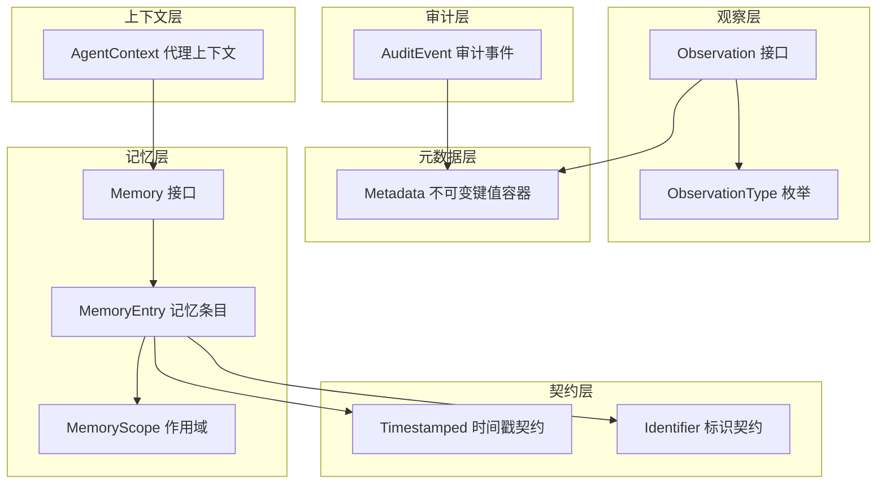
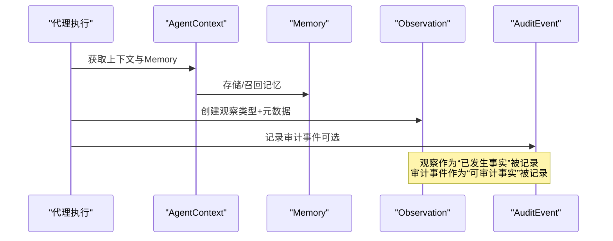
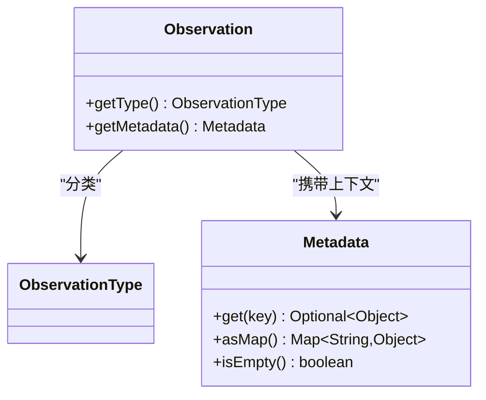
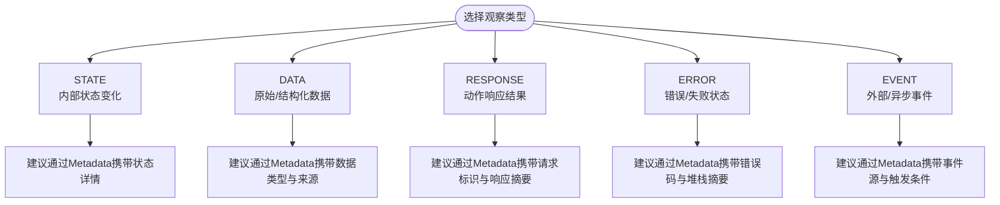
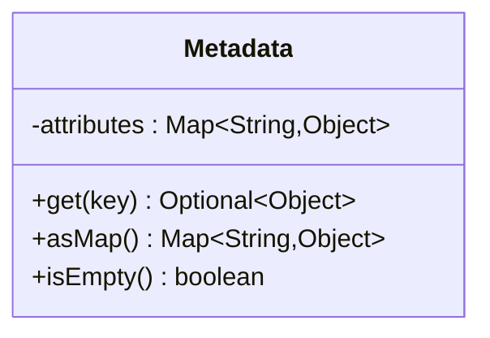
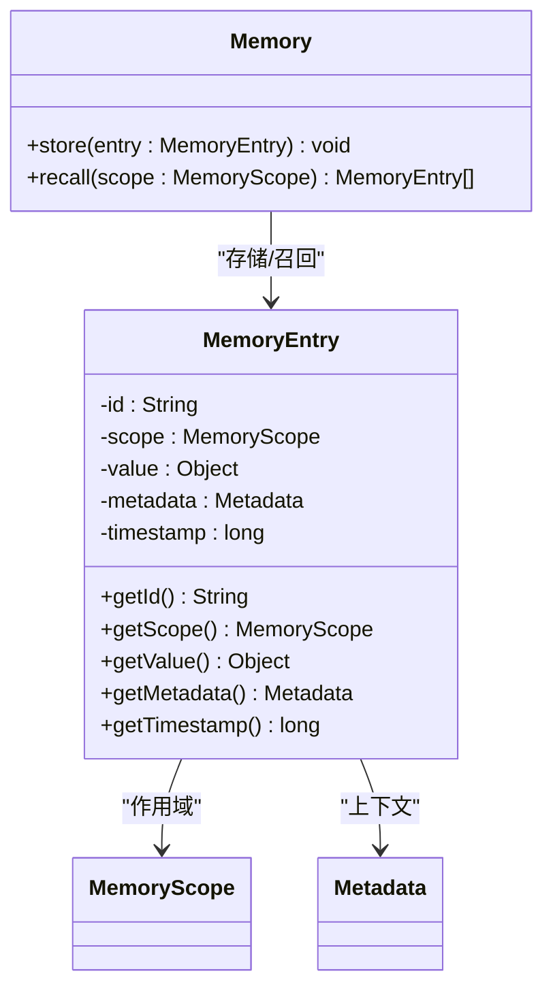
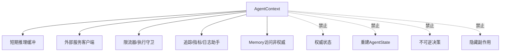
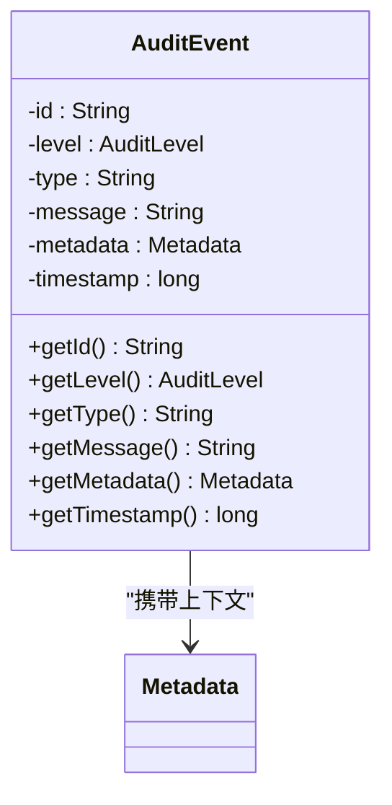
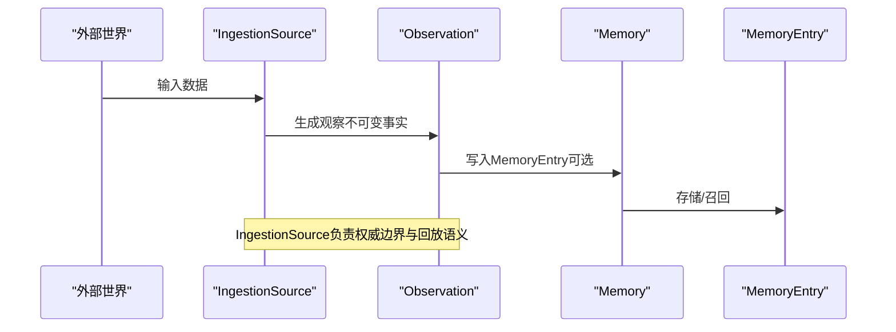
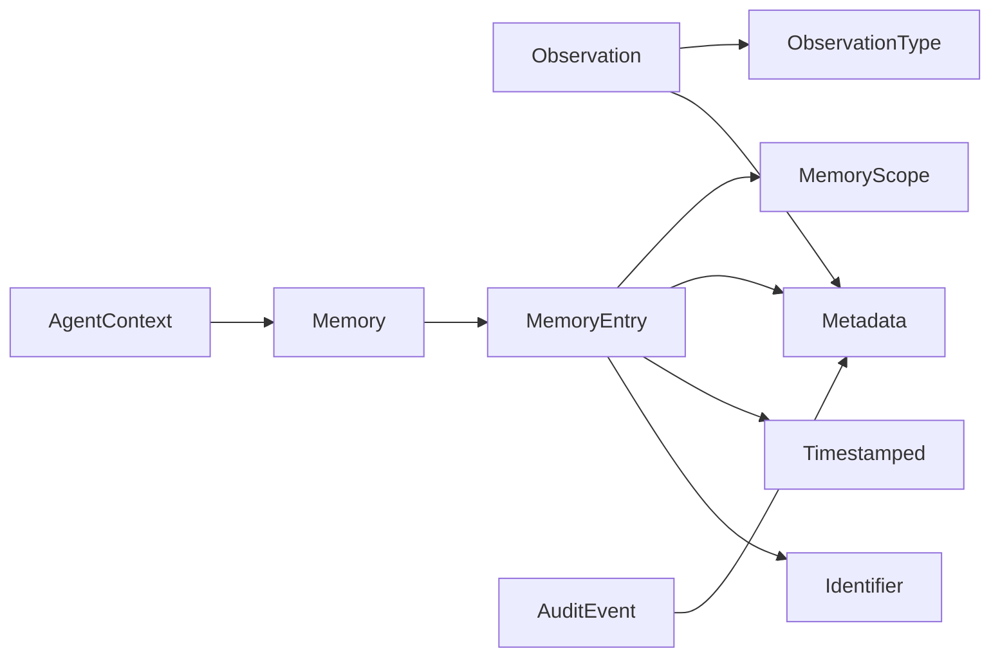

# Observation观察API

<cite>
**本文引用的文件**
- [Observation.java](file://argus-core/src/main/java/io/argus/core/observation/Observation.java)
- [ObservationType.java](file://argus-core/src/main/java/io/argus/core/observation/ObservationType.java)
- [Metadata.java](file://argus-core/src/main/java/io/argus/core/model/Metadata.java)
- [Memory.java](file://argus-core/src/main/java/io/argus/core/memory/Memory.java)
- [MemoryEntry.java](file://argus-core/src/main/java/io/argus/core/memory/MemoryEntry.java)
- [MemoryScope.java](file://argus-core/src/main/java/io/argus/core/memory/MemoryScope.java)
- [AgentContext.java](file://argus-core/src/main/java/io/argus/core/agent/AgentContext.java)
- [AuditEvent.java](file://argus-core/src/main/java/io/argus/core/audit/AuditEvent.java)
- [Timestamped.java](file://argus-core/src/main/java/io/argus/core/model/Timestamped.java)
- [Identifier.java](file://argus-core/src/main/java/io/argus/core/model/Identifier.java)
- [IngestionSource.java](file://argus-ingestion/src/main/java/io/argus/ingestion/source/IngestionSource.java)
</cite>

## 目录
1. [简介](#简介)
2. [项目结构](#项目结构)
3. [核心组件](#核心组件)
4. [架构总览](#架构总览)
5. [详细组件分析](#详细组件分析)
6. [依赖关系分析](#依赖关系分析)
7. [性能考量](#性能考量)
8. [故障排查指南](#故障排查指南)
9. [结论](#结论)
10. [附录](#附录)

## 简介
本文件为Observation观察系统的详细API文档，聚焦以下目标：
- 记录Observation接口的方法规范与数据结构，包括类型分类与元数据承载方式
- 详述ObservationType枚举的分类与语义，涵盖STATE、DATA、RESPONSE、ERROR、EVENT等类型及其典型数据格式
- 提供观察数据的创建与处理示例，展示在代理执行过程中如何记录与访问观察信息
- 解释观察系统与记忆系统的关系及数据流转机制
- 说明观察数据在审计日志中的应用与边界

## 项目结构
围绕Observation观察系统的关键模块分布如下：
- 观察层：Observation接口、ObservationType枚举
- 元数据层：Metadata（不可变键值容器）
- 记忆层：Memory接口、MemoryEntry实体、MemoryScope作用域
- 上下文层：AgentContext（提供Memory访问）
- 审计层：AuditEvent（审计事件载体）
- 时间戳契约：Timestamped（时间戳契约接口）

图表来源
- [Observation.java](file://argus-core/src/main/java/io/argus/core/observation/Observation.java#L31-L37)
- [ObservationType.java](file://argus-core/src/main/java/io/argus/core/observation/ObservationType.java#L18-L117)
- [Metadata.java](file://argus-core/src/main/java/io/argus/core/model/Metadata.java#L12-L34)
- [Memory.java](file://argus-core/src/main/java/io/argus/core/memory/Memory.java#L9-L15)
- [MemoryEntry.java](file://argus-core/src/main/java/io/argus/core/memory/MemoryEntry.java#L9-L53)
- [MemoryScope.java](file://argus-core/src/main/java/io/argus/core/memory/MemoryScope.java#L7-L8)
- [AgentContext.java](file://argus-core/src/main/java/io/argus/core/agent/AgentContext.java#L92-L98)
- [AuditEvent.java](file://argus-core/src/main/java/io/argus/core/audit/AuditEvent.java#L9-L60)
- [Timestamped.java](file://argus-core/src/main/java/io/argus/core/model/Timestamped.java#L7-L8)
- [Identifier.java](file://argus-core/src/main/java/io/argus/core/model/Identifier.java#L7-L8)

章节来源
- [Observation.java](file://argus-core/src/main/java/io/argus/core/observation/Observation.java#L1-L37)
- [ObservationType.java](file://argus-core/src/main/java/io/argus/core/observation/ObservationType.java#L1-L117)
- [Metadata.java](file://argus-core/src/main/java/io/argus/core/model/Metadata.java#L1-L34)
- [Memory.java](file://argus-core/src/main/java/io/argus/core/memory/Memory.java#L1-L15)
- [MemoryEntry.java](file://argus-core/src/main/java/io/argus/core/memory/MemoryEntry.java#L1-L53)
- [MemoryScope.java](file://argus-core/src/main/java/io/argus/core/memory/MemoryScope.java#L1-L8)
- [AgentContext.java](file://argus-core/src/main/java/io/argus/core/agent/AgentContext.java#L1-L98)
- [AuditEvent.java](file://argus-core/src/main/java/io/argus/core/audit/AuditEvent.java#L1-L60)
- [Timestamped.java](file://argus-core/src/main/java/io/argus/core/model/Timestamped.java#L1-L8)
- [Identifier.java](file://argus-core/src/main/java/io/argus/core/model/Identifier.java#L1-L8)

## 核心组件
- Observation接口
  - 职责：描述代理在执行过程中“已发生的事实”，不可变且不包含行为指令
  - 方法：
    - getType(): 返回ObservationType，用于语义分类
    - getMetadata(): 返回Metadata，承载上下文与领域特定信息
  - 设计要点：通过类型分类与Metadata解耦，避免通过扩展枚举表达所有语义

- ObservationType枚举
  - 分类与语义：
    - STATE：内部状态变化观测（如代理状态迁移、生命周期阶段变更）
    - DATA：原始或结构化数据观测（如抓取的内容、解析的文档、抽取的数据集）
    - RESPONSE：对先前动作的响应结果观测（如语言模型回复、API调用结果、工具调用输出）
    - ERROR：错误或失败状态观测（如超时、访问失败、解析或处理错误）
    - EVENT：外部或异步事件观测（如用户交互、Webhook事件、定时触发）
  - 数据格式：各类型的数据格式由实现定义；建议通过Metadata传递结构化上下文

- Metadata不可变键值容器
  - 能力：以不可变Map形式持有键值对，提供按Key读取、整体映射视图与判空判断
  - 用途：承载Observation与MemoryEntry的上下文信息，避免在枚举中扩展语义

- Memory与MemoryEntry
  - Memory：提供存储与召回能力，支持基于MemoryScope的召回
  - MemoryEntry：不可变的记忆条目，包含id、scope、value、metadata、timestamp
  - 关系：Observation可作为事实输入，MemoryEntry作为持久化/回放载体

- AgentContext
  - 职责：提供代理执行期的可变工作环境，允许短期推理缓冲、外部服务客户端、限流器等
  - 边界：严格区分于不可变、可审计的AgentState；不得将权威状态隐藏在上下文中

- AuditEvent
  - 结构：包含id、level、type、message、metadata、timestamp
  - 用途：审计日志载体，可与Observation结合用于事实性记录

章节来源
- [Observation.java](file://argus-core/src/main/java/io/argus/core/observation/Observation.java#L31-L37)
- [ObservationType.java](file://argus-core/src/main/java/io/argus/core/observation/ObservationType.java#L18-L117)
- [Metadata.java](file://argus-core/src/main/java/io/argus/core/model/Metadata.java#L12-L34)
- [Memory.java](file://argus-core/src/main/java/io/argus/core/memory/Memory.java#L9-L15)
- [MemoryEntry.java](file://argus-core/src/main/java/io/argus/core/memory/MemoryEntry.java#L9-L53)
- [MemoryScope.java](file://argus-core/src/main/java/io/argus/core/memory/MemoryScope.java#L7-L8)
- [AgentContext.java](file://argus-core/src/main/java/io/argus/core/agent/AgentContext.java#L92-L98)
- [AuditEvent.java](file://argus-core/src/main/java/io/argus/core/audit/AuditEvent.java#L9-L60)

## 架构总览
Observation观察系统在代理执行过程中的关键交互如下：

图表来源
- [AgentContext.java](file://argus-core/src/main/java/io/argus/core/agent/AgentContext.java#L92-L98)
- [Memory.java](file://argus-core/src/main/java/io/argus/core/memory/Memory.java#L9-L15)
- [Observation.java](file://argus-core/src/main/java/io/argus/core/observation/Observation.java#L31-L37)
- [AuditEvent.java](file://argus-core/src/main/java/io/argus/core/audit/AuditEvent.java#L9-L60)

## 详细组件分析

### Observation接口与方法规范
- 方法签名与职责
  - getType(): 返回ObservationType，用于语义分类
  - getMetadata(): 返回Metadata，承载上下文与领域特定信息
- 不可变性与事实性
  - 观察是不可变的事实，不包含行为指令
  - 每个观察必须由ObservationType进行语义分类
- 元数据承载策略
  - 领域上下文通过Metadata传递，避免通过扩展枚举表达所有语义

图表来源
- [Observation.java](file://argus-core/src/main/java/io/argus/core/observation/Observation.java#L31-L37)
- [ObservationType.java](file://argus-core/src/main/java/io/argus/core/observation/ObservationType.java#L18-L117)
- [Metadata.java](file://argus-core/src/main/java/io/argus/core/model/Metadata.java#L12-L34)

章节来源
- [Observation.java](file://argus-core/src/main/java/io/argus/core/observation/Observation.java#L31-L37)

### ObservationType枚举与数据格式
- STATE（内部状态变化）
  - 典型场景：代理状态迁移、生命周期阶段变更
  - 数据格式：实现自定义，建议通过Metadata传递状态详情
- DATA（原始或结构化数据）
  - 典型场景：抓取的网页内容、解析的文档、抽取的数据集
  - 数据格式：实现自定义，建议通过Metadata传递数据类型与来源
- RESPONSE（对动作的响应结果）
  - 典型场景：语言模型回复、API调用结果、工具调用输出
  - 数据格式：实现自定义，建议通过Metadata传递请求标识与响应摘要
- ERROR（错误或失败状态）
  - 典型场景：超时、访问失败、解析或处理错误
  - 数据格式：实现自定义，建议通过Metadata传递错误码与堆栈摘要
- EVENT（外部或异步事件）
  - 典型场景：用户交互、Webhook事件、定时触发
  - 数据格式：实现自定义，建议通过Metadata传递事件源与触发条件

图表来源
- [ObservationType.java](file://argus-core/src/main/java/io/argus/core/observation/ObservationType.java#L18-L117)

章节来源
- [ObservationType.java](file://argus-core/src/main/java/io/argus/core/observation/ObservationType.java#L18-L117)

### Metadata不可变键值容器
- 结构与能力
  - 不可变Map封装，提供按Key读取、整体映射视图与判空判断
  - 适用于承载Observation与MemoryEntry的上下文信息
- 使用建议
  - 将领域特定信息放入Metadata，避免在枚举中扩展语义
  - 通过asMap()导出用于序列化或日志记录

图表来源
- [Metadata.java](file://argus-core/src/main/java/io/argus/core/model/Metadata.java#L12-L34)

章节来源
- [Metadata.java](file://argus-core/src/main/java/io/argus/core/model/Metadata.java#L12-L34)

### Memory与MemoryEntry：观察数据的持久化与回放
- Memory接口
  - store(entry): 存储MemoryEntry
  - recall(scope): 基于MemoryScope召回条目列表
- MemoryEntry实体
  - 字段：id、scope、value、metadata、timestamp
  - 语义：不可变的记忆条目，适合作为回放与审计的权威来源
- 关系与边界
  - MemoryEntry与Timestamped、Identifier契约配合，确保时间戳与标识一致性

图表来源
- [Memory.java](file://argus-core/src/main/java/io/argus/core/memory/Memory.java#L9-L15)
- [MemoryEntry.java](file://argus-core/src/main/java/io/argus/core/memory/MemoryEntry.java#L9-L53)
- [MemoryScope.java](file://argus-core/src/main/java/io/argus/core/memory/MemoryScope.java#L7-L8)
- [Metadata.java](file://argus-core/src/main/java/io/argus/core/model/Metadata.java#L12-L34)

章节来源
- [Memory.java](file://argus-core/src/main/java/io/argus/core/memory/Memory.java#L9-L15)
- [MemoryEntry.java](file://argus-core/src/main/java/io/argus/core/memory/MemoryEntry.java#L9-L53)
- [MemoryScope.java](file://argus-core/src/main/java/io/argus/core/memory/MemoryScope.java#L7-L8)
- [Metadata.java](file://argus-core/src/main/java/io/argus/core/model/Metadata.java#L12-L34)

### AgentContext：执行期上下文与边界
- 职责与边界
  - 可变、短暂、仅执行期有效
  - 不得承载权威状态；任何影响未来行为且需回放/审计的信息必须进入AgentState或LoopResult
- 允许职责
  - 短期推理缓冲、外部服务客户端、限流器、追踪/指标/日志助手、非权威性召回的Memory访问
- 禁止职责
  - 不得包含权威代理状态、不得要求重建AgentState、不得存储不可逆决策、不得隐藏副作用

图表来源
- [AgentContext.java](file://argus-core/src/main/java/io/argus/core/agent/AgentContext.java#L92-L98)

章节来源
- [AgentContext.java](file://argus-core/src/main/java/io/argus/core/agent/AgentContext.java#L92-L98)

### 审计日志中的应用：AuditEvent与Observation
- AuditEvent结构
  - 字段：id、level、type、message、metadata、timestamp
  - 用途：记录可审计的事实，与Observation共同构成“事实性记录”
- 与Observation的关系
  - 观察作为“发生了什么”的事实
  - 审计事件作为“可审计的事实”记录，二者可并行存在
- 序列化与反序列化
  - 建议通过Metadata与标准序列化框架（如JSON）进行序列化
  - 反序列化时保持不可变性与类型一致性

图表来源
- [AuditEvent.java](file://argus-core/src/main/java/io/argus/core/audit/AuditEvent.java#L9-L60)
- [Metadata.java](file://argus-core/src/main/java/io/argus/core/model/Metadata.java#L12-L34)

章节来源
- [AuditEvent.java](file://argus-core/src/main/java/io/argus/core/audit/AuditEvent.java#L9-L60)
- [Metadata.java](file://argus-core/src/main/java/io/argus/core/model/Metadata.java#L12-L34)

### 观察系统与记忆系统的关系与数据流转
- IngestionSource边界
  - 定义代理运行时与外部世界的权威边界
  - 成功的抓取代表“事实”，必须不可变且权威
  - 回放时不得重新访问外部世界，而应重现Observation实例
- 数据流转
  - 外部输入经IngestionSource转化为Observation
  - Observation可写入MemoryEntry以支持回放与审计
  - AgentContext在执行期使用Memory进行非权威性召回

图表来源
- [IngestionSource.java](file://argus-ingestion/src/main/java/io/argus/ingestion/source/IngestionSource.java#L1-L46)
- [Observation.java](file://argus-core/src/main/java/io/argus/core/observation/Observation.java#L31-L37)
- [Memory.java](file://argus-core/src/main/java/io/argus/core/memory/Memory.java#L9-L15)
- [MemoryEntry.java](file://argus-core/src/main/java/io/argus/core/memory/MemoryEntry.java#L9-L53)

章节来源
- [IngestionSource.java](file://argus-ingestion/src/main/java/io/argus/ingestion/source/IngestionSource.java#L1-L46)
- [Observation.java](file://argus-core/src/main/java/io/argus/core/observation/Observation.java#L31-L37)
- [Memory.java](file://argus-core/src/main/java/io/argus/core/memory/Memory.java#L9-L15)
- [MemoryEntry.java](file://argus-core/src/main/java/io/argus/core/memory/MemoryEntry.java#L9-L53)

## 依赖关系分析
- 组件耦合与内聚
  - Observation与ObservationType强内聚，通过Metadata弱耦合承载上下文
  - Memory与MemoryEntry高内聚，通过MemoryScope实现作用域控制
  - AgentContext与Memory松耦合，仅暴露非权威性访问
  - AuditEvent与Metadata弱耦合，便于审计日志的上下文扩展
- 外部依赖与集成点
  - Metadata作为通用上下文容器，被Observation、MemoryEntry、AuditEvent复用
  - Timestamped与Identifier为契约接口，用于统一时间戳与标识管理

图表来源
- [Observation.java](file://argus-core/src/main/java/io/argus/core/observation/Observation.java#L31-L37)
- [ObservationType.java](file://argus-core/src/main/java/io/argus/core/observation/ObservationType.java#L18-L117)
- [Metadata.java](file://argus-core/src/main/java/io/argus/core/model/Metadata.java#L12-L34)
- [Memory.java](file://argus-core/src/main/java/io/argus/core/memory/Memory.java#L9-L15)
- [MemoryEntry.java](file://argus-core/src/main/java/io/argus/core/memory/MemoryEntry.java#L9-L53)
- [MemoryScope.java](file://argus-core/src/main/java/io/argus/core/memory/MemoryScope.java#L7-L8)
- [AgentContext.java](file://argus-core/src/main/java/io/argus/core/agent/AgentContext.java#L92-L98)
- [AuditEvent.java](file://argus-core/src/main/java/io/argus/core/audit/AuditEvent.java#L9-L60)
- [Timestamped.java](file://argus-core/src/main/java/io/argus/core/model/Timestamped.java#L7-L8)
- [Identifier.java](file://argus-core/src/main/java/io/argus/core/model/Identifier.java#L7-L8)

章节来源
- [Observation.java](file://argus-core/src/main/java/io/argus/core/observation/Observation.java#L31-L37)
- [ObservationType.java](file://argus-core/src/main/java/io/argus/core/observation/ObservationType.java#L18-L117)
- [Metadata.java](file://argus-core/src/main/java/io/argus/core/model/Metadata.java#L12-L34)
- [Memory.java](file://argus-core/src/main/java/io/argus/core/memory/Memory.java#L9-L15)
- [MemoryEntry.java](file://argus-core/src/main/java/io/argus/core/memory/MemoryEntry.java#L9-L53)
- [MemoryScope.java](file://argus-core/src/main/java/io/argus/core/memory/MemoryScope.java#L7-L8)
- [AgentContext.java](file://argus-core/src/main/java/io/argus/core/agent/AgentContext.java#L92-L98)
- [AuditEvent.java](file://argus-core/src/main/java/io/argus/core/audit/AuditEvent.java#L9-L60)
- [Timestamped.java](file://argus-core/src/main/java/io/argus/core/model/Timestamped.java#L7-L8)
- [Identifier.java](file://argus-core/src/main/java/io/argus/core/model/Identifier.java#L7-L8)

## 性能考量
- 不可变性带来的优势
  - 观察与记忆条目不可变，天然线程安全，减少锁开销
  - 适合缓存与回放，降低重复计算成本
- Metadata不可变Map
  - 读操作高效，写操作通过构造新Map实现，适合只增不改的场景
- Memory召回策略
  - 建议基于MemoryScope进行分片召回，避免全量扫描
  - 对高频召回场景，可在AgentContext中维护短期缓存（仅执行期有效）

## 故障排查指南
- 观察未被记录
  - 检查是否正确创建Observation并传入Memory或审计通道
  - 确认AgentContext未承载权威状态，避免回放丢失
- 回放不一致
  - 确保IngestionSource在回放时不访问外部世界，仅重现Observation
  - 检查MemoryEntry的时间戳与标识一致性（Timestamped、Identifier）
- 审计缺失
  - 确认AuditEvent包含必要上下文（Metadata），并与Observation关联
- 性能问题
  - 评估Memory召回范围与频率，必要时引入分片与缓存

## 结论
Observation观察系统通过不可变事实与Metadata上下文，清晰地区分了“发生了什么”与“应该如何反应”。结合Memory与AgentContext，实现了可回放、可审计的代理执行模型。在实际工程中，建议：
- 使用ObservationType进行语义分类，Metadata承载上下文
- 将权威状态与回放信息沉淀至MemoryEntry与AgentState
- 在审计日志中同时记录Observation与AuditEvent，形成完整的事实链路

## 附录
- 序列化与反序列化建议
  - 使用Metadata的asMap()导出键值对
  - 采用稳定序列化格式（如JSON），确保字段兼容性
  - 反序列化时校验类型与时间戳一致性
- 示例流程（概念性）
  - 抓取外部数据 → 生成Observation（STATE/DATA/RESPONSE/ERROR/EVENT）→ 写入MemoryEntry → 记录AuditEvent → 执行期通过AgentContext访问Memory进行非权威召回