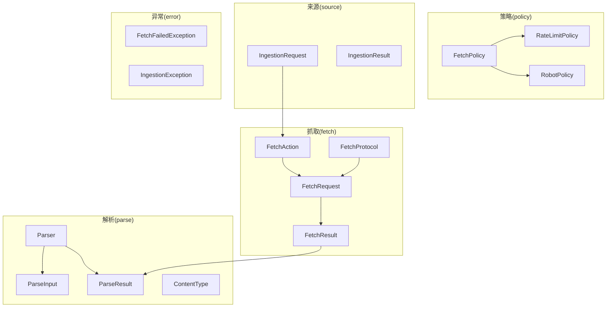
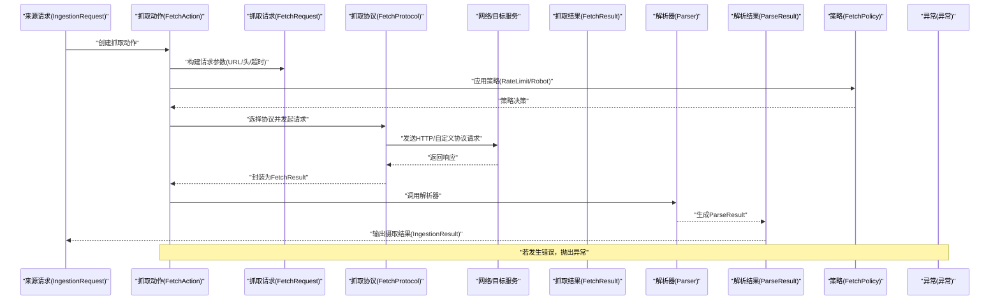
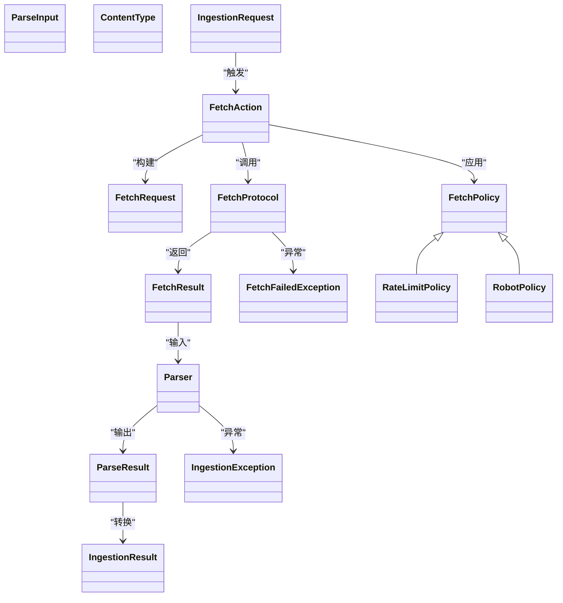
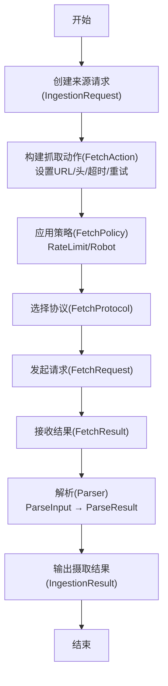

# 数据获取API

<cite>
**本文引用的文件**
- [FetchAction.java](file://argus-ingestion/src/main/java/io/argus/ingestion/fetch/FetchAction.java)
- [FetchProtocol.java](file://argus-ingestion/src/main/java/io/argus/ingestion/fetch/FetchProtocol.java)
- [FetchRequest.java](file://argus-ingestion/src/main/java/io/argus/ingestion/fetch/FetchRequest.java)
- [FetchResult.java](file://argus-ingestion/src/main/java/io/argus/ingestion/fetch/FetchResult.java)
- [Parser.java](file://argus-ingestion/src/main/java/io/argus/ingestion/parse/Parser.java)
- [ParseInput.java](file://argus-ingestion/src/main/java/io/argus/ingestion/parse/ParseInput.java)
- [ParseResult.java](file://argus-ingestion/src/main/java/io/argus/ingestion/parse/ParseResult.java)
- [ContentType.java](file://argus-ingestion/src/main/java/io/argus/ingestion/parse/ContentType.java)
- [FetchPolicy.java](file://argus-ingestion/src/main/java/io/argus/ingestion/policy/FetchPolicy.java)
- [RateLimitPolicy.java](file://argus-ingestion/src/main/java/io/argus/ingestion/policy/RateLimitPolicy.java)
- [RobotPolicy.java](file://argus-ingestion/src/main/java/io/argus/ingestion/policy/RobotPolicy.java)
- [IngestionRequest.java](file://argus-ingestion/src/main/java/io/argus/ingestion/source/IngestionRequest.java)
- [IngestionResult.java](file://argus-ingestion/src/main/java/io/argus/ingestion/source/IngestionResult.java)
- [FetchFailedException.java](file://argus-ingestion/src/main/java/io/argus/ingestion/error/FetchFailedException.java)
- [IngestionException.java](file://argus-ingestion/src/main/java/io/argus/ingestion/error/IngestionException.java)
</cite>

## 目录
1. [简介](#简介)
2. [项目结构](#项目结构)
3. [核心组件](#核心组件)
4. [架构总览](#架构总览)
5. [详细组件分析](#详细组件分析)
6. [依赖关系分析](#依赖关系分析)
7. [性能考虑](#性能考虑)
8. [故障排查指南](#故障排查指南)
9. [结论](#结论)
10. [附录](#附录)

## 简介
本文件为“数据获取API”的技术文档，聚焦于数据抓取与解析子系统，覆盖以下主题：
- FetchAction 的构造与参数配置（URL、请求头、超时等）
- Parser 解析器接口的方法规范（parse 输入输出与错误处理）
- FetchProtocol 协议接口的实现要求与扩展方式
- FetchPolicy 策略接口及其实现（如 RateLimitPolicy、RobotPolicy）的配置要点
- 完整的数据获取流程示例：从 FetchAction 创建到数据解析与存储
- 网络请求的重试机制、错误处理与性能优化建议

当前仓库中各组件以类定义为主，尚未包含具体实现细节；本文在不展示源码的前提下，基于现有类结构给出清晰的API规范与使用指南。

## 项目结构
数据获取与解析相关模块位于 argus-ingestion 子模块中，按功能域划分如下：
- fetch：抓取动作、请求、结果与协议
- parse：解析器、输入、输出与内容类型
- policy：抓取策略与具体策略实现
- source：来源请求与结果
- error：抓取与摄取异常

图表来源
- [FetchAction.java](file://argus-ingestion/src/main/java/io/argus/ingestion/fetch/FetchAction.java#L1-L21)
- [FetchProtocol.java](file://argus-ingestion/src/main/java/io/argus/ingestion/fetch/FetchProtocol.java#L1-L8)
- [FetchRequest.java](file://argus-ingestion/src/main/java/io/argus/ingestion/fetch/FetchRequest.java#L1-L8)
- [FetchResult.java](file://argus-ingestion/src/main/java/io/argus/ingestion/fetch/FetchResult.java#L1-L8)
- [Parser.java](file://argus-ingestion/src/main/java/io/argus/ingestion/parse/Parser.java#L1-L8)
- [ParseInput.java](file://argus-ingestion/src/main/java/io/argus/ingestion/parse/ParseInput.java#L1-L8)
- [ParseResult.java](file://argus-ingestion/src/main/java/io/argus/ingestion/parse/ParseResult.java#L1-L8)
- [ContentType.java](file://argus-ingestion/src/main/java/io/argus/ingestion/parse/ContentType.java#L1-L8)
- [FetchPolicy.java](file://argus-ingestion/src/main/java/io/argus/ingestion/policy/FetchPolicy.java#L1-L8)
- [RateLimitPolicy.java](file://argus-ingestion/src/main/java/io/argus/ingestion/policy/RateLimitPolicy.java#L1-L8)
- [RobotPolicy.java](file://argus-ingestion/src/main/java/io/argus/ingestion/policy/RobotPolicy.java#L1-L8)
- [IngestionRequest.java](file://argus-ingestion/src/main/java/io/argus/ingestion/source/IngestionRequest.java#L1-L8)
- [IngestionResult.java](file://argus-ingestion/src/main/java/io/argus/ingestion/source/IngestionResult.java#L1-L8)
- [FetchFailedException.java](file://argus-ingestion/src/main/java/io/argus/ingestion/error/FetchFailedException.java#L1-L8)
- [IngestionException.java](file://argus-ingestion/src/main/java/io/argus/ingestion/error/IngestionException.java#L1-L8)

章节来源
- [FetchAction.java](file://argus-ingestion/src/main/java/io/argus/ingestion/fetch/FetchAction.java#L1-L21)
- [Parser.java](file://argus-ingestion/src/main/java/io/argus/ingestion/parse/Parser.java#L1-L8)
- [FetchPolicy.java](file://argus-ingestion/src/main/java/io/argus/ingestion/policy/FetchPolicy.java#L1-L8)

## 核心组件
本节概述数据获取API的关键接口与实体，帮助快速定位职责与交互关系。

- FetchAction：表示一次抓取动作，实现通用动作接口，提供类型与元数据能力
- FetchRequest：封装抓取请求的参数（如 URL、请求头、超时等），作为抓取执行的输入载体
- FetchResult：封装抓取结果（如响应状态、内容、元数据等）
- FetchProtocol：抓取协议抽象，用于定义不同协议下的抓取行为
- Parser：解析器接口，负责将原始抓取结果转换为统一的解析结果
- ParseInput/ParseResult：解析阶段的输入与输出对象
- ContentType：解析内容类型的枚举或标识
- FetchPolicy：抓取策略抽象，支持扩展多种策略（如速率限制、robots.txt 等）
- RateLimitPolicy：速率限制策略实现
- RobotPolicy：Robots 协议策略实现
- IngestionRequest/IngestionResult：摄取层的请求与结果对象
- FetchFailedException/IngestionException：抓取失败与摄取异常

章节来源
- [FetchAction.java](file://argus-ingestion/src/main/java/io/argus/ingestion/fetch/FetchAction.java#L1-L21)
- [FetchProtocol.java](file://argus-ingestion/src/main/java/io/argus/ingestion/fetch/FetchProtocol.java#L1-L8)
- [FetchRequest.java](file://argus-ingestion/src/main/java/io/argus/ingestion/fetch/FetchRequest.java#L1-L8)
- [FetchResult.java](file://argus-ingestion/src/main/java/io/argus/ingestion/fetch/FetchResult.java#L1-L8)
- [Parser.java](file://argus-ingestion/src/main/java/io/argus/ingestion/parse/Parser.java#L1-L8)
- [ParseInput.java](file://argus-ingestion/src/main/java/io/argus/ingestion/parse/ParseInput.java#L1-L8)
- [ParseResult.java](file://argus-ingestion/src/main/java/io/argus/ingestion/parse/ParseResult.java#L1-L8)
- [ContentType.java](file://argus-ingestion/src/main/java/io/argus/ingestion/parse/ContentType.java#L1-L8)
- [FetchPolicy.java](file://argus-ingestion/src/main/java/io/argus/ingestion/policy/FetchPolicy.java#L1-L8)
- [RateLimitPolicy.java](file://argus-ingestion/src/main/java/io/argus/ingestion/policy/RateLimitPolicy.java#L1-L8)
- [RobotPolicy.java](file://argus-ingestion/src/main/java/io/argus/ingestion/policy/RobotPolicy.java#L1-L8)
- [IngestionRequest.java](file://argus-ingestion/src/main/java/io/argus/ingestion/source/IngestionRequest.java#L1-L8)
- [IngestionResult.java](file://argus-ingestion/src/main/java/io/argus/ingestion/source/IngestionResult.java#L1-L8)
- [FetchFailedException.java](file://argus-ingestion/src/main/java/io/argus/ingestion/error/FetchFailedException.java#L1-L8)
- [IngestionException.java](file://argus-ingestion/src/main/java/io/argus/ingestion/error/IngestionException.java#L1-L8)

## 架构总览
下图展示了从“来源请求”到“抓取、解析、存储”的完整链路，以及策略与异常在其中的作用位置。

图表来源
- [IngestionRequest.java](file://argus-ingestion/src/main/java/io/argus/ingestion/source/IngestionRequest.java#L1-L8)
- [FetchAction.java](file://argus-ingestion/src/main/java/io/argus/ingestion/fetch/FetchAction.java#L1-L21)
- [FetchRequest.java](file://argus-ingestion/src/main/java/io/argus/ingestion/fetch/FetchRequest.java#L1-L8)
- [FetchProtocol.java](file://argus-ingestion/src/main/java/io/argus/ingestion/fetch/FetchProtocol.java#L1-L8)
- [FetchResult.java](file://argus-ingestion/src/main/java/io/argus/ingestion/fetch/FetchResult.java#L1-L8)
- [Parser.java](file://argus-ingestion/src/main/java/io/argus/ingestion/parse/Parser.java#L1-L8)
- [ParseResult.java](file://argus-ingestion/src/main/java/io/argus/ingestion/parse/ParseResult.java#L1-L8)
- [FetchPolicy.java](file://argus-ingestion/src/main/java/io/argus/ingestion/policy/FetchPolicy.java#L1-L8)
- [FetchFailedException.java](file://argus-ingestion/src/main/java/io/argus/ingestion/error/FetchFailedException.java#L1-L8)
- [IngestionException.java](file://argus-ingestion/src/main/java/io/argus/ingestion/error/IngestionException.java#L1-L8)

## 详细组件分析

### FetchAction：抓取动作
- 职责：表示一次抓取任务，实现通用动作接口，提供类型与元数据访问
- 关键点：
  - 类型标识：通过实现的动作类型接口返回动作类别
  - 元数据：提供抓取相关的元信息（如来源、时间戳、上下文等）
- 参数配置（建议字段，基于类名与常见实践）：
  - URL：目标资源地址
  - 请求头：如 User-Agent、Accept、Authorization 等
  - 超时：连接与读取超时
  - 重试策略：最大重试次数、退避策略
  - 代理与证书：可选的网络代理与 TLS 配置
- 使用建议：
  - 在创建实例后，先校验必要参数（URL、头、超时）
  - 对敏感头（如鉴权）进行脱敏日志记录

章节来源
- [FetchAction.java](file://argus-ingestion/src/main/java/io/argus/ingestion/fetch/FetchAction.java#L1-L21)

### FetchRequest：抓取请求
- 职责：承载抓取所需的全部参数，作为 FetchProtocol 的输入
- 建议字段（基于类名与常见实践）：
  - URL：目标地址
  - 方法：GET/POST 等
  - 头部：Map<String,String>
  - 负载：字符串或字节数组
  - 超时：连接/读取/写入
  - 重试：次数与退避
  - 代理：主机、端口、凭据
- 交互：由 FetchAction 构建，交由 FetchProtocol 执行

章节来源
- [FetchRequest.java](file://argus-ingestion/src/main/java/io/argus/ingestion/fetch/FetchRequest.java#L1-L8)

### FetchProtocol：抓取协议
- 职责：定义不同协议下的抓取行为（如 HTTP、FTP、自定义协议）
- 实现要求：
  - 接收 FetchRequest 并返回 FetchResult
  - 支持超时控制、重试与错误映射
  - 可扩展：新增协议时仅需实现该接口
- 扩展方式：
  - 新增协议实现类，遵循统一的输入输出契约
  - 在 FetchAction 中根据配置选择对应协议

章节来源
- [FetchProtocol.java](file://argus-ingestion/src/main/java/io/argus/ingestion/fetch/FetchProtocol.java#L1-L8)

### FetchResult：抓取结果
- 职责：封装抓取后的响应数据与元信息
- 建议字段（基于类名与常见实践）：
  - 状态码：HTTP 状态或协议特定状态
  - 头部：响应头集合
  - 内容：字节流或文本
  - 元数据：来源、时间、大小等
- 用途：作为 Parser 的输入或错误处理依据

章节来源
- [FetchResult.java](file://argus-ingestion/src/main/java/io/argus/ingestion/fetch/FetchResult.java#L1-L8)

### Parser：解析器接口
- 职责：将 FetchResult 转换为统一的 ParseResult
- 方法规范（建议签名与语义）：
  - parse(input: ParseInput): ParseResult
    - 输入：包含原始内容、内容类型、编码等
    - 输出：解析后的结构化数据与元信息
    - 错误：当输入无效或解析失败时抛出异常
- 错误处理：
  - 输入校验失败：抛出解析异常
  - 内容类型不匹配：抛出类型不支持异常
  - 解析过程异常：包装为解析异常并保留上下文

章节来源
- [Parser.java](file://argus-ingestion/src/main/java/io/argus/ingestion/parse/Parser.java#L1-L8)
- [ParseInput.java](file://argus-ingestion/src/main/java/io/argus/ingestion/parse/ParseInput.java#L1-L8)
- [ParseResult.java](file://argus-ingestion/src/main/java/io/argus/ingestion/parse/ParseResult.java#L1-L8)
- [ContentType.java](file://argus-ingestion/src/main/java/io/argus/ingestion/parse/ContentType.java#L1-L8)

### FetchPolicy：抓取策略
- 职责：对抓取行为进行约束与优化（如速率限制、Robots 协议）
- 实现要求：
  - 提供策略评估方法，决定是否允许抓取、何时重试
  - 可组合：多个策略可叠加生效
- 典型实现：
  - RateLimitPolicy：限制单位时间内的请求数量
  - RobotPolicy：遵循 robots.txt 规则，避免禁止路径

章节来源
- [FetchPolicy.java](file://argus-ingestion/src/main/java/io/argus/ingestion/policy/FetchPolicy.java#L1-L8)
- [RateLimitPolicy.java](file://argus-ingestion/src/main/java/io/argus/ingestion/policy/RateLimitPolicy.java#L1-L8)
- [RobotPolicy.java](file://argus-ingestion/src/main/java/io/argus/ingestion/policy/RobotPolicy.java#L1-L8)

### IngestionRequest/IngestionResult：摄取层
- 职责：连接抓取与存储，定义摄取阶段的输入与输出
- 关系：通常由摄取层将 ParseResult 转换为 IngestionResult 并写入存储

章节来源
- [IngestionRequest.java](file://argus-ingestion/src/main/java/io/argus/ingestion/source/IngestionRequest.java#L1-L8)
- [IngestionResult.java](file://argus-ingestion/src/main/java/io/argus/ingestion/source/IngestionResult.java#L1-L8)

### 异常体系：FetchFailedException 与 IngestionException
- FetchFailedException：抓取阶段失败时抛出，包含失败原因与上下文
- IngestionException：摄取阶段失败时抛出，包含失败原因与上下文
- 建议：在重试与降级时保留原始异常以便追踪

章节来源
- [FetchFailedException.java](file://argus-ingestion/src/main/java/io/argus/ingestion/error/FetchFailedException.java#L1-L8)
- [IngestionException.java](file://argus-ingestion/src/main/java/io/argus/ingestion/error/IngestionException.java#L1-L8)

## 依赖关系分析
下图展示抓取与解析模块之间的依赖与交互方向。

图表来源
- [FetchAction.java](file://argus-ingestion/src/main/java/io/argus/ingestion/fetch/FetchAction.java#L1-L21)
- [FetchProtocol.java](file://argus-ingestion/src/main/java/io/argus/ingestion/fetch/FetchProtocol.java#L1-L8)
- [FetchRequest.java](file://argus-ingestion/src/main/java/io/argus/ingestion/fetch/FetchRequest.java#L1-L8)
- [FetchResult.java](file://argus-ingestion/src/main/java/io/argus/ingestion/fetch/FetchResult.java#L1-L8)
- [Parser.java](file://argus-ingestion/src/main/java/io/argus/ingestion/parse/Parser.java#L1-L8)
- [ParseInput.java](file://argus-ingestion/src/main/java/io/argus/ingestion/parse/ParseInput.java#L1-L8)
- [ParseResult.java](file://argus-ingestion/src/main/java/io/argus/ingestion/parse/ParseResult.java#L1-L8)
- [ContentType.java](file://argus-ingestion/src/main/java/io/argus/ingestion/parse/ContentType.java#L1-L8)
- [FetchPolicy.java](file://argus-ingestion/src/main/java/io/argus/ingestion/policy/FetchPolicy.java#L1-L8)
- [RateLimitPolicy.java](file://argus-ingestion/src/main/java/io/argus/ingestion/policy/RateLimitPolicy.java#L1-L8)
- [RobotPolicy.java](file://argus-ingestion/src/main/java/io/argus/ingestion/policy/RobotPolicy.java#L1-L8)
- [IngestionRequest.java](file://argus-ingestion/src/main/java/io/argus/ingestion/source/IngestionRequest.java#L1-L8)
- [IngestionResult.java](file://argus-ingestion/src/main/java/io/argus/ingestion/source/IngestionResult.java#L1-L8)
- [FetchFailedException.java](file://argus-ingestion/src/main/java/io/argus/ingestion/error/FetchFailedException.java#L1-L8)
- [IngestionException.java](file://argus-ingestion/src/main/java/io/argus/ingestion/error/IngestionException.java#L1-L8)

## 性能考虑
- 连接复用：启用 HTTP/1.1 keep-alive 或 HTTP/2，减少握手开销
- 超时设置：区分连接超时、读取超时与总体超时，避免长时间阻塞
- 限速与退避：结合 RateLimitPolicy 与指数退避，降低被限流或封禁风险
- 缓存与去重：对重复请求进行缓存与去重，减少网络与解析成本
- 流式解析：对大体积内容采用流式解析，降低内存峰值
- 并发与队列：合理设置并发度与队列长度，避免资源争用

## 故障排查指南
- 抓取失败
  - 检查 URL 与请求头是否正确
  - 查看 FetchResult 的状态码与头部
  - 启用重试与退避，并记录每次重试的上下文
  - 若抛出 FetchFailedException，优先检查网络与目标可达性
- 解析失败
  - 确认 ParseInput 的内容类型与编码
  - 检查 Parser 的实现是否支持该类型
  - 若抛出 IngestionException，核对摄取层转换逻辑
- 策略冲突
  - 检查 RateLimitPolicy 与 RobotPolicy 的配置是否相互矛盾
  - 在高并发场景下，确保策略评估的原子性与一致性

章节来源
- [FetchFailedException.java](file://argus-ingestion/src/main/java/io/argus/ingestion/error/FetchFailedException.java#L1-L8)
- [IngestionException.java](file://argus-ingestion/src/main/java/io/argus/ingestion/error/IngestionException.java#L1-L8)

## 结论
本文档基于现有类结构，给出了数据获取API的规范与使用建议。随着后续实现的完善，建议补充：
- FetchAction 的构造参数与配置项
- FetchProtocol 的具体协议实现
- Parser 的 parse 方法签名与错误处理
- FetchPolicy 的配置参数与评估逻辑
- 完整的序列图与流程图

## 附录

### 完整数据获取流程示例（概念步骤）
- 步骤1：创建来源请求（IngestionRequest）
- 步骤2：构建抓取动作（FetchAction），设置 URL、请求头、超时、重试策略
- 步骤3：应用策略（FetchPolicy，如 RateLimitPolicy、RobotPolicy）
- 步骤4：选择协议（FetchProtocol）并发起请求（FetchRequest）
- 步骤5：接收结果（FetchResult），进行解析（Parser，ParseInput → ParseResult）
- 步骤6：输出摄取结果（IngestionResult），并持久化存储

图表来源
- [IngestionRequest.java](file://argus-ingestion/src/main/java/io/argus/ingestion/source/IngestionRequest.java#L1-L8)
- [FetchAction.java](file://argus-ingestion/src/main/java/io/argus/ingestion/fetch/FetchAction.java#L1-L21)
- [FetchProtocol.java](file://argus-ingestion/src/main/java/io/argus/ingestion/fetch/FetchProtocol.java#L1-L8)
- [FetchRequest.java](file://argus-ingestion/src/main/java/io/argus/ingestion/fetch/FetchRequest.java#L1-L8)
- [FetchResult.java](file://argus-ingestion/src/main/java/io/argus/ingestion/fetch/FetchResult.java#L1-L8)
- [Parser.java](file://argus-ingestion/src/main/java/io/argus/ingestion/parse/Parser.java#L1-L8)
- [ParseInput.java](file://argus-ingestion/src/main/java/io/argus/ingestion/parse/ParseInput.java#L1-L8)
- [ParseResult.java](file://argus-ingestion/src/main/java/io/argus/ingestion/parse/ParseResult.java#L1-L8)
- [IngestionResult.java](file://argus-ingestion/src/main/java/io/argus/ingestion/source/IngestionResult.java#L1-L8)