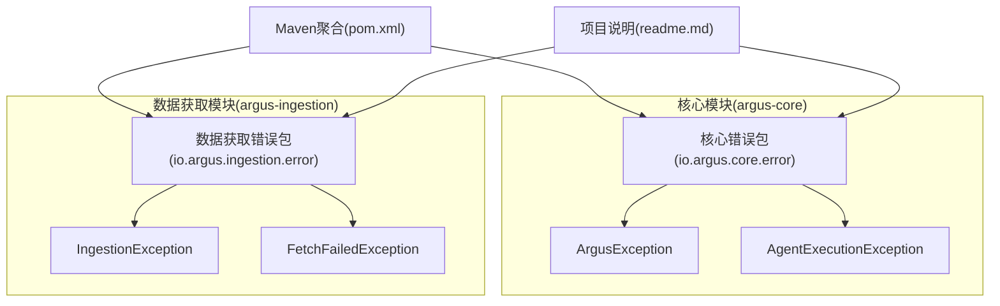
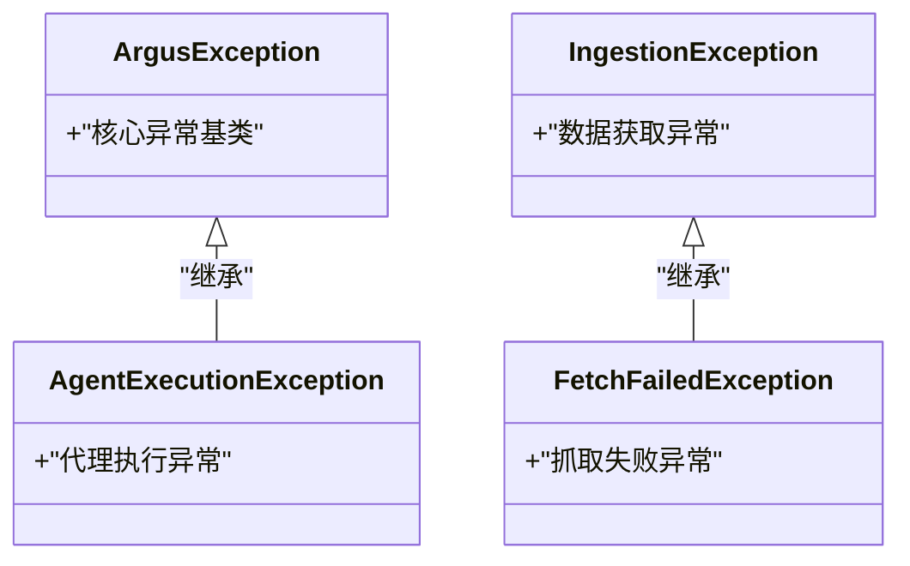
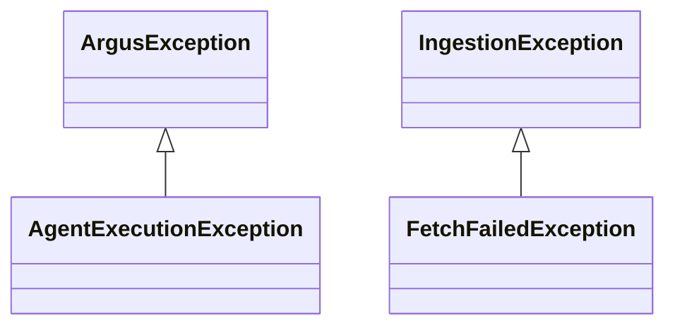
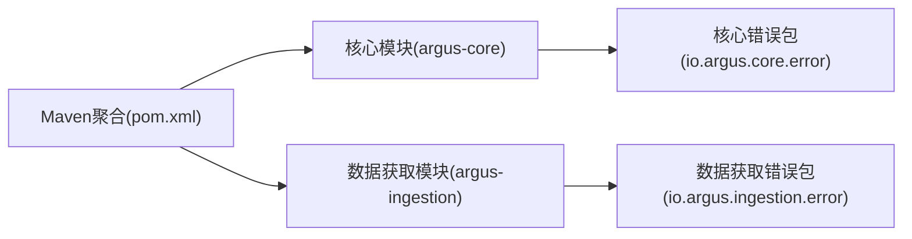

# 错误处理API

<cite>
**本文档引用的文件**
- [ArgusException.java](file://argus-core/src/main/java/io/argus/core/error/ArgusException.java)
- [AgentExecutionException.java](file://argus-core/src/main/java/io/argus/core/error/AgentExecutionException.java)
- [IngestionException.java](file://argus-ingestion/src/main/java/io/argus/ingestion/error/IngestionException.java)
- [FetchFailedException.java](file://argus-ingestion/src/main/java/io/argus/ingestion/error/FetchFailedException.java)
- [package-info.java（核心错误包）](file://argus-core/src/main/java/io/argus/core/error/package-info.java)
- [pom.xml](file://pom.xml)
- [readme.md](file://readme.md)
</cite>

## 目录
1. [简介](#简介)
2. [项目结构](#项目结构)
3. [核心组件](#核心组件)
4. [架构总览](#架构总览)
5. [详细组件分析](#详细组件分析)
6. [依赖分析](#依赖分析)
7. [性能考虑](#性能考虑)
8. [故障排查指南](#故障排查指南)
9. [结论](#结论)

## 简介
本文件面向Argus项目的错误处理API，聚焦于异常体系的设计与使用。根据仓库现有代码，当前错误处理相关类处于占位状态，但通过包文档与模块结构可以明确其设计意图：在核心模块中定义语义化的异常基类，在数据获取模块中定义与网络抓取相关的异常类型。本文将基于现有信息，给出异常层次结构的预期模型、各异常类型的职责边界、触发条件与处理建议，并提供最佳实践与排障方法。

## 项目结构
Argus采用多模块Maven工程组织，错误处理相关的核心类位于核心模块的error包，数据获取模块的error包包含与抓取失败相关的异常类型。

**图表来源**
- [pom.xml](file://pom.xml#L24-L29)
- [readme.md](file://readme.md#L7-L14)

**章节来源**
- [pom.xml](file://pom.xml#L24-L29)
- [readme.md](file://readme.md#L7-L14)

## 核心组件
本节概述当前仓库中可见的错误处理相关类及其职责定位。

- 核心异常基类
  - ArgusException：核心错误包的语义化异常基类，用于统一管理与Agent、内存、观察等核心能力相关的异常。
  - AgentExecutionException：核心异常，用于描述代理执行阶段发生的错误，如动作执行失败、状态不一致等。

- 数据获取异常
  - IngestionException：数据获取层的通用异常，用于封装抓取、解析、策略等环节的错误。
  - FetchFailedException：网络抓取失败的专用异常，用于表达网络请求、协议、超时、限流等导致的抓取失败。

上述类均位于各自模块的error包内，遵循“核心模块不暴露第三方或实现特定异常”的设计原则。

**章节来源**
- [ArgusException.java](file://argus-core/src/main/java/io/argus/core/error/ArgusException.java#L1-L8)
- [AgentExecutionException.java](file://argus-core/src/main/java/io/argus/core/error/AgentExecutionException.java#L1-L8)
- [IngestionException.java](file://argus-ingestion/src/main/java/io/argus/ingestion/error/IngestionException.java#L1-L8)
- [FetchFailedException.java](file://argus-ingestion/src/main/java/io/argus/ingestion/error/FetchFailedException.java#L1-L8)
- [package-info.java（核心错误包）](file://argus-core/src/main/java/io/argus/core/error/package-info.java#L1-L15)

## 架构总览
下图展示了异常层次结构的预期关系：核心异常作为上层抽象，具体异常向下扩展；数据获取模块的异常独立于核心异常，但与抓取流程强相关。

**图表来源**
- [ArgusException.java](file://argus-core/src/main/java/io/argus/core/error/ArgusException.java#L1-L8)
- [AgentExecutionException.java](file://argus-core/src/main/java/io/argus/core/error/AgentExecutionException.java#L1-L8)
- [IngestionException.java](file://argus-ingestion/src/main/java/io/argus/ingestion/error/IngestionException.java#L1-L8)
- [FetchFailedException.java](file://argus-ingestion/src/main/java/io/argus/ingestion/error/FetchFailedException.java#L1-L8)

## 详细组件分析

### 异常层次与继承关系
- 继承关系
  - AgentExecutionException继承自ArgusException，用于覆盖代理执行阶段的错误场景。
  - IngestionException与FetchFailedException同属数据获取模块，前者为通用异常，后者为抓取失败的细分异常。
- 设计原则
  - 核心模块仅暴露语义化异常，避免泄漏第三方或实现细节。
  - 各模块内部的异常类型独立命名空间，便于清晰区分职责边界。

**图表来源**
- [ArgusException.java](file://argus-core/src/main/java/io/argus/core/error/ArgusException.java#L1-L8)
- [AgentExecutionException.java](file://argus-core/src/main/java/io/argus/core/error/AgentExecutionException.java#L1-L8)
- [IngestionException.java](file://argus-ingestion/src/main/java/io/argus/ingestion/error/IngestionException.java#L1-L8)
- [FetchFailedException.java](file://argus-ingestion/src/main/java/io/argus/ingestion/error/FetchFailedException.java#L1-L8)

**章节来源**
- [package-info.java（核心错误包）](file://argus-core/src/main/java/io/argus/core/error/package-info.java#L1-L15)

### AgentExecutionException（代理执行异常）
- 触发条件（预期职责）
  - 代理在执行动作或状态转换时发生错误，例如动作参数非法、前置条件不满足、执行结果不可恢复等。
- 错误信息格式（建议）
  - 包含异常类型标识、代理标识、动作标识、错误摘要与上下文键值对，便于审计与回放。
- 处理策略（建议）
  - 对可恢复错误进行降级处理；对不可恢复错误记录审计事件并终止代理循环。
  - 保持异常链，保留原始错误上下文以便追踪。

**章节来源**
- [AgentExecutionException.java](file://argus-core/src/main/java/io/argus/core/error/AgentExecutionException.java#L1-L8)

### IngestionException（数据获取异常）
- 触发条件（预期职责）
  - 抓取、解析、策略等环节出现非网络层面的错误，如输入格式不合法、解析器不支持、策略冲突等。
- 错误信息格式（建议）
  - 包含来源标识、请求上下文、错误类型、建议处理方式等字段。
- 处理策略（建议）
  - 将异常归类为可重试/不可重试两类；对可重试错误结合退避策略重试。
  - 记录审计事件，确保回放时行为可重现。

**章节来源**
- [IngestionException.java](file://argus-ingestion/src/main/java/io/argus/ingestion/error/IngestionException.java#L1-L8)

### FetchFailedException（网络抓取失败）
- 触发条件（预期职责）
  - 网络请求失败、协议错误、超时、被目标站点限制等导致的抓取失败。
- 错误码（建议）
  - 可参考HTTP状态码语义或自定义业务错误码，如：连接超时、DNS解析失败、HTTP 4xx/5xx、速率限制等。
- 重试机制（建议）
  - 指数退避+抖动；区分瞬时错误与永久错误；设置最大重试次数与总超时上限。
  - 在重试前后记录审计事件，保证回放一致性。

**章节来源**
- [FetchFailedException.java](file://argus-ingestion/src/main/java/io/argus/ingestion/error/FetchFailedException.java#L1-L8)

### ArgusException（异常基类）
- 职责定位
  - 作为核心异常的根类型，统一异常的语义化命名与处理策略。
- 扩展建议
  - 子类按领域划分（如Agent、Ingestion、Memory等），避免跨领域混用。
  - 提供标准化的序列化与反序列化接口，便于日志与审计系统消费。

**章节来源**
- [ArgusException.java](file://argus-core/src/main/java/io/argus/core/error/ArgusException.java#L1-L8)

## 依赖分析
- 模块依赖
  - 核心模块与数据获取模块各自维护独立的异常体系，减少耦合。
- 包文档约束
  - 核心错误包明确要求不暴露第三方或实现特定异常，确保对外API稳定。

**图表来源**
- [pom.xml](file://pom.xml#L24-L29)
- [package-info.java（核心错误包）](file://argus-core/src/main/java/io/argus/core/error/package-info.java#L1-L15)

**章节来源**
- [pom.xml](file://pom.xml#L24-L29)
- [package-info.java（核心错误包）](file://argus-core/src/main/java/io/argus/core/error/package-info.java#L1-L15)

## 性能考虑
- 异常开销
  - 避免在热路径中频繁抛出异常；优先使用返回值/状态码进行正常流程控制。
- 日志与审计
  - 异常信息需包含关键上下文（如请求ID、代理ID、时间戳），以便快速定位问题。
- 序列化与传输
  - 异常对象应具备稳定的序列化格式，确保跨进程/跨模块传递的一致性。

## 故障排查指南
- 代理执行异常（AgentExecutionException）
  - 现象：代理在执行动作时中断或状态异常。
  - 排查：检查动作参数、前置条件、Agent状态机；查看最近审计事件；确认是否因外部依赖失败引发。
  - 解决：修复动作逻辑或输入参数；必要时降级处理并记录审计事件。

- 数据获取异常（IngestionException）
  - 现象：抓取或解析阶段报错。
  - 排查：核对输入格式、解析器配置、策略规则；检查目标站点的响应特征。
  - 解决：修正输入或策略；对可重试错误实施退避重试。

- 抓取失败（FetchFailedException）
  - 现象：网络请求失败或被拒绝。
  - 排查：确认网络连通性、DNS解析、目标站点状态；检查速率限制与机器人协议。
  - 解决：调整重试策略与退避参数；必要时切换代理或更换抓取策略。

- 异常链与本地化
  - 维护异常链：在外层捕获后重新抛出并保留原始异常，便于追踪。
  - 本地化：错误消息应支持多语言输出，同时保留机器可读的错误码与上下文字段。

## 结论
当前仓库中的错误处理类处于占位状态，但通过包文档与模块结构已能明确异常体系的设计方向：核心模块提供语义化异常基类，数据获取模块提供抓取失败等专用异常。建议尽快完善各异常类的继承关系、构造参数与序列化接口，并配套制定统一的错误码规范与重试策略，以提升系统的可观测性与可维护性。