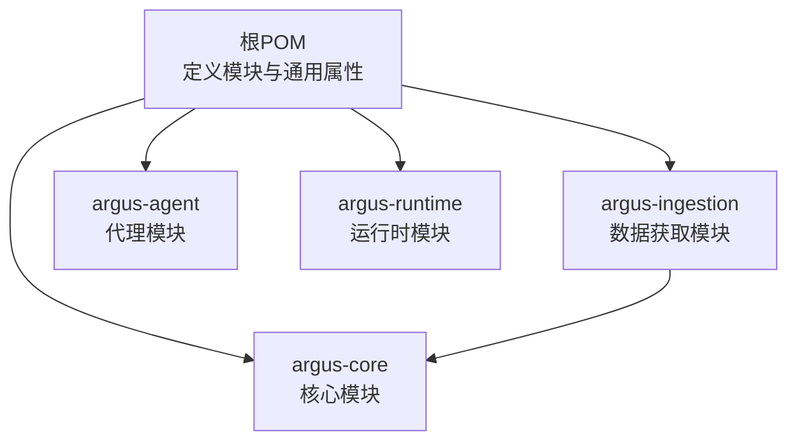
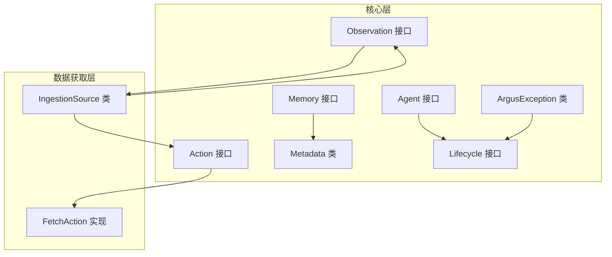
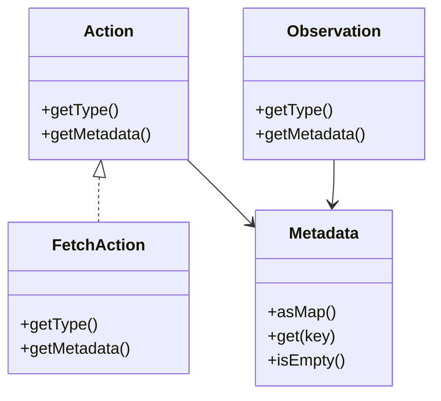
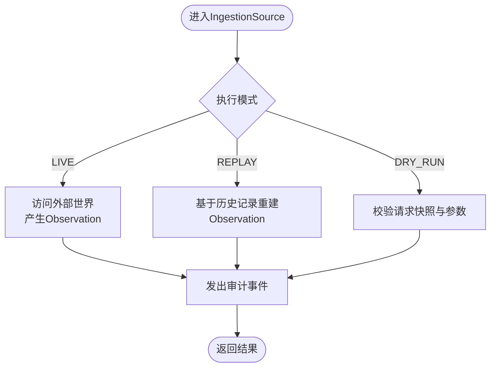
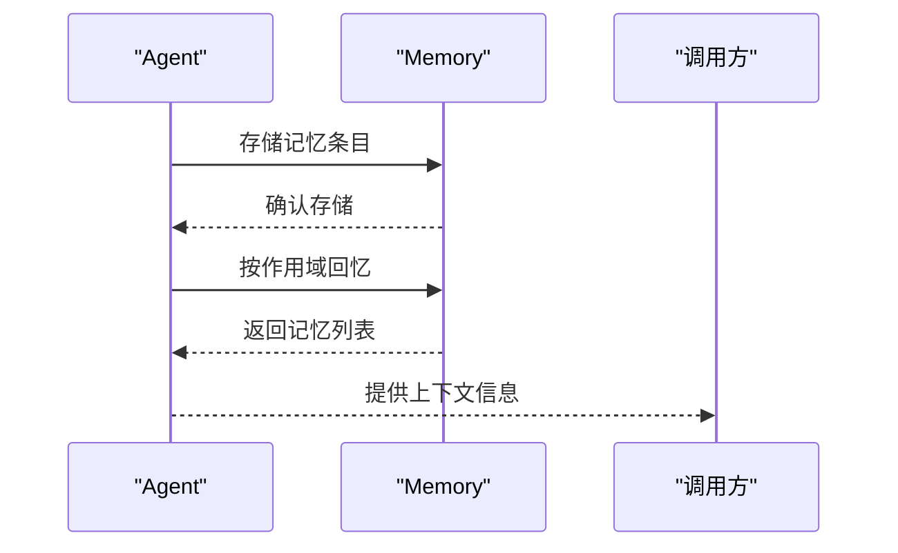

# 代码贡献指南

<cite>
**本文引用的文件**
- [根POM](file://pom.xml)
- [核心模块POM](file://argus-core/pom.xml)
- [数据获取模块POM](file://argus-ingestion/pom.xml)
- [代理模块POM](file://argus-agent/pom.xml)
- [README](file://readme.md)
- [核心模块：Action接口](file://argus-core/src/main/java/io/argus/core/action/Action.java)
- [核心模块：Agent接口](file://argus-core/src/main/java/io/argus/core/agent/Agent.java)
- [核心模块：Memory接口](file://argus-core/src/main/java/io/argus/core/memory/Memory.java)
- [核心模块：Observation接口](file://argus-core/src/main/java/io/argus/core/observation/Observation.java)
- [核心模块：Metadata类](file://argus-core/src/main/java/io/argus/core/model/Metadata.java)
- [核心模块：Lifecycle接口](file://argus-core/src/main/java/io/argus/core/lifecycle/Lifecycle.java)
- [核心模块：ArgusException类](file://argus-core/src/main/java/io/argus/core/error/ArgusException.java)
- [数据获取模块：FetchAction类](file://argus-ingestion/src/main/java/io/argus/ingestion/fetch/FetchAction.java)
- [数据获取模块：IngestionSource类](file://argus-ingestion/src/main/java/io/argus/ingestion/source/IngestionSource.java)
</cite>

## 目录
1. 引言
2. 项目结构
3. 核心组件
4. 架构总览
5. 详细组件分析
6. 依赖分析
7. 性能考虑
8. 故障排查指南
9. 结论
10. 附录

## 引言
本指南面向Argus框架贡献者，提供从代码风格、命名约定、架构设计原则到Pull Request流程、代码审查标准、合并策略的完整实践说明；同时涵盖模块间依赖关系、接口设计规范、单元测试编写与覆盖率要求、文档与API注释标准、代码质量检查工具配置与静态分析要求，以及贡献者行为准则与社区沟通指南。目标是帮助贡献者高效、高质量地参与Argus开发。

## 项目结构
Argus采用多模块Maven聚合工程组织，顶层POM定义模块清单与通用属性，各子模块按职责划分：
- argus-core：核心基础能力（Action、Agent、Memory、Observation等）
- argus-ingestion：网络知识获取（Fetch、Parse、Policy）
- argus-agent：AI代理集成支持
- argus-runtime：生产级运行时容器



图表来源
- [根POM](file://pom.xml#L1-L40)
- [核心模块POM](file://argus-core/pom.xml#L1-L18)
- [数据获取模块POM](file://argus-ingestion/pom.xml#L1-L29)
- [代理模块POM](file://argus-agent/pom.xml#L1-L23)

章节来源
- [根POM](file://pom.xml#L1-L40)
- [README](file://readme.md#L1-L28)

## 核心组件
本节聚焦核心抽象与关键实现，阐明设计原则与使用约束，便于贡献者理解与扩展。

- Action接口：声明代理意图的不可变模型，强调“意图”而非“执行细节”，通过ActionType分类与Metadata承载上下文。
- Observation接口：声明代理观察到的事实，强调不可变性与事实性，通过ObservationType分类与Metadata承载上下文。
- Agent接口：定义代理初始状态入口，作为生命周期与状态机的起点。
- Memory接口：提供存储与回忆机制，支持按作用域检索记忆条目。
- Metadata类：不可变键值映射容器，提供安全访问与空值处理。
- Lifecycle接口：统一生命周期契约的标记接口。
- ArgusException类：异常类型占位，建议按领域细化异常类型并在子模块中实现。
- FetchAction类：数据获取动作的具体实现，遵循Action接口契约。
- IngestionSource类：数据获取源的权威边界定义，强调事实性、回放语义、请求快照与审计要求。

章节来源
- [核心模块：Action接口](file://argus-core/src/main/java/io/argus/core/action/Action.java#L1-L43)
- [核心模块：Observation接口](file://argus-core/src/main/java/io/argus/core/observation/Observation.java#L1-L37)
- [核心模块：Agent接口](file://argus-core/src/main/java/io/argus/core/agent/Agent.java#L1-L11)
- [核心模块：Memory接口](file://argus-core/src/main/java/io/argus/core/memory/Memory.java#L1-L15)
- [核心模块：Metadata类](file://argus-core/src/main/java/io/argus/core/model/Metadata.java#L1-L34)
- [核心模块：Lifecycle接口](file://argus-core/src/main/java/io/argus/core/lifecycle/Lifecycle.java#L1-L8)
- [核心模块：ArgusException类](file://argus-core/src/main/java/io/argus/core/error/ArgusException.java#L1-L8)
- [数据获取模块：FetchAction类](file://argus-ingestion/src/main/java/io/argus/ingestion/fetch/FetchAction.java#L1-L21)
- [数据获取模块：IngestionSource类](file://argus-ingestion/src/main/java/io/argus/ingestion/source/IngestionSource.java#L1-L110)

## 架构总览
Argus采用清晰的分层与解耦设计：
- 核心层（argus-core）提供通用抽象与基础能力（Action、Observation、Agent、Memory、Metadata等），不依赖具体实现。
- 数据获取层（argus-ingestion）基于核心层扩展网络数据获取能力，并通过依赖关系与核心层交互。
- 代理层（argus-agent）与运行时层（argus-runtime）分别承担代理集成与生产容器职责，保持与核心层的低耦合。



图表来源
- [核心模块：Action接口](file://argus-core/src/main/java/io/argus/core/action/Action.java#L1-L43)
- [核心模块：Observation接口](file://argus-core/src/main/java/io/argus/core/observation/Observation.java#L1-L37)
- [核心模块：Agent接口](file://argus-core/src/main/java/io/argus/core/agent/Agent.java#L1-L11)
- [核心模块：Memory接口](file://argus-core/src/main/java/io/argus/core/memory/Memory.java#L1-L15)
- [核心模块：Metadata类](file://argus-core/src/main/java/io/argus/core/model/Metadata.java#L1-L34)
- [核心模块：Lifecycle接口](file://argus-core/src/main/java/io/argus/core/lifecycle/Lifecycle.java#L1-L8)
- [核心模块：ArgusException类](file://argus-core/src/main/java/io/argus/core/error/ArgusException.java#L1-L8)
- [数据获取模块：FetchAction类](file://argus-ingestion/src/main/java/io/argus/ingestion/fetch/FetchAction.java#L1-L21)
- [数据获取模块：IngestionSource类](file://argus-ingestion/src/main/java/io/argus/ingestion/source/IngestionSource.java#L1-L110)

## 详细组件分析

### 组件一：Action与Observation建模
- 设计要点
  - Action强调“意图”与“不可变事实”的分离：Observation用于表达“发生了什么”，Action用于表达“要做什么”。两者均通过类型枚举与Metadata承载语义。
  - Metadata为不可变容器，提供安全访问与空值处理，避免在接口中内嵌执行细节。
- 贡献建议
  - 新增动作类型时，优先通过Metadata扩展语义，而非新增类型枚举。
  - 扩展实现需严格遵守不可变性与无副作用约束。



图表来源
- [核心模块：Action接口](file://argus-core/src/main/java/io/argus/core/action/Action.java#L1-L43)
- [核心模块：Observation接口](file://argus-core/src/main/java/io/argus/core/observation/Observation.java#L1-L37)
- [核心模块：Metadata类](file://argus-core/src/main/java/io/argus/core/model/Metadata.java#L1-L34)
- [数据获取模块：FetchAction类](file://argus-ingestion/src/main/java/io/argus/ingestion/fetch/FetchAction.java#L1-L21)

章节来源
- [核心模块：Action接口](file://argus-core/src/main/java/io/argus/core/action/Action.java#L1-L43)
- [核心模块：Observation接口](file://argus-core/src/main/java/io/argus/core/observation/Observation.java#L1-L37)
- [核心模块：Metadata类](file://argus-core/src/main/java/io/argus/core/model/Metadata.java#L1-L34)
- [数据获取模块：FetchAction类](file://argus-ingestion/src/main/java/io/argus/ingestion/fetch/FetchAction.java#L1-L21)

### 组件二：IngestionSource权威边界与回放语义
- 设计要点
  - IngestionSource定义运行时与外部世界的权威边界，产出“事实”而非“期望”。
  - 回放语义要求：在REPLAY模式下不得再次访问外部世界，仅能基于已记录的事实重建Observation。
  - 请求快照要求：每次获取操作必须由IngestionRequest完整描述，确保可审计、可推理、可回放。
  - 审计要求：无论Live/Replay/DryRun，均需发出审计事件。
- 贡献建议
  - 实现类需明确区分Live/Replay/DryRun三种模式的行为边界。
  - 任何可能引入新外部事实的操作都应避免在Replay阶段执行。



图表来源
- [数据获取模块：IngestionSource类](file://argus-ingestion/src/main/java/io/argus/ingestion/source/IngestionSource.java#L75-L83)
- [数据获取模块：IngestionSource类](file://argus-ingestion/src/main/java/io/argus/ingestion/source/IngestionSource.java#L34-L52)
- [数据获取模块：IngestionSource类](file://argus-ingestion/src/main/java/io/argus/ingestion/source/IngestionSource.java#L53-L63)
- [数据获取模块：IngestionSource类](file://argus-ingestion/src/main/java/io/argus/ingestion/source/IngestionSource.java#L64-L74)

章节来源
- [数据获取模块：IngestionSource类](file://argus-ingestion/src/main/java/io/argus/ingestion/source/IngestionSource.java#L1-L110)

### 组件三：Agent与Memory协作
- 设计要点
  - Agent提供初始状态，Memory提供存储与回忆能力，二者通过AgentContext等上下文协作。
  - Memory接口定义存储与按作用域回忆的能力，保证数据检索的一致性与可控性。
- 贡献建议
  - 新增记忆策略时，需明确作用域与检索规则，确保与Agent状态机协同。



图表来源
- [核心模块：Agent接口](file://argus-core/src/main/java/io/argus/core/agent/Agent.java#L1-L11)
- [核心模块：Memory接口](file://argus-core/src/main/java/io/argus/core/memory/Memory.java#L1-L15)

章节来源
- [核心模块：Agent接口](file://argus-core/src/main/java/io/argus/core/agent/Agent.java#L1-L11)
- [核心模块：Memory接口](file://argus-core/src/main/java/io/argus/core/memory/Memory.java#L1-L15)

## 依赖分析
- 模块依赖
  - argus-ingestion依赖argus-core，体现数据获取层对核心能力的复用。
  - 其他模块（argus-agent、argus-runtime）在顶层POM中声明，当前未见显式跨模块依赖，保持高内聚低耦合。
- 依赖关系图

```mermaid
graph LR
CORE["argus-core"] <-- "依赖" -- ING["argus-ingestion"]
ROOT["根POM"] --> CORE
ROOT --> ING
ROOT --> AGT["argus-agent"]
ROOT --> RT["argus-runtime"]
```

图表来源
- [根POM](file://pom.xml#L24-L29)
- [数据获取模块POM](file://argus-ingestion/pom.xml#L21-L27)

章节来源
- [根POM](file://pom.xml#L1-L40)
- [数据获取模块POM](file://argus-ingestion/pom.xml#L1-L29)

## 性能考虑
- 低开销抽象：核心接口尽量薄，避免在接口中引入执行细节与性能瓶颈。
- 不可变性：Metadata与Observation的不可变设计降低并发访问风险，提升缓存与回放效率。
- 作用域检索：Memory按作用域回忆，有助于减少无关数据扫描，提高检索性能。
- 回放优化：IngestionSource在Replay模式下避免外部访问，减少IO与网络开销。

## 故障排查指南
- 异常体系
  - 当前核心异常类型为占位类，建议在子模块中按领域细化异常类型，统一错误码与消息格式，便于定位问题。
- 审计与回放
  - 若发现回放结果不一致，优先检查请求快照是否完整、外部访问是否被遗漏或重复。
- 单元测试
  - 针对Action/Observation建模与IngestionSource回放语义编写测试，覆盖Live/Replay/DryRun三种模式。

章节来源
- [核心模块：ArgusException类](file://argus-core/src/main/java/io/argus/core/error/ArgusException.java#L1-L8)
- [数据获取模块：IngestionSource类](file://argus-ingestion/src/main/java/io/argus/ingestion/source/IngestionSource.java#L34-L52)
- [数据获取模块：IngestionSource类](file://argus-ingestion/src/main/java/io/argus/ingestion/source/IngestionSource.java#L53-L63)

## 结论
本指南提供了Argus贡献者的完整实践路径：从模块化架构与接口设计原则出发，结合Pull Request流程、代码审查标准与合并策略，辅以测试与文档规范、质量检查工具配置，帮助贡献者高效、高质量地推进Argus演进。

## 附录

### 代码风格与命名约定
- 包名：采用反向域名+功能域的层级结构，如io.argus.core.action。
- 类名：采用名词或复合名词，首字母大写；接口以Action/Observation等抽象名词命名。
- 方法名：采用动词短语，遵循小驼峰；纯查询方法使用is/get。
- 常量：全部大写，单词以下划线分隔。
- 注释：接口与关键类提供中英文双语注释，说明职责、不变式与使用约束。

### Pull Request流程与审查标准
- 分支策略
  - 功能分支以feature/前缀命名，修复分支以fix/前缀命名，发布分支以release/前缀命名。
- 提交信息
  - 使用动词开头的简短标题，必要时在正文说明背景、变更点与影响范围。
- PR模板
  - 描述变更内容、动机与测试策略；勾选是否破坏性变更、是否需要更新文档。
- 审查标准
  - 代码正确性、可读性、可维护性；是否符合接口契约与不变式；是否具备充分测试；是否满足性能与安全要求。
- 合并策略
  - 通过审查后方可合并；优先squash合并以保持提交历史整洁；涉及重大变更需至少两名维护者批准。

### 接口设计规范
- 最小接口原则：接口方法数量尽可能少，职责单一。
- 不变式声明：在接口与实现类注释中明确前置条件、后置条件与不变式。
- 可回放性：对外部世界有副作用的接口需支持回放，且在Replay模式下不产生新外部事实。
- 可审计性：所有关键操作需可审计，提供审计事件与请求快照。

### 单元测试编写指南与覆盖率要求
- 测试分层
  - 单元测试：针对接口与实现类的最小可测试单元，覆盖正常/异常路径。
  - 集成测试：验证模块间协作，特别是IngestionSource在不同模式下的行为。
- 覆盖率
  - 关键路径与业务逻辑覆盖率不低于80%，分支覆盖率不低于60%。
- 测试命名
  - 采用Test后缀，方法名描述场景与期望结果，如testFetchActionWithInvalidUrl。

### 文档与API注释标准
- README：概述项目目标、模块结构与快速开始。
- 模块文档：说明模块职责、依赖关系与使用示例。
- API注释：接口与类提供中英文双语注释，明确职责、参数、返回值、异常与不变式。

### 代码质量检查工具与静态分析
- 工具建议
  - SpotBugs/Javarifier：静态分析与潜在缺陷检测。
  - PMD/Cpd：代码规范与重复代码检测。
  - Checkstyle：统一编码风格与命名规范。
- 配置
  - 在根目录提供统一的checkstyle与spotbugs配置文件，所有模块继承。
  - CI中强制执行静态分析与测试，失败则阻断合并。

### 贡献者行为准则与社区沟通
- 行为准则
  - 尊重与包容，禁止歧视与骚扰；尊重不同观点与文化背景。
  - 基于事实与数据进行讨论，避免人身攻击。
- 社区沟通
  - 讨论问题优先在Issue中进行，PR中聚焦代码变更。
  - 对审查意见积极响应与修改，保持开放心态。