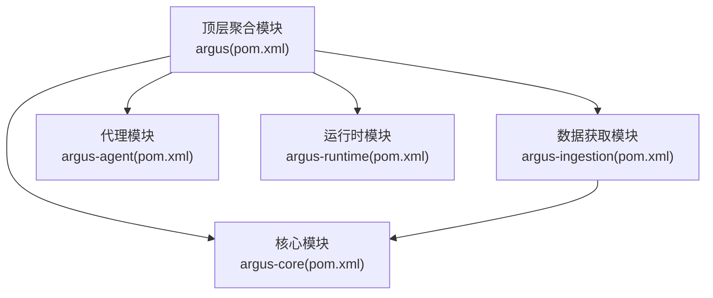
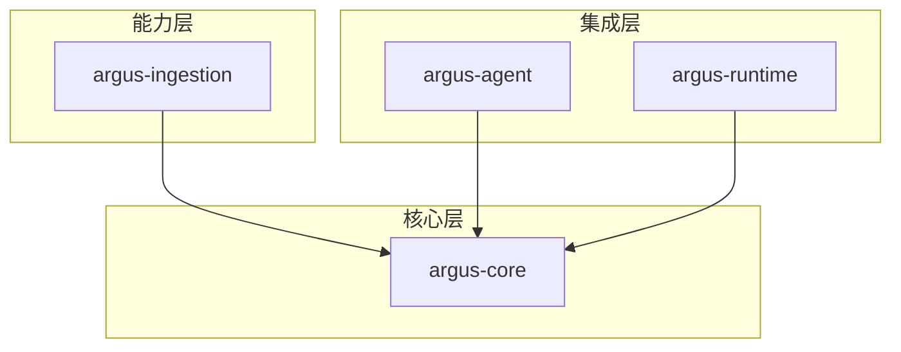
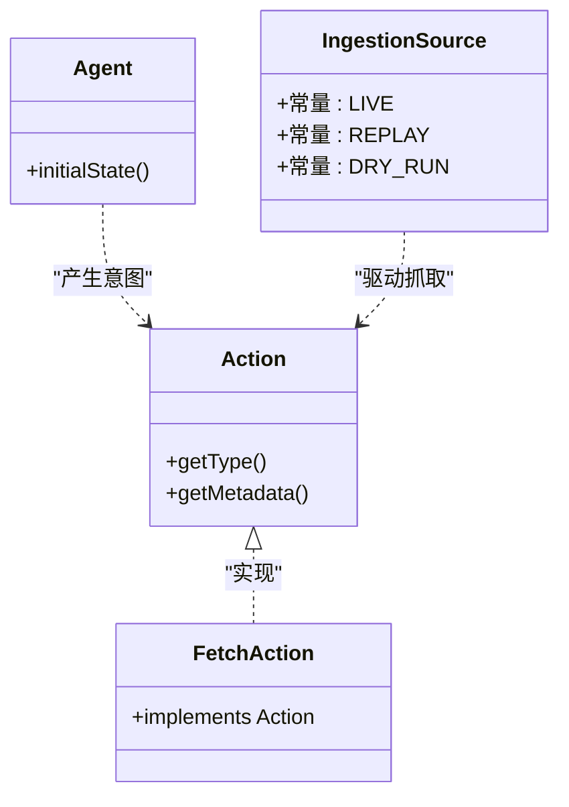
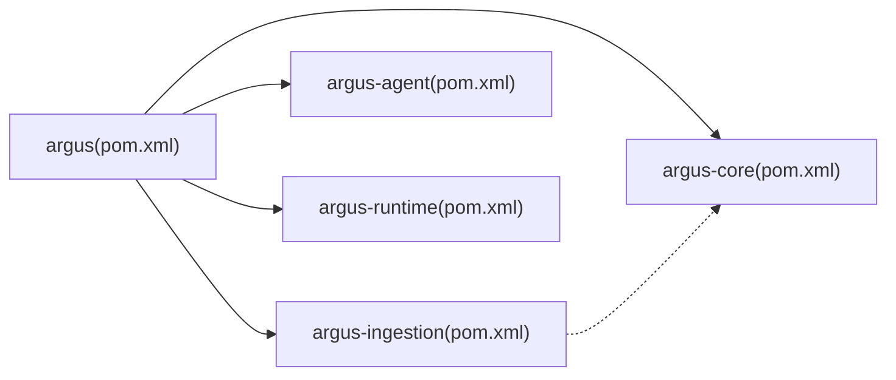

# 开发环境搭建

<cite>
**本文档引用的文件**
- [pom.xml](file://pom.xml)
- [readme.md](file://readme.md)
- [argus-core/pom.xml](file://argus-core/pom.xml)
- [argus-ingestion/pom.xml](file://argus-ingestion/pom.xml)
- [argus-agent/pom.xml](file://argus-agent/pom.xml)
- [argus-runtime/pom.xml](file://argus-runtime/pom.xml)
- [.idea/misc.xml](file://.idea/misc.xml)
- [.idea/compiler.xml](file://.idea/compiler.xml)
- [.idea/modules.xml](file://.idea/modules.xml)
- [.gitignore](file://.gitignore)
- [argus-core/src/main/java/io/argus/core/action/Action.java](file://argus-core/src/main/java/io/argus/core/action/Action.java)
- [argus-core/src/main/java/io/argus/core/agent/Agent.java](file://argus-core/src/main/java/io/argus/core/agent/Agent.java)
- [argus-ingestion/src/main/java/io/argus/ingestion/fetch/FetchAction.java](file://argus-ingestion/src/main/java/io/argus/ingestion/fetch/FetchAction.java)
- [argus-ingestion/src/main/java/io/argus/ingestion/source/IngestionSource.java](file://argus-ingestion/src/main/java/io/argus/ingestion/source/IngestionSource.java)
</cite>

## 目录
1. [简介](#简介)
2. [项目结构](#项目结构)
3. [核心组件](#核心组件)
4. [架构总览](#架构总览)
5. [详细组件分析](#详细组件分析)
6. [依赖分析](#依赖分析)
7. [性能考虑](#性能考虑)
8. [故障排除指南](#故障排除指南)
9. [结论](#结论)
10. [附录](#附录)

## 简介
本指南面向Argus框架开发者，提供从零开始搭建完整开发环境的操作步骤，涵盖JDK版本要求、Maven配置、IDE设置、多模块结构与依赖关系、Git工作流与分支策略、代码格式化规则与IDE插件推荐、常见问题排查以及Docker环境配置建议。目标是帮助开发者快速、稳定地完成本地开发环境准备，并理解项目整体架构与模块职责。

## 项目结构
Argus采用多模块Maven聚合工程，顶层POM统一管理模块与通用属性，各子模块按功能划分：核心能力、数据获取、代理集成、运行时容器。顶层README提供了模块说明与快速开始命令。

图表来源
- [pom.xml](file://pom.xml#L24-L29)
- [argus-ingestion/pom.xml](file://argus-ingestion/pom.xml#L21-L27)

章节来源
- [pom.xml](file://pom.xml#L1-L40)
- [readme.md](file://readme.md#L7-L14)

## 核心组件
- JDK版本与语言级别
  - 项目根目录的IDEA配置显示使用JDK 21作为默认语言级别，并指定GraalVM JDK名称。建议在本地开发环境中保持一致的JDK版本，确保编译与运行兼容性。
- Maven配置
  - 顶层POM定义了项目的基本属性与模块列表；各子模块继承父POM并声明自身坐标与描述信息；数据获取模块显式声明对核心模块的依赖。
- IDE设置
  - IDEA已启用外部存储配置、Maven项目管理、注解处理输出路径，并为所有模块启用了注解处理器配置。

章节来源
- [.idea/misc.xml](file://.idea/misc.xml#L11-L11)
- [.idea/compiler.xml](file://.idea/compiler.xml#L4-L14)
- [.idea/modules.xml](file://.idea/modules.xml#L4-L7)
- [pom.xml](file://pom.xml#L19-L21)
- [argus-ingestion/pom.xml](file://argus-ingestion/pom.xml#L21-L27)

## 架构总览
Argus的模块化架构遵循“核心能力优先、功能逐步扩展”的设计思路：数据获取模块依赖核心模块，代理与运行时模块在更高层提供集成与部署能力。下图展示了模块间的依赖关系与职责边界。

图表来源
- [pom.xml](file://pom.xml#L24-L29)
- [argus-ingestion/pom.xml](file://argus-ingestion/pom.xml#L21-L27)

## 详细组件分析

### 模块与职责
- argus-core：提供基础抽象与领域模型，如Action、Agent等接口与实体，是其他模块的基础依赖。
- argus-ingestion：实现网络知识获取能力，包括抓取、解析、策略等子域，依赖核心模块。
- argus-agent：提供代理集成支持，面向运行时的代理生命周期与状态管理。
- argus-runtime：提供生产级运行时容器，承载核心与集成能力。

章节来源
- [readme.md](file://readme.md#L11-L14)
- [argus-core/pom.xml](file://argus-core/pom.xml#L1-L18)
- [argus-ingestion/pom.xml](file://argus-ingestion/pom.xml#L1-L29)
- [argus-agent/pom.xml](file://argus-agent/pom.xml#L1-L23)
- [argus-runtime/pom.xml](file://argus-runtime/pom.xml#L1-L22)

### 关键接口与类关系
以下类图展示了核心接口与实现的关系，体现“声明式意图”和“事实性观测”的设计思想。

图表来源
- [argus-core/src/main/java/io/argus/core/action/Action.java](file://argus-core/src/main/java/io/argus/core/action/Action.java#L37-L43)
- [argus-core/src/main/java/io/argus/core/agent/Agent.java](file://argus-core/src/main/java/io/argus/core/agent/Agent.java#L7-L11)
- [argus-ingestion/src/main/java/io/argus/ingestion/fetch/FetchAction.java](file://argus-ingestion/src/main/java/io/argus/ingestion/fetch/FetchAction.java#L11-L21)
- [argus-ingestion/src/main/java/io/argus/ingestion/source/IngestionSource.java](file://argus-ingestion/src/main/java/io/argus/ingestion/source/IngestionSource.java#L75-L83)

## 依赖分析
- 顶层聚合模块定义了模块清单与通用属性。
- 数据获取模块显式依赖核心模块，确保其能够使用核心提供的抽象与模型。
- 测试依赖使用JUnit 3.8.1，建议在实际开发中根据团队规范升级到更新版本。

图表来源
- [pom.xml](file://pom.xml#L24-L29)
- [argus-ingestion/pom.xml](file://argus-ingestion/pom.xml#L21-L27)

章节来源
- [pom.xml](file://pom.xml#L31-L38)
- [argus-ingestion/pom.xml](file://argus-ingestion/pom.xml#L21-L27)

## 性能考虑
- 使用与IDE一致的JDK版本（JDK 21/GraalVM）有助于避免编译与运行时差异导致的性能波动。
- 启用注解处理可提升开发阶段的类型安全与IDE智能提示质量。
- 在多模块工程中，优先构建依赖较少的模块，减少编译时间。

## 故障排除指南
- JDK版本不匹配
  - 现象：编译报错或运行时类版本不兼容。
  - 处理：确保本地JDK版本与IDE配置一致（JDK 21），必要时切换IDE SDK设置。
- Maven模块导入异常
  - 现象：IDE无法识别模块或依赖解析失败。
  - 处理：刷新Maven项目、清理IDE缓存、确认顶层POM与模块POM路径正确。
- 注解处理未生效
  - 现象：生成的源码缺失或IDE无对应提示。
  - 处理：检查IDE注解处理配置是否启用，确认生成目录位于target路径。
- Git忽略规则冲突
  - 现象：本地IDE文件频繁出现在变更列表。
  - 处理：确认.gitignore中包含IDE相关文件模式，必要时清理已跟踪的IDE文件。

章节来源
- [.idea/misc.xml](file://.idea/misc.xml#L11-L11)
- [.idea/compiler.xml](file://.idea/compiler.xml#L4-L14)
- [.gitignore](file://.gitignore#L6-L39)

## 结论
通过遵循本指南，开发者可以快速完成Argus框架的本地开发环境搭建：统一JDK版本、正确配置Maven与IDE、理解模块依赖关系、建立规范的Git工作流，并在遇到问题时具备有效的排查手段。后续可在现有基础上扩展Docker容器化方案，以进一步提升开发与部署效率。

## 附录

### 开发环境搭建步骤
- 克隆仓库
  - 使用Git克隆项目至本地工作区。
- 导入模块
  - 在IDE中打开顶层POM文件，自动识别并导入所有子模块。
- 配置JDK与Maven
  - 设置JDK 21为项目语言级别，确保IDE与Maven使用相同版本。
- 验证构建
  - 执行Maven命令完成编译与打包，验证模块依赖关系正常。

章节来源
- [pom.xml](file://pom.xml#L24-L29)
- [.idea/misc.xml](file://.idea/misc.xml#L11-L11)

### Git工作流程与分支管理策略
- 分支命名
  - 功能开发：feature/模块名/功能点
  - 修复缺陷：fix/模块名/问题描述
  - 热修复：hotfix/版本号/紧急修复
- 提交规范
  - 使用清晰的提交信息，描述变更目的与影响范围。
- 合并与审查
  - 通过Pull Request进行代码审查，合并前确保构建通过与测试覆盖。

章节来源
- [readme.md](file://readme.md#L18-L21)

### 代码格式化规则与IDE插件推荐
- 代码格式化
  - 统一使用项目内现有风格，保持跨模块一致性。
- 推荐插件
  - Lombok（若使用注解简化代码）
  - EditorConfig（统一缩进、换行等）
  - CheckStyle/SpotBugs（静态分析与质量检查）

章节来源
- [.idea/compiler.xml](file://.idea/compiler.xml#L4-L14)

### Docker环境配置选项与容器化开发支持
- 容器化建议
  - 基于JDK 21镜像构建多阶段Dockerfile，分离编译与运行环境。
  - 将Maven依赖缓存到独立层，提升构建缓存命中率。
  - 使用只读根文件系统与最小权限运行容器，增强安全性。
- 开发容器
  - 可选：使用Docker Compose组合开发环境（数据库、缓存等），通过挂载本地源码目录实现热更新与调试。

[本节为通用实践建议，不直接分析具体文件，故不附加章节来源]