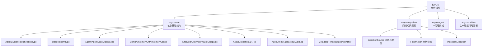
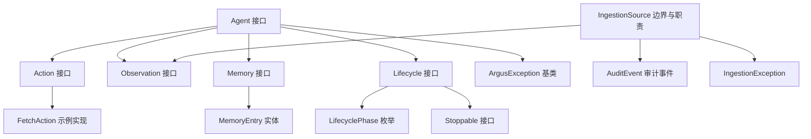
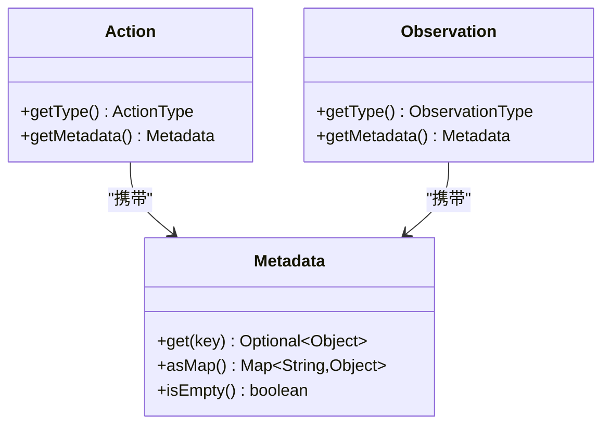
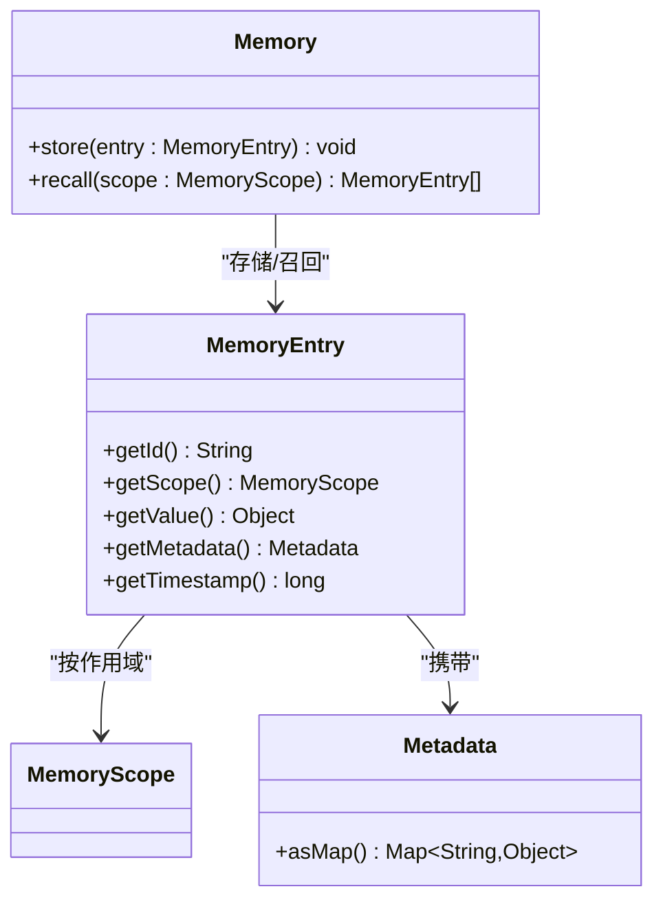
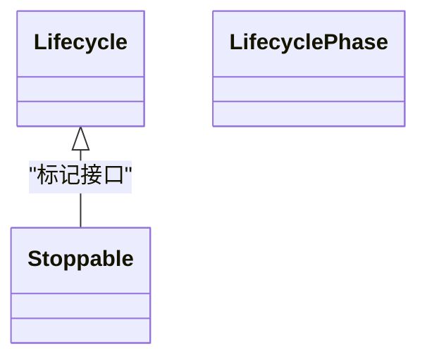
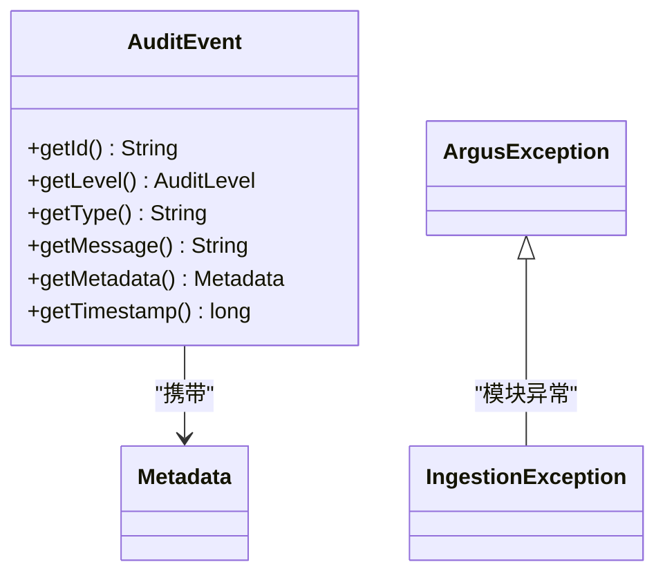
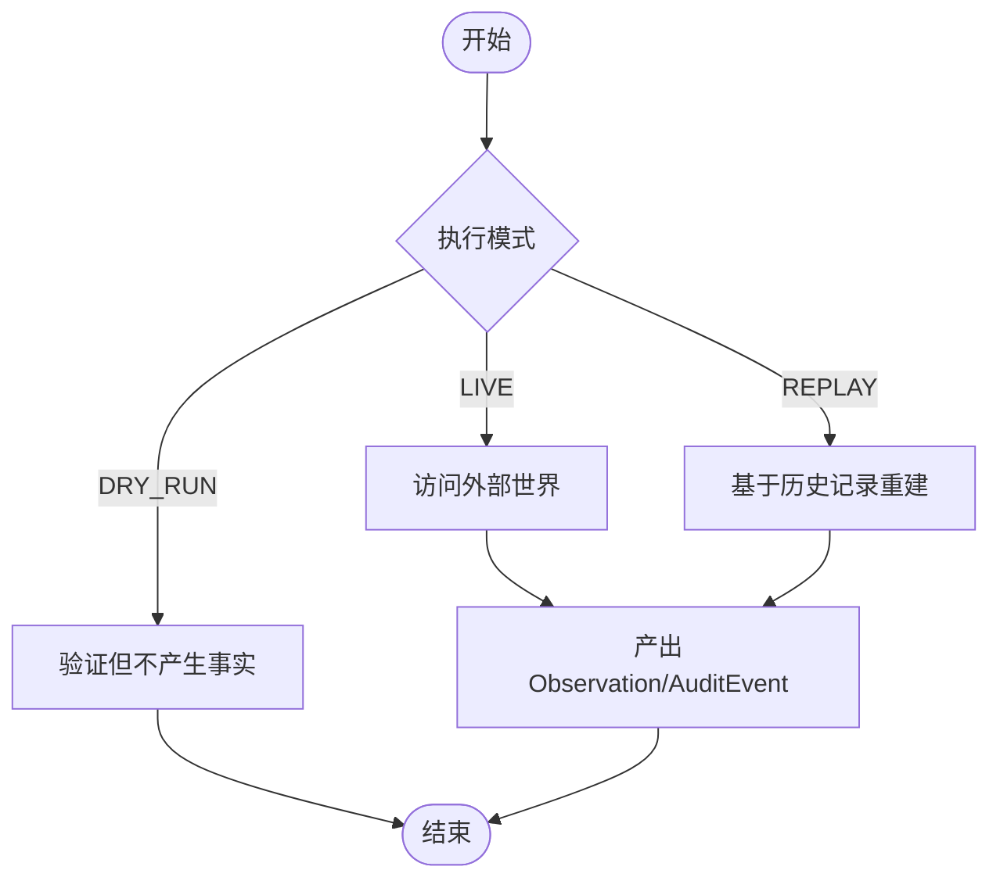
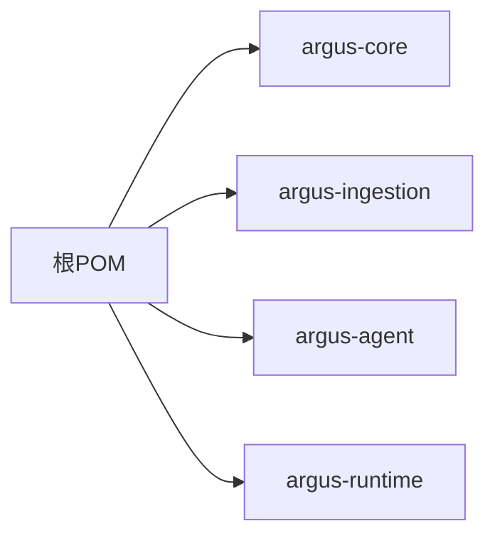

# 开发者指南

<cite>
**本文引用的文件**
- [根POM](file://pom.xml)
- [模块说明](file://readme.md)
- [核心模块：Action 接口](file://argus-core/src/main/java/io/argus/core/action/Action.java)
- [核心模块：Observation 接口](file://argus-core/src/main/java/io/argus/core/observation/Observation.java)
- [核心模块：Agent 接口](file://argus-core/src/main/java/io/argus/core/agent/Agent.java)
- [核心模块：Memory 接口与实体](file://argus-core/src/main/java/io/argus/core/memory/Memory.java)
- [核心模块：MemoryEntry 实体](file://argus-core/src/main/java/io/argus/core/memory/MemoryEntry.java)
- [核心模块：MemoryScope 枚举](file://argus-core/src/main/java/io/argus/core/memory/MemoryScope.java)
- [核心模块：Lifecycle 接口](file://argus-core/src/main/java/io/argus/core/lifecycle/Lifecycle.java)
- [核心模块：LifecyclePhase 枚举](file://argus-core/src/main/java/io/argus/core/lifecycle/LifecyclePhase.java)
- [核心模块：Stoppable 接口](file://argus-core/src/main/java/io/argus/core/lifecycle/Stoppable.java)
- [核心模块：ArgusException 异常基类](file://argus-core/src/main/java/io/argus/core/error/ArgusException.java)
- [核心模块：Metadata 元数据](file://argus-core/src/main/java/io/argus/core/model/Metadata.java)
- [核心模块：Timestamped 时间戳接口](file://argus-core/src/main/java/io/argus/core/model/Timestamped.java)
- [核心模块：AuditEvent 审计事件](file://argus-core/src/main/java/io/argus/core/audit/AuditEvent.java)
- [摄取模块：FetchAction 示例实现](file://argus-ingestion/src/main/java/io/argus/ingestion/fetch/FetchAction.java)
- [摄取模块：IngestionSource 边界与职责](file://argus-ingestion/src/main/java/io/argus/ingestion/source/IngestionSource.java)
- [摄取模块：IngestionException 异常类型](file://argus-ingestion/src/main/java/io/argus/ingestion/error/IngestionException.java)
</cite>

## 目录
1. [引言](#引言)
2. [项目结构](#项目结构)
3. [核心组件](#核心组件)
4. [架构总览](#架构总览)
5. [详细组件分析](#详细组件分析)
6. [依赖分析](#依赖分析)
7. [性能考虑](#性能考虑)
8. [故障排查指南](#故障排查指南)
9. [结论](#结论)
10. [附录](#附录)

## 引言
本指南面向Argus框架的开发者，目标是帮助你快速理解并高效参与项目贡献。内容涵盖代码与提交规范、测试要求、构建与依赖管理、版本控制策略、错误处理与异常体系、生命周期管理接口、调试技巧与工具、性能优化与内存管理、扩展点（自定义Action/ Observation）、完整开发环境配置以及常见问题解决。

## 项目结构
Argus采用多模块Maven聚合工程组织，核心模块围绕“可审计、可控制、可复现”的设计原则展开，分别提供基础能力、网络知识摄取、代理集成与运行时容器支撑。

图表来源
- [根POM](file://pom.xml#L24-L29)
- [模块说明](file://readme.md#L7-L14)

章节来源
- [根POM](file://pom.xml#L1-L40)
- [模块说明](file://readme.md#L1-L28)

## 核心组件
- Action/ Observation/ Agent/ Memory/ Lifecycle/ Audit/ Error/ Model：这些是框架的基石，定义了代理意图、观测事实、记忆存储、生命周期、审计与异常等横切能力。
- IngestionSource：定义与外部世界的权威边界，强调事实性、可回放性与审计性，避免隐藏副作用。
- FetchAction：作为Action的具体示例，展示如何实现接口并返回类型与元数据。

章节来源
- [核心模块：Action 接口](file://argus-core/src/main/java/io/argus/core/action/Action.java#L1-L43)
- [核心模块：Observation 接口](file://argus-core/src/main/java/io/argus/core/observation/Observation.java#L1-L37)
- [核心模块：Agent 接口](file://argus-core/src/main/java/io/argus/core/agent/Agent.java#L1-L11)
- [核心模块：Memory 接口与实体](file://argus-core/src/main/java/io/argus/core/memory/Memory.java#L1-L15)
- [核心模块：MemoryEntry 实体](file://argus-core/src/main/java/io/argus/core/memory/MemoryEntry.java#L1-L53)
- [核心模块：MemoryScope 枚举](file://argus-core/src/main/java/io/argus/core/memory/MemoryScope.java#L1-L8)
- [核心模块：Lifecycle 接口](file://argus-core/src/main/java/io/argus/core/lifecycle/Lifecycle.java#L1-L8)
- [核心模块：LifecyclePhase 枚举](file://argus-core/src/main/java/io/argus/core/lifecycle/LifecyclePhase.java#L1-L8)
- [核心模块：Stoppable 接口](file://argus-core/src/main/java/io/argus/core/lifecycle/Stoppable.java#L1-L8)
- [核心模块：ArgusException 异常基类](file://argus-core/src/main/java/io/argus/core/error/ArgusException.java#L1-L8)
- [核心模块：Metadata 元数据](file://argus-core/src/main/java/io/argus/core/model/Metadata.java#L1-L34)
- [核心模块：Timestamped 时间戳接口](file://argus-core/src/main/java/io/argus/core/model/Timestamped.java#L1-L8)
- [核心模块：AuditEvent 审计事件](file://argus-core/src/main/java/io/argus/core/audit/AuditEvent.java#L1-L60)
- [摄取模块：FetchAction 示例实现](file://argus-ingestion/src/main/java/io/argus/ingestion/fetch/FetchAction.java#L1-L21)
- [摄取模块：IngestionSource 边界与职责](file://argus-ingestion/src/main/java/io/argus/ingestion/source/IngestionSource.java#L1-L110)
- [摄取模块：IngestionException 异常类型](file://argus-ingestion/src/main/java/io/argus/ingestion/error/IngestionException.java#L1-L8)

## 架构总览
Argus以“代理-行动-观测-记忆-审计-回放”闭环为核心，IngestionSource负责从外部世界采集事实，并通过审计事件记录全过程；Agent根据Action与Observation驱动状态流转，Memory持久化关键上下文；Lifecycle抽象统一资源管理与停止流程；Error体系提供清晰的异常分层。

图表来源
- [核心模块：Agent 接口](file://argus-core/src/main/java/io/argus/core/agent/Agent.java#L1-L11)
- [核心模块：Action 接口](file://argus-core/src/main/java/io/argus/core/action/Action.java#L1-L43)
- [核心模块：Observation 接口](file://argus-core/src/main/java/io/argus/core/observation/Observation.java#L1-L37)
- [核心模块：Memory 接口与实体](file://argus-core/src/main/java/io/argus/core/memory/Memory.java#L1-L15)
- [核心模块：MemoryEntry 实体](file://argus-core/src/main/java/io/argus/core/memory/MemoryEntry.java#L1-L53)
- [核心模块：Lifecycle 接口](file://argus-core/src/main/java/io/argus/core/lifecycle/Lifecycle.java#L1-L8)
- [核心模块：LifecyclePhase 枚举](file://argus-core/src/main/java/io/argus/core/lifecycle/LifecyclePhase.java#L1-L8)
- [核心模块：Stoppable 接口](file://argus-core/src/main/java/io/argus/core/lifecycle/Stoppable.java#L1-L8)
- [核心模块：ArgusException 异常基类](file://argus-core/src/main/java/io/argus/core/error/ArgusException.java#L1-L8)
- [核心模块：AuditEvent 审计事件](file://argus-core/src/main/java/io/argus/core/audit/AuditEvent.java#L1-L60)
- [摄取模块：IngestionSource 边界与职责](file://argus-ingestion/src/main/java/io/argus/ingestion/source/IngestionSource.java#L1-L110)
- [摄取模块：IngestionException 异常类型](file://argus-ingestion/src/main/java/io/argus/ingestion/error/IngestionException.java#L1-L8)
- [摄取模块：FetchAction 示例实现](file://argus-ingestion/src/main/java/io/argus/ingestion/fetch/FetchAction.java#L1-L21)

## 详细组件分析

### Action 与 Observation：意图与事实的建模
- Action：声明代理意图，不包含执行细节；通过ActionType分类，通过Metadata承载领域信息。
- Observation：表达已发生的事实，不可变且不指导行为；通过ObservationType分类，通过Metadata承载上下文。
- 设计要点：分离意图与事实，确保推理与执行解耦；所有领域信息通过Metadata传递，避免类型体系膨胀。

图表来源
- [核心模块：Action 接口](file://argus-core/src/main/java/io/argus/core/action/Action.java#L1-L43)
- [核心模块：Observation 接口](file://argus-core/src/main/java/io/argus/core/observation/Observation.java#L1-L37)
- [核心模块：Metadata 元数据](file://argus-core/src/main/java/io/argus/core/model/Metadata.java#L1-L34)

章节来源
- [核心模块：Action 接口](file://argus-core/src/main/java/io/argus/core/action/Action.java#L1-L43)
- [核心模块：Observation 接口](file://argus-core/src/main/java/io/argus/core/observation/Observation.java#L1-L37)
- [核心模块：Metadata 元数据](file://argus-core/src/main/java/io/argus/core/model/Metadata.java#L1-L34)

### Agent：状态与初始态
- Agent接口定义初始状态，后续由运行时驱动其状态机演进。
- 最佳实践：将业务决策与状态管理集中在Agent内部，保持Action/ Observation纯声明式。

章节来源
- [核心模块：Agent 接口](file://argus-core/src/main/java/io/argus/core/agent/Agent.java#L1-L11)

### Memory：存储与召回
- Memory接口提供store/recall能力，结合MemoryEntry与MemoryScope实现按作用域的检索。
- MemoryEntry包含id、scope、value、metadata、timestamp，适合构建可审计的记忆单元。
- 最佳实践：严格区分作用域，避免跨域污染；对大对象谨慎缓存，注意内存占用与回收。

图表来源
- [核心模块：Memory 接口与实体](file://argus-core/src/main/java/io/argus/core/memory/Memory.java#L1-L15)
- [核心模块：MemoryEntry 实体](file://argus-core/src/main/java/io/argus/core/memory/MemoryEntry.java#L1-L53)
- [核心模块：MemoryScope 枚举](file://argus-core/src/main/java/io/argus/core/memory/MemoryScope.java#L1-L8)
- [核心模块：Metadata 元数据](file://argus-core/src/main/java/io/argus/core/model/Metadata.java#L1-L34)

章节来源
- [核心模块：Memory 接口与实体](file://argus-core/src/main/java/io/argus/core/memory/Memory.java#L1-L15)
- [核心模块：MemoryEntry 实体](file://argus-core/src/main/java/io/argus/core/memory/MemoryEntry.java#L1-L53)
- [核心模块：MemoryScope 枚举](file://argus-core/src/main/java/io/argus/core/memory/MemoryScope.java#L1-L8)
- [核心模块：Metadata 元数据](file://argus-core/src/main/java/io/argus/core/model/Metadata.java#L1-L34)

### Lifecycle：生命周期与停止
- Lifecycle为空接口，作为标记接口；LifecyclePhase与Stoppable提供阶段与停止能力。
- 最佳实践：在资源创建/销毁处实现Stoppable，确保优雅关闭；在关键阶段（初始化、启动、停止）发出审计事件。

图表来源
- [核心模块：Lifecycle 接口](file://argus-core/src/main/java/io/argus/core/lifecycle/Lifecycle.java#L1-L8)
- [核心模块：LifecyclePhase 枚举](file://argus-core/src/main/java/io/argus/core/lifecycle/LifecyclePhase.java#L1-L8)
- [核心模块：Stoppable 接口](file://argus-core/src/main/java/io/argus/core/lifecycle/Stoppable.java#L1-L8)

章节来源
- [核心模块：Lifecycle 接口](file://argus-core/src/main/java/io/argus/core/lifecycle/Lifecycle.java#L1-L8)
- [核心模块：LifecyclePhase 枚举](file://argus-core/src/main/java/io/argus/core/lifecycle/LifecyclePhase.java#L1-L8)
- [核心模块：Stoppable 接口](file://argus-core/src/main/java/io/argus/core/lifecycle/Stoppable.java#L1-L8)

### Audit 与 ArgusException：审计与异常体系
- AuditEvent：不可变的事实载体，包含id、level、type、message、metadata、timestamp，便于审计与回放。
- ArgusException：异常基类，建议按模块扩展专用异常（如IngestionException），保持异常语义清晰。
- 最佳实践：所有关键路径均应产生审计事件；异常应携带足够的上下文信息，避免吞掉关键堆栈。

图表来源
- [核心模块：AuditEvent 审计事件](file://argus-core/src/main/java/io/argus/core/audit/AuditEvent.java#L1-L60)
- [核心模块：ArgusException 异常基类](file://argus-core/src/main/java/io/argus/core/error/ArgusException.java#L1-L8)
- [摄取模块：IngestionException 异常类型](file://argus-ingestion/src/main/java/io/argus/ingestion/error/IngestionException.java#L1-L8)
- [核心模块：Metadata 元数据](file://argus-core/src/main/java/io/argus/core/model/Metadata.java#L1-L34)

章节来源
- [核心模块：AuditEvent 审计事件](file://argus-core/src/main/java/io/argus/core/audit/AuditEvent.java#L1-L60)
- [核心模块：ArgusException 异常基类](file://argus-core/src/main/java/io/argus/core/error/ArgusException.java#L1-L8)
- [摄取模块：IngestionException 异常类型](file://argus-ingestion/src/main/java/io/argus/ingestion/error/IngestionException.java#L1-L8)
- [核心模块：Metadata 元数据](file://argus-core/src/main/java/io/argus/core/model/Metadata.java#L1-L34)

### IngestionSource：权威边界与回放语义
- 定义与外部世界的边界，产出事实性Observation；强调回放时不得再次访问外部世界，仅能基于历史记录重建。
- 要求：请求快照必须完备，审计事件必须产生，执行模式需支持LIVE/REPLAY/DRY_RUN。
- 最佳实践：在DRY_RUN中校验输入与策略，避免真实副作用；在REPLAY中严格复用已记录结果。

图表来源
- [摄取模块：IngestionSource 边界与职责](file://argus-ingestion/src/main/java/io/argus/ingestion/source/IngestionSource.java#L75-L83)
- [摄取模块：IngestionSource 边界与职责](file://argus-ingestion/src/main/java/io/argus/ingestion/source/IngestionSource.java#L34-L52)
- [摄取模块：IngestionSource 边界与职责](file://argus-ingestion/src/main/java/io/argus/ingestion/source/IngestionSource.java#L64-L74)

章节来源
- [摄取模块：IngestionSource 边界与职责](file://argus-ingestion/src/main/java/io/argus/ingestion/source/IngestionSource.java#L1-L110)

### 扩展指南：自定义 Action 与 Observation
- 自定义Action：实现Action接口，返回明确的ActionType与Metadata；不要在Action中嵌入执行逻辑。
- 自定义Observation：实现Observation接口，返回明确的ObservationType与Metadata；确保不可变性。
- 示例参考：FetchAction展示了Action接口的最小实现方式。

章节来源
- [核心模块：Action 接口](file://argus-core/src/main/java/io/argus/core/action/Action.java#L1-L43)
- [核心模块：Observation 接口](file://argus-core/src/main/java/io/argus/core/observation/Observation.java#L1-L37)
- [摄取模块：FetchAction 示例实现](file://argus-ingestion/src/main/java/io/argus/ingestion/fetch/FetchAction.java#L1-L21)

## 依赖分析
- 聚合工程：根POM声明四个子模块，统一属性与测试依赖（JUnit 3.8.1）。
- 模块内聚：argus-core提供通用抽象；argus-ingestion基于核心抽象实现摄取能力；argus-agent/runtime为上层集成与运行时提供支撑。
- 外部依赖：当前根POM未声明额外运行时依赖，建议在各模块pom中按需引入。

图表来源
- [根POM](file://pom.xml#L24-L29)

章节来源
- [根POM](file://pom.xml#L1-L40)

## 性能考虑
- 记忆与回放：MemoryEntry包含timestamp与metadata，建议在recall时按时间窗口与作用域过滤，避免全量扫描。
- 回放确定性：IngestionSource在REPLAY模式下必须完全基于历史记录，避免新增副作用导致非确定性。
- 审计成本：AuditEvent不可变且频繁产生，建议批量输出或异步落盘，降低IO压力。
- 内存管理：MemoryEntry持有任意value，建议对大对象采用引用或序列化策略，配合LRU/过期清理；严格区分作用域，避免跨域共享导致GC压力。
- 并发与线程安全：Metadata与AuditEvent均为不可变对象，天然线程安全；但集合操作需注意复制与并发修改。

## 故障排查指南
- 异常定位：优先查看审计事件，确认执行模式与边界是否符合预期；结合异常类型（如IngestionException）定位模块。
- 回放失败：检查IngestionSource是否在REPLAY模式下正确复用历史记录，是否存在遗漏的请求快照字段。
- 记忆缺失：核对MemoryScope与recall条件，确认作用域划分与时间窗口设置。
- 生命周期问题：确保Stoppable在资源释放前被调用，避免资源泄漏。

章节来源
- [核心模块：AuditEvent 审计事件](file://argus-core/src/main/java/io/argus/core/audit/AuditEvent.java#L1-L60)
- [核心模块：Stoppable 接口](file://argus-core/src/main/java/io/argus/core/lifecycle/Stoppable.java#L1-L8)
- [摄取模块：IngestionException 异常类型](file://argus-ingestion/src/main/java/io/argus/ingestion/error/IngestionException.java#L1-L8)

## 结论
Argus通过清晰的抽象与严格的边界约束，为代理系统提供了可审计、可控制、可复现的基础能力。遵循本文的扩展与最佳实践，可在保证一致性的同时高效迭代功能。

## 附录

### 代码与提交规范
- 统一编码：UTF-8。
- 类型设计：优先使用不可变对象（如AuditEvent、Metadata），减少共享可变状态。
- 接口优先：Action/Observation/Lifecycle等抽象保持纯净，避免在接口中引入执行细节。
- 文档注释：沿用现有中英文双语注释风格，确保对外API文档清晰。

### 测试要求
- 单元测试：覆盖Action/Observation构造与Metadata读取；覆盖Memory的store/recall与边界条件。
- 集成测试：验证IngestionSource在LIVE/REPLAY/DRY_RUN下的行为一致性；验证审计事件完整性。
- 回放测试：在REPLAY模式下断言结果与历史一致，无新增外部副作用。

### 构建与依赖管理
- 构建命令：使用Maven聚合工程进行编译与打包。
- 依赖策略：根POM集中管理属性；各模块按需引入运行时依赖，避免全局污染。

章节来源
- [模块说明](file://readme.md#L16-L21)
- [根POM](file://pom.xml#L19-L21)
- [根POM](file://pom.xml#L31-L37)

### 版本控制策略
- 建议采用语义化版本：主版本号.次版本号.修订号；重大破坏性变更提升主版本号。
- 分支策略：master/main用于稳定发布；feature分支用于新功能；hotfix分支用于紧急修复。

### 调试技巧与开发工具
- 日志与审计：充分利用AuditEvent进行链路追踪；在关键节点输出metadata上下文。
- 断点与单测：针对Action/Observation与Memory交互编写可重复的最小化测试用例。
- IDE建议：启用“显示注解处理”与“显示泛型类型”；对不可变对象启用“只读视图”。

### 性能优化与内存管理
- 对象池与复用：对频繁创建的Metadata/AuditEvent进行池化或复用。
- 序列化与压缩：对大value进行序列化与压缩，降低内存与IO开销。
- GC友好：避免长生命周期持有短生命周期对象；及时释放大对象引用。

### 开发环境配置
- JDK：建议使用与项目兼容的JDK版本（依据模块Java版本与Maven配置）。
- Maven：使用Maven 3.6+，确保settings.xml配置镜像与本地仓库。
- IDE：IntelliJ IDEA 或 Eclipse，开启合适的代码检查与格式化规则。