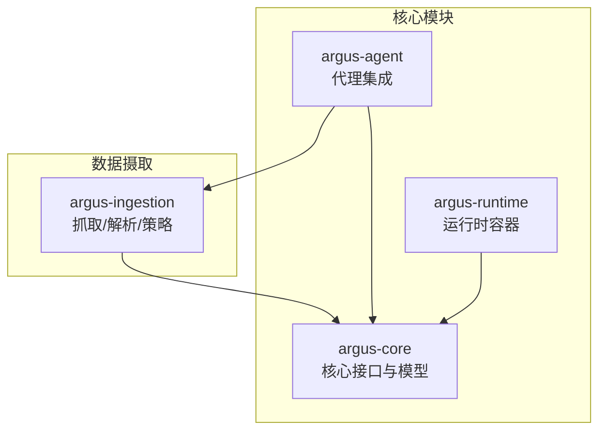
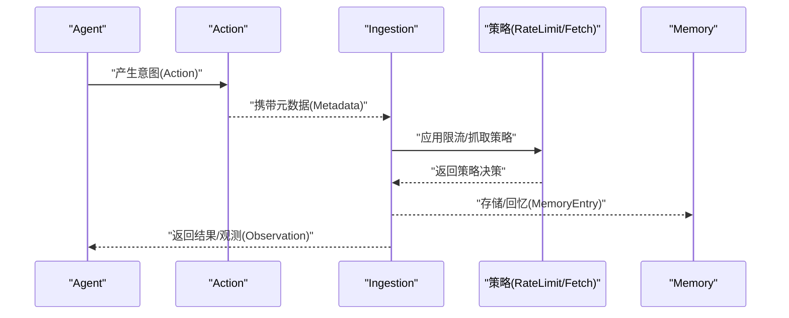
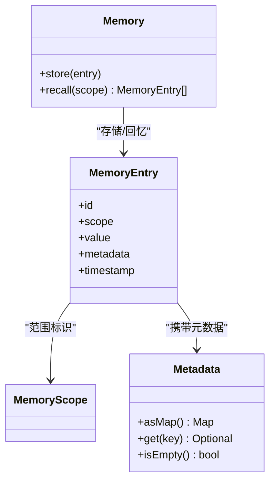
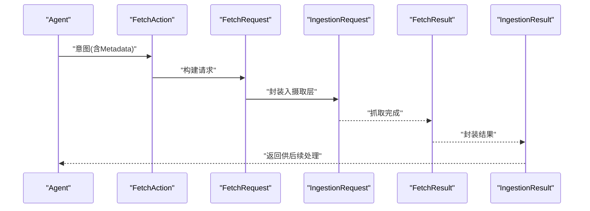
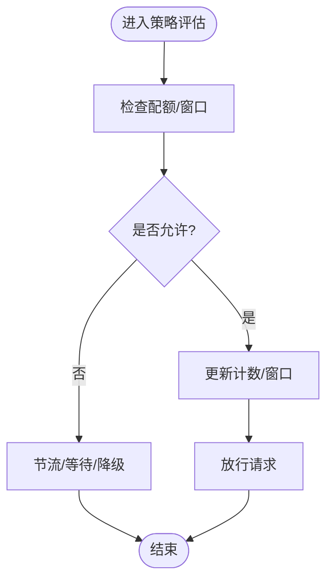
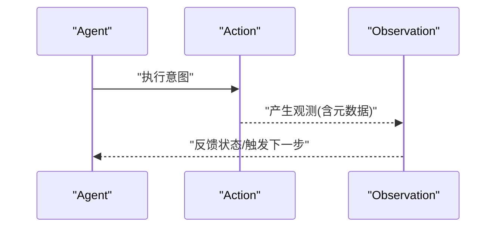
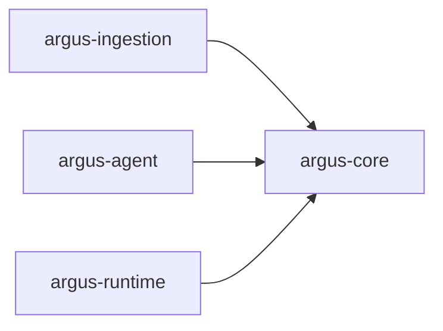

# 性能优化指南

<cite>
**本文引用的文件**
- [readme.md](file://readme.md)
- [pom.xml](file://pom.xml)
- [Memory.java](file://argus-core/src/main/java/io/argus/core/memory/Memory.java)
- [MemoryEntry.java](file://argus-core/src/main/java/io/argus/core/memory/MemoryEntry.java)
- [MemoryScope.java](file://argus-core/src/main/java/io/argus/core/memory/MemoryScope.java)
- [Action.java](file://argus-core/src/main/java/io/argus/core/action/Action.java)
- [Metadata.java](file://argus-core/src/main/java/io/argus/core/model/Metadata.java)
- [Observation.java](file://argus-core/src/main/java/io/argus/core/observation/Observation.java)
- [Agent.java](file://argus-core/src/main/java/io/argus/core/agent/Agent.java)
- [FetchAction.java](file://argus-ingestion/src/main/java/io/argus/ingestion/fetch/FetchAction.java)
- [FetchRequest.java](file://argus-ingestion/src/main/java/io/argus/ingestion/fetch/FetchRequest.java)
- [FetchResult.java](file://argus-ingestion/src/main/java/io/argus/ingestion/fetch/FetchResult.java)
- [IngestionRequest.java](file://argus-ingestion/src/main/java/io/argus/ingestion/source/IngestionRequest.java)
- [IngestionResult.java](file://argus-ingestion/src/main/java/io/argus/ingestion/source/IngestionResult.java)
- [RateLimitPolicy.java](file://argus-ingestion/src/main/java/io/argus/ingestion/policy/RateLimitPolicy.java)
- [FetchPolicy.java](file://argus-ingestion/src/main/java/io/argus/ingestion/policy/FetchPolicy.java)
- [FetchFailedException.java](file://argus-ingestion/src/main/java/io/argus/ingestion/error/FetchFailedException.java)
- [IngestionException.java](file://argus-ingestion/src/main/java/io/argus/ingestion/error/IngestionException.java)
</cite>

## 目录
1. [引言](#引言)
2. [项目结构](#项目结构)
3. [核心组件](#核心组件)
4. [架构总览](#架构总览)
5. [详细组件分析](#详细组件分析)
6. [依赖分析](#依赖分析)
7. [性能考量](#性能考量)
8. [故障排查指南](#故障排查指南)
9. [结论](#结论)
10. [附录](#附录)

## 引言
本指南面向Argus框架开发者，聚焦于性能优化的系统性方法，覆盖内存管理、数据获取与处理、并发与资源池化、缓存与预加载、监控与基准测试、热点定位与生产调优等主题。由于当前仓库处于早期阶段，部分策略以通用工程实践与可扩展接口设计为指导，帮助在后续迭代中实现高性能与高可维护性。

## 项目结构
Argus采用多模块分层组织：核心能力（argus-core）、数据获取（argus-ingestion）、代理集成（argus-agent）、运行时容器（argus-runtime）。模块间通过清晰的接口边界解耦，便于独立优化与替换实现。

图表来源
- [pom.xml](file://pom.xml#L24-L29)

章节来源
- [readme.md](file://readme.md#L7-L14)
- [pom.xml](file://pom.xml#L24-L29)

## 核心组件
- 内存子系统：Memory接口定义存储与回忆能力；MemoryEntry承载键值对与元数据；MemoryScope用于范围划分。
- 行为与观测：Action与Observation分别描述“意图”和“事实”，Metadata提供不可变属性容器。
- 数据摄取：FetchAction、FetchRequest、FetchResult构成抓取意图与结果载体；IngestionRequest/Result封装请求与产出；异常类型用于错误传播。
- 策略体系：RateLimitPolicy与FetchPolicy预留限流与抓取策略扩展点。

章节来源
- [Memory.java](file://argus-core/src/main/java/io/argus/core/memory/Memory.java#L9-L15)
- [MemoryEntry.java](file://argus-core/src/main/java/io/argus/core/memory/MemoryEntry.java#L9-L53)
- [MemoryScope.java](file://argus-core/src/main/java/io/argus/core/memory/MemoryScope.java#L7-L8)
- [Action.java](file://argus-core/src/main/java/io/argus/core/action/Action.java#L37-L43)
- [Metadata.java](file://argus-core/src/main/java/io/argus/core/model/Metadata.java#L12-L34)
- [Observation.java](file://argus-core/src/main/java/io/argus/core/observation/Observation.java#L31-L37)
- [FetchAction.java](file://argus-ingestion/src/main/java/io/argus/ingestion/fetch/FetchAction.java#L11-L21)
- [FetchRequest.java](file://argus-ingestion/src/main/java/io/argus/ingestion/fetch/FetchRequest.java#L7-L8)
- [FetchResult.java](file://argus-ingestion/src/main/java/io/argus/ingestion/fetch/FetchResult.java#L7-L8)
- [IngestionRequest.java](file://argus-ingestion/src/main/java/io/argus/ingestion/source/IngestionRequest.java#L7-L8)
- [IngestionResult.java](file://argus-ingestion/src/main/java/io/argus/ingestion/source/IngestionResult.java#L7-L8)
- [RateLimitPolicy.java](file://argus-ingestion/src/main/java/io/argus/ingestion/policy/RateLimitPolicy.java#L7-L8)
- [FetchPolicy.java](file://argus-ingestion/src/main/java/io/argus/ingestion/policy/FetchPolicy.java#L7-L8)

## 架构总览
下图展示从代理到数据摄取与内存的典型调用链路，体现接口驱动与职责分离的设计思路，便于在各环节实施性能优化。

图表来源
- [Agent.java](file://argus-core/src/main/java/io/argus/core/agent/Agent.java#L7-L11)
- [Action.java](file://argus-core/src/main/java/io/argus/core/action/Action.java#L37-L43)
- [Metadata.java](file://argus-core/src/main/java/io/argus/core/model/Metadata.java#L12-L34)
- [FetchAction.java](file://argus-ingestion/src/main/java/io/argus/ingestion/fetch/FetchAction.java#L11-L21)
- [RateLimitPolicy.java](file://argus-ingestion/src/main/java/io/argus/ingestion/policy/RateLimitPolicy.java#L7-L8)
- [FetchPolicy.java](file://argus-ingestion/src/main/java/io/argus/ingestion/policy/FetchPolicy.java#L7-L8)
- [Memory.java](file://argus-core/src/main/java/io/argus/core/memory/Memory.java#L9-L15)

## 详细组件分析

### 内存子系统（Memory）
- 设计要点
  - 接口最小化：仅暴露存储与回忆两个操作，降低耦合，便于替换实现（如LRU、分区缓存、分布式缓存）。
  - 不可变条目：MemoryEntry使用不可变字段与不可变元数据容器，减少锁竞争与GC压力。
  - 范围隔离：MemoryScope用于按域/租户/会话划分，避免全局扫描带来的线性开销。
- 性能优化建议
  - 存储路径
    - 使用无锁或低锁结构（如ConcurrentHashMap、读写锁）提升并发吞吐。
    - 对热点键设置TTL与容量上限，结合淘汰策略控制内存增长。
  - 回忆路径
    - 优先索引：为常用查询维度建立二级索引，避免全表扫描。
    - 分页/分片：对大规模回忆结果进行分页或分片，降低单次峰值内存占用。
  - 序列化与压缩：对大对象启用高效序列化与可选压缩，平衡CPU与内存。
  - 元数据不可变：Metadata的不可变封装避免重复拷贝与并发修改成本。

图表来源
- [Memory.java](file://argus-core/src/main/java/io/argus/core/memory/Memory.java#L9-L15)
- [MemoryEntry.java](file://argus-core/src/main/java/io/argus/core/memory/MemoryEntry.java#L9-L53)
- [MemoryScope.java](file://argus-core/src/main/java/io/argus/core/memory/MemoryScope.java#L7-L8)
- [Metadata.java](file://argus-core/src/main/java/io/argus/core/model/Metadata.java#L12-L34)

章节来源
- [Memory.java](file://argus-core/src/main/java/io/argus/core/memory/Memory.java#L9-L15)
- [MemoryEntry.java](file://argus-core/src/main/java/io/argus/core/memory/MemoryEntry.java#L9-L53)
- [MemoryScope.java](file://argus-core/src/main/java/io/argus/core/memory/MemoryScope.java#L7-L8)
- [Metadata.java](file://argus-core/src/main/java/io/argus/core/model/Metadata.java#L12-L34)

### 数据摄取与抓取（Fetch）
- 设计要点
  - FetchAction作为抓取意图载体，配合Metadata传递策略与上下文。
  - FetchRequest/Result与IngestionRequest/Result形成清晰的数据流边界。
- 性能优化建议
  - 抓取并发
    - 使用有界线程池与队列，限制并发度并防止资源耗尽。
    - 对不同目标域设置独立队列/令牌桶，避免相互阻塞。
  - 超时与重试
    - 合理设置连接/读取超时与指数退避重试，避免长时间占用线程。
  - 流式处理
    - 对大响应采用流式解析，边读边处理，降低峰值内存。
  - 结果缓存
    - 对相同URL/版本的结果进行缓存，命中则短路网络IO。

图表来源
- [FetchAction.java](file://argus-ingestion/src/main/java/io/argus/ingestion/fetch/FetchAction.java#L11-L21)
- [FetchRequest.java](file://argus-ingestion/src/main/java/io/argus/ingestion/fetch/FetchRequest.java#L7-L8)
- [IngestionRequest.java](file://argus-ingestion/src/main/java/io/argus/ingestion/source/IngestionRequest.java#L7-L8)
- [FetchResult.java](file://argus-ingestion/src/main/java/io/argus/ingestion/fetch/FetchResult.java#L7-L8)
- [IngestionResult.java](file://argus-ingestion/src/main/java/io/argus/ingestion/source/IngestionResult.java#L7-L8)

章节来源
- [FetchAction.java](file://argus-ingestion/src/main/java/io/argus/ingestion/fetch/FetchAction.java#L11-L21)
- [FetchRequest.java](file://argus-ingestion/src/main/java/io/argus/ingestion/fetch/FetchRequest.java#L7-L8)
- [FetchResult.java](file://argus-ingestion/src/main/java/io/argus/ingestion/fetch/FetchResult.java#L7-L8)
- [IngestionRequest.java](file://argus-ingestion/src/main/java/io/argus/ingestion/source/IngestionRequest.java#L7-L8)
- [IngestionResult.java](file://argus-ingestion/src/main/java/io/argus/ingestion/source/IngestionResult.java#L7-L8)

### 策略体系（RateLimitPolicy 与 FetchPolicy）
- 设计要点
  - 策略类作为扩展点，允许注入不同算法（如滑动窗口、令牌桶、漏桶）。
- 性能调优参数建议
  - 速率阈值与时间窗：根据下游服务SLA设定QPS与突发容量，避免过载与排队延迟。
  - 隔离与分区：对不同目标/用户/租户设置独立策略实例，降低串扰。
  - 预热与自适应：启动期预热阈值，运行中基于延迟与错误率动态调整。
  - 批量与合并：在满足一致性前提下合并小请求，减少握手次数。

图表来源
- [RateLimitPolicy.java](file://argus-ingestion/src/main/java/io/argus/ingestion/policy/RateLimitPolicy.java#L7-L8)
- [FetchPolicy.java](file://argus-ingestion/src/main/java/io/argus/ingestion/policy/FetchPolicy.java#L7-L8)

章节来源
- [RateLimitPolicy.java](file://argus-ingestion/src/main/java/io/argus/ingestion/policy/RateLimitPolicy.java#L7-L8)
- [FetchPolicy.java](file://argus-ingestion/src/main/java/io/argus/ingestion/policy/FetchPolicy.java#L7-L8)

### 代理执行效率与瓶颈识别
- 关注点
  - 意图生成与执行解耦：Action接口最小化，避免在Action中嵌入执行细节，利于并行与复用。
  - 观测建模：Observation不可变且带Metadata，便于快速聚合统计与日志落盘。
- 提升方法
  - 并行化：对无共享状态的Action并行调度，结合工作窃取或有界队列。
  - 事件驱动：以Observation为信号触发后续动作，降低轮询与阻塞。
  - 状态机：将Agent状态迁移显式化，减少分支判断与重复计算。

图表来源
- [Agent.java](file://argus-core/src/main/java/io/argus/core/agent/Agent.java#L7-L11)
- [Action.java](file://argus-core/src/main/java/io/argus/core/action/Action.java#L37-L43)
- [Observation.java](file://argus-core/src/main/java/io/argus/core/observation/Observation.java#L31-L37)

章节来源
- [Agent.java](file://argus-core/src/main/java/io/argus/core/agent/Agent.java#L7-L11)
- [Action.java](file://argus-core/src/main/java/io/argus/core/action/Action.java#L37-L43)
- [Observation.java](file://argus-core/src/main/java/io/argus/core/observation/Observation.java#L31-L37)

## 依赖分析
- 模块依赖
  - argus-ingestion 依赖 argus-core 的 Action、Observation、Metadata 等抽象。
  - argus-agent 与 argus-runtime 通过核心接口与策略扩展点集成。
- 耦合与内聚
  - 通过接口与不可变对象提升内聚、降低耦合，便于替换实现与独立优化。

图表来源
- [pom.xml](file://pom.xml#L24-L29)

章节来源
- [pom.xml](file://pom.xml#L24-L29)

## 性能考量
- 内存管理
  - 使用不可变容器与轻量对象，减少GC压力；对大对象采用池化或直接缓冲区。
  - 为热点键/条目设置生命周期与容量上限，避免内存泄漏与抖动。
- 并发与资源池化
  - 有界线程池+队列，结合背压策略；对IO密集型任务采用异步与事件驱动。
  - 连接池：数据库/HTTP客户端连接池需配置最大空闲、最大活跃、超时与健康检查。
- 缓存与预加载
  - 多级缓存：本地弱一致缓存 + 远端强一致缓存；对冷数据采用预热与懒加载。
  - 预加载：基于访问模式与时间窗口预测热点，提前拉取与反序列化。
- 监控与基准
  - 指标：QPS、P95/P99延迟、错误率、队列长度、线程池饱和度、内存分配速率。
  - 基准：针对关键路径（抓取、解析、存储）做场景化压测，固定输入规模与分布。
- 热点定位
  - CPU火焰图：定位热点方法与调用栈。
  - GC日志：识别晋升失败与停顿尖峰。
  - 分布式追踪：串联跨进程调用，定位慢调用与阻塞点。

## 故障排查指南
- 错误类型
  - 抓取失败：FetchFailedException，关注网络异常、超时、协议错误。
  - 摄取异常：IngestionException，关注解析失败、策略拒绝、资源不足。
- 排查步骤
  - 校验策略参数与配额状态，确认是否存在突发流量或配置漂移。
  - 检查队列积压与线程池饱和度，必要时临时降级或扩容。
  - 对异常堆栈与观测日志进行关联分析，还原调用链。

章节来源
- [FetchFailedException.java](file://argus-ingestion/src/main/java/io/argus/ingestion/error/FetchFailedException.java#L7-L8)
- [IngestionException.java](file://argus-ingestion/src/main/java/io/argus/ingestion/error/IngestionException.java#L7-L8)

## 结论
Argus通过清晰的接口与不可变模型为性能优化提供了良好基础。建议在后续迭代中围绕“策略可插拔、并发有界、缓存多级、可观测闭环”四要素推进，持续以指标驱动与基准测试验证优化效果，确保在生产环境中稳定高效地运行。

## 附录
- 实施清单
  - 明确关键路径与SLA，建立基线指标与告警阈值。
  - 为RateLimitPolicy与FetchPolicy提供多种实现，并支持动态切换。
  - 在Memory与抓取层引入缓存与预加载策略，结合容量与TTL控制。
  - 配置线程池、连接池与队列参数，定期压测与回归对比。
  - 建立火焰图与GC分析流程，形成热点定位与根因分析机制。