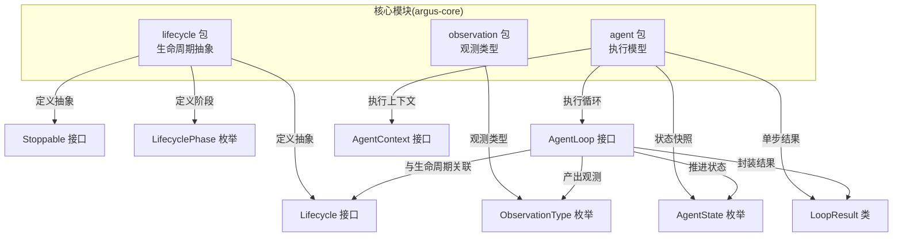
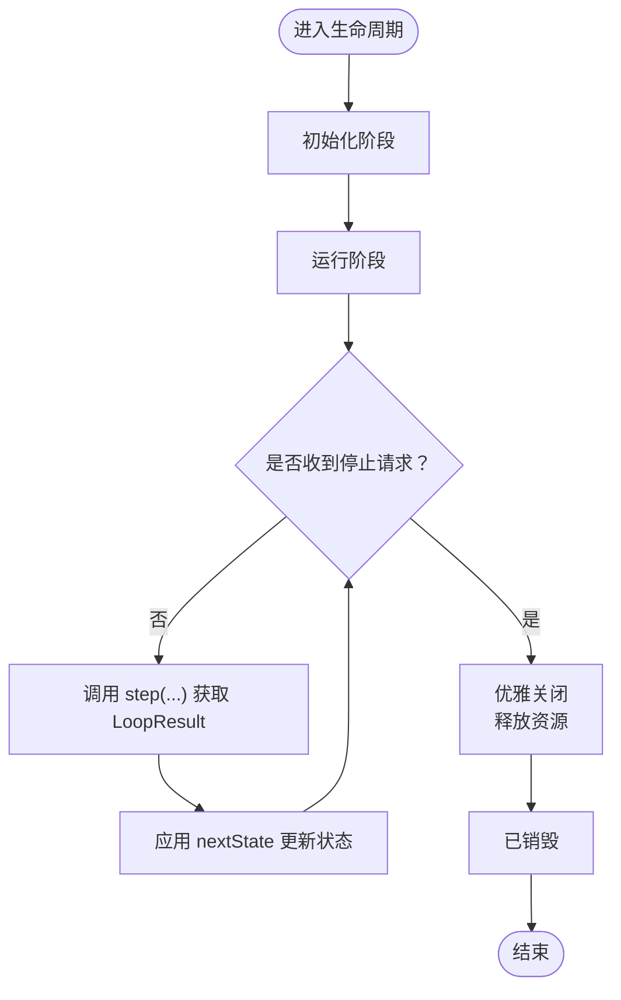
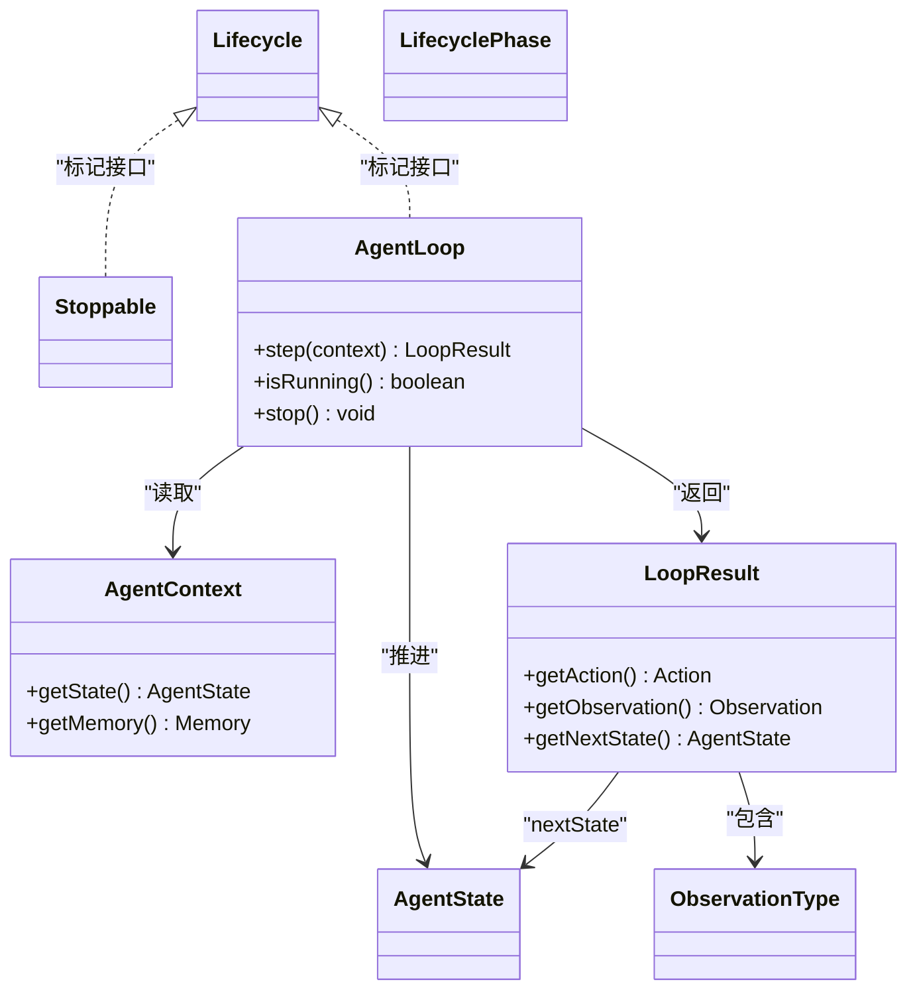

# 生命周期管理

<cite>
**本文引用的文件**
- [Lifecycle.java](file://argus-core/src/main/java/io/argus/core/lifecycle/Lifecycle.java)
- [LifecyclePhase.java](file://argus-core/src/main/java/io/argus/core/lifecycle/LifecyclePhase.java)
- [Stoppable.java](file://argus-core/src/main/java/io/argus/core/lifecycle/Stoppable.java)
- [package-info.java](file://argus-core/src/main/java/io/argus/core/lifecycle/package-info.java)
- [AgentLoop.java](file://argus-core/src/main/java/io/argus/core/agent/AgentLoop.java)
- [AgentContext.java](file://argus-core/src/main/java/io/argus/core/agent/AgentContext.java)
- [AgentState.java](file://argus-core/src/main/java/io/argus/core/agent/AgentState.java)
- [LoopResult.java](file://argus-core/src/main/java/io/argus/core/agent/LoopResult.java)
- [ObservationType.java](file://argus-core/src/main/java/io/argus/core/observation/ObservationType.java)
- [readme.md](file://readme.md)
</cite>

## 目录
1. [引言](#引言)
2. [项目结构](#项目结构)
3. [核心组件](#核心组件)
4. [架构总览](#架构总览)
5. [组件详解](#组件详解)
6. [依赖关系分析](#依赖关系分析)
7. [性能考量](#性能考量)
8. [故障排查指南](#故障排查指南)
9. [结论](#结论)
10. [附录](#附录)

## 引言
本指南面向Argus框架开发者，聚焦“生命周期管理”的设计与实现。当前仓库中，生命周期相关的核心抽象位于核心模块的lifecycle包，同时Agent执行模型与生命周期密切相关。本文将从设计理念、接口职责、阶段语义、优雅关闭、并发与线程管理、事件监听与通知、故障恢复与状态同步等方面，给出可操作的实现建议与最佳实践。

## 项目结构
Argus采用多模块结构，生命周期抽象位于核心模块的lifecycle包；Agent执行模型位于core模块的agent包；观察类型位于observation包。下图展示与生命周期相关的主要文件与职责映射：



图表来源
- [Lifecycle.java](file://argus-core/src/main/java/io/argus/core/lifecycle/Lifecycle.java#L1-L8)
- [Stoppable.java](file://argus-core/src/main/java/io/argus/core/lifecycle/Stoppable.java#L1-L8)
- [LifecyclePhase.java](file://argus-core/src/main/java/io/argus/core/lifecycle/LifecyclePhase.java#L1-L8)
- [AgentLoop.java](file://argus-core/src/main/java/io/argus/core/agent/AgentLoop.java#L1-L118)
- [AgentContext.java](file://argus-core/src/main/java/io/argus/core/agent/AgentContext.java#L1-L98)
- [AgentState.java](file://argus-core/src/main/java/io/argus/core/agent/AgentState.java#L1-L81)
- [LoopResult.java](file://argus-core/src/main/java/io/argus/core/agent/LoopResult.java#L1-L115)
- [ObservationType.java](file://argus-core/src/main/java/io/argus/core/observation/ObservationType.java#L1-L117)

章节来源
- [readme.md](file://readme.md#L1-L28)

## 核心组件
- Lifecycle 接口：生命周期抽象的标记接口，用于标识实现了统一生命周期语义的组件。
- Stoppable 接口：定义“可停止”的能力，通常用于优雅关闭与资源回收。
- LifecyclePhase 枚举：生命周期阶段的抽象，用于表达组件在不同阶段的行为与约束。
- AgentLoop 接口：代理执行循环，提供单步执行、运行状态查询与停止请求的能力，与生命周期紧密耦合。
- AgentContext/AgentState/LoopResult：执行上下文、状态快照与单步结果，支撑确定性执行与回放。
- ObservationType：观测类型，用于描述执行过程中产生的各类事实，可作为生命周期事件的载体之一。

章节来源
- [Lifecycle.java](file://argus-core/src/main/java/io/argus/core/lifecycle/Lifecycle.java#L1-L8)
- [Stoppable.java](file://argus-core/src/main/java/io/argus/core/lifecycle/Stoppable.java#L1-L8)
- [LifecyclePhase.java](file://argus-core/src/main/java/io/argus/core/lifecycle/LifecyclePhase.java#L1-L8)
- [AgentLoop.java](file://argus-core/src/main/java/io/argus/core/agent/AgentLoop.java#L1-L118)
- [AgentContext.java](file://argus-core/src/main/java/io/argus/core/agent/AgentContext.java#L1-L98)
- [AgentState.java](file://argus-core/src/main/java/io/argus/core/agent/AgentState.java#L1-L81)
- [LoopResult.java](file://argus-core/src/main/java/io/argus/core/agent/LoopResult.java#L1-L115)
- [ObservationType.java](file://argus-core/src/main/java/io/argus/core/observation/ObservationType.java#L1-L117)

## 架构总览
生命周期管理在Argus中体现为“阶段驱动 + 优雅停止 + 确定性执行”的组合：
- 阶段驱动：通过LifecyclePhase表达组件的生命周期阶段，阶段之间存在明确的顺序与约束。
- 优雅停止：通过Stoppable接口提供停止信号，结合AgentLoop的stop/isRunning语义，实现非阻塞的优雅关闭。
- 确定性执行：AgentLoop的step方法保证原子性与可观测性，配合LoopResult与AgentState，确保可审计、可回放。

```mermaid
sequenceDiagram
participant Dev as "开发者组件"
participant Loop as "AgentLoop"
participant Ctx as "AgentContext"
participant Obs as "ObservationType"
Dev->>Loop : "调用 step(Ctx)"
Loop->>Ctx : "读取上下文/状态"
Loop-->>Dev : "返回 LoopResult(Action, Observation, AgentState)"
Dev->>Obs : "根据 ObservationType 记录事件"
Dev->>Loop : "检查 isRunning()"
alt "仍在运行"
Loop-->>Dev : "true"
Dev->>Loop : "继续下一轮 step(...)"
else "已停止/终止"
Loop-->>Dev : "false"
Dev->>Loop : "stop() 触发优雅关闭"
end
```

图表来源
- [AgentLoop.java](file://argus-core/src/main/java/io/argus/core/agent/AgentLoop.java#L49-L118)
- [LoopResult.java](file://argus-core/src/main/java/io/argus/core/agent/LoopResult.java#L78-L115)
- [ObservationType.java](file://argus-core/src/main/java/io/argus/core/observation/ObservationType.java#L18-L117)

## 组件详解

### Lifecycle 接口
- 设计理念：作为标记接口，统一标识实现了生命周期语义的组件，便于框架层进行生命周期编排与事件分发。
- 使用建议：当自定义组件需要参与统一的生命周期管理时，实现该接口，并配合Stoppable与LifecyclePhase使用。

章节来源
- [Lifecycle.java](file://argus-core/src/main/java/io/argus/core/lifecycle/Lifecycle.java#L1-L8)

### Stoppable 接口
- 设计理念：提供“可停止”的能力，允许组件在合适的时机进行资源清理与退出。
- 与AgentLoop的关系：AgentLoop的stop方法用于请求终止，Stoppable用于实现优雅关闭的具体逻辑。
- 最佳实践：
  - stop方法应幂等，避免重复停止导致的异常。
  - 清理顺序：先停止接收新任务，再处理队列/缓冲区，最后释放资源。
  - 与isRunning配合，确保停止信号被及时响应。

章节来源
- [Stoppable.java](file://argus-core/src/main/java/io/argus/core/lifecycle/Stoppable.java#L1-L8)
- [AgentLoop.java](file://argus-core/src/main/java/io/argus/core/agent/AgentLoop.java#L104-L116)

### LifecyclePhase 枚举
- 设计理念：抽象生命周期阶段，用于表达组件在不同阶段的行为与约束。典型阶段包括初始化、运行、停止等。
- 阶段顺序：建议遵循“初始化 → 运行 → 停止 → 已销毁”等顺序，阶段间转换需满足前置条件。
- 事件通知：可在阶段切换时触发事件，供监听器处理资源准备/清理、指标上报等。

说明：当前仓库中LifecyclePhase的枚举值尚未实现，建议在后续版本中补充具体阶段常量与语义。

章节来源
- [LifecyclePhase.java](file://argus-core/src/main/java/io/argus/core/lifecycle/LifecyclePhase.java#L1-L8)
- [package-info.java](file://argus-core/src/main/java/io/argus/core/lifecycle/package-info.java#L1-L15)

### AgentLoop 与生命周期
- 单步执行：step方法保证原子性与可观测性，返回LoopResult，包含Action、Observation与nextState。
- 运行状态：isRunning用于判断是否继续执行；stop用于请求终止。
- 与生命周期的结合：
  - 初始化阶段：完成资源加载与上下文准备。
  - 运行阶段：循环调用step，根据ObservationType更新内部状态。
  - 停止阶段：收到stop后，逐步释放资源并退出循环。



图表来源
- [AgentLoop.java](file://argus-core/src/main/java/io/argus/core/agent/AgentLoop.java#L49-L118)
- [LoopResult.java](file://argus-core/src/main/java/io/argus/core/agent/LoopResult.java#L78-L115)
- [AgentState.java](file://argus-core/src/main/java/io/argus/core/agent/AgentState.java#L1-L81)

章节来源
- [AgentLoop.java](file://argus-core/src/main/java/io/argus/core/agent/AgentLoop.java#L1-L118)
- [LoopResult.java](file://argus-core/src/main/java/io/argus/core/agent/LoopResult.java#L1-L115)
- [AgentState.java](file://argus-core/src/main/java/io/argus/core/agent/AgentState.java#L1-L81)

### AgentContext 与 AgentState
- AgentContext：可变的执行上下文，仅在实时执行期间有效，禁止承载权威状态。
- AgentState：不可变的状态快照，代表单步执行后的完整状态，支持确定性回放。
- 与生命周期的关系：在初始化阶段构建初始状态，在运行阶段通过LoopResult推进状态，停止阶段不再变更状态。

章节来源
- [AgentContext.java](file://argus-core/src/main/java/io/argus/core/agent/AgentContext.java#L1-L98)
- [AgentState.java](file://argus-core/src/main/java/io/argus/core/agent/AgentState.java#L1-L81)

### LoopResult 与 ObservationType
- LoopResult：不可变的单步执行结果，承载Action、Observation与nextState，是回放与审计的基础。
- ObservationType：观测类型枚举，用于区分STATE、DATA、RESPONSE、ERROR、EVENT等事实，可用于生命周期事件的分类与处理。

章节来源
- [LoopResult.java](file://argus-core/src/main/java/io/argus/core/agent/LoopResult.java#L1-L115)
- [ObservationType.java](file://argus-core/src/main/java/io/argus/core/observation/ObservationType.java#L1-L117)

## 依赖关系分析
生命周期相关组件之间的依赖关系如下：



图表来源
- [Lifecycle.java](file://argus-core/src/main/java/io/argus/core/lifecycle/Lifecycle.java#L1-L8)
- [Stoppable.java](file://argus-core/src/main/java/io/argus/core/lifecycle/Stoppable.java#L1-L8)
- [LifecyclePhase.java](file://argus-core/src/main/java/io/argus/core/lifecycle/LifecyclePhase.java#L1-L8)
- [AgentLoop.java](file://argus-core/src/main/java/io/argus/core/agent/AgentLoop.java#L49-L118)
- [AgentContext.java](file://argus-core/src/main/java/io/argus/core/agent/AgentContext.java#L92-L98)
- [AgentState.java](file://argus-core/src/main/java/io/argus/core/agent/AgentState.java#L79-L81)
- [LoopResult.java](file://argus-core/src/main/java/io/argus/core/agent/LoopResult.java#L78-L115)
- [ObservationType.java](file://argus-core/src/main/java/io/argus/core/observation/ObservationType.java#L18-L117)

## 性能考量
- 单步原子性：AgentLoop的step应避免长时间阻塞，长任务拆分为多次step，降低单次开销。
- 上下文与状态分离：AgentContext仅承载临时数据，避免在其中存储权威状态，减少回放与调试成本。
- 观测类型选择：合理使用ObservationType，避免在Observation中携带冗余信息，提升序列化与传输效率。
- 资源池化：在初始化阶段预创建连接、线程池等资源，停止阶段统一回收，减少抖动。

## 故障排查指南
- 停止无响应
  - 检查stop是否被调用，isRunning是否正确返回false。
  - 确认资源清理逻辑未阻塞退出路径。
- 状态不一致
  - 确保AgentState不可变，状态推进通过LoopResult的nextState进行。
  - 回放时仅依赖LoopResult序列，不依赖AgentContext。
- 观测缺失
  - 检查ObservationType是否正确分类，确保关键事件被记录为STATE或RESPONSE等类型。

章节来源
- [AgentLoop.java](file://argus-core/src/main/java/io/argus/core/agent/AgentLoop.java#L91-L116)
- [LoopResult.java](file://argus-core/src/main/java/io/argus/core/agent/LoopResult.java#L16-L58)
- [AgentState.java](file://argus-core/src/main/java/io/argus/core/agent/AgentState.java#L11-L37)

## 结论
Argus的生命周期管理以“阶段驱动 + 优雅停止 + 确定性执行”为核心，通过Lifecycle、Stoppable与LifecyclePhase抽象统一生命周期语义，结合AgentLoop、AgentState与LoopResult保障可审计、可回放的执行模型。开发者在实现自定义组件时，应遵循状态与上下文分离、单步原子性、可观测性与幂等停止等原则，确保系统的稳定性与可维护性。

## 附录
- 自定义组件实现建议
  - 实现Lifecycle与Stoppable，定义清晰的LifecyclePhase顺序。
  - 在初始化阶段完成资源加载，在运行阶段按单步推进状态，停止阶段执行幂等清理。
  - 使用ObservationType对关键事件进行分类记录，便于监控与审计。
- 并发与线程管理最佳实践
  - 将AgentLoop的step设计为无共享状态的纯函数式片段，避免全局锁。
  - 使用线程池或事件循环模型，将I/O与CPU密集任务解耦。
  - 在停止阶段设置超时与中断策略，防止资源泄漏。