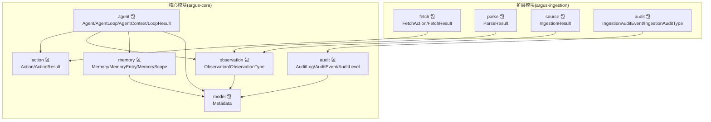
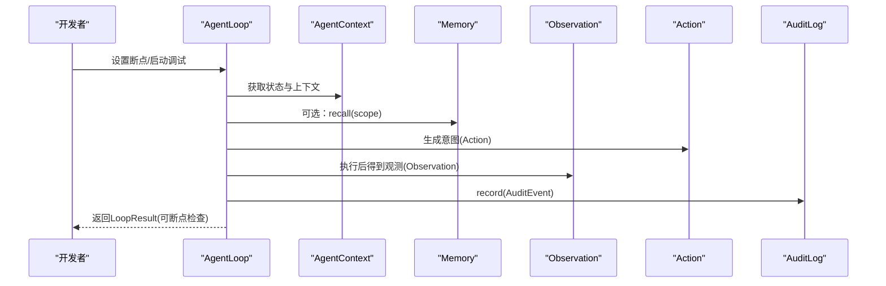
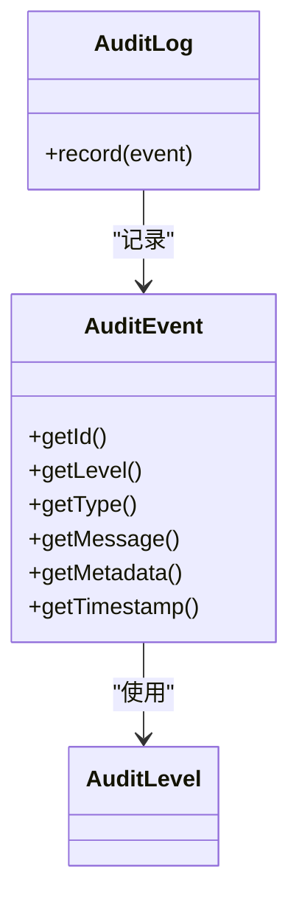
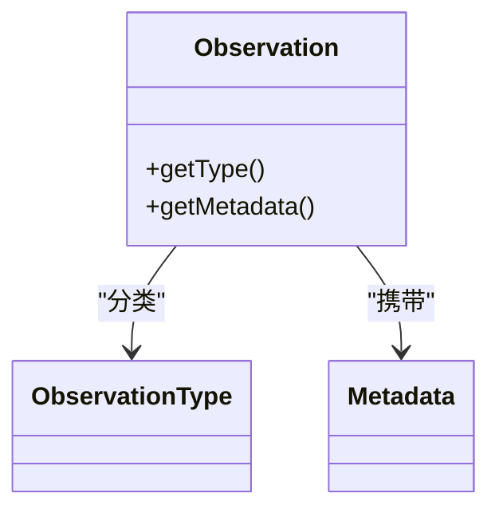
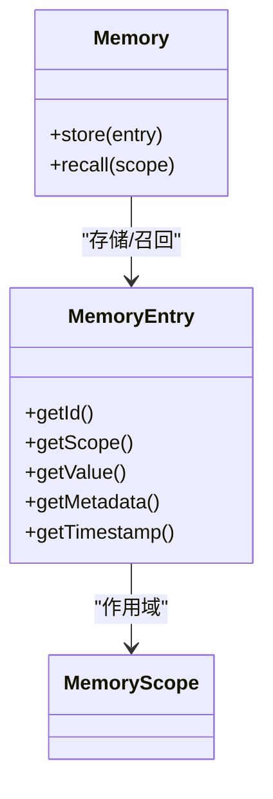
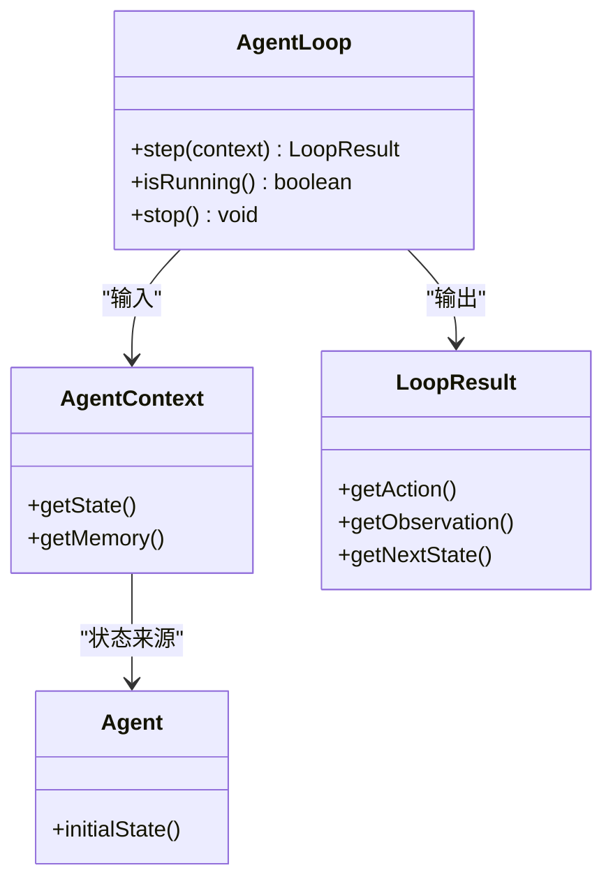
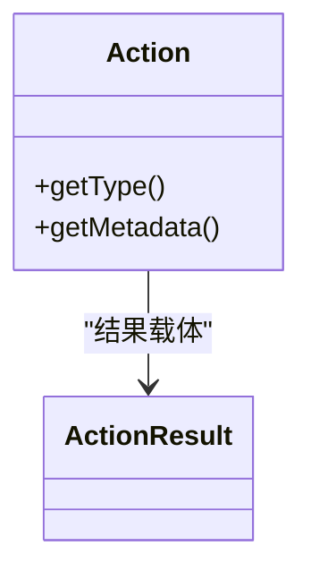
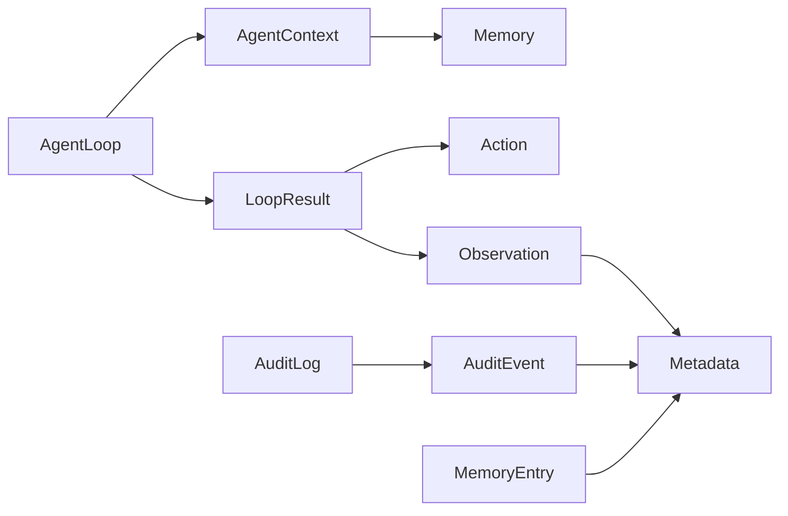

# 调试与开发工具

<cite>
**本文引用的文件**
- [AuditLog.java](file://argus-core/src/main/java/io/argus/core/audit/AuditLog.java)
- [AuditEvent.java](file://argus-core/src/main/java/io/argus/core/audit/AuditEvent.java)
- [AuditLevel.java](file://argus-core/src/main/java/io/argus/core/audit/AuditLevel.java)
- [Observation.java](file://argus-core/src/main/java/io/argus/core/observation/Observation.java)
- [ObservationType.java](file://argus-core/src/main/java/io/argus/core/observation/ObservationType.java)
- [Memory.java](file://argus-core/src/main/java/io/argus/core/memory/Memory.java)
- [MemoryEntry.java](file://argus-core/src/main/java/io/argus/core/memory/MemoryEntry.java)
- [MemoryScope.java](file://argus-core/src/main/java/io/argus/core/memory/MemoryScope.java)
- [Agent.java](file://argus-core/src/main/java/io/argus/core/agent/Agent.java)
- [AgentLoop.java](file://argus-core/src/main/java/io/argus/core/agent/AgentLoop.java)
- [AgentContext.java](file://argus-core/src/main/java/io/argus/core/agent/AgentContext.java)
- [LoopResult.java](file://argus-core/src/main/java/io/argus/core/agent/LoopResult.java)
- [Action.java](file://argus-core/src/main/java/io/argus/core/action/Action.java)
- [ActionResult.java](file://argus-core/src/main/java/io/argus/core/action/ActionResult.java)
- [Metadata.java](file://argus-core/src/main/java/io/argus/core/model/Metadata.java)
- [FetchAction.java](file://argus-ingestion/src/main/java/io/argus/ingestion/fetch/FetchAction.java)
- [IngestionAuditEvent.java](file://argus-ingestion/src/main/java/io/argus/ingestion/audit/IngestionAuditEvent.java)
- [IngestionAuditType.java](file://argus-ingestion/src/main/java/io/argus/ingestion/audit/IngestionAuditType.java)
- [FetchResult.java](file://argus-ingestion/src/main/java/io/argus/ingestion/fetch/FetchResult.java)
- [ParseResult.java](file://argus-ingestion/src/main/java/io/argus/ingestion/parse/ParseResult.java)
- [IngestionResult.java](file://argus-ingestion/src/main/java/io/argus/ingestion/source/IngestionResult.java)
- [pom.xml](file://pom.xml)
</cite>

## 目录
1. [简介](#简介)
2. [项目结构](#项目结构)
3. [核心组件](#核心组件)
4. [架构总览](#架构总览)
5. [详细组件分析](#详细组件分析)
6. [依赖关系分析](#依赖关系分析)
7. [性能考量](#性能考量)
8. [故障排查指南](#故障排查指南)
9. [结论](#结论)
10. [附录](#附录)

## 简介
本指南面向Argus框架开发者，聚焦调试技巧与开发工具使用。内容涵盖：
- 审计日志系统与观察机制的设计与实践
- 使用AuditLog进行问题诊断与性能分析
- Observation数据的采集与分析方法
- Memory系统的调试功能与状态监控
- 断点调试、日志分析与性能剖析的实用技巧
- IDE调试器跟踪代理执行流程的方法
- 常见问题的调试策略与工具链配置
- 自动化测试与集成测试的调试方法

## 项目结构
Argus采用多模块结构，核心能力集中在argus-core，扩展能力在argus-ingestion等模块。调试相关的接口与模型主要位于核心模块，便于统一接入与复用。

图表来源
- [AgentLoop.java](file://argus-core/src/main/java/io/argus/core/agent/AgentLoop.java#L49-L118)
- [AgentContext.java](file://argus-core/src/main/java/io/argus/core/agent/AgentContext.java#L92-L98)
- [Action.java](file://argus-core/src/main/java/io/argus/core/action/Action.java#L37-L43)
- [Observation.java](file://argus-core/src/main/java/io/argus/core/observation/Observation.java#L31-L37)
- [Memory.java](file://argus-core/src/main/java/io/argus/core/memory/Memory.java#L9-L15)
- [AuditLog.java](file://argus-core/src/main/java/io/argus/core/audit/AuditLog.java#L7-L11)
- [Metadata.java](file://argus-core/src/main/java/io/argus/core/model/Metadata.java#L12-L34)
- [FetchAction.java](file://argus-ingestion/src/main/java/io/argus/ingestion/fetch/FetchAction.java)
- [IngestionAuditEvent.java](file://argus-ingestion/src/main/java/io/argus/ingestion/audit/IngestionAuditEvent.java)
- [IngestionAuditType.java](file://argus-ingestion/src/main/java/io/argus/ingestion/audit/IngestionAuditType.java)

章节来源
- [pom.xml](file://pom.xml)

## 核心组件
本节从调试视角梳理关键组件职责与交互，帮助快速定位问题与优化路径。

- 审计日志(AuditLog/AuditEvent/AuditLevel)
  - AuditLog定义记录入口；AuditEvent承载审计事实；AuditLevel提供级别抽象。
  - 调试价值：统一的问题追踪、可回放的审计轨迹、按级别筛选分析。
- 观察(Observation/ObservationType)
  - Observation描述“发生了什么”；ObservationType提供高阶语义分类。
  - 调试价值：隔离决策与事实，便于验证执行分支与外部反馈。
- 记忆(Memory/MemoryEntry/MemoryScope)
  - Memory提供存储与召回；MemoryEntry封装条目；MemoryScope预留作用域。
  - 调试价值：非权威上下文缓存、回放时的状态重建辅助。
- 代理与执行(Agent/AgentLoop/AgentContext/LoopResult)
  - Agent定义初始状态；AgentLoop定义单步决策循环；AgentContext提供可变执行上下文；LoopResult记录单步事实。
  - 调试价值：单步断点、确定性回放、可观测性与可审计性。
- 动作(Action/ActionResult)
  - Action表达意图；ActionResult承载执行结果载体。
  - 调试价值：意图与结果分离，便于验证动作意图与外部系统响应一致性。
- 元数据(Metadata)
  - 提供键值属性容器，支持空安全访问与只读视图。
  - 调试价值：附加信息注入、避免类型扩展导致的耦合。

章节来源
- [AuditLog.java](file://argus-core/src/main/java/io/argus/core/audit/AuditLog.java#L7-L11)
- [AuditEvent.java](file://argus-core/src/main/java/io/argus/core/audit/AuditEvent.java#L9-L60)
- [AuditLevel.java](file://argus-core/src/main/java/io/argus/core/audit/AuditLevel.java#L7-L8)
- [Observation.java](file://argus-core/src/main/java/io/argus/core/observation/Observation.java#L31-L37)
- [ObservationType.java](file://argus-core/src/main/java/io/argus/core/observation/ObservationType.java#L18-L117)
- [Memory.java](file://argus-core/src/main/java/io/argus/core/memory/Memory.java#L9-L15)
- [MemoryEntry.java](file://argus-core/src/main/java/io/argus/core/memory/MemoryEntry.java#L9-L53)
- [MemoryScope.java](file://argus-core/src/main/java/io/argus/core/memory/MemoryScope.java#L7-L8)
- [Agent.java](file://argus-core/src/main/java/io/argus/core/agent/Agent.java#L7-L11)
- [AgentLoop.java](file://argus-core/src/main/java/io/argus/core/agent/AgentLoop.java#L49-L118)
- [AgentContext.java](file://argus-core/src/main/java/io/argus/core/agent/AgentContext.java#L92-L98)
- [LoopResult.java](file://argus-core/src/main/java/io/argus/core/agent/LoopResult.java#L78-L115)
- [Action.java](file://argus-core/src/main/java/io/argus/core/action/Action.java#L37-L43)
- [ActionResult.java](file://argus-core/src/main/java/io/argus/core/action/ActionResult.java#L7-L8)
- [Metadata.java](file://argus-core/src/main/java/io/argus/core/model/Metadata.java#L12-L34)

## 架构总览
下图展示调试相关的关键交互：代理执行循环产生Observation与Action，AuditLog记录审计事件，Memory提供非权威缓存，Metadata承载上下文元信息。

图表来源
- [AgentLoop.java](file://argus-core/src/main/java/io/argus/core/agent/AgentLoop.java#L89-L102)
- [AgentContext.java](file://argus-core/src/main/java/io/argus/core/agent/AgentContext.java#L92-L98)
- [Memory.java](file://argus-core/src/main/java/io/argus/core/memory/Memory.java#L13-L14)
- [Action.java](file://argus-core/src/main/java/io/argus/core/action/Action.java#L37-L43)
- [Observation.java](file://argus-core/src/main/java/io/argus/core/observation/Observation.java#L31-L37)
- [AuditLog.java](file://argus-core/src/main/java/io/argus/core/audit/AuditLog.java#L9-L10)

## 详细组件分析

### 审计日志系统(AuditLog/AuditEvent/AuditLevel)
- 设计要点
  - AuditLog为记录接口，便于替换实现（内存、文件、远程）。
  - AuditEvent为不可变事实载体，包含标识、级别、类型、消息、元数据与时间戳。
  - AuditLevel为级别枚举占位，便于后续扩展。
- 调试应用
  - 统一记录关键节点：开始/结束、异常、性能阈值、状态切换。
  - 使用Metadata附加请求ID、阶段、耗时等维度，便于聚合分析。
  - 按级别过滤：INFO/WARN/ERROR/DEBUG，结合日志系统进行分级处理。
- 性能建议
  - 异步记录或批量缓冲，避免阻塞执行循环。
  - 控制消息大小与元数据数量，必要时仅记录摘要。

图表来源
- [AuditLog.java](file://argus-core/src/main/java/io/argus/core/audit/AuditLog.java#L7-L11)
- [AuditEvent.java](file://argus-core/src/main/java/io/argus/core/audit/AuditEvent.java#L9-L60)
- [AuditLevel.java](file://argus-core/src/main/java/io/argus/core/audit/AuditLevel.java#L7-L8)

章节来源
- [AuditLog.java](file://argus-core/src/main/java/io/argus/core/audit/AuditLog.java#L7-L11)
- [AuditEvent.java](file://argus-core/src/main/java/io/argus/core/audit/AuditEvent.java#L9-L60)
- [AuditLevel.java](file://argus-core/src/main/java/io/argus/core/audit/AuditLevel.java#L7-L8)

### 观察机制(Observation/ObservationType)
- 设计要点
  - Observation为不可变事实，区分于Action的意图；通过ObservationType分类。
  - ObservationType覆盖内部状态、原始数据、对外响应、错误与外部事件。
- 调试应用
  - 将每一步的观测结果作为断点检查点，核对类型与元数据。
  - 利用不同类型快速定位问题：ERROR类直接定位失败；RESPONSE类核对上游返回；EVENT类验证外部触发。
  - 结合Metadata记录上下文，如来源、目标、耗时等。
- 分析方法
  - 按类型统计分布，识别异常模式。
  - 关联Action与Observation，验证因果关系。

图表来源
- [Observation.java](file://argus-core/src/main/java/io/argus/core/observation/Observation.java#L31-L37)
- [ObservationType.java](file://argus-core/src/main/java/io/argus/core/observation/ObservationType.java#L18-L117)
- [Metadata.java](file://argus-core/src/main/java/io/argus/core/model/Metadata.java#L12-L34)

章节来源
- [Observation.java](file://argus-core/src/main/java/io/argus/core/observation/Observation.java#L31-L37)
- [ObservationType.java](file://argus-core/src/main/java/io/argus/core/observation/ObservationType.java#L18-L117)
- [Metadata.java](file://argus-core/src/main/java/io/argus/core/model/Metadata.java#L12-L34)

### 记忆系统(Memory/MemoryEntry/MemoryScope)
- 设计要点
  - Memory提供store/recall接口；MemoryEntry封装条目；MemoryScope为作用域占位。
  - 用于非权威缓存与上下文增强，不参与可回放状态。
- 调试应用
  - 在AgentContext中调用recall(scope)检查缓存命中与数据有效性。
  - 使用Metadata记录来源、版本、过期策略等，便于定位缓存问题。
- 监控建议
  - 统计store/recall次数、命中率、平均大小，识别异常波动。
  - 限制单次recall返回量，避免内存压力。

图表来源
- [Memory.java](file://argus-core/src/main/java/io/argus/core/memory/Memory.java#L9-L15)
- [MemoryEntry.java](file://argus-core/src/main/java/io/argus/core/memory/MemoryEntry.java#L9-L53)
- [MemoryScope.java](file://argus-core/src/main/java/io/argus/core/memory/MemoryScope.java#L7-L8)

章节来源
- [Memory.java](file://argus-core/src/main/java/io/argus/core/memory/Memory.java#L9-L15)
- [MemoryEntry.java](file://argus-core/src/main/java/io/argus/core/memory/MemoryEntry.java#L9-L53)
- [MemoryScope.java](file://argus-core/src/main/java/io/argus/core/memory/MemoryScope.java#L7-L8)

### 代理执行循环(Agent/AgentLoop/AgentContext/LoopResult)
- 设计要点
  - AgentLoop.step(context)为单步原子决策单元；isRunning()/stop()控制生命周期。
  - AgentContext提供可变执行环境；LoopResult记录不可变事实。
- 调试应用
  - 在step前后设置断点，检查context、action、observation与nextState。
  - 使用isRunning()判断循环退出条件，避免死循环。
  - 通过LoopResult进行回放验证，确保确定性。
- 性能剖析
  - 统计每步耗时，定位长尾；关注外部调用（网络、I/O）。

图表来源
- [Agent.java](file://argus-core/src/main/java/io/argus/core/agent/Agent.java#L7-L11)
- [AgentLoop.java](file://argus-core/src/main/java/io/argus/core/agent/AgentLoop.java#L49-L118)
- [AgentContext.java](file://argus-core/src/main/java/io/argus/core/agent/AgentContext.java#L92-L98)
- [LoopResult.java](file://argus-core/src/main/java/io/argus/core/agent/LoopResult.java#L78-L115)

章节来源
- [Agent.java](file://argus-core/src/main/java/io/argus/core/agent/Agent.java#L7-L11)
- [AgentLoop.java](file://argus-core/src/main/java/io/argus/core/agent/AgentLoop.java#L49-L118)
- [AgentContext.java](file://argus-core/src/main/java/io/argus/core/agent/AgentContext.java#L92-L98)
- [LoopResult.java](file://argus-core/src/main/java/io/argus/core/agent/LoopResult.java#L78-L115)

### 动作与结果(Action/ActionResult)
- 设计要点
  - Action表达意图，不包含执行逻辑；ActionResult为结果载体。
- 调试应用
  - 核对Action类型与元数据，确保意图正确传达。
  - 对比预期与实际ActionResult，定位执行偏差。

图表来源
- [Action.java](file://argus-core/src/main/java/io/argus/core/action/Action.java#L37-L43)
- [ActionResult.java](file://argus-core/src/main/java/io/argus/core/action/ActionResult.java#L7-L8)

章节来源
- [Action.java](file://argus-core/src/main/java/io/argus/core/action/Action.java#L37-L43)
- [ActionResult.java](file://argus-core/src/main/java/io/argus/core/action/ActionResult.java#L7-L8)

### 元数据(Metadata)
- 设计要点
  - 不可变Map包装，提供空安全访问与只读视图。
- 调试应用
  - 在AuditEvent、Observation、MemoryEntry中统一注入与查询。
  - 通过asMap()导出用于日志系统或外部分析。

章节来源
- [Metadata.java](file://argus-core/src/main/java/io/argus/core/model/Metadata.java#L12-L34)

### 扩展模块调试要点（以抓取为例）
- FetchAction/FetchResult/ParseResult/IngestionResult
  - 在抓取与解析阶段，结合ObservationType.DATA/RESPONSE/ERROR进行分层诊断。
  - 使用IngestionAuditEvent/IngestionAuditType记录抓取链路的审计事件，便于端到端追踪。
- 调试建议
  - 在FetchAction处设置断点，核对请求参数与元数据。
  - 在FetchResult/ParseResult中检查异常与边界情况。
  - 通过IngestionResult汇总结果，配合AuditLog进行整体回放。

章节来源
- [FetchAction.java](file://argus-ingestion/src/main/java/io/argus/ingestion/fetch/FetchAction.java)
- [FetchResult.java](file://argus-ingestion/src/main/java/io/argus/ingestion/fetch/FetchResult.java)
- [ParseResult.java](file://argus-ingestion/src/main/java/io/argus/ingestion/parse/ParseResult.java)
- [IngestionResult.java](file://argus-ingestion/src/main/java/io/argus/ingestion/source/IngestionResult.java)
- [IngestionAuditEvent.java](file://argus-ingestion/src/main/java/io/argus/ingestion/audit/IngestionAuditEvent.java)
- [IngestionAuditType.java](file://argus-ingestion/src/main/java/io/argus/ingestion/audit/IngestionAuditType.java)

## 依赖关系分析
调试相关组件之间的依赖关系如下：

图表来源
- [AgentLoop.java](file://argus-core/src/main/java/io/argus/core/agent/AgentLoop.java#L89-L102)
- [AgentContext.java](file://argus-core/src/main/java/io/argus/core/agent/AgentContext.java#L92-L98)
- [LoopResult.java](file://argus-core/src/main/java/io/argus/core/agent/LoopResult.java#L78-L115)
- [Action.java](file://argus-core/src/main/java/io/argus/core/action/Action.java#L37-L43)
- [Observation.java](file://argus-core/src/main/java/io/argus/core/observation/Observation.java#L31-L37)
- [AuditLog.java](file://argus-core/src/main/java/io/argus/core/audit/AuditLog.java#L7-L11)
- [AuditEvent.java](file://argus-core/src/main/java/io/argus/core/audit/AuditEvent.java#L9-L60)
- [Metadata.java](file://argus-core/src/main/java/io/argus/core/model/Metadata.java#L12-L34)
- [MemoryEntry.java](file://argus-core/src/main/java/io/argus/core/memory/MemoryEntry.java#L9-L53)

章节来源
- [AgentLoop.java](file://argus-core/src/main/java/io/argus/core/agent/AgentLoop.java#L49-L118)
- [AgentContext.java](file://argus-core/src/main/java/io/argus/core/agent/AgentContext.java#L92-L98)
- [LoopResult.java](file://argus-core/src/main/java/io/argus/core/agent/LoopResult.java#L78-L115)
- [Action.java](file://argus-core/src/main/java/io/argus/core/action/Action.java#L37-L43)
- [Observation.java](file://argus-core/src/main/java/io/argus/core/observation/Observation.java#L31-L37)
- [AuditLog.java](file://argus-core/src/main/java/io/argus/core/audit/AuditLog.java#L7-L11)
- [AuditEvent.java](file://argus-core/src/main/java/io/argus/core/audit/AuditEvent.java#L9-L60)
- [Metadata.java](file://argus-core/src/main/java/io/argus/core/model/Metadata.java#L12-L34)
- [MemoryEntry.java](file://argus-core/src/main/java/io/argus/core/memory/MemoryEntry.java#L9-L53)

## 性能考量
- 单步执行模型
  - AgentLoop.step为原子单元，避免长阻塞；长任务拆分为多次step，便于采样与回放。
- 日志与审计
  - AuditLog采用不可变事件，减少锁竞争；建议异步写入与批量化。
- 观察与记忆
  - Observation为不可变事实，利于并发读取；MemoryEntry按需加载，避免大对象常驻。
- 元数据
  - Metadata只读视图降低拷贝成本；建议精简键值，避免冗余。

## 故障排查指南
- 问题定位三步法
  1) 断点定位：在AgentLoop.step前后设置断点，检查context、action、observation与nextState。
  2) 审计回放：通过AuditLog检索对应事件，核对时间线与元数据。
  3) 观察验证：对比Observation类型与元数据，确认因果关系与外部系统响应。
- 常见问题与策略
  - 循环未停止：检查isRunning()与stop()调用时机，避免死循环。
  - 观察缺失：确认Action是否产生有效Observation，核对类型分类。
  - 审计丢失：检查AuditLog实现与级别过滤，确保关键节点被记录。
  - 缓存异常：核对MemoryEntry的scope与value，检查recall返回集大小。
- 工具链配置建议
  - 日志系统：按模块与级别输出，结合Trace ID关联AuditLog。
  - 性能剖析：启用JFR/Async Profiler，聚焦AgentLoop.step耗时热点。
  - 回放测试：基于LoopResult序列进行确定性重放，验证一致性。

## 结论
Argus框架通过清晰的接口与不可变事实模型，为调试与性能分析提供了坚实基础。围绕AuditLog、Observation与Memory的协同，开发者可以建立从问题定位到性能优化的完整闭环。建议在开发与测试环境中默认开启审计与观察，并结合Metadata与回放能力，持续提升系统的可观测性与可维护性。

## 附录
- 开发与调试最佳实践
  - 在Action与Observation中统一注入Metadata，便于跨模块关联。
  - 将长任务拆分为多次AgentLoop.step，便于采样与限流。
  - 使用异步AuditLog实现，避免阻塞主执行路径。
  - 在AgentContext中仅存放临时状态，避免影响回放。
- 自动化与集成测试调试
  - 基于LoopResult构建测试夹具，模拟历史执行序列。
  - 使用Mock AuditLog与Memory实现，隔离外部依赖。
  - 在CI中加入性能回归检测，记录关键指标（吞吐、P95）。