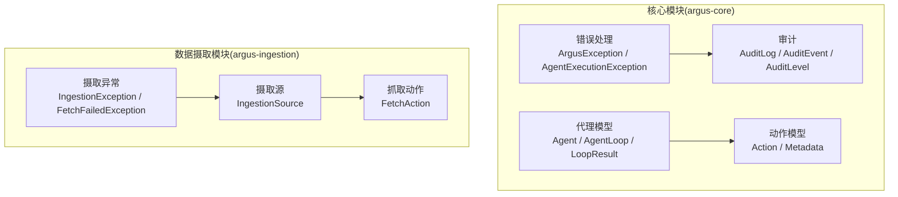
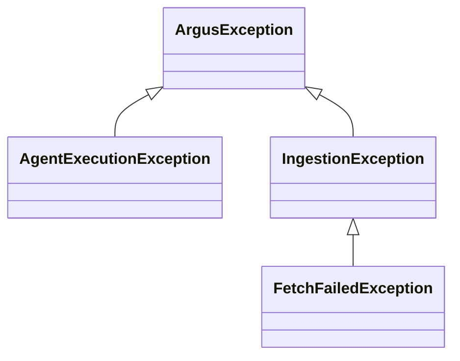
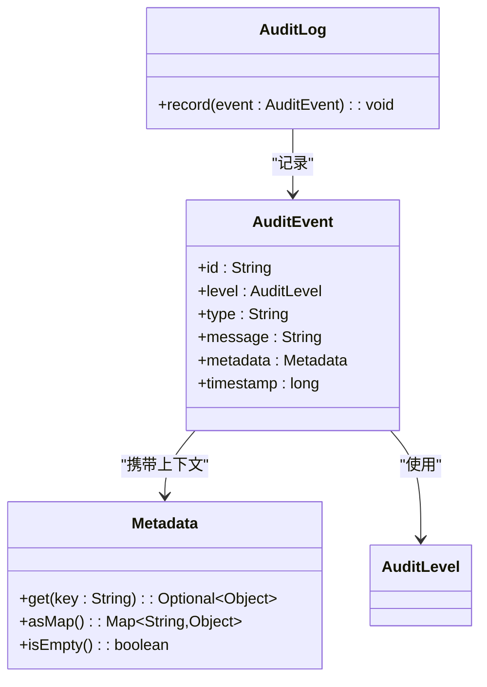
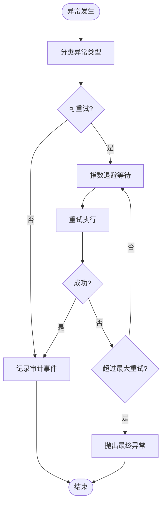
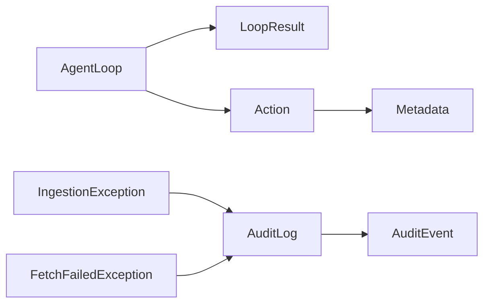

# 错误处理机制

<cite>
**本文引用的文件**
- [ArgusException.java](file://argus-core/src/main/java/io/argus/core/error/ArgusException.java)
- [AgentExecutionException.java](file://argus-core/src/main/java/io/argus/core/error/AgentExecutionException.java)
- [IngestionException.java](file://argus-ingestion/src/main/java/io/argus/ingestion/error/IngestionException.java)
- [FetchFailedException.java](file://argus-ingestion/src/main/java/io/argus/ingestion/error/FetchFailedException.java)
- [AuditLog.java](file://argus-core/src/main/java/io/argus/core/audit/AuditLog.java)
- [AuditEvent.java](file://argus-core/src/main/java/io/argus/core/audit/AuditEvent.java)
- [AuditLevel.java](file://argus-core/src/main/java/io/argus/core/audit/AuditLevel.java)
- [Action.java](file://argus-core/src/main/java/io/argus/core/action/Action.java)
- [Agent.java](file://argus-core/src/main/java/io/argus/core/agent/Agent.java)
- [AgentLoop.java](file://argus-core/src/main/java/io/argus/core/agent/AgentLoop.java)
- [LoopResult.java](file://argus-core/src/main/java/io/argus/core/agent/LoopResult.java)
- [Metadata.java](file://argus-core/src/main/java/io/argus/core/model/Metadata.java)
- [FetchAction.java](file://argus-ingestion/src/main/java/io/argus/ingestion/fetch/FetchAction.java)
- [IngestionSource.java](file://argus-ingestion/src/main/java/io/argus/ingestion/source/IngestionSource.java)
</cite>

## 目录
1. [引言](#引言)
2. [项目结构](#项目结构)
3. [核心组件](#核心组件)
4. [架构总览](#架构总览)
5. [详细组件分析](#详细组件分析)
6. [依赖分析](#依赖分析)
7. [性能考虑](#性能考虑)
8. [故障排查指南](#故障排查指南)
9. [结论](#结论)
10. [附录](#附录)

## 引言
本文件面向Argus框架开发者，系统化阐述框架的错误处理机制与可观测性设计。内容涵盖异常体系、异常分类与传播、错误日志与审计、自定义Action中的异常处理、异常恢复与重试最佳实践、常见错误场景诊断与解决，以及异常与监控告警的关系与配置建议。由于当前代码库中异常类尚为占位实现，本文以接口与模型为依据，给出可落地的设计与实施建议。

## 项目结构
Argus框架按功能域分层组织，错误处理与可观测性主要分布在核心模块与数据摄取模块：
- 核心模块（argus-core）：定义通用异常基类、审计接口与事件模型、Agent执行循环与结果载体等。
- 数据摄取模块（argus-ingestion）：定义与摄取流程相关的异常类型，如抓取失败与摄取异常。



**图表来源**
- [ArgusException.java](file://argus-core/src/main/java/io/argus/core/error/ArgusException.java#L1-L8)
- [AgentExecutionException.java](file://argus-core/src/main/java/io/argus/core/error/AgentExecutionException.java#L1-L8)
- [AuditLog.java](file://argus-core/src/main/java/io/argus/core/audit/AuditLog.java#L1-L11)
- [AuditEvent.java](file://argus-core/src/main/java/io/argus/core/audit/AuditEvent.java#L1-L60)
- [AuditLevel.java](file://argus-core/src/main/java/io/argus/core/audit/AuditLevel.java#L1-L8)
- [AgentLoop.java](file://argus-core/src/main/java/io/argus/core/agent/AgentLoop.java#L1-L118)
- [LoopResult.java](file://argus-core/src/main/java/io/argus/core/agent/LoopResult.java#L1-L115)
- [Action.java](file://argus-core/src/main/java/io/argus/core/action/Action.java#L1-L43)
- [Metadata.java](file://argus-core/src/main/java/io/argus/core/model/Metadata.java#L1-L34)
- [IngestionException.java](file://argus-ingestion/src/main/java/io/argus/ingestion/error/IngestionException.java#L1-L8)
- [FetchFailedException.java](file://argus-ingestion/src/main/java/io/argus/ingestion/error/FetchFailedException.java#L1-L8)
- [IngestionSource.java](file://argus-ingestion/src/main/java/io/argus/ingestion/source/IngestionSource.java#L1-L110)
- [FetchAction.java](file://argus-ingestion/src/main/java/io/argus/ingestion/fetch/FetchAction.java#L1-L21)

**章节来源**
- [AgentLoop.java](file://argus-core/src/main/java/io/argus/core/agent/AgentLoop.java#L1-L118)
- [LoopResult.java](file://argus-core/src/main/java/io/argus/core/agent/LoopResult.java#L1-L115)
- [Action.java](file://argus-core/src/main/java/io/argus/core/action/Action.java#L1-L43)
- [Metadata.java](file://argus-core/src/main/java/io/argus/core/model/Metadata.java#L1-L34)
- [IngestionSource.java](file://argus-ingestion/src/main/java/io/argus/ingestion/source/IngestionSource.java#L1-L110)

## 核心组件
- 异常体系
  - ArgusException：框架级异常基类占位，建议扩展为受检或非受检异常，承载统一的错误标识与上下文。
  - AgentExecutionException：代理执行期异常占位，建议用于封装AgentLoop执行阶段的错误。
  - IngestionException：摄取阶段异常占位，建议用于封装IngestionSource与抓取流程的错误。
  - FetchFailedException：抓取失败异常占位，建议用于网络或协议层面的抓取失败场景。
- 审计与可观测性
  - AuditLog：审计日志接口，定义record(AuditEvent)能力。
  - AuditEvent：审计事件模型，包含id、level、type、message、metadata、timestamp等字段。
  - AuditLevel：审计级别枚举占位，建议定义ERROR/INFO/WARN等等级。
- 代理与动作
  - Agent/AgentLoop/LoopResult：定义代理执行的原子步骤、意图与观测结果，便于在异常发生时进行回放与审计。
  - Action/Metadata：动作与元数据模型，异常信息可通过Metadata传递。

**章节来源**
- [ArgusException.java](file://argus-core/src/main/java/io/argus/core/error/ArgusException.java#L1-L8)
- [AgentExecutionException.java](file://argus-core/src/main/java/io/argus/core/error/AgentExecutionException.java#L1-L8)
- [IngestionException.java](file://argus-ingestion/src/main/java/io/argus/ingestion/error/IngestionException.java#L1-L8)
- [FetchFailedException.java](file://argus-ingestion/src/main/java/io/argus/ingestion/error/FetchFailedException.java#L1-L8)
- [AuditLog.java](file://argus-core/src/main/java/io/argus/core/audit/AuditLog.java#L1-L11)
- [AuditEvent.java](file://argus-core/src/main/java/io/argus/core/audit/AuditEvent.java#L1-L60)
- [AuditLevel.java](file://argus-core/src/main/java/io/argus/core/audit/AuditLevel.java#L1-L8)
- [AgentLoop.java](file://argus-core/src/main/java/io/argus/core/agent/AgentLoop.java#L1-L118)
- [LoopResult.java](file://argus-core/src/main/java/io/argus/core/agent/LoopResult.java#L1-L115)
- [Action.java](file://argus-core/src/main/java/io/argus/core/action/Action.java#L1-L43)
- [Metadata.java](file://argus-core/src/main/java/io/argus/core/model/Metadata.java#L1-L34)

## 架构总览
下图展示异常与审计在代理执行循环中的传播路径与落盘位置：

```mermaid
sequenceDiagram
participant Agent as "Agent"
participant Loop as "AgentLoop"
participant Exec as "执行器"
participant Err as "异常体系<br/>ArgusException/AgentExecutionException"
participant Audit as "审计接口<br/>AuditLog"
participant Store as "审计存储"
Agent->>Loop : "step(context)"
Loop->>Exec : "执行动作(Action)"
Exec-->>Err : "发生异常"
Err-->>Audit : "构造AuditEvent(level,type,message,metadata)"
Audit->>Store : "record(AuditEvent)"
Err-->>Loop : "抛出异常"
Loop-->>Agent : "返回异常/终止"
```

**图表来源**
- [AgentLoop.java](file://argus-core/src/main/java/io/argus/core/agent/AgentLoop.java#L49-L118)
- [AuditLog.java](file://argus-core/src/main/java/io/argus/core/audit/AuditLog.java#L7-L11)
- [AuditEvent.java](file://argus-core/src/main/java/io/argus/core/audit/AuditEvent.java#L9-L32)
- [ArgusException.java](file://argus-core/src/main/java/io/argus/core/error/ArgusException.java#L1-L8)
- [AgentExecutionException.java](file://argus-core/src/main/java/io/argus/core/error/AgentExecutionException.java#L1-L8)

## 详细组件分析

### 异常体系与分类
- 分类建议
  - 业务异常：与领域操作相关的错误（如抓取失败、解析失败），建议使用IngestionException/FetchFailedException等。
  - 运行时异常：框架执行期错误（如AgentLoop执行失败），建议使用AgentExecutionException。
  - 框架异常：通用框架错误（如配置缺失、初始化失败），建议使用ArgusException。
- 传播机制
  - 在AgentLoop.step中捕获执行器异常，包装为框架异常并记录审计事件后向上抛出。
  - 在IngestionSource中对抓取失败、网络超时、协议错误等进行分类并抛出对应异常。
- 处理策略
  - 受检异常：在调用链上明确声明并处理；非受检异常：结合重试与降级策略。
  - 对可恢复错误采用指数退避重试；对不可恢复错误记录审计并终止。



**图表来源**
- [ArgusException.java](file://argus-core/src/main/java/io/argus/core/error/ArgusException.java#L1-L8)
- [AgentExecutionException.java](file://argus-core/src/main/java/io/argus/core/error/AgentExecutionException.java#L1-L8)
- [IngestionException.java](file://argus-ingestion/src/main/java/io/argus/ingestion/error/IngestionException.java#L1-L8)
- [FetchFailedException.java](file://argus-ingestion/src/main/java/io/argus/ingestion/error/FetchFailedException.java#L1-L8)

**章节来源**
- [ArgusException.java](file://argus-core/src/main/java/io/argus/core/error/ArgusException.java#L1-L8)
- [AgentExecutionException.java](file://argus-core/src/main/java/io/argus/core/error/AgentExecutionException.java#L1-L8)
- [IngestionException.java](file://argus-ingestion/src/main/java/io/argus/ingestion/error/IngestionException.java#L1-L8)
- [FetchFailedException.java](file://argus-ingestion/src/main/java/io/argus/ingestion/error/FetchFailedException.java#L1-L8)

### 审计与日志记录规范
- 审计事件模型
  - AuditEvent包含id、level、type、message、metadata、timestamp，确保可审计性与可回放性。
  - AuditLevel建议定义ERROR/INFO/WARN等等级，便于分级告警。
- 记录规范
  - 所有异常发生时必须构造并记录AuditEvent，保证在live/replay模式下一致输出。
  - AuditLog.record方法为唯一入口，避免直接写入底层存储。
- 元数据传递
  - 使用Metadata携带异常上下文（如请求ID、目标URL、重试次数、堆栈摘要等），便于检索与关联。



**图表来源**
- [AuditEvent.java](file://argus-core/src/main/java/io/argus/core/audit/AuditEvent.java#L9-L32)
- [AuditLog.java](file://argus-core/src/main/java/io/argus/core/audit/AuditLog.java#L7-L11)
- [Metadata.java](file://argus-core/src/main/java/io/argus/core/model/Metadata.java#L12-L34)
- [AuditLevel.java](file://argus-core/src/main/java/io/argus/core/audit/AuditLevel.java#L1-L8)

**章节来源**
- [AuditEvent.java](file://argus-core/src/main/java/io/argus/core/audit/AuditEvent.java#L1-L60)
- [AuditLog.java](file://argus-core/src/main/java/io/argus/core/audit/AuditLog.java#L1-L11)
- [Metadata.java](file://argus-core/src/main/java/io/argus/core/model/Metadata.java#L1-L34)
- [AuditLevel.java](file://argus-core/src/main/java/io/argus/core/audit/AuditLevel.java#L1-L8)

### 自定义Action中的异常处理
- 设计原则
  - Action仅表达意图，不包含执行逻辑；异常应由执行器在AgentLoop.step中捕获并处理。
  - 若需要在Action层面报告错误，通过Observation携带错误信息，并在后续步骤中转换为异常。
- 元数据传递
  - 使用Action.getMetadata()传递异常上下文，便于审计与重试决策。

```mermaid
sequenceDiagram
participant Act as "Action"
participant Loop as "AgentLoop"
participant Obs as "Observation"
participant Exec as "执行器"
participant Err as "异常"
Act-->>Loop : "提交Action(Metadata)"
Loop->>Exec : "执行动作"
Exec-->>Obs : "返回Observation(含错误信息)"
Loop-->>Err : "根据Observation判定并抛出异常"
```

**图表来源**
- [Action.java](file://argus-core/src/main/java/io/argus/core/action/Action.java#L37-L43)
- [AgentLoop.java](file://argus-core/src/main/java/io/argus/core/agent/AgentLoop.java#L49-L118)
- [LoopResult.java](file://argus-core/src/main/java/io/argus/core/agent/LoopResult.java#L78-L115)

**章节来源**
- [Action.java](file://argus-core/src/main/java/io/argus/core/action/Action.java#L1-L43)
- [AgentLoop.java](file://argus-core/src/main/java/io/argus/core/agent/AgentLoop.java#L1-L118)
- [LoopResult.java](file://argus-core/src/main/java/io/argus/core/agent/LoopResult.java#L1-L115)

### 异常恢复与重试机制最佳实践
- 重试策略
  - 指数退避：基于异常类型与上下文设置最大重试次数与退避间隔。
  - 区分可重试与不可重试：网络瞬时错误可重试，权限错误或参数错误不可重试。
- 回放一致性
  - LoopResult为回放提供唯一真相源，异常重试不应引入新的副作用；所有外部访问需在REPLAY模式下从历史事实重建。
- 监控与告警
  - 基于AuditEvent的level与type建立阈值告警；对高频错误与长时间窗口内的错误突增进行告警。



**图表来源**
- [AuditEvent.java](file://argus-core/src/main/java/io/argus/core/audit/AuditEvent.java#L9-L32)
- [AgentLoop.java](file://argus-core/src/main/java/io/argus/core/agent/AgentLoop.java#L49-L118)
- [LoopResult.java](file://argus-core/src/main/java/io/argus/core/agent/LoopResult.java#L78-L115)

**章节来源**
- [AgentLoop.java](file://argus-core/src/main/java/io/argus/core/agent/AgentLoop.java#L1-L118)
- [LoopResult.java](file://argus-core/src/main/java/io/argus/core/agent/LoopResult.java#L1-L115)
- [AuditEvent.java](file://argus-core/src/main/java/io/argus/core/audit/AuditEvent.java#L1-L60)

### 常见错误场景与诊断
- 抓取失败
  - 现象：FetchFailedException被抛出，AuditEvent记录HTTP错误码、URL、耗时等。
  - 诊断：检查网络连通性、目标服务可用性、认证凭据与限流策略。
  - 解决：启用指数退避重试、调整超时与并发、补充熔断与降级。
- 摄取异常
  - 现象：IngestionException被抛出，通常伴随请求快照与响应体摘要。
  - 诊断：核对IngestionRequest快照完整性、外部接口版本兼容性。
  - 解决：修复请求参数、适配外部变更、记录并上报。
- 代理执行异常
  - 现象：AgentExecutionException被抛出，LoopResult记录失败的Action与Observation。
  - 诊断：检查Agent状态机与决策逻辑，确认回放一致性。
  - 解决：修复状态转移条件、补充边界检查、增强日志与审计。

**章节来源**
- [FetchFailedException.java](file://argus-ingestion/src/main/java/io/argus/ingestion/error/FetchFailedException.java#L1-L8)
- [IngestionException.java](file://argus-ingestion/src/main/java/io/argus/ingestion/error/IngestionException.java#L1-L8)
- [AgentExecutionException.java](file://argus-core/src/main/java/io/argus/core/error/AgentExecutionException.java#L1-L8)
- [LoopResult.java](file://argus-core/src/main/java/io/argus/core/agent/LoopResult.java#L1-L115)

## 依赖分析
- 组件耦合
  - AgentLoop与LoopResult强耦合，前者负责执行，后者承载结果与回放真相。
  - Action/Metadata为纯数据载体，低耦合，便于扩展与替换。
  - 审计接口与事件模型解耦，便于替换不同存储后端。
- 外部依赖
  - 异常体系依赖审计模块；摄取模块依赖异常体系。
- 循环依赖风险
  - 当前未发现直接循环依赖；建议保持异常与审计的单向依赖。



**图表来源**
- [AgentLoop.java](file://argus-core/src/main/java/io/argus/core/agent/AgentLoop.java#L49-L118)
- [LoopResult.java](file://argus-core/src/main/java/io/argus/core/agent/LoopResult.java#L78-L115)
- [Action.java](file://argus-core/src/main/java/io/argus/core/action/Action.java#L37-L43)
- [Metadata.java](file://argus-core/src/main/java/io/argus/core/model/Metadata.java#L12-L34)
- [AuditLog.java](file://argus-core/src/main/java/io/argus/core/audit/AuditLog.java#L7-L11)
- [AuditEvent.java](file://argus-core/src/main/java/io/argus/core/audit/AuditEvent.java#L9-L32)
- [IngestionException.java](file://argus-ingestion/src/main/java/io/argus/ingestion/error/IngestionException.java#L1-L8)
- [FetchFailedException.java](file://argus-ingestion/src/main/java/io/argus/ingestion/error/FetchFailedException.java#L1-L8)

**章节来源**
- [AgentLoop.java](file://argus-core/src/main/java/io/argus/core/agent/AgentLoop.java#L1-L118)
- [LoopResult.java](file://argus-core/src/main/java/io/argus/core/agent/LoopResult.java#L1-L115)
- [Action.java](file://argus-core/src/main/java/io/argus/core/action/Action.java#L1-L43)
- [Metadata.java](file://argus-core/src/main/java/io/argus/core/model/Metadata.java#L1-L34)
- [AuditLog.java](file://argus-core/src/main/java/io/argus/core/audit/AuditLog.java#L1-L11)
- [AuditEvent.java](file://argus-core/src/main/java/io/argus/core/audit/AuditEvent.java#L1-L60)
- [IngestionException.java](file://argus-ingestion/src/main/java/io/argus/ingestion/error/IngestionException.java#L1-L8)
- [FetchFailedException.java](file://argus-ingestion/src/main/java/io/argus/ingestion/error/FetchFailedException.java#L1-L8)

## 性能考虑
- 异常开销
  - 避免在热路径频繁抛出异常；优先通过返回值与状态码表达错误。
  - 将昂贵的上下文收集（如序列化堆栈）延迟到审计阶段。
- 审计性能
  - AuditLog批量写入与异步队列可降低阻塞；合理设置缓冲大小与刷新周期。
- 回放性能
  - LoopResult应尽量小而完整，避免在回放时进行外部IO。

## 故障排查指南
- 审计事件检索
  - 使用AuditEvent的id、type、level、timestamp与metadata快速定位问题。
- 回放验证
  - 使用LoopResult序列进行被动回放，确认异常是否可重现且无副作用。
- 监控告警
  - 基于AuditEvent统计错误率、P95/P99耗时与重试次数，设置阈值告警。

**章节来源**
- [AuditEvent.java](file://argus-core/src/main/java/io/argus/core/audit/AuditEvent.java#L1-L60)
- [LoopResult.java](file://argus-core/src/main/java/io/argus/core/agent/LoopResult.java#L1-L115)

## 结论
Argus框架的错误处理与可观测性以“异常分类+审计事件+回放真相”为核心设计。当前异常类为占位实现，建议尽快完善异常层次与传播策略，并在AgentLoop与IngestionSource中严格执行异常捕获、审计记录与重试机制。通过Metadata与AuditEvent的规范化使用，可实现跨环境一致的诊断与告警能力。

## 附录
- 最佳实践清单
  - 明确异常分类与传播路径，避免异常吞噬。
  - 所有异常均需记录AuditEvent，确保可审计与可回放。
  - 在Action/Metadata中传递必要上下文，减少二次查询成本。
  - 对可恢复错误采用指数退避重试，对不可恢复错误及时终止并告警。
  - 在REPLAY模式下严格禁止外部副作用，确保回放确定性。