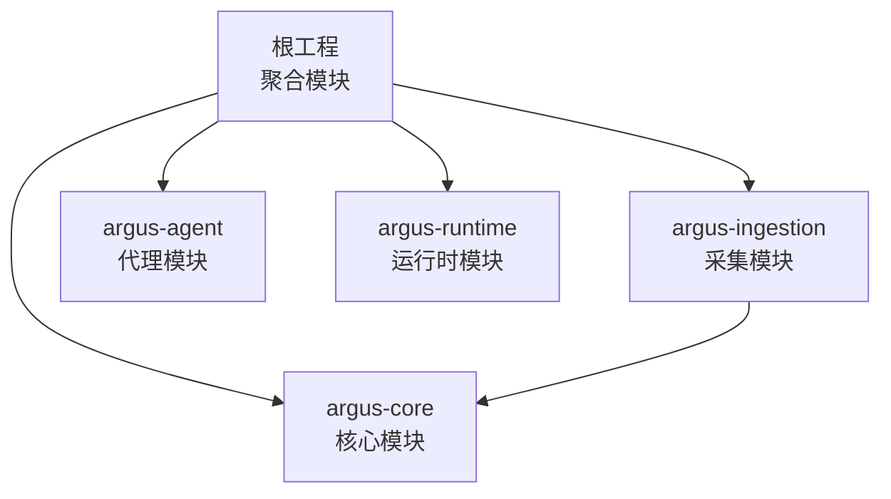
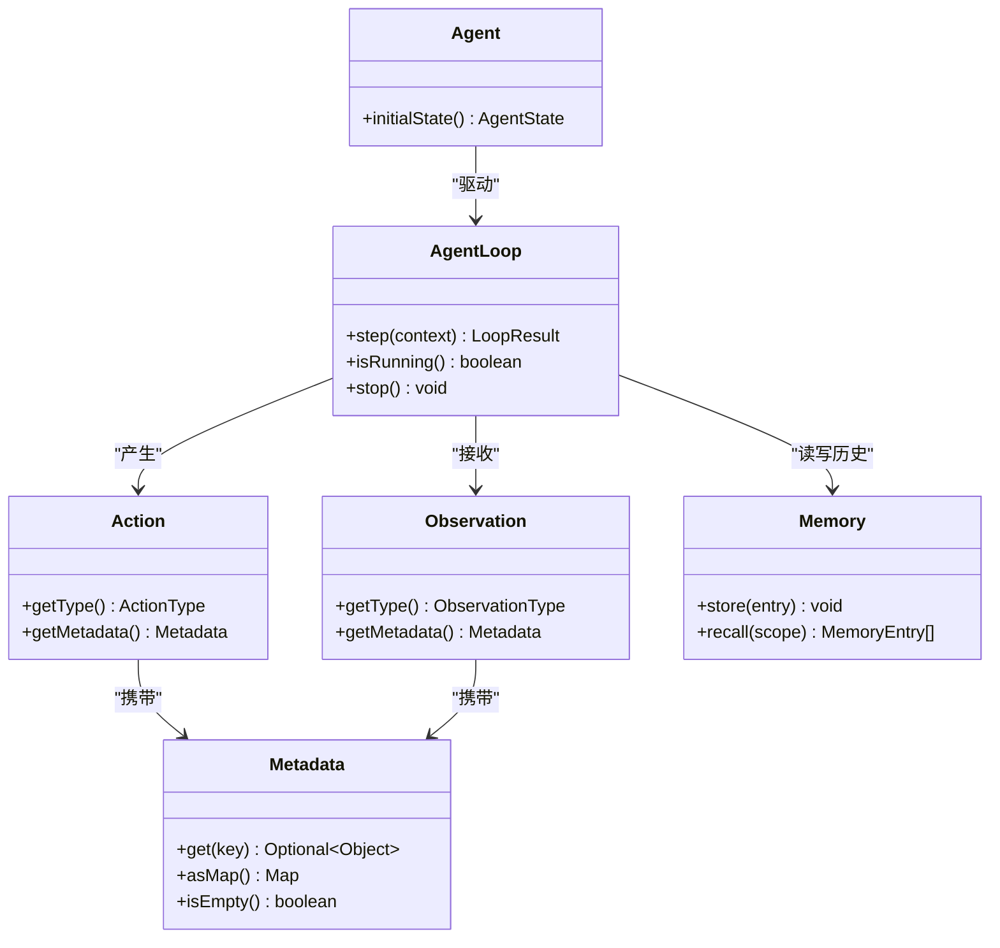
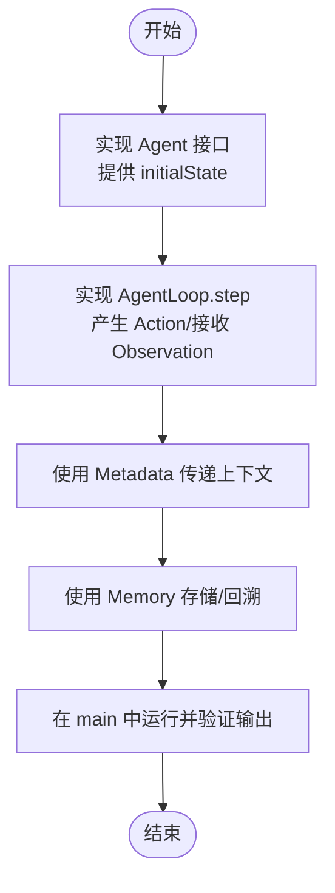
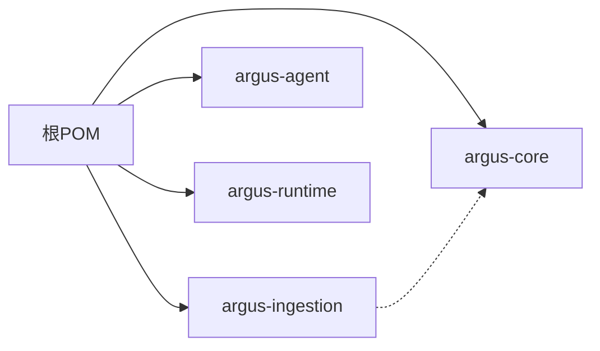

# 快速开始

<cite>
**本文引用的文件**
- [根POM](file://pom.xml)
- [README](file://readme.md)
- [核心模块 POM](file://argus-core/pom.xml)
- [代理模块 POM](file://argus-agent/pom.xml)
- [采集模块 POM](file://argus-ingestion/pom.xml)
- [Agent 接口](file://argus-core/src/main/java/io/argus/core/agent/Agent.java)
- [AgentLoop 接口](file://argus-core/src/main/java/io/argus/core/agent/AgentLoop.java)
- [Action 接口](file://argus-core/src/main/java/io/argus/core/action/Action.java)
- [Observation 接口](file://argus-core/src/main/java/io/argus/core/observation/Observation.java)
- [Memory 接口](file://argus-core/src/main/java/io/argus/core/memory/Memory.java)
- [Metadata 类](file://argus-core/src/main/java/io/argus/core/model/Metadata.java)
- [ArgusException 类](file://argus-core/src/main/java/io/argus/core/error/ArgusException.java)
</cite>

## 目录
1. [简介](#简介)
2. [项目结构](#项目结构)
3. [核心组件](#核心组件)
4. [架构总览](#架构总览)
5. [详细组件分析](#详细组件分析)
6. [依赖分析](#依赖分析)
7. [性能考虑](#性能考虑)
8. [故障排查指南](#故障排查指南)
9. [结论](#结论)
10. [附录](#附录)

## 简介
本指南面向首次接触 Argus 框架的新手开发者，帮助你在约 30 分钟内完成环境准备、项目编译与打包，并运行一个最简的 AI 代理示例。你将了解：
- JDK 版本要求与 Maven 配置
- 如何克隆仓库并一次性编译所有模块
- 如何创建并运行第一个代理示例
- 常见构建问题的排查与解决
- 如何验证安装成功及后续学习路径

## 项目结构
Argus 采用多模块 Maven 工程组织，顶层 POM 聚合四个子模块：
- argus-core：核心抽象与基础能力（Agent、Action、Observation、Memory 等）
- argus-ingestion：网络数据采集与解析（Fetch、Parse、Policy）
- argus-agent：AI 代理集成支持
- argus-runtime：生产级运行时容器



图表来源
- [根POM](file://pom.xml#L24-L29)
- [采集模块 POM](file://argus-ingestion/pom.xml#L21-L27)

章节来源
- [根POM](file://pom.xml#L1-L40)
- [README](file://readme.md#L7-L15)

## 核心组件
Argus 的核心围绕“代理-动作-观测-记忆”闭环展开，配合生命周期与元数据模型，形成可审计、可控制、可复现的执行体系。

- Agent（代理）：定义初始状态入口
- AgentLoop（代理循环）：单步决策循环，产出 Action 并接收 Observation
- Action（动作）：代理意图的声明式表示，通过 ActionType 分类
- Observation（观测）：代理执行后的客观事实反馈，通过 ObservationType 分类
- Memory（记忆）：存储与回溯历史信息
- Metadata（元数据）：承载键值对上下文信息，不可变封装



图表来源
- [Agent 接口](file://argus-core/src/main/java/io/argus/core/agent/Agent.java#L7-L11)
- [AgentLoop 接口](file://argus-core/src/main/java/io/argus/core/agent/AgentLoop.java#L49-L118)
- [Action 接口](file://argus-core/src/main/java/io/argus/core/action/Action.java#L37-L43)
- [Observation 接口](file://argus-core/src/main/java/io/argus/core/observation/Observation.java#L31-L37)
- [Memory 接口](file://argus-core/src/main/java/io/argus/core/memory/Memory.java#L9-L15)
- [Metadata 类](file://argus-core/src/main/java/io/argus/core/model/Metadata.java#L12-L34)

章节来源
- [Agent 接口](file://argus-core/src/main/java/io/argus/core/agent/Agent.java#L1-L11)
- [AgentLoop 接口](file://argus-core/src/main/java/io/argus/core/agent/AgentLoop.java#L1-L118)
- [Action 接口](file://argus-core/src/main/java/io/argus/core/action/Action.java#L1-L43)
- [Observation 接口](file://argus-core/src/main/java/io/argus/core/observation/Observation.java#L1-L37)
- [Memory 接口](file://argus-core/src/main/java/io/argus/core/memory/Memory.java#L1-L15)
- [Metadata 类](file://argus-core/src/main/java/io/argus/core/model/Metadata.java#L1-L34)

## 架构总览
Argus 的执行以 AgentLoop 为核心，每一步包含“评估上下文—产生动作—接收观测—转换状态”的原子循环。采集模块通过 Fetch/Parse 等策略为代理提供输入，核心模块提供统一的状态与元数据模型支撑。

```mermaid
sequenceDiagram
participant Dev as "开发者"
participant Agent as "Agent"
participant Loop as "AgentLoop"
participant Act as "Action"
participant Obs as "Observation"
participant Mem as "Memory"
Dev->>Agent : "创建代理实现"
Agent->>Loop : "初始化并进入循环"
Loop->>Loop : "step(context)"
Loop->>Act : "产生动作"
Act-->>Loop : "返回动作类型与元数据"
Loop->>Obs : "根据动作产生观测"
Obs-->>Loop : "返回观测类型与元数据"
Loop->>Mem : "存储/回溯历史"
Loop-->>Agent : "返回新状态"
Agent-->>Dev : "输出结果/日志"
```

图表来源
- [Agent 接口](file://argus-core/src/main/java/io/argus/core/agent/Agent.java#L7-L11)
- [AgentLoop 接口](file://argus-core/src/main/java/io/argus/core/agent/AgentLoop.java#L49-L118)
- [Action 接口](file://argus-core/src/main/java/io/argus/core/action/Action.java#L37-L43)
- [Observation 接口](file://argus-core/src/main/java/io/argus/core/observation/Observation.java#L31-L37)
- [Memory 接口](file://argus-core/src/main/java/io/argus/core/memory/Memory.java#L9-L15)

## 详细组件分析

### 快速开始：环境与构建
- 克隆仓库
  - 使用 Git 将仓库克隆到本地
- JDK 要求
  - 请使用与项目兼容的 JDK 版本（建议与 Maven 插件默认支持的版本一致）
- Maven 配置
  - 确保本地 Maven 环境可用，网络可访问中央仓库
- 一键编译与打包
  - 在仓库根目录执行：mvn clean package
  - 该命令会并行构建所有模块（argus-core、argus-ingestion、argus-agent、argus-runtime）

章节来源
- [README](file://readme.md#L16-L21)
- [根POM](file://pom.xml#L24-L29)

### 第一个代理示例（概念性步骤）
以下为概念性流程，帮助你在 30 分钟内跑通第一个示例。由于仓库未包含示例代码，请按以下步骤在现有接口上实现：

- 创建一个最小代理实现
  - 实现 Agent 接口，提供 initialState 返回初始 AgentState
  - 参考：[Agent 接口](file://argus-core/src/main/java/io/argus/core/agent/Agent.java#L7-L11)
- 实现 AgentLoop
  - 实现 step(context)：在每次 step 中决定一个简单 Action（如“记录观测”），并返回 LoopResult
  - 参考：[AgentLoop 接口](file://argus-core/src/main/java/io/argus/core/agent/AgentLoop.java#L49-L118)
- 使用 Action 与 Observation
  - 通过 Action.getType 与 Observation.getType 表达意图与事实
  - 参考：[Action 接口](file://argus-core/src/main/java/io/argus/core/action/Action.java#L37-L43)、[Observation 接口](file://argus-core/src/main/java/io/argus/core/observation/Observation.java#L31-L37)
- 使用 Metadata 传递上下文
  - 通过 Metadata 封装键值对信息，避免在类型枚举中硬编码
  - 参考：[Metadata 类](file://argus-core/src/main/java/io/argus/core/model/Metadata.java#L12-L34)
- 使用 Memory 存储与回溯
  - 在循环中调用 Memory.store 与 recall，验证历史可回放
  - 参考：[Memory 接口](file://argus-core/src/main/java/io/argus/core/memory/Memory.java#L9-L15)
- 运行与验证
  - 在 main 方法中创建你的代理与循环，执行若干 step 后打印状态或观测
  - 验证输出符合预期，且状态不可变、可审计



图表来源
- [Agent 接口](file://argus-core/src/main/java/io/argus/core/agent/Agent.java#L7-L11)
- [AgentLoop 接口](file://argus-core/src/main/java/io/argus/core/agent/AgentLoop.java#L49-L118)
- [Action 接口](file://argus-core/src/main/java/io/argus/core/action/Action.java#L37-L43)
- [Observation 接口](file://argus-core/src/main/java/io/argus/core/observation/Observation.java#L31-L37)
- [Memory 接口](file://argus-core/src/main/java/io/argus/core/memory/Memory.java#L9-L15)
- [Metadata 类](file://argus-core/src/main/java/io/argus/core/model/Metadata.java#L12-L34)

## 依赖分析
- 顶层 POM 聚合四个模块，便于一次性构建
- 采集模块显式依赖核心模块，确保采集功能建立在统一抽象之上
- 单元测试依赖 JUnit 3.8.1（测试作用域）



图表来源
- [根POM](file://pom.xml#L24-L29)
- [采集模块 POM](file://argus-ingestion/pom.xml#L21-L27)

章节来源
- [根POM](file://pom.xml#L1-L40)
- [核心模块 POM](file://argus-core/pom.xml#L1-L18)
- [代理模块 POM](file://argus-agent/pom.xml#L1-L23)
- [采集模块 POM](file://argus-ingestion/pom.xml#L1-L29)

## 性能考虑
- 单步执行模型
  - AgentLoop 的 step 应保持原子性与确定性，避免长耗时阻塞；长时间任务应拆分为多次 step
  - 参考：[AgentLoop 接口](file://argus-core/src/main/java/io/argus/core/agent/AgentLoop.java#L51-L86)
- 不可变状态
  - AgentState 与 Metadata 建议采用不可变设计，降低并发与回放复杂度
  - 参考：[AgentState 注释](file://argus-core/src/main/java/io/argus/core/agent/AgentState.java#L11-L20)、[Metadata 类](file://argus-core/src/main/java/io/argus/core/model/Metadata.java#L12-L34)
- 记忆与回放
  - Memory 的 recall 应尽量高效，必要时引入索引或分页策略

## 故障排查指南
- 构建失败（找不到模块或依赖）
  - 确认已执行 mvn clean package，且网络可访问 Maven 中央仓库
  - 若使用私有仓库，请检查 settings.xml 配置
- 依赖冲突或版本不匹配
  - 清理本地缓存后重试：mvn clean compile
  - 检查采集模块对核心模块的依赖是否正确
  - 参考：[采集模块 POM](file://argus-ingestion/pom.xml#L21-L27)
- 运行期异常
  - 使用 ArgusException 作为统一异常基类，便于捕获与定位
  - 参考：[ArgusException 类](file://argus-core/src/main/java/io/argus/core/error/ArgusException.java#L1-L8)
- 日志与审计
  - 利用 Observation 与 Memory 记录关键事实，便于调试与回放

章节来源
- [采集模块 POM](file://argus-ingestion/pom.xml#L21-L27)
- [ArgusException 类](file://argus-core/src/main/java/io/argus/core/error/ArgusException.java#L1-L8)

## 结论
通过本指南，你已经完成了：
- 环境准备与 Maven 构建
- 对核心抽象（Agent、AgentLoop、Action、Observation、Memory、Metadata）的理解
- 概念性的第一个代理示例实现思路
建议下一步：
- 阅读各模块的 README 或注释，深入理解采集与运行时职责
- 在本地实现一个最小可运行的 AgentLoop，结合 Memory 与 Metadata 完成一次完整的“思考-行动-观测-回溯”循环
- 尝试扩展采集模块，将外部数据源接入到代理的观测中

## 附录

### 验证安装成功的方法
- 构建产物
  - 根目录 target 下出现 argus-core、argus-ingestion、argus-agent、argus-runtime 的 jar 包
- 运行示例
  - 在你的代理实现中打印状态或观测，确认输出符合预期
- 回放能力
  - 通过不可变状态与历史记录，验证可审计与可复现

### 学习路径建议
- 先掌握核心模块的接口语义与不可变设计
- 再结合采集模块，理解从环境到代理的数据流
- 最后探索运行时模块，了解生产级部署与容器化实践