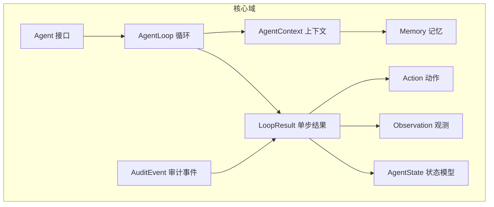
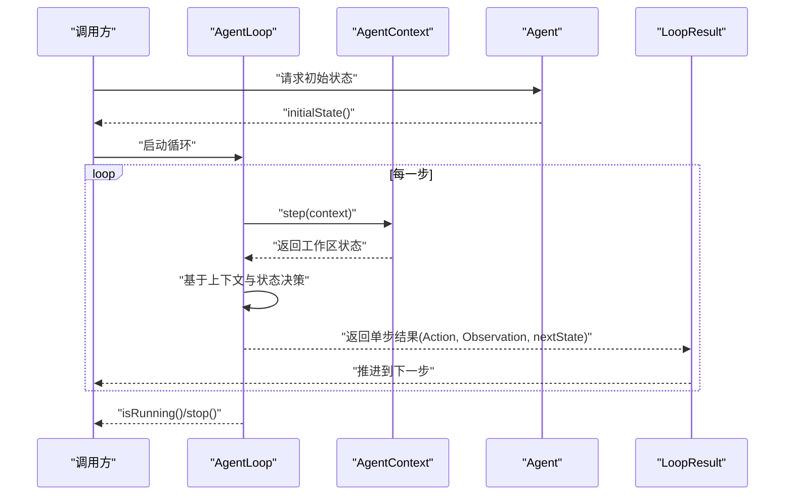
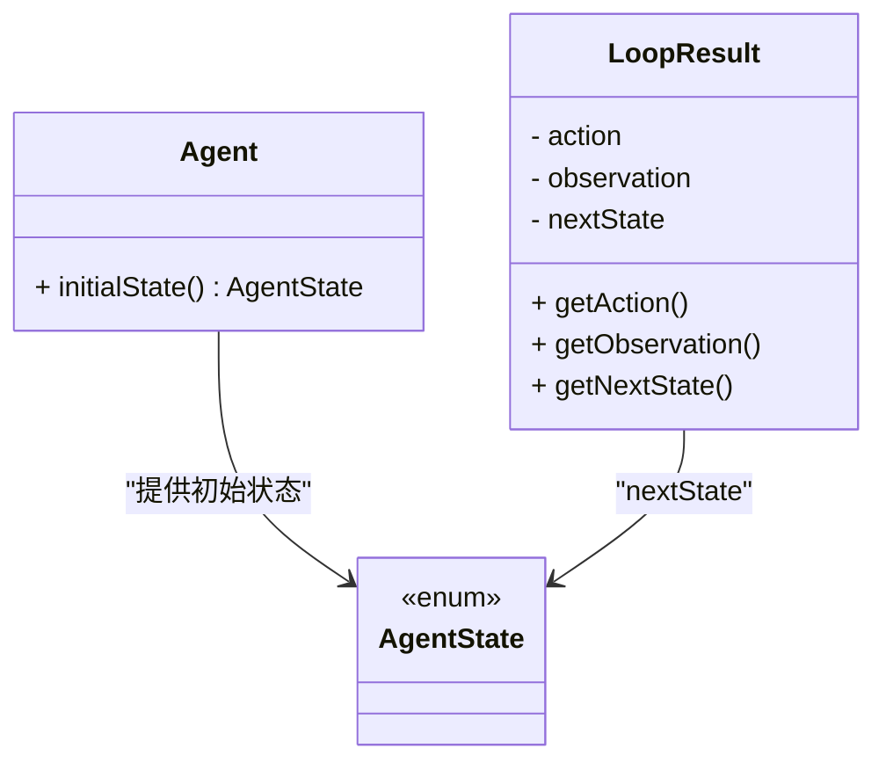
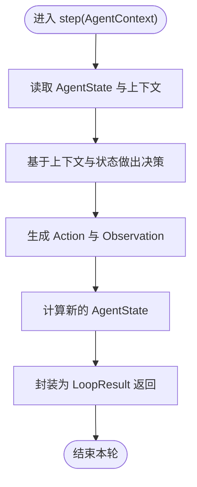
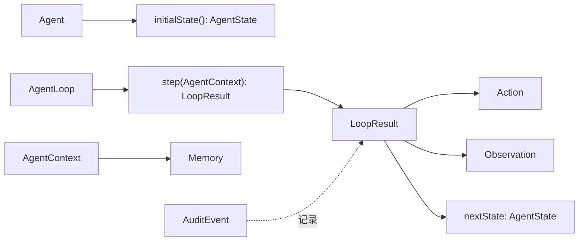
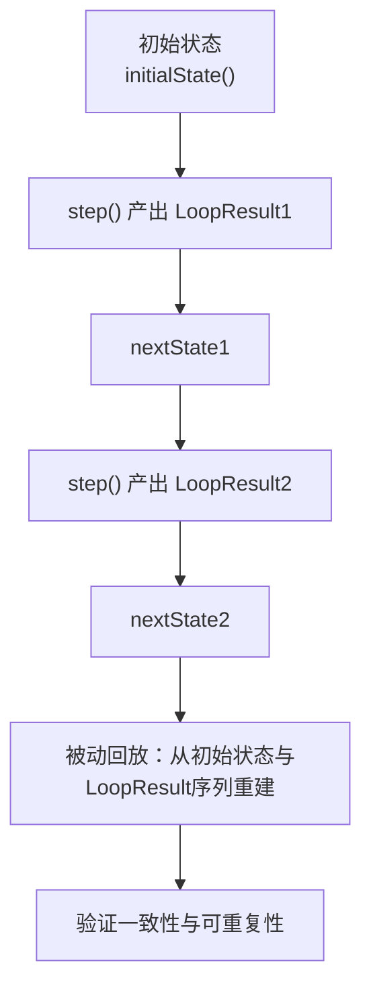

# AI代理系统理论

<cite>
**本文引用的文件**
- [Agent.java](file://argus-core/src/main/java/io/argus/core/agent/Agent.java)
- [AgentState.java](file://argus-core/src/main/java/io/argus/core/agent/AgentState.java)
- [AgentContext.java](file://argus-core/src/main/java/io/argus/core/agent/AgentContext.java)
- [AgentLoop.java](file://argus-core/src/main/java/io/argus/core/agent/AgentLoop.java)
- [LoopResult.java](file://argus-core/src/main/java/io/argus/core/agent/LoopResult.java)
- [Action.java](file://argus-core/src/main/java/io/argus/core/action/Action.java)
- [ActionType.java](file://argus-core/src/main/java/io/argus/core/action/ActionType.java)
- [Observation.java](file://argus-core/src/main/java/io/argus/core/observation/Observation.java)
- [ObservationType.java](file://argus-core/src/main/java/io/argus/core/observation/ObservationType.java)
- [Memory.java](file://argus-core/src/main/java/io/argus/core/memory/Memory.java)
- [MemoryEntry.java](file://argus-core/src/main/java/io/argus/core/memory/MemoryEntry.java)
- [AuditEvent.java](file://argus-core/src/main/java/io/argus/core/audit/AuditEvent.java)
- [AuditLevel.java](file://argus-core/src/main/java/io/argus/core/audit/AuditLevel.java)
- [readme.md](file://readme.md)
</cite>

## 目录
1. 引言
2. 项目结构
3. 核心组件
4. 架构总览
5. 组件详解
6. 依赖关系分析
7. 性能考量
8. 故障排查指南
9. 结论
10. 附录

## 引言
本文件系统化阐述Argus框架下的AI代理系统理论与实现要点，围绕“可审计、可控制、可复现”的设计目标，解释代理的基本特征与行为范式，梳理感知—决策—行动三阶段的执行模型，阐明Agent接口、AgentState状态模型、AgentContext上下文管理的职责边界与协作关系，并给出状态转换与回放的工程约束与最佳实践。

## 项目结构
Argus采用模块化分层组织，核心能力集中在argus-core，覆盖动作(Action)、观测(Observation)、代理(Agent)、记忆(Memory)、审计(Audit)等基础域。代理系统以AgentLoop为核心执行引擎，通过LoopResult记录单步决策事实；AgentState提供不可变快照；AgentContext承载瞬态工作空间；Action与Observation分别刻画意图与事实；Memory提供非权威记忆访问；AuditEvent支撑审计日志。

图表来源
- [Agent.java](file://argus-core/src/main/java/io/argus/core/agent/Agent.java#L7-L11)
- [AgentLoop.java](file://argus-core/src/main/java/io/argus/core/agent/AgentLoop.java#L49-L118)
- [AgentContext.java](file://argus-core/src/main/java/io/argus/core/agent/AgentContext.java#L92-L98)
- [LoopResult.java](file://argus-core/src/main/java/io/argus/core/agent/LoopResult.java#L78-L115)
- [Action.java](file://argus-core/src/main/java/io/argus/core/action/Action.java#L37-L43)
- [Observation.java](file://argus-core/src/main/java/io/argus/core/observation/Observation.java#L31-L37)
- [Memory.java](file://argus-core/src/main/java/io/argus/core/memory/Memory.java#L9-L15)
- [AuditEvent.java](file://argus-core/src/main/java/io/argus/core/audit/AuditEvent.java#L9-L60)

章节来源
- [readme.md](file://readme.md#L1-L28)

## 核心组件
- Agent接口：定义代理的初始状态入口，体现“从何处开始”的确定性起点。
- AgentState状态模型：不可变快照，确保可审计、可回放、可分支。
- AgentContext上下文：可变瞬态工作区，仅承载执行期辅助信息，严禁隐藏权威状态。
- AgentLoop循环：单步原子决策模型，保证可观测、可审计、可控制。
- LoopResult单步结果：不可变载体，记录Action、Observation与nextState，支撑被动回放。
- Action/ActionType：意图建模，强调语义分类而非执行细节。
- Observation/ObservationType：事实建模，强调不可变性与语义分类。
- Memory/MemoryEntry：非权威记忆访问，避免污染可重放状态。
- AuditEvent：审计事件载体，记录可追溯事实。

章节来源
- [Agent.java](file://argus-core/src/main/java/io/argus/core/agent/Agent.java#L7-L11)
- [AgentState.java](file://argus-core/src/main/java/io/argus/core/agent/AgentState.java#L3-L76)
- [AgentContext.java](file://argus-core/src/main/java/io/argus/core/agent/AgentContext.java#L5-L91)
- [AgentLoop.java](file://argus-core/src/main/java/io/argus/core/agent/AgentLoop.java#L6-L47)
- [LoopResult.java](file://argus-core/src/main/java/io/argus/core/agent/LoopResult.java#L6-L76)
- [Action.java](file://argus-core/src/main/java/io/argus/core/action/Action.java#L5-L36)
- [ActionType.java](file://argus-core/src/main/java/io/argus/core/action/ActionType.java#L3-L21)
- [Observation.java](file://argus-core/src/main/java/io/argus/core/observation/Observation.java#L5-L30)
- [ObservationType.java](file://argus-core/src/main/java/io/argus/core/observation/ObservationType.java#L3-L16)
- [Memory.java](file://argus-core/src/main/java/io/argus/core/memory/Memory.java#L5-L15)
- [MemoryEntry.java](file://argus-core/src/main/java/io/argus/core/memory/MemoryEntry.java#L5-L53)
- [AuditEvent.java](file://argus-core/src/main/java/io/argus/core/audit/AuditEvent.java#L5-L60)

## 架构总览
Argus代理系统遵循“循环-结果-状态”的确定性执行范式：AgentLoop每步产出LoopResult，其中封装Action、Observation与nextState；AgentState作为权威快照，既用于当前执行也用于被动回放；AgentContext仅在执行期存在，承载瞬态推理与外部集成句柄；AuditEvent贯穿执行与回放，确保可审计性。

图表来源
- [Agent.java](file://argus-core/src/main/java/io/argus/core/agent/Agent.java#L9-L11)
- [AgentLoop.java](file://argus-core/src/main/java/io/argus/core/agent/AgentLoop.java#L49-L118)
- [AgentContext.java](file://argus-core/src/main/java/io/argus/core/agent/AgentContext.java#L92-L98)
- [LoopResult.java](file://argus-core/src/main/java/io/argus/core/agent/LoopResult.java#L78-L115)

## 组件详解

### Agent接口与初始状态
- 职责边界：Agent仅负责提供初始AgentState，不参与执行细节。
- 初始状态定义：initialState()决定代理的起始快照，是后续所有推演的权威起点。
- 实现建议：将“可重放”要求前置到初始状态构造，避免在initialState中引入随机或外部依赖。

章节来源
- [Agent.java](file://argus-core/src/main/java/io/argus/core/agent/Agent.java#L7-L11)

### AgentState状态模型
- 不可变契约：每次状态转移必须产生新实例，禁止原地修改。
- 快照语义：AgentState是完整逻辑快照，无需依赖历史状态即可解释。
- 回放契约：回放时仅依赖LoopResult序列与初始AgentState，不依赖外部系统。
- 相等性：建议按结构相等实现，但不能依赖对象身份。

图表来源
- [AgentState.java](file://argus-core/src/main/java/io/argus/core/agent/AgentState.java#L3-L76)
- [LoopResult.java](file://argus-core/src/main/java/io/argus/core/agent/LoopResult.java#L78-L115)
- [Agent.java](file://argus-core/src/main/java/io/argus/core/agent/Agent.java#L9-L11)

章节来源
- [AgentState.java](file://argus-core/src/main/java/io/argus/core/agent/AgentState.java#L3-L76)

### AgentContext上下文管理
- 可变瞬态：仅在执行期存在，承载推理缓冲、外部客户端、限流器、指标与日志助手等。
- 边界与禁令：严禁将权威状态、不可逆决策或隐藏副作用存入AgentContext；回放不得依赖其值。
- 与Memory的关系：可通过getMemory()访问非权威记忆，但存储/召回需遵守不可变状态的约束。

图表来源
- [AgentContext.java](file://argus-core/src/main/java/io/argus/core/agent/AgentContext.java#L5-L91)
- [AgentLoop.java](file://argus-core/src/main/java/io/argus/core/agent/AgentLoop.java#L51-L88)
- [LoopResult.java](file://argus-core/src/main/java/io/argus/core/agent/LoopResult.java#L78-L115)

章节来源
- [AgentContext.java](file://argus-core/src/main/java/io/argus/core/agent/AgentContext.java#L5-L91)

### AgentLoop循环与单步执行
- 原子性：每步是确定性、可观测、可审计的独立事实。
- 限制：不得包含无界循环；长任务应拆分为多次step。
- 生命周期：isRunning()指示是否继续，stop()请求优雅终止。

章节来源
- [AgentLoop.java](file://argus-core/src/main/java/io/argus/core/agent/AgentLoop.java#L51-L118)

### LoopResult单步结果
- 不可变性：Action、Observation、nextState三元组不可变且自包含。
- 回放语义：给定相同初始AgentState与有序LoopResult序列，可被动回放而不重执行决策逻辑。
- 事实载体：不包含可执行逻辑，仅为纯数据载体。

章节来源
- [LoopResult.java](file://argus-core/src/main/java/io/argus/core/agent/LoopResult.java#L6-L76)

### Action与ActionType
- 意图建模：Action描述“要做什么”，而非“如何做”。
- 语义分类：ActionType提供高层类别（如DECIDE、REQUEST、FETCH、TRANSFORM、STORE、EMIT），避免在Action中编码技术细节。
- 元数据：领域细节通过Metadata传递，保持Action的通用性。

章节来源
- [Action.java](file://argus-core/src/main/java/io/argus/core/action/Action.java#L5-L36)
- [ActionType.java](file://argus-core/src/main/java/io/argus/core/action/ActionType.java#L3-L21)

### Observation与ObservationType
- 事实建模：Observation描述“发生了什么”，不包含行为指令。
- 类型体系：STATE、DATA、RESPONSE、ERROR、EVENT五类，覆盖内部状态、原始数据、对外响应、错误与外部事件。
- 元数据：通过Metadata补充上下文，避免过度扩展枚举。

章节来源
- [Observation.java](file://argus-core/src/main/java/io/argus/core/observation/Observation.java#L5-L30)
- [ObservationType.java](file://argus-core/src/main/java/io/argus/core/observation/ObservationType.java#L3-L16)

### Memory与MemoryEntry
- 非权威记忆：用于短期推理与快速检索，不参与权威状态。
- 存取契约：store与recall操作不改变AgentState，避免破坏可重放性。
- 结构化：MemoryEntry包含id、scope、value、metadata、timestamp，便于审计与追踪。

章节来源
- [Memory.java](file://argus-core/src/main/java/io/argus/core/memory/Memory.java#L5-L15)
- [MemoryEntry.java](file://argus-core/src/main/java/io/argus/core/memory/MemoryEntry.java#L5-L53)

### 审计与可审计性
- 审计事件：AuditEvent记录id、级别、类型、消息、元数据与时间戳，作为可追溯事实。
- 审计级别：AuditLevel提供等级化标识，便于分级记录与检索。
- 与回放：审计事件与LoopResult共同构成可回放的执行轨迹，支持事后分析与合规审查。

章节来源
- [AuditEvent.java](file://argus-core/src/main/java/io/argus/core/audit/AuditEvent.java#L5-L60)
- [AuditLevel.java](file://argus-core/src/main/java/io/argus/core/audit/AuditLevel.java#L1-L8)

## 依赖关系分析
- Agent与AgentLoop：Agent提供初始状态，AgentLoop消费上下文与状态，产出LoopResult。
- LoopResult与Action/Observation/AgentState：三者共同构成单步事实，支撑回放。
- AgentContext与Memory：上下文提供对记忆的非权威访问，避免状态污染。
- AuditEvent与LoopResult：审计事件可由LoopResult派生或独立记录，确保可追溯。

图表来源
- [Agent.java](file://argus-core/src/main/java/io/argus/core/agent/Agent.java#L9-L11)
- [AgentLoop.java](file://argus-core/src/main/java/io/argus/core/agent/AgentLoop.java#L89-L102)
- [LoopResult.java](file://argus-core/src/main/java/io/argus/core/agent/LoopResult.java#L92-L112)
- [Action.java](file://argus-core/src/main/java/io/argus/core/action/Action.java#L37-L43)
- [Observation.java](file://argus-core/src/main/java/io/argus/core/observation/Observation.java#L31-L37)
- [AgentContext.java](file://argus-core/src/main/java/io/argus/core/agent/AgentContext.java#L92-L98)
- [Memory.java](file://argus-core/src/main/java/io/argus/core/memory/Memory.java#L9-L15)
- [AuditEvent.java](file://argus-core/src/main/java/io/argus/core/audit/AuditEvent.java#L9-L60)

章节来源
- [Agent.java](file://argus-core/src/main/java/io/argus/core/agent/Agent.java#L7-L11)
- [AgentLoop.java](file://argus-core/src/main/java/io/argus/core/agent/AgentLoop.java#L49-L118)
- [LoopResult.java](file://argus-core/src/main/java/io/argus/core/agent/LoopResult.java#L78-L115)
- [AgentContext.java](file://argus-core/src/main/java/io/argus/core/agent/AgentContext.java#L5-L91)
- [Memory.java](file://argus-core/src/main/java/io/argus/core/memory/Memory.java#L5-L15)
- [AuditEvent.java](file://argus-core/src/main/java/io/argus/core/audit/AuditEvent.java#L5-L60)

## 性能考量
- 单步原子性：避免在step中执行长时间阻塞操作，将长任务拆分为多步，提升可观测性与可控性。
- 不可变快照：AgentState与LoopResult的不可变性带来内存与并发优势，但需注意对象创建成本，可在实现中采用高效的数据结构与缓存策略。
- 上下文瞬态：AgentContext的可变性有助于执行期优化（如缓存、限流），但必须避免将其作为权威状态来源。
- 回放性能：回放时尽量减少外部依赖，优先使用LoopResult与初始状态重建，必要时对Memory进行只读缓存。

## 故障排查指南
- 状态不一致：检查AgentState是否满足不可变契约，确认每次状态转移均产生新实例。
- 回放异常：核对LoopResult序列是否完整、有序，确保回放时未依赖AgentContext中的瞬态值。
- 决策偏差：审查Action与Observation的语义分类是否准确，避免在Action中混入执行细节。
- 审计缺失：确认AuditEvent是否在关键节点记录，包括错误、状态切换与外部事件响应。

## 结论
Argus的代理系统通过Agent、AgentLoop、AgentState、AgentContext与LoopResult的协同，构建了“可审计、可控制、可复现”的执行范式。Action与Observation的语义分离，Memory的非权威定位，以及AuditEvent的可追溯性，共同保障了系统的确定性与可维护性。在工程实践中，应严格遵循不可变快照、瞬态上下文与被动回放的契约，以获得稳定、可控且可复现的代理行为。

## 附录

### 代理接口实现要点（路径指引）
- 初始状态定义：参考 [Agent.java](file://argus-core/src/main/java/io/argus/core/agent/Agent.java#L9-L11)
- 单步执行流程：参考 [AgentLoop.java](file://argus-core/src/main/java/io/argus/core/agent/AgentLoop.java#L51-L88)
- 单步结果封装：参考 [LoopResult.java](file://argus-core/src/main/java/io/argus/core/agent/LoopResult.java#L92-L112)
- 上下文访问与记忆：参考 [AgentContext.java](file://argus-core/src/main/java/io/argus/core/agent/AgentContext.java#L92-L98)、[Memory.java](file://argus-core/src/main/java/io/argus/core/memory/Memory.java#L9-L15)

### 状态转换与回放流程（流程图）

图表来源
- [Agent.java](file://argus-core/src/main/java/io/argus/core/agent/Agent.java#L9-L11)
- [AgentLoop.java](file://argus-core/src/main/java/io/argus/core/agent/AgentLoop.java#L51-L88)
- [LoopResult.java](file://argus-core/src/main/java/io/argus/core/agent/LoopResult.java#L92-L112)