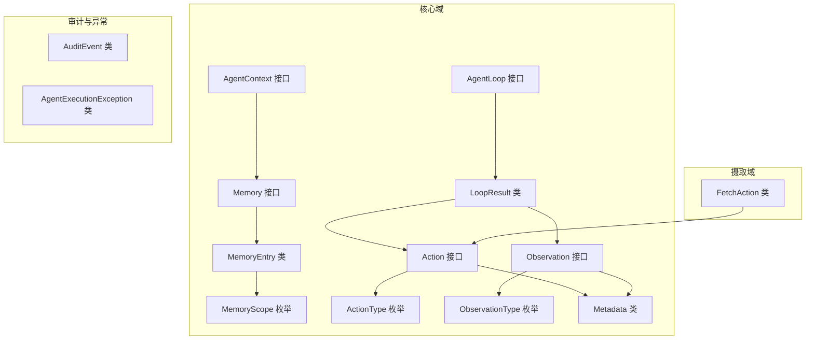
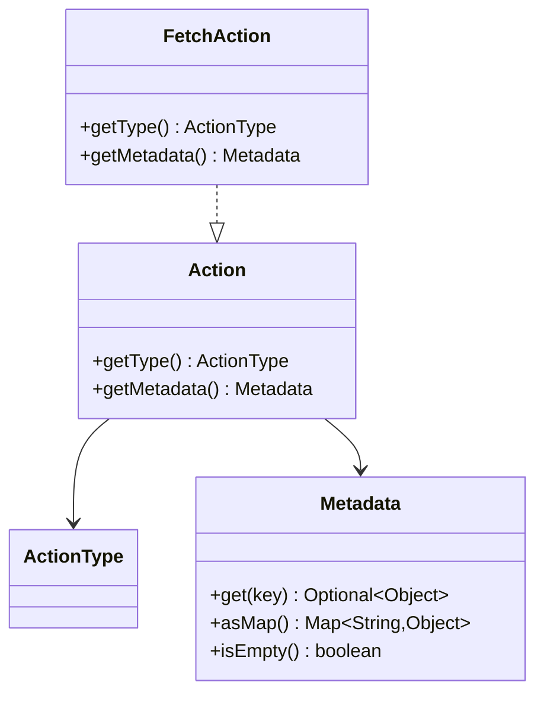
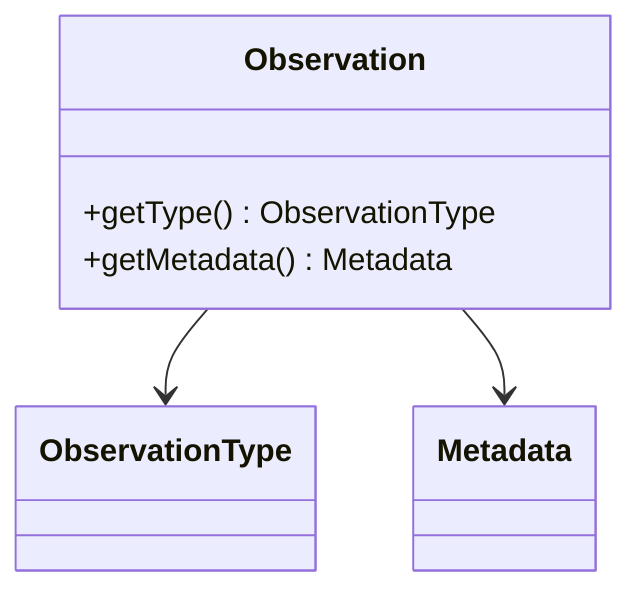
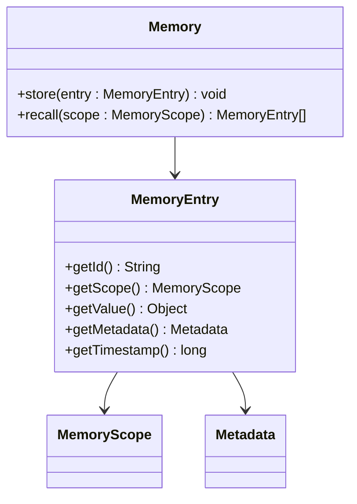
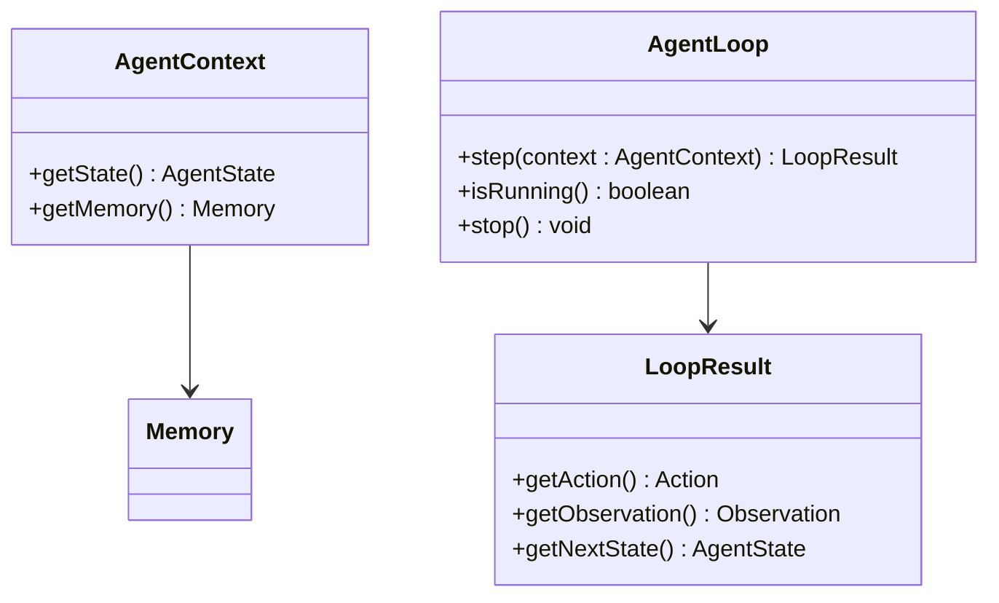
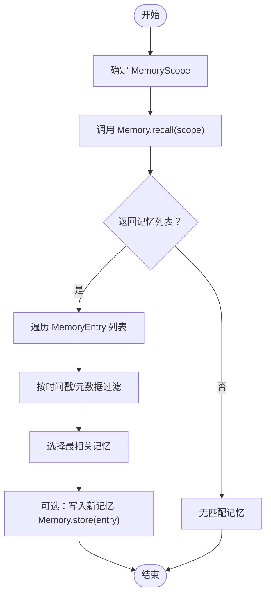
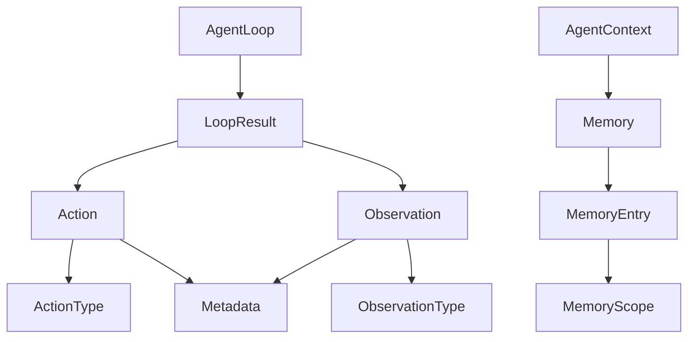

# Action-Observation-Memory模型

<cite>
**本文档引用的文件**
- [Action.java](file://argus-core/src/main/java/io/argus/core/action/Action.java)
- [ActionType.java](file://argus-core/src/main/java/io/argus/core/action/ActionType.java)
- [ActionResult.java](file://argus-core/src/main/java/io/argus/core/action/ActionResult.java)
- [Observation.java](file://argus-core/src/main/java/io/argus/core/observation/Observation.java)
- [ObservationType.java](file://argus-core/src/main/java/io/argus/core/observation/ObservationType.java)
- [Memory.java](file://argus-core/src/main/java/io/argus/core/memory/Memory.java)
- [MemoryEntry.java](file://argus-core/src/main/java/io/argus/core/memory/MemoryEntry.java)
- [MemoryScope.java](file://argus-core/src/main/java/io/argus/core/memory/MemoryScope.java)
- [Metadata.java](file://argus-core/src/main/java/io/argus/core/model/Metadata.java)
- [Agent.java](file://argus-core/src/main/java/io/argus/core/agent/Agent.java)
- [AgentContext.java](file://argus-core/src/main/java/io/argus/core/agent/AgentContext.java)
- [AgentLoop.java](file://argus-core/src/main/java/io/argus/core/agent/AgentLoop.java)
- [LoopResult.java](file://argus-core/src/main/java/io/argus/core/agent/LoopResult.java)
- [FetchAction.java](file://argus-ingestion/src/main/java/io/argus/ingestion/fetch/FetchAction.java)
- [AuditEvent.java](file://argus-core/src/main/java/io/argus/core/audit/AuditEvent.java)
- [AgentExecutionException.java](file://argus-core/src/main/java/io/argus/core/error/AgentExecutionException.java)
</cite>

## 目录
1. [引言](#引言)
2. [项目结构](#项目结构)
3. [核心组件](#核心组件)
4. [架构总览](#架构总览)
5. [详细组件分析](#详细组件分析)
6. [依赖关系分析](#依赖关系分析)
7. [性能考量](#性能考量)
8. [故障排查指南](#故障排查指南)
9. [结论](#结论)
10. [附录](#附录)

## 引言
本文件系统性阐述Argus代理系统的Action-Observation-Memory（行动-观察-记忆）模型。该模型以三个核心构件定义代理的意图、事实与知识，形成可审计、可控、可复现的执行闭环。Action表达代理的意图与计划；Observation记录执行过程中的事实性信息；Memory管理代理的知识与经验。三者通过AgentLoop的单步决策循环协同工作，确保每次行动都有明确意图、可观测结果与可追溯的记忆。

## 项目结构
Argus采用按领域分层的模块化组织：
- argus-core：核心域模型与执行框架（Action、Observation、Memory、Agent、AgentLoop、LoopResult）
- argus-ingestion：数据摄取与处理（如FetchAction等）
- argus-runtime：运行时支撑（占位，当前未包含具体实现）



图表来源
- [AgentContext.java](file://argus-core/src/main/java/io/argus/core/agent/AgentContext.java#L92-L98)
- [AgentLoop.java](file://argus-core/src/main/java/io/argus/core/agent/AgentLoop.java#L49-L118)
- [LoopResult.java](file://argus-core/src/main/java/io/argus/core/agent/LoopResult.java#L78-L115)
- [Action.java](file://argus-core/src/main/java/io/argus/core/action/Action.java#L37-L43)
- [Observation.java](file://argus-core/src/main/java/io/argus/core/observation/Observation.java#L31-L37)
- [Memory.java](file://argus-core/src/main/java/io/argus/core/memory/Memory.java#L9-L15)
- [MemoryEntry.java](file://argus-core/src/main/java/io/argus/core/memory/MemoryEntry.java#L9-L53)
- [MemoryScope.java](file://argus-core/src/main/java/io/argus/core/memory/MemoryScope.java#L7-L8)
- [ActionType.java](file://argus-core/src/main/java/io/argus/core/action/ActionType.java#L22-L143)
- [ObservationType.java](file://argus-core/src/main/java/io/argus/core/observation/ObservationType.java#L18-L117)
- [Metadata.java](file://argus-core/src/main/java/io/argus/core/model/Metadata.java#L12-L34)
- [FetchAction.java](file://argus-ingestion/src/main/java/io/argus/ingestion/fetch/FetchAction.java#L11-L21)
- [AuditEvent.java](file://argus-core/src/main/java/io/argus/core/audit/AuditEvent.java#L9-L60)
- [AgentExecutionException.java](file://argus-core/src/main/java/io/argus/core/error/AgentExecutionException.java#L7-L8)

章节来源
- [AgentContext.java](file://argus-core/src/main/java/io/argus/core/agent/AgentContext.java#L1-L98)
- [AgentLoop.java](file://argus-core/src/main/java/io/argus/core/agent/AgentLoop.java#L1-L118)
- [LoopResult.java](file://argus-core/src/main/java/io/argus/core/agent/LoopResult.java#L1-L115)
- [Action.java](file://argus-core/src/main/java/io/argus/core/action/Action.java#L1-L43)
- [Observation.java](file://argus-core/src/main/java/io/argus/core/observation/Observation.java#L1-L37)
- [Memory.java](file://argus-core/src/main/java/io/argus/core/memory/Memory.java#L1-L15)
- [MemoryEntry.java](file://argus-core/src/main/java/io/argus/core/memory/MemoryEntry.java#L1-L53)
- [MemoryScope.java](file://argus-core/src/main/java/io/argus/core/memory/MemoryScope.java#L1-L8)
- [ActionType.java](file://argus-core/src/main/java/io/argus/core/action/ActionType.java#L1-L143)
- [ObservationType.java](file://argus-core/src/main/java/io/argus/core/observation/ObservationType.java#L1-L117)
- [Metadata.java](file://argus-core/src/main/java/io/argus/core/model/Metadata.java#L1-L34)
- [FetchAction.java](file://argus-ingestion/src/main/java/io/argus/ingestion/fetch/FetchAction.java#L1-L21)
- [AuditEvent.java](file://argus-core/src/main/java/io/argus/core/audit/AuditEvent.java#L1-L60)
- [AgentExecutionException.java](file://argus-core/src/main/java/io/argus/core/error/AgentExecutionException.java#L1-L8)

## 核心组件
- Action（行动）：代理意图的声明式表达，通过ActionType进行高层语义分类，通过Metadata携带附加信息。实现类需避免内嵌执行逻辑与技术细节。
- Observation（观察）：对执行事实的不可变记录，通过ObservationType分类，同样通过Metadata承载上下文。
- Memory（记忆）：抽象的记忆接口，提供存储与召回能力；MemoryEntry封装单条记忆项，包含id、scope、value、metadata、timestamp；MemoryScope用于范围划分。
- AgentContext（执行上下文）：代理执行期的可变工作空间，强调瞬时性与非权威性，禁止存放影响回放的关键状态。
- AgentLoop（执行循环）：定义单步决策循环，保证每一步的确定性、可观测性与可审计性。
- LoopResult（单步结果）：不可变的单次执行事实载体，包含Action、Observation与下一AgentState，支撑确定性回放。

章节来源
- [Action.java](file://argus-core/src/main/java/io/argus/core/action/Action.java#L37-L43)
- [ActionType.java](file://argus-core/src/main/java/io/argus/core/action/ActionType.java#L22-L143)
- [Observation.java](file://argus-core/src/main/java/io/argus/core/observation/Observation.java#L31-L37)
- [ObservationType.java](file://argus-core/src/main/java/io/argus/core/observation/ObservationType.java#L18-L117)
- [Memory.java](file://argus-core/src/main/java/io/argus/core/memory/Memory.java#L9-L15)
- [MemoryEntry.java](file://argus-core/src/main/java/io/argus/core/memory/MemoryEntry.java#L9-L53)
- [MemoryScope.java](file://argus-core/src/main/java/io/argus/core/memory/MemoryScope.java#L7-L8)
- [AgentContext.java](file://argus-core/src/main/java/io/argus/core/agent/AgentContext.java#L92-L98)
- [AgentLoop.java](file://argus-core/src/main/java/io/argus/core/agent/AgentLoop.java#L49-L118)
- [LoopResult.java](file://argus-core/src/main/java/io/argus/core/agent/LoopResult.java#L78-L115)

## 架构总览
Action-Observation-Memory模型通过AgentLoop的单步循环串联：代理基于当前AgentContext与AgentState生成Action，执行后得到Observation，最终推进到新的AgentState。同时，关键事实被记录到LoopResult，供审计与回放使用；Memory负责长期知识与经验的存储与检索。

```mermaid
sequenceDiagram
participant Ctx as "AgentContext"
participant Loop as "AgentLoop"
participant Act as "Action"
participant Obs as "Observation"
participant Mem as "Memory"
participant Res as "LoopResult"
Ctx->>Loop : 调用 step(context)
Loop->>Ctx : 读取状态与上下文
Loop->>Act : 生成 Action含类型与元数据
Loop->>Obs : 执行后获得 Observation含类型与元数据
Loop->>Mem : 可选：写入/召回记忆
Loop->>Res : 组装 LoopResultAction, Observation, NextState
Loop-->>Ctx : 返回 LoopResult
```

图表来源
- [AgentLoop.java](file://argus-core/src/main/java/io/argus/core/agent/AgentLoop.java#L89-L102)
- [LoopResult.java](file://argus-core/src/main/java/io/argus/core/agent/LoopResult.java#L92-L100)
- [AgentContext.java](file://argus-core/src/main/java/io/argus/core/agent/AgentContext.java#L94-L96)
- [Memory.java](file://argus-core/src/main/java/io/argus/core/memory/Memory.java#L11-L13)

## 详细组件分析

### Action（行动）模型
- 设计理念：Action是代理意图的声明式表达，强调“要做什么”而非“怎么做”。通过ActionType进行高层语义分类，避免在Action中编码执行细节与协议实现。
- 关键职责：
  - 提供类型识别：ActionType定义DECIDE、REQUEST、FETCH、TRANSFORM、STORE、EMIT等高阶类别。
  - 提供上下文：Metadata承载领域特定信息，避免通过扩展枚举表达细粒度语义。
- 典型实现：FetchAction作为FETCH类型的示例，遵循Action契约，仅暴露类型与元数据访问器。



图表来源
- [Action.java](file://argus-core/src/main/java/io/argus/core/action/Action.java#L37-L43)
- [ActionType.java](file://argus-core/src/main/java/io/argus/core/action/ActionType.java#L22-L143)
- [Metadata.java](file://argus-core/src/main/java/io/argus/core/model/Metadata.java#L12-L34)
- [FetchAction.java](file://argus-ingestion/src/main/java/io/argus/ingestion/fetch/FetchAction.java#L11-L21)

章节来源
- [Action.java](file://argus-core/src/main/java/io/argus/core/action/Action.java#L1-L43)
- [ActionType.java](file://argus-core/src/main/java/io/argus/core/action/ActionType.java#L1-L143)
- [FetchAction.java](file://argus-ingestion/src/main/java/io/argus/ingestion/fetch/FetchAction.java#L1-L21)
- [Metadata.java](file://argus-core/src/main/java/io/argus/core/model/Metadata.java#L1-L34)

### Observation（观察）模型
- 设计理念：Observation是对执行事实的不可变记录，区分“发生了什么”与“应该如何反应”。通过ObservationType分类STATE、DATA、RESPONSE、ERROR、EVENT等。
- 关键职责：
  - 记录事实：涵盖内部状态变化、原始/结构化数据、对外请求响应、错误与外部事件。
  - 结构化元数据：通过Metadata提供上下文与领域信息。
- 与Action的关系：Observation通常由Action的执行结果或环境变化产生，二者共同构成LoopResult的完整事实。



图表来源
- [Observation.java](file://argus-core/src/main/java/io/argus/core/observation/Observation.java#L31-L37)
- [ObservationType.java](file://argus-core/src/main/java/io/argus/core/observation/ObservationType.java#L18-L117)
- [Metadata.java](file://argus-core/src/main/java/io/argus/core/model/Metadata.java#L12-L34)

章节来源
- [Observation.java](file://argus-core/src/main/java/io/argus/core/observation/Observation.java#L1-L37)
- [ObservationType.java](file://argus-core/src/main/java/io/argus/core/observation/ObservationType.java#L1-L117)
- [Metadata.java](file://argus-core/src/main/java/io/argus/core/model/Metadata.java#L1-L34)

### Memory（记忆）模型
- 设计理念：Memory提供抽象的记忆存储与检索能力，MemoryEntry封装单条记忆项，包含标识、作用域、值、元数据与时间戳；MemoryScope用于范围划分。
- 关键职责：
  - 存储：将关键事实或经验以MemoryEntry形式持久化。
  - 回忆：根据MemoryScope检索相关记忆，支持推理与决策。
  - 生命周期：通过作用域与时间戳管理记忆的可见性与时效性。
- 与AgentContext的边界：AgentContext是瞬时工作区，禁止存放权威状态；记忆属于可审计、可回放的知识资产。



图表来源
- [Memory.java](file://argus-core/src/main/java/io/argus/core/memory/Memory.java#L9-L15)
- [MemoryEntry.java](file://argus-core/src/main/java/io/argus/core/memory/MemoryEntry.java#L9-L53)
- [MemoryScope.java](file://argus-core/src/main/java/io/argus/core/memory/MemoryScope.java#L7-L8)
- [Metadata.java](file://argus-core/src/main/java/io/argus/core/model/Metadata.java#L12-L34)

章节来源
- [Memory.java](file://argus-core/src/main/java/io/argus/core/memory/Memory.java#L1-L15)
- [MemoryEntry.java](file://argus-core/src/main/java/io/argus/core/memory/MemoryEntry.java#L1-L53)
- [MemoryScope.java](file://argus-core/src/main/java/io/argus/core/memory/MemoryScope.java#L1-L8)
- [Metadata.java](file://argus-core/src/main/java/io/argus/core/model/Metadata.java#L1-L34)

### AgentContext与AgentLoop（执行框架）
- AgentContext：代理执行期的可变工作空间，强调瞬时性与非权威性；禁止存放影响回放的关键状态。
- AgentLoop：定义单步决策循环，保证每一步的确定性、可观测性与可审计性；step返回LoopResult，作为回放的唯一事实来源。



图表来源
- [AgentContext.java](file://argus-core/src/main/java/io/argus/core/agent/AgentContext.java#L92-L98)
- [AgentLoop.java](file://argus-core/src/main/java/io/argus/core/agent/AgentLoop.java#L49-L118)
- [LoopResult.java](file://argus-core/src/main/java/io/argus/core/agent/LoopResult.java#L78-L115)

章节来源
- [AgentContext.java](file://argus-core/src/main/java/io/argus/core/agent/AgentContext.java#L1-L98)
- [AgentLoop.java](file://argus-core/src/main/java/io/argus/core/agent/AgentLoop.java#L1-L118)
- [LoopResult.java](file://argus-core/src/main/java/io/argus/core/agent/LoopResult.java#L1-L115)

### 从动作生成到观察记录再到记忆更新的完整流程
以下序列图展示了Action-Observation-Memory三者的协同工作流：代理生成Action，执行后得到Observation，随后推进状态并可选择更新记忆。

```mermaid
sequenceDiagram
participant Agent as "Agent"
participant Ctx as "AgentContext"
participant Loop as "AgentLoop"
participant Act as "Action"
participant Obs as "Observation"
participant Mem as "Memory"
participant Res as "LoopResult"
Agent->>Ctx : 初始化执行上下文
Ctx->>Loop : step(context)
Loop->>Act : 生成 Action类型+元数据
Loop->>Obs : 执行 Action 后获得 Observation
Loop->>Mem : 可选：store/recall 记忆
Loop->>Res : 组装 LoopResultAction, Observation, NextState
Loop-->>Ctx : 返回 LoopResult
Ctx-->>Agent : 推进到下一状态
```

图表来源
- [AgentLoop.java](file://argus-core/src/main/java/io/argus/core/agent/AgentLoop.java#L89-L102)
- [LoopResult.java](file://argus-core/src/main/java/io/argus/core/agent/LoopResult.java#L92-L100)
- [Memory.java](file://argus-core/src/main/java/io/argus/core/memory/Memory.java#L11-L13)

章节来源
- [AgentLoop.java](file://argus-core/src/main/java/io/argus/core/agent/AgentLoop.java#L1-L118)
- [LoopResult.java](file://argus-core/src/main/java/io/argus/core/agent/LoopResult.java#L1-L115)
- [Memory.java](file://argus-core/src/main/java/io/argus/core/memory/Memory.java#L1-L15)

### 复杂逻辑流程：记忆召回与作用域管理


图表来源
- [Memory.java](file://argus-core/src/main/java/io/argus/core/memory/Memory.java#L11-L13)
- [MemoryEntry.java](file://argus-core/src/main/java/io/argus/core/memory/MemoryEntry.java#L9-L53)
- [MemoryScope.java](file://argus-core/src/main/java/io/argus/core/memory/MemoryScope.java#L7-L8)

章节来源
- [Memory.java](file://argus-core/src/main/java/io/argus/core/memory/Memory.java#L1-L15)
- [MemoryEntry.java](file://argus-core/src/main/java/io/argus/core/memory/MemoryEntry.java#L1-L53)
- [MemoryScope.java](file://argus-core/src/main/java/io/argus/core/memory/MemoryScope.java#L1-L8)

## 依赖关系分析
- 松耦合与高内聚：Action、Observation、Memory分别聚焦意图、事实与知识，通过Metadata统一承载上下文，降低实现间的耦合。
- 边界清晰：AgentContext与AgentState分离，前者瞬时不可靠，后者可审计可回放，防止隐藏状态破坏可复现性。
- 可扩展性：通过枚举ActionType与ObservationType扩展高阶语义，通过Metadata承载细粒度信息，避免在接口中硬编码实现细节。



图表来源
- [Action.java](file://argus-core/src/main/java/io/argus/core/action/Action.java#L37-L43)
- [ActionType.java](file://argus-core/src/main/java/io/argus/core/action/ActionType.java#L22-L143)
- [Observation.java](file://argus-core/src/main/java/io/argus/core/observation/Observation.java#L31-L37)
- [ObservationType.java](file://argus-core/src/main/java/io/argus/core/observation/ObservationType.java#L18-L117)
- [Memory.java](file://argus-core/src/main/java/io/argus/core/memory/Memory.java#L9-L15)
- [MemoryEntry.java](file://argus-core/src/main/java/io/argus/core/memory/MemoryEntry.java#L9-L53)
- [MemoryScope.java](file://argus-core/src/main/java/io/argus/core/memory/MemoryScope.java#L7-L8)
- [AgentLoop.java](file://argus-core/src/main/java/io/argus/core/agent/AgentLoop.java#L49-L118)
- [LoopResult.java](file://argus-core/src/main/java/io/argus/core/agent/LoopResult.java#L78-L115)
- [AgentContext.java](file://argus-core/src/main/java/io/argus/core/agent/AgentContext.java#L92-L98)

章节来源
- [Action.java](file://argus-core/src/main/java/io/argus/core/action/Action.java#L1-L43)
- [Observation.java](file://argus-core/src/main/java/io/argus/core/observation/Observation.java#L1-L37)
- [Memory.java](file://argus-core/src/main/java/io/argus/core/memory/Memory.java#L1-L15)
- [AgentLoop.java](file://argus-core/src/main/java/io/argus/core/agent/AgentLoop.java#L1-L118)
- [AgentContext.java](file://argus-core/src/main/java/io/argus/core/agent/AgentContext.java#L1-L98)
- [LoopResult.java](file://argus-core/src/main/java/io/argus/core/agent/LoopResult.java#L1-L115)

## 性能考量
- 单步确定性：AgentLoop的每一步都是原子单元，避免长时阻塞，适合拆分为多次step以表达长时间任务。
- 记忆检索优化：Memory.recall应结合MemoryScope与时间戳索引，减少全量扫描；Metadata中的键值可用于快速过滤。
- 上下文隔离：AgentContext的瞬时性设计避免了跨步骤的状态污染，有利于缓存与并发安全。
- 可审计成本：LoopResult的不可变性与自包含特性便于日志与审计，但需权衡序列化与存储开销。

## 故障排查指南
- 可审计性验证：通过AuditEvent记录关键事件，结合LoopResult与Metadata定位问题根因。
- 执行异常处理：AgentExecutionException作为异常载体，建议在AgentLoop中捕获并转换为可观察的Observation（如ERROR类型），确保回放一致性。
- 回放一致性：若发现回放与执行不一致，优先检查AgentContext中是否存在权威状态残留，以及LoopResult是否完整记录了Action与Observation。

章节来源
- [AuditEvent.java](file://argus-core/src/main/java/io/argus/core/audit/AuditEvent.java#L9-L60)
- [AgentExecutionException.java](file://argus-core/src/main/java/io/argus/core/error/AgentExecutionException.java#L7-L8)
- [LoopResult.java](file://argus-core/src/main/java/io/argus/core/agent/LoopResult.java#L78-L115)

## 结论
Action-Observation-Memory模型通过清晰的边界与不可变事实载体，构建了可审计、可控、可复现的代理执行框架。Action表达意图，Observation记录事实，Memory沉淀知识，AgentLoop以单步循环串联三者，确保每次决策都可追踪、可验证、可重放。该模型为Argus代理系统的稳定性与可维护性提供了坚实基础。

## 附录
- 最佳实践
  - 使用ActionType与ObservationType表达高阶语义，用Metadata承载细粒度上下文。
  - 将权威状态与可审计事实放入AgentState与LoopResult，避免存入AgentContext。
  - 记忆的存储与召回应结合作用域与时间戳，确保检索效率与准确性。
- 参考路径
  - 动作生成与类型：[Action.java](file://argus-core/src/main/java/io/argus/core/action/Action.java#L37-L43)，[ActionType.java](file://argus-core/src/main/java/io/argus/core/action/ActionType.java#L22-L143)
  - 观察记录与类型：[Observation.java](file://argus-core/src/main/java/io/argus/core/observation/Observation.java#L31-L37)，[ObservationType.java](file://argus-core/src/main/java/io/argus/core/observation/ObservationType.java#L18-L117)
  - 记忆管理与入口：[Memory.java](file://argus-core/src/main/java/io/argus/core/memory/Memory.java#L9-L15)，[MemoryEntry.java](file://argus-core/src/main/java/io/argus/core/memory/MemoryEntry.java#L9-L53)，[MemoryScope.java](file://argus-core/src/main/java/io/argus/core/memory/MemoryScope.java#L7-L8)
  - 执行框架与回放：[AgentLoop.java](file://argus-core/src/main/java/io/argus/core/agent/AgentLoop.java#L49-L118)，[LoopResult.java](file://argus-core/src/main/java/io/argus/core/agent/LoopResult.java#L78-L115)
  - 元数据与审计：[Metadata.java](file://argus-core/src/main/java/io/argus/core/model/Metadata.java#L12-L34)，[AuditEvent.java](file://argus-core/src/main/java/io/argus/core/audit/AuditEvent.java#L9-L60)