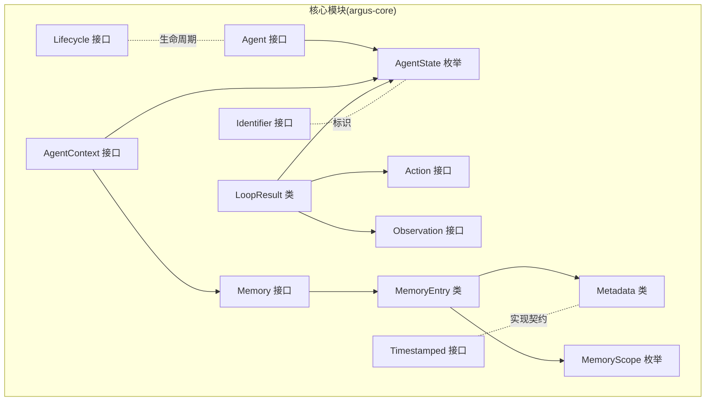
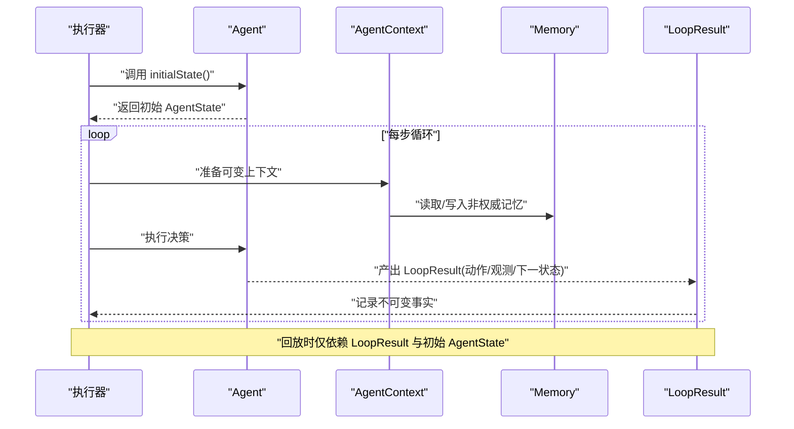
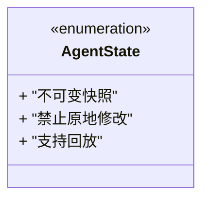
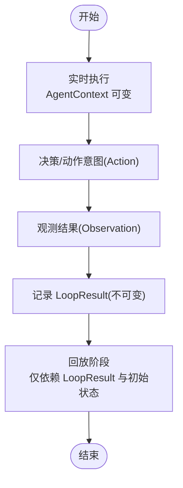
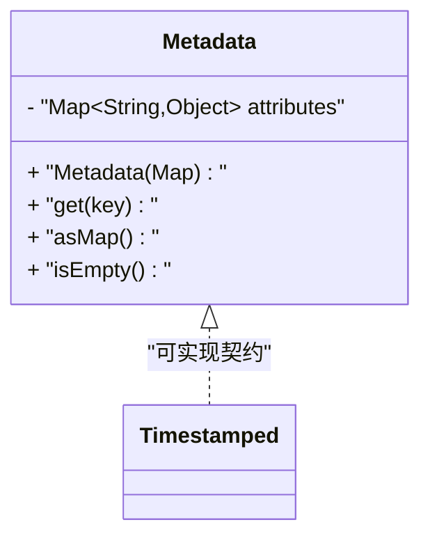
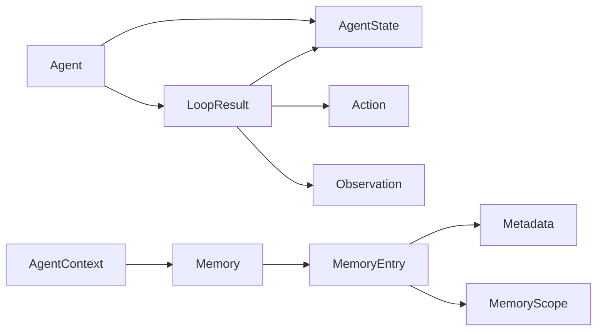
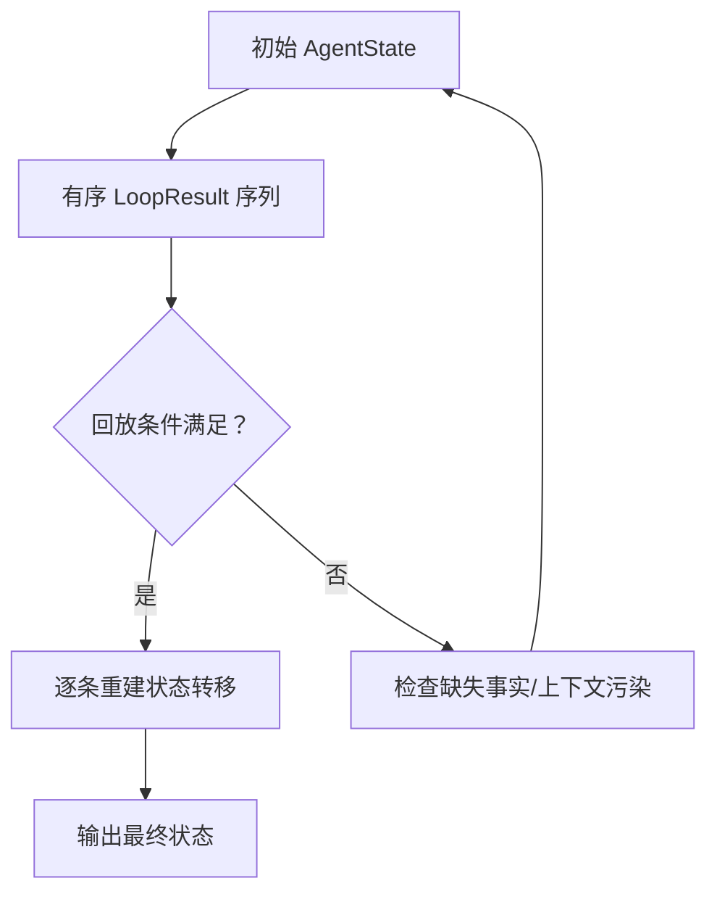

# 不可变性设计原则

<cite>
**本文引用的文件**
- [AgentState.java](file://argus-core/src/main/java/io/argus/core/agent/AgentState.java)
- [LoopResult.java](file://argus-core/src/main/java/io/argus/core/agent/LoopResult.java)
- [AgentContext.java](file://argus-core/src/main/java/io/argus/core/agent/AgentContext.java)
- [MemoryEntry.java](file://argus-core/src/main/java/io/argus/core/memory/MemoryEntry.java)
- [Metadata.java](file://argus-core/src/main/java/io/argus/core/model/Metadata.java)
- [Timestamped.java](file://argus-core/src/main/java/io/argus/core/model/Timestamped.java)
- [Memory.java](file://argus-core/src/main/java/io/argus/core/memory/Memory.java)
- [MemoryScope.java](file://argus-core/src/main/java/io/argus/core/memory/MemoryScope.java)
- [Action.java](file://argus-core/src/main/java/io/argus/core/action/Action.java)
- [Observation.java](file://argus-core/src/main/java/io/argus/core/observation/Observation.java)
- [Lifecycle.java](file://argus-core/src/main/java/io/argus/core/lifecycle/Lifecycle.java)
- [Identifier.java](file://argus-core/src/main/java/io/argus/core/model/Identifier.java)
- [readme.md](file://readme.md)
</cite>

## 目录
1. [引言](#引言)
2. [项目结构](#项目结构)
3. [核心组件](#核心组件)
4. [架构总览](#架构总览)
5. [详细组件分析](#详细组件分析)
6. [依赖关系分析](#依赖关系分析)
7. [性能考量](#性能考量)
8. [故障排查指南](#故障排查指南)
9. [结论](#结论)
10. [附录](#附录)

## 引言
本文件系统性阐述Argus框架中的不可变性设计原则及其在并发与分布式系统中的价值。通过对AgentState、LoopResult、MemoryEntry、Metadata等关键构件的深入分析，说明不可变对象如何确保数据一致性、线程安全与可审计性；同时给出可变与不可变设计的对比思路，帮助读者在工程实践中权衡取舍。

## 项目结构
Argus采用模块化组织，核心能力集中在argus-core模块，围绕Agent、Action、Observation、Memory、Audit等子系统构建。不可变性贯穿状态与事实记录层，确保可复现与可审计。



图表来源
- [Agent.java](file://argus-core/src/main/java/io/argus/core/agent/Agent.java#L1-L11)
- [AgentState.java](file://argus-core/src/main/java/io/argus/core/agent/AgentState.java#L1-L81)
- [AgentContext.java](file://argus-core/src/main/java/io/argus/core/agent/AgentContext.java#L1-L98)
- [LoopResult.java](file://argus-core/src/main/java/io/argus/core/agent/LoopResult.java#L1-L115)
- [Memory.java](file://argus-core/src/main/java/io/argus/core/memory/Memory.java#L1-L15)
- [MemoryEntry.java](file://argus-core/src/main/java/io/argus/core/memory/MemoryEntry.java#L1-L53)
- [MemoryScope.java](file://argus-core/src/main/java/io/argus/core/memory/MemoryScope.java#L1-L8)
- [Metadata.java](file://argus-core/src/main/java/io/argus/core/model/Metadata.java#L1-L34)
- [Timestamped.java](file://argus-core/src/main/java/io/argus/core/model/Timestamped.java#L1-L8)
- [Action.java](file://argus-core/src/main/java/io/argus/core/action/Action.java#L1-L43)
- [Observation.java](file://argus-core/src/main/java/io/argus/core/observation/Observation.java#L1-L37)
- [Lifecycle.java](file://argus-core/src/main/java/io/argus/core/lifecycle/Lifecycle.java#L1-L8)
- [Identifier.java](file://argus-core/src/main/java/io/argus/core/model/Identifier.java#L1-L8)

章节来源
- [readme.md](file://readme.md#L1-L28)

## 核心组件
- 不可变状态载体：AgentState、LoopResult、MemoryEntry、Metadata
- 可变执行上下文：AgentContext（仅在实时执行期存在）
- 事实与意图模型：Action、Observation
- 记忆与范围：Memory、MemoryEntry、MemoryScope
- 时间戳契约：Timestamped（接口占位）

这些组件共同构成“不可变事实 + 可变上下文”的边界，确保回放与审计的确定性。

章节来源
- [AgentState.java](file://argus-core/src/main/java/io/argus/core/agent/AgentState.java#L1-L81)
- [LoopResult.java](file://argus-core/src/main/java/io/argus/core/agent/LoopResult.java#L1-L115)
- [AgentContext.java](file://argus-core/src/main/java/io/argus/core/agent/AgentContext.java#L1-L98)
- [MemoryEntry.java](file://argus-core/src/main/java/io/argus/core/memory/MemoryEntry.java#L1-L53)
- [Metadata.java](file://argus-core/src/main/java/io/argus/core/model/Metadata.java#L1-L34)
- [Action.java](file://argus-core/src/main/java/io/argus/core/action/Action.java#L1-L43)
- [Observation.java](file://argus-core/src/main/java/io/argus/core/observation/Observation.java#L1-L37)
- [Memory.java](file://argus-core/src/main/java/io/argus/core/memory/Memory.java#L1-L15)
- [MemoryScope.java](file://argus-core/src/main/java/io/argus/core/memory/MemoryScope.java#L1-L8)
- [Timestamped.java](file://argus-core/src/main/java/io/argus/core/model/Timestamped.java#L1-L8)

## 架构总览
Argus通过“不可变事实 + 可变上下文”的分层，实现可复现、可审计与可调试：



图表来源
- [Agent.java](file://argus-core/src/main/java/io/argus/core/agent/Agent.java#L1-L11)
- [AgentContext.java](file://argus-core/src/main/java/io/argus/core/agent/AgentContext.java#L1-L98)
- [LoopResult.java](file://argus-core/src/main/java/io/argus/core/agent/LoopResult.java#L1-L115)
- [Memory.java](file://argus-core/src/main/java/io/argus/core/memory/Memory.java#L1-L15)

## 详细组件分析

### AgentState：不可变状态快照
- 设计理念
  - 代表Agent在某一步结束后的完整逻辑快照，不依赖历史状态即可解释
  - 任何状态迁移必须产生新实例，禁止原地修改
  - 支持确定性回放、时间旅行调试、状态分叉与分支、可审计执行历史
- 不可变性保障
  - 使用枚举类型，天然不可变
  - 通过注释与契约约束，明确禁止暴露修改器方法
- 回放与执行
  - 实时执行期表示当前工作状态
  - 回放期仅从已记录的LoopResult重建，不依赖外部系统或全局状态
- 结构相等性
  - 建议实现结构相等，但不能依赖对象身份



图表来源
- [AgentState.java](file://argus-core/src/main/java/io/argus/core/agent/AgentState.java#L1-L81)

章节来源
- [AgentState.java](file://argus-core/src/main/java/io/argus/core/agent/AgentState.java#L1-L81)

### LoopResult：单步执行的不可变事实
- 设计理念
  - 最小权威记录：动作意图、观测结果、状态转移
  - 不可变、自包含、足以确定性回放
- 回放契约
  - 给定相同初始AgentState与有序LoopResult序列，必须能重现相同状态转移
  - 回放必须被动、无引用透明性，不得重新触发外部副作用
- 数据结构
  - 包含Action、Observation、AgentState（下一状态），均不可变
- 与AgentState的关系
  - 每次循环产出一个LoopResult，其中nextState即为下一轮的AgentState

```mermaid
classDiagram
class LoopResult {
- "Action action"
- "Observation observation"
- "AgentState nextState"
+ "getAction()"
+ "getObservation()"
+ "getNextState()"
}
LoopResult --> "Action"
LoopResult --> "Observation"
LoopResult --> "AgentState"
```

图表来源
- [LoopResult.java](file://argus-core/src/main/java/io/argus/core/agent/LoopResult.java#L1-L115)

章节来源
- [LoopResult.java](file://argus-core/src/main/java/io/argus/core/agent/LoopResult.java#L1-L115)

### AgentContext：可变执行上下文
- 设计理念
  - 仅在实时执行期存在，用于推理、协调与外部系统集成
  - 明确可变性：允许setter、可变集合、缓存与集成句柄
- 边界与责任
  - 严格区分：AgentState（不可变、可回放、可审计）与AgentContext（可变、短暂、仅执行期）
  - 决策关键信息必须进入AgentState或LoopResult，否则破坏回放保证
- 回放限制
  - 回放不得依赖上下文中存储的值，上下文在回放时可为空或替换为无操作实现



图表来源
- [AgentContext.java](file://argus-core/src/main/java/io/argus/core/agent/AgentContext.java#L1-L98)

章节来源
- [AgentContext.java](file://argus-core/src/main/java/io/argus/core/agent/AgentContext.java#L1-L98)

### MemoryEntry：内存条目的不可变设计
- 设计要点
  - final字段：id、scope、value、metadata、timestamp
  - 仅提供getter，无setter，构造后不可变
- 与Metadata的组合
  - Metadata内部使用不可变Map，避免外部污染
- 时间戳模型
  - 通过long型timestamp承载时间戳，便于排序与审计
- 适用场景
  - 非权威记忆回溯、快速检索、审计与调试

```mermaid
classDiagram
class MemoryEntry {
- "String id"
- "MemoryScope scope"
- "Object value"
- "Metadata metadata"
- "long timestamp"
+ "getId()"
+ "getScope()"
+ "getValue()"
+ "getMetadata()"
+ "getTimestamp()"
}
MemoryEntry --> "Metadata"
MemoryEntry --> "MemoryScope"
```

图表来源
- [MemoryEntry.java](file://argus-core/src/main/java/io/argus/core/memory/MemoryEntry.java#L1-L53)
- [Metadata.java](file://argus-core/src/main/java/io/argus/core/model/Metadata.java#L1-L34)
- [MemoryScope.java](file://argus-core/src/main/java/io/argus/core/memory/MemoryScope.java#L1-L8)

章节来源
- [MemoryEntry.java](file://argus-core/src/main/java/io/argus/core/memory/MemoryEntry.java#L1-L53)
- [Metadata.java](file://argus-core/src/main/java/io/argus/core/model/Metadata.java#L1-L34)
- [MemoryScope.java](file://argus-core/src/main/java/io/argus/core/memory/MemoryScope.java#L1-L8)

### Metadata：不可变元数据
- 设计要点
  - 构造时将传入Map包装为不可变Map，防止外部修改
  - 提供Optional读取与只读视图，避免副作用
- 与Timestamped的契约
  - Timestamped为时间戳契约接口，Metadata可作为其实现载体（如需扩展）



图表来源
- [Metadata.java](file://argus-core/src/main/java/io/argus/core/model/Metadata.java#L1-L34)
- [Timestamped.java](file://argus-core/src/main/java/io/argus/core/model/Timestamped.java#L1-L8)

章节来源
- [Metadata.java](file://argus-core/src/main/java/io/argus/core/model/Metadata.java#L1-L34)
- [Timestamped.java](file://argus-core/src/main/java/io/argus/core/model/Timestamped.java#L1-L8)

### Action 与 Observation：不可变意图与事实
- Action
  - 仅表达意图，不包含执行逻辑
  - 通过ActionType分类，Metadata承载领域信息
- Observation
  - 表达客观事实，不包含决策指令
  - 通过ObservationType分类，Metadata承载上下文

```mermaid
classDiagram
class Action {
+ "getType()"
+ "getMetadata()"
}
class Observation {
+ "getType()"
+ "getMetadata()"
}
Action <|.. "不可变"
Observation <|.. "不可变"
```

图表来源
- [Action.java](file://argus-core/src/main/java/io/argus/core/action/Action.java#L1-L43)
- [Observation.java](file://argus-core/src/main/java/io/argus/core/observation/Observation.java#L1-L37)

章节来源
- [Action.java](file://argus-core/src/main/java/io/argus/core/action/Action.java#L1-L43)
- [Observation.java](file://argus-core/src/main/java/io/argus/core/observation/Observation.java#L1-L37)

### Memory 与 MemoryScope：记忆接口与范围
- Memory接口
  - store(MemoryEntry)：持久化不可变记忆条目
  - recall(MemoryScope)：按作用域召回
- MemoryScope
  - 枚举定义记忆范围，配合MemoryEntry的scope字段使用

```mermaid
classDiagram
class Memory {
+ "store(entry)"
+ "recall(scope)"
}
class MemoryScope {
<<enumeration>>
}
Memory --> "MemoryEntry"
MemoryEntry --> "MemoryScope"
```

图表来源
- [Memory.java](file://argus-core/src/main/java/io/argus/core/memory/Memory.java#L1-L15)
- [MemoryEntry.java](file://argus-core/src/main/java/io/argus/core/memory/MemoryEntry.java#L1-L53)
- [MemoryScope.java](file://argus-core/src/main/java/io/argus/core/memory/MemoryScope.java#L1-L8)

章节来源
- [Memory.java](file://argus-core/src/main/java/io/argus/core/memory/Memory.java#L1-L15)
- [MemoryEntry.java](file://argus-core/src/main/java/io/argus/core/memory/MemoryEntry.java#L1-L53)
- [MemoryScope.java](file://argus-core/src/main/java/io/argus/core/memory/MemoryScope.java#L1-L8)

## 依赖关系分析
- 不可变事实链路
  - Agent通过initialState()提供初始AgentState
  - 每步执行产出LoopResult，其中包含Action、Observation与下一AgentState
  - 回放阶段仅依赖LoopResult与初始AgentState重建
- 上下文与事实分离
  - AgentContext仅在实时执行期存在，不参与回放
  - 决策关键信息必须进入AgentState或LoopResult
- 记忆与审计
  - MemoryEntry不可变，结合Metadata与timestamp，支撑审计与排序



图表来源
- [Agent.java](file://argus-core/src/main/java/io/argus/core/agent/Agent.java#L1-L11)
- [AgentState.java](file://argus-core/src/main/java/io/argus/core/agent/AgentState.java#L1-L81)
- [LoopResult.java](file://argus-core/src/main/java/io/argus/core/agent/LoopResult.java#L1-L115)
- [Action.java](file://argus-core/src/main/java/io/argus/core/action/Action.java#L1-L43)
- [Observation.java](file://argus-core/src/main/java/io/argus/core/observation/Observation.java#L1-L37)
- [AgentContext.java](file://argus-core/src/main/java/io/argus/core/agent/AgentContext.java#L1-L98)
- [Memory.java](file://argus-core/src/main/java/io/argus/core/memory/Memory.java#L1-L15)
- [MemoryEntry.java](file://argus-core/src/main/java/io/argus/core/memory/MemoryEntry.java#L1-L53)
- [Metadata.java](file://argus-core/src/main/java/io/argus/core/model/Metadata.java#L1-L34)
- [MemoryScope.java](file://argus-core/src/main/java/io/argus/core/memory/MemoryScope.java#L1-L8)

## 性能考量
- 对象创建成本
  - 不可变对象每次状态变更需创建新实例，可能带来GC压力
  - 建议：对热点路径采用“写时复制”策略或共享不可变片段，减少拷贝
- 并发访问
  - 不可变对象天然线程安全，避免锁竞争
  - 适合高并发与多核场景，降低同步开销
- 序列化与传输
  - 不可变对象更适合缓存、日志与跨进程传输，减少一致性校验成本
- 回放与审计
  - 不可变事实链路简化了重放与审计，避免复杂的状态恢复逻辑

## 故障排查指南
- 回放失败
  - 检查是否将决策关键信息放入AgentState或LoopResult
  - 确认AgentContext未隐藏副作用或状态
- 线程安全问题
  - 若出现竞态，确认共享对象是否为不可变；若为可变，考虑加锁或改用不可变方案
- 审计缺失
  - 确保所有事实（Observation）与动作（Action）均被记录为LoopResult
  - MemoryEntry的timestamp与metadata应完整记录
- 性能瓶颈
  - 关注不可变对象频繁创建导致的GC压力，评估共享不可变片段策略

## 结论
Argus通过“不可变事实 + 可变上下文”的清晰边界，实现了可复现、可审计与可调试的运行时模型。不可变性在并发与分布式系统中尤为宝贵：它消除了锁与竞态，简化了状态管理与调试，提升了系统的可靠性与可维护性。在工程实践中，建议优先采用不可变对象承载权威状态与事实，仅在执行期上下文中保留必要的可变组件。

## 附录

### 不可变性设计对比（思路示例）
- 可变设计
  - 状态字段可直接修改，状态迁移通过原地更新
  - 并发环境下易出现竞态，调试困难
- 不可变设计
  - 状态迁移产生新实例，旧状态保持不变
  - 天然线程安全，便于回放与审计
- 在Argus中的体现
  - AgentState、LoopResult、MemoryEntry、Metadata均为不可变
  - AgentContext为可变，仅限实时执行期使用

### 关键流程图：回放契约


图表来源
- [LoopResult.java](file://argus-core/src/main/java/io/argus/core/agent/LoopResult.java#L1-L115)
- [AgentState.java](file://argus-core/src/main/java/io/argus/core/agent/AgentState.java#L1-L81)