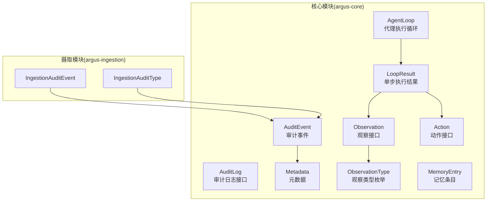
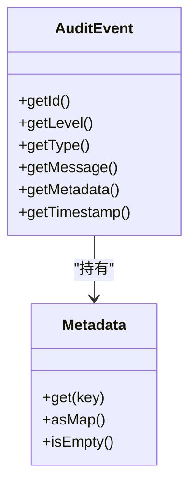
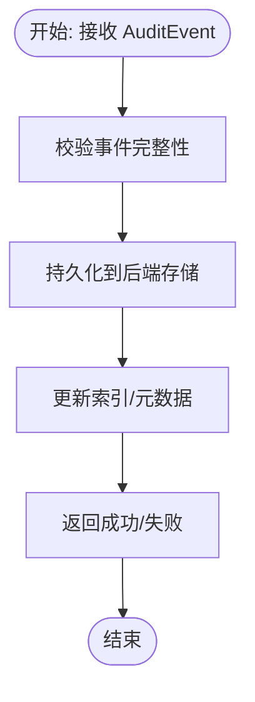
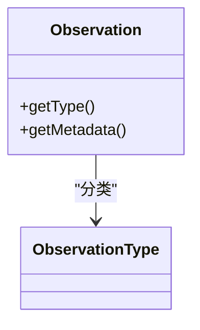
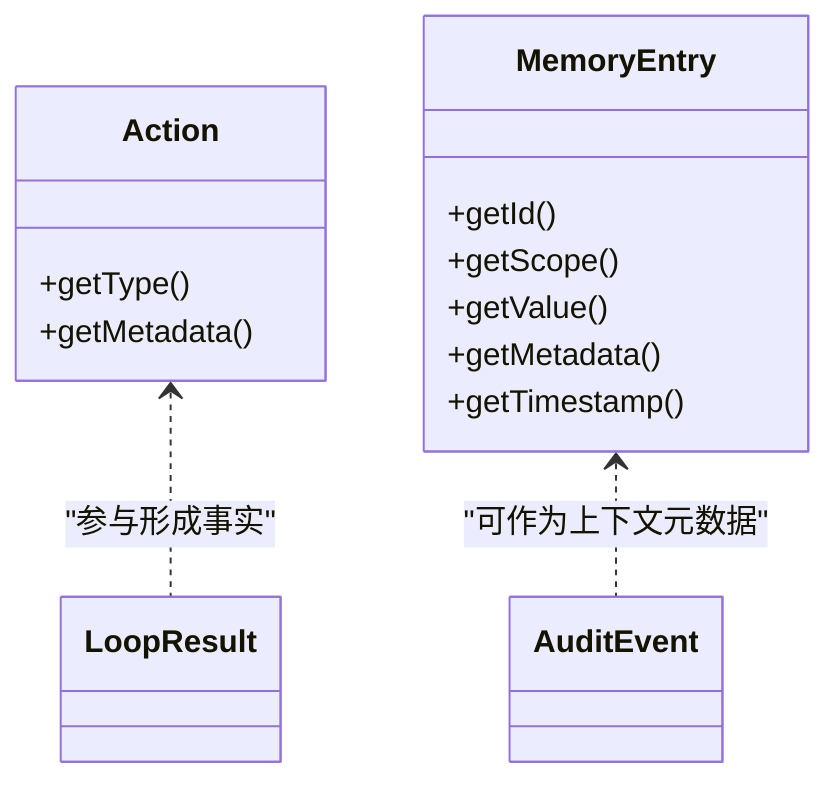
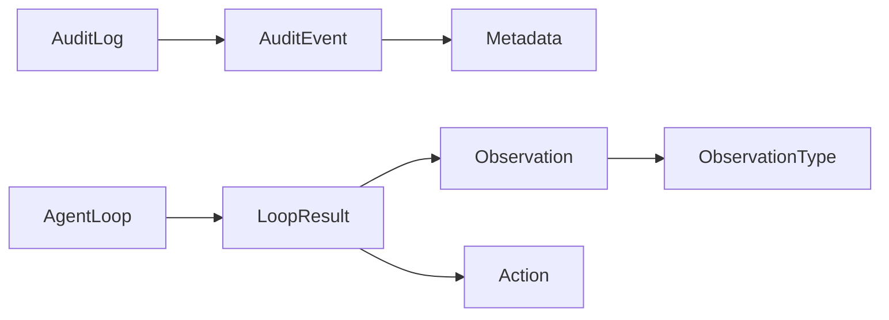

# 可审计性设计

<cite>
**本文引用的文件**
- [AuditEvent.java](file://argus-core/src/main/java/io/argus/core/audit/AuditEvent.java)
- [AuditLevel.java](file://argus-core/src/main/java/io/argus/core/audit/AuditLevel.java)
- [AuditLog.java](file://argus-core/src/main/java/io/argus/core/audit/AuditLog.java)
- [Metadata.java](file://argus-core/src/main/java/io/argus/core/model/Metadata.java)
- [Observation.java](file://argus-core/src/main/java/io/argus/core/observation/Observation.java)
- [ObservationType.java](file://argus-core/src/main/java/io/argus/core/observation/ObservationType.java)
- [AgentLoop.java](file://argus-core/src/main/java/io/argus/core/agent/AgentLoop.java)
- [LoopResult.java](file://argus-core/src/main/java/io/argus/core/agent/LoopResult.java)
- [Action.java](file://argus-core/src/main/java/io/argus/core/action/Action.java)
- [MemoryEntry.java](file://argus-core/src/main/java/io/argus/core/memory/MemoryEntry.java)
- [IngestionAuditEvent.java](file://argus-ingestion/src/main/java/io/argus/ingestion/audit/IngestionAuditEvent.java)
- [IngestionAuditType.java](file://argus-ingestion/src/main/java/io/argus/ingestion/audit/IngestionAuditType.java)
- [readme.md](file://readme.md)
</cite>

## 目录
1. [引言](#引言)
2. [项目结构](#项目结构)
3. [核心组件](#核心组件)
4. [架构总览](#架构总览)
5. [详细组件分析](#详细组件分析)
6. [依赖关系分析](#依赖关系分析)
7. [性能考量](#性能考量)
8. [故障排查指南](#故障排查指南)
9. [结论](#结论)
10. [附录](#附录)

## 引言
本文件系统化阐述 ARGUS 项目的可审计性设计，重点解释可审计性在 AI 代理系统中的意义：透明、可追溯、可复现、可控制。围绕审计事件结构、审计日志接口、观察模型与事实性记录的关系，给出可操作的设计与实现建议，并结合企业级合规场景说明其价值。

## 项目结构
ARGUS 采用模块化组织，核心审计与可追溯能力集中在 argus-core 模块；网络数据摄取能力在 argus-ingestion 模块中体现。整体设计强调“审计即一等公民”，将审计事件与执行事实（Observation）统一建模，便于回放与分析。



图表来源
- [AuditEvent.java](file://argus-core/src/main/java/io/argus/core/audit/AuditEvent.java#L1-L60)
- [AuditLog.java](file://argus-core/src/main/java/io/argus/core/audit/AuditLog.java#L1-L11)
- [Metadata.java](file://argus-core/src/main/java/io/argus/core/model/Metadata.java#L1-L34)
- [Observation.java](file://argus-core/src/main/java/io/argus/core/observation/Observation.java#L1-L37)
- [ObservationType.java](file://argus-core/src/main/java/io/argus/core/observation/ObservationType.java#L1-L117)
- [AgentLoop.java](file://argus-core/src/main/java/io/argus/core/agent/AgentLoop.java#L1-L118)
- [LoopResult.java](file://argus-core/src/main/java/io/argus/core/agent/LoopResult.java#L1-L115)
- [Action.java](file://argus-core/src/main/java/io/argus/core/action/Action.java#L1-L43)
- [MemoryEntry.java](file://argus-core/src/main/java/io/argus/core/memory/MemoryEntry.java#L1-L53)
- [IngestionAuditEvent.java](file://argus-ingestion/src/main/java/io/argus/ingestion/audit/IngestionAuditEvent.java#L1-L8)
- [IngestionAuditType.java](file://argus-ingestion/src/main/java/io/argus/ingestion/audit/IngestionAuditType.java#L1-L8)

章节来源
- [readme.md](file://readme.md#L1-L28)

## 核心组件
- 审计事件 AuditEvent：不可变的事实载体，包含标识、级别、类型、消息、元数据与时间戳，用于结构化记录代理行为与系统状态。
- 审计日志接口 AuditLog：定义统一的记录契约，具体实现可对接数据库、流式存储或文件系统。
- 元数据 Metadata：不可变键值容器，承载上下文与领域特定信息，避免在类型枚举中膨胀。
- 观察模型 Observation/ObservationType：将代理感知到的事实进行语义分类（内部状态、数据、响应、错误、外部事件），确保执行过程可追溯。
- 代理执行循环 AgentLoop 与单步结果 LoopResult：定义原子决策周期，保证每一步都可观测、可审计、可回放。
- 动作 Action：表达代理意图，与 Observation 一起构成 LoopResult 的权威事实记录。
- 记忆 MemoryEntry：持久化或缓存执行上下文，配合审计事件形成完整证据链。

章节来源
- [AuditEvent.java](file://argus-core/src/main/java/io/argus/core/audit/AuditEvent.java#L1-L60)
- [AuditLog.java](file://argus-core/src/main/java/io/argus/core/audit/AuditLog.java#L1-L11)
- [Metadata.java](file://argus-core/src/main/java/io/argus/core/model/Metadata.java#L1-L34)
- [Observation.java](file://argus-core/src/main/java/io/argus/core/observation/Observation.java#L1-L37)
- [ObservationType.java](file://argus-core/src/main/java/io/argus/core/observation/ObservationType.java#L1-L117)
- [AgentLoop.java](file://argus-core/src/main/java/io/argus/core/agent/AgentLoop.java#L1-L118)
- [LoopResult.java](file://argus-core/src/main/java/io/argus/core/agent/LoopResult.java#L1-L115)
- [Action.java](file://argus-core/src/main/java/io/argus/core/action/Action.java#L1-L43)
- [MemoryEntry.java](file://argus-core/src/main/java/io/argus/core/memory/MemoryEntry.java#L1-L53)

## 架构总览
下图展示了从代理执行到审计记录的关键交互路径，强调“事实先行”的设计：AgentLoop 的每一步产出 LoopResult，其中包含 Action 与 Observation；同时，系统在关键节点生成审计事件，最终由 AuditLog 统一落盘。

```mermaid
sequenceDiagram
participant Agent as "代理(Agent)"
participant Loop as "执行循环(AgentLoop)"
participant Step as "单步(LoopResult)"
participant Act as "动作(Action)"
participant Obs as "观察(Observation)"
participant Log as "审计日志(AuditLog)"
Agent->>Loop : "请求执行"
Loop->>Step : "step(context)"
Step-->>Loop : "返回 LoopResult"
Loop-->>Agent : "推进状态"
Note over Step,Obs : "LoopResult 包含 Action 与 Observation"
Step->>Act : "读取 Action"
Step->>Obs : "读取 Observation"
Agent->>Log : "record(AuditEvent)"
Log-->>Agent : "确认落盘"
```

图表来源
- [AgentLoop.java](file://argus-core/src/main/java/io/argus/core/agent/AgentLoop.java#L49-L118)
- [LoopResult.java](file://argus-core/src/main/java/io/argus/core/agent/LoopResult.java#L78-L115)
- [Action.java](file://argus-core/src/main/java/io/argus/core/action/Action.java#L37-L43)
- [Observation.java](file://argus-core/src/main/java/io/argus/core/observation/Observation.java#L31-L37)
- [AuditLog.java](file://argus-core/src/main/java/io/argus/core/audit/AuditLog.java#L7-L11)

## 详细组件分析

### 审计事件 AuditEvent
- 结构要点
  - 不可变字段：id、level、type、message、metadata、timestamp
  - 仅提供 getter，保证线程安全与可回放性
- 作用机制
  - 将代理行为与系统状态转换为结构化事实，便于检索、聚合与回放
  - 通过 metadata 承载上下文，避免在类型枚举中引入冗余维度
- 复杂度与性能
  - 字段访问 O(1)，序列化开销低，适合高频记录
- 使用建议
  - 为每个关键决策点生成独立 AuditEvent，确保原子性
  - 使用稳定的时间戳与全局唯一 id，便于排序与关联



图表来源
- [AuditEvent.java](file://argus-core/src/main/java/io/argus/core/audit/AuditEvent.java#L9-L60)
- [Metadata.java](file://argus-core/src/main/java/io/argus/core/model/Metadata.java#L12-L34)

章节来源
- [AuditEvent.java](file://argus-core/src/main/java/io/argus/core/audit/AuditEvent.java#L1-L60)
- [Metadata.java](file://argus-core/src/main/java/io/argus/core/model/Metadata.java#L1-L34)

### 审计日志接口 AuditLog
- 职责
  - 定义 record(AuditEvent) 契约，屏蔽底层存储细节
- 实现策略
  - 文件系统：按天分片、压缩归档、索引元数据
  - 数据库：列式存储、分区表、二级索引（id、type、level）
  - 流式存储：Kafka/RocketMQ，结合消费者构建实时分析
- 查询机制
  - 支持按 id、type、level、时间窗口、元数据过滤
  - 提供聚合接口：事件计数、错误率、耗时分布



图表来源
- [AuditLog.java](file://argus-core/src/main/java/io/argus/core/audit/AuditLog.java#L7-L11)

章节来源
- [AuditLog.java](file://argus-core/src/main/java/io/argus/core/audit/AuditLog.java#L1-L11)

### 观察模型 Observation 与分类
- 观察接口
  - 提供 getType() 与 getMetadata()，确保事实性与不可变性
- 观察类型枚举
  - STATE：内部状态/生命周期变更
  - DATA：原始或结构化数据
  - RESPONSE：对外部系统调用的反馈
  - ERROR：失败或异常状态
  - EVENT：外部异步事件
- 与审计的关系
  - Observation 作为 LoopResult 的一部分，天然具备可审计性
  - 结合 AuditEvent 可形成“意图-事实-状态”的完整证据链



图表来源
- [Observation.java](file://argus-core/src/main/java/io/argus/core/observation/Observation.java#L31-L37)
- [ObservationType.java](file://argus-core/src/main/java/io/argus/core/observation/ObservationType.java#L18-L117)

章节来源
- [Observation.java](file://argus-core/src/main/java/io/argus/core/observation/Observation.java#L1-L37)
- [ObservationType.java](file://argus-core/src/main/java/io/argus/core/observation/ObservationType.java#L1-L117)

### 代理执行循环与可审计性
- AgentLoop.step(context) 定义原子决策周期：评估上下文、产生 Action、接收 Observation、状态转移
- LoopResult 作为权威事实载体，不可变且自包含，支持确定性回放
- 回放语义
  - 给定相同初始状态与有序 LoopResult 序列，可重现状态转移
  - 回放应无副作用，保持参照透明

```mermaid
sequenceDiagram
participant Ctx as "上下文(AgentContext)"
participant Loop as "AgentLoop"
participant Res as "LoopResult"
Loop->>Ctx : "读取当前状态/输入"
Loop->>Res : "执行一步决策"
Res-->>Loop : "返回 Action + Observation + NextState"
Loop-->>Ctx : "推进状态"
```

图表来源
- [AgentLoop.java](file://argus-core/src/main/java/io/argus/core/agent/AgentLoop.java#L49-L118)
- [LoopResult.java](file://argus-core/src/main/java/io/argus/core/agent/LoopResult.java#L78-L115)

章节来源
- [AgentLoop.java](file://argus-core/src/main/java/io/argus/core/agent/AgentLoop.java#L1-L118)
- [LoopResult.java](file://argus-core/src/main/java/io/argus/core/agent/LoopResult.java#L1-L115)

### 动作 Action 与记忆 MemoryEntry
- Action：表达代理意图，不包含执行逻辑，与 Observation 一起构成 LoopResult 的事实基础
- MemoryEntry：记录带元数据的记忆条目，可与审计事件关联，形成上下文证据链



图表来源
- [Action.java](file://argus-core/src/main/java/io/argus/core/action/Action.java#L37-L43)
- [MemoryEntry.java](file://argus-core/src/main/java/io/argus/core/memory/MemoryEntry.java#L9-L53)
- [AuditEvent.java](file://argus-core/src/main/java/io/argus/core/audit/AuditEvent.java#L9-L60)

章节来源
- [Action.java](file://argus-core/src/main/java/io/argus/core/action/Action.java#L1-L43)
- [MemoryEntry.java](file://argus-core/src/main/java/io/argus/core/memory/MemoryEntry.java#L1-L53)

### 摄取模块的审计扩展
- IngestionAuditEvent 与 IngestionAuditType 作为摄取流程的审计扩展点，可复用核心审计模型
- 建议在抓取、解析、策略执行等关键阶段生成审计事件，确保数据来源可追溯

章节来源
- [IngestionAuditEvent.java](file://argus-ingestion/src/main/java/io/argus/ingestion/audit/IngestionAuditEvent.java#L1-L8)
- [IngestionAuditType.java](file://argus-ingestion/src/main/java/io/argus/ingestion/audit/IngestionAuditType.java#L1-L8)

## 依赖关系分析
- AuditEvent 依赖 Metadata，确保审计事件可携带丰富上下文
- Observation 依赖 ObservationType 与 Metadata，统一事实分类与语义
- AgentLoop 产出 LoopResult，其中包含 Action 与 Observation，天然满足可审计性
- AuditLog 作为抽象接口，解耦审计事件的存储与查询实现



图表来源
- [AuditEvent.java](file://argus-core/src/main/java/io/argus/core/audit/AuditEvent.java#L3-L60)
- [Metadata.java](file://argus-core/src/main/java/io/argus/core/model/Metadata.java#L12-L34)
- [Observation.java](file://argus-core/src/main/java/io/argus/core/observation/Observation.java#L31-L37)
- [ObservationType.java](file://argus-core/src/main/java/io/argus/core/observation/ObservationType.java#L18-L117)
- [AgentLoop.java](file://argus-core/src/main/java/io/argus/core/agent/AgentLoop.java#L49-L118)
- [LoopResult.java](file://argus-core/src/main/java/io/argus/core/agent/LoopResult.java#L78-L115)
- [Action.java](file://argus-core/src/main/java/io/argus/core/action/Action.java#L37-L43)
- [AuditLog.java](file://argus-core/src/main/java/io/argus/core/audit/AuditLog.java#L7-L11)

## 性能考量
- 事件体积控制：AuditEvent 字段精简，metadata 使用不可变 Map，避免频繁拷贝
- 存储选择：高频审计事件可采用列式存储或时序数据库，优化查询与压缩
- 批量写入：AuditLog 实现可批量提交，降低 IO 压力
- 索引策略：按 type、level、时间窗口建立复合索引，提升检索效率
- 回放稳定性：回放过程避免随机性与外部副作用，确保确定性

## 故障排查指南
- 审计事件缺失
  - 检查 AgentLoop.step 是否正确产出 LoopResult
  - 确认 AuditLog.record 是否被调用且未抛出异常
- 查询结果异常
  - 核对时间戳与 id 唯一性，确保排序与过滤条件正确
  - 检查 metadata 的键名与类型一致性
- 回放不一致
  - 确保 LoopResult 序列完整且顺序正确
  - 排查外部系统依赖与随机因素

## 结论
ARGUS 的可审计性设计以“事实优先”为核心：通过 Observation 与 LoopResult 构建执行事实，以 AuditEvent 与 AuditLog 记录结构化审计证据，辅以 Metadata 提供上下文。该设计既满足企业级合规与审计需求，又保持系统可扩展与高性能。

## 附录

### 审计级别与事件记录格式（建议）
- 审计级别（建议）
  - INFO：常规执行事实（如状态切换、数据获取完成）
  - WARN：潜在风险或异常但未失败（如重试、限流触发）
  - ERROR：明确失败或异常（如超时、解析失败）
  - FATAL：严重故障（如系统不可用）
- 事件记录格式（建议）
  - id：全局唯一标识
  - level：审计级别
  - type：事件类型（如 STATE/RESPONSE/DATA/ERROR/EVENT 或摄取专用类型）
  - message：人类可读描述
  - metadata：键值对上下文
  - timestamp：毫秒级时间戳

章节来源
- [AuditEvent.java](file://argus-core/src/main/java/io/argus/core/audit/AuditEvent.java#L9-L60)
- [AuditLevel.java](file://argus-core/src/main/java/io/argus/core/audit/AuditLevel.java#L1-L8)
- [Metadata.java](file://argus-core/src/main/java/io/argus/core/model/Metadata.java#L12-L34)
- [ObservationType.java](file://argus-core/src/main/java/io/argus/core/observation/ObservationType.java#L18-L117)

### 代码示例路径（不含具体代码内容）
- 正常执行审计记录
  - 在 AgentLoop.step 后，构造并记录 AuditEvent 至 AuditLog
  - 示例路径参考：[AgentLoop.java](file://argus-core/src/main/java/io/argus/core/agent/AgentLoop.java#L89-L89)、[AuditEvent.java](file://argus-core/src/main/java/io/argus/core/audit/AuditEvent.java#L18-L32)、[AuditLog.java](file://argus-core/src/main/java/io/argus/core/audit/AuditLog.java#L9-L9)
- 异常情况审计处理
  - 在捕获异常时，构造 ERROR/FATAL 级别 AuditEvent 并记录
  - 示例路径参考：[ObservationType.java](file://argus-core/src/main/java/io/argus/core/observation/ObservationType.java#L77-L95)、[AuditEvent.java](file://argus-core/src/main/java/io/argus/core/audit/AuditEvent.java#L18-L32)、[AuditLog.java](file://argus-core/src/main/java/io/argus/core/audit/AuditLog.java#L9-L9)

### 企业级价值与合规要求
- 价值
  - 透明性：可追踪代理决策与执行路径
  - 合规性：满足监管对可审计性的要求（如金融、医疗、政府）
  - 运维效率：快速定位问题根因，支持回放与演练
- 合规建议
  - 保留完整的审计事件生命周期（生成、存储、查询、归档）
  - 对敏感 metadata 进行脱敏或加密
  - 建立审计事件的保留策略与访问权限控制