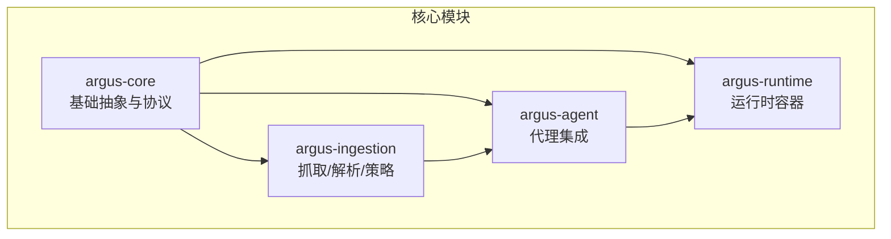
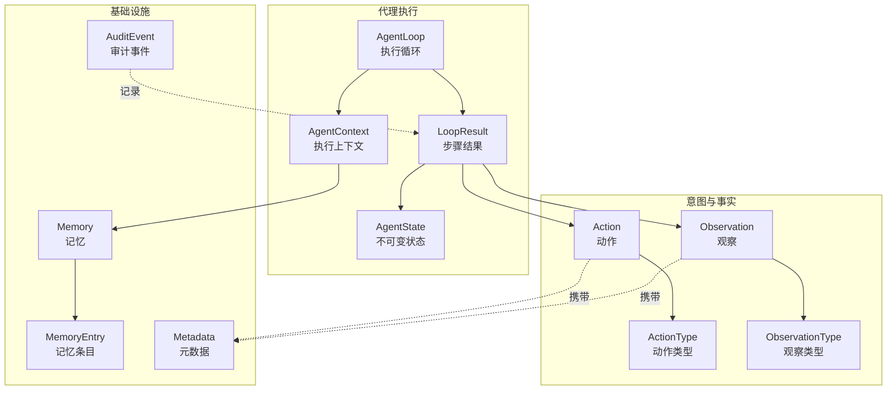
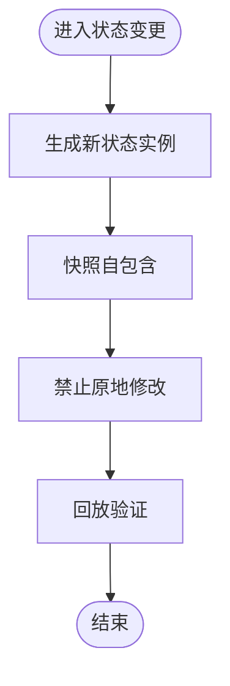
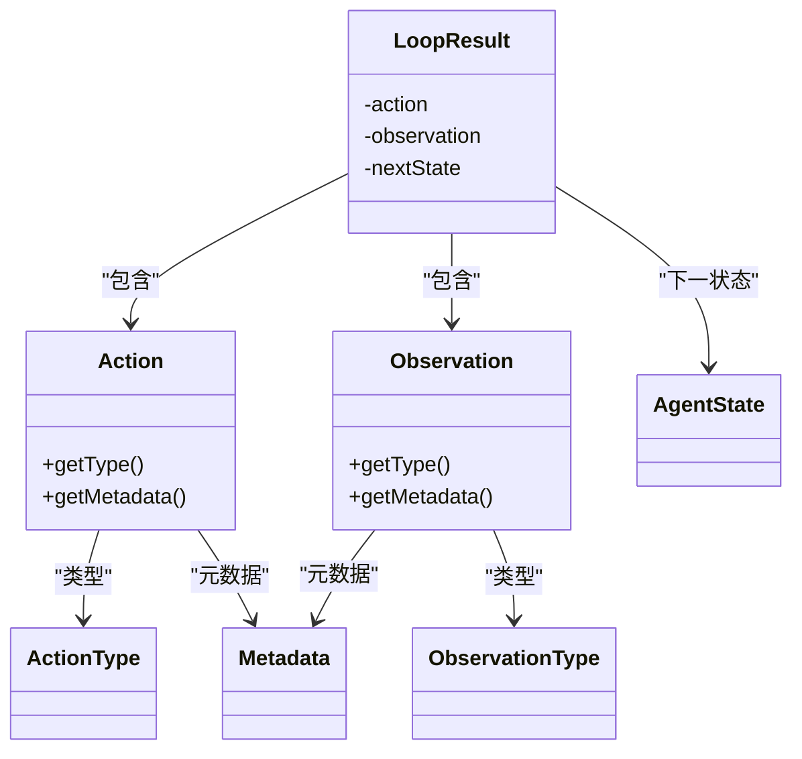
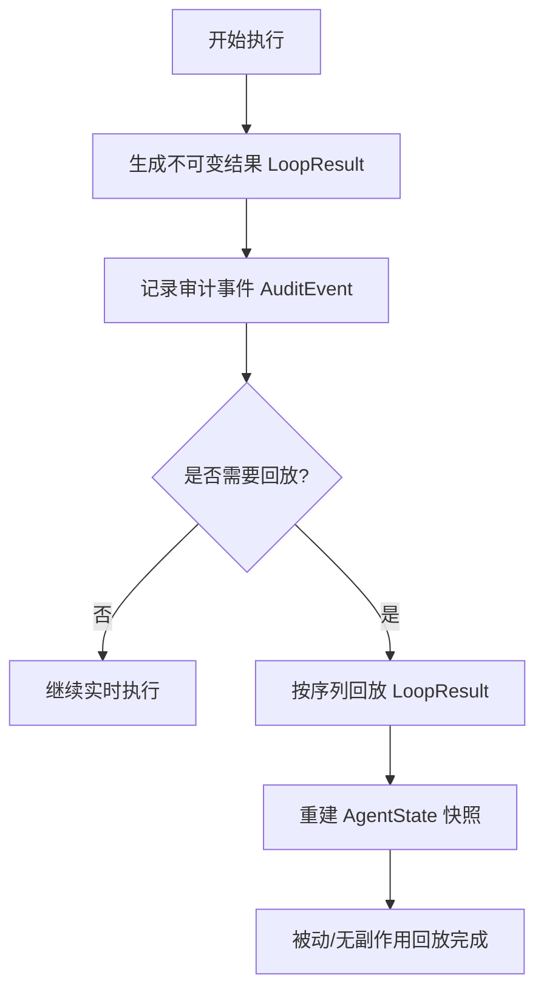
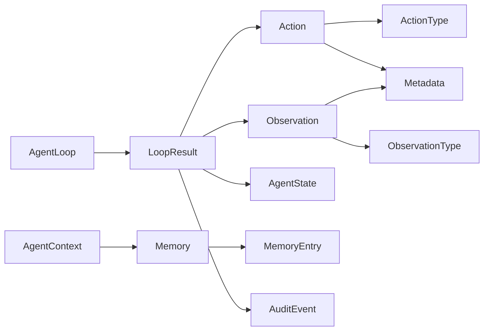

# 核心概念

<cite>
**本文引用的文件**
- [Agent.java](file://argus-core/src/main/java/io/argus/core/agent/Agent.java)
- [AgentContext.java](file://argus-core/src/main/java/io/argus/core/agent/AgentContext.java)
- [AgentLoop.java](file://argus-core/src/main/java/io/argus/core/agent/AgentLoop.java)
- [AgentState.java](file://argus-core/src/main/java/io/argus/core/agent/AgentState.java)
- [LoopResult.java](file://argus-core/src/main/java/io/argus/core/agent/LoopResult.java)
- [Action.java](file://argus-core/src/main/java/io/argus/core/action/Action.java)
- [ActionType.java](file://argus-core/src/main/java/io/argus/core/action/ActionType.java)
- [Observation.java](file://argus-core/src/main/java/io/argus/core/observation/Observation.java)
- [ObservationType.java](file://argus-core/src/main/java/io/argus/core/observation/ObservationType.java)
- [Memory.java](file://argus-core/src/main/java/io/argus/core/memory/Memory.java)
- [MemoryEntry.java](file://argus-core/src/main/java/io/argus/core/memory/MemoryEntry.java)
- [Metadata.java](file://argus-core/src/main/java/io/argus/core/model/Metadata.java)
- [AuditEvent.java](file://argus-core/src/main/java/io/argus/core/audit/AuditEvent.java)
- [Lifecycle.java](file://argus-core/src/main/java/io/argus/core/lifecycle/Lifecycle.java)
- [readme.md](file://readme.md)
</cite>

## 目录
1. [引言](#引言)
2. [项目结构](#项目结构)
3. [核心组件](#核心组件)
4. [架构总览](#架构总览)
5. [详细组件分析](#详细组件分析)
6. [依赖关系分析](#依赖关系分析)
7. [性能考量](#性能考量)
8. [故障排查指南](#故障排查指南)
9. [结论](#结论)

## 引言
Argus 是一个面向“可审计、可控制、可复现”的生产级 Java 运行时，专注于以代理为核心的系统，尤其强调网络知识获取与 AI 代理的稳定执行。其设计哲学围绕三大核心目标展开：
- 可审计：所有执行步骤均以不可变的事实载体记录，便于追踪与审查。
- 可控制：执行循环以原子步骤推进，行为确定可控，避免隐式副作用。
- 可复现：通过完整的状态快照与回放契约，保证相同输入可得到一致输出。

此外，框架强调不可变性与类型安全，通过 Action-观察-记忆三元模型协同，构建清晰、可维护、可扩展的代理系统。

## 项目结构
Argus 采用模块化组织，核心模块与职责如下：
- argus-core：提供代理系统的基础抽象（Agent、AgentLoop、Action、Observation、Memory、Audit 等）
- argus-ingestion：网络数据获取（抓取、解析、策略等）
- argus-agent：AI 代理集成支持
- argus-runtime：生产级运行时容器



章节来源
- file://readme.md#L7-L14

## 核心组件
本节从概念到实现，系统梳理 Argus 的核心构件及其职责边界，并给出与代码的映射路径。

- 代理（Agent）
  - 定义：代理是具备初始状态的实体，其行为通过执行循环推进。
  - 关键点：暴露初始状态接口，供系统初始化使用。
  - 参考路径：file://argus-core/src/main/java/io/argus/core/agent/Agent.java#L7-L11

- 执行上下文（AgentContext）
  - 定义：代理在一次执行过程中的可变工作环境，承载短期推理缓冲、外部客户端、速率限制器等。
  - 关键点：明确与不可变状态的边界；禁止将权威状态存入上下文。
  - 参考路径：file://argus-core/src/main/java/io/argus/core/agent/AgentContext.java#L92-L98

- 执行循环（AgentLoop）
  - 定义：以原子步骤推进代理状态的最小协议，定义“评估—意图—观测—状态”四步模型。
  - 关键点：步骤确定、可观测、可审计；长任务需拆分为多次步骤调用。
  - 参考路径：file://argus-core/src/main/java/io/argus/core/agent/AgentLoop.java#L49-L118

- 执行结果（LoopResult）
  - 定义：一次步骤的不可变事实载体，包含“动作、观测、下一状态”。
  - 关键点：用于回放契约；回放必须无副作用、被动且引用透明。
  - 参考路径：file://argus-core/src/main/java/io/argus/core/agent/LoopResult.java#L7-L115

- 动作（Action）与类型（ActionType）
  - 定义：动作是对代理意图的声明式表达，类型定义高层语义类别。
  - 关键点：动作不含执行逻辑；二级语义通过元数据表达。
  - 参考路径：file://argus-core/src/main/java/io/argus/core/action/Action.java#L37-L43
  - 参考路径：file://argus-core/src/main/java/io/argus/core/action/ActionType.java#L22-L143

- 观察（Observation）与类型（ObservationType）
  - 定义：观察是对事实的不可变感知，描述“发生了什么”，不包含行为指令。
  - 关键点：观测来源可为内部状态变化或外部系统反馈。
  - 参考路径：file://argus-core/src/main/java/io/argus/core/observation/Observation.java#L31-L37
  - 参考路径：file://argus-core/src/main/java/io/argus/core/observation/ObservationType.java#L18-L117

- 记忆（Memory）与条目（MemoryEntry）
  - 定义：用于非权威性回忆与存储；条目包含标识、范围、值、元数据与时间戳。
  - 关键点：与不可变状态区分；仅承载非权威信息。
  - 参考路径：file://argus-core/src/main/java/io/argus/core/memory/Memory.java#L9-L15
  - 参考路径：file://argus-core/src/main/java/io/argus/core/memory/MemoryEntry.java#L9-L53

- 元数据（Metadata）
  - 定义：不可变键值对容器，提供附加上下文或领域信息。
  - 关键点：统一承载二级语义，避免在类型枚举中内嵌技术细节。
  - 参考路径：file://argus-core/src/main/java/io/argus/core/model/Metadata.java#L12-L34

- 审计（AuditEvent）
  - 定义：不可变审计事件，包含标识、级别、类型、消息、元数据与时间戳。
  - 关键点：作为可审计性的事实载体之一。
  - 参考路径：file://argus-core/src/main/java/io/argus/core/audit/AuditEvent.java#L9-L60

- 生命周期（Lifecycle）
  - 定义：系统生命周期接口占位，便于扩展启动/停止/重启等阶段。
  - 参考路径：file://argus-core/src/main/java/io/argus/core/lifecycle/Lifecycle.java#L7-L8

章节来源
- file://argus-core/src/main/java/io/argus/core/agent/Agent.java#L7-L11
- file://argus-core/src/main/java/io/argus/core/agent/AgentContext.java#L92-L98
- file://argus-core/src/main/java/io/argus/core/agent/AgentLoop.java#L49-L118
- file://argus-core/src/main/java/io/argus/core/agent/LoopResult.java#L7-L115
- file://argus-core/src/main/java/io/argus/core/action/Action.java#L37-L43
- file://argus-core/src/main/java/io/argus/core/action/ActionType.java#L22-L143
- file://argus-core/src/main/java/io/argus/core/observation/Observation.java#L31-L37
- file://argus-core/src/main/java/io/argus/core/observation/ObservationType.java#L18-L117
- file://argus-core/src/main/java/io/argus/core/memory/Memory.java#L9-L15
- file://argus-core/src/main/java/io/argus/core/memory/MemoryEntry.java#L9-L53
- file://argus-core/src/main/java/io/argus/core/model/Metadata.java#L12-L34
- file://argus-core/src/main/java/io/argus/core/audit/AuditEvent.java#L9-L60
- file://argus-core/src/main/java/io/argus/core/lifecycle/Lifecycle.java#L7-L8

## 架构总览
Argus 将“意图（Action）—事实（Observation）—状态（AgentState）”三者解耦，通过执行循环与不可变结果桥接实时执行与回放。记忆与审计作为辅助基础设施，分别承担非权威存储与可审计记录。



图表来源
- [AgentLoop.java](file://argus-core/src/main/java/io/argus/core/agent/AgentLoop.java#L49-L118)
- [AgentContext.java](file://argus-core/src/main/java/io/argus/core/agent/AgentContext.java#L92-L98)
- [LoopResult.java](file://argus-core/src/main/java/io/argus/core/agent/LoopResult.java#L78-L115)
- [Action.java](file://argus-core/src/main/java/io/argus/core/action/Action.java#L37-L43)
- [Observation.java](file://argus-core/src/main/java/io/argus/core/observation/Observation.java#L31-L37)
- [ActionType.java](file://argus-core/src/main/java/io/argus/core/action/ActionType.java#L22-L143)
- [ObservationType.java](file://argus-core/src/main/java/io/argus/core/observation/ObservationType.java#L18-L117)
- [Memory.java](file://argus-core/src/main/java/io/argus/core/memory/Memory.java#L9-L15)
- [MemoryEntry.java](file://argus-core/src/main/java/io/argus/core/memory/MemoryEntry.java#L9-L53)
- [Metadata.java](file://argus-core/src/main/java/io/argus/core/model/Metadata.java#L12-L34)
- [AuditEvent.java](file://argus-core/src/main/java/io/argus/core/audit/AuditEvent.java#L9-L60)

## 详细组件分析

### Action-观察-记忆模型
Action-观察-记忆是代理系统的行为与认知基础。其工作原理与协同方式如下：
- 意图（Action）：代理在每一步根据当前状态与上下文做出声明式意图，类型定义高层语义，元数据承载二级细节。
- 事实（Observation）：动作执行后得到的不可变事实，来源可以是外部系统响应、内部状态变化或错误条件。
- 记忆（Memory）：非权威存储与回忆，用于短期推理与跨步骤上下文共享，但不替代不可变状态。

```mermaid
sequenceDiagram
participant Ctx as "AgentContext"
participant Loop as "AgentLoop"
participant Act as "Action"
participant Obs as "Observation"
participant Mem as "Memory"
participant Res as "LoopResult"
Ctx->>Loop : "step(context)"
Loop->>Ctx : "读取状态/上下文"
Loop->>Act : "生成动作含类型与元数据"
Loop->>Obs : "接收观测事实"
Ctx->>Mem : "非权威回忆/存储"
Loop->>Res : "封装为不可变结果"
Loop-->>Ctx : "返回结果"
```

图表来源
- [AgentLoop.java](file://argus-core/src/main/java/io/argus/core/agent/AgentLoop.java#L89-L118)
- [Action.java](file://argus-core/src/main/java/io/argus/core/action/Action.java#L37-L43)
- [Observation.java](file://argus-core/src/main/java/io/argus/core/observation/Observation.java#L31-L37)
- [Memory.java](file://argus-core/src/main/java/io/argus/core/memory/Memory.java#L9-L15)
- [LoopResult.java](file://argus-core/src/main/java/io/argus/core/agent/LoopResult.java#L78-L115)

章节来源
- file://argus-core/src/main/java/io/argus/core/action/Action.java#L37-L43
- file://argus-core/src/main/java/io/argus/core/observation/Observation.java#L31-L37
- file://argus-core/src/main/java/io/argus/core/memory/Memory.java#L9-L15
- file://argus-core/src/main/java/io/argus/core/agent/LoopResult.java#L78-L115

### 不可变性设计原则在代理状态管理中的应用
- AgentState 的不可变契约：每次状态变化必须产生新实例，不允许原地修改；快照语义要求每个状态自包含，无需依赖历史状态即可解释。
- LoopResult 的不可变契约：作为回放的唯一真实来源，必须自包含且足够用于确定性回放；回放过程不得重放外部副作用。
- Metadata 的不可变设计：键值对容器在构造时冻结，提供只读视图，避免并发与一致性问题。
- MemoryEntry 的不可变设计：事件条目包含时间戳与元数据，作为不可变事实用于审计与回放。



图表来源
- [AgentState.java](file://argus-core/src/main/java/io/argus/core/agent/AgentState.java#L11-L77)
- [LoopResult.java](file://argus-core/src/main/java/io/argus/core/agent/LoopResult.java#L17-L76)
- [Metadata.java](file://argus-core/src/main/java/io/argus/core/model/Metadata.java#L12-L34)
- [MemoryEntry.java](file://argus-core/src/main/java/io/argus/core/memory/MemoryEntry.java#L9-L53)

章节来源
- file://argus-core/src/main/java/io/argus/core/agent/AgentState.java#L11-L77
- file://argus-core/src/main/java/io/argus/core/agent/LoopResult.java#L17-L76
- file://argus-core/src/main/java/io/argus/core/model/Metadata.java#L12-L34
- file://argus-core/src/main/java/io/argus/core/memory/MemoryEntry.java#L9-L53

### 类型安全设计模式与可靠性保障
- 枚举化语义：ActionType 与 ObservationType 将高层语义固化为类型安全的枚举，避免字符串魔法与运行期错误。
- 接口契约：Action、Observation、Memory 等以接口定义契约，实现与运行时解耦，提升可测试性与可替换性。
- 元数据承载：通过 Metadata 统一承载二级语义与上下文，减少类型扩展带来的复杂度与风险。
- 回放契约：LoopResult 作为纯数据载体，确保回放过程无副作用、可确定、可审计。



图表来源
- [Action.java](file://argus-core/src/main/java/io/argus/core/action/Action.java#L37-L43)
- [Observation.java](file://argus-core/src/main/java/io/argus/core/observation/Observation.java#L31-L37)
- [ActionType.java](file://argus-core/src/main/java/io/argus/core/action/ActionType.java#L22-L143)
- [ObservationType.java](file://argus-core/src/main/java/io/argus/core/observation/ObservationType.java#L18-L117)
- [Metadata.java](file://argus-core/src/main/java/io/argus/core/model/Metadata.java#L12-L34)
- [LoopResult.java](file://argus-core/src/main/java/io/argus/core/agent/LoopResult.java#L78-L115)

章节来源
- file://argus-core/src/main/java/io/argus/core/action/Action.java#L37-L43
- file://argus-core/src/main/java/io/argus/core/observation/Observation.java#L31-L37
- file://argus-core/src/main/java/io/argus/core/action/ActionType.java#L22-L143
- file://argus-core/src/main/java/io/argus/core/observation/ObservationType.java#L18-L117
- file://argus-core/src/main/java/io/argus/core/model/Metadata.java#L12-L34
- file://argus-core/src/main/java/io/argus/core/agent/LoopResult.java#L78-L115

### 可审计性、可控制性、可复现性的实现机制
- 可审计性：通过不可变的 LoopResult、AuditEvent 与 Metadata 记录事实，确保行为可追踪、可审查。
- 可控制性：AgentLoop 的原子步骤模型与显式停止机制，使行为在确定范围内推进与终止。
- 可复现性：AgentState 的快照语义与回放契约，结合 LoopResult 的自包含特性，保证相同输入可得到一致输出。



图表来源
- [LoopResult.java](file://argus-core/src/main/java/io/argus/core/agent/LoopResult.java#L24-L76)
- [AuditEvent.java](file://argus-core/src/main/java/io/argus/core/audit/AuditEvent.java#L9-L60)
- [AgentState.java](file://argus-core/src/main/java/io/argus/core/agent/AgentState.java#L22-L76)

章节来源
- file://argus-core/src/main/java/io/argus/core/agent/LoopResult.java#L24-L76
- file://argus-core/src/main/java/io/argus/core/audit/AuditEvent.java#L9-L60
- file://argus-core/src/main/java/io/argus/core/agent/AgentState.java#L22-L76

## 依赖关系分析
- 组件耦合与内聚
  - AgentLoop 与 AgentContext 解耦，前者仅依赖后者的只读视图；LoopResult 作为纯数据载体，降低循环与外部系统的耦合。
  - Action 与 Observation 通过类型枚举与元数据实现高内聚、低耦合的语义表达。
- 直接与间接依赖
  - LoopResult 直接依赖 Action、Observation、AgentState；间接依赖 Metadata、MemoryEntry、AuditEvent 等用于审计与存储。
- 外部依赖与集成点
  - Memory 提供非权威存储；Lifecycle 为扩展生命周期预留接口；Ingestion 模块通过具体实现接入抓取与解析能力。



图表来源
- [AgentLoop.java](file://argus-core/src/main/java/io/argus/core/agent/AgentLoop.java#L49-L118)
- [LoopResult.java](file://argus-core/src/main/java/io/argus/core/agent/LoopResult.java#L78-L115)
- [Action.java](file://argus-core/src/main/java/io/argus/core/action/Action.java#L37-L43)
- [Observation.java](file://argus-core/src/main/java/io/argus/core/observation/Observation.java#L31-L37)
- [AgentContext.java](file://argus-core/src/main/java/io/argus/core/agent/AgentContext.java#L92-L98)
- [Memory.java](file://argus-core/src/main/java/io/argus/core/memory/Memory.java#L9-L15)
- [MemoryEntry.java](file://argus-core/src/main/java/io/argus/core/memory/MemoryEntry.java#L9-L53)
- [AuditEvent.java](file://argus-core/src/main/java/io/argus/core/audit/AuditEvent.java#L9-L60)

章节来源
- file://argus-core/src/main/java/io/argus/core/agent/AgentLoop.java#L49-L118
- file://argus-core/src/main/java/io/argus/core/agent/LoopResult.java#L78-L115
- file://argus-core/src/main/java/io/argus/core/action/Action.java#L37-L43
- file://argus-core/src/main/java/io/argus/core/observation/Observation.java#L31-L37
- file://argus-core/src/main/java/io/argus/core/agent/AgentContext.java#L92-L98
- file://argus-core/src/main/java/io/argus/core/memory/Memory.java#L9-L15
- file://argus-core/src/main/java/io/argus/core/memory/MemoryEntry.java#L9-L53
- file://argus-core/src/main/java/io/argus/core/audit/AuditEvent.java#L9-L60

## 性能考量
- 步骤原子化：单步执行避免长时间阻塞，适合异步/事件驱动/分布式部署。
- 不可变数据结构：通过冻结容器与不可变对象，降低并发与一致性成本，同时利于缓存与回放。
- 记忆与审计分离：非权威记忆用于短期推理，权威状态与回放契约保持简洁，减少不必要的 IO。
- 元数据承载：将二级语义放入 Metadata，避免类型枚举膨胀导致的分支复杂度上升。

## 故障排查指南
- 回放异常
  - 症状：回放结果与预期不一致。
  - 排查要点：确认 LoopResult 序列完整性与顺序；检查外部副作用是否被重放；核验 AgentState 快照是否自包含。
  - 参考路径：file://argus-core/src/main/java/io/argus/core/agent/LoopResult.java#L24-L76
- 上下文污染
  - 症状：回放依赖上下文状态，导致不可重现。
  - 排查要点：确保权威状态仅来自 AgentState 与 LoopResult；禁止将决策关键数据仅存于 AgentContext。
  - 参考路径：file://argus-core/src/main/java/io/argus/core/agent/AgentContext.java#L14-L77
- 类型误用
  - 症状：动作/观察语义模糊或扩展枚举导致分支复杂。
  - 排查要点：优先通过 Metadata 表达二级语义；避免在类型中编码技术细节。
  - 参考路径：file://argus-core/src/main/java/io/argus/core/action/ActionType.java#L13-L18
  - 参考路径：file://argus-core/src/main/java/io/argus/core/observation/ObservationType.java#L12-L14
- 审计缺失
  - 症状：难以追踪行为轨迹。
  - 排查要点：确保 LoopResult 与关键节点记录 AuditEvent；使用 Metadata 附带上下文。
  - 参考路径：file://argus-core/src/main/java/io/argus/core/audit/AuditEvent.java#L9-L60

章节来源
- file://argus-core/src/main/java/io/argus/core/agent/LoopResult.java#L24-L76
- file://argus-core/src/main/java/io/argus/core/agent/AgentContext.java#L14-L77
- file://argus-core/src/main/java/io/argus/core/action/ActionType.java#L13-L18
- file://argus-core/src/main/java/io/argus/core/observation/ObservationType.java#L12-L14
- file://argus-core/src/main/java/io/argus/core/audit/AuditEvent.java#L9-L60

## 结论
Argus 通过 Action-观察-记忆三元模型与不可变状态管理，构建了可审计、可控制、可复现的代理执行体系。类型安全与元数据承载进一步提升了系统的可靠性与一致性。配合清晰的边界划分（状态 vs 上下文）、严格的回放契约与审计记录，Argus 为生产级 AI 代理系统提供了坚实基础。