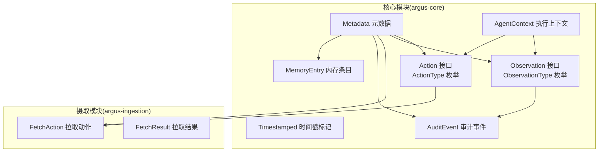
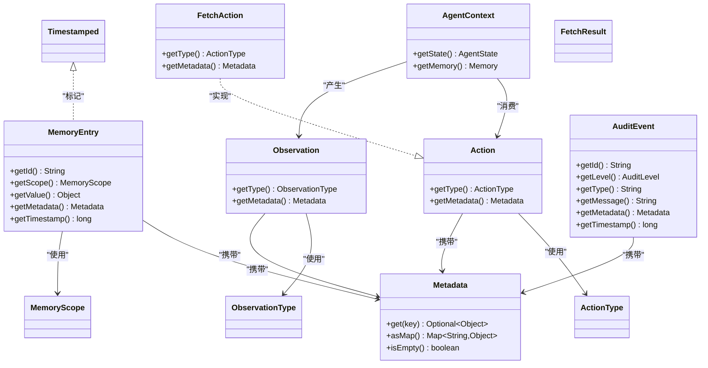
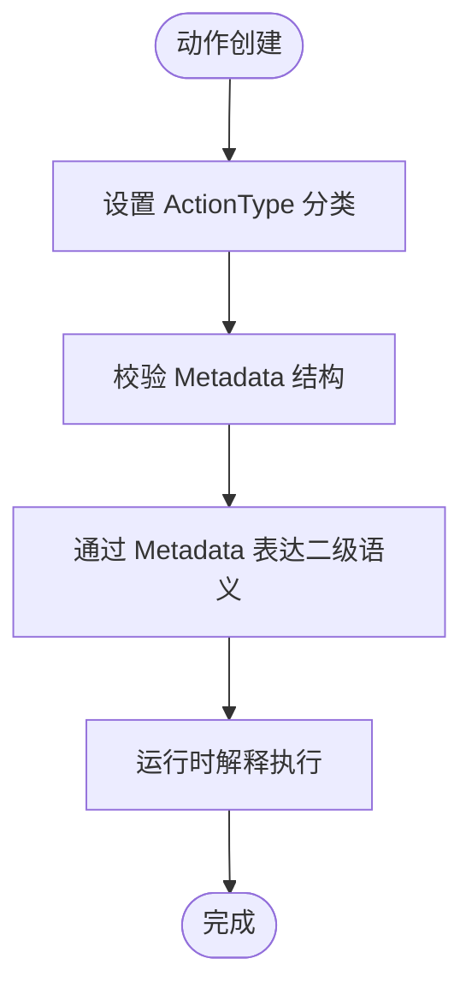
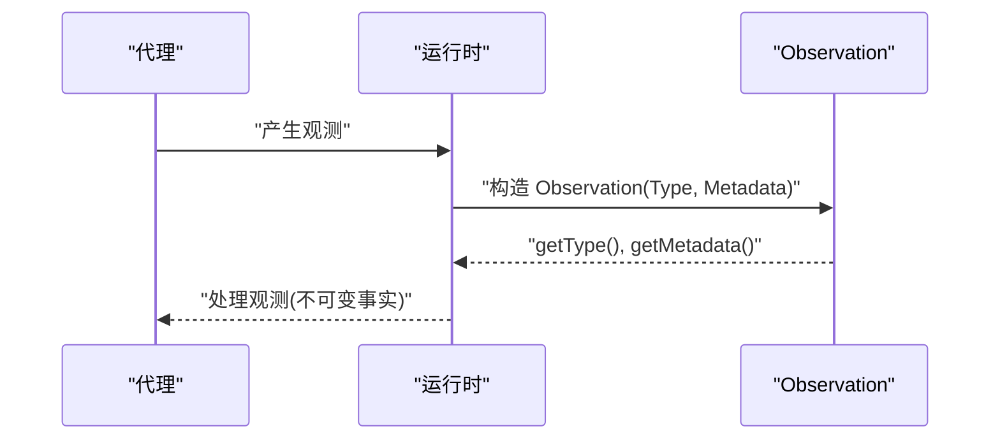
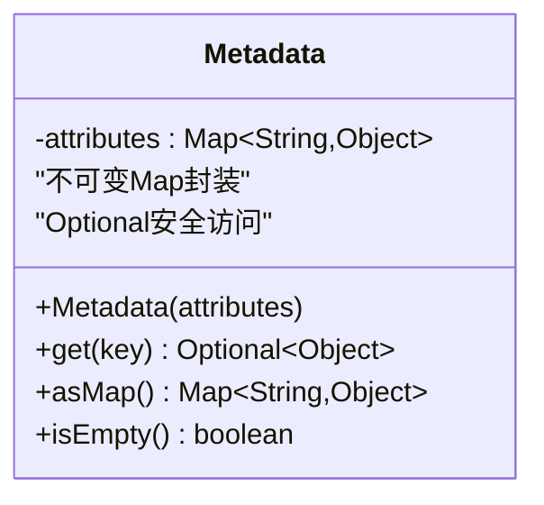
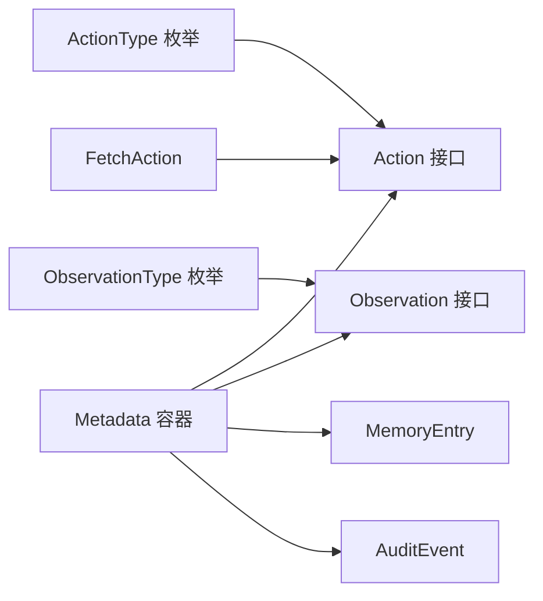

# 类型安全设计模式

<cite>
**本文档引用的文件**
- [ActionType.java](file://argus-core/src/main/java/io/argus/core/action/ActionType.java)
- [Action.java](file://argus-core/src/main/java/io/argus/core/action/Action.java)
- [ObservationType.java](file://argus-core/src/main/java/io/argus/core/observation/ObservationType.java)
- [Observation.java](file://argus-core/src/main/java/io/argus/core/observation/Observation.java)
- [Metadata.java](file://argus-core/src/main/java/io/argus/core/model/Metadata.java)
- [Timestamped.java](file://argus-core/src/main/java/io/argus/core/model/Timestamped.java)
- [MemoryEntry.java](file://argus-core/src/main/java/io/argus/core/memory/MemoryEntry.java)
- [MemoryScope.java](file://argus-core/src/main/java/io/argus/core/memory/MemoryScope.java)
- [AgentContext.java](file://argus-core/src/main/java/io/argus/core/agent/AgentContext.java)
- [AuditEvent.java](file://argus-core/src/main/java/io/argus/core/audit/AuditEvent.java)
- [FetchAction.java](file://argus-ingestion/src/main/java/io/argus/ingestion/fetch/FetchAction.java)
- [FetchResult.java](file://argus-ingestion/src/main/java/io/argus/ingestion/fetch/FetchResult.java)
- [readme.md](file://readme.md)
</cite>

## 目录
1. [引言](#引言)
2. [项目结构](#项目结构)
3. [核心组件](#核心组件)
4. [架构总览](#架构总览)
5. [详细组件分析](#详细组件分析)
6. [依赖关系分析](#依赖关系分析)
7. [性能考量](#性能考量)
8. [故障排除指南](#故障排除指南)
9. [结论](#结论)

## 引言
本文件系统性阐述Argus框架中的类型安全设计模式，重点围绕以下目标展开：  
- 解释类型安全在软件开发中的重要性，以及Argus如何通过强类型接口与枚举体系在编译期保障一致性；  
- 深入解析ActionType动作类型系统的设计原理（类型分类、参数约束、扩展机制）；  
- 说明ObservationType观察类型系统如何保证观察数据的结构化与一致性；  
- 讨论Metadata元数据容器的类型安全设计，以及如何通过不可变封装与Optional语义确保数据正确性；  
- 提供实际应用示例（类型推断、编译期检查、运行时验证）以展示类型安全模式的价值；  
- 总结类型安全设计对降低运行时错误、提升可维护性与可扩展性的意义。

## 项目结构
Argus采用多模块分层组织，核心类型安全设计集中在argus-core模块，涵盖动作、观察、内存、审计等基础能力，并通过argus-ingestion等模块展示具体实现。

图表来源
- [Action.java](file://argus-core/src/main/java/io/argus/core/action/Action.java#L37-L43)
- [ActionType.java](file://argus-core/src/main/java/io/argus/core/action/ActionType.java#L22-L143)
- [Observation.java](file://argus-core/src/main/java/io/argus/core/observation/Observation.java#L31-L37)
- [ObservationType.java](file://argus-core/src/main/java/io/argus/core/observation/ObservationType.java#L18-L117)
- [Metadata.java](file://argus-core/src/main/java/io/argus/core/model/Metadata.java#L12-L34)
- [MemoryEntry.java](file://argus-core/src/main/java/io/argus/core/memory/MemoryEntry.java#L9-L53)
- [AgentContext.java](file://argus-core/src/main/java/io/argus/core/agent/AgentContext.java#L92-L98)
- [AuditEvent.java](file://argus-core/src/main/java/io/argus/core/audit/AuditEvent.java#L9-L60)
- [FetchAction.java](file://argus-ingestion/src/main/java/io/argus/ingestion/fetch/FetchAction.java#L11-L21)
- [FetchResult.java](file://argus-ingestion/src/main/java/io/argus/ingestion/fetch/FetchResult.java#L7-L8)

章节来源
- [readme.md](file://readme.md#L7-L28)

## 核心组件
本节聚焦类型安全设计的关键构件：动作类型系统、观察类型系统与元数据容器。

- 动作类型系统（ActionType）
  - 通过枚举定义高层语义类别，禁止在枚举中编码协议或技术细节，具体实现由运行时解释。
  - 二级及更细粒度语义通过Metadata传递，避免枚举膨胀与耦合。
  - 参考路径：[ActionType.java](file://argus-core/src/main/java/io/argus/core/action/ActionType.java#L22-L143)

- 观察类型系统（ObservationType）
  - 通过枚举定义观测的高层语义类别，强调观测为不可变事实，不包含行为指令。
  - 具体数据格式与Schema由实现决定，语义分类保持稳定。
  - 参考路径：[ObservationType.java](file://argus-core/src/main/java/io/argus/core/observation/ObservationType.java#L18-L117)

- 元数据容器（Metadata）
  - 使用不可变Map封装属性，提供Optional语义的安全访问，防止空指针与并发修改。
  - 支持作为Action、Observation、MemoryEntry、AuditEvent等的通用承载结构。
  - 参考路径：[Metadata.java](file://argus-core/src/main/java/io/argus/core/model/Metadata.java#L12-L34)

章节来源
- [ActionType.java](file://argus-core/src/main/java/io/argus/core/action/ActionType.java#L3-L21)
- [ObservationType.java](file://argus-core/src/main/java/io/argus/core/observation/ObservationType.java#L3-L17)
- [Metadata.java](file://argus-core/src/main/java/io/argus/core/model/Metadata.java#L12-L34)

## 架构总览
Argus通过接口+枚举+不可变容器构建类型安全的“意图-事实”模型，配合执行上下文与审计事件形成闭环。

图表来源
- [Action.java](file://argus-core/src/main/java/io/argus/core/action/Action.java#L37-L43)
- [ActionType.java](file://argus-core/src/main/java/io/argus/core/action/ActionType.java#L22-L143)
- [Observation.java](file://argus-core/src/main/java/io/argus/core/observation/Observation.java#L31-L37)
- [ObservationType.java](file://argus-core/src/main/java/io/argus/core/observation/ObservationType.java#L18-L117)
- [Metadata.java](file://argus-core/src/main/java/io/argus/core/model/Metadata.java#L12-L34)
- [MemoryEntry.java](file://argus-core/src/main/java/io/argus/core/memory/MemoryEntry.java#L9-L53)
- [MemoryScope.java](file://argus-core/src/main/java/io/argus/core/memory/MemoryScope.java#L7-L8)
- [Timestamped.java](file://argus-core/src/main/java/io/argus/core/model/Timestamped.java#L7-L8)
- [AgentContext.java](file://argus-core/src/main/java/io/argus/core/agent/AgentContext.java#L92-L98)
- [AuditEvent.java](file://argus-core/src/main/java/io/argus/core/audit/AuditEvent.java#L9-L60)
- [FetchAction.java](file://argus-ingestion/src/main/java/io/argus/ingestion/fetch/FetchAction.java#L11-L21)
- [FetchResult.java](file://argus-ingestion/src/main/java/io/argus/ingestion/fetch/FetchResult.java#L7-L8)

## 详细组件分析

### 动作类型系统（ActionType）设计
- 类型分类
  - DECIDE：内部决策，无直接副作用
  - REQUEST：请求外部能力或服务
  - FETCH：从内外部源拉取数据
  - TRANSFORM：纯数据变换，无外部副作用
  - STORE：持久化或提交数据
  - EMIT：对外输出或通知
- 参数约束
  - 动作必须通过ActionType进行一级语义分类
  - 具体实现不得在枚举中编码协议或技术细节
  - 细粒度语义通过Metadata传递
- 扩展机制
  - 不允许通过扩展枚举增加新语义
  - 新场景通过Metadata扩展，保持枚举稳定

图表来源
- [ActionType.java](file://argus-core/src/main/java/io/argus/core/action/ActionType.java#L3-L21)
- [Action.java](file://argus-core/src/main/java/io/argus/core/action/Action.java#L14-L22)

章节来源
- [ActionType.java](file://argus-core/src/main/java/io/argus/core/action/ActionType.java#L22-L143)
- [Action.java](file://argus-core/src/main/java/io/argus/core/action/Action.java#L37-L43)

### 观察类型系统（ObservationType）设计
- 类型分类
  - STATE：内部状态变化
  - DATA：原始或结构化数据
  - RESPONSE：对先前动作的响应结果
  - ERROR：错误或失败状态
  - EVENT：外部或异步事件
- 结构化与一致性
  - 观测为不可变事实，不包含行为指令
  - 通过枚举统一语义分类，避免实现差异导致的歧义
- 元数据承载
  - 具体数据格式与Schema由实现决定，语义分类保持稳定

图表来源
- [Observation.java](file://argus-core/src/main/java/io/argus/core/observation/Observation.java#L31-L37)
- [ObservationType.java](file://argus-core/src/main/java/io/argus/core/observation/ObservationType.java#L18-L117)

章节来源
- [Observation.java](file://argus-core/src/main/java/io/argus/core/observation/Observation.java#L31-L37)
- [ObservationType.java](file://argus-core/src/main/java/io/argus/core/observation/ObservationType.java#L18-L117)

### 元数据容器（Metadata）类型安全设计
- 不可变封装
  - 构造时复制并转为不可变Map，防止并发修改与外部篡改
- 安全访问
  - get(key)返回Optional，避免空指针异常
  - asMap()返回只读视图，保护内部状态
- 广泛承载
  - Action、Observation、MemoryEntry、AuditEvent均通过Metadata承载上下文信息

图表来源
- [Metadata.java](file://argus-core/src/main/java/io/argus/core/model/Metadata.java#L12-L34)

章节来源
- [Metadata.java](file://argus-core/src/main/java/io/argus/core/model/Metadata.java#L12-L34)
- [MemoryEntry.java](file://argus-core/src/main/java/io/argus/core/memory/MemoryEntry.java#L43-L44)
- [AuditEvent.java](file://argus-core/src/main/java/io/argus/core/audit/AuditEvent.java#L51-L52)

### 实际应用示例与类型安全实践
- 类型推断与编译期检查
  - FetchAction实现Action接口，编译器强制要求提供getType()与getMetadata()，且返回类型为ActionType与Metadata，避免运行时类型不匹配。
  - 参考路径：[FetchAction.java](file://argus-ingestion/src/main/java/io/argus/ingestion/fetch/FetchAction.java#L11-L21)，[Action.java](file://argus-core/src/main/java/io/argus/core/action/Action.java#L37-L43)
- 运行时验证
  - 使用Metadata.get(key)的Optional语义，在访问前进行存在性判断，避免NPE；asMap()仅返回只读视图，防止意外修改。
  - 参考路径：[Metadata.java](file://argus-core/src/main/java/io/argus/core/model/Metadata.java#L22-L28)
- 结构化与一致性
  - MemoryEntry统一承载id、scope、value、metadata、timestamp，结合Metadata的不可变特性，确保内存条目的结构化与一致性。
  - 参考路径：[MemoryEntry.java](file://argus-core/src/main/java/io/argus/core/memory/MemoryEntry.java#L17-L29)

章节来源
- [FetchAction.java](file://argus-ingestion/src/main/java/io/argus/ingestion/fetch/FetchAction.java#L11-L21)
- [Action.java](file://argus-core/src/main/java/io/argus/core/action/Action.java#L37-L43)
- [Metadata.java](file://argus-core/src/main/java/io/argus/core/model/Metadata.java#L22-L28)
- [MemoryEntry.java](file://argus-core/src/main/java/io/argus/core/memory/MemoryEntry.java#L17-L29)

## 依赖关系分析
- 松耦合与高内聚
  - Action与Observation通过枚举分类，不依赖具体实现细节，便于替换与扩展
  - Metadata作为通用承载，被多处使用但不反向依赖具体领域
- 循环依赖规避
  - 枚举与接口之间为单向依赖，未见循环导入
- 可扩展性
  - 通过Metadata扩展语义，避免在枚举中硬编码实现细节

图表来源
- [ActionType.java](file://argus-core/src/main/java/io/argus/core/action/ActionType.java#L22-L143)
- [Action.java](file://argus-core/src/main/java/io/argus/core/action/Action.java#L37-L43)
- [ObservationType.java](file://argus-core/src/main/java/io/argus/core/observation/ObservationType.java#L18-L117)
- [Observation.java](file://argus-core/src/main/java/io/argus/core/observation/Observation.java#L31-L37)
- [Metadata.java](file://argus-core/src/main/java/io/argus/core/model/Metadata.java#L12-L34)
- [MemoryEntry.java](file://argus-core/src/main/java/io/argus/core/memory/MemoryEntry.java#L9-L53)
- [AuditEvent.java](file://argus-core/src/main/java/io/argus/core/audit/AuditEvent.java#L9-L60)
- [FetchAction.java](file://argus-ingestion/src/main/java/io/argus/ingestion/fetch/FetchAction.java#L11-L21)

## 性能考量
- 枚举与接口访问开销极低，适合高频调用
- Metadata不可变封装带来线程安全收益，减少同步成本
- 建议在热路径避免频繁拷贝Metadata.asMap()，优先使用get(key)按需访问
- MemoryEntry的不可变字段与long时间戳有利于缓存与比较操作

## 故障排除指南
- 编译期错误
  - 实现Action或Observation时未提供正确的getType()/getMetadata()签名，编译器会报错
  - 参考路径：[Action.java](file://argus-core/src/main/java/io/argus/core/action/Action.java#L37-L43)，[Observation.java](file://argus-core/src/main/java/io/argus/core/observation/Observation.java#L31-L37)
- 运行时访问异常
  - 使用Metadata.get(key)返回空时未判空，可能导致后续NPE；建议始终使用Optional语义
  - 参考路径：[Metadata.java](file://argus-core/src/main/java/io/argus/core/model/Metadata.java#L22-L24)
- 数据一致性问题
  - 直接修改Metadata.asMap()或MemoryEntry内部状态会导致未定义行为；应遵循不可变约定
  - 参考路径：[Metadata.java](file://argus-core/src/main/java/io/argus/core/model/Metadata.java#L26-L28)，[MemoryEntry.java](file://argus-core/src/main/java/io/argus/core/memory/MemoryEntry.java#L17-L29)

章节来源
- [Action.java](file://argus-core/src/main/java/io/argus/core/action/Action.java#L37-L43)
- [Observation.java](file://argus-core/src/main/java/io/argus/core/observation/Observation.java#L31-L37)
- [Metadata.java](file://argus-core/src/main/java/io/argus/core/model/Metadata.java#L22-L28)
- [MemoryEntry.java](file://argus-core/src/main/java/io/argus/core/memory/MemoryEntry.java#L17-L29)

## 结论
Argus通过ActionType与ObservationType的枚举分类、Metadata的不可变封装与Optional安全访问，以及Action/Observation接口的契约约束，构建了强类型、可编译期验证、可运行时校验的类型安全体系。该设计显著降低了运行时错误概率，提升了系统的可维护性与可扩展性，为复杂AI代理系统的可审计、可控制、可复现提供了坚实基础。