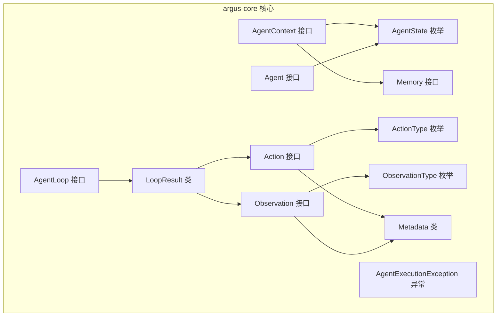
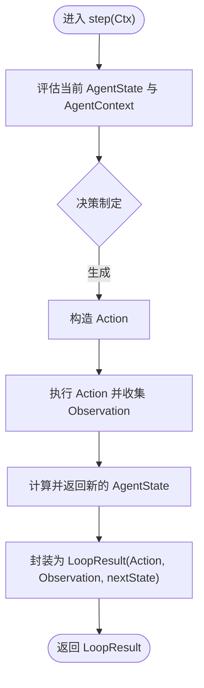
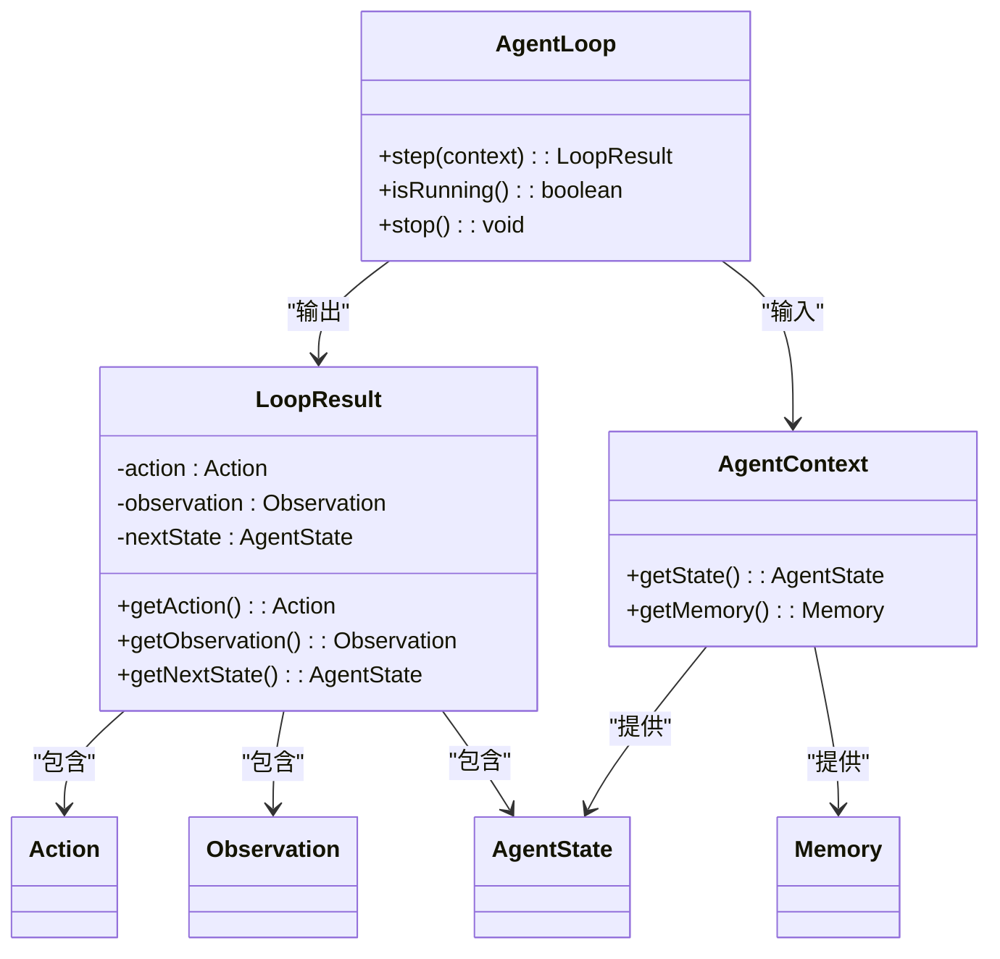

# argus-agent 代理执行模块

<cite>
**本文引用的文件**
- [AgentLoop.java](file://argus-core/src/main/java/io/argus/core/agent/AgentLoop.java)
- [AgentState.java](file://argus-core/src/main/java/io/argus/core/agent/AgentState.java)
- [AgentContext.java](file://argus-core/src/main/java/io/argus/core/agent/AgentContext.java)
- [LoopResult.java](file://argus-core/src/main/java/io/argus/core/agent/LoopResult.java)
- [Agent.java](file://argus-core/src/main/java/io/argus/core/agent/Agent.java)
- [Action.java](file://argus-core/src/main/java/io/argus/core/action/Action.java)
- [ActionType.java](file://argus-core/src/main/java/io/argus/core/action/ActionType.java)
- [Observation.java](file://argus-core/src/main/java/io/argus/core/observation/Observation.java)
- [ObservationType.java](file://argus-core/src/main/java/io/argus/core/observation/ObservationType.java)
- [Metadata.java](file://argus-core/src/main/java/io/argus/core/model/Metadata.java)
- [Memory.java](file://argus-core/src/main/java/io/argus/core/memory/Memory.java)
- [AgentExecutionException.java](file://argus-core/src/main/java/io/argus/core/error/AgentExecutionException.java)
</cite>

## 目录
1. [简介](#简介)
2. [项目结构](#项目结构)
3. [核心组件](#核心组件)
4. [架构总览](#架构总览)
5. [详细组件分析](#详细组件分析)
6. [依赖关系分析](#依赖关系分析)
7. [性能考量](#性能考量)
8. [故障排查指南](#故障排查指南)
9. [结论](#结论)
10. [附录](#附录)

## 简介
本文件面向 argus-agent 代理执行模块，系统化阐述其在 Argus 框架中的执行引擎地位与设计哲学。重点包括：
- AgentLoop 确定性执行循环的设计原理与实现机制
- AgentState 状态管理的不可变性设计与可审计性、可复现性保障
- AgentContext 上下文管理的设计边界、传递、隔离与生命周期
- LoopResult 结果封装的结构化设计与标准化输出
- 代理执行的单步推进机制：状态转换、决策制定与结果反馈
- 如何基于 AgentLoop 构建复杂代理行为与自定义执行逻辑
- 与 argus-core 及其他模块的集成协作模式

## 项目结构
argus-agent 位于 argus-core 子模块中，围绕 AgentLoop、AgentState、AgentContext、LoopResult 四大核心接口/类展开，配合 Action、Observation、Metadata、Memory 等基础模型，形成可审计、可回放、可控制的确定性执行框架。



图表来源
- [AgentLoop.java](file://argus-core/src/main/java/io/argus/core/agent/AgentLoop.java#L49-L118)
- [AgentState.java](file://argus-core/src/main/java/io/argus/core/agent/AgentState.java#L79-L81)
- [AgentContext.java](file://argus-core/src/main/java/io/argus/core/agent/AgentContext.java#L92-L98)
- [LoopResult.java](file://argus-core/src/main/java/io/argus/core/agent/LoopResult.java#L78-L114)
- [Agent.java](file://argus-core/src/main/java/io/argus/core/agent/Agent.java#L7-L11)
- [Action.java](file://argus-core/src/main/java/io/argus/core/action/Action.java#L37-L43)
- [Observation.java](file://argus-core/src/main/java/io/argus/core/observation/Observation.java#L31-L37)
- [ActionType.java](file://argus-core/src/main/java/io/argus/core/action/ActionType.java#L22-L143)
- [ObservationType.java](file://argus-core/src/main/java/io/argus/core/observation/ObservationType.java#L18-L117)
- [Metadata.java](file://argus-core/src/main/java/io/argus/core/model/Metadata.java#L12-L34)
- [Memory.java](file://argus-core/src/main/java/io/argus/core/memory/Memory.java#L9-L15)
- [AgentExecutionException.java](file://argus-core/src/main/java/io/argus/core/error/AgentExecutionException.java#L7-L8)

章节来源
- [AgentLoop.java](file://argus-core/src/main/java/io/argus/core/agent/AgentLoop.java#L1-L118)
- [AgentState.java](file://argus-core/src/main/java/io/argus/core/agent/AgentState.java#L1-L81)
- [AgentContext.java](file://argus-core/src/main/java/io/argus/core/agent/AgentContext.java#L1-L98)
- [LoopResult.java](file://argus-core/src/main/java/io/argus/core/agent/LoopResult.java#L1-L115)
- [Agent.java](file://argus-core/src/main/java/io/argus/core/agent/Agent.java#L1-L11)
- [Action.java](file://argus-core/src/main/java/io/argus/core/action/Action.java#L1-L43)
- [Observation.java](file://argus-core/src/main/java/io/argus/core/observation/Observation.java#L1-L37)
- [ActionType.java](file://argus-core/src/main/java/io/argus/core/action/ActionType.java#L1-L143)
- [ObservationType.java](file://argus-core/src/main/java/io/argus/core/observation/ObservationType.java#L1-L117)
- [Metadata.java](file://argus-core/src/main/java/io/argus/core/model/Metadata.java#L1-L34)
- [Memory.java](file://argus-core/src/main/java/io/argus/core/memory/Memory.java#L1-L15)
- [AgentExecutionException.java](file://argus-core/src/main/java/io/argus/core/error/AgentExecutionException.java#L1-L8)

## 核心组件
- AgentLoop：定义代理的单步决策循环，确保每一步是确定性、可观测、可审计的原子单元，并通过 isRunning()/stop() 控制生命周期。
- AgentState：代理在某一时刻的完整逻辑快照，强调不可变性与自包含性，支撑回放与分支。
- AgentContext：代理执行期间的可变工作环境，仅承载瞬时信息，严禁承载权威状态或隐藏决策。
- LoopResult：单步执行结果的不可变载体，封装 Action、Observation 与 nextState，是回放的唯一事实来源。
- Agent：声明初始状态，与 AgentLoop 共同构成代理的“状态-行为”边界。
- Action/Observation/Metadata：代理意图、外部事实与元信息的建模，配合 ActionType/ObservationType 提供高内聚语义分类。

章节来源
- [AgentLoop.java](file://argus-core/src/main/java/io/argus/core/agent/AgentLoop.java#L49-L118)
- [AgentState.java](file://argus-core/src/main/java/io/argus/core/agent/AgentState.java#L3-L81)
- [AgentContext.java](file://argus-core/src/main/java/io/argus/core/agent/AgentContext.java#L5-L98)
- [LoopResult.java](file://argus-core/src/main/java/io/argus/core/agent/LoopResult.java#L6-L115)
- [Agent.java](file://argus-core/src/main/java/io/argus/core/agent/Agent.java#L7-L11)
- [Action.java](file://argus-core/src/main/java/io/argus/core/action/Action.java#L5-L43)
- [Observation.java](file://argus-core/src/main/java/io/argus/core/observation/Observation.java#L5-L37)
- [ActionType.java](file://argus-core/src/main/java/io/argus/core/action/ActionType.java#L3-L143)
- [ObservationType.java](file://argus-core/src/main/java/io/argus/core/observation/ObservationType.java#L3-L117)
- [Metadata.java](file://argus-core/src/main/java/io/argus/core/model/Metadata.java#L8-L34)

## 架构总览
AgentLoop 将“决策—执行—观测—状态转移”的单步循环抽象为可审计、可回放的确定性模型；AgentState 保证回放时的可重建性；AgentContext 提供瞬时工作区；LoopResult 则以不可变事实桥接实时执行与回放。

```mermaid
sequenceDiagram
participant Runner as "执行器"
participant Loop as "AgentLoop"
participant Ctx as "AgentContext"
participant Act as "Action"
participant Obs as "Observation"
participant State as "AgentState"
Runner->>Loop : 调用 step(Ctx)
Loop->>Ctx : 读取当前状态与工作区
Loop->>Act : 生成意图(Action)
Loop->>Obs : 依据Action获取观测(Observation)
Loop->>State : 计算下一状态(nextState)
Loop-->>Runner : 返回 LoopResult(Action, Observation, nextState)
Runner->>Runner : 更新全局状态/审计日志
```

图表来源
- [AgentLoop.java](file://argus-core/src/main/java/io/argus/core/agent/AgentLoop.java#L51-L89)
- [LoopResult.java](file://argus-core/src/main/java/io/argus/core/agent/LoopResult.java#L78-L114)
- [Action.java](file://argus-core/src/main/java/io/argus/core/action/Action.java#L37-L43)
- [Observation.java](file://argus-core/src/main/java/io/argus/core/observation/Observation.java#L31-L37)

## 详细组件分析

### AgentLoop：确定性执行循环
- 设计原则
  - 单步原子性：每次 step 是不可再分的决策单元，确保可观测与可审计
  - 确定性：对给定上下文，结果可重复
  - 无界循环禁止：长任务需拆分为多次 step
  - 生命周期控制：isRunning() 与 stop() 提供可控终止
- 关键职责
  - 评估当前上下文与状态
  - 产出 Action（意图）
  - 接收 Observation（事实）
  - 迁移到新的 AgentState
- 与上层协作
  - 通过 LoopResult 标准化输出，便于上层编排与回放

章节来源
- [AgentLoop.java](file://argus-core/src/main/java/io/argus/core/agent/AgentLoop.java#L6-L118)

### AgentState：状态快照与不可变性
- 不可变契约
  - 严禁就地修改；任何状态变更必须产生新实例
  - 对象身份不作为比较依据，应采用结构相等
- 快照语义
  - 每个 AgentState 是单步结束后的完整快照
  - 不依赖历史状态即可解释
- 回放与分支
  - 支持确定性回放、时间旅行调试、状态分叉与合并
- 与 LoopResult 的关系
  - 回放时仅依赖 LoopResult 序列重建 AgentState

章节来源
- [AgentState.java](file://argus-core/src/main/java/io/argus/core/agent/AgentState.java#L11-L81)

### AgentContext：上下文管理与边界
- 可变性与瞬时性
  - 明确可变，允许缓存、客户端句柄等瞬时资源
  - 禁止将权威状态或隐藏决策放入上下文
- 边界与责任
  - 与 AgentState 严格分离：前者可变、后者不可变
  - 允许职责：短期推理缓冲、外部客户端、限流与执行守卫、追踪与度量、非权威记忆检索
  - 禁止职责：承载权威状态、回放重建、存储不可逆决策、掩盖副作用
- 回放策略
  - 回放期间可为空或无操作实现，不得依赖上下文值

章节来源
- [AgentContext.java](file://argus-core/src/main/java/io/argus/core/agent/AgentContext.java#L5-L98)
- [Memory.java](file://argus-core/src/main/java/io/argus/core/memory/Memory.java#L9-L15)

### LoopResult：结果封装与回放契约
- 结构化设计
  - 包含 Action、Observation、nextState，三者共同构成一次决策循环的权威事实
- 不可变与自足
  - 不嵌入可执行逻辑，仅为纯数据载体
  - 回放时无需外部系统、时钟、随机源或隐藏状态
- 执行与回放
  - 实时执行时由 AgentLoop.step 产出
  - 回放时作为唯一真实来源消费，被动且参照透明

章节来源
- [LoopResult.java](file://argus-core/src/main/java/io/argus/core/agent/LoopResult.java#L6-L115)

### Action 与 Observation：意图与事实的建模
- Action
  - 描述“代理想要做什么”，不编码执行细节
  - 通过 ActionType 进行高层语义分类，具体语义通过 Metadata 表达
- Observation
  - 描述“发生了什么”，是不可变事实
  - 通过 ObservationType 分类，上下文信息通过 Metadata 表达
- 与 AgentLoop 的关系
  - LoopResult 以 Action 与 Observation 为输入，驱动 AgentState 迁移

章节来源
- [Action.java](file://argus-core/src/main/java/io/argus/core/action/Action.java#L5-L43)
- [ActionType.java](file://argus-core/src/main/java/io/argus/core/action/ActionType.java#L3-L143)
- [Observation.java](file://argus-core/src/main/java/io/argus/core/observation/Observation.java#L5-L37)
- [ObservationType.java](file://argus-core/src/main/java/io/argus/core/observation/ObservationType.java#L3-L117)
- [Metadata.java](file://argus-core/src/main/java/io/argus/core/model/Metadata.java#L8-L34)

### 单步推进机制：状态转换、决策与反馈


图表来源
- [AgentLoop.java](file://argus-core/src/main/java/io/argus/core/agent/AgentLoop.java#L51-L89)
- [LoopResult.java](file://argus-core/src/main/java/io/argus/core/agent/LoopResult.java#L78-L114)

### 自定义代理执行逻辑与复杂行为构建
- 基于 AgentLoop 的实现要点
  - 保持每一步的确定性与原子性
  - 将影响未来行为且需回放/分叉的信息全部写入 AgentState 或 LoopResult
  - 使用 AgentContext 承载瞬时资源，避免将其作为权威状态
- 复杂行为建议
  - 将长任务拆分为多个 step，逐步推进
  - 使用 Metadata 丰富 Action/Observation 的上下文信息
  - 通过 Memory 进行非权威检索，但不将其作为权威状态

章节来源
- [AgentLoop.java](file://argus-core/src/main/java/io/argus/core/agent/AgentLoop.java#L51-L89)
- [AgentContext.java](file://argus-core/src/main/java/io/argus/core/agent/AgentContext.java#L56-L98)
- [Metadata.java](file://argus-core/src/main/java/io/argus/core/model/Metadata.java#L12-L34)

### 与 argus-core 及其他模块的集成协作
- 与 argus-core 的协作
  - 通过 Agent、AgentLoop、AgentState、AgentContext、LoopResult 组成执行引擎
  - Action/Observation/Metadata 提供跨模块的语义统一
- 与 argus-ingestion 的协作
  - 外部观测可通过 IngestionSource 产生 Observation，进入 Agent 的观察面
  - 回放时 IngestionSource 仅从已记录的事实重建，不访问外部世界
- 与 argus-runtime 的协作
  - 由运行时负责调度 AgentLoop 的 step 调用、生命周期管理与回放控制

章节来源
- [Agent.java](file://argus-core/src/main/java/io/argus/core/agent/Agent.java#L7-L11)
- [Action.java](file://argus-core/src/main/java/io/argus/core/action/Action.java#L5-L43)
- [Observation.java](file://argus-core/src/main/java/io/argus/core/observation/Observation.java#L5-L37)
- [AgentExecutionException.java](file://argus-core/src/main/java/io/argus/core/error/AgentExecutionException.java#L7-L8)

## 依赖关系分析
- 组件耦合
  - AgentLoop 依赖 LoopResult 输出，依赖 AgentContext 输入
  - LoopResult 依赖 Action、Observation、AgentState
  - AgentContext 依赖 Memory，向 AgentLoop 提供工作区
- 外部依赖
  - Action/Observation 通过 ActionType/ObservationType 与 Metadata 解耦
  - AgentState 为不可变快照，降低对外部状态的依赖
- 循环依赖风险
  - 通过接口/类边界清晰划分，避免直接循环依赖



图表来源
- [AgentLoop.java](file://argus-core/src/main/java/io/argus/core/agent/AgentLoop.java#L49-L118)
- [AgentContext.java](file://argus-core/src/main/java/io/argus/core/agent/AgentContext.java#L92-L98)
- [LoopResult.java](file://argus-core/src/main/java/io/argus/core/agent/LoopResult.java#L78-L114)
- [AgentState.java](file://argus-core/src/main/java/io/argus/core/agent/AgentState.java#L79-L81)
- [Action.java](file://argus-core/src/main/java/io/argus/core/action/Action.java#L37-L43)
- [Observation.java](file://argus-core/src/main/java/io/argus/core/observation/Observation.java#L31-L37)
- [Memory.java](file://argus-core/src/main/java/io/argus/core/memory/Memory.java#L9-L15)

## 性能考量
- 单步原子性与无界循环限制
  - 将长任务拆分为多次 step，避免阻塞执行器
- 不可变数据结构
  - AgentState 与 LoopResult 的不可变性有利于缓存与并发安全，但需注意对象创建成本
- 上下文瞬时性
  - 将临时缓存与外部客户端置于 AgentContext，减少对不可变状态的拷贝压力
- 回放优化
  - 回放阶段避免外部副作用，可显著提升稳定性与性能一致性

## 故障排查指南
- 常见问题
  - 回放不一致：检查是否将权威状态或隐藏决策放入 AgentContext
  - 死循环或长时间运行：确认未在 step 中使用无界循环，将长任务拆分为多次 step
  - 状态不更新：确认状态迁移仅通过 AgentState 与 LoopResult 的组合体现
- 排查步骤
  - 核验 LoopResult 是否完整记录 Action、Observation、nextState
  - 核查 AgentState 是否满足不可变与快照语义
  - 检查 AgentContext 是否承载了不应存在的权威信息
- 相关异常
  - AgentExecutionException：用于标识执行期异常，便于上层捕获与处理

章节来源
- [AgentContext.java](file://argus-core/src/main/java/io/argus/core/agent/AgentContext.java#L68-L98)
- [AgentLoop.java](file://argus-core/src/main/java/io/argus/core/agent/AgentLoop.java#L64-L70)
- [AgentExecutionException.java](file://argus-core/src/main/java/io/argus/core/error/AgentExecutionException.java#L7-L8)

## 结论
argus-agent 代理执行模块通过 AgentLoop 的确定性单步循环、AgentState 的不可变快照、AgentContext 的瞬时工作区与 LoopResult 的权威事实封装，构建了可审计、可回放、可控制的执行引擎。遵循这些设计约束，开发者可以实现稳定、可维护且可复现的代理行为，并与 argus-core 及其他模块高效协作。

## 附录
- 最佳实践清单
  - 每一步都是原子决策单元
  - 权威状态与回放所需信息必须进入 AgentState 或 LoopResult
  - AgentContext 仅承载瞬时资源，严禁承载权威状态
  - 将长任务拆分为多次 step
  - 使用 Metadata 丰富语义，避免过度扩展枚举