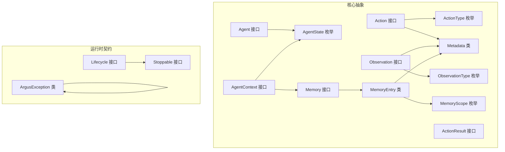
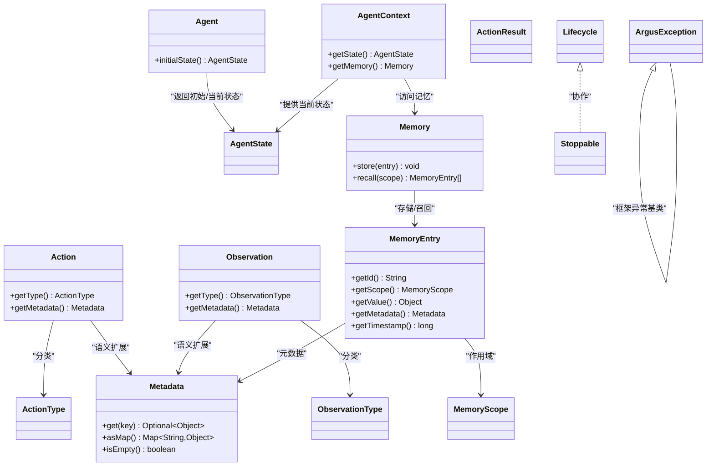
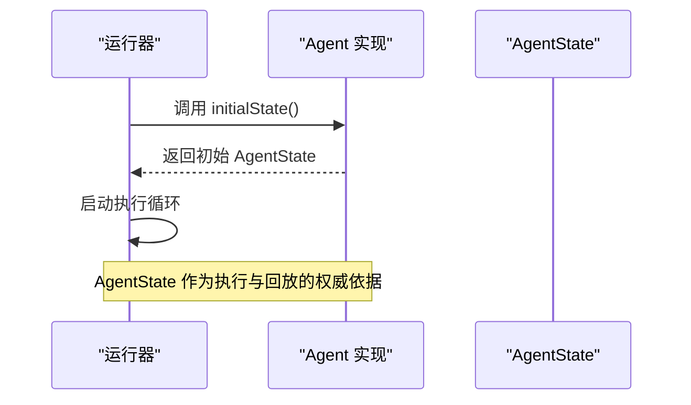
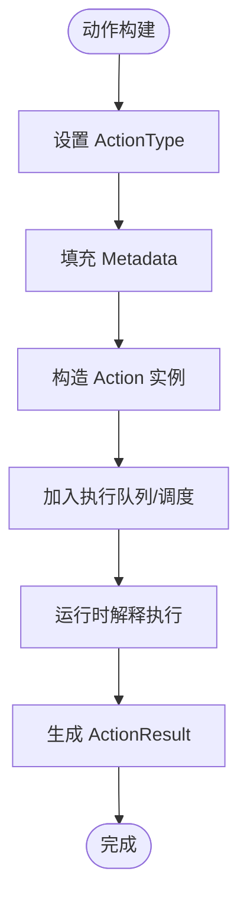
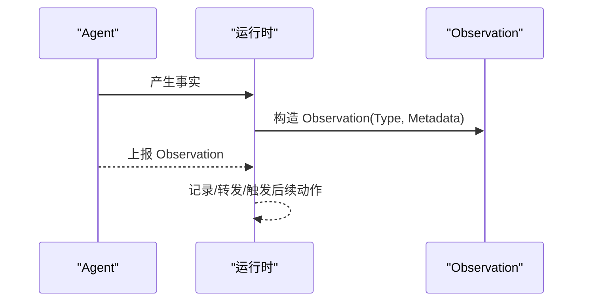
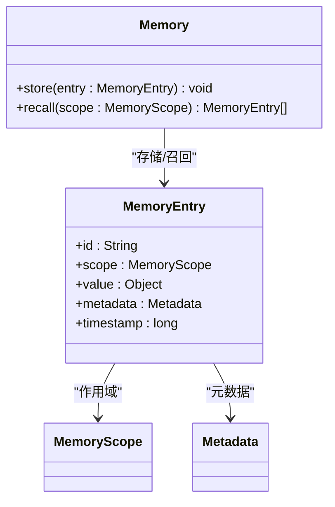
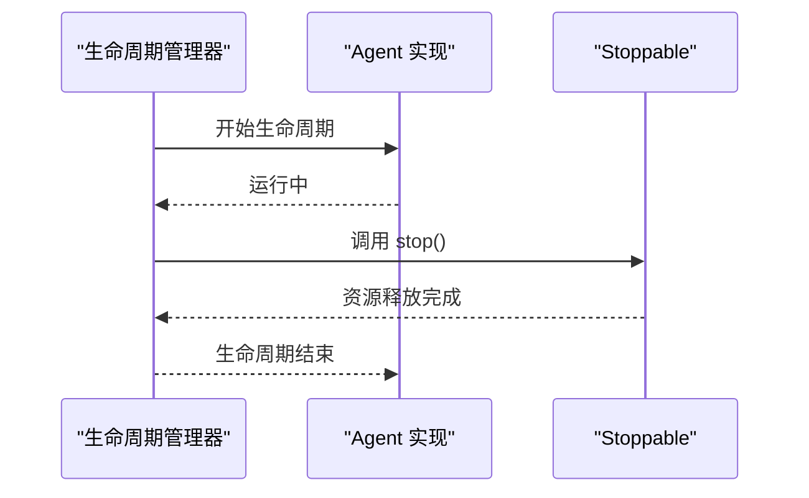
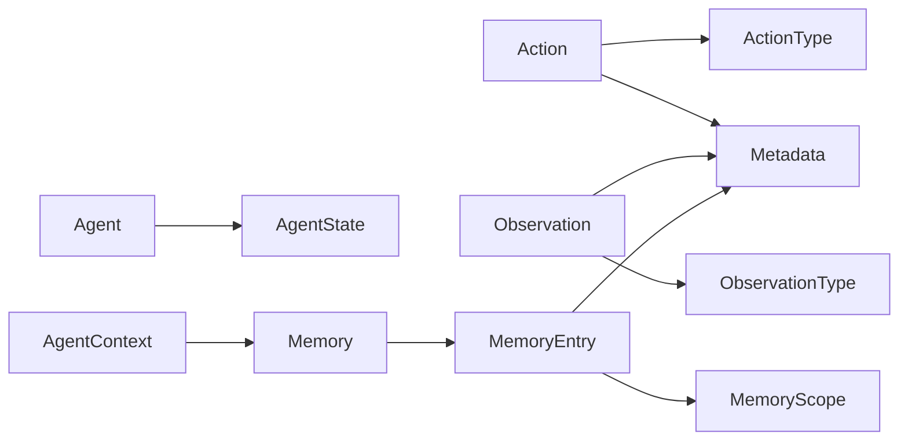

# argus-core 核心模块

<cite>
**本文引用的文件**
- [Agent.java](file://argus-core/src/main/java/io/argus/core/agent/Agent.java)
- [AgentContext.java](file://argus-core/src/main/java/io/argus/core/agent/AgentContext.java)
- [AgentState.java](file://argus-core/src/main/java/io/argus/core/agent/AgentState.java)
- [Action.java](file://argus-core/src/main/java/io/argus/core/action/Action.java)
- [ActionType.java](file://argus-core/src/main/java/io/argus/core/action/ActionType.java)
- [ActionResult.java](file://argus-core/src/main/java/io/argus/core/action/ActionResult.java)
- [Observation.java](file://argus-core/src/main/java/io/argus/core/observation/Observation.java)
- [ObservationType.java](file://argus-core/src/main/java/io/argus/core/observation/ObservationType.java)
- [Memory.java](file://argus-core/src/main/java/io/argus/core/memory/Memory.java)
- [MemoryEntry.java](file://argus-core/src/main/java/io/argus/core/memory/MemoryEntry.java)
- [MemoryScope.java](file://argus-core/src/main/java/io/argus/core/memory/MemoryScope.java)
- [Metadata.java](file://argus-core/src/main/java/io/argus/core/model/Metadata.java)
- [ArgusException.java](file://argus-core/src/main/java/io/argus/core/error/ArgusException.java)
- [Lifecycle.java](file://argus-core/src/main/java/io/argus/core/lifecycle/Lifecycle.java)
- [Stoppable.java](file://argus-core/src/main/java/io/argus/core/lifecycle/Stoppable.java)
</cite>

## 目录
1. 引言
2. 项目结构
3. 核心组件
4. 架构总览
5. 组件详解
6. 依赖关系分析
7. 性能考量
8. 故障排查指南
9. 结论
10. 附录

## 引言
argus-core 是整个 Argus 框架的基础模块，定义了代理（Agent）、动作（Action）、观测（Observation）、记忆（Memory）、元数据（Metadata）、生命周期（Lifecycle）等关键抽象，以及异常与错误处理的基本约定。其设计理念强调“意图与实现分离”“事实与决策分离”“不可变状态快照”“可审计的执行历史”。本文将从架构、组件职责、数据流、处理逻辑、集成点、错误处理与生命周期管理等方面，系统性解读 argus-core 的设计与实现要点，并给出使用路径与最佳实践指引。

## 项目结构
argus-core 模块采用按领域分层的包组织方式：
- agent：代理接口、上下文、状态与循环结果
- action：动作接口、动作类型与动作结果
- observation：观测接口与观测类型
- memory：记忆接口、记忆条目与作用域
- model：通用模型（标识符、时间戳、元数据）
- error：异常体系
- lifecycle：生命周期与可停止接口
- audit：审计事件（在 core 中提供基础类型，具体实现在其他模块）

图表来源
- [Agent.java](file://argus-core/src/main/java/io/argus/core/agent/Agent.java#L1-L11)
- [AgentContext.java](file://argus-core/src/main/java/io/argus/core/agent/AgentContext.java#L1-L98)
- [AgentState.java](file://argus-core/src/main/java/io/argus/core/agent/AgentState.java#L1-L81)
- [Action.java](file://argus-core/src/main/java/io/argus/core/action/Action.java#L1-L43)
- [ActionType.java](file://argus-core/src/main/java/io/argus/core/action/ActionType.java#L1-L143)
- [ActionResult.java](file://argus-core/src/main/java/io/argus/core/action/ActionResult.java#L1-L8)
- [Observation.java](file://argus-core/src/main/java/io/argus/core/observation/Observation.java#L1-L37)
- [ObservationType.java](file://argus-core/src/main/java/io/argus/core/observation/ObservationType.java#L1-L117)
- [Memory.java](file://argus-core/src/main/java/io/argus/core/memory/Memory.java#L1-L15)
- [MemoryEntry.java](file://argus-core/src/main/java/io/argus/core/memory/MemoryEntry.java#L1-L53)
- [MemoryScope.java](file://argus-core/src/main/java/io/argus/core/memory/MemoryScope.java#L1-L8)
- [Metadata.java](file://argus-core/src/main/java/io/argus/core/model/Metadata.java#L1-L34)
- [Lifecycle.java](file://argus-core/src/main/java/io/argus/core/lifecycle/Lifecycle.java#L1-L8)
- [Stoppable.java](file://argus-core/src/main/java/io/argus/core/lifecycle/Stoppable.java#L1-L8)
- [ArgusException.java](file://argus-core/src/main/java/io/argus/core/error/ArgusException.java#L1-L8)

章节来源
- [Agent.java](file://argus-core/src/main/java/io/argus/core/agent/Agent.java#L1-L11)
- [AgentContext.java](file://argus-core/src/main/java/io/argus/core/agent/AgentContext.java#L1-L98)
- [Action.java](file://argus-core/src/main/java/io/argus/core/action/Action.java#L1-L43)
- [Observation.java](file://argus-core/src/main/java/io/argus/core/observation/Observation.java#L1-L37)
- [Memory.java](file://argus-core/src/main/java/io/argus/core/memory/Memory.java#L1-L15)
- [Metadata.java](file://argus-core/src/main/java/io/argus/core/model/Metadata.java#L1-L34)
- [Lifecycle.java](file://argus-core/src/main/java/io/argus/core/lifecycle/Lifecycle.java#L1-L8)
- [Stoppable.java](file://argus-core/src/main/java/io/argus/core/lifecycle/Stoppable.java#L1-L8)
- [ArgusException.java](file://argus-core/src/main/java/io/argus/core/error/ArgusException.java#L1-L8)

## 核心组件
本节对核心抽象进行概览式说明，后续章节将深入每个组件的设计与实现。

- 代理（Agent）：定义初始状态入口，提供 AgentState 以驱动执行循环。
- 执行上下文（AgentContext）：可变的运行期工作区，承载临时推理缓冲、外部客户端、速率限制器等；严禁存放权威状态。
- 动作（Action）：声明式意图表示，通过 ActionType 分类，通过 Metadata 承载额外语义。
- 观测（Observation）：不可变事实表达，通过 ObservationType 分类，通过 Metadata 提供上下文。
- 记忆（Memory）：以 MemoryEntry 为单位存储与召回，受 MemoryScope 控制。
- 元数据（Metadata）：不可变键值容器，提供类型安全的查询与只读视图。
- 生命周期（Lifecycle/ Stoppable）：统一的启动/停止生命周期管理契约。
- 错误（ArgusException）：框架异常基类，用于统一异常传播与处理。

章节来源
- [Agent.java](file://argus-core/src/main/java/io/argus/core/agent/Agent.java#L1-L11)
- [AgentContext.java](file://argus-core/src/main/java/io/argus/core/agent/AgentContext.java#L1-L98)
- [Action.java](file://argus-core/src/main/java/io/argus/core/action/Action.java#L1-L43)
- [Observation.java](file://argus-core/src/main/java/io/argus/core/observation/Observation.java#L1-L37)
- [Memory.java](file://argus-core/src/main/java/io/argus/core/memory/Memory.java#L1-L15)
- [Metadata.java](file://argus-core/src/main/java/io/argus/core/model/Metadata.java#L1-L34)
- [Lifecycle.java](file://argus-core/src/main/java/io/argus/core/lifecycle/Lifecycle.java#L1-L8)
- [Stoppable.java](file://argus-core/src/main/java/io/argus/core/lifecycle/Stoppable.java#L1-L8)
- [ArgusException.java](file://argus-core/src/main/java/io/argus/core/error/ArgusException.java#L1-L8)

## 架构总览
下图展示了核心模块的类关系与依赖方向，体现“意图/事实/状态/上下文”的清晰边界与协作方式。

图表来源
- [Agent.java](file://argus-core/src/main/java/io/argus/core/agent/Agent.java#L1-L11)
- [AgentContext.java](file://argus-core/src/main/java/io/argus/core/agent/AgentContext.java#L1-L98)
- [Action.java](file://argus-core/src/main/java/io/argus/core/action/Action.java#L1-L43)
- [Observation.java](file://argus-core/src/main/java/io/argus/core/observation/Observation.java#L1-L37)
- [Memory.java](file://argus-core/src/main/java/io/argus/core/memory/Memory.java#L1-L15)
- [MemoryEntry.java](file://argus-core/src/main/java/io/argus/core/memory/MemoryEntry.java#L1-L53)
- [Metadata.java](file://argus-core/src/main/java/io/argus/core/model/Metadata.java#L1-L34)
- [Lifecycle.java](file://argus-core/src/main/java/io/argus/core/lifecycle/Lifecycle.java#L1-L8)
- [Stoppable.java](file://argus-core/src/main/java/io/argus/core/lifecycle/Stoppable.java#L1-L8)
- [ArgusException.java](file://argus-core/src/main/java/io/argus/core/error/ArgusException.java#L1-L8)

## 组件详解

### Agent 接口与 initialState 设计
- 设计理念
  - Agent 仅暴露“初始状态”入口，避免在接口中内嵌执行逻辑或协议细节。
  - 初始状态由 AgentState 描述，确保可重放、可审计、可分支。
- 实现要求
  - initialState() 返回的 AgentState 必须满足不可变契约，且为完整快照。
  - 任何状态变更必须产生新实例，禁止原地修改。
- 使用建议
  - 在实现类中集中初始化内部状态、配置与默认值。
  - 将“可回放”的信息放入 AgentState，将“瞬时”的中间结果放入 AgentContext。

图表来源
- [Agent.java](file://argus-core/src/main/java/io/argus/core/agent/Agent.java#L1-L11)
- [AgentState.java](file://argus-core/src/main/java/io/argus/core/agent/AgentState.java#L1-L81)

章节来源
- [Agent.java](file://argus-core/src/main/java/io/argus/core/agent/Agent.java#L1-L11)
- [AgentState.java](file://argus-core/src/main/java/io/argus/core/agent/AgentState.java#L1-L81)

### Action 系统：意图建模与类型安全
- Action 接口
  - 仅声明意图类别与附加元数据，不包含执行细节。
  - 通过 ActionType 进行高层语义分类，通过 Metadata 承载领域特定信息。
- ActionType 枚举
  - 包含 DECIDE、REQUEST、FETCH、TRANSFORM、STORE、EMIT 等高阶意图类别。
  - 二级及更细粒度语义通过 Metadata 表达，避免扩展枚举。
- ActionResult
  - 动作结果的类型安全载体，用于封装执行后的产出或状态。
- 最佳实践
  - 动作实现保持无副作用、可重复可回放。
  - 使用 Metadata 传递协议无关的参数与上下文。

图表来源
- [Action.java](file://argus-core/src/main/java/io/argus/core/action/Action.java#L1-L43)
- [ActionType.java](file://argus-core/src/main/java/io/argus/core/action/ActionType.java#L1-L143)
- [ActionResult.java](file://argus-core/src/main/java/io/argus/core/action/ActionResult.java#L1-L8)
- [Metadata.java](file://argus-core/src/main/java/io/argus/core/model/Metadata.java#L1-L34)

章节来源
- [Action.java](file://argus-core/src/main/java/io/argus/core/action/Action.java#L1-L43)
- [ActionType.java](file://argus-core/src/main/java/io/argus/core/action/ActionType.java#L1-L143)
- [ActionResult.java](file://argus-core/src/main/java/io/argus/core/action/ActionResult.java#L1-L8)
- [Metadata.java](file://argus-core/src/main/java/io/argus/core/model/Metadata.java#L1-L34)

### Observation 系统：事实建模与分类
- Observation 接口
  - 表达“已发生的事实”，不可变，不包含行为指令。
  - 通过 ObservationType 分类，通过 Metadata 提供上下文。
- ObservationType 枚举
  - STATE：内部状态变化
  - DATA：原始/结构化数据
  - RESPONSE：对先前动作的响应
  - ERROR：可观测到的错误/失败
  - EVENT：外部/异步事件
- 最佳实践
  - 观测必须是“事实”，而非“指令”；错误也应以事实形式记录以便审计。
  - 使用 Metadata 传达来源、格式、编码等实现细节。

图表来源
- [Observation.java](file://argus-core/src/main/java/io/argus/core/observation/Observation.java#L1-L37)
- [ObservationType.java](file://argus-core/src/main/java/io/argus/core/observation/ObservationType.java#L1-L117)
- [Metadata.java](file://argus-core/src/main/java/io/argus/core/model/Metadata.java#L1-L34)

章节来源
- [Observation.java](file://argus-core/src/main/java/io/argus/core/observation/Observation.java#L1-L37)
- [ObservationType.java](file://argus-core/src/main/java/io/argus/core/observation/ObservationType.java#L1-L117)
- [Metadata.java](file://argus-core/src/main/java/io/argus/core/model/Metadata.java#L1-L34)

### Memory 管理系统：存储、召回与作用域
- Memory 接口
  - store(MemoryEntry)：持久化/缓存一条记忆
  - recall(MemoryScope)：按作用域召回记忆列表
- MemoryEntry 数据结构
  - 字段：id、scope、value、metadata、timestamp
  - 语义：不可变事实单元，便于审计与回放
- MemoryScope 作用域
  - 用于控制召回范围（如会话级、全局级、任务级等），由实现定义
- 最佳实践
  - 将权威状态与可审计的历史放入 MemoryEntry，配合 Metadata 记录来源与语义。
  - 回放时仅依赖已记录的记忆与 LoopResult，避免依赖外部上下文。

图表来源
- [Memory.java](file://argus-core/src/main/java/io/argus/core/memory/Memory.java#L1-L15)
- [MemoryEntry.java](file://argus-core/src/main/java/io/argus/core/memory/MemoryEntry.java#L1-L53)
- [MemoryScope.java](file://argus-core/src/main/java/io/argus/core/memory/MemoryScope.java#L1-L8)
- [Metadata.java](file://argus-core/src/main/java/io/argus/core/model/Metadata.java#L1-L34)

章节来源
- [Memory.java](file://argus-core/src/main/java/io/argus/core/memory/Memory.java#L1-L15)
- [MemoryEntry.java](file://argus-core/src/main/java/io/argus/core/memory/MemoryEntry.java#L1-L53)
- [MemoryScope.java](file://argus-core/src/main/java/io/argus/core/memory/MemoryScope.java#L1-L8)
- [Metadata.java](file://argus-core/src/main/java/io/argus/core/model/Metadata.java#L1-L34)

### 错误处理机制：ArgusException 体系与传播策略
- ArgusException
  - 作为框架异常基类，用于统一异常识别与传播。
  - 建议子类覆盖错误码、消息模板与上下文字段，便于审计与诊断。
- 异常传播策略
  - 在 Agent 执行链路中，优先将错误转化为 Observation(ERROR)，保留事实性与可审计性。
  - 对于不可恢复的运行时错误，再提升为 ArgusException 并向上抛出。
- 最佳实践
  - 避免吞掉异常；将错误包装为可理解的 Observation 或异常。
  - 在审计日志中记录异常上下文（如 Action、Observation、AgentState 快照）。

章节来源
- [ArgusException.java](file://argus-core/src/main/java/io/argus/core/error/ArgusException.java#L1-L8)

### 生命周期管理：Lifecycle 与 Stoppable 协作
- Lifecycle 接口
  - 定义代理生命周期阶段与钩子，便于统一启动/停止/重启流程。
- Stoppable 接口
  - 提供显式的停止能力，确保资源释放与状态一致性。
- 协作模式
  - 在 Lifecycle 的停止阶段调用 Stoppable.stop()，保证有序关闭。
  - 将资源清理逻辑集中在 Stoppable 实现中，避免泄漏。

图表来源
- [Lifecycle.java](file://argus-core/src/main/java/io/argus/core/lifecycle/Lifecycle.java#L1-L8)
- [Stoppable.java](file://argus-core/src/main/java/io/argus/core/lifecycle/Stoppable.java#L1-L8)

章节来源
- [Lifecycle.java](file://argus-core/src/main/java/io/argus/core/lifecycle/Lifecycle.java#L1-L8)
- [Stoppable.java](file://argus-core/src/main/java/io/argus/core/lifecycle/Stoppable.java#L1-L8)

### 元数据（Metadata）：类型安全与只读视图
- 设计要点
  - 不可变 Map 容器，提供 Optional 查询与只读视图。
  - 适合作为 Action/Observation/MemoryEntry 的语义扩展。
- 使用建议
  - 通过 Metadata 传递协议无关的键值对，避免在类型枚举中硬编码细节。
  - 对敏感信息进行脱敏或加密存储（由上层模块负责）。

章节来源
- [Metadata.java](file://argus-core/src/main/java/io/argus/core/model/Metadata.java#L1-L34)

## 依赖关系分析
- 松耦合与高内聚
  - Action/Observation 与具体实现解耦，通过枚举与元数据传递语义。
  - Memory 与 MemoryEntry 解耦，通过作用域控制召回范围。
- 关键依赖链
  - Agent -> AgentState：状态权威来源
  - AgentContext -> Memory：非权威临时存储访问
  - Action -> ActionType/Metadata：意图与语义
  - Observation -> ObservationType/Metadata：事实与上下文
  - MemoryEntry -> MemoryScope/Metadata：条目与作用域/元数据
- 循环依赖规避
  - 通过接口与不可变数据结构避免循环引用；运行时由具体实现装配。

图表来源
- [Agent.java](file://argus-core/src/main/java/io/argus/core/agent/Agent.java#L1-L11)
- [AgentContext.java](file://argus-core/src/main/java/io/argus/core/agent/AgentContext.java#L1-L98)
- [Action.java](file://argus-core/src/main/java/io/argus/core/action/Action.java#L1-L43)
- [Observation.java](file://argus-core/src/main/java/io/argus/core/observation/Observation.java#L1-L37)
- [Memory.java](file://argus-core/src/main/java/io/argus/core/memory/Memory.java#L1-L15)
- [MemoryEntry.java](file://argus-core/src/main/java/io/argus/core/memory/MemoryEntry.java#L1-L53)
- [Metadata.java](file://argus-core/src/main/java/io/argus/core/model/Metadata.java#L1-L34)

章节来源
- [Agent.java](file://argus-core/src/main/java/io/argus/core/agent/Agent.java#L1-L11)
- [AgentContext.java](file://argus-core/src/main/java/io/argus/core/agent/AgentContext.java#L1-L98)
- [Action.java](file://argus-core/src/main/java/io/argus/core/action/Action.java#L1-L43)
- [Observation.java](file://argus-core/src/main/java/io/argus/core/observation/Observation.java#L1-L37)
- [Memory.java](file://argus-core/src/main/java/io/argus/core/memory/Memory.java#L1-L15)
- [MemoryEntry.java](file://argus-core/src/main/java/io/argus/core/memory/MemoryEntry.java#L1-L53)
- [Metadata.java](file://argus-core/src/main/java/io/argus/core/model/Metadata.java#L1-L34)

## 性能考量
- 不可变性与复制成本
  - AgentState 与 MemoryEntry 的不可变设计有利于并发与回放，但需关注复制与序列化开销。
  - 建议对热点字段采用轻量级不可变容器，必要时进行批量序列化优化。
- 记忆召回与过滤
  - recall(scope) 应基于索引或分区策略，避免全表扫描。
  - 对高频查询建立二级索引（如按 id、timestamp、scope 维度）。
- 元数据访问
  - Metadata 为只读视图，查询复杂度 O(1)，但键数量过多时注意内存占用。
- 生命周期与资源回收
  - Stoppable 的 stop() 应幂等且快速，避免阻塞生命周期结束。
- 异常处理
  - 将错误转为 Observation 可减少异常栈传播成本，提高稳定性。

## 故障排查指南
- 常见问题定位
  - 状态不一致：检查 AgentState 是否被原地修改，是否依赖 AgentContext 存储权威状态。
  - 记忆缺失：确认 MemoryScope 是否匹配，recall 调用是否在正确的执行阶段。
  - 动作未生效：核对 Action 的 ActionType 与 Metadata 是否正确，运行时是否支持该类型。
  - 观测丢失：确认 Observation 的类型与元数据是否完整，是否被过滤或丢弃。
- 日志与审计
  - 将关键 Action、Observation、MemoryEntry 与 AgentState 快照纳入审计日志。
  - 使用 ArgusException 记录错误上下文，便于回溯。
- 诊断工具建议
  - 提供状态快照导出与回放工具，验证确定性与可重现性。

章节来源
- [AgentState.java](file://argus-core/src/main/java/io/argus/core/agent/AgentState.java#L1-L81)
- [Memory.java](file://argus-core/src/main/java/io/argus/core/memory/Memory.java#L1-L15)
- [Action.java](file://argus-core/src/main/java/io/argus/core/action/Action.java#L1-L43)
- [Observation.java](file://argus-core/src/main/java/io/argus/core/observation/Observation.java#L1-L37)
- [ArgusException.java](file://argus-core/src/main/java/io/argus/core/error/ArgusException.java#L1-L8)

## 结论
argus-core 通过一组强约束的抽象与契约，建立了“意图/事实/状态/上下文”的清晰边界，既保证了执行的确定性与可审计性，又为上层模块提供了灵活的扩展空间。遵循本文档中的设计原则与最佳实践，可在不牺牲性能与可维护性的前提下，构建稳定可靠的智能体系统。

## 附录
- 使用路径参考（以“代码片段路径”形式提供，避免直接粘贴代码）
  - 初始化代理状态：[Agent.initialState()](file://argus-core/src/main/java/io/argus/core/agent/Agent.java#L1-L11)
  - 获取当前状态与记忆：[AgentContext.getState()/getMemory()](file://argus-core/src/main/java/io/argus/core/agent/AgentContext.java#L1-L98)
  - 构造动作与类型分类：[Action 接口与 ActionType 枚举](file://argus-core/src/main/java/io/argus/core/action/Action.java#L1-L43), [ActionType](file://argus-core/src/main/java/io/argus/core/action/ActionType.java#L1-L143)
  - 观测事实与错误：[Observation 接口与 ObservationType 枚举](file://argus-core/src/main/java/io/argus/core/observation/Observation.java#L1-L37), [ObservationType](file://argus-core/src/main/java/io/argus/core/observation/ObservationType.java#L1-L117)
  - 记忆存储与召回：[Memory 接口与 MemoryEntry](file://argus-core/src/main/java/io/argus/core/memory/Memory.java#L1-L15), [MemoryEntry](file://argus-core/src/main/java/io/argus/core/memory/MemoryEntry.java#L1-L53)
  - 元数据访问与只读视图：[Metadata](file://argus-core/src/main/java/io/argus/core/model/Metadata.java#L1-L34)
  - 生命周期与停止：[Lifecycle 与 Stoppable](file://argus-core/src/main/java/io/argus/core/lifecycle/Lifecycle.java#L1-L8), [Stoppable](file://argus-core/src/main/java/io/argus/core/lifecycle/Stoppable.java#L1-L8)
  - 异常基类：[ArgusException](file://argus-core/src/main/java/io/argus/core/error/ArgusException.java#L1-L8)