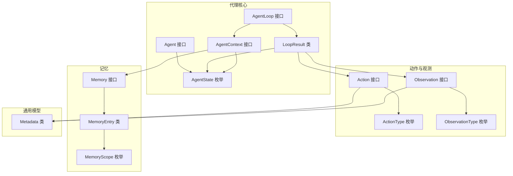
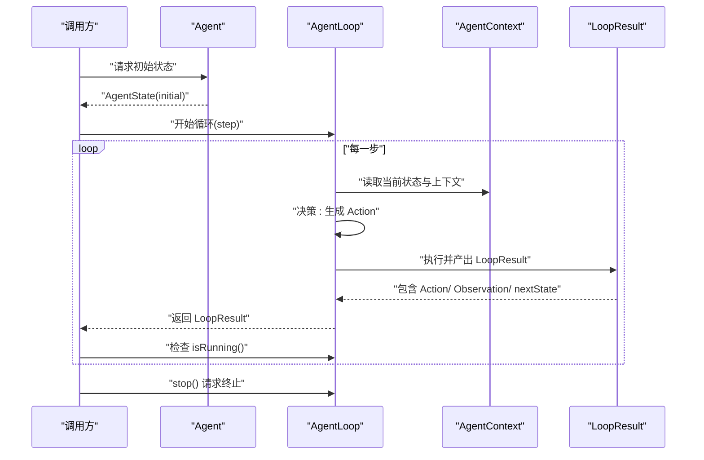
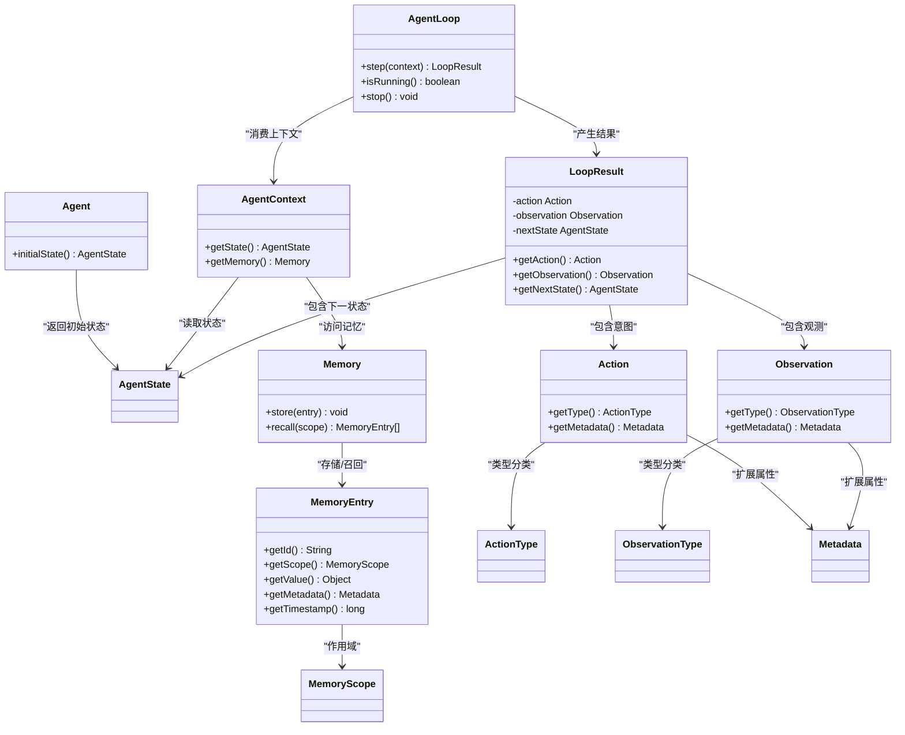

# 代理系统

<cite>
**本文引用的文件**
- [Agent.java](file://argus-core/src/main/java/io/argus/core/agent/Agent.java)
- [AgentLoop.java](file://argus-core/src/main/java/io/argus/core/agent/AgentLoop.java)
- [AgentState.java](file://argus-core/src/main/java/io/argus/core/agent/AgentState.java)
- [AgentContext.java](file://argus-core/src/main/java/io/argus/core/agent/AgentContext.java)
- [LoopResult.java](file://argus-core/src/main/java/io/argus/core/agent/LoopResult.java)
- [Action.java](file://argus-core/src/main/java/io/argus/core/action/Action.java)
- [ActionType.java](file://argus-core/src/main/java/io/argus/core/action/ActionType.java)
- [Observation.java](file://argus-core/src/main/java/io/argus/core/observation/Observation.java)
- [ObservationType.java](file://argus-core/src/main/java/io/argus/core/observation/ObservationType.java)
- [Memory.java](file://argus-core/src/main/java/io/argus/core/memory/Memory.java)
- [MemoryEntry.java](file://argus-core/src/main/java/io/argus/core/memory/MemoryEntry.java)
- [MemoryScope.java](file://argus-core/src/main/java/io/argus/core/memory/MemoryScope.java)
- [Metadata.java](file://argus-core/src/main/java/io/argus/core/model/Metadata.java)
</cite>

## 目录
1. [引言](#引言)
2. [项目结构](#项目结构)
3. [核心组件](#核心组件)
4. [架构总览](#架构总览)
5. [详细组件分析](#详细组件分析)
6. [依赖关系分析](#依赖关系分析)
7. [性能考量](#性能考量)
8. [故障排查指南](#故障排查指南)
9. [结论](#结论)
10. [附录](#附录)

## 引言
本文件系统性阐述代理系统的架构与实现要点，围绕以下主题展开：Agent 接口的设计理念与 initialState() 的职责边界；AgentLoop 执行循环的单步执行机制、状态转换与循环控制策略；AgentState 的不可变性设计与快照语义；AgentContext 的上下文职责与生命周期；LoopResult 的结果封装与回放契约；以及基于上述抽象的实现模式与最佳实践。

## 项目结构
代理系统位于 argus-core 模块中，采用按领域分层的组织方式：
- agent 包：定义代理核心抽象（Agent、AgentLoop、AgentState、AgentContext、LoopResult）
- action 包：定义动作意图（Action、ActionType）
- observation 包：定义观测事实（Observation、ObservationType）
- memory 包：定义记忆接口与条目（Memory、MemoryEntry、MemoryScope）
- model 包：通用模型（Metadata）

图表来源
- [Agent.java](file://argus-core/src/main/java/io/argus/core/agent/Agent.java#L1-L11)
- [AgentLoop.java](file://argus-core/src/main/java/io/argus/core/agent/AgentLoop.java#L1-L118)
- [AgentState.java](file://argus-core/src/main/java/io/argus/core/agent/AgentState.java#L1-L81)
- [AgentContext.java](file://argus-core/src/main/java/io/argus/core/agent/AgentContext.java#L1-L98)
- [LoopResult.java](file://argus-core/src/main/java/io/argus/core/agent/LoopResult.java#L1-L115)
- [Action.java](file://argus-core/src/main/java/io/argus/core/action/Action.java#L1-L43)
- [ActionType.java](file://argus-core/src/main/java/io/argus/core/action/ActionType.java#L1-L143)
- [Observation.java](file://argus-core/src/main/java/io/argus/core/observation/Observation.java#L1-L37)
- [ObservationType.java](file://argus-core/src/main/java/io/argus/core/observation/ObservationType.java#L48-L117)
- [Memory.java](file://argus-core/src/main/java/io/argus/core/memory/Memory.java#L1-L15)
- [MemoryEntry.java](file://argus-core/src/main/java/io/argus/core/memory/MemoryEntry.java#L1-L53)
- [MemoryScope.java](file://argus-core/src/main/java/io/argus/core/memory/MemoryScope.java#L1-L8)
- [Metadata.java](file://argus-core/src/main/java/io/argus/core/model/Metadata.java#L1-L34)

章节来源
- [Agent.java](file://argus-core/src/main/java/io/argus/core/agent/Agent.java#L1-L11)
- [AgentLoop.java](file://argus-core/src/main/java/io/argus/core/agent/AgentLoop.java#L1-L118)
- [AgentState.java](file://argus-core/src/main/java/io/argus/core/agent/AgentState.java#L1-L81)
- [AgentContext.java](file://argus-core/src/main/java/io/argus/core/agent/AgentContext.java#L1-L98)
- [LoopResult.java](file://argus-core/src/main/java/io/argus/core/agent/LoopResult.java#L1-L115)
- [Action.java](file://argus-core/src/main/java/io/argus/core/action/Action.java#L1-L43)
- [ActionType.java](file://argus-core/src/main/java/io/argus/core/action/ActionType.java#L1-L143)
- [Observation.java](file://argus-core/src/main/java/io/argus/core/observation/Observation.java#L1-L37)
- [ObservationType.java](file://argus-core/src/main/java/io/argus/core/observation/ObservationType.java#L48-L117)
- [Memory.java](file://argus-core/src/main/java/io/argus/core/memory/Memory.java#L1-L15)
- [MemoryEntry.java](file://argus-core/src/main/java/io/argus/core/memory/MemoryEntry.java#L1-L53)
- [MemoryScope.java](file://argus-core/src/main/java/io/argus/core/memory/MemoryScope.java#L1-L8)
- [Metadata.java](file://argus-core/src/main/java/io/argus/core/model/Metadata.java#L1-L34)

## 核心组件
本节聚焦代理系统的关键抽象及其职责边界与契约。

- Agent 接口
  - 职责：定义代理的初始状态入口，返回 AgentState 的快照。
  - 关键点：initialState() 提供可重放的起点，确保后续回放与审计的确定性。
  - 参考路径：[Agent.initialState()](file://argus-core/src/main/java/io/argus/core/agent/Agent.java#L9-L9)

- AgentLoop 接口
  - 职责：定义单步执行模型，推进代理状态到下一个 AgentState。
  - 关键点：step(context) 返回 LoopResult；isRunning() 控制循环；stop() 请求终止。
  - 参考路径：[AgentLoop.step](file://argus-core/src/main/java/io/argus/core/agent/AgentLoop.java#L89-L89)，[AgentLoop.isRunning](file://argus-core/src/main/java/io/argus/core/agent/AgentLoop.java#L102-L102)，[AgentLoop.stop](file://argus-core/src/main/java/io/argus/core/agent/AgentLoop.java#L116-L116)

- AgentState 枚举
  - 职责：表示代理在某时刻的完整逻辑快照，强调不可变性与自包含性。
  - 关键点：每次状态转换必须产出新实例；回放时仅依赖 LoopResult 序列重建。
  - 参考路径：[AgentState 不可变性与快照语义](file://argus-core/src/main/java/io/argus/core/agent/AgentState.java#L11-L37)

- AgentContext 接口
  - 职责：提供可变的执行上下文，承载推理缓冲、外部客户端、限流器等瞬态资源。
  - 关键点：禁止将权威状态放入上下文；回放时上下文可为空或无操作实现。
  - 参考路径：[AgentContext 边界与职责](file://argus-core/src/main/java/io/argus/core/agent/AgentContext.java#L25-L54)

- LoopResult 结果封装
  - 职责：不可变记录一次决策周期的意图、观测与状态转移，支撑确定性回放。
  - 关键点：不可嵌入可执行逻辑；回放时不得触发外部副作用。
  - 参考路径：[LoopResult 不可变与回放契约](file://argus-core/src/main/java/io/argus/core/agent/LoopResult.java#L17-L58)

- Action 与 Observation
  - 职责：分别表达代理的意图与观测事实，二者均通过类型与元数据表达语义。
  - 关键点：类型定义高层语义，细节通过 Metadata 扩展。
  - 参考路径：[Action 与 ActionType](file://argus-core/src/main/java/io/argus/core/action/Action.java#L1-L43)，[ActionType](file://argus-core/src/main/java/io/argus/core/action/ActionType.java#L1-L143)，[Observation 与 ObservationType](file://argus-core/src/main/java/io/argus/core/observation/Observation.java#L1-L37)，[ObservationType](file://argus-core/src/main/java/io/argus/core/observation/ObservationType.java#L48-L117)

- Memory 与 MemoryEntry
  - 职责：提供非权威的记忆存取能力，支持按作用域召回与存储。
  - 关键点：MemoryEntry 为不可变条目，包含标识、范围、值、元数据与时间戳。
  - 参考路径：[Memory](file://argus-core/src/main/java/io/argus/core/memory/Memory.java#L1-L15)，[MemoryEntry](file://argus-core/src/main/java/io/argus/core/memory/MemoryEntry.java#L1-L53)，[MemoryScope](file://argus-core/src/main/java/io/argus/core/memory/MemoryScope.java#L1-L8)

- Metadata
  - 职责：不可变键值对容器，用于承载扩展语义。
  - 关键点：构造时冻结映射；提供安全访问与只读视图。
  - 参考路径：[Metadata](file://argus-core/src/main/java/io/argus/core/model/Metadata.java#L1-L34)

章节来源
- [Agent.java](file://argus-core/src/main/java/io/argus/core/agent/Agent.java#L1-L11)
- [AgentLoop.java](file://argus-core/src/main/java/io/argus/core/agent/AgentLoop.java#L1-L118)
- [AgentState.java](file://argus-core/src/main/java/io/argus/core/agent/AgentState.java#L1-L81)
- [AgentContext.java](file://argus-core/src/main/java/io/argus/core/agent/AgentContext.java#L1-L98)
- [LoopResult.java](file://argus-core/src/main/java/io/argus/core/agent/LoopResult.java#L1-L115)
- [Action.java](file://argus-core/src/main/java/io/argus/core/action/Action.java#L1-L43)
- [ActionType.java](file://argus-core/src/main/java/io/argus/core/action/ActionType.java#L1-L143)
- [Observation.java](file://argus-core/src/main/java/io/argus/core/observation/Observation.java#L1-L37)
- [ObservationType.java](file://argus-core/src/main/java/io/argus/core/observation/ObservationType.java#L48-L117)
- [Memory.java](file://argus-core/src/main/java/io/argus/core/memory/Memory.java#L1-L15)
- [MemoryEntry.java](file://argus-core/src/main/java/io/argus/core/memory/MemoryEntry.java#L1-L53)
- [MemoryScope.java](file://argus-core/src/main/java/io/argus/core/memory/MemoryScope.java#L1-L8)
- [Metadata.java](file://argus-core/src/main/java/io/argus/core/model/Metadata.java#L1-L34)

## 架构总览
代理系统采用“状态不可变 + 上下文可变”的双轨设计：
- 状态轨道：AgentState 为权威快照，状态转换通过不可变对象链路传递。
- 上下文轨道：AgentContext 为瞬态工作区，承载推理与外部交互，但不参与回放。
- 循环轨道：AgentLoop 将“意图-观测-状态”三元组以 LoopResult 形式固化，形成可审计、可回放的执行历史。

图表来源
- [Agent.java](file://argus-core/src/main/java/io/argus/core/agent/Agent.java#L9-L9)
- [AgentLoop.java](file://argus-core/src/main/java/io/argus/core/agent/AgentLoop.java#L51-L116)
- [AgentContext.java](file://argus-core/src/main/java/io/argus/core/agent/AgentContext.java#L92-L98)
- [LoopResult.java](file://argus-core/src/main/java/io/argus/core/agent/LoopResult.java#L78-L114)

## 详细组件分析

### Agent 接口与 initialState() 设计
- 设计理念
  - initialState() 作为代理的“确定性起点”，返回的 AgentState 必须是完全自包含的快照。
  - 任何影响未来行为的信息都必须体现在 AgentState 或 LoopResult 中，避免隐藏状态。
- 实现模式
  - 代理实现类应将所有必要状态（如计划、记忆索引、计数器等）编码为不可变结构。
  - 初始状态应与外部系统解耦，确保跨环境可重放。
- 最佳实践
  - 使用 Metadata 承载领域细节，而非在 AgentState 中硬编码。
  - 避免在 initialState() 中触发副作用或依赖随机源。
- 参考路径
  - [Agent.initialState](file://argus-core/src/main/java/io/argus/core/agent/Agent.java#L9-L9)
  - [AgentState 不可变性与快照语义](file://argus-core/src/main/java/io/argus/core/agent/AgentState.java#L11-L37)

章节来源
- [Agent.java](file://argus-core/src/main/java/io/argus/core/agent/Agent.java#L1-L11)
- [AgentState.java](file://argus-core/src/main/java/io/argus/core/agent/AgentState.java#L1-L81)

### AgentLoop 执行循环与单步执行机制
- 单步执行
  - step(AgentContext) 是原子决策单元：评估上下文与状态 → 生成 Action → 获取 Observation → 进入新 AgentState。
  - 每次 step 必须是确定性的、可观测的、可审计的，且不得包含无界循环。
- 状态转换逻辑
  - 通过 LoopResult.nextState 指明下一步状态；状态转换必须产生新实例，保持不可变性。
- 循环控制策略
  - isRunning() 用于判断是否继续；stop() 发出终止信号，实现可选择优雅关闭。
- 参考路径
  - [AgentLoop.step](file://argus-core/src/main/java/io/argus/core/agent/AgentLoop.java#L51-L88)
  - [AgentLoop.isRunning](file://argus-core/src/main/java/io/argus/core/agent/AgentLoop.java#L91-L101)
  - [AgentLoop.stop](file://argus-core/src/main/java/io/argus/core/agent/AgentLoop.java#L104-L116)
  - [LoopResult.getNextState](file://argus-core/src/main/java/io/argus/core/agent/LoopResult.java#L110-L112)

章节来源
- [AgentLoop.java](file://argus-core/src/main/java/io/argus/core/agent/AgentLoop.java#L1-L118)
- [LoopResult.java](file://argus-core/src/main/java/io/argus/core/agent/LoopResult.java#L1-L115)

### AgentState 状态管理与不可变性
- 不可变性契约
  - AgentState 必须不可变；不允许暴露修改器；状态变更必须返回新实例。
- 快照机制
  - 每个 AgentState 是完整快照，不依赖历史状态即可解释；支持回放、时间旅行调试与分支。
- 状态查询
  - 回放时仅依赖 LoopResult 序列重建 AgentState，不依赖外部系统或全局状态。
- 参考路径
  - [AgentState 不可变性与快照语义](file://argus-core/src/main/java/io/argus/core/agent/AgentState.java#L11-L48)

章节来源
- [AgentState.java](file://argus-core/src/main/java/io/argus/core/agent/AgentState.java#L1-L81)

### AgentContext 上下文管理
- 职责边界
  - 上下文是可变的、瞬态的工作区，用于推理缓冲、外部客户端、限流器、追踪与日志等。
  - 禁止将权威状态或不可逆决策放入上下文；回放时上下文可为空或无操作实现。
- 生命周期管理
  - 仅在实时执行期间存在；回放阶段不应依赖上下文中的值。
- 参考路径
  - [AgentContext.getState](file://argus-core/src/main/java/io/argus/core/agent/AgentContext.java#L94-L94)
  - [AgentContext.getMemory](file://argus-core/src/main/java/io/argus/core/agent/AgentContext.java#L96-L96)
  - [AgentContext 边界与职责](file://argus-core/src/main/java/io/argus/core/agent/AgentContext.java#L25-L54)

章节来源
- [AgentContext.java](file://argus-core/src/main/java/io/argus/core/agent/AgentContext.java#L1-L98)
- [Memory.java](file://argus-core/src/main/java/io/argus/core/memory/Memory.java#L1-L15)

### LoopResult 结果封装与回放契约
- 结构组成
  - 包含 Action、Observation 与 nextState，构成一次完整决策周期的权威记录。
- 不可变与自足
  - LoopResult 必须不可变、自包含，并足以支撑确定性回放。
- 回放语义
  - 给定相同初始 AgentState 与 LoopResult 序列，必须能重现相同的状态转移，且不得重新触发外部副作用。
- 参考路径
  - [LoopResult 构造与字段](file://argus-core/src/main/java/io/argus/core/agent/LoopResult.java#L78-L100)
  - [LoopResult.getters](file://argus-core/src/main/java/io/argus/core/agent/LoopResult.java#L102-L112)
  - [LoopResult 回放契约](file://argus-core/src/main/java/io/argus/core/agent/LoopResult.java#L24-L58)

章节来源
- [LoopResult.java](file://argus-core/src/main/java/io/argus/core/agent/LoopResult.java#L1-L115)

### 动作与观测模型
- Action 与 ActionType
  - 表达代理意图，高层语义由 ActionType 定义，细节通过 Metadata 传递。
- Observation 与 ObservationType
  - 表达代理观测到的事实，错误、响应、数据与事件均有明确类型。
- 参考路径
  - [Action](file://argus-core/src/main/java/io/argus/core/action/Action.java#L1-L43)
  - [ActionType](file://argus-core/src/main/java/io/argus/core/action/ActionType.java#L1-L143)
  - [Observation](file://argus-core/src/main/java/io/argus/core/observation/Observation.java#L1-L37)
  - [ObservationType](file://argus-core/src/main/java/io/argus/core/observation/ObservationType.java#L48-L117)
  - [Metadata](file://argus-core/src/main/java/io/argus/core/model/Metadata.java#L1-L34)

章节来源
- [Action.java](file://argus-core/src/main/java/io/argus/core/action/Action.java#L1-L43)
- [ActionType.java](file://argus-core/src/main/java/io/argus/core/action/ActionType.java#L1-L143)
- [Observation.java](file://argus-core/src/main/java/io/argus/core/observation/Observation.java#L1-L37)
- [ObservationType.java](file://argus-core/src/main/java/io/argus/core/observation/ObservationType.java#L48-L117)
- [Metadata.java](file://argus-core/src/main/java/io/argus/core/model/Metadata.java#L1-L34)

### 记忆与元数据
- Memory 与 MemoryEntry
  - Memory 提供存储与召回能力；MemoryEntry 为不可变条目，包含作用域、值与元数据。
- Metadata
  - 不可变键值容器，用于承载扩展属性，提供安全访问与只读视图。
- 参考路径
  - [Memory](file://argus-core/src/main/java/io/argus/core/memory/Memory.java#L1-L15)
  - [MemoryEntry](file://argus-core/src/main/java/io/argus/core/memory/MemoryEntry.java#L1-L53)
  - [MemoryScope](file://argus-core/src/main/java/io/argus/core/memory/MemoryScope.java#L1-L8)
  - [Metadata](file://argus-core/src/main/java/io/argus/core/model/Metadata.java#L1-L34)

章节来源
- [Memory.java](file://argus-core/src/main/java/io/argus/core/memory/Memory.java#L1-L15)
- [MemoryEntry.java](file://argus-core/src/main/java/io/argus/core/memory/MemoryEntry.java#L1-L53)
- [MemoryScope.java](file://argus-core/src/main/java/io/argus/core/memory/MemoryScope.java#L1-L8)
- [Metadata.java](file://argus-core/src/main/java/io/argus/core/model/Metadata.java#L1-L34)

## 依赖关系分析
代理系统各组件之间的依赖关系如下：

图表来源
- [Agent.java](file://argus-core/src/main/java/io/argus/core/agent/Agent.java#L1-L11)
- [AgentLoop.java](file://argus-core/src/main/java/io/argus/core/agent/AgentLoop.java#L1-L118)
- [AgentState.java](file://argus-core/src/main/java/io/argus/core/agent/AgentState.java#L1-L81)
- [AgentContext.java](file://argus-core/src/main/java/io/argus/core/agent/AgentContext.java#L1-L98)
- [LoopResult.java](file://argus-core/src/main/java/io/argus/core/agent/LoopResult.java#L1-L115)
- [Action.java](file://argus-core/src/main/java/io/argus/core/action/Action.java#L1-L43)
- [Observation.java](file://argus-core/src/main/java/io/argus/core/observation/Observation.java#L1-L37)
- [Memory.java](file://argus-core/src/main/java/io/argus/core/memory/Memory.java#L1-L15)
- [MemoryEntry.java](file://argus-core/src/main/java/io/argus/core/memory/MemoryEntry.java#L1-L53)
- [MemoryScope.java](file://argus-core/src/main/java/io/argus/core/memory/MemoryScope.java#L1-L8)
- [ActionType.java](file://argus-core/src/main/java/io/argus/core/action/ActionType.java#L1-L143)
- [ObservationType.java](file://argus-core/src/main/java/io/argus/core/observation/ObservationType.java#L48-L117)
- [Metadata.java](file://argus-core/src/main/java/io/argus/core/model/Metadata.java#L1-L34)

## 性能考量
- 单步执行的确定性与可观测性要求避免长耗时逻辑在单次 step 中完成；应通过多次 step 表达长时间运行的行为。
- 上下文中的缓存与客户端连接应谨慎使用，避免在回放阶段重复触发外部副作用。
- 回放阶段应尽量减少对外部系统与随机源的依赖，确保被动与引用透明性。

## 故障排查指南
- 回放不一致
  - 检查 LoopResult 是否完整记录了 Action、Observation 与 nextState。
  - 确认 AgentState 的不可变性与自包含性，避免依赖外部状态。
  - 参考路径：[LoopResult 回放契约](file://argus-core/src/main/java/io/argus/core/agent/LoopResult.java#L24-L58)，[AgentState 快照语义](file://argus-core/src/main/java/io/argus/core/agent/AgentState.java#L22-L37)
- 上下文污染
  - 确保上下文中未存放权威状态或不可逆决策；回放阶段不应依赖上下文。
  - 参考路径：[AgentContext 禁止职责](file://argus-core/src/main/java/io/argus/core/agent/AgentContext.java#L68-L77)
- 循环无法终止
  - 检查 isRunning() 的实现与 stop() 的触发时机；避免在 step 中使用无界循环。
  - 参考路径：[AgentLoop.isRunning](file://argus-core/src/main/java/io/argus/core/agent/AgentLoop.java#L91-L101)，[AgentLoop.stop](file://argus-core/src/main/java/io/argus/core/agent/AgentLoop.java#L104-L116)

章节来源
- [LoopResult.java](file://argus-core/src/main/java/io/argus/core/agent/LoopResult.java#L1-L115)
- [AgentState.java](file://argus-core/src/main/java/io/argus/core/agent/AgentState.java#L1-L81)
- [AgentContext.java](file://argus-core/src/main/java/io/argus/core/agent/AgentContext.java#L1-L98)
- [AgentLoop.java](file://argus-core/src/main/java/io/argus/core/agent/AgentLoop.java#L1-L118)

## 结论
代理系统通过“状态不可变 + 上下文可变”的设计，实现了可审计、可回放、可控制的执行模型。AgentLoop 的单步执行与 LoopResult 的结果封装构成了确定性回放的基石；AgentState 的快照语义保证了可重放性与可调试性；AgentContext 的职责边界确保了回放阶段的纯净性。遵循这些契约与最佳实践，可以构建稳定、可维护的代理系统。

## 附录
- 实现模式建议
  - 代理实现类应将所有可变信息收敛到 AgentState 与 LoopResult，避免隐藏状态。
  - 在 AgentLoop 中将长流程拆分为多个可审计的 step，确保幂等与可重试。
  - 使用 Metadata 承载领域细节，避免在 Action/ Observation 中内嵌技术细节。
- 示例参考路径（不展示具体代码，仅提供定位）
  - [Agent.initialState 示例定位](file://argus-core/src/main/java/io/argus/core/agent/Agent.java#L9-L9)
  - [AgentLoop.step 流程定位](file://argus-core/src/main/java/io/argus/core/agent/AgentLoop.java#L51-L88)
  - [LoopResult 构造与使用定位](file://argus-core/src/main/java/io/argus/core/agent/LoopResult.java#L92-L100)
  - [AgentContext 使用定位](file://argus-core/src/main/java/io/argus/core/agent/AgentContext.java#L94-L96)