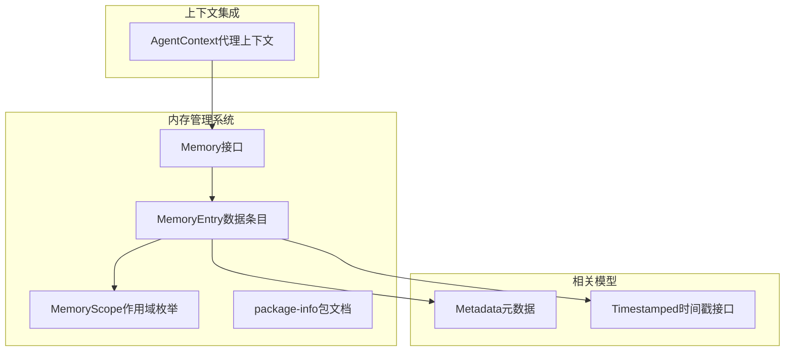
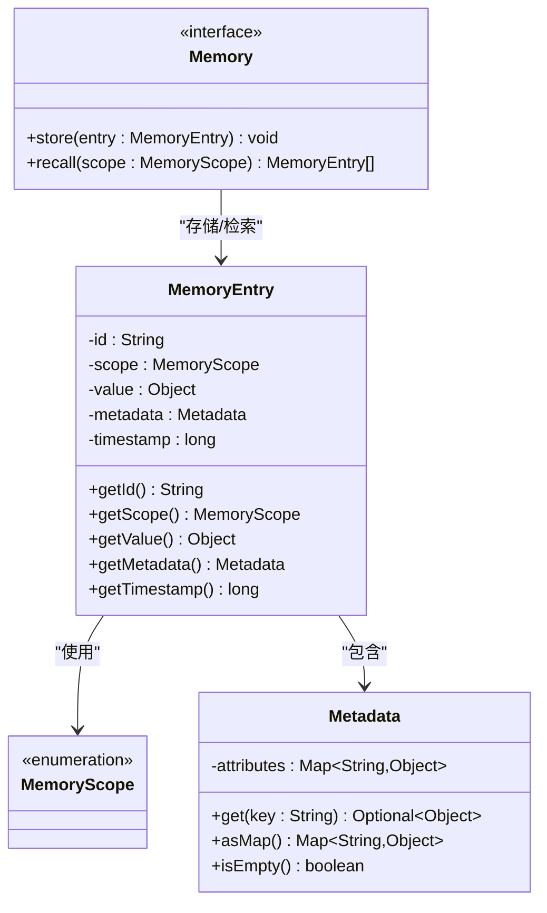
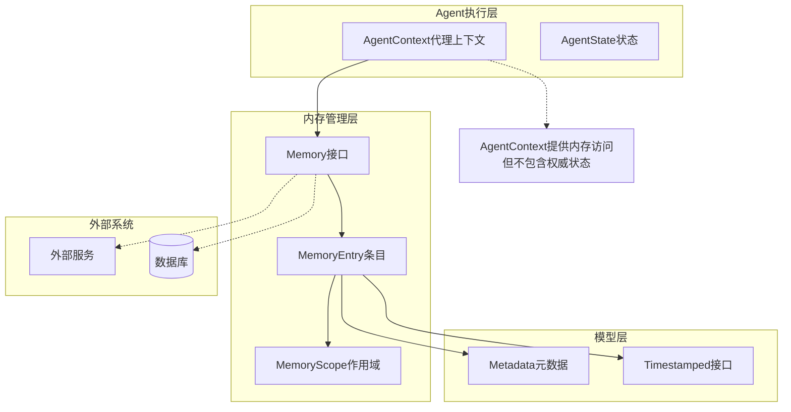
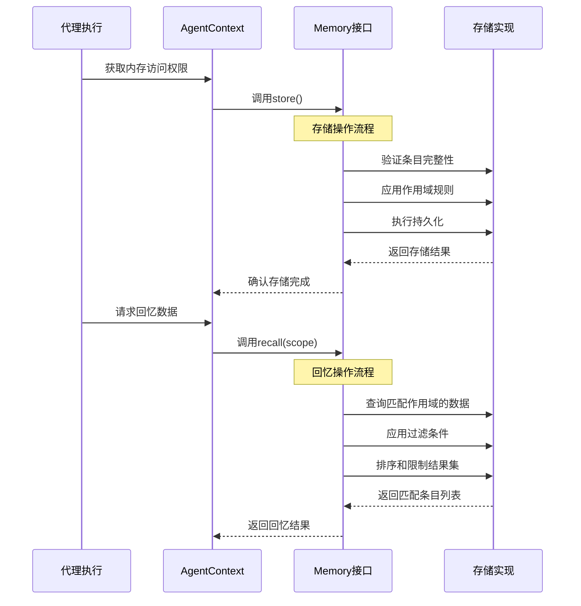
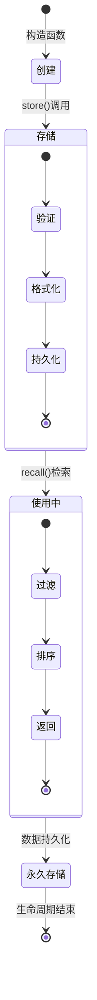
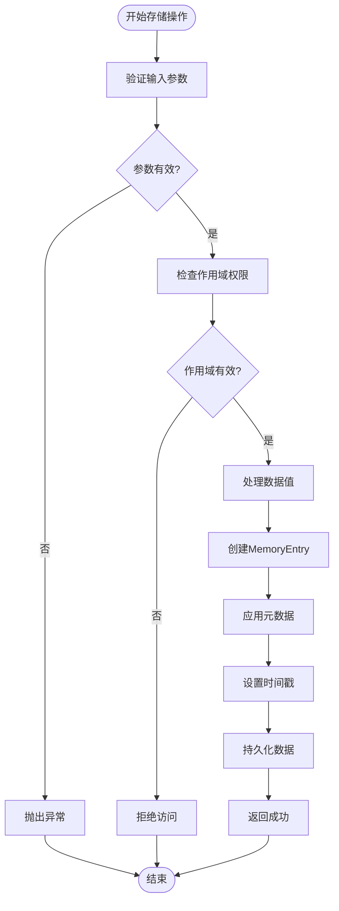
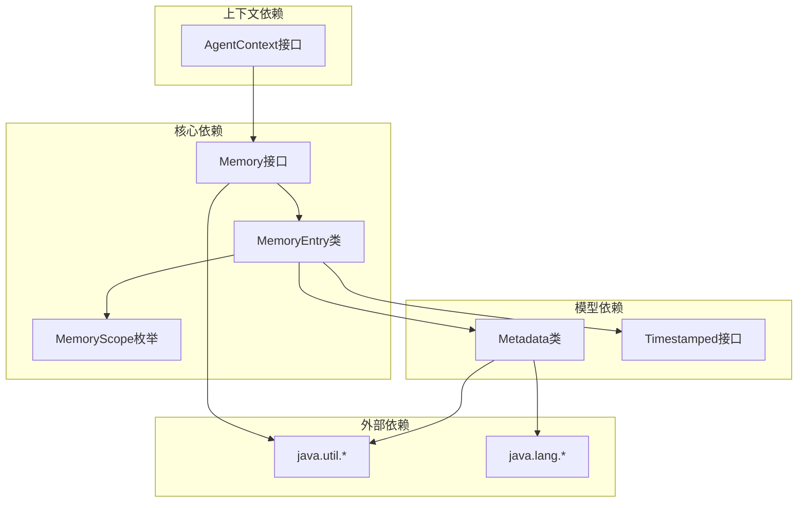

# 内存管理系统

<cite>
**本文档引用的文件**
- [Memory.java](file://argus-core/src/main/java/io/argus/core/memory/Memory.java)
- [MemoryEntry.java](file://argus-core/src/main/java/io/argus/core/memory/MemoryEntry.java)
- [MemoryScope.java](file://argus-core/src/main/java/io/argus/core/memory/MemoryScope.java)
- [package-info.java](file://argus-core/src/main/java/io/argus/core/memory/package-info.java)
- [AgentContext.java](file://argus-core/src/main/java/io/argus/core/agent/AgentContext.java)
- [Metadata.java](file://argus-core/src/main/java/io/argus/core/model/Metadata.java)
- [Timestamped.java](file://argus-core/src/main/java/io/argus/core/model/Timestamped.java)
</cite>

## 目录
1. [简介](#简介)
2. [项目结构](#项目结构)
3. [核心组件](#核心组件)
4. [架构概览](#架构概览)
5. [详细组件分析](#详细组件分析)
6. [依赖关系分析](#依赖关系分析)
7. [性能考虑](#性能考虑)
8. [故障排除指南](#故障排除指南)
9. [结论](#结论)

## 简介

内存管理系统是Argus智能体框架的核心组成部分，负责管理智能体的记忆存储和检索功能。该系统采用接口驱动的设计模式，提供了灵活且可扩展的记忆管理机制。

根据包文档描述，内存系统被设计为"可审计的事实存储"，具有以下关键特性：
- 追加式存储（append-only）机制
- 可审计性（auditable）
- 可回放性（replayable）
- 核心模块不指定具体存储或索引方式

## 项目结构

内存管理系统位于`argus-core`模块的`io.argus.core.memory`包中，包含以下核心文件：

**图表来源**
- [Memory.java](file://argus-core/src/main/java/io/argus/core/memory/Memory.java#L1-L15)
- [MemoryEntry.java](file://argus-core/src/main/java/io/argus/core/memory/MemoryEntry.java#L1-L53)
- [MemoryScope.java](file://argus-core/src/main/java/io/argus/core/memory/MemoryScope.java#L1-L8)
- [Metadata.java](file://argus-core/src/main/java/io/argus/core/model/Metadata.java#L1-L34)

**章节来源**
- [package-info.java](file://argus-core/src/main/java/io/argus/core/memory/package-info.java#L1-L21)

## 核心组件

内存管理系统由三个核心组件构成：Memory接口、MemoryEntry数据条目和MemoryScope作用域枚举。

### Memory接口设计

Memory接口定义了内存系统的基本操作契约，采用简洁而强大的设计原则：

**图表来源**
- [Memory.java](file://argus-core/src/main/java/io/argus/core/memory/Memory.java#L9-L15)
- [MemoryEntry.java](file://argus-core/src/main/java/io/argus/core/memory/MemoryEntry.java#L9-L53)
- [MemoryScope.java](file://argus-core/src/main/java/io/argus/core/memory/MemoryScope.java#L7-L8)
- [Metadata.java](file://argus-core/src/main/java/io/argus/core/model/Metadata.java#L12-L34)

### MemoryEntry数据条目结构

MemoryEntry作为内存系统的核心数据载体，采用了不可变设计模式，确保数据的一致性和线程安全性：

| 字段 | 类型 | 描述 | 设计考虑 |
|------|------|------|----------|
| id | String | 唯一标识符 | 确保条目可唯一识别 |
| scope | MemoryScope | 作用域信息 | 控制数据可见性和访问权限 |
| value | Object | 实际存储的数据值 | 支持任意类型的数据封装 |
| metadata | Metadata | 元数据容器 | 提供额外的属性和上下文信息 |
| timestamp | long | 时间戳 | 记录数据创建或修改时间 |

### MemoryScope作用域管理

MemoryScope当前定义为一个空的枚举类型，为未来的扩展预留了空间。这种设计允许实现者根据具体需求添加不同的作用域类型，如：
- 用户级作用域
- 会话级作用域  
- 系统级作用域
- 临时级作用域

## 架构概览

内存管理系统在整个Argus框架中的位置和交互关系如下：

**图表来源**
- [AgentContext.java](file://argus-core/src/main/java/io/argus/core/agent/AgentContext.java#L92-L98)
- [Memory.java](file://argus-core/src/main/java/io/argus/core/memory/Memory.java#L9-L15)
- [MemoryEntry.java](file://argus-core/src/main/java/io/argus/core/memory/MemoryEntry.java#L9-L53)

## 详细组件分析

### Memory接口实现流程

Memory接口定义了两个核心操作：存储和回忆。下面通过序列图展示典型的调用流程：

**图表来源**
- [Memory.java](file://argus-core/src/main/java/io/argus/core/memory/Memory.java#L11-L13)
- [AgentContext.java](file://argus-core/src/main/java/io/argus/core/agent/AgentContext.java#L96-L96)

### MemoryEntry生命周期管理

MemoryEntry采用了不可变设计，确保了数据的完整性和线程安全：

**图表来源**
- [MemoryEntry.java](file://argus-core/src/main/java/io/argus/core/memory/MemoryEntry.java#L17-L29)

### 类型安全机制

内存系统通过多种机制确保类型安全：

1. **编译时类型检查**：Java泛型确保在编译时进行类型验证
2. **运行时类型验证**：对存储的数据进行类型检查
3. **接口契约约束**：严格的接口定义确保实现的一致性
4. **不可变设计**：防止意外的数据修改

### 数据存储和检索机制

**图表来源**
- [MemoryEntry.java](file://argus-core/src/main/java/io/argus/core/memory/MemoryEntry.java#L17-L29)

## 依赖关系分析

内存管理系统与其他组件的依赖关系体现了清晰的分层架构：

**图表来源**
- [Memory.java](file://argus-core/src/main/java/io/argus/core/memory/Memory.java#L3-L3)
- [MemoryEntry.java](file://argus-core/src/main/java/io/argus/core/memory/MemoryEntry.java#L3-L3)
- [Metadata.java](file://argus-core/src/main/java/io/argus/core/model/Metadata.java#L3-L6)

**章节来源**
- [Memory.java](file://argus-core/src/main/java/io/argus/core/memory/Memory.java#L1-L15)
- [MemoryEntry.java](file://argus-core/src/main/java/io/argus/core/memory/MemoryEntry.java#L1-L53)
- [MemoryScope.java](file://argus-core/src/main/java/io/argus/core/memory/MemoryScope.java#L1-L8)
- [AgentContext.java](file://argus-core/src/main/java/io/argus/core/agent/AgentContext.java#L1-L98)

## 性能考虑

内存管理系统在设计时充分考虑了性能因素：

1. **不可变对象设计**：减少锁竞争，提高并发安全性
2. **延迟加载机制**：支持按需加载，减少内存占用
3. **缓存策略**：支持实现层面的缓存优化
4. **批量操作**：支持批量存储和检索操作
5. **索引优化**：允许实现特定的索引策略

## 故障排除指南

### 常见问题及解决方案

1. **内存访问权限问题**
   - 检查MemoryScope配置是否正确
   - 验证作用域权限设置
   - 确认代理上下文的访问权限

2. **数据存储失败**
   - 检查MemoryEntry的完整性
   - 验证元数据格式
   - 确认时间戳有效性

3. **检索结果为空**
   - 检查作用域匹配条件
   - 验证数据是否已正确存储
   - 确认检索范围设置

**章节来源**
- [AgentContext.java](file://argus-core/src/main/java/io/argus/core/agent/AgentContext.java#L65-L77)

## 结论

内存管理系统通过其精心设计的接口和数据结构，为Argus智能体框架提供了强大而灵活的记忆管理能力。系统的核心特点包括：

1. **清晰的职责分离**：Memory接口专注于抽象，具体实现可以自由选择存储策略
2. **强类型安全**：通过Java类型系统确保数据完整性
3. **可扩展性**：为未来的功能增强预留了充足的空间
4. **性能优化**：不可变设计和合理的数据结构支持高效的内存使用

该系统为智能体提供了可靠的内存管理基础，支持复杂的应用场景和未来的发展需求。