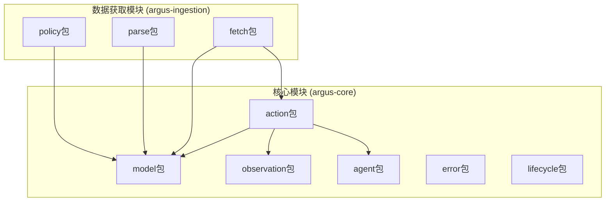
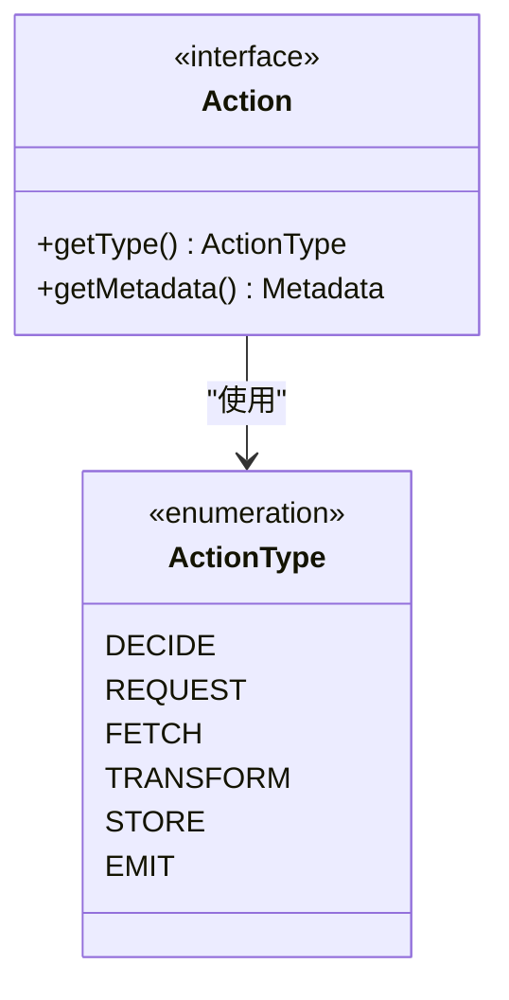
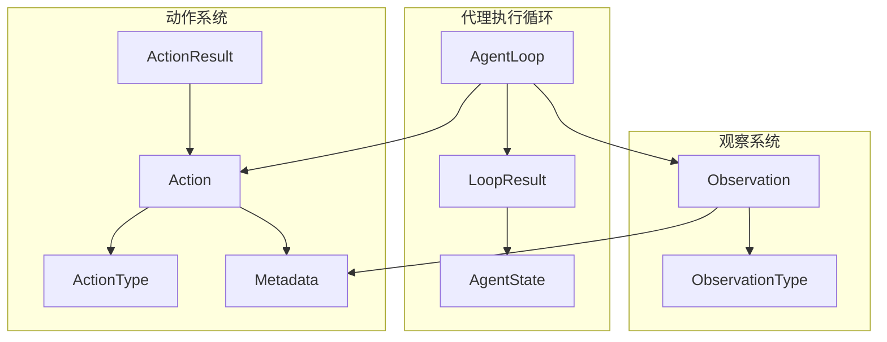
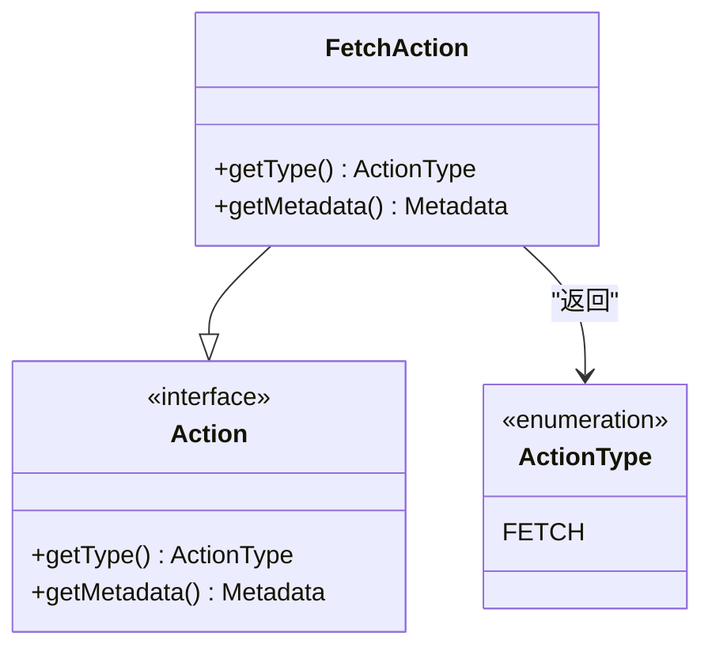
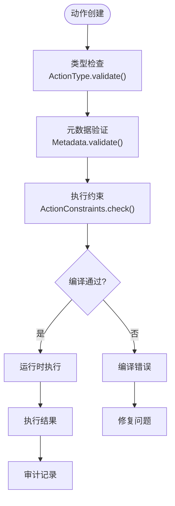
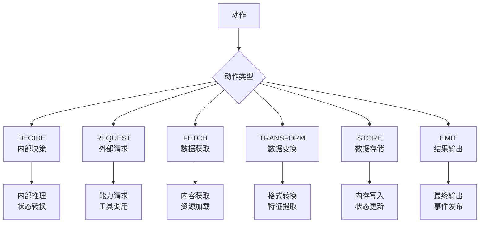
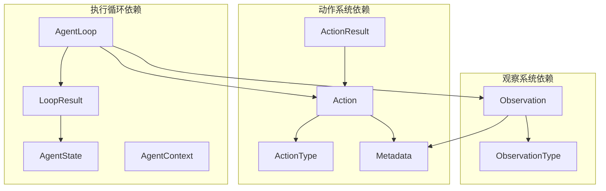

# 动作系统

<cite>
**本文档引用的文件**
- [Action.java](file://argus-core/src/main/java/io/argus/core/action/Action.java)
- [ActionResult.java](file://argus-core/src/main/java/io/argus/core/action/ActionResult.java)
- [ActionType.java](file://argus-core/src/main/java/io/argus/core/action/ActionType.java)
- [package-info.java](file://argus-core/src/main/java/io/argus/core/action/package-info.java)
- [Metadata.java](file://argus-core/src/main/java/io/argus/core/model/Metadata.java)
- [FetchAction.java](file://argus-ingestion/src/main/java/io/argus/ingestion/fetch/FetchAction.java)
- [Observation.java](file://argus-core/src/main/java/io/argus/core/observation/Observation.java)
- [LoopResult.java](file://argus-core/src/main/java/io/argus/core/agent/LoopResult.java)
- [AgentLoop.java](file://argus-core/src/main/java/io/argus/core/agent/AgentLoop.java)
- [AgentContext.java](file://argus-core/src/main/java/io/argus/core/agent/AgentContext.java)
- [AgentState.java](file://argus-core/src/main/java/io/argus/core/agent/AgentState.java)
- [AgentExecutionException.java](file://argus-core/src/main/java/io/argus/core/error/AgentExecutionException.java)
- [Lifecycle.java](file://argus-core/src/main/java/io/argus/core/lifecycle/Lifecycle.java)
- [readme.md](file://readme.md)
</cite>

## 目录
1. [简介](#简介)
2. [项目结构](#项目结构)
3. [核心组件](#核心组件)
4. [架构概览](#架构概览)
5. [详细组件分析](#详细组件分析)
6. [依赖关系分析](#依赖关系分析)
7. [性能考虑](#性能考虑)
8. [故障排除指南](#故障排除指南)
9. [结论](#结论)

## 简介

ARGUS 动作系统是一个为 AI 代理设计的声明式行为模型，专注于可审计、可控制、可复现的代理执行。该系统通过明确的动作抽象和严格的类型安全设计，为代理提供了清晰的行为意图表达机制。

动作系统的核心设计理念是将"意图"与"执行"分离，确保代理只表达其行为意图，而具体的执行逻辑由运行时环境负责实现。这种设计使得整个系统具有高度的可审计性和可复现性。

## 项目结构

ARGUS 采用模块化架构，动作系统位于核心模块中，为整个代理系统提供基础能力。



**图表来源**
- [readme.md](file://readme.md#L7-L14)

**章节来源**
- [readme.md](file://readme.md#L1-L28)

## 核心组件

动作系统由四个核心组件构成：Action 接口、ActionType 枚举、ActionResult 接口和 Metadata 类。

### Action 接口设计

Action 接口定义了代理行为的抽象表示，采用声明式设计原则：

- **意图表达**：描述代理"想要做什么"而非"如何做"
- **类型分类**：通过 ActionType 进行高阶语义分类
- **元数据支持**：通过 Metadata 提供领域特定信息
- **无执行逻辑**：不包含具体的执行代码或技术细节

### ActionType 枚举系统

ActionType 提供了六种基本的动作类型分类：



**图表来源**
- [ActionType.java](file://argus-core/src/main/java/io/argus/core/action/ActionType.java#L22-L143)
- [Action.java](file://argus-core/src/main/java/io/argus/core/action/Action.java#L37-L43)

每种类型都有明确的语义定义和典型用例：
- **DECIDE**：内部决策行为，不直接作用于外部世界
- **REQUEST**：请求外部能力或服务的抽象行为
- **FETCH**：从外部或内部源获取数据的行为
- **TRANSFORM**：纯数据变换行为，不应产生外部副作用
- **STORE**：数据持久化或状态提交行为
- **EMIT**：对外输出或通知行为

### ActionResult 结果封装

ActionResult 接口作为动作执行结果的统一抽象，目前为空接口设计，为未来的扩展预留空间。

### Metadata 元数据系统

Metadata 类提供不可变的键值对存储机制，支持：
- 不可变性保证
- 空安全访问
- 类型安全的值获取
- 空对象模式支持

**章节来源**
- [Action.java](file://argus-core/src/main/java/io/argus/core/action/Action.java#L1-L43)
- [ActionType.java](file://argus-core/src/main/java/io/argus/core/action/ActionType.java#L1-L143)
- [ActionResult.java](file://argus-core/src/main/java/io/argus/core/action/ActionResult.java#L1-L8)
- [Metadata.java](file://argus-core/src/main/java/io/argus/core/model/Metadata.java#L1-L34)

## 架构概览

动作系统在整个 ARGUS 架构中扮演着核心角色，连接代理、观察和执行循环。



**图表来源**
- [AgentLoop.java](file://argus-core/src/main/java/io/argus/core/agent/AgentLoop.java#L49-L118)
- [LoopResult.java](file://argus-core/src/main/java/io/argus/core/agent/LoopResult.java#L78-L115)
- [Action.java](file://argus-core/src/main/java/io/argus/core/action/Action.java#L37-L43)
- [Observation.java](file://argus-core/src/main/java/io/argus/core/observation/Observation.java#L31-L37)

## 详细组件分析

### 动作接口实现模式

动作系统提供了清晰的实现模式，以下展示了不同动作类型的实现策略：

#### FetchAction 示例分析

FetchAction 展示了动作接口的标准实现模式：



**图表来源**
- [FetchAction.java](file://argus-ingestion/src/main/java/io/argus/ingestion/fetch/FetchAction.java#L11-L21)
- [Action.java](file://argus-core/src/main/java/io/argus/core/action/Action.java#L37-L43)

#### 动作执行流程

动作系统遵循严格的执行流程，确保可审计性和可复现性：

```mermaid
sequenceDiagram
participant Agent as 代理
participant Loop as AgentLoop
participant Action as Action
participant Runtime as 运行时
participant Observation as Observation
Agent->>Loop : step(context)
Loop->>Agent : 评估上下文和状态
Agent->>Action : 生成动作意图
Action->>Runtime : 解释动作类型
Runtime->>Observation : 执行并产生观测
Observation->>Loop : 返回执行结果
Loop->>Agent : 返回 LoopResult
Agent->>Agent : 更新状态
```

**图表来源**
- [AgentLoop.java](file://argus-core/src/main/java/io/argus/core/agent/AgentLoop.java#L21-L28)
- [LoopResult.java](file://argus-core/src/main/java/io/argus/core/agent/LoopResult.java#L6-L22)

### 类型安全机制

动作系统通过多种机制确保类型安全：

#### 编译时类型检查



**图表来源**
- [Action.java](file://argus-core/src/main/java/io/argus/core/action/Action.java#L14-L21)
- [Metadata.java](file://argus-core/src/main/java/io/argus/core/model/Metadata.java#L16-L20)

#### 运行时验证机制

动作系统在运行时进行多重验证：
- 动作类型有效性检查
- 元数据完整性验证
- 执行约束条件验证
- 状态一致性检查

### 动作类型分类逻辑

ActionType 枚举提供了清晰的分类体系：



**图表来源**
- [ActionType.java](file://argus-core/src/main/java/io/argus/core/action/ActionType.java#L22-L143)

**章节来源**
- [FetchAction.java](file://argus-ingestion/src/main/java/io/argus/ingestion/fetch/FetchAction.java#L1-L21)
- [AgentLoop.java](file://argus-core/src/main/java/io/argus/core/agent/AgentLoop.java#L1-L118)
- [LoopResult.java](file://argus-core/src/main/java/io/argus/core/agent/LoopResult.java#L1-L115)

## 依赖关系分析

动作系统与其他核心组件存在紧密的依赖关系：



**图表来源**
- [Action.java](file://argus-core/src/main/java/io/argus/core/action/Action.java#L3-L4)
- [Observation.java](file://argus-core/src/main/java/io/argus/core/observation/Observation.java#L3-L4)
- [LoopResult.java](file://argus-core/src/main/java/io/argus/core/agent/LoopResult.java#L3-L5)

**章节来源**
- [Action.java](file://argus-core/src/main/java/io/argus/core/action/Action.java#L1-L43)
- [Observation.java](file://argus-core/src/main/java/io/argus/core/observation/Observation.java#L1-L37)
- [LoopResult.java](file://argus-core/src/main/java/io/argus/core/agent/LoopResult.java#L1-L115)

## 性能考虑

动作系统在设计时充分考虑了性能因素：

### 内存效率
- Metadata 使用不可变设计，减少内存分配
- LoopResult 作为不可变数据载体，便于缓存和重用
- 动作类型枚举提供常量时间的类型判断

### 执行效率
- 声明式设计避免了执行逻辑的重复计算
- 类型分类提供快速的分支判断
- 元数据访问采用延迟加载机制

### 可扩展性
- 接口设计支持多种实现策略
- 枚举扩展遵循开闭原则
- 插件化架构支持功能扩展

## 故障排除指南

### 常见问题诊断

#### 动作类型不匹配
当动作类型与预期不符时，系统会抛出类型不匹配异常。解决方案：
- 检查动作实现中的 getType() 方法
- 验证 ActionType 的正确使用
- 确认元数据配置的完整性

#### 元数据访问失败
如果元数据访问出现空指针异常：
- 检查 Metadata 对象的初始化
- 验证键值对的存在性
- 确认类型转换的正确性

#### 执行循环异常
AgentLoop 执行过程中可能出现的问题：
- 检查 step() 方法的实现
- 验证状态转换的正确性
- 确认观察结果的完整性

**章节来源**
- [AgentExecutionException.java](file://argus-core/src/main/java/io/argus/core/error/AgentExecutionException.java#L1-L8)
- [Lifecycle.java](file://argus-core/src/main/java/io/argus/core/lifecycle/Lifecycle.java#L1-L8)

## 结论

ARGUS 动作系统通过精心设计的抽象层次和严格的类型安全机制，为 AI 代理提供了一个强大而灵活的行为模型。系统的核心优势包括：

1. **声明式设计**：将意图与执行分离，确保系统的可审计性
2. **类型安全**：通过枚举和接口确保编译时和运行时的安全性
3. **可扩展性**：模块化的架构支持功能的渐进式扩展
4. **性能优化**：不可变数据结构和高效的数据访问机制

该系统为构建复杂的 AI 代理应用奠定了坚实的基础，通过明确的接口定义和丰富的扩展点，能够适应各种应用场景的需求。