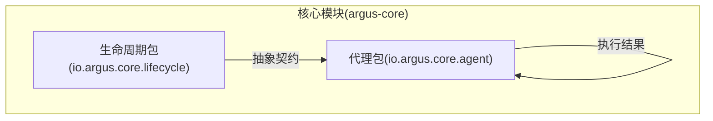
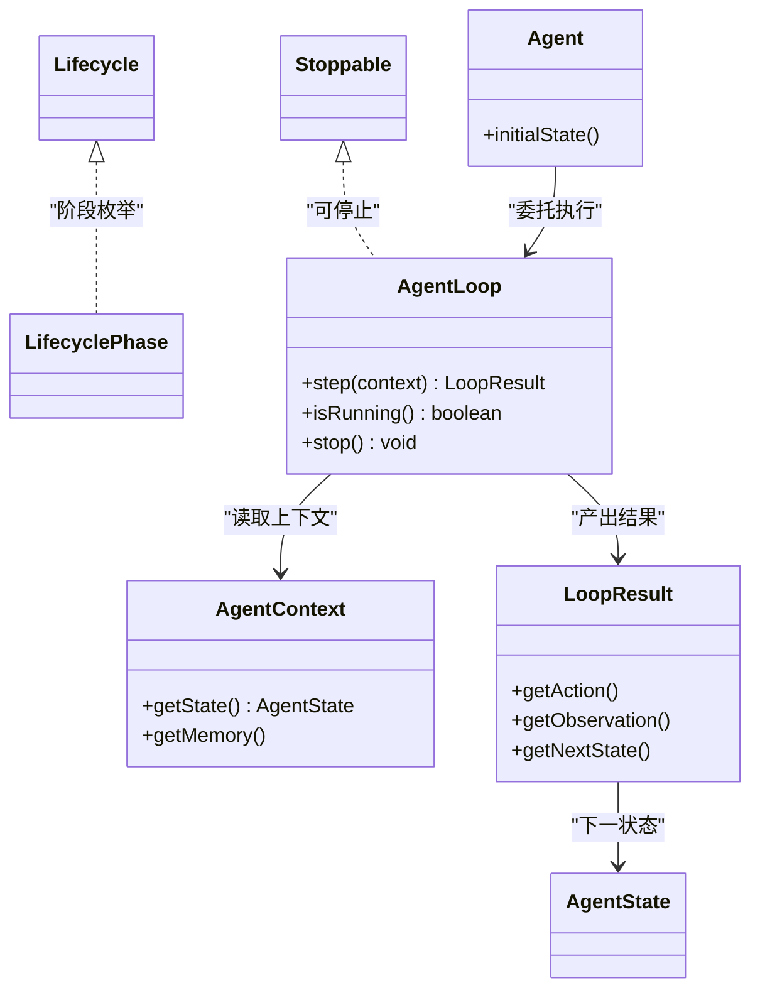
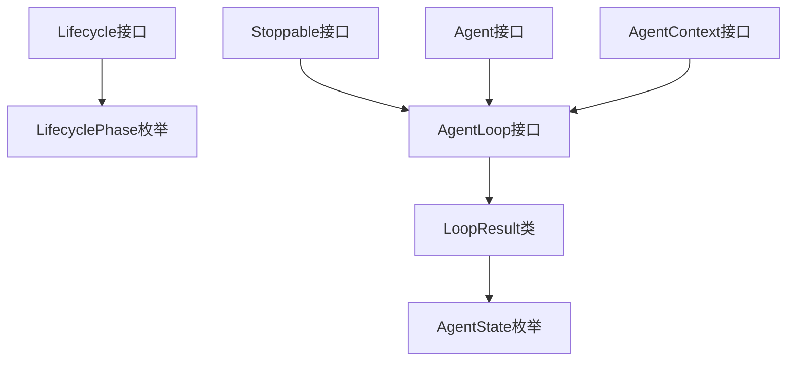

# 生命周期管理

<cite>
**本文引用的文件**
- [Lifecycle.java](file://argus-core/src/main/java/io/argus/core/lifecycle/Lifecycle.java)
- [LifecyclePhase.java](file://argus-core/src/main/java/io/argus/core/lifecycle/LifecyclePhase.java)
- [Stoppable.java](file://argus-core/src/main/java/io/argus/core/lifecycle/Stoppable.java)
- [package-info.java（生命周期）](file://argus-core/src/main/java/io/argus/core/lifecycle/package-info.java)
- [Agent.java](file://argus-core/src/main/java/io/argus/core/agent/Agent.java)
- [AgentLoop.java](file://argus-core/src/main/java/io/argus/core/agent/AgentLoop.java)
- [AgentContext.java](file://argus-core/src/main/java/io/argus/core/agent/AgentContext.java)
- [AgentState.java](file://argus-core/src/main/java/io/argus/core/agent/AgentState.java)
- [LoopResult.java](file://argus-core/src/main/java/io/argus/core/agent/LoopResult.java)
</cite>

## 目录
1. [引言](#引言)
2. [项目结构](#项目结构)
3. [核心组件](#核心组件)
4. [架构总览](#架构总览)
5. [组件详解](#组件详解)
6. [依赖关系分析](#依赖关系分析)
7. [性能考量](#性能考量)
8. [故障排查指南](#故障排查指南)
9. [结论](#结论)
10. [附录](#附录)

## 引言
本文件聚焦于Argus核心模块中的生命周期管理抽象与实践，围绕以下目标展开：
- 解释生命周期接口的设计理念：生命周期阶段的抽象表示、状态转换规则与事件通知机制的预期形态
- 说明生命周期阶段枚举的设计：各阶段的含义、转换条件与执行时机
- 阐述可停止接口的协作模式：停止信号的传播、资源清理与优雅退出
- 解释生命周期管理在代理系统中的作用：启动初始化、运行监控与关闭清理
- 说明生命周期事件的监听与处理机制：事件注册、回调执行与异常处理
- 提供实现模式与最佳实践：自定义生命周期管理与资源管理

为避免信息不一致，本文严格基于仓库中已存在的源码进行分析与总结。

## 项目结构
Argus采用多模块结构，生命周期管理位于核心模块的lifecycle包中；代理系统（Agent）位于同一核心模块的agent包下，二者紧密协作以支撑长期运行的代理生命周期。



图表来源
- [Lifecycle.java](file://argus-core/src/main/java/io/argus/core/lifecycle/Lifecycle.java#L1-L8)
- [AgentLoop.java](file://argus-core/src/main/java/io/argus/core/agent/AgentLoop.java#L1-L118)
- [AgentState.java](file://argus-core/src/main/java/io/argus/core/agent/AgentState.java#L1-L81)
- [LoopResult.java](file://argus-core/src/main/java/io/argus/core/agent/LoopResult.java#L1-L115)

章节来源
- [package-info.java（生命周期）](file://argus-core/src/main/java/io/argus/core/lifecycle/package-info.java#L1-L15)

## 核心组件
- 生命周期接口：用于承载生命周期管理的抽象契约，指导阶段推进与事件通知的统一入口
- 生命周期阶段枚举：用于表达生命周期的不同阶段及其转换方向
- 可停止接口：用于声明组件具备“停止”能力，支持优雅退出与资源回收
- 代理接口与执行循环：代理的执行由循环驱动，循环负责推进状态、产出结果并响应停止请求
- 代理状态与执行结果：状态为不可变快照，结果承载单步决策的事实数据，二者共同支撑回放与审计

章节来源
- [Lifecycle.java](file://argus-core/src/main/java/io/argus/core/lifecycle/Lifecycle.java#L1-L8)
- [LifecyclePhase.java](file://argus-core/src/main/java/io/argus/core/lifecycle/LifecyclePhase.java#L1-L8)
- [Stoppable.java](file://argus-core/src/main/java/io/argus/core/lifecycle/Stoppable.java#L1-L8)
- [Agent.java](file://argus-core/src/main/java/io/argus/core/agent/Agent.java#L1-L11)
- [AgentLoop.java](file://argus-core/src/main/java/io/argus/core/agent/AgentLoop.java#L1-L118)
- [AgentState.java](file://argus-core/src/main/java/io/argus/core/agent/AgentState.java#L1-L81)
- [LoopResult.java](file://argus-core/src/main/java/io/argus/core/agent/LoopResult.java#L1-L115)

## 架构总览
生命周期管理在代理系统中的角色定位如下：
- 生命周期接口作为统一抽象，定义阶段推进与事件通知的契约
- 生命周期阶段枚举定义阶段集合与转换方向
- 可停止接口为组件提供统一的停止能力，配合执行循环实现优雅退出
- 代理执行循环负责推进状态、产出结果并响应停止请求
- 代理状态与执行结果确保回放与审计的确定性



图表来源
- [Lifecycle.java](file://argus-core/src/main/java/io/argus/core/lifecycle/Lifecycle.java#L1-L8)
- [LifecyclePhase.java](file://argus-core/src/main/java/io/argus/core/lifecycle/LifecyclePhase.java#L1-L8)
- [Stoppable.java](file://argus-core/src/main/java/io/argus/core/lifecycle/Stoppable.java#L1-L8)
- [Agent.java](file://argus-core/src/main/java/io/argus/core/agent/Agent.java#L1-L11)
- [AgentLoop.java](file://argus-core/src/main/java/io/argus/core/agent/AgentLoop.java#L1-L118)
- [AgentState.java](file://argus-core/src/main/java/io/argus/core/agent/AgentState.java#L1-L81)
- [AgentContext.java](file://argus-core/src/main/java/io/argus/core/agent/AgentContext.java#L1-L98)
- [LoopResult.java](file://argus-core/src/main/java/io/argus/core/agent/LoopResult.java#L1-L115)

## 组件详解

### 生命周期接口（Lifecycle）
- 设计理念：作为生命周期管理的抽象入口，承载阶段推进与事件通知的统一契约
- 作用范围：为生命周期阶段枚举与事件通知机制提供接口层抽象
- 使用建议：结合阶段枚举与可停止接口，形成“阶段推进 + 停止响应”的闭环

章节来源
- [Lifecycle.java](file://argus-core/src/main/java/io/argus/core/lifecycle/Lifecycle.java#L1-L8)
- [package-info.java（生命周期）](file://argus-core/src/main/java/io/argus/core/lifecycle/package-info.java#L1-L15)

### 生命周期阶段枚举（LifecyclePhase）
- 设计理念：以枚举形式表达生命周期阶段集合，便于统一管理与转换
- 作用范围：定义阶段的含义、转换条件与执行时机，为阶段推进提供依据
- 使用建议：在具体实现中，将阶段推进与事件通知绑定到对应阶段，确保转换有序可控

章节来源
- [LifecyclePhase.java](file://argus-core/src/main/java/io/argus/core/lifecycle/LifecyclePhase.java#L1-L8)
- [package-info.java（生命周期）](file://argus-core/src/main/java/io/argus/core/lifecycle/package-info.java#L1-L15)

### 可停止接口（Stoppable）
- 设计理念：为组件提供统一的停止能力，支持优雅退出与资源回收
- 作用范围：与代理执行循环协同，响应停止请求并触发清理流程
- 使用建议：在实现中区分“立即停止”与“优雅停止”，优先保证资源安全释放

章节来源
- [Stoppable.java](file://argus-core/src/main/java/io/argus/core/lifecycle/Stoppable.java#L1-L8)
- [AgentLoop.java](file://argus-core/src/main/java/io/argus/core/agent/AgentLoop.java#L104-L116)

### 代理系统与生命周期协作
- 启动初始化：代理通过初始状态进入执行循环，开始阶段推进
- 运行监控：执行循环按步推进，产出执行结果并更新状态
- 关闭清理：通过停止接口触发优雅退出，确保资源清理与状态持久化

```mermaid
sequenceDiagram
participant Agent as "代理"
participant Loop as "执行循环(AgentLoop)"
participant Ctx as "执行上下文(AgentContext)"
participant State as "状态(AgentState)"
participant Result as "结果(LoopResult)"
Agent->>Loop : "初始化并进入循环"
Loop->>Ctx : "读取当前上下文"
Loop->>Result : "执行一步(step)"
Result-->>Loop : "返回动作/观测/下一状态"
Loop->>State : "应用状态转换"
alt "仍在运行"
Loop->>Loop : "继续下一步"
else "收到停止信号"
Loop->>Loop : "优雅停止并清理"
end
```

图表来源
- [Agent.java](file://argus-core/src/main/java/io/argus/core/agent/Agent.java#L1-L11)
- [AgentLoop.java](file://argus-core/src/main/java/io/argus/core/agent/AgentLoop.java#L1-L118)
- [AgentContext.java](file://argus-core/src/main/java/io/argus/core/agent/AgentContext.java#L1-L98)
- [AgentState.java](file://argus-core/src/main/java/io/argus/core/agent/AgentState.java#L1-L81)
- [LoopResult.java](file://argus-core/src/main/java/io/argus/core/agent/LoopResult.java#L1-L115)

章节来源
- [Agent.java](file://argus-core/src/main/java/io/argus/core/agent/Agent.java#L1-L11)
- [AgentLoop.java](file://argus-core/src/main/java/io/argus/core/agent/AgentLoop.java#L1-L118)
- [AgentContext.java](file://argus-core/src/main/java/io/argus/core/agent/AgentContext.java#L1-L98)
- [AgentState.java](file://argus-core/src/main/java/io/argus/core/agent/AgentState.java#L1-L81)
- [LoopResult.java](file://argus-core/src/main/java/io/argus/core/agent/LoopResult.java#L1-L115)

### 生命周期事件监听与处理机制
- 事件注册：通过生命周期接口与阶段枚举，将事件注册到对应阶段
- 回调执行：在阶段推进时触发相应回调，确保处理逻辑与阶段解耦
- 异常处理：在回调执行中捕获并处理异常，避免影响整体生命周期推进

章节来源
- [Lifecycle.java](file://argus-core/src/main/java/io/argus/core/lifecycle/Lifecycle.java#L1-L8)
- [LifecyclePhase.java](file://argus-core/src/main/java/io/argus/core/lifecycle/LifecyclePhase.java#L1-L8)
- [package-info.java（生命周期）](file://argus-core/src/main/java/io/argus/core/lifecycle/package-info.java#L1-L15)

### 自定义生命周期管理与资源管理最佳实践
- 明确阶段边界：使用阶段枚举定义清晰的阶段与转换条件
- 统一停止策略：在可停止接口实现中区分立即停止与优雅停止
- 确保回放确定性：利用状态与结果的不可变特性，保障回放一致性
- 分离职责：将状态与上下文分离，避免上下文成为隐藏状态

章节来源
- [AgentState.java](file://argus-core/src/main/java/io/argus/core/agent/AgentState.java#L1-L81)
- [LoopResult.java](file://argus-core/src/main/java/io/argus/core/agent/LoopResult.java#L1-L115)
- [AgentContext.java](file://argus-core/src/main/java/io/argus/core/agent/AgentContext.java#L1-L98)
- [AgentLoop.java](file://argus-core/src/main/java/io/argus/core/agent/AgentLoop.java#L1-L118)

## 依赖关系分析
生命周期管理与代理系统的依赖关系如下：
- 生命周期接口与阶段枚举为代理系统提供抽象契约
- 可停止接口与执行循环协同，实现优雅退出
- 状态与结果确保回放与审计的确定性



图表来源
- [Lifecycle.java](file://argus-core/src/main/java/io/argus/core/lifecycle/Lifecycle.java#L1-L8)
- [LifecyclePhase.java](file://argus-core/src/main/java/io/argus/core/lifecycle/LifecyclePhase.java#L1-L8)
- [Stoppable.java](file://argus-core/src/main/java/io/argus/core/lifecycle/Stoppable.java#L1-L8)
- [Agent.java](file://argus-core/src/main/java/io/argus/core/agent/Agent.java#L1-L11)
- [AgentLoop.java](file://argus-core/src/main/java/io/argus/core/agent/AgentLoop.java#L1-L118)
- [LoopResult.java](file://argus-core/src/main/java/io/argus/core/agent/LoopResult.java#L1-L115)
- [AgentState.java](file://argus-core/src/main/java/io/argus/core/agent/AgentState.java#L1-L81)
- [AgentContext.java](file://argus-core/src/main/java/io/argus/core/agent/AgentContext.java#L1-L98)

章节来源
- [AgentLoop.java](file://argus-core/src/main/java/io/argus/core/agent/AgentLoop.java#L1-L118)
- [AgentState.java](file://argus-core/src/main/java/io/argus/core/agent/AgentState.java#L1-L81)
- [LoopResult.java](file://argus-core/src/main/java/io/argus/core/agent/LoopResult.java#L1-L115)
- [AgentContext.java](file://argus-core/src/main/java/io/argus/core/agent/AgentContext.java#L1-L98)

## 性能考量
- 单步执行模型：执行循环以单步推进为核心，避免长阻塞操作，提升响应性
- 不可变数据结构：状态与结果的不可变设计有利于缓存与并发安全
- 优雅停止：在停止时进行资源清理，减少资源泄漏与抖动

## 故障排查指南
- 停止无响应：检查可停止接口实现是否正确传播停止信号并触发清理
- 状态不一致：确认状态转换仅通过不可变结果进行，避免上下文污染
- 回放失败：确保回放过程不依赖外部系统与随机性，仅依赖既定结果序列

章节来源
- [AgentLoop.java](file://argus-core/src/main/java/io/argus/core/agent/AgentLoop.java#L104-L116)
- [AgentState.java](file://argus-core/src/main/java/io/argus/core/agent/AgentState.java#L1-L81)
- [LoopResult.java](file://argus-core/src/main/java/io/argus/core/agent/LoopResult.java#L24-L75)

## 结论
Argus的生命周期管理以抽象契约为核心，结合阶段枚举与可停止接口，与代理执行循环、状态与结果形成协同体系。通过明确阶段边界、统一停止策略与不可变数据结构，系统实现了确定性回放、优雅退出与资源安全清理，为长期运行的代理提供了稳健的生命周期支撑。

## 附录
- 术语说明
  - 生命周期阶段：由阶段枚举定义的有序阶段集合
  - 优雅停止：在停止前完成资源清理与状态保存
  - 回放：基于既定结果序列重放代理决策过程