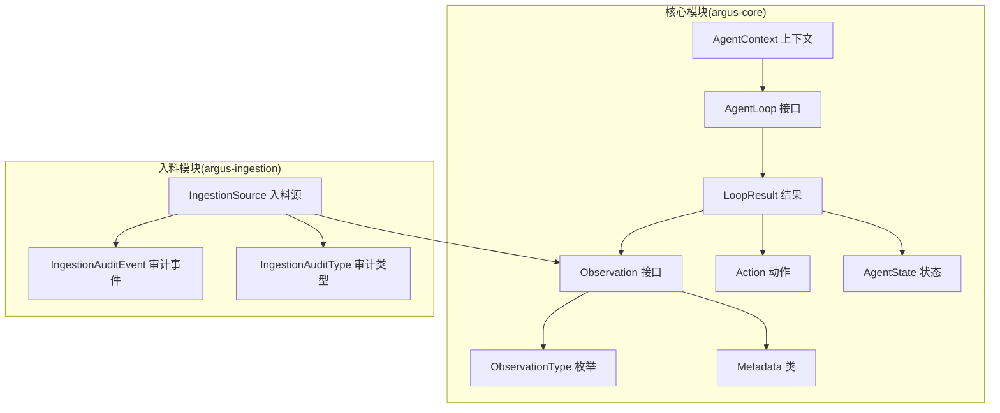
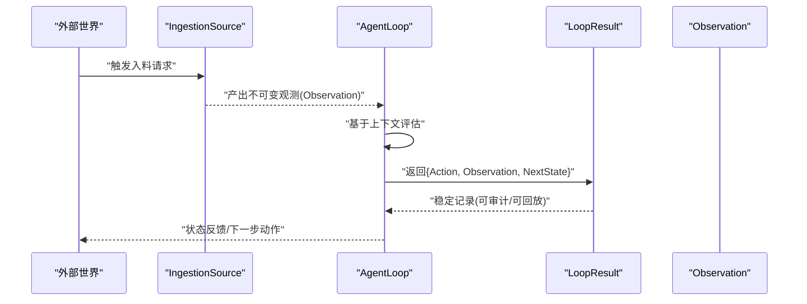
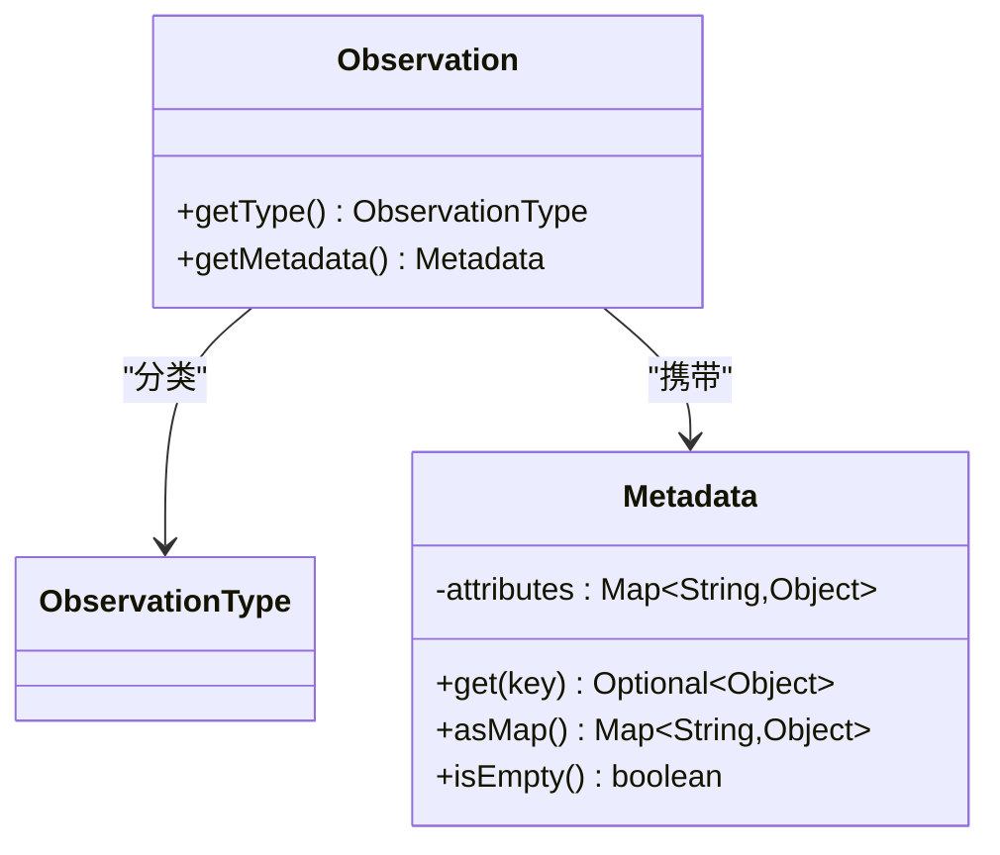
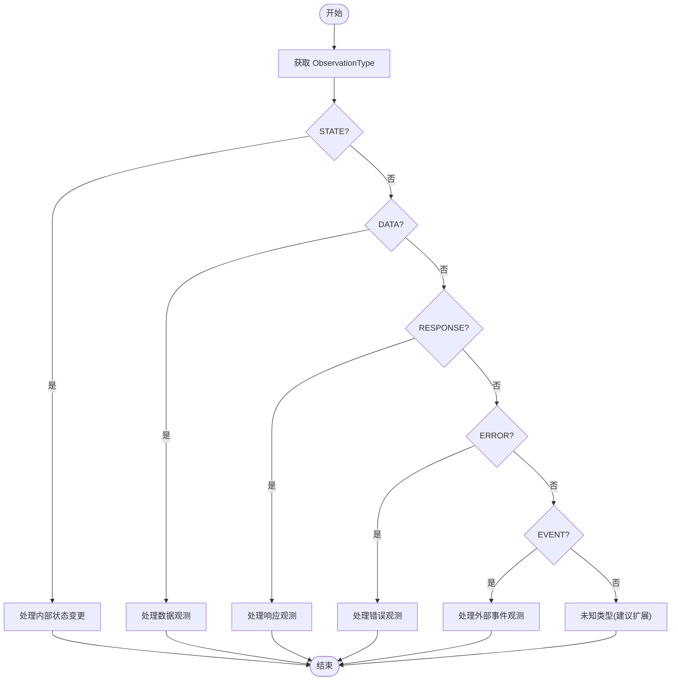
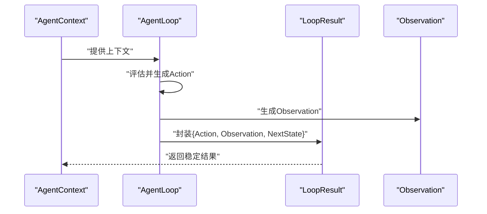
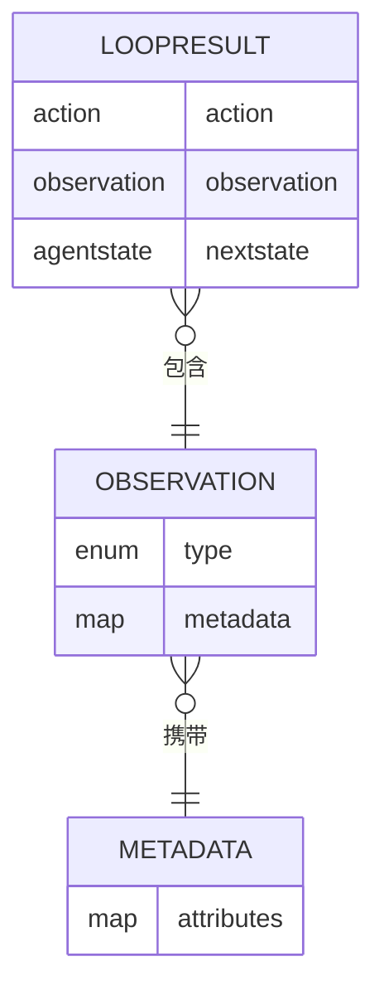
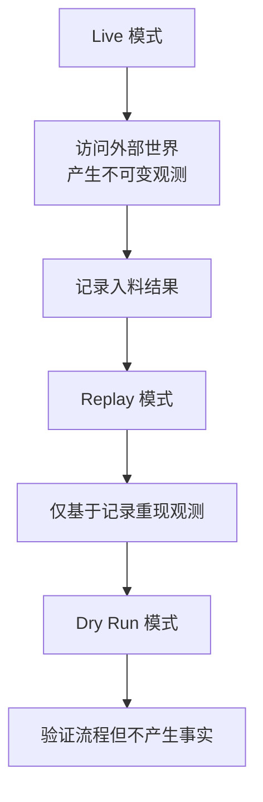
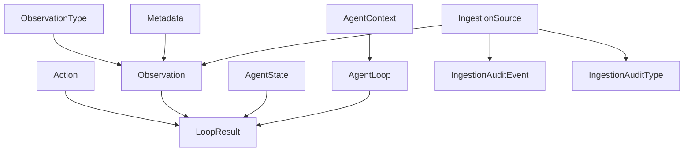

# 观察系统

<cite>
**本文引用的文件**
- [Observation.java](file://argus-core/src/main/java/io/argus/core/observation/Observation.java)
- [ObservationType.java](file://argus-core/src/main/java/io/argus/core/observation/ObservationType.java)
- [package-info.java](file://argus-core/src/main/java/io/argus/core/observation/package-info.java)
- [Metadata.java](file://argus-core/src/main/java/io/argus/core/model/Metadata.java)
- [AgentLoop.java](file://argus-core/src/main/java/io/argus/core/agent/AgentLoop.java)
- [LoopResult.java](file://argus-core/src/main/java/io/argus/core/agent/LoopResult.java)
- [AgentContext.java](file://argus-core/src/main/java/io/argus/core/agent/AgentContext.java)
- [IngestionSource.java](file://argus-ingestion/src/main/java/io/argus/ingestion/source/IngestionSource.java)
- [IngestionAuditEvent.java](file://argus-ingestion/src/main/java/io/argus/ingestion/audit/IngestionAuditEvent.java)
- [IngestionAuditType.java](file://argus-ingestion/src/main/java/io/argus/ingestion/audit/IngestionAuditType.java)
</cite>

## 目录
1. [引言](#引言)
2. [项目结构](#项目结构)
3. [核心组件](#核心组件)
4. [架构总览](#架构总览)
5. [详细组件分析](#详细组件分析)
6. [依赖关系分析](#依赖关系分析)
7. [性能考量](#性能考量)
8. [故障排查指南](#故障排查指南)
9. [结论](#结论)
10. [附录](#附录)

## 引言
本文件系统性阐述Argus观察系统的设计与实现，重点覆盖以下方面：
- Observation接口的抽象理念：事实记录机制、类型安全与不可变性
- ObservationType分类体系：分类逻辑、匹配规则与扩展机制
- 不可变性设计：只读特性与状态保护
- 观察在代理执行过程中的作用：状态反馈、决策依据与审计记录
- 观察数据的结构化表示：数据格式、元数据支持与序列化机制
- 具体实现与使用示例：内置类型与自定义扩展思路

## 项目结构
观察系统位于核心模块的observation包中，配合model层的Metadata以及agent层的AgentLoop/LoopResult共同构成完整的观测-决策-状态流转闭环；同时，入料模块IngestionSource以“权威边界”的方式产出不可变的事实观测。

图表来源
- [Observation.java](file://argus-core/src/main/java/io/argus/core/observation/Observation.java#L31-L37)
- [ObservationType.java](file://argus-core/src/main/java/io/argus/core/observation/ObservationType.java#L18-L117)
- [Metadata.java](file://argus-core/src/main/java/io/argus/core/model/Metadata.java#L12-L34)
- [AgentLoop.java](file://argus-core/src/main/java/io/argus/core/agent/AgentLoop.java#L49-L118)
- [LoopResult.java](file://argus-core/src/main/java/io/argus/core/agent/LoopResult.java#L82-L112)
- [AgentContext.java](file://argus-core/src/main/java/io/argus/core/agent/AgentContext.java#L92-L98)
- [IngestionSource.java](file://argus-ingestion/src/main/java/io/argus/ingestion/source/IngestionSource.java#L1-L90)
- [IngestionAuditEvent.java](file://argus-ingestion/src/main/java/io/argus/ingestion/audit/IngestionAuditEvent.java#L1-L8)
- [IngestionAuditType.java](file://argus-ingestion/src/main/java/io/argus/ingestion/audit/IngestionAuditType.java#L1-L8)

章节来源
- [package-info.java](file://argus-core/src/main/java/io/argus/core/observation/package-info.java#L1-L22)

## 核心组件
- Observation接口：定义“事实感知”的最小契约，要求提供类型与元数据，且不包含行为指令。
- ObservationType枚举：高层语义类别，用于对Observation进行分类，确保类型安全与可扩展。
- Metadata类：不可变键值容器，承载上下文与领域信息，避免在类型系统上过度扩展。
- AgentLoop/LoopResult：定义单步决策循环与不可变结果记录，Observation作为结果的一部分被稳定记录。
- AgentContext：可变执行上下文，强调与不可变状态的边界分离。
- IngestionSource：权威边界，负责从外部世界产生不可变的事实观测，并支持回放与审计。

章节来源
- [Observation.java](file://argus-core/src/main/java/io/argus/core/observation/Observation.java#L31-L37)
- [ObservationType.java](file://argus-core/src/main/java/io/argus/core/observation/ObservationType.java#L18-L117)
- [Metadata.java](file://argus-core/src/main/java/io/argus/core/model/Metadata.java#L12-L34)
- [AgentLoop.java](file://argus-core/src/main/java/io/argus/core/agent/AgentLoop.java#L49-L118)
- [LoopResult.java](file://argus-core/src/main/java/io/argus/core/agent/LoopResult.java#L82-L112)
- [AgentContext.java](file://argus-core/src/main/java/io/argus/core/agent/AgentContext.java#L92-L98)
- [IngestionSource.java](file://argus-ingestion/src/main/java/io/argus/ingestion/source/IngestionSource.java#L1-L90)

## 架构总览
观察系统贯穿“入料—执行—记录”路径：外部世界通过IngestionSource产出不可变观测；AgentLoop在每一步决策中返回LoopResult，其中包含Action、Observation与下一AgentState；Metadata为观测提供结构化元数据支持；AgentContext仅承载瞬时可变信息，不参与回放。

图表来源
- [IngestionSource.java](file://argus-ingestion/src/main/java/io/argus/ingestion/source/IngestionSource.java#L1-L90)
- [AgentLoop.java](file://argus-core/src/main/java/io/argus/core/agent/AgentLoop.java#L49-L118)
- [LoopResult.java](file://argus-core/src/main/java/io/argus/core/agent/LoopResult.java#L82-L112)
- [Observation.java](file://argus-core/src/main/java/io/argus/core/observation/Observation.java#L31-L37)

## 详细组件分析

### Observation接口与不可变性
- 设计理念
  - Observation描述“已发生”的事实，而非“应如何反应”。这确保了观察的客观性与中立性。
  - 每个Observation必须由ObservationType进行高层语义分类，以实现类型安全与统一处理。
  - 元数据通过Metadata传递，避免在类型系统上过度扩展，保持类型体系简洁稳定。
- 不可变性保障
  - Observation接口仅暴露只读访问器，不提供修改入口。
  - Metadata采用不可变Map封装，防止外部篡改。
- 在代理执行中的作用
  - 作为LoopResult的一部分，Observation为状态反馈与审计记录提供权威事实依据。
  - 与AgentState、Action共同构成可回放的完整执行轨迹。

图表来源
- [Observation.java](file://argus-core/src/main/java/io/argus/core/observation/Observation.java#L31-L37)
- [ObservationType.java](file://argus-core/src/main/java/io/argus/core/observation/ObservationType.java#L18-L117)
- [Metadata.java](file://argus-core/src/main/java/io/argus/core/model/Metadata.java#L12-L34)

章节来源
- [Observation.java](file://argus-core/src/main/java/io/argus/core/observation/Observation.java#L5-L30)
- [Metadata.java](file://argus-core/src/main/java/io/argus/core/model/Metadata.java#L12-L34)

### ObservationType分类系统
- 分类逻辑
  - STATE：内部状态变更观测，如代理状态迁移、生命周期阶段变化。
  - DATA：原始或结构化数据观测，如抓取内容、解析文档、抽取数据集。
  - RESPONSE：对先前动作的响应观测，如大模型回复、API调用结果、工具调用输出。
  - ERROR：错误或失败观测，如超时、访问失败、解析/处理错误。
  - EVENT：外部或异步事件观测，如用户交互、Webhook事件、定时触发。
- 类型匹配规则
  - 通过Observation.getType()进行静态语义判定，便于分支处理与路由。
  - 各类型职责清晰、边界明确，避免交叉混淆。
- 扩展机制
  - 新增类型需遵循现有命名与注释风格，保持与STATE/DATA/RESPONSE/ERROR/EVENT一致的文档规范。
  - 通过Metadata承载领域特定上下文，而非在类型系统上继续扩展，确保类型体系稳定。

图表来源
- [ObservationType.java](file://argus-core/src/main/java/io/argus/core/observation/ObservationType.java#L18-L117)

章节来源
- [ObservationType.java](file://argus-core/src/main/java/io/argus/core/observation/ObservationType.java#L18-L117)

### 观察在代理执行过程中的作用
- 状态反馈
  - LoopResult记录每一步的Action、Observation与NextState，形成稳定的事实快照。
- 决策依据
  - Agent在AgentContext中进行推理与整合，但最终决策与事实记录以LoopResult为准，确保可审计与可回放。
- 审计记录
  - IngestionSource在入料过程中产生不可变观测，并发出审计事件，支持历史重建与合规审查。

图表来源
- [AgentLoop.java](file://argus-core/src/main/java/io/argus/core/agent/AgentLoop.java#L49-L118)
- [LoopResult.java](file://argus-core/src/main/java/io/argus/core/agent/LoopResult.java#L82-L112)
- [AgentContext.java](file://argus-core/src/main/java/io/argus/core/agent/AgentContext.java#L92-L98)

章节来源
- [AgentLoop.java](file://argus-core/src/main/java/io/argus/core/agent/AgentLoop.java#L49-L118)
- [LoopResult.java](file://argus-core/src/main/java/io/argus/core/agent/LoopResult.java#L82-L112)
- [AgentContext.java](file://argus-core/src/main/java/io/argus/core/agent/AgentContext.java#L92-L98)

### 观察数据的结构化表示与序列化
- 数据格式
  - Observation通过ObservationType提供高层语义，通过Metadata提供结构化上下文。
  - 入料模块IngestionSource强调“事实”语义，要求不可变、可回放、可审计。
- 元数据支持
  - Metadata以不可变Map封装，提供键值查询与整体导出，适配序列化与日志记录。
- 序列化机制
  - 由于Observation与Metadata均为简单数据结构，可直接映射至JSON/Protobuf等序列化格式。
  - LoopResult作为稳定记录，适合持久化存储与重放。

图表来源
- [Observation.java](file://argus-core/src/main/java/io/argus/core/observation/Observation.java#L31-L37)
- [Metadata.java](file://argus-core/src/main/java/io/argus/core/model/Metadata.java#L12-L34)
- [LoopResult.java](file://argus-core/src/main/java/io/argus/core/agent/LoopResult.java#L82-L112)

章节来源
- [Metadata.java](file://argus-core/src/main/java/io/argus/core/model/Metadata.java#L12-L34)
- [IngestionSource.java](file://argus-ingestion/src/main/java/io/argus/ingestion/source/IngestionSource.java#L1-L90)

### 入料边界与权威事实
- IngestionSource作为ARGUS运行时与外部世界的权威边界，负责产生“事实”观测。
- 回放语义：在回放模式下，IngestionSource不得再次访问外部世界，只能基于已记录的入料结果重现Observation。
- 审计：IngestionSource必须发出审计事件，确保历史可追溯。

图表来源
- [IngestionSource.java](file://argus-ingestion/src/main/java/io/argus/ingestion/source/IngestionSource.java#L34-L83)
- [IngestionAuditEvent.java](file://argus-ingestion/src/main/java/io/argus/ingestion/audit/IngestionAuditEvent.java#L1-L8)
- [IngestionAuditType.java](file://argus-ingestion/src/main/java/io/argus/ingestion/audit/IngestionAuditType.java#L1-L8)

章节来源
- [IngestionSource.java](file://argus-ingestion/src/main/java/io/argus/ingestion/source/IngestionSource.java#L1-L90)

## 依赖关系分析
- Observation依赖ObservationType与Metadata，确保类型安全与上下文承载能力。
- AgentLoop返回LoopResult，LoopResult聚合Action、Observation与AgentState，形成稳定的执行记录。
- AgentContext与AgentState明确分离，避免将可变上下文误认为隐藏状态。
- IngestionSource产出Observation并发出审计事件，支撑回放与审计。

图表来源
- [Observation.java](file://argus-core/src/main/java/io/argus/core/observation/Observation.java#L31-L37)
- [ObservationType.java](file://argus-core/src/main/java/io/argus/core/observation/ObservationType.java#L18-L117)
- [Metadata.java](file://argus-core/src/main/java/io/argus/core/model/Metadata.java#L12-L34)
- [AgentLoop.java](file://argus-core/src/main/java/io/argus/core/agent/AgentLoop.java#L49-L118)
- [LoopResult.java](file://argus-core/src/main/java/io/argus/core/agent/LoopResult.java#L82-L112)
- [AgentContext.java](file://argus-core/src/main/java/io/argus/core/agent/AgentContext.java#L92-L98)
- [IngestionSource.java](file://argus-ingestion/src/main/java/io/argus/ingestion/source/IngestionSource.java#L1-L90)
- [IngestionAuditEvent.java](file://argus-ingestion/src/main/java/io/argus/ingestion/audit/IngestionAuditEvent.java#L1-L8)
- [IngestionAuditType.java](file://argus-ingestion/src/main/java/io/argus/ingestion/audit/IngestionAuditType.java#L1-L8)

章节来源
- [AgentLoop.java](file://argus-core/src/main/java/io/argus/core/agent/AgentLoop.java#L49-L118)
- [LoopResult.java](file://argus-core/src/main/java/io/argus/core/agent/LoopResult.java#L82-L112)
- [AgentContext.java](file://argus-core/src/main/java/io/argus/core/agent/AgentContext.java#L92-L98)

## 性能考量
- 不可变性带来的优势
  - 观测与元数据的不可变封装减少了并发写入开销，便于缓存与共享。
  - LoopResult作为稳定记录，有利于批量持久化与流式处理。
- 类型系统与元数据分离
  - 通过Metadata承载上下文，避免在类型系统上过度扩展，降低编译与维护成本。
- 回放与审计
  - IngestionSource的回放约束确保重放阶段无副作用，提升稳定性与可预测性。

## 故障排查指南
- 观察缺失或为空
  - 检查AgentLoop是否正确返回LoopResult，确认Observation非空。
  - 核对IngestionSource是否在回放模式下正确复用记录。
- 类型误判
  - 使用ObservationType进行显式分支，避免硬编码字符串导致的匹配错误。
- 元数据丢失
  - 确认Metadata构造时传入的Map未被外部修改，必要时在构造处进行深拷贝。
- 审计与回放
  - 若发现回放结果不一致，检查IngestionSource是否在回放阶段访问外部世界。

章节来源
- [AgentLoop.java](file://argus-core/src/main/java/io/argus/core/agent/AgentLoop.java#L49-L118)
- [LoopResult.java](file://argus-core/src/main/java/io/argus/core/agent/LoopResult.java#L82-L112)
- [IngestionSource.java](file://argus-ingestion/src/main/java/io/argus/ingestion/source/IngestionSource.java#L34-L83)

## 结论
Argus观察系统通过Observation接口与ObservationType实现了类型安全的事实记录；通过Metadata提供结构化上下文；通过AgentLoop/LoopResult确保每一步决策与结果的可审计与可回放；通过IngestionSource界定权威边界并支持回放与审计。该设计在保证不可变性的同时，提供了清晰的扩展点与良好的工程实践。

## 附录
- 示例思路（不展示具体代码）
  - 内置类型使用：在AgentLoop中根据ObservationType进行分支处理，分别记录STATE/DATA/RESPONSE/ERROR/EVENT。
  - 自定义扩展：若需新增语义类别，建议通过Metadata承载新维度信息，而非扩展ObservationType枚举。
  - 入料事实：在IngestionSource中按请求快照生成不可变Observation，并发出审计事件。