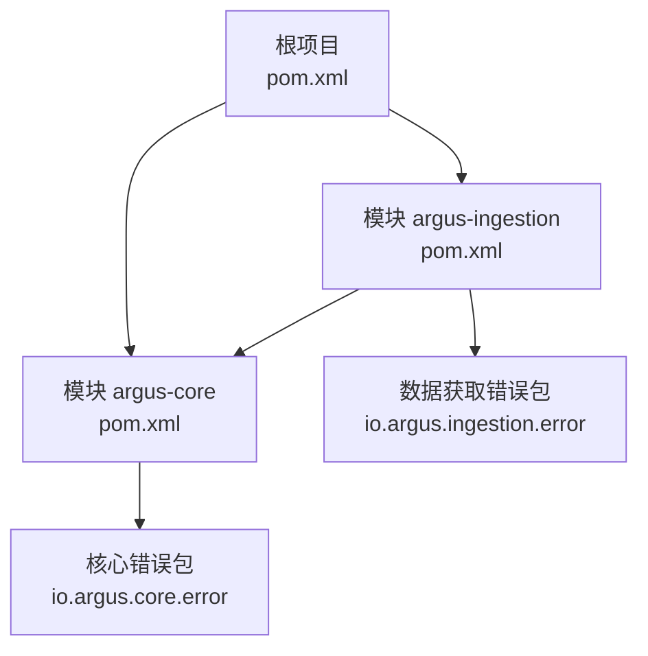
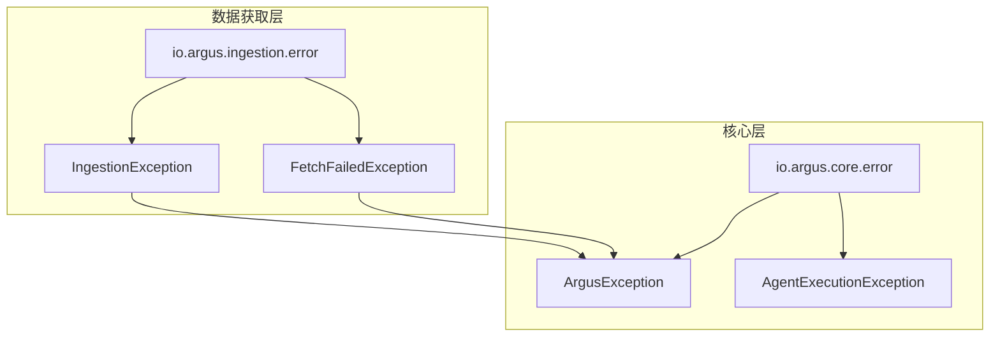
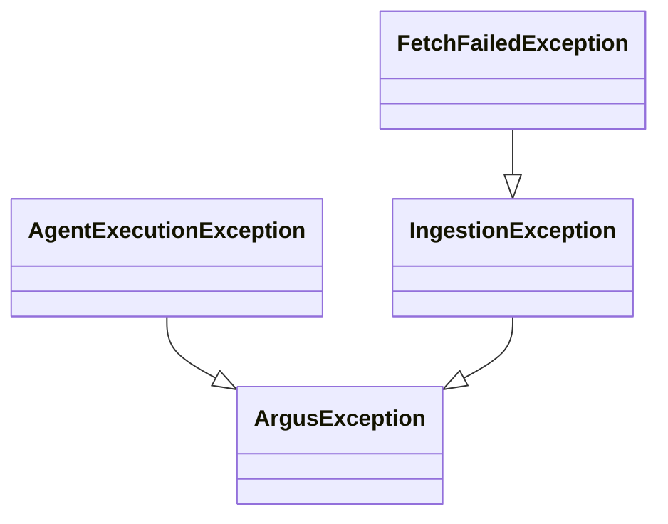
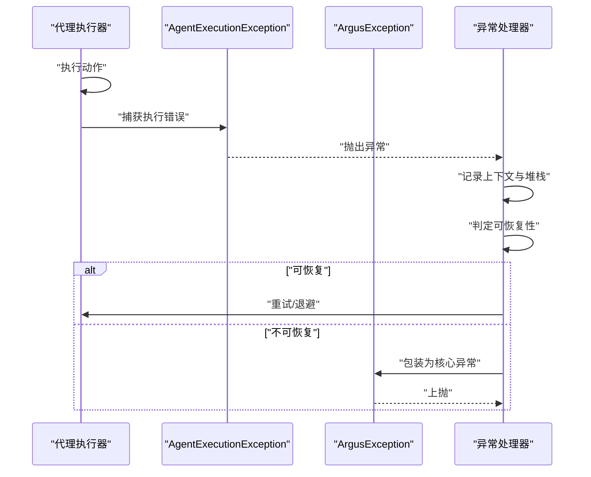
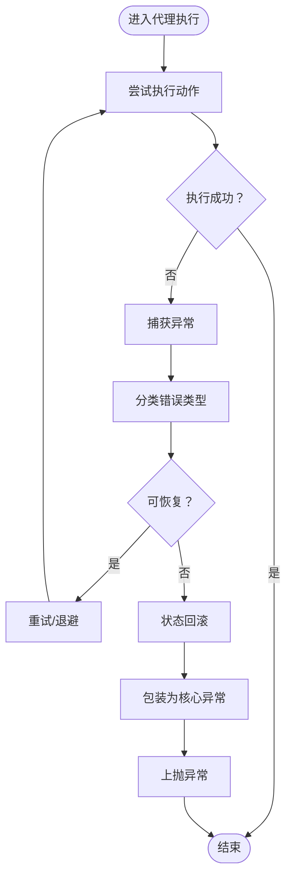
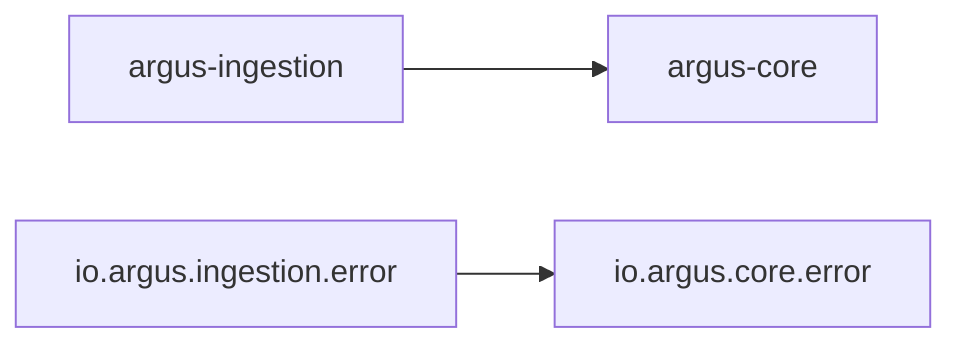

# 错误处理机制

<cite>
**本文引用的文件**
- [ArgusException.java](file://argus-core/src/main/java/io/argus/core/error/ArgusException.java)
- [AgentExecutionException.java](file://argus-core/src/main/java/io/argus/core/error/AgentExecutionException.java)
- [IngestionException.java](file://argus-ingestion/src/main/java/io/argus/ingestion/error/IngestionException.java)
- [FetchFailedException.java](file://argus-ingestion/src/main/java/io/argus/ingestion/error/FetchFailedException.java)
- [package-info.java（核心错误包）](file://argus-core/src/main/java/io/argus/core/error/package-info.java)
- [pom.xml（根项目）](file://pom.xml)
- [pom.xml（argus-core）](file://argus-core/pom.xml)
- [pom.xml（argus-ingestion）](file://argus-ingestion/pom.xml)
- [readme.md](file://readme.md)
</cite>

## 目录
1. [引言](#引言)
2. [项目结构](#项目结构)
3. [核心组件](#核心组件)
4. [架构总览](#架构总览)
5. [详细组件分析](#详细组件分析)
6. [依赖关系分析](#依赖关系分析)
7. [性能考量](#性能考量)
8. [故障排查指南](#故障排查指南)
9. [结论](#结论)
10. [附录](#附录)

## 引言
本文件聚焦于Argus项目的错误处理机制，围绕核心异常基类ArgusException与其在代理执行场景下的专用异常AgentExecutionException展开，结合数据获取模块的IngestionException与FetchFailedException，系统阐述异常层次结构、错误分类、统一处理策略、异常传播与恢复机制、以及最佳实践与调试技巧。由于当前仓库中核心异常类仍处于占位状态，本文以现有文件为依据，给出面向未来演进的完整设计蓝图与实施建议。

## 项目结构
Argus采用多模块结构，错误处理相关的关键位置如下：
- 核心异常：argus-core 模块的 io.argus.core.error 包
- 数据获取异常：argus-ingestion 模块的 io.argus.ingestion.error 包
- 模块依赖：argus-ingestion 显式依赖 argus-core

图表来源
- [pom.xml（根项目）](file://pom.xml#L24-L29)
- [pom.xml（argus-core）](file://argus-core/pom.xml#L1-L18)
- [pom.xml（argus-ingestion）](file://argus-ingestion/pom.xml#L21-L27)

章节来源
- [pom.xml（根项目）](file://pom.xml#L24-L29)
- [pom.xml（argus-core）](file://argus-core/pom.xml#L1-L18)
- [pom.xml（argus-ingestion）](file://argus-ingestion/pom.xml#L21-L27)
- [readme.md](file://readme.md#L7-L14)

## 核心组件
本节对当前可见的核心异常类进行概览性分析，明确其职责边界与后续扩展方向。

- ArgusException（核心异常基类）
  - 定位：io.argus.core.error 包，作为所有Argus域内语义化异常的根类
  - 当前状态：类体为空，仅保留占位，用于后续继承体系扩展
  - 设计意图：提供统一的异常命名空间与可审计的错误标识，避免第三方或实现细节泄漏到公共API

- AgentExecutionException（代理执行专用异常）
  - 定位：io.argus.core.error 包，面向代理执行生命周期中的错误建模
  - 当前状态：类体为空，预留扩展点
  - 设计意图：承载执行期错误的上下文信息、重试策略提示、恢复建议等

- IngestionException（数据获取通用异常）
  - 定位：io.argus.ingestion.error 包，封装数据获取阶段的通用错误
  - 当前状态：类体为空，预留扩展点
  - 设计意图：与ArgusException解耦，确保核心层不暴露具体实现细节

- FetchFailedException（抓取失败异常）
  - 定位：io.argus.ingestion.error 包，针对抓取阶段的失败场景
  - 当前状态：类体为空，预留扩展点
  - 设计意图：区分于通用异常，便于精细化处理与告警

章节来源
- [ArgusException.java](file://argus-core/src/main/java/io/argus/core/error/ArgusException.java#L1-L8)
- [AgentExecutionException.java](file://argus-core/src/main/java/io/argus/core/error/AgentExecutionException.java#L1-L8)
- [IngestionException.java](file://argus-ingestion/src/main/java/io/argus/ingestion/error/IngestionException.java#L1-L8)
- [FetchFailedException.java](file://argus-ingestion/src/main/java/io/argus/ingestion/error/FetchFailedException.java#L1-L8)
- [package-info.java（核心错误包）](file://argus-core/src/main/java/io/argus/core/error/package-info.java#L1-L15)

## 架构总览
从模块与包的角度看，错误处理遵循“核心隔离、领域细分”的原则：
- 核心层（argus-core）：定义统一的异常基类与通用语义，屏蔽实现细节
- 领域层（argus-ingestion）：在自身包内定义领域特定异常，通过依赖关系向上复用核心异常基类
- 传播路径：领域异常可向上抛出至核心层或调用方；核心层异常由调用方决定是否继续传播或转换

图表来源
- [ArgusException.java](file://argus-core/src/main/java/io/argus/core/error/ArgusException.java#L1-L8)
- [AgentExecutionException.java](file://argus-core/src/main/java/io/argus/core/error/AgentExecutionException.java#L1-L8)
- [IngestionException.java](file://argus-ingestion/src/main/java/io/argus/ingestion/error/IngestionException.java#L1-L8)
- [FetchFailedException.java](file://argus-ingestion/src/main/java/io/argus/ingestion/error/FetchFailedException.java#L1-L8)

## 详细组件分析

### 异常层次结构与统一处理策略
- 层次结构
  - 根基类：ArgusException（核心层）
  - 代理执行：AgentExecutionException（继承自ArgusException）
  - 领域异常：IngestionException（继承自ArgusException），FetchFailedException（继承自IngestionException）
- 统一处理策略
  - 分层捕获：优先在就近领域捕获并转换，必要时上抛至核心层
  - 上下文注入：异常携带错误码、错误描述、时间戳、调用栈摘要、上下文参数等
  - 可审计：异常记录与审计日志联动，确保可追溯性
  - 可恢复：对可重试错误（如网络抖动）提供重试策略与退避算法

图表来源
- [ArgusException.java](file://argus-core/src/main/java/io/argus/core/error/ArgusException.java#L1-L8)
- [AgentExecutionException.java](file://argus-core/src/main/java/io/argus/core/error/AgentExecutionException.java#L1-L8)
- [IngestionException.java](file://argus-ingestion/src/main/java/io/argus/ingestion/error/IngestionException.java#L1-L8)
- [FetchFailedException.java](file://argus-ingestion/src/main/java/io/argus/ingestion/error/FetchFailedException.java#L1-L8)

章节来源
- [package-info.java（核心错误包）](file://argus-core/src/main/java/io/argus/core/error/package-info.java#L1-L15)
- [ArgusException.java](file://argus-core/src/main/java/io/argus/core/error/ArgusException.java#L1-L8)
- [AgentExecutionException.java](file://argus-core/src/main/java/io/argus/core/error/AgentExecutionException.java#L1-L8)
- [IngestionException.java](file://argus-ingestion/src/main/java/io/argus/ingestion/error/IngestionException.java#L1-L8)
- [FetchFailedException.java](file://argus-ingestion/src/main/java/io/argus/ingestion/error/FetchFailedException.java#L1-L8)

### AgentExecutionException：代理执行专用异常
- 设计目标
  - 聚焦代理执行生命周期中的错误：初始化失败、动作执行失败、状态回滚失败、资源释放异常等
  - 提供调试支持：包含执行上下文、关键变量快照、重试次数、延迟策略等
  - 支持恢复：区分可恢复与不可恢复错误，指导上层采取重试、降级或终止策略
- 典型场景
  - 执行超时：触发重试或快速失败
  - 资源不足：触发降级或等待策略
  - 业务校验失败：返回明确错误码与修复建议
- 与核心异常的关系
  - 继承自ArgusException，确保统一的审计与处理入口

图表来源
- [AgentExecutionException.java](file://argus-core/src/main/java/io/argus/core/error/AgentExecutionException.java#L1-L8)
- [ArgusException.java](file://argus-core/src/main/java/io/argus/core/error/ArgusException.java#L1-L8)

章节来源
- [AgentExecutionException.java](file://argus-core/src/main/java/io/argus/core/error/AgentExecutionException.java#L1-L8)
- [ArgusException.java](file://argus-core/src/main/java/io/argus/core/error/ArgusException.java#L1-L8)

### 错误信息的结构化设计
- 字段建议
  - 错误码：唯一标识错误类型的稳定编码
  - 错误描述：人类可读的错误说明，支持本地化
  - 上下文信息：请求ID、代理ID、动作ID、时间戳、重试次数、堆栈摘要
  - 恢复建议：自动重试、人工干预、降级策略等
- 与审计日志联动
  - 异常发生时同步写入审计事件，包含错误码、描述、上下文与处理结果
- 可观测性
  - 对高频错误进行指标采集与告警阈值设置

章节来源
- [package-info.java（核心错误包）](file://argus-core/src/main/java/io/argus/core/error/package-info.java#L1-L15)

### 异常在代理执行过程中的传播机制
- 捕获与转换
  - 领域异常捕获后，根据错误类型与上下文决定是否转换为核心异常
- 状态回滚
  - 对已生效的副作用进行补偿或回滚，保证系统一致性
- 执行恢复
  - 可重试错误采用指数退避；不可重试错误则终止流程并输出诊断信息
- 优雅降级
  - 在资源受限或服务不可用时，切换到降级路径并记录降级原因

图表来源
- [AgentExecutionException.java](file://argus-core/src/main/java/io/argus/core/error/AgentExecutionException.java#L1-L8)
- [ArgusException.java](file://argus-core/src/main/java/io/argus/core/error/ArgusException.java#L1-L8)

章节来源
- [AgentExecutionException.java](file://argus-core/src/main/java/io/argus/core/error/AgentExecutionException.java#L1-L8)
- [ArgusException.java](file://argus-core/src/main/java/io/argus/core/error/ArgusException.java#L1-L8)

### 最佳实践与调试技巧
- 异常捕获
  - 在代理执行器内部捕获AgentExecutionException，记录上下文并决定是否重试
  - 对IngestionException与FetchFailedException进行领域内处理，必要时转换为核心异常
- 错误传播
  - 保持异常链路清晰，避免吞掉原始异常信息
  - 对可恢复错误使用幂等重试，对不可恢复错误尽快失败并输出诊断
- 优雅降级
  - 在网络不稳定或上游服务不可用时，启用降级策略并记录降级原因
- 调试支持
  - 在异常中附带请求ID、代理ID、动作ID、时间戳、重试次数、关键变量快照
  - 使用结构化日志与审计事件，确保可追溯性

章节来源
- [package-info.java（核心错误包）](file://argus-core/src/main/java/io/argus/core/error/package-info.java#L1-L15)
- [IngestionException.java](file://argus-ingestion/src/main/java/io/argus/ingestion/error/IngestionException.java#L1-L8)
- [FetchFailedException.java](file://argus-ingestion/src/main/java/io/argus/ingestion/error/FetchFailedException.java#L1-L8)

## 依赖关系分析
- 模块依赖
  - argus-ingestion 依赖 argus-core，确保领域异常可复用核心异常基类
- 包依赖
  - 领域包（io.argus.ingestion.error）依赖核心包（io.argus.core.error）

图表来源
- [pom.xml（argus-ingestion）](file://argus-ingestion/pom.xml#L21-L27)
- [pom.xml（argus-core）](file://argus-core/pom.xml#L1-L18)

章节来源
- [pom.xml（argus-ingestion）](file://argus-ingestion/pom.xml#L21-L27)
- [pom.xml（argus-core）](file://argus-core/pom.xml#L1-L18)

## 性能考量
- 异常开销控制
  - 避免在热路径频繁抛出异常；对可预期的错误使用返回码或可选类型
  - 对重试场景使用指数退避，防止雪崩效应
- 日志与审计
  - 结构化日志减少解析成本；审计事件异步落盘，避免阻塞主流程
- 资源管理
  - 在finally或try-with-resources中确保资源释放，减少异常导致的资源泄露

## 故障排查指南
- 常见问题定位
  - 执行超时：检查网络与上游服务可用性，确认重试策略与退避参数
  - 抓取失败：核对URL、协议、限流策略与robots规则
  - 资源不足：监控内存与连接池使用情况，调整并发度
- 诊断信息收集
  - 捕获异常时记录请求ID、代理ID、动作ID、时间戳、重试次数、堆栈摘要
  - 将异常与审计事件关联，形成闭环追踪

章节来源
- [FetchFailedException.java](file://argus-ingestion/src/main/java/io/argus/ingestion/error/FetchFailedException.java#L1-L8)
- [IngestionException.java](file://argus-ingestion/src/main/java/io/argus/ingestion/error/IngestionException.java#L1-L8)
- [AgentExecutionException.java](file://argus-core/src/main/java/io/argus/core/error/AgentExecutionException.java#L1-L8)

## 结论
当前Argus的错误处理框架以ArgusException为核心基类与领域异常为分支，形成了清晰的分层与职责边界。尽管核心异常类体尚为空，但其包文档明确了语义化异常的定位与原则。建议在后续版本中完善AgentExecutionException与领域异常的具体字段与行为，建立统一的异常处理流水线与可观测性体系，从而支撑Argus在复杂代理场景下的可审计、可控制与可复现目标。

## 附录
- 术语表
  - 核心异常：由核心模块定义、面向全系统的语义化异常基类
  - 领域异常：由特定模块定义、面向该模块业务领域的异常类型
  - 可恢复错误：可通过重试或补偿操作恢复的错误
  - 不可恢复错误：需要人工干预或终止流程的错误