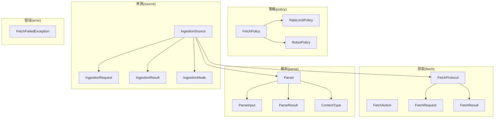
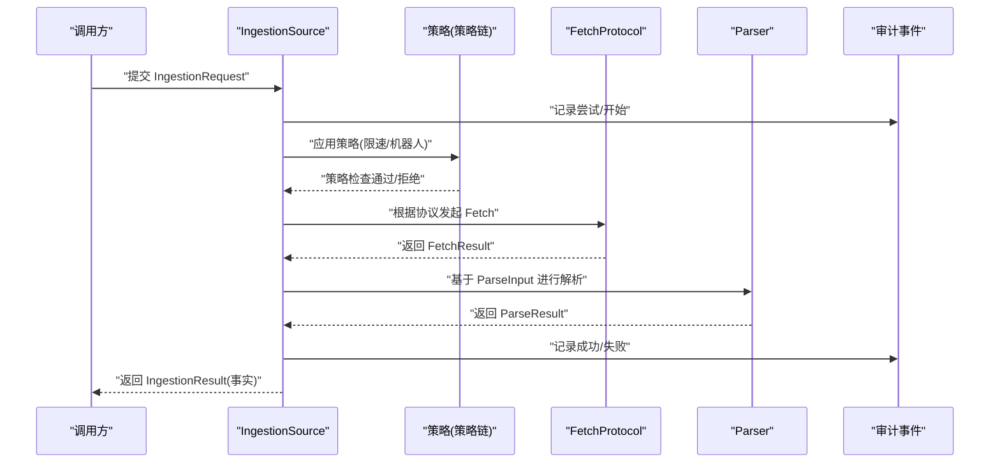
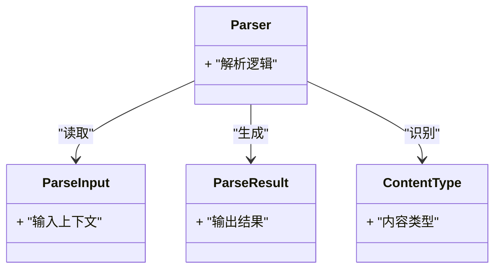
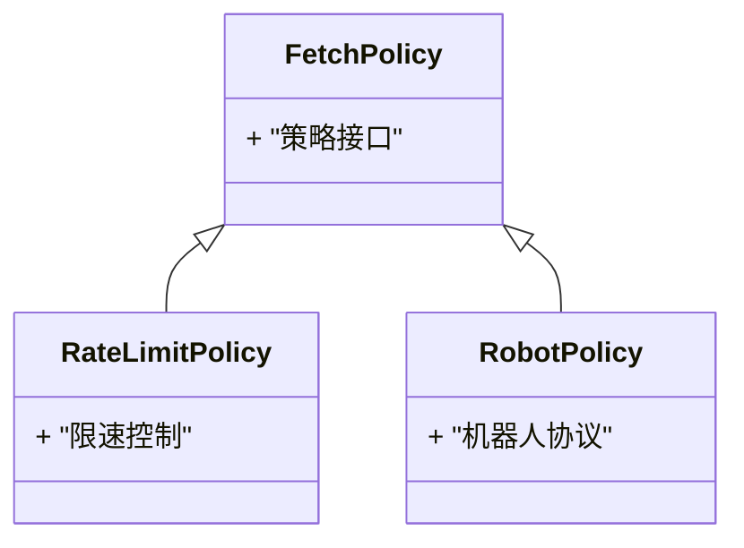
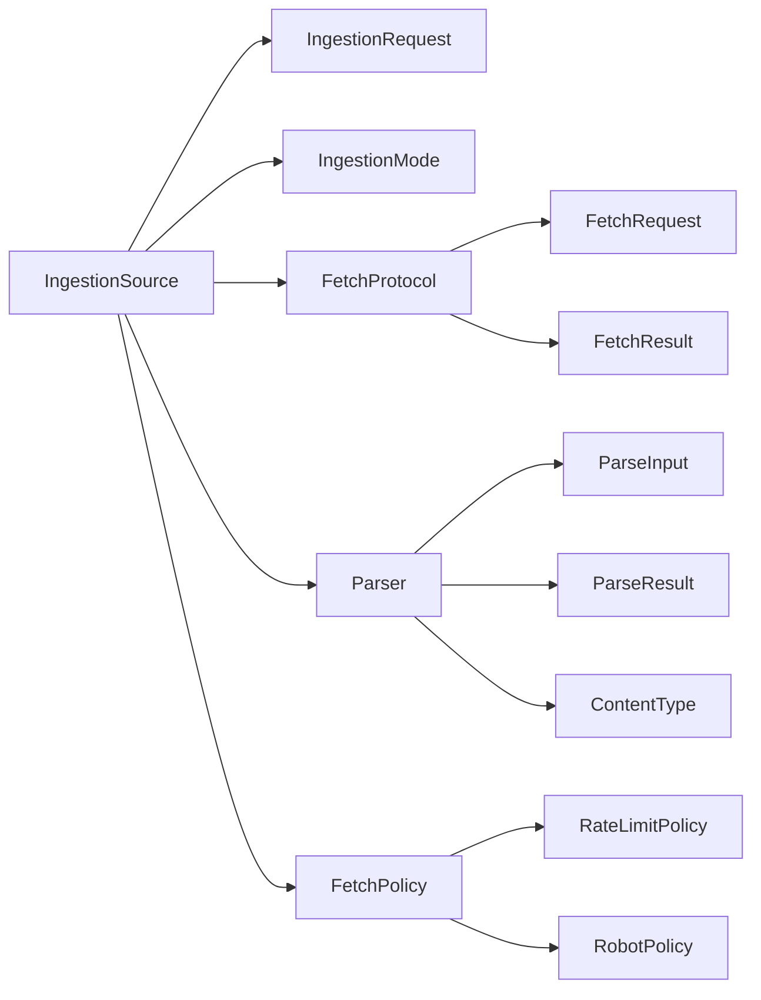

# argus-ingestion 数据获取模块

<cite>
**本文引用的文件**
- [FetchAction.java](file://argus-ingestion/src/main/java/io/argus/ingestion/fetch/FetchAction.java)
- [FetchProtocol.java](file://argus-ingestion/src/main/java/io/argus/ingestion/fetch/FetchProtocol.java)
- [FetchRequest.java](file://argus-ingestion/src/main/java/io/argus/ingestion/fetch/FetchRequest.java)
- [FetchResult.java](file://argus-ingestion/src/main/java/io/argus/ingestion/fetch/FetchResult.java)
- [Parser.java](file://argus-ingestion/src/main/java/io/argus/ingestion/parse/Parser.java)
- [ParseInput.java](file://argus-ingestion/src/main/java/io/argus/ingestion/parse/ParseInput.java)
- [ParseResult.java](file://argus-ingestion/src/main/java/io/argus/ingestion/parse/ParseResult.java)
- [ContentType.java](file://argus-ingestion/src/main/java/io/argus/ingestion/parse/ContentType.java)
- [FetchPolicy.java](file://argus-ingestion/src/main/java/io/argus/ingestion/policy/FetchPolicy.java)
- [RateLimitPolicy.java](file://argus-ingestion/src/main/java/io/argus/ingestion/policy/RateLimitPolicy.java)
- [RobotPolicy.java](file://argus-ingestion/src/main/java/io/argus/ingestion/policy/RobotPolicy.java)
- [IngestionRequest.java](file://argus-ingestion/src/main/java/io/argus/ingestion/source/IngestionRequest.java)
- [IngestionResult.java](file://argus-ingestion/src/main/java/io/argus/ingestion/source/IngestionResult.java)
- [IngestionSource.java](file://argus-ingestion/src/main/java/io/argus/ingestion/source/IngestionSource.java)
- [IngestionMode.java](file://argus-ingestion/src/main/java/io/argus/ingestion/source/IngestionMode.java)
- [FetchFailedException.java](file://argus-ingestion/src/main/java/io/argus/ingestion/error/FetchFailedException.java)
</cite>

## 目录
1. [引言](#引言)
2. [项目结构](#项目结构)
3. [核心组件](#核心组件)
4. [架构总览](#架构总览)
5. [详细组件分析](#详细组件分析)
6. [依赖关系分析](#依赖关系分析)
7. [性能考虑](#性能考虑)
8. [故障排查指南](#故障排查指南)
9. [结论](#结论)
10. [附录：使用示例与最佳实践](#附录使用示例与最佳实践)

## 引言
本文件为 argus-ingestion 数据获取模块的综合技术文档，聚焦于网络数据获取领域中的关键抽象与协作关系。模块围绕“获取（Fetch）—解析（Parse）—策略（Policy）—来源（Source）”的闭环设计，强调事实性观测（Fact）的不可变性、可重放性（Replay）与审计（Audit）能力。本文将系统阐述 FetchAction 的设计意图与实现要点、FetchProtocol 对多协议的支持方式、Parser 解析器体系的输入/输出与内容类型识别、Policy 策略体系的通用策略与限速/机器人协议策略，以及 IngestionRequest 与 IngestionResult 的建模理念，并给出端到端的数据获取流程图与扩展实践建议。

## 项目结构
argus-ingestion 模块采用按职责分层的包组织方式：
- fetch：网络获取相关抽象（动作、协议、请求、结果）
- parse：解析相关抽象（解析器、输入、输出、内容类型）
- policy：策略相关抽象（基础策略、限速策略、机器人协议策略）
- source：来源抽象（请求、结果、来源、执行模式）
- error：获取失败等异常类型

图表来源
- [IngestionSource.java](file://argus-ingestion/src/main/java/io/argus/ingestion/source/IngestionSource.java#L1-L110)
- [IngestionRequest.java](file://argus-ingestion/src/main/java/io/argus/ingestion/source/IngestionRequest.java#L1-L8)
- [IngestionResult.java](file://argus-ingestion/src/main/java/io/argus/ingestion/source/IngestionResult.java#L1-L8)
- [IngestionMode.java](file://argus-ingestion/src/main/java/io/argus/ingestion/source/IngestionMode.java#L1-L8)
- [FetchProtocol.java](file://argus-ingestion/src/main/java/io/argus/ingestion/fetch/FetchProtocol.java#L1-L8)
- [FetchRequest.java](file://argus-ingestion/src/main/java/io/argus/ingestion/fetch/FetchRequest.java#L1-L8)
- [FetchResult.java](file://argus-ingestion/src/main/java/io/argus/ingestion/fetch/FetchResult.java#L1-L8)
- [Parser.java](file://argus-ingestion/src/main/java/io/argus/ingestion/parse/Parser.java#L1-L8)
- [ParseInput.java](file://argus-ingestion/src/main/java/io/argus/ingestion/parse/ParseInput.java#L1-L8)
- [ParseResult.java](file://argus-ingestion/src/main/java/io/argus/ingestion/parse/ParseResult.java#L1-L8)
- [ContentType.java](file://argus-ingestion/src/main/java/io/argus/ingestion/parse/ContentType.java#L1-L8)
- [FetchPolicy.java](file://argus-ingestion/src/main/java/io/argus/ingestion/policy/FetchPolicy.java#L1-L8)
- [RateLimitPolicy.java](file://argus-ingestion/src/main/java/io/argus/ingestion/policy/RateLimitPolicy.java#L1-L8)
- [RobotPolicy.java](file://argus-ingestion/src/main/java/io/argus/ingestion/policy/RobotPolicy.java#L1-L8)
- [FetchFailedException.java](file://argus-ingestion/src/main/java/io/argus/ingestion/error/FetchFailedException.java#L1-L8)

章节来源
- [IngestionSource.java](file://argus-ingestion/src/main/java/io/argus/ingestion/source/IngestionSource.java#L1-L110)

## 核心组件
本节对各子系统的关键类进行概览式说明，帮助读者快速把握模块职责与交互边界。

- 获取（Fetch）
  - FetchAction：作为动作接口的实现，承载获取阶段的动作元数据与类型标识
  - FetchProtocol：协议抽象，用于扩展不同网络协议的获取行为
  - FetchRequest：获取请求载体，封装发起网络请求所需的参数快照
  - FetchResult：获取结果载体，封装网络响应与状态信息

- 解析（Parse）
  - Parser：解析器抽象，负责将原始数据转换为统一的观测模型
  - ParseInput：解析输入，描述待解析的数据与上下文
  - ParseResult：解析输出，描述解析后的结构化结果
  - ContentType：内容类型识别，辅助选择合适的解析器

- 策略（Policy）
  - FetchPolicy：基础策略接口，定义策略的通用行为契约
  - RateLimitPolicy：速率限制策略，控制请求频率以避免过载
  - RobotPolicy：机器人协议策略，遵循 robots.txt 等规则

- 来源（Source）
  - IngestionRequest：请求模型，包含一次获取步骤的完整快照
  - IngestionResult：结果封装，包含事实性观测与审计信息
  - IngestionSource：数据获取源，负责在不同执行模式下产生事实
  - IngestionMode：执行模式，支持 LIVE、REPLAY、DRY_RUN

- 错误（Error）
  - FetchFailedException：获取失败异常，用于表达网络或协议层面的错误

章节来源
- [FetchAction.java](file://argus-ingestion/src/main/java/io/argus/ingestion/fetch/FetchAction.java#L1-L21)
- [FetchProtocol.java](file://argus-ingestion/src/main/java/io/argus/ingestion/fetch/FetchProtocol.java#L1-L8)
- [FetchRequest.java](file://argus-ingestion/src/main/java/io/argus/ingestion/fetch/FetchRequest.java#L1-L8)
- [FetchResult.java](file://argus-ingestion/src/main/java/io/argus/ingestion/fetch/FetchResult.java#L1-L8)
- [Parser.java](file://argus-ingestion/src/main/java/io/argus/ingestion/parse/Parser.java#L1-L8)
- [ParseInput.java](file://argus-ingestion/src/main/java/io/argus/ingestion/parse/ParseInput.java#L1-L8)
- [ParseResult.java](file://argus-ingestion/src/main/java/io/argus/ingestion/parse/ParseResult.java#L1-L8)
- [ContentType.java](file://argus-ingestion/src/main/java/io/argus/ingestion/parse/ContentType.java#L1-L8)
- [FetchPolicy.java](file://argus-ingestion/src/main/java/io/argus/ingestion/policy/FetchPolicy.java#L1-L8)
- [RateLimitPolicy.java](file://argus-ingestion/src/main/java/io/argus/ingestion/policy/RateLimitPolicy.java#L1-L8)
- [RobotPolicy.java](file://argus-ingestion/src/main/java/io/argus/ingestion/policy/RobotPolicy.java#L1-L8)
- [IngestionRequest.java](file://argus-ingestion/src/main/java/io/argus/ingestion/source/IngestionRequest.java#L1-L8)
- [IngestionResult.java](file://argus-ingestion/src/main/java/io/argus/ingestion/source/IngestionResult.java#L1-L8)
- [IngestionSource.java](file://argus-ingestion/src/main/java/io/argus/ingestion/source/IngestionSource.java#L1-L110)
- [IngestionMode.java](file://argus-ingestion/src/main/java/io/argus/ingestion/source/IngestionMode.java#L1-L8)
- [FetchFailedException.java](file://argus-ingestion/src/main/java/io/argus/ingestion/error/FetchFailedException.java#L1-L8)

## 架构总览
下图展示了从请求发起到结果返回的端到端处理机制，体现 IngestionSource 如何协调 Fetch、Parse、Policy 与审计/回放语义：

图表来源
- [IngestionSource.java](file://argus-ingestion/src/main/java/io/argus/ingestion/source/IngestionSource.java#L1-L110)
- [FetchProtocol.java](file://argus-ingestion/src/main/java/io/argus/ingestion/fetch/FetchProtocol.java#L1-L8)
- [FetchResult.java](file://argus-ingestion/src/main/java/io/argus/ingestion/fetch/FetchResult.java#L1-L8)
- [Parser.java](file://argus-ingestion/src/main/java/io/argus/ingestion/parse/Parser.java#L1-L8)
- [ParseInput.java](file://argus-ingestion/src/main/java/io/argus/ingestion/parse/ParseInput.java#L1-L8)
- [ParseResult.java](file://argus-ingestion/src/main/java/io/argus/ingestion/parse/ParseResult.java#L1-L8)
- [FetchPolicy.java](file://argus-ingestion/src/main/java/io/argus/ingestion/policy/FetchPolicy.java#L1-L8)
- [RateLimitPolicy.java](file://argus-ingestion/src/main/java/io/argus/ingestion/policy/RateLimitPolicy.java#L1-L8)
- [RobotPolicy.java](file://argus-ingestion/src/main/java/io/argus/ingestion/policy/RobotPolicy.java#L1-L8)
- [IngestionRequest.java](file://argus-ingestion/src/main/java/io/argus/ingestion/source/IngestionRequest.java#L1-L8)
- [IngestionResult.java](file://argus-ingestion/src/main/java/io/argus/ingestion/source/IngestionResult.java#L1-L8)

## 详细组件分析

### FetchAction 设计与实现
- 设计意图
  - 将“获取”抽象为一个标准动作，便于统一调度与审计
  - 通过类型与元数据接口暴露动作属性，便于上层决策与日志追踪
- 实现要点
  - 类型与元数据方法占位，具体实现由具体协议/来源组合决定
  - 与核心动作接口保持一致的契约，确保与运行时的兼容性

章节来源
- [FetchAction.java](file://argus-ingestion/src/main/java/io/argus/ingestion/fetch/FetchAction.java#L1-L21)

### FetchProtocol 协议抽象
- 设计意图
  - 为不同网络协议（如 HTTP、FTP、文件系统等）提供统一的获取入口
  - 通过协议对象隔离网络细节，使上层仅面向 FetchRequest/FetchResult
- 实现要点
  - 协议类目前为空壳，需结合 FetchRequest/FetchResult 扩展具体协议实现
  - 建议在具体协议实现中注入超时、重试、认证等配置

章节来源
- [FetchProtocol.java](file://argus-ingestion/src/main/java/io/argus/ingestion/fetch/FetchProtocol.java#L1-L8)
- [FetchRequest.java](file://argus-ingestion/src/main/java/io/argus/ingestion/fetch/FetchRequest.java#L1-L8)
- [FetchResult.java](file://argus-ingestion/src/main/java/io/argus/ingestion/fetch/FetchResult.java#L1-L8)

### Parser 解析器系统
- ParseInput 输入处理
  - 描述待解析数据的来源、编码、长度等上下文信息
  - 与 ContentType 配合，驱动解析器选择合适的解析路径
- ParseResult 输出格式
  - 统一表示解析后的结构化结果，供后续观测与推理使用
- ContentType 内容类型识别
  - 提供媒体类型/子类型识别，辅助路由到正确的解析器
- Parser 接口
  - 抽象解析过程，屏蔽底层解析库差异

图表来源
- [Parser.java](file://argus-ingestion/src/main/java/io/argus/ingestion/parse/Parser.java#L1-L8)
- [ParseInput.java](file://argus-ingestion/src/main/java/io/argus/ingestion/parse/ParseInput.java#L1-L8)
- [ParseResult.java](file://argus-ingestion/src/main/java/io/argus/ingestion/parse/ParseResult.java#L1-L8)
- [ContentType.java](file://argus-ingestion/src/main/java/io/argus/ingestion/parse/ContentType.java#L1-L8)

章节来源
- [Parser.java](file://argus-ingestion/src/main/java/io/argus/ingestion/parse/Parser.java#L1-L8)
- [ParseInput.java](file://argus-ingestion/src/main/java/io/argus/ingestion/parse/ParseInput.java#L1-L8)
- [ParseResult.java](file://argus-ingestion/src/main/java/io/argus/ingestion/parse/ParseResult.java#L1-L8)
- [ContentType.java](file://argus-ingestion/src/main/java/io/argus/ingestion/parse/ContentType.java#L1-L8)

### Policy 策略系统
- FetchPolicy 基础策略
  - 定义策略的通用接口与生命周期钩子
- RateLimitPolicy 速率限制策略
  - 控制单位时间内的请求数量，避免触发目标系统的限流或封禁
- RobotPolicy 机器人协议遵循
  - 遵循 robots.txt 等规则，尊重站点的爬取政策

图表来源
- [FetchPolicy.java](file://argus-ingestion/src/main/java/io/argus/ingestion/policy/FetchPolicy.java#L1-L8)
- [RateLimitPolicy.java](file://argus-ingestion/src/main/java/io/argus/ingestion/policy/RateLimitPolicy.java#L1-L8)
- [RobotPolicy.java](file://argus-ingestion/src/main/java/io/argus/ingestion/policy/RobotPolicy.java#L1-L8)

章节来源
- [FetchPolicy.java](file://argus-ingestion/src/main/java/io/argus/ingestion/policy/FetchPolicy.java#L1-L8)
- [RateLimitPolicy.java](file://argus-ingestion/src/main/java/io/argus/ingestion/policy/RateLimitPolicy.java#L1-L8)
- [RobotPolicy.java](file://argus-ingestion/src/main/java/io/argus/ingestion/policy/RobotPolicy.java#L1-L8)

### IngestionRequest 与 IngestionResult
- IngestionRequest 请求模型
  - 记录一次获取步骤的完整快照，确保审计、重放与可追溯性
  - 包含协议参数、策略配置、时间戳、来源标识等必要字段
- IngestionResult 结果封装
  - 封装事实性观测与审计元信息，保证不可变性与权威性
  - 支持在回放模式下直接重建观测，不重复访问外部世界

章节来源
- [IngestionRequest.java](file://argus-ingestion/src/main/java/io/argus/ingestion/source/IngestionRequest.java#L1-L8)
- [IngestionResult.java](file://argus-ingestion/src/main/java/io/argus/ingestion/source/IngestionResult.java#L1-L8)
- [IngestionSource.java](file://argus-ingestion/src/main/java/io/argus/ingestion/source/IngestionSource.java#L1-L110)

### 执行模式与回放语义
- IngestionMode
  - LIVE：访问外部世界，允许副作用
  - REPLAY：仅基于历史事实重建观测，禁止再次访问外部世界
  - DRY_RUN：验证流程正确性，不产生事实
- 回放语义要求
  - 必须确定且被动，不得引入新的外部观测
  - 不得隐藏副作用，审计日志必须完整

章节来源
- [IngestionMode.java](file://argus-ingestion/src/main/java/io/argus/ingestion/source/IngestionMode.java#L1-L8)
- [IngestionSource.java](file://argus-ingestion/src/main/java/io/argus/ingestion/source/IngestionSource.java#L1-L110)

## 依赖关系分析
- 组件耦合
  - IngestionSource 是核心协调者，向上承接请求与模式，向下协调 Fetch/Parse/Policy
  - FetchProtocol 与 Parser 通过输入/输出类解耦，便于替换与扩展
  - Policy 以策略链形式插入，增强可插拔性
- 外部依赖
  - 模块未显式声明第三方依赖，但建议在具体实现中引入网络与解析库
- 循环依赖
  - 当前结构无循环依赖迹象，接口清晰

图表来源
- [IngestionSource.java](file://argus-ingestion/src/main/java/io/argus/ingestion/source/IngestionSource.java#L1-L110)
- [FetchProtocol.java](file://argus-ingestion/src/main/java/io/argus/ingestion/fetch/FetchProtocol.java#L1-L8)
- [FetchRequest.java](file://argus-ingestion/src/main/java/io/argus/ingestion/fetch/FetchRequest.java#L1-L8)
- [FetchResult.java](file://argus-ingestion/src/main/java/io/argus/ingestion/fetch/FetchResult.java#L1-L8)
- [Parser.java](file://argus-ingestion/src/main/java/io/argus/ingestion/parse/Parser.java#L1-L8)
- [ParseInput.java](file://argus-ingestion/src/main/java/io/argus/ingestion/parse/ParseInput.java#L1-L8)
- [ParseResult.java](file://argus-ingestion/src/main/java/io/argus/ingestion/parse/ParseResult.java#L1-L8)
- [ContentType.java](file://argus-ingestion/src/main/java/io/argus/ingestion/parse/ContentType.java#L1-L8)
- [FetchPolicy.java](file://argus-ingestion/src/main/java/io/argus/ingestion/policy/FetchPolicy.java#L1-L8)
- [RateLimitPolicy.java](file://argus-ingestion/src/main/java/io/argus/ingestion/policy/RateLimitPolicy.java#L1-L8)
- [RobotPolicy.java](file://argus-ingestion/src/main/java/io/argus/ingestion/policy/RobotPolicy.java#L1-L8)

## 性能考虑
- 限流与退避
  - 使用 RateLimitPolicy 控制并发与频率，结合指数退避降低失败率
- 缓存与去重
  - 在 Parse 层引入缓存键（如内容哈希），减少重复解析成本
- 超时与资源回收
  - Fetch 层设置合理超时与连接池上限，避免资源泄露
- 解析优化
  - 根据 ContentType 选择轻量解析器，避免不必要的全量解析

## 故障排查指南
- 常见问题
  - 获取失败：检查 FetchFailedException 的上下文与堆栈，定位协议/网络/认证问题
  - 解析异常：确认 ParseInput 的数据完整性与 ContentType 识别是否匹配
  - 策略冲突：核对策略链顺序与配置，避免限速与机器人协议互相抵消
- 审计与回放
  - 利用审计事件重建执行轨迹，区分 LIVE 与 REPLAY 的差异
  - 在 DRY_RUN 下验证请求快照与策略配置的正确性

章节来源
- [FetchFailedException.java](file://argus-ingestion/src/main/java/io/argus/ingestion/error/FetchFailedException.java#L1-L8)
- [IngestionSource.java](file://argus-ingestion/src/main/java/io/argus/ingestion/source/IngestionSource.java#L1-L110)

## 结论
argus-ingestion 通过“获取—解析—策略—来源”的清晰分层，提供了可扩展、可审计、可回放的数据获取框架。FetchProtocol 与 Parser 的抽象使得多协议与多格式解析成为可能；Policy 系统保障了合规与稳定性；IngestionSource 的事实性与回放语义则确保了结果的权威性与可追溯性。建议在实际落地时，优先完善协议与解析器的具体实现，并结合业务场景配置策略链，以获得稳定高效的获取体验。

## 附录：使用示例与最佳实践
- 自定义 FetchProtocol
  - 步骤
    - 基于 FetchProtocol 扩展现有协议实现
    - 定义 FetchRequest/FetchResult 的具体字段与序列化方式
    - 注入超时、重试、认证等配置
  - 参考路径
    - [FetchProtocol.java](file://argus-ingestion/src/main/java/io/argus/ingestion/fetch/FetchProtocol.java#L1-L8)
    - [FetchRequest.java](file://argus-ingestion/src/main/java/io/argus/ingestion/fetch/FetchRequest.java#L1-L8)
    - [FetchResult.java](file://argus-ingestion/src/main/java/io/argus/ingestion/fetch/FetchResult.java#L1-L8)
- 自定义 Parser
  - 步骤
    - 基于 Parser 接口实现解析逻辑
    - 使用 ParseInput 读取数据，结合 ContentType 选择解析路径
    - 产出 ParseResult 并保证幂等与可重放
  - 参考路径
    - [Parser.java](file://argus-ingestion/src/main/java/io/argus/ingestion/parse/Parser.java#L1-L8)
    - [ParseInput.java](file://argus-ingestion/src/main/java/io/argus/ingestion/parse/ParseInput.java#L1-L8)
    - [ParseResult.java](file://argus-ingestion/src/main/java/io/argus/ingestion/parse/ParseResult.java#L1-L8)
    - [ContentType.java](file://argus-ingestion/src/main/java/io/argus/ingestion/parse/ContentType.java#L1-L8)
- 配置策略
  - 步骤
    - 在策略链中组合 FetchPolicy、RateLimitPolicy、RobotPolicy
    - 针对不同站点/业务设置限速窗口与阈值
    - 启用机器人协议检查，避免违规访问
  - 参考路径
    - [FetchPolicy.java](file://argus-ingestion/src/main/java/io/argus/ingestion/policy/FetchPolicy.java#L1-L8)
    - [RateLimitPolicy.java](file://argus-ingestion/src/main/java/io/argus/ingestion/policy/RateLimitPolicy.java#L1-L8)
    - [RobotPolicy.java](file://argus-ingestion/src/main/java/io/argus/ingestion/policy/RobotPolicy.java#L1-L8)
- 端到端流程
  - 步骤
    - IngestionSource 接收 IngestionRequest
    - 应用策略后调用 FetchProtocol 发起请求
    - 使用 Parser 解析 FetchResult 为 ParseResult
    - 生成 IngestionResult 并记录审计事件
  - 参考路径
    - [IngestionSource.java](file://argus-ingestion/src/main/java/io/argus/ingestion/source/IngestionSource.java#L1-L110)
    - [IngestionRequest.java](file://argus-ingestion/src/main/java/io/argus/ingestion/source/IngestionRequest.java#L1-L8)
    - [IngestionResult.java](file://argus-ingestion/src/main/java/io/argus/ingestion/source/IngestionResult.java#L1-L8)