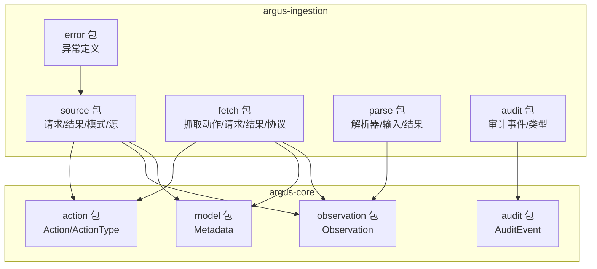
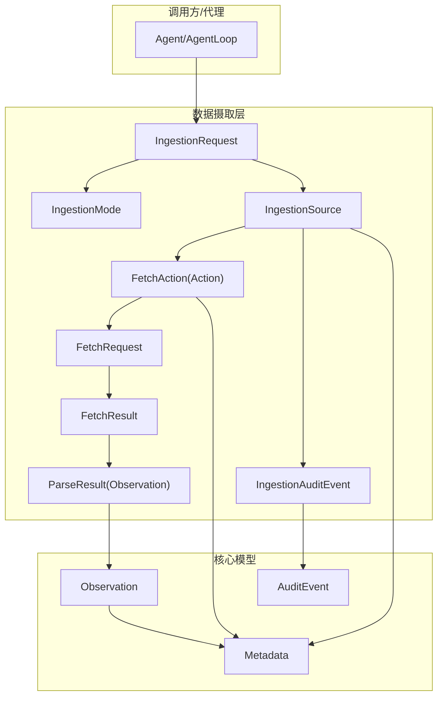
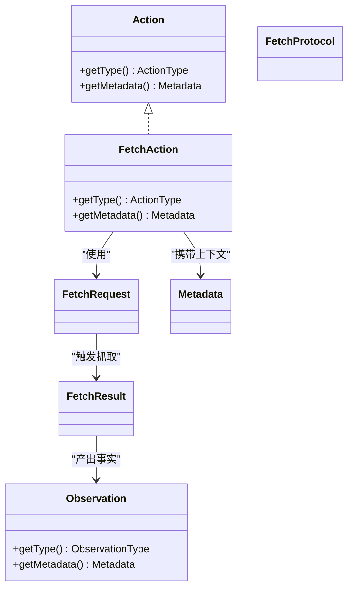
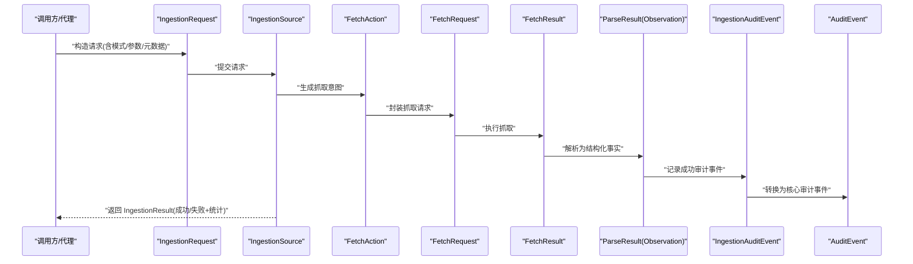
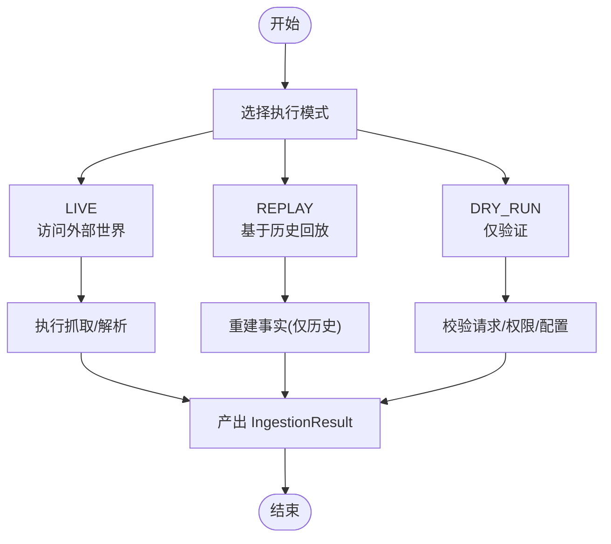
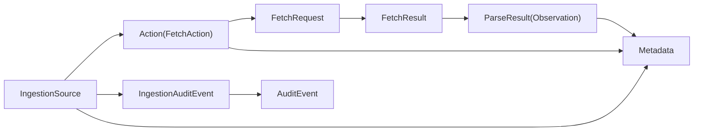

# 数据摄取模型

<cite>
**本文引用的文件**
- [IngestionRequest.java](file://argus-ingestion/src/main/java/io/argus/ingestion/source/IngestionRequest.java)
- [IngestionResult.java](file://argus-ingestion/src/main/java/io/argus/ingestion/source/IngestionResult.java)
- [IngestionMode.java](file://argus-ingestion/src/main/java/io/argus/ingestion/source/IngestionMode.java)
- [IngestionSource.java](file://argus-ingestion/src/main/java/io/argus/ingestion/source/IngestionSource.java)
- [FetchRequest.java](file://argus-ingestion/src/main/java/io/argus/ingestion/fetch/FetchRequest.java)
- [FetchResult.java](file://argus-ingestion/src/main/java/io/argus/ingestion/fetch/FetchResult.java)
- [FetchAction.java](file://argus-ingestion/src/main/java/io/argus/ingestion/fetch/FetchAction.java)
- [FetchProtocol.java](file://argus-ingestion/src/main/java/io/argus/ingestion/fetch/FetchProtocol.java)
- [ParseResult.java](file://argus-ingestion/src/main/java/io/argus/ingestion/parse/ParseResult.java)
- [Parser.java](file://argus-ingestion/src/main/java/io/argus/ingestion/parse/Parser.java)
- [IngestionAuditEvent.java](file://argus-ingestion/src/main/java/io/argus/ingestion/audit/IngestionAuditEvent.java)
- [IngestionAuditType.java](file://argus-ingestion/src/main/java/io/argus/ingestion/audit/IngestionAuditType.java)
- [IngestionException.java](file://argus-ingestion/src/main/java/io/argus/ingestion/error/IngestionException.java)
- [Action.java](file://argus-core/src/main/java/io/argus/core/action/Action.java)
- [ActionType.java](file://argus-core/src/main/java/io/argus/core/action/ActionType.java)
- [Observation.java](file://argus-core/src/main/java/io/argus/core/observation/Observation.java)
- [Metadata.java](file://argus-core/src/main/java/io/argus/core/model/Metadata.java)
- [AuditEvent.java](file://argus-core/src/main/java/io/argus/core/audit/AuditEvent.java)
</cite>

## 目录
1. [引言](#引言)
2. [项目结构](#项目结构)
3. [核心组件](#核心组件)
4. [架构总览](#架构总览)
5. [详细组件分析](#详细组件分析)
6. [依赖关系分析](#依赖关系分析)
7. [性能考量](#性能考量)
8. [故障排查指南](#故障排查指南)
9. [结论](#结论)
10. [附录](#附录)

## 引言
本文件围绕数据摄取模型进行系统化说明，重点覆盖以下方面：
- IngestionRequest 请求模型的设计架构：请求参数配置、执行模式选择、元数据管理
- IngestionResult 结果封装的设计理念：成功状态处理、失败原因记录、统计信息收集
- IngestionMode 执行模式的分类与应用场景：同步、异步、批量处理
- 数据摄取整体流程：从请求创建、执行监控到结果处理的完整生命周期
- 与核心代理系统的集成方式：如何通过这些模型实现可审计、可控制的数据获取过程

## 项目结构
Argus 采用多模块组织，数据摄取相关代码集中在 argus-ingestion 模块，核心通用模型位于 argus-core 模块。下图给出与数据摄取相关的模块与包结构概览。

图表来源
- [IngestionSource.java](file://argus-ingestion/src/main/java/io/argus/ingestion/source/IngestionSource.java#L1-L110)
- [Action.java](file://argus-core/src/main/java/io/argus/core/action/Action.java#L1-L43)
- [Observation.java](file://argus-core/src/main/java/io/argus/core/observation/Observation.java#L1-L37)
- [Metadata.java](file://argus-core/src/main/java/io/argus/core/model/Metadata.java#L1-L34)
- [AuditEvent.java](file://argus-core/src/main/java/io/argus/core/audit/AuditEvent.java#L1-L60)

章节来源
- [IngestionSource.java](file://argus-ingestion/src/main/java/io/argus/ingestion/source/IngestionSource.java#L1-L110)

## 核心组件
本节对数据摄取的关键模型进行深入剖析，结合其职责、设计原则与与核心模型的关系展开。

- IngestionRequest：数据摄取的请求载体，承载一次摄取所需的全部上下文与配置快照，确保可审计、可回放、无隐式默认。
- IngestionResult：数据摄取的结果封装，统一表达成功/失败、统计与元信息，便于上层推理与持久化。
- IngestionMode：执行模式枚举，定义 LIVE、REPLAY、DRY_RUN 三种模式，决定是否访问外部世界、是否回放历史、是否仅验证。
- IngestionSource：摄取源接口，定义事实语义、回放语义、请求快照要求、审计要求与执行模式约束。
- FetchAction/FetchRequest/FetchResult/FetchProtocol：抓取链路的意图、请求、结果与协议抽象，遵循 Action 语义并通过 Metadata 传递上下文。
- ParseResult/Parser：解析阶段的输入、输出与解析器抽象，面向抓取后的数据转换。
- AuditEvent/Metadata：审计事件与通用元数据模型，支撑审计日志与跨模块上下文传递。

章节来源
- [IngestionRequest.java](file://argus-ingestion/src/main/java/io/argus/ingestion/source/IngestionRequest.java#L1-L8)
- [IngestionResult.java](file://argus-ingestion/src/main/java/io/argus/ingestion/source/IngestionResult.java#L1-L8)
- [IngestionMode.java](file://argus-ingestion/src/main/java/io/argus/ingestion/source/IngestionMode.java#L1-L8)
- [IngestionSource.java](file://argus-ingestion/src/main/java/io/argus/ingestion/source/IngestionSource.java#L1-L110)
- [FetchAction.java](file://argus-ingestion/src/main/java/io/argus/ingestion/fetch/FetchAction.java#L1-L21)
- [FetchRequest.java](file://argus-ingestion/src/main/java/io/argus/ingestion/fetch/FetchRequest.java#L1-L8)
- [FetchResult.java](file://argus-ingestion/src/main/java/io/argus/ingestion/fetch/FetchResult.java#L1-L8)
- [FetchProtocol.java](file://argus-ingestion/src/main/java/io/argus/ingestion/fetch/FetchProtocol.java#L1-L8)
- [ParseResult.java](file://argus-ingestion/src/main/java/io/argus/ingestion/parse/ParseResult.java#L1-L8)
- [Parser.java](file://argus-ingestion/src/main/java/io/argus/ingestion/parse/Parser.java#L1-L8)
- [AuditEvent.java](file://argus-core/src/main/java/io/argus/core/audit/AuditEvent.java#L1-L60)
- [Metadata.java](file://argus-core/src/main/java/io/argus/core/model/Metadata.java#L1-L34)

## 架构总览
下图展示了数据摄取从请求到结果的端到端架构，以及与核心代理系统的交互边界。

图表来源
- [IngestionSource.java](file://argus-ingestion/src/main/java/io/argus/ingestion/source/IngestionSource.java#L1-L110)
- [FetchAction.java](file://argus-ingestion/src/main/java/io/argus/ingestion/fetch/FetchAction.java#L1-L21)
- [FetchRequest.java](file://argus-ingestion/src/main/java/io/argus/ingestion/fetch/FetchRequest.java#L1-L8)
- [FetchResult.java](file://argus-ingestion/src/main/java/io/argus/ingestion/fetch/FetchResult.java#L1-L8)
- [ParseResult.java](file://argus-ingestion/src/main/java/io/argus/ingestion/parse/ParseResult.java#L1-L8)
- [Observation.java](file://argus-core/src/main/java/io/argus/core/observation/Observation.java#L1-L37)
- [Metadata.java](file://argus-core/src/main/java/io/argus/core/model/Metadata.java#L1-L34)
- [AuditEvent.java](file://argus-core/src/main/java/io/argus/core/audit/AuditEvent.java#L1-L60)

## 详细组件分析

### IngestionRequest 请求模型
- 设计目标
  - 将一次摄取所需的所有参数与配置以“请求快照”的形式固化，确保审计、回放与一致性。
  - 避免隐式默认与隐式行为，所有配置显式可见。
- 关键职责
  - 组织执行模式、抓取参数、解析策略、元数据等。
  - 作为 IngestionSource 的唯一输入，驱动后续抓取与解析。
- 元数据管理
  - 可通过 Metadata 传递领域上下文，供抓取与解析阶段使用。
- 与核心模型的关系
  - 与 Metadata 紧密耦合，保证上下文可追溯。
  - 与 IngestionMode 协作，决定执行路径。

章节来源
- [IngestionRequest.java](file://argus-ingestion/src/main/java/io/argus/ingestion/source/IngestionRequest.java#L1-L8)
- [Metadata.java](file://argus-core/src/main/java/io/argus/core/model/Metadata.java#L1-L34)

### IngestionResult 结果封装
- 设计理念
  - 统一表达成功/失败、统计信息与元数据，便于上层进行决策与持久化。
  - 成功路径返回权威事实；失败路径记录失败原因与上下文。
- 关键要素
  - 成功状态：携带抓取与解析产物（如 Observation 或派生结构）。
  - 失败状态：记录异常类型、错误原因、重试建议等。
  - 统计信息：如耗时、字节数、重定向次数等，支持可观测性与优化。
- 与审计的关系
  - 结合 IngestionAuditEvent 与 AuditEvent，形成完整的审计轨迹。

章节来源
- [IngestionResult.java](file://argus-ingestion/src/main/java/io/argus/ingestion/source/IngestionResult.java#L1-L8)
- [IngestionAuditEvent.java](file://argus-ingestion/src/main/java/io/argus/ingestion/audit/IngestionAuditEvent.java#L1-L8)
- [AuditEvent.java](file://argus-core/src/main/java/io/argus/core/audit/AuditEvent.java#L1-L60)

### IngestionMode 执行模式
- 模式定义
  - LIVE：访问外部世界，产生真实副作用（网络请求、文件读取等）。
  - REPLAY：仅基于已记录的历史事实重建，不访问外部世界。
  - DRY_RUN：验证请求合法性与可执行性，不产出事实。
- 应用场景
  - LIVE：实时数据获取、对外部系统进行数据拉取。
  - REPLAY：调试、复现问题、合规审计与回放测试。
  - DRY_RUN：预检请求、校验权限与配置、避免无效执行。
- 与 IngestionSource 的契约
  - 实现必须严格遵守模式约定，确保回放确定性与被动性。

章节来源
- [IngestionMode.java](file://argus-ingestion/src/main/java/io/argus/ingestion/source/IngestionMode.java#L1-L8)
- [IngestionSource.java](file://argus-ingestion/src/main/java/io/argus/ingestion/source/IngestionSource.java#L75-L84)

### 抓取链路：FetchAction/FetchRequest/FetchResult/FetchProtocol
- FetchAction
  - 实现 Action 接口，声明意图类型为 FETCH，通过 Metadata 传递抓取上下文。
- FetchRequest/FetchResult
  - 请求与结果的载体，封装抓取协议、地址、认证、超时、重试等参数与结果。
- FetchProtocol
  - 抓取协议抽象，定义不同协议（HTTP、本地文件等）的差异点。
- 与 Observation 的关系
  - 抓取完成后，将事实性观测封装为 Observation，供上层推理使用。

图表来源
- [FetchAction.java](file://argus-ingestion/src/main/java/io/argus/ingestion/fetch/FetchAction.java#L1-L21)
- [Action.java](file://argus-core/src/main/java/io/argus/core/action/Action.java#L1-L43)
- [FetchRequest.java](file://argus-ingestion/src/main/java/io/argus/ingestion/fetch/FetchRequest.java#L1-L8)
- [FetchResult.java](file://argus-ingestion/src/main/java/io/argus/ingestion/fetch/FetchResult.java#L1-L8)
- [FetchProtocol.java](file://argus-ingestion/src/main/java/io/argus/ingestion/fetch/FetchProtocol.java#L1-L8)
- [Observation.java](file://argus-core/src/main/java/io/argus/core/observation/Observation.java#L1-L37)
- [Metadata.java](file://argus-core/src/main/java/io/argus/core/model/Metadata.java#L1-L34)

### 解析链路：Parser/ParseResult
- Parser：面向抓取后数据的解析器抽象，负责将原始内容转换为结构化事实。
- ParseResult：解析结果，通常映射为 Observation，以便后续推理与存储。

章节来源
- [Parser.java](file://argus-ingestion/src/main/java/io/argus/ingestion/parse/Parser.java#L1-L8)
- [ParseResult.java](file://argus-ingestion/src/main/java/io/argus/ingestion/parse/ParseResult.java#L1-L8)
- [Observation.java](file://argus-core/src/main/java/io/argus/core/observation/Observation.java#L1-L37)

### 审计与异常
- IngestionAuditEvent/IngestionAuditType：针对数据摄取的审计事件与类型，用于记录尝试、成功、失败等关键节点。
- AuditEvent：核心审计事件模型，包含标识、级别、类型、消息、元数据与时间戳。
- IngestionException：摄取异常基类，用于统一捕获与传播失败原因。

章节来源
- [IngestionAuditEvent.java](file://argus-ingestion/src/main/java/io/argus/ingestion/audit/IngestionAuditEvent.java#L1-L8)
- [IngestionAuditType.java](file://argus-ingestion/src/main/java/io/argus/ingestion/audit/IngestionAuditType.java#L1-L8)
- [AuditEvent.java](file://argus-core/src/main/java/io/argus/core/audit/AuditEvent.java#L1-L60)
- [IngestionException.java](file://argus-ingestion/src/main/java/io/argus/ingestion/error/IngestionException.java#L1-L8)

### 数据摄取流程序列
下图展示从请求创建到结果处理的典型序列，涵盖执行模式、抓取与解析、审计与结果封装。

图表来源
- [IngestionSource.java](file://argus-ingestion/src/main/java/io/argus/ingestion/source/IngestionSource.java#L1-L110)
- [FetchAction.java](file://argus-ingestion/src/main/java/io/argus/ingestion/fetch/FetchAction.java#L1-L21)
- [FetchRequest.java](file://argus-ingestion/src/main/java/io/argus/ingestion/fetch/FetchRequest.java#L1-L8)
- [FetchResult.java](file://argus-ingestion/src/main/java/io/argus/ingestion/fetch/FetchResult.java#L1-L8)
- [ParseResult.java](file://argus-ingestion/src/main/java/io/argus/ingestion/parse/ParseResult.java#L1-L8)
- [IngestionAuditEvent.java](file://argus-ingestion/src/main/java/io/argus/ingestion/audit/IngestionAuditEvent.java#L1-L8)
- [AuditEvent.java](file://argus-core/src/main/java/io/argus/core/audit/AuditEvent.java#L1-L60)

### 执行模式选择流程

图表来源
- [IngestionMode.java](file://argus-ingestion/src/main/java/io/argus/ingestion/source/IngestionMode.java#L1-L8)
- [IngestionSource.java](file://argus-ingestion/src/main/java/io/argus/ingestion/source/IngestionSource.java#L75-L84)

## 依赖关系分析
- 摄取层与核心层的耦合
  - IngestionSource/Action/Observation/Metadata/AuditEvent 形成稳定的契约边界，确保摄取层专注于“事实获取”，核心层提供统一的意图、观测与审计模型。
- 抓取链路的内聚
  - FetchAction/FetchRequest/FetchResult/FetchProtocol 保持高内聚低耦合，通过 Metadata 传递上下文，避免在对象中硬编码协议细节。
- 审计与异常的横切关注
  - IngestionAuditEvent/AuditEvent 提供一致的审计入口，IngestionException 提供统一异常模型，贯穿整个摄取生命周期。

图表来源
- [IngestionSource.java](file://argus-ingestion/src/main/java/io/argus/ingestion/source/IngestionSource.java#L1-L110)
- [FetchAction.java](file://argus-ingestion/src/main/java/io/argus/ingestion/fetch/FetchAction.java#L1-L21)
- [FetchRequest.java](file://argus-ingestion/src/main/java/io/argus/ingestion/fetch/FetchRequest.java#L1-L8)
- [FetchResult.java](file://argus-ingestion/src/main/java/io/argus/ingestion/fetch/FetchResult.java#L1-L8)
- [ParseResult.java](file://argus-ingestion/src/main/java/io/argus/ingestion/parse/ParseResult.java#L1-L8)
- [IngestionAuditEvent.java](file://argus-ingestion/src/main/java/io/argus/ingestion/audit/IngestionAuditEvent.java#L1-L8)
- [AuditEvent.java](file://argus-core/src/main/java/io/argus/core/audit/AuditEvent.java#L1-L60)
- [Metadata.java](file://argus-core/src/main/java/io/argus/core/model/Metadata.java#L1-L34)

## 性能考量
- 模式选择
  - 对于高频、低风险场景优先使用 LIVE 并配合缓存与限流策略。
  - 对于调试与回放场景使用 REPLAY，避免重复外部访问。
- 抓取与解析
  - 合理设置超时、重试与并发度，避免阻塞主循环。
  - 使用流式解析与分块传输减少内存峰值。
- 审计与统计
  - 将耗时、大小、状态码等指标纳入统计，便于性能分析与告警。

## 故障排查指南
- 常见问题定位
  - 检查 IngestionException 的异常类型与消息，确认是网络、权限还是解析失败。
  - 核对 IngestionAuditEvent/AuditEvent 中的记录，定位失败发生的具体阶段。
- 回放验证
  - 在 REPLAY 模式下重放相同 IngestionRequest，比对历史事实与当前结果差异。
- 参数核验
  - 使用 DRY_RUN 模式快速验证请求合法性与配置正确性，避免无效执行。

章节来源
- [IngestionException.java](file://argus-ingestion/src/main/java/io/argus/ingestion/error/IngestionException.java#L1-L8)
- [IngestionAuditEvent.java](file://argus-ingestion/src/main/java/io/argus/ingestion/audit/IngestionAuditEvent.java#L1-L8)
- [AuditEvent.java](file://argus-core/src/main/java/io/argus/core/audit/AuditEvent.java#L1-L60)

## 结论
数据摄取模型通过明确的请求快照、严格的执行模式与统一的审计/异常机制，实现了可审计、可控制、可回放的数据获取过程。结合核心代理系统的 Action/Observation/Metadata/AuditEvent 模型，能够稳定地支撑复杂业务场景下的数据摄取与推理闭环。

## 附录
- 最佳实践
  - 显式配置所有参数，避免隐式默认。
  - 使用 Metadata 传递上下文，而非在对象中硬编码。
  - 在 LIVE/REPLAY/DRY_RUN 之间按需切换，平衡效率与可控性。
  - 将统计与审计信息纳入结果封装，提升可观测性与可维护性。