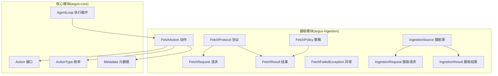
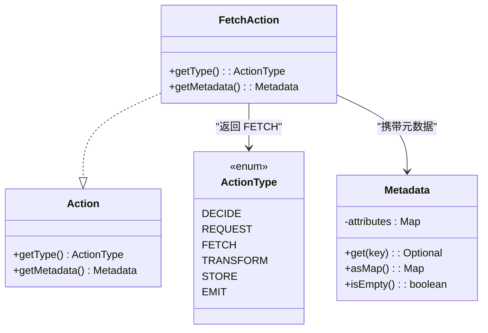
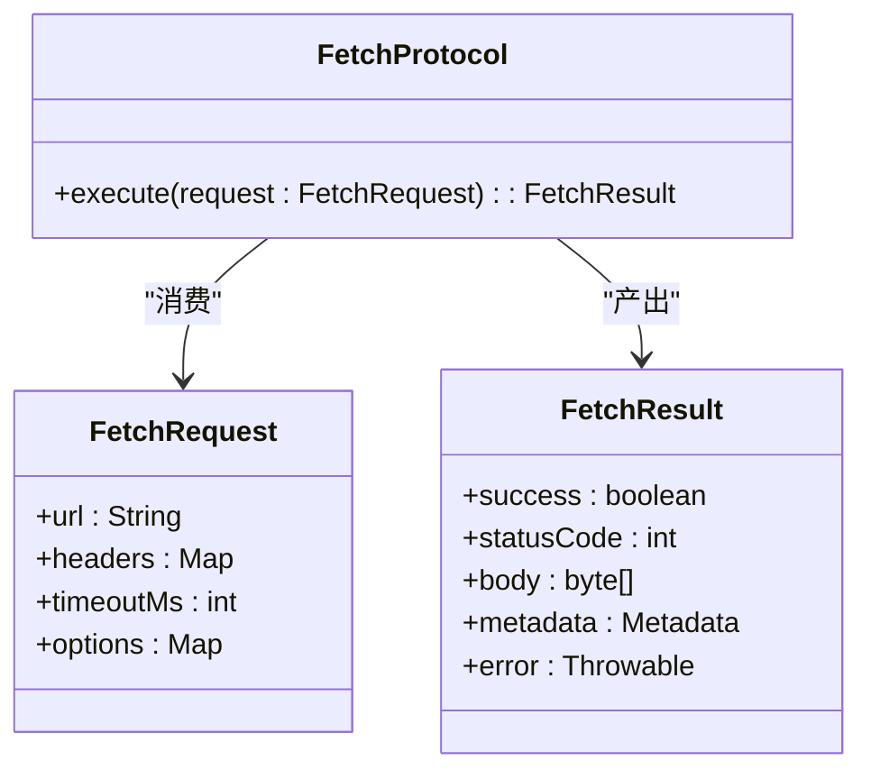
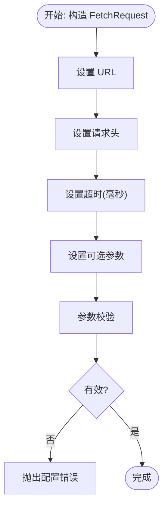
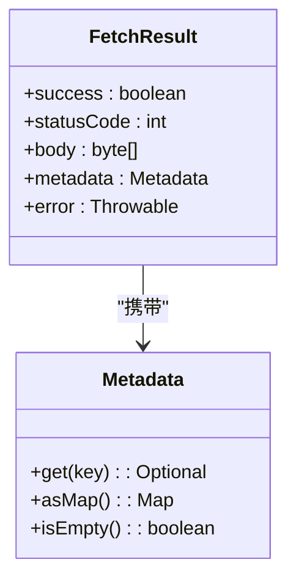
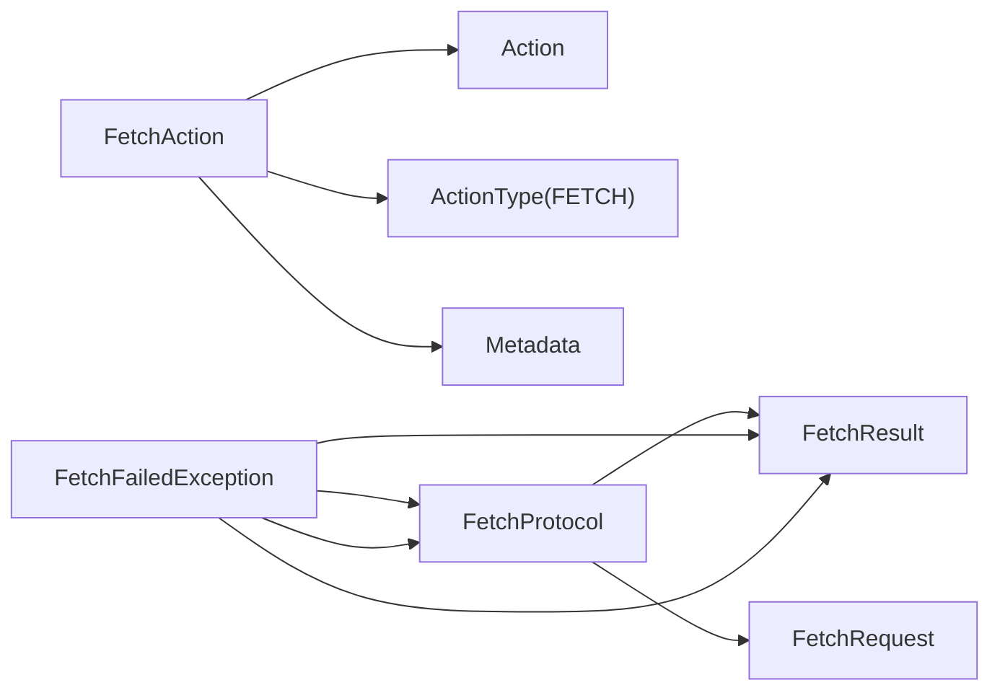

# 数据获取系统

<cite>
**本文引用的文件**
- [FetchAction.java](file://argus-ingestion/src/main/java/io/argus/ingestion/fetch/FetchAction.java)
- [FetchProtocol.java](file://argus-ingestion/src/main/java/io/argus/ingestion/fetch/FetchProtocol.java)
- [FetchRequest.java](file://argus-ingestion/src/main/java/io/argus/ingestion/fetch/FetchRequest.java)
- [FetchResult.java](file://argus-ingestion/src/main/java/io/argus/ingestion/fetch/FetchResult.java)
- [FetchFailedException.java](file://argus-ingestion/src/main/java/io/argus/ingestion/error/FetchFailedException.java)
- [FetchPolicy.java](file://argus-ingestion/src/main/java/io/argus/ingestion/policy/FetchPolicy.java)
- [Action.java](file://argus-core/src/main/java/io/argus/core/action/Action.java)
- [ActionType.java](file://argus-core/src/main/java/io/argus/core/action/ActionType.java)
- [Metadata.java](file://argus-core/src/main/java/io/argus/core/model/Metadata.java)
- [AgentLoop.java](file://argus-core/src/main/java/io/argus/core/agent/AgentLoop.java)
- [IngestionSource.java](file://argus-ingestion/src/main/java/io/argus/ingestion/source/IngestionSource.java)
- [IngestionRequest.java](file://argus-ingestion/src/main/java/io/argus/ingestion/source/IngestionRequest.java)
- [IngestionResult.java](file://argus-ingestion/src/main/java/io/argus/ingestion/source/IngestionResult.java)
</cite>

## 目录
1. [引言](#引言)
2. [项目结构](#项目结构)
3. [核心组件](#核心组件)
4. [架构总览](#架构总览)
5. [详细组件分析](#详细组件分析)
6. [依赖关系分析](#依赖关系分析)
7. [性能考虑](#性能考虑)
8. [故障排查指南](#故障排查指南)
9. [结论](#结论)
10. [附录](#附录)

## 引言
本文件面向数据获取系统，聚焦于 FetchAction 作为核心数据获取动作的设计与职责，解释其如何实现 Action 接口并在代理执行循环中承担 FETCH 类型意图；同时阐述 FetchProtocol 协议接口的设计理念与协议抽象思路，FetchRequest 请求模型的结构与参数配置要点（如 URL 处理、请求头设置、超时控制），以及 FetchResult 结果封装的设计（成功响应处理、错误状态管理、元数据提取）。最后给出数据获取的完整生命周期端到端流程说明，并提供可操作的实践建议与排障指引。

## 项目结构
本仓库采用多模块组织，数据获取相关代码位于 argus-ingestion 模块，基础运行时与通用模型位于 argus-core 模块。数据获取系统围绕“动作-协议-请求-结果”四要素展开，配合策略与异常类型，形成可扩展的数据获取框架。



图表来源
- [Action.java](file://argus-core/src/main/java/io/argus/core/action/Action.java#L37-L43)
- [ActionType.java](file://argus-core/src/main/java/io/argus/core/action/ActionType.java#L22-L143)
- [Metadata.java](file://argus-core/src/main/java/io/argus/core/model/Metadata.java#L12-L34)
- [AgentLoop.java](file://argus-core/src/main/java/io/argus/core/agent/AgentLoop.java#L49-L118)
- [FetchAction.java](file://argus-ingestion/src/main/java/io/argus/ingestion/fetch/FetchAction.java#L11-L21)
- [FetchProtocol.java](file://argus-ingestion/src/main/java/io/argus/ingestion/fetch/FetchProtocol.java#L7-L8)
- [FetchRequest.java](file://argus-ingestion/src/main/java/io/argus/ingestion/fetch/FetchRequest.java#L7-L8)
- [FetchResult.java](file://argus-ingestion/src/main/java/io/argus/ingestion/fetch/FetchResult.java#L7-L8)
- [FetchPolicy.java](file://argus-ingestion/src/main/java/io/argus/ingestion/policy/FetchPolicy.java#L7-L8)
- [FetchFailedException.java](file://argus-ingestion/src/main/java/io/argus/ingestion/error/FetchFailedException.java#L7-L8)
- [IngestionSource.java](file://argus-ingestion/src/main/java/io/argus/ingestion/source/IngestionSource.java#L109-L110)
- [IngestionRequest.java](file://argus-ingestion/src/main/java/io/argus/ingestion/source/IngestionRequest.java#L7-L8)
- [IngestionResult.java](file://argus-ingestion/src/main/java/io/argus/ingestion/source/IngestionResult.java#L7-L8)

章节来源
- [FetchAction.java](file://argus-ingestion/src/main/java/io/argus/ingestion/fetch/FetchAction.java#L1-L21)
- [Action.java](file://argus-core/src/main/java/io/argus/core/action/Action.java#L1-L43)
- [ActionType.java](file://argus-core/src/main/java/io/argus/core/action/ActionType.java#L1-L143)
- [Metadata.java](file://argus-core/src/main/java/io/argus/core/model/Metadata.java#L1-L34)
- [AgentLoop.java](file://argus-core/src/main/java/io/argus/core/agent/AgentLoop.java#L1-L118)
- [FetchProtocol.java](file://argus-ingestion/src/main/java/io/argus/ingestion/fetch/FetchProtocol.java#L1-L8)
- [FetchRequest.java](file://argus-ingestion/src/main/java/io/argus/ingestion/fetch/FetchRequest.java#L1-L8)
- [FetchResult.java](file://argus-ingestion/src/main/java/io/argus/ingestion/fetch/FetchResult.java#L1-L8)
- [FetchPolicy.java](file://argus-ingestion/src/main/java/io/argus/ingestion/policy/FetchPolicy.java#L1-L8)
- [FetchFailedException.java](file://argus-ingestion/src/main/java/io/argus/ingestion/error/FetchFailedException.java#L1-L8)
- [IngestionSource.java](file://argus-ingestion/src/main/java/io/argus/ingestion/source/IngestionSource.java#L1-L110)
- [IngestionRequest.java](file://argus-ingestion/src/main/java/io/argus/ingestion/source/IngestionRequest.java#L1-L8)
- [IngestionResult.java](file://argus-ingestion/src/main/java/io/argus/ingestion/source/IngestionResult.java#L1-L8)

## 核心组件
- FetchAction：实现 Action 接口，表达“获取数据”的意图，类型为 FETCH，元数据承载附加信息。
- FetchProtocol：协议抽象层，定义如何根据 FetchRequest 生成 FetchResult 的规范契约。
- FetchRequest：请求模型，承载获取所需的关键参数（如 URL、请求头、超时等）。
- FetchResult：结果封装，统一表示成功与失败，携带响应体、状态码、元数据等。
- FetchPolicy：策略容器，用于约束获取行为（如速率限制、机器人协议等）。
- FetchFailedException：获取失败异常，用于在异常路径上提供一致的错误语义。
- IngestionSource/IngestionRequest/IngestionResult：摄取边界与事实语义，确保获取结果可审计、可回放、权威不可变。

章节来源
- [FetchAction.java](file://argus-ingestion/src/main/java/io/argus/ingestion/fetch/FetchAction.java#L11-L21)
- [Action.java](file://argus-core/src/main/java/io/argus/core/action/Action.java#L37-L43)
- [ActionType.java](file://argus-core/src/main/java/io/argus/core/action/ActionType.java#L63-L81)
- [Metadata.java](file://argus-core/src/main/java/io/argus/core/model/Metadata.java#L12-L34)
- [FetchProtocol.java](file://argus-ingestion/src/main/java/io/argus/ingestion/fetch/FetchProtocol.java#L7-L8)
- [FetchRequest.java](file://argus-ingestion/src/main/java/io/argus/ingestion/fetch/FetchRequest.java#L7-L8)
- [FetchResult.java](file://argus-ingestion/src/main/java/io/argus/ingestion/fetch/FetchResult.java#L7-L8)
- [FetchPolicy.java](file://argus-ingestion/src/main/java/io/argus/ingestion/policy/FetchPolicy.java#L7-L8)
- [FetchFailedException.java](file://argus-ingestion/src/main/java/io/argus/ingestion/error/FetchFailedException.java#L7-L8)
- [IngestionSource.java](file://argus-ingestion/src/main/java/io/argus/ingestion/source/IngestionSource.java#L109-L110)
- [IngestionRequest.java](file://argus-ingestion/src/main/java/io/argus/ingestion/source/IngestionRequest.java#L7-L8)
- [IngestionResult.java](file://argus-ingestion/src/main/java/io/argus/ingestion/source/IngestionResult.java#L7-L8)

## 架构总览
数据获取系统以“动作-协议-请求-结果”为核心闭环，结合策略与异常，形成可扩展、可审计、可回放的执行模型。代理在每个执行步中产生 FETCH 动作，运行时根据协议实现解析请求并产出结果，最终以观察结果与状态变更推进执行循环。

```mermaid
sequenceDiagram
participant Agent as "代理"
participant Loop as "AgentLoop 执行循环"
participant Action as "FetchAction(FETCH)"
participant Proto as "FetchProtocol"
participant Req as "FetchRequest"
participant Res as "FetchResult"
participant Policy as "FetchPolicy"
Agent->>Loop : "调用 step(context)"
Loop->>Agent : "评估上下文并生成动作"
Agent-->>Loop : "返回 Action(FETCH)"
Loop->>Proto : "根据 Action 解析 FetchRequest"
Proto->>Req : "构造/校验请求参数"
Proto->>Policy : "应用策略(限流/爬虫规则)"
Proto->>Res : "执行获取并封装结果"
Loop-->>Agent : "返回 LoopResult(含Observation)"
Agent->>Agent : "更新 AgentState 并进入下一步"
```

图表来源
- [AgentLoop.java](file://argus-core/src/main/java/io/argus/core/agent/AgentLoop.java#L49-L118)
- [Action.java](file://argus-core/src/main/java/io/argus/core/action/Action.java#L37-L43)
- [ActionType.java](file://argus-core/src/main/java/io/argus/core/action/ActionType.java#L63-L81)
- [FetchAction.java](file://argus-ingestion/src/main/java/io/argus/ingestion/fetch/FetchAction.java#L11-L21)
- [FetchProtocol.java](file://argus-ingestion/src/main/java/io/argus/ingestion/fetch/FetchProtocol.java#L7-L8)
- [FetchRequest.java](file://argus-ingestion/src/main/java/io/argus/ingestion/fetch/FetchRequest.java#L7-L8)
- [FetchResult.java](file://argus-ingestion/src/main/java/io/argus/ingestion/fetch/FetchResult.java#L7-L8)
- [FetchPolicy.java](file://argus-ingestion/src/main/java/io/argus/ingestion/policy/FetchPolicy.java#L7-L8)

## 详细组件分析

### FetchAction：核心数据获取动作
- 设计定位：表达“获取数据”的意图，类型为 FETCH，元数据用于承载协议、目标、凭据等附加信息。
- 与 Action 接口的关系：实现 getType 返回 FETCH，getMetadata 提供键值对形式的附加信息。
- 在代理执行循环中的作用：AgentLoop 在每一步根据上下文生成 Action，当类型为 FETCH 时，运行时负责解析并执行数据获取。



图表来源
- [Action.java](file://argus-core/src/main/java/io/argus/core/action/Action.java#L37-L43)
- [ActionType.java](file://argus-core/src/main/java/io/argus/core/action/ActionType.java#L22-L143)
- [Metadata.java](file://argus-core/src/main/java/io/argus/core/model/Metadata.java#L12-L34)
- [FetchAction.java](file://argus-ingestion/src/main/java/io/argus/ingestion/fetch/FetchAction.java#L11-L21)

章节来源
- [FetchAction.java](file://argus-ingestion/src/main/java/io/argus/ingestion/fetch/FetchAction.java#L11-L21)
- [Action.java](file://argus-core/src/main/java/io/argus/core/action/Action.java#L37-L43)
- [ActionType.java](file://argus-core/src/main/java/io/argus/core/action/ActionType.java#L63-L81)
- [Metadata.java](file://argus-core/src/main/java/io/argus/core/model/Metadata.java#L12-L34)

### FetchProtocol：协议抽象设计
- 设计理念：通过协议抽象屏蔽底层实现差异，统一由 FetchRequest 到 FetchResult 的转换过程，便于扩展不同数据源（HTTP、本地文件、数据库等）。
- 关系映射：协议依赖请求模型（URL、头、超时等）与策略（限速、爬虫规则），并产出结果对象（成功/失败、状态码、响应体、元数据）。



图表来源
- [FetchProtocol.java](file://argus-ingestion/src/main/java/io/argus/ingestion/fetch/FetchProtocol.java#L7-L8)
- [FetchRequest.java](file://argus-ingestion/src/main/java/io/argus/ingestion/fetch/FetchRequest.java#L7-L8)
- [FetchResult.java](file://argus-ingestion/src/main/java/io/argus/ingestion/fetch/FetchResult.java#L7-L8)

章节来源
- [FetchProtocol.java](file://argus-ingestion/src/main/java/io/argus/ingestion/fetch/FetchProtocol.java#L7-L8)
- [FetchRequest.java](file://argus-ingestion/src/main/java/io/argus/ingestion/fetch/FetchRequest.java#L7-L8)
- [FetchResult.java](file://argus-ingestion/src/main/java/io/argus/ingestion/fetch/FetchResult.java#L7-L8)

### FetchRequest：请求模型与参数配置
- 结构要点：包含目标地址、请求头、超时毫秒数、可选参数等。
- 参数配置建议：
  - URL：支持绝对路径与相对路径，必要时结合协议实现进行规范化。
  - 请求头：Accept、Content-Type、Authorization 等按协议需求设置。
  - 超时控制：区分连接超时与读取超时，避免阻塞导致的执行停滞。
  - 可选参数：用于传递协议特定开关或调试信息。



图表来源
- [FetchRequest.java](file://argus-ingestion/src/main/java/io/argus/ingestion/fetch/FetchRequest.java#L7-L8)

章节来源
- [FetchRequest.java](file://argus-ingestion/src/main/java/io/argus/ingestion/fetch/FetchRequest.java#L7-L8)

### FetchResult：结果封装设计
- 成功响应：包含状态码、响应体、元数据；元数据可用于记录来源、版本、派生信息等。
- 错误状态：包含异常对象，便于上层策略与重试机制使用。
- 元数据提取：通过统一的 Metadata 结构，保证与核心模型一致，便于审计与回放。



图表来源
- [FetchResult.java](file://argus-ingestion/src/main/java/io/argus/ingestion/fetch/FetchResult.java#L7-L8)
- [Metadata.java](file://argus-core/src/main/java/io/argus/core/model/Metadata.java#L12-L34)

章节来源
- [FetchResult.java](file://argus-ingestion/src/main/java/io/argus/ingestion/fetch/FetchResult.java#L7-L8)
- [Metadata.java](file://argus-core/src/main/java/io/argus/core/model/Metadata.java#L12-L34)

### 自定义 FetchProtocol 实现指南
- 步骤概览：
  1) 定义协议类并实现协议接口方法，接收 FetchRequest。
  2) 应用 FetchPolicy（如速率限制、机器人协议）。
  3) 发起网络/存储/文件等获取操作。
  4) 封装 FetchResult（成功/失败、状态码、响应体、元数据）。
  5) 抛出 FetchFailedException 或在结果中记录错误。
- 示例参考路径：
  - 协议入口：[FetchProtocol.java](file://argus-ingestion/src/main/java/io/argus/ingestion/fetch/FetchProtocol.java#L7-L8)
  - 请求模型：[FetchRequest.java](file://argus-ingestion/src/main/java/io/argus/ingestion/fetch/FetchRequest.java#L7-L8)
  - 结果封装：[FetchResult.java](file://argus-ingestion/src/main/java/io/argus/ingestion/fetch/FetchResult.java#L7-L8)
  - 异常类型：[FetchFailedException.java](file://argus-ingestion/src/main/java/io/argus/ingestion/error/FetchFailedException.java#L7-L8)
  - 策略容器：[FetchPolicy.java](file://argus-ingestion/src/main/java/io/argus/ingestion/policy/FetchPolicy.java#L7-L8)

章节来源
- [FetchProtocol.java](file://argus-ingestion/src/main/java/io/argus/ingestion/fetch/FetchProtocol.java#L7-L8)
- [FetchRequest.java](file://argus-ingestion/src/main/java/io/argus/ingestion/fetch/FetchRequest.java#L7-L8)
- [FetchResult.java](file://argus-ingestion/src/main/java/io/argus/ingestion/fetch/FetchResult.java#L7-L8)
- [FetchFailedException.java](file://argus-ingestion/src/main/java/io/argus/ingestion/error/FetchFailedException.java#L7-L8)
- [FetchPolicy.java](file://argus-ingestion/src/main/java/io/argus/ingestion/policy/FetchPolicy.java#L7-L8)

### 配置不同类型 FetchRequest 的实践
- HTTP 获取：设置 URL、User-Agent、Accept、Authorization 等头，合理设置超时。
- 文件/资源获取：设置本地路径或资源标识，必要时添加鉴权头。
- 数据库/缓存获取：通过 options 传递查询参数、分页、过滤条件等。

章节来源
- [FetchRequest.java](file://argus-ingestion/src/main/java/io/argus/ingestion/fetch/FetchRequest.java#L7-L8)

### 处理 FetchResult 的策略
- 成功路径：读取状态码与响应体，提取元数据用于后续解析与审计。
- 失败路径：捕获异常或检查错误字段，结合策略决定重试、降级或上报。

章节来源
- [FetchResult.java](file://argus-ingestion/src/main/java/io/argus/ingestion/fetch/FetchResult.java#L7-L8)
- [FetchFailedException.java](file://argus-ingestion/src/main/java/io/argus/ingestion/error/FetchFailedException.java#L7-L8)

### 数据获取生命周期（端到端）
- 代理生成动作：在 AgentLoop 的每一步中，根据上下文生成 FETCH 动作。
- 协议解析与执行：运行时根据 FetchAction 解析 FetchRequest，应用 FetchPolicy，调用协议执行获取。
- 结果封装与回传：协议产出 FetchResult，运行时将其转为观察结果，推进 AgentState。
- 回放与审计：IngestionSource 确保事实权威性，支持回放时仅基于已记录事实重建。

```mermaid
sequenceDiagram
participant Agent as "代理"
participant Loop as "AgentLoop"
participant Act as "FetchAction"
participant Proto as "FetchProtocol"
participant Policy as "FetchPolicy"
participant Res as "FetchResult"
Agent->>Loop : "step(context)"
Loop->>Act : "生成动作(FETCH)"
Act-->>Loop : "返回动作与元数据"
Loop->>Proto : "解析并执行协议"
Proto->>Policy : "应用策略"
Proto->>Res : "产出结果"
Loop-->>Agent : "返回观察结果与新状态"
```

图表来源
- [AgentLoop.java](file://argus-core/src/main/java/io/argus/core/agent/AgentLoop.java#L49-L118)
- [FetchAction.java](file://argus-ingestion/src/main/java/io/argus/ingestion/fetch/FetchAction.java#L11-L21)
- [FetchProtocol.java](file://argus-ingestion/src/main/java/io/argus/ingestion/fetch/FetchProtocol.java#L7-L8)
- [FetchPolicy.java](file://argus-ingestion/src/main/java/io/argus/ingestion/policy/FetchPolicy.java#L7-L8)
- [FetchResult.java](file://argus-ingestion/src/main/java/io/argus/ingestion/fetch/FetchResult.java#L7-L8)

## 依赖关系分析
- 组件耦合：FetchAction 与 Action/ActionType/Metadata 强耦合，体现意图表达与元数据承载；FetchProtocol 与 FetchRequest/FetchResult 弱耦合，通过接口解耦实现细节。
- 外部依赖：协议实现可依赖网络库、文件系统、数据库驱动等，但对外暴露统一契约。
- 循环依赖：当前文件未见直接循环依赖，建议在新增实现时保持接口契约不变。



图表来源
- [FetchAction.java](file://argus-ingestion/src/main/java/io/argus/ingestion/fetch/FetchAction.java#L11-L21)
- [Action.java](file://argus-core/src/main/java/io/argus/core/action/Action.java#L37-L43)
- [ActionType.java](file://argus-core/src/main/java/io/argus/core/action/ActionType.java#L63-L81)
- [Metadata.java](file://argus-core/src/main/java/io/argus/core/model/Metadata.java#L12-L34)
- [FetchProtocol.java](file://argus-ingestion/src/main/java/io/argus/ingestion/fetch/FetchProtocol.java#L7-L8)
- [FetchRequest.java](file://argus-ingestion/src/main/java/io/argus/ingestion/fetch/FetchRequest.java#L7-L8)
- [FetchResult.java](file://argus-ingestion/src/main/java/io/argus/ingestion/fetch/FetchResult.java#L7-L8)
- [FetchFailedException.java](file://argus-ingestion/src/main/java/io/argus/ingestion/error/FetchFailedException.java#L7-L8)

章节来源
- [FetchAction.java](file://argus-ingestion/src/main/java/io/argus/ingestion/fetch/FetchAction.java#L11-L21)
- [Action.java](file://argus-core/src/main/java/io/argus/core/action/Action.java#L37-L43)
- [ActionType.java](file://argus-core/src/main/java/io/argus/core/action/ActionType.java#L63-L81)
- [Metadata.java](file://argus-core/src/main/java/io/argus/core/model/Metadata.java#L12-L34)
- [FetchProtocol.java](file://argus-ingestion/src/main/java/io/argus/ingestion/fetch/FetchProtocol.java#L7-L8)
- [FetchRequest.java](file://argus-ingestion/src/main/java/io/argus/ingestion/fetch/FetchRequest.java#L7-L8)
- [FetchResult.java](file://argus-ingestion/src/main/java/io/argus/ingestion/fetch/FetchResult.java#L7-L8)
- [FetchFailedException.java](file://argus-ingestion/src/main/java/io/argus/ingestion/error/FetchFailedException.java#L7-L8)

## 性能考虑
- 超时与并发：为请求设置合理的连接与读取超时，避免阻塞；在协议实现中控制并发度与重试退避。
- 缓存与去重：利用元数据记录来源与版本，结合策略实现缓存命中与重复请求去重。
- 资源释放：确保网络/文件句柄及时关闭，异常路径也要释放资源。
- 观察与审计：通过统一的元数据结构记录关键指标，便于性能分析与回溯。

## 故障排查指南
- 常见问题
  - 请求配置错误：检查 URL、头、超时等参数是否符合协议要求。
  - 超时与网络异常：确认网络连通性与代理设置，适当增大超时或启用重试。
  - 权限与认证失败：核对鉴权头与凭据有效期。
  - 结果解析失败：检查响应体格式与编码，必要时在元数据中记录原始响应摘要。
- 定位手段
  - 使用 FetchFailedException 记录异常堆栈与上下文。
  - 通过 FetchResult 中的错误字段与元数据辅助诊断。
  - 在策略层开启日志与采样，定位热点与慢请求。

章节来源
- [FetchFailedException.java](file://argus-ingestion/src/main/java/io/argus/ingestion/error/FetchFailedException.java#L7-L8)
- [FetchResult.java](file://argus-ingestion/src/main/java/io/argus/ingestion/fetch/FetchResult.java#L7-L8)
- [FetchPolicy.java](file://argus-ingestion/src/main/java/io/argus/ingestion/policy/FetchPolicy.java#L7-L8)

## 结论
数据获取系统以 FetchAction 为核心意图表达，借助 FetchProtocol 的协议抽象实现多源适配，通过 FetchRequest/FetchResult 统一请求与结果模型，并结合策略与异常类型形成稳健的执行闭环。在代理执行循环中，FETCH 动作驱动协议解析与执行，最终以权威事实推动状态演进，满足可审计、可回放、可扩展的要求。

## 附录
- 关键实现参考路径
  - FetchAction：[FetchAction.java](file://argus-ingestion/src/main/java/io/argus/ingestion/fetch/FetchAction.java#L11-L21)
  - FetchProtocol：[FetchProtocol.java](file://argus-ingestion/src/main/java/io/argus/ingestion/fetch/FetchProtocol.java#L7-L8)
  - FetchRequest：[FetchRequest.java](file://argus-ingestion/src/main/java/io/argus/ingestion/fetch/FetchRequest.java#L7-L8)
  - FetchResult：[FetchResult.java](file://argus-ingestion/src/main/java/io/argus/ingestion/fetch/FetchResult.java#L7-L8)
  - FetchPolicy：[FetchPolicy.java](file://argus-ingestion/src/main/java/io/argus/ingestion/policy/FetchPolicy.java#L7-L8)
  - FetchFailedException：[FetchFailedException.java](file://argus-ingestion/src/main/java/io/argus/ingestion/error/FetchFailedException.java#L7-L8)
  - IngestionSource/IngestionRequest/IngestionResult：[IngestionSource.java](file://argus-ingestion/src/main/java/io/argus/ingestion/source/IngestionSource.java#L109-L110), [IngestionRequest.java](file://argus-ingestion/src/main/java/io/argus/ingestion/source/IngestionRequest.java#L7-L8), [IngestionResult.java](file://argus-ingestion/src/main/java/io/argus/ingestion/source/IngestionResult.java#L7-L8)