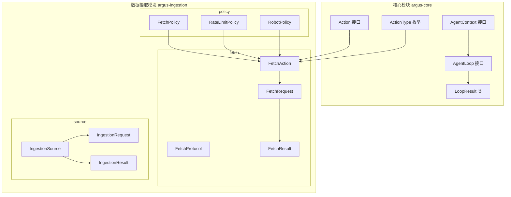
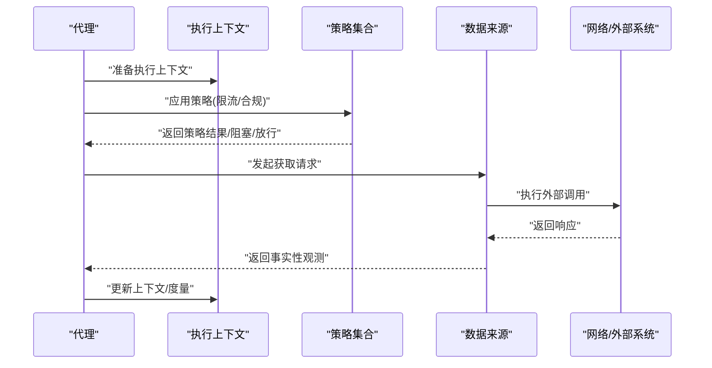
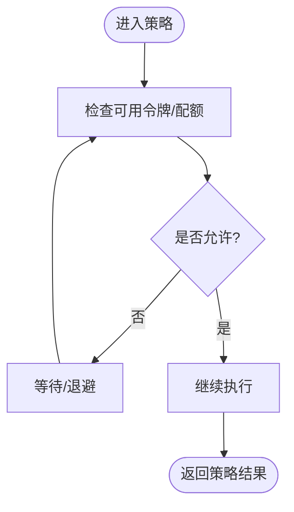
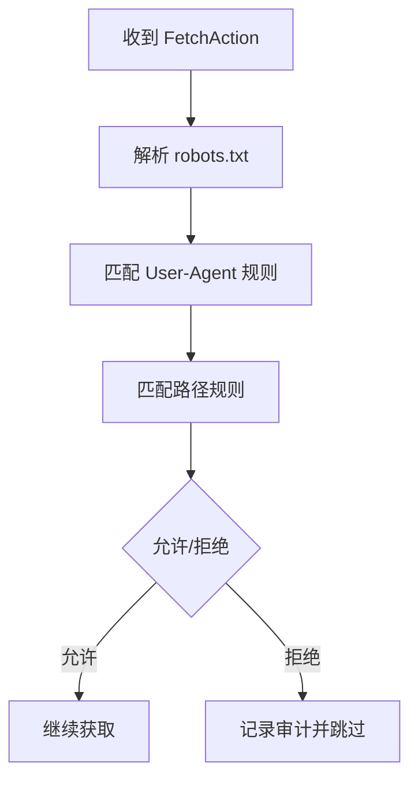
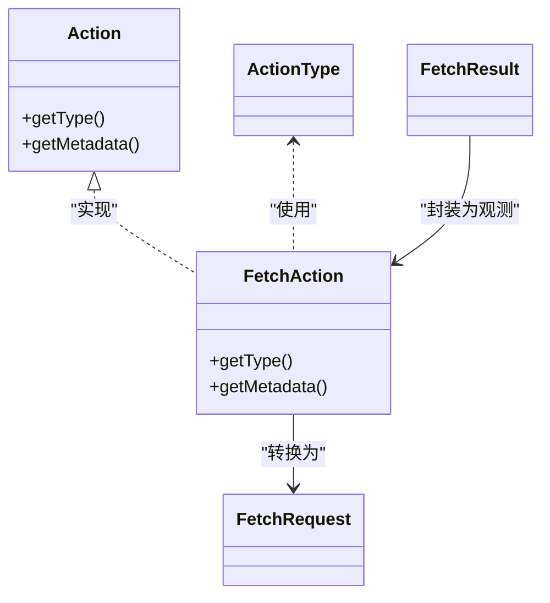
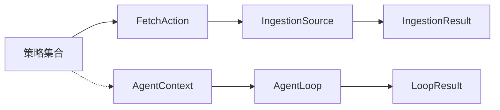

# 策略系统

<cite>
**本文引用的文件**
- [FetchPolicy.java](file://argus-ingestion/src/main/java/io/argus/ingestion/policy/FetchPolicy.java)
- [RateLimitPolicy.java](file://argus-ingestion/src/main/java/io/argus/ingestion/policy/RateLimitPolicy.java)
- [RobotPolicy.java](file://argus-ingestion/src/main/java/io/argus/ingestion/policy/RobotPolicy.java)
- [FetchAction.java](file://argus-ingestion/src/main/java/io/argus/ingestion/fetch/FetchAction.java)
- [FetchProtocol.java](file://argus-ingestion/src/main/java/io/argus/ingestion/fetch/FetchProtocol.java)
- [FetchRequest.java](file://argus-ingestion/src/main/java/io/argus/ingestion/fetch/FetchRequest.java)
- [FetchResult.java](file://argus-ingestion/src/main/java/io/argus/ingestion/fetch/FetchResult.java)
- [IngestionRequest.java](file://argus-ingestion/src/main/java/io/argus/ingestion/source/IngestionRequest.java)
- [IngestionResult.java](file://argus-ingestion/src/main/java/io/argus/ingestion/source/IngestionResult.java)
- [IngestionSource.java](file://argus-ingestion/src/main/java/io/argus/ingestion/source/IngestionSource.java)
- [Action.java](file://argus-core/src/main/java/io/argus/core/action/Action.java)
- [ActionType.java](file://argus-core/src/main/java/io/argus/core/action/ActionType.java)
- [AgentContext.java](file://argus-core/src/main/java/io/argus/core/agent/AgentContext.java)
- [AgentLoop.java](file://argus-core/src/main/java/io/argus/core/agent/AgentLoop.java)
- [LoopResult.java](file://argus-core/src/main/java/io/argus/core/agent/LoopResult.java)
</cite>

## 目录
1. [引言](#引言)
2. [项目结构](#项目结构)
3. [核心组件](#核心组件)
4. [架构总览](#架构总览)
5. [组件详解](#组件详解)
6. [依赖关系分析](#依赖关系分析)
7. [性能考量](#性能考量)
8. [故障排查指南](#故障排查指南)
9. [结论](#结论)
10. [附录](#附录)

## 引言
本文件面向策略系统的设计与实现，聚焦于数据获取流程中的策略抽象、配置与执行机制。当前仓库中策略相关的核心文件位于 ingestion 模块的 policy 包，包含 FetchPolicy、RateLimitPolicy、RobotPolicy 等占位类；同时，fetch 与 source 子包提供了数据获取与来源抽象。本文将以这些文件为基础，结合核心模块 core 中的动作与执行框架，构建策略系统的整体视图，并给出可操作的实践建议。

## 项目结构
策略系统主要分布在以下模块与包中：
- 核心模块 argus-core：定义动作(Action)、动作类型(ActionType)、代理循环(AgentLoop)、执行上下文(AgentContext)等基础能力
- 数据摄取模块 argus-ingestion：定义数据获取动作(FetchAction)、协议(FetchProtocol)、请求/结果(FetchRequest/FetchResult)、来源(IngestionSource)、以及策略(FetchPolicy/RateLimitPolicy/RobotPolicy)

图表来源
- [AgentContext.java](file://argus-core/src/main/java/io/argus/core/agent/AgentContext.java#L92-L98)
- [AgentLoop.java](file://argus-core/src/main/java/io/argus/core/agent/AgentLoop.java#L49-L118)
- [LoopResult.java](file://argus-core/src/main/java/io/argus/core/agent/LoopResult.java#L78-L110)
- [Action.java](file://argus-core/src/main/java/io/argus/core/action/Action.java#L37-L43)
- [ActionType.java](file://argus-core/src/main/java/io/argus/core/action/ActionType.java#L22-L47)
- [FetchAction.java](file://argus-ingestion/src/main/java/io/argus/ingestion/fetch/FetchAction.java#L11-L21)
- [FetchProtocol.java](file://argus-ingestion/src/main/java/io/argus/ingestion/fetch/FetchProtocol.java#L7-L8)
- [FetchRequest.java](file://argus-ingestion/src/main/java/io/argus/ingestion/fetch/FetchRequest.java#L7-L8)
- [FetchResult.java](file://argus-ingestion/src/main/java/io/argus/ingestion/fetch/FetchResult.java#L7-L8)
- [IngestionSource.java](file://argus-ingestion/src/main/java/io/argus/ingestion/source/IngestionSource.java#L109-L110)
- [IngestionRequest.java](file://argus-ingestion/src/main/java/io/argus/ingestion/source/IngestionRequest.java#L7-L8)
- [IngestionResult.java](file://argus-ingestion/src/main/java/io/argus/ingestion/source/IngestionResult.java#L7-L8)
- [FetchPolicy.java](file://argus-ingestion/src/main/java/io/argus/ingestion/policy/FetchPolicy.java#L7-L8)
- [RateLimitPolicy.java](file://argus-ingestion/src/main/java/io/argus/ingestion/policy/RateLimitPolicy.java#L7-L8)
- [RobotPolicy.java](file://argus-ingestion/src/main/java/io/argus/ingestion/policy/RobotPolicy.java#L7-L8)

章节来源
- [FetchPolicy.java](file://argus-ingestion/src/main/java/io/argus/ingestion/policy/FetchPolicy.java#L1-L8)
- [RateLimitPolicy.java](file://argus-ingestion/src/main/java/io/argus/ingestion/policy/RateLimitPolicy.java#L1-L8)
- [RobotPolicy.java](file://argus-ingestion/src/main/java/io/argus/ingestion/policy/RobotPolicy.java#L1-L8)
- [FetchAction.java](file://argus-ingestion/src/main/java/io/argus/ingestion/fetch/FetchAction.java#L1-L21)
- [FetchProtocol.java](file://argus-ingestion/src/main/java/io/argus/ingestion/fetch/FetchProtocol.java#L1-L8)
- [FetchRequest.java](file://argus-ingestion/src/main/java/io/argus/ingestion/fetch/FetchRequest.java#L1-L8)
- [FetchResult.java](file://argus-ingestion/src/main/java/io/argus/ingestion/fetch/FetchResult.java#L1-L8)
- [IngestionSource.java](file://argus-ingestion/src/main/java/io/argus/ingestion/source/IngestionSource.java#L84-L110)
- [IngestionRequest.java](file://argus-ingestion/src/main/java/io/argus/ingestion/source/IngestionRequest.java#L1-L8)
- [IngestionResult.java](file://argus-ingestion/src/main/java/io/argus/ingestion/source/IngestionResult.java#L1-L8)
- [Action.java](file://argus-core/src/main/java/io/argus/core/action/Action.java#L1-L43)
- [ActionType.java](file://argus-core/src/main/java/io/argus/core/action/ActionType.java#L1-L47)
- [AgentContext.java](file://argus-core/src/main/java/io/argus/core/agent/AgentContext.java#L1-L98)
- [AgentLoop.java](file://argus-core/src/main/java/io/argus/core/agent/AgentLoop.java#L1-L118)
- [LoopResult.java](file://argus-core/src/main/java/io/argus/core/agent/LoopResult.java#L39-L110)

## 核心组件
- 策略基类与占位实现
  - FetchPolicy：策略抽象占位类，用于承载策略的通用能力与扩展点
  - RateLimitPolicy：速率限制策略占位类，用于实现令牌桶/配额控制等限流逻辑
  - RobotPolicy：机器人协议策略占位类，用于解析 robots.txt 并执行合规性检查
- 数据获取动作与协议
  - FetchAction：实现 Action 接口，表达“获取”意图
  - FetchProtocol：数据获取协议占位类
  - FetchRequest/FetchResult：获取请求与结果载体
- 来源与请求/结果
  - IngestionSource：数据来源抽象
  - IngestionRequest/IngestionResult：来源层请求与结果载体
- 核心执行框架
  - Action/ActionType：动作与语义分类
  - AgentContext/AgentLoop/LoopResult：代理执行循环与上下文

章节来源
- [FetchPolicy.java](file://argus-ingestion/src/main/java/io/argus/ingestion/policy/FetchPolicy.java#L1-L8)
- [RateLimitPolicy.java](file://argus-ingestion/src/main/java/io/argus/ingestion/policy/RateLimitPolicy.java#L1-L8)
- [RobotPolicy.java](file://argus-ingestion/src/main/java/io/argus/ingestion/policy/RobotPolicy.java#L1-L8)
- [FetchAction.java](file://argus-ingestion/src/main/java/io/argus/ingestion/fetch/FetchAction.java#L11-L21)
- [FetchProtocol.java](file://argus-ingestion/src/main/java/io/argus/ingestion/fetch/FetchProtocol.java#L1-L8)
- [FetchRequest.java](file://argus-ingestion/src/main/java/io/argus/ingestion/fetch/FetchRequest.java#L1-L8)
- [FetchResult.java](file://argus-ingestion/src/main/java/io/argus/ingestion/fetch/FetchResult.java#L1-L8)
- [IngestionSource.java](file://argus-ingestion/src/main/java/io/argus/ingestion/source/IngestionSource.java#L109-L110)
- [IngestionRequest.java](file://argus-ingestion/src/main/java/io/argus/ingestion/source/IngestionRequest.java#L1-L8)
- [IngestionResult.java](file://argus-ingestion/src/main/java/io/argus/ingestion/source/IngestionResult.java#L1-L8)
- [Action.java](file://argus-core/src/main/java/io/argus/core/action/Action.java#L37-L43)
- [ActionType.java](file://argus-core/src/main/java/io/argus/core/action/ActionType.java#L22-L47)
- [AgentContext.java](file://argus-core/src/main/java/io/argus/core/agent/AgentContext.java#L92-L98)
- [AgentLoop.java](file://argus-core/src/main/java/io/argus/core/agent/AgentLoop.java#L49-L118)
- [LoopResult.java](file://argus-core/src/main/java/io/argus/core/agent/LoopResult.java#L78-L110)

## 架构总览
策略系统围绕“动作-来源-策略-执行”的闭环展开：
- 动作(Action)定义“要做什么”，FetchAction 将其具体化为“获取”
- 来源(IngestionSource)负责从外部世界采集事实
- 策略(FetchPolicy/RateLimitPolicy/RobotPolicy)在执行前对动作进行约束与增强
- 执行(AgentLoop/AgentContext/LoopResult)保证可审计、可回放的单步决策

图表来源
- [AgentLoop.java](file://argus-core/src/main/java/io/argus/core/agent/AgentLoop.java#L49-L118)
- [AgentContext.java](file://argus-core/src/main/java/io/argus/core/agent/AgentContext.java#L92-L98)
- [LoopResult.java](file://argus-core/src/main/java/io/argus/core/agent/LoopResult.java#L78-L110)
- [FetchAction.java](file://argus-ingestion/src/main/java/io/argus/ingestion/fetch/FetchAction.java#L11-L21)
- [IngestionSource.java](file://argus-ingestion/src/main/java/io/argus/ingestion/source/IngestionSource.java#L109-L110)

## 组件详解

### FetchPolicy 抽象与策略模式
- 设计目标
  - 作为策略体系的抽象基类，统一策略的生命周期与扩展点
  - 与 FetchAction/IngestionSource 解耦，便于按需组合
- 当前实现
  - 文件为占位类，尚未包含具体方法签名与字段
- 建议扩展方向
  - 定义策略接口/抽象类，包含 apply(action, context)、validate(source)、metrics() 等方法
  - 支持策略链式组合与优先级排序
  - 提供配置注入与动态开关能力

章节来源
- [FetchPolicy.java](file://argus-ingestion/src/main/java/io/argus/ingestion/policy/FetchPolicy.java#L1-L8)

### RateLimitPolicy 速率限制策略
- 设计目标
  - 在数据获取前进行并发与速率控制，避免对目标系统造成压力
- 可能的实现要点
  - 令牌桶/滑动窗口/配额模型
  - 并发控制：线程安全的计数器与队列
  - 动态调整：基于历史延迟、错误率、目标系统负载指标
- 与执行框架的衔接
  - 在 AgentLoop 的 step 中调用策略，必要时阻塞或重试
  - 使用 AgentContext 存储短期限流状态与度量

图表来源
- [RateLimitPolicy.java](file://argus-ingestion/src/main/java/io/argus/ingestion/policy/RateLimitPolicy.java#L1-L8)
- [AgentLoop.java](file://argus-core/src/main/java/io/argus/core/agent/AgentLoop.java#L49-L118)
- [AgentContext.java](file://argus-core/src/main/java/io/argus/core/agent/AgentContext.java#L92-L98)

章节来源
- [RateLimitPolicy.java](file://argus-ingestion/src/main/java/io/argus/ingestion/policy/RateLimitPolicy.java#L1-L8)
- [AgentLoop.java](file://argus-core/src/main/java/io/argus/core/agent/AgentLoop.java#L49-L118)
- [AgentContext.java](file://argus-core/src/main/java/io/argus/core/agent/AgentContext.java#L92-L98)

### RobotPolicy 机器人协议遵循
- 设计目标
  - 解析 robots.txt 并根据规则过滤/允许抓取路径，确保合规性
- 可能的实现要点
  - robots.txt 解析与缓存
  - User-Agent 匹配与规则合并
  - 抓取路径匹配与优先级处理
- 与执行框架的衔接
  - 在 FetchAction 发起前执行合规性检查
  - 失败时返回拒绝结果并记录审计事件

图表来源
- [RobotPolicy.java](file://argus-ingestion/src/main/java/io/argus/ingestion/policy/RobotPolicy.java#L1-L8)
- [FetchAction.java](file://argus-ingestion/src/main/java/io/argus/ingestion/fetch/FetchAction.java#L11-L21)

章节来源
- [RobotPolicy.java](file://argus-ingestion/src/main/java/io/argus/ingestion/policy/RobotPolicy.java#L1-L8)
- [FetchAction.java](file://argus-ingestion/src/main/java/io/argus/ingestion/fetch/FetchAction.java#L11-L21)

### FetchAction 与数据获取流程
- FetchAction 实现 Action 接口，表达“获取”意图
- 与 FetchRequest/FetchResult 的关系
  - FetchAction 作为高层意图，由执行器转换为 FetchRequest
  - 外部系统返回 FetchResult，再由执行器封装为事实性观测
- 与策略的交互
  - 在执行前由策略对 FetchAction 进行校验/增强
  - 执行后由策略记录指标与异常

图表来源
- [Action.java](file://argus-core/src/main/java/io/argus/core/action/Action.java#L37-L43)
- [ActionType.java](file://argus-core/src/main/java/io/argus/core/action/ActionType.java#L22-L47)
- [FetchAction.java](file://argus-ingestion/src/main/java/io/argus/ingestion/fetch/FetchAction.java#L11-L21)
- [FetchRequest.java](file://argus-ingestion/src/main/java/io/argus/ingestion/fetch/FetchRequest.java#L1-L8)
- [FetchResult.java](file://argus-ingestion/src/main/java/io/argus/ingestion/fetch/FetchResult.java#L1-L8)

章节来源
- [FetchAction.java](file://argus-ingestion/src/main/java/io/argus/ingestion/fetch/FetchAction.java#L1-L21)
- [Action.java](file://argus-core/src/main/java/io/argus/core/action/Action.java#L1-L43)
- [ActionType.java](file://argus-core/src/main/java/io/argus/core/action/ActionType.java#L1-L47)

### IngestionSource 与来源抽象
- IngestionSource 作为权威边界，负责从外部世界生成事实性观测
- 与 FetchAction 的关系
  - 接收 FetchAction，产出 IngestionResult
- 非职责边界
  - 不包含代理决策逻辑，不修改 AgentState，不进行二次解析

章节来源
- [IngestionSource.java](file://argus-ingestion/src/main/java/io/argus/ingestion/source/IngestionSource.java#L84-L110)
- [IngestionRequest.java](file://argus-ingestion/src/main/java/io/argus/ingestion/source/IngestionRequest.java#L1-L8)
- [IngestionResult.java](file://argus-ingestion/src/main/java/io/argus/ingestion/source/IngestionResult.java#L1-L8)

## 依赖关系分析
- 策略与动作/来源
  - FetchPolicy/RateLimitPolicy/RobotPolicy 依赖于 FetchAction 的意图表达
  - IngestionSource 作为外部边界，与策略共同决定是否执行 FetchAction
- 执行框架
  - AgentLoop/AgentContext/LoopResult 提供可审计、可回放的执行模型
  - 策略不应持有权威状态，仅在 AgentContext 中存放临时度量与客户端句柄

图表来源
- [AgentLoop.java](file://argus-core/src/main/java/io/argus/core/agent/AgentLoop.java#L49-L118)
- [AgentContext.java](file://argus-core/src/main/java/io/argus/core/agent/AgentContext.java#L92-L98)
- [LoopResult.java](file://argus-core/src/main/java/io/argus/core/agent/LoopResult.java#L78-L110)
- [FetchAction.java](file://argus-ingestion/src/main/java/io/argus/ingestion/fetch/FetchAction.java#L11-L21)
- [IngestionSource.java](file://argus-ingestion/src/main/java/io/argus/ingestion/source/IngestionSource.java#L109-L110)

章节来源
- [AgentLoop.java](file://argus-core/src/main/java/io/argus/core/agent/AgentLoop.java#L1-L118)
- [AgentContext.java](file://argus-core/src/main/java/io/argus/core/agent/AgentContext.java#L1-L98)
- [LoopResult.java](file://argus-core/src/main/java/io/argus/core/agent/LoopResult.java#L39-L110)
- [FetchAction.java](file://argus-ingestion/src/main/java/io/argus/ingestion/fetch/FetchAction.java#L1-L21)
- [IngestionSource.java](file://argus-ingestion/src/main/java/io/argus/ingestion/source/IngestionSource.java#L84-L110)

## 性能考量
- 限流策略
  - 采用无锁或低锁争用的数据结构，减少上下文切换
  - 对热点资源进行本地缓存与批量刷新
- 合规检查
  - robots.txt 缓存与失效策略，避免频繁 IO
  - 路径匹配使用高效正则或前缀树
- 执行模型
  - AgentLoop 的每一步都应是原子且可观测，避免长事务
  - 使用 AgentContext 存放短期度量，避免持久化开销

## 故障排查指南
- 策略未生效
  - 检查策略是否正确注册到执行链路
  - 确认策略优先级与冲突处理逻辑
- 限流导致吞吐下降
  - 分析策略指标，确认令牌桶参数与并发阈值
  - 关注外部系统延迟与错误率，动态调整
- 合规检查误判
  - 核对 robots.txt 解析与 User-Agent 匹配
  - 检查路径匹配规则与通配符处理

## 结论
策略系统以“动作-来源-策略-执行”为核心，通过抽象与分层实现了可插拔、可审计、可回放的数据获取控制。当前策略类为占位实现，建议尽快完善接口设计与执行机制，结合 AgentLoop/AgentContext/LoopResult 构建完整的策略编排与监控体系。

## 附录

### 自定义策略实现指引
- 定义策略接口
  - 方法建议：apply(action, context)、validate(source)、metrics()、configure(config)
- 注册与组合
  - 在 AgentContext 中注册策略实例
  - 通过优先级排序与冲突检测，形成策略链
- 监控与告警
  - 利用 AgentContext 记录策略命中率、拒绝率、延迟分布
  - 与 LoopResult 结合，确保审计完整性

### 策略配置与组合示例（路径指引）
- 限流策略配置
  - 参考路径：[RateLimitPolicy.java](file://argus-ingestion/src/main/java/io/argus/ingestion/policy/RateLimitPolicy.java#L1-L8)
  - 建议新增：令牌桶容量、填充速率、并发上限、退避策略
- 合规策略配置
  - 参考路径：[RobotPolicy.java](file://argus-ingestion/src/main/java/io/argus/ingestion/policy/RobotPolicy.java#L1-L8)
  - 建议新增：robots.txt 缓存、User-Agent 列表、路径白名单/黑名单
- 策略链与优先级
  - 参考路径：[AgentLoop.java](file://argus-core/src/main/java/io/argus/core/agent/AgentLoop.java#L49-L118)
  - 建议新增：策略排序、冲突检测、回放兼容