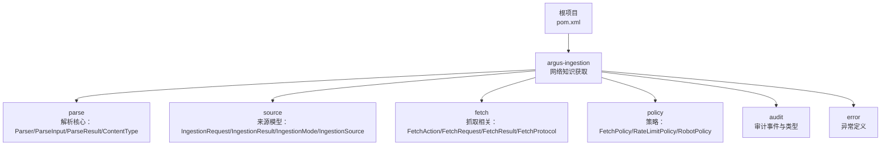
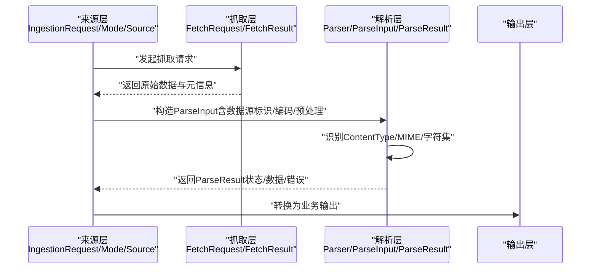
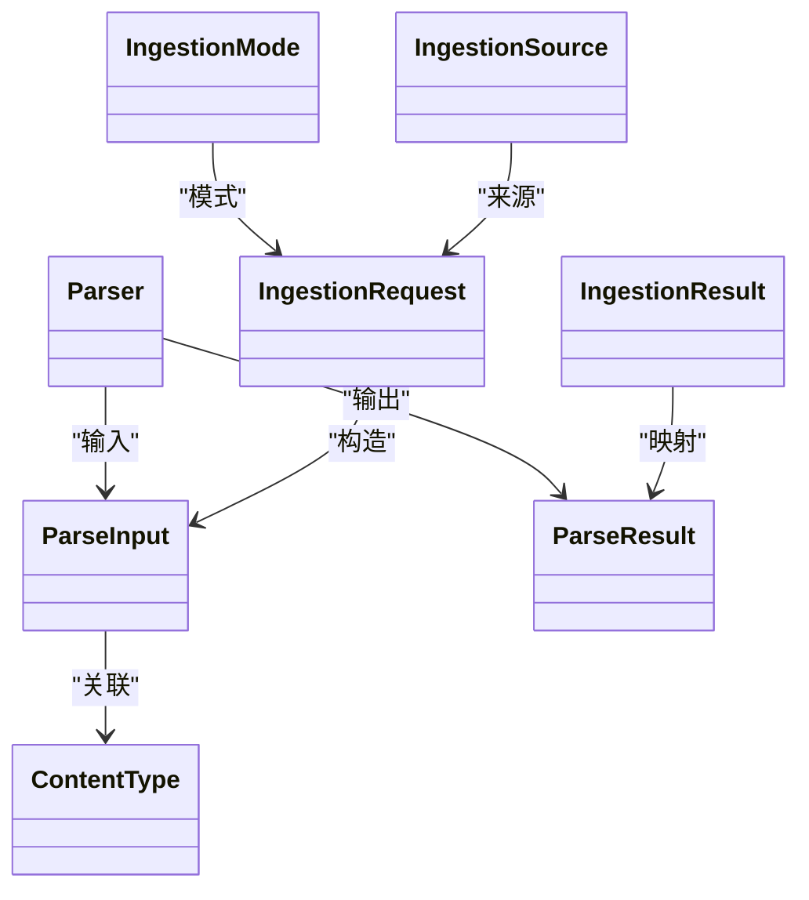
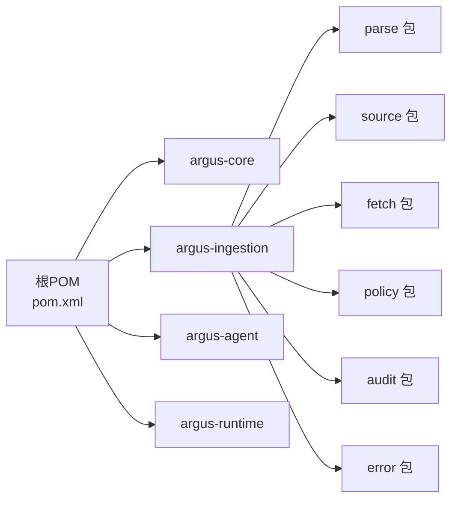
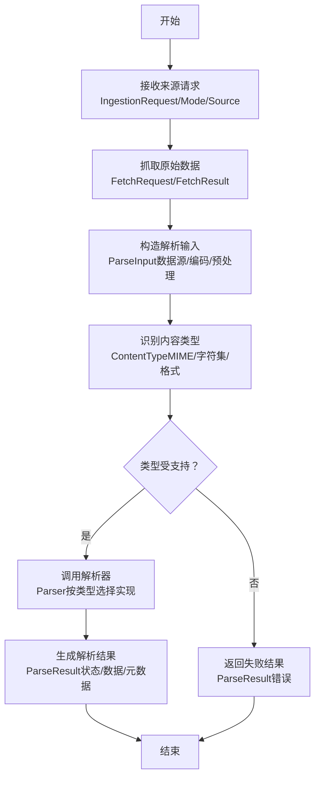

# 解析系统

<cite>
**本文引用的文件**
- [Parser.java](file://argus-ingestion/src/main/java/io/argus/ingestion/parse/Parser.java)
- [ParseInput.java](file://argus-ingestion/src/main/java/io/argus/ingestion/parse/ParseInput.java)
- [ParseResult.java](file://argus-ingestion/src/main/java/io/argus/ingestion/parse/ParseResult.java)
- [ContentType.java](file://argus-ingestion/src/main/java/io/argus/ingestion/parse/ContentType.java)
- [IngestionRequest.java](file://argus-ingestion/src/main/java/io/argus/ingestion/source/IngestionRequest.java)
- [IngestionResult.java](file://argus-ingestion/src/main/java/io/argus/ingestion/source/IngestionResult.java)
- [IngestionMode.java](file://argus-ingestion/src/main/java/io/argus/ingestion/source/IngestionMode.java)
- [IngestionSource.java](file://argus-ingestion/src/main/java/io/argus/ingestion/source/IngestionSource.java)
- [readme.md](file://readme.md)
- [pom.xml](file://pom.xml)
</cite>

## 目录
1. [引言](#引言)
2. [项目结构](#项目结构)
3. [核心组件](#核心组件)
4. [架构总览](#架构总览)
5. [详细组件分析](#详细组件分析)
6. [依赖关系分析](#依赖关系分析)
7. [性能考量](#性能考量)
8. [故障排查指南](#故障排查指南)
9. [结论](#结论)
10. [附录](#附录)

## 引言
本文件面向“解析系统”的设计与实现，聚焦于解析器接口、输入模型、结果封装与内容类型识别等关键构件。根据当前仓库中的文件可见度，解析系统的核心位于 argus-ingestion 模块的 parse 包中，包含 Parser、ParseInput、ParseResult、ContentType 四个核心类；同时在 source 包中提供了与数据来源相关的模型（如 IngestionRequest、IngestionResult、IngestionMode、IngestionSource）。本文将围绕这些类展开，结合模块化结构与设计原则，给出可操作的实现建议与最佳实践。

## 项目结构
Argus 采用多模块结构，解析系统属于“网络知识获取”模块（argus-ingestion），其核心职责是对接数据源、识别内容类型、执行解析并将结果标准化输出。下图展示了与解析系统直接相关的模块与包：

图表来源
- [pom.xml](file://pom.xml#L24-L29)
- [readme.md](file://readme.md#L7-L14)

章节来源
- [pom.xml](file://pom.xml#L1-L40)
- [readme.md](file://readme.md#L1-L28)

## 核心组件
解析系统由以下核心构件组成：
- Parser：解析器抽象/接口（待完善）
- ParseInput：解析输入模型（待完善）
- ParseResult：解析结果封装（待完善）
- ContentType：内容类型识别（待完善）
- IngestionRequest/IngestionResult/IngestionMode/IngestionSource：来源侧模型（用于与抓取/来源流程衔接）

章节来源
- [Parser.java](file://argus-ingestion/src/main/java/io/argus/ingestion/parse/Parser.java#L1-L8)
- [ParseInput.java](file://argus-ingestion/src/main/java/io/argus/ingestion/parse/ParseInput.java#L1-L8)
- [ParseResult.java](file://argus-ingestion/src/main/java/io/argus/ingestion/parse/ParseResult.java#L1-L8)
- [ContentType.java](file://argus-ingestion/src/main/java/io/argus/ingestion/parse/ContentType.java#L1-L8)
- [IngestionRequest.java](file://argus-ingestion/src/main/java/io/argus/ingestion/source/IngestionRequest.java#L1-L8)
- [IngestionResult.java](file://argus-ingestion/src/main/java/io/argus/ingestion/source/IngestionResult.java#L1-L8)
- [IngestionMode.java](file://argus-ingestion/src/main/java/io/argus/ingestion/source/IngestionMode.java#L1-L8)
- [IngestionSource.java](file://argus-ingestion/src/main/java/io/argus/ingestion/source/IngestionSource.java#L1-L8)

## 架构总览
解析系统在“抓取-解析-输出”的流水线中承担“解析”阶段，其典型交互如下：
- 来源层（source）提供请求与模式信息（如 IngestionRequest/Mode/Source）
- 抓取层（fetch）负责拉取原始字节流
- 解析层（parse）负责识别内容类型、解码与结构化解析，并产出统一的结果模型
- 输出层（可选）将 ParseResult 转换为业务可用的数据结构

图表来源
- [IngestionRequest.java](file://argus-ingestion/src/main/java/io/argus/ingestion/source/IngestionRequest.java#L1-L8)
- [IngestionMode.java](file://argus-ingestion/src/main/java/io/argus/ingestion/source/IngestionMode.java#L1-L8)
- [IngestionSource.java](file://argus-ingestion/src/main/java/io/argus/ingestion/source/IngestionSource.java#L1-L8)
- [ParseInput.java](file://argus-ingestion/src/main/java/io/argus/ingestion/parse/ParseInput.java#L1-L8)
- [ParseResult.java](file://argus-ingestion/src/main/java/io/argus/ingestion/parse/ParseResult.java#L1-L8)
- [ContentType.java](file://argus-ingestion/src/main/java/io/argus/ingestion/parse/ContentType.java#L1-L8)

## 详细组件分析

### Parser 解析器接口
- 角色定位：解析器抽象，承载“如何解析”的策略接口
- 当前状态：类定义存在但尚未实现方法签名
- 建议职责边界：
  - 输入：ParseInput
  - 输出：ParseResult
  - 可扩展：支持多实现（JSON/XML/HTML/CSV 等）
- 设计要点：
  - 明确解析失败与成功两种路径
  - 支持幂等性与可重试性（便于在抓取失败后重试解析）
  - 与 ContentType 协作进行格式校验

章节来源
- [Parser.java](file://argus-ingestion/src/main/java/io/argus/ingestion/parse/Parser.java#L1-L8)

### ParseInput 输入模型
- 角色定位：解析阶段的输入载体，承载数据源标识、编码信息与预处理参数
- 建议字段与职责：
  - 数据源标识：用于审计与溯源（例如来源 URL 或资源 ID）
  - 字节数据/文本数据：原始输入（需考虑编码与字符集）
  - 编码信息：显式指定或自动推断（与 ContentType 协同）
  - 预处理开关：是否启用清洗、去噪、标准化等步骤
- 复杂度与性能：
  - 输入大小直接影响解析时间与内存占用
  - 建议对大输入采用流式处理或分块解析策略

章节来源
- [ParseInput.java](file://argus-ingestion/src/main/java/io/argus/ingestion/parse/ParseInput.java#L1-L8)

### ParseResult 结果封装
- 角色定位：统一的解析结果输出，承载解析状态、抽取数据与错误信息
- 建议字段与职责：
  - 解析状态：成功/失败/跳过/未知
  - 提取数据：结构化数据（键值对、列表、树形结构等）
  - 错误信息：错误码、错误消息、堆栈摘要（仅在失败时）
  - 元数据：解析耗时、输入大小、使用的编码与内容类型
- 错误处理：
  - 将底层异常包装为可读的业务错误
  - 记录可审计的审计事件（可与审计模块协作）

章节来源
- [ParseResult.java](file://argus-ingestion/src/main/java/io/argus/ingestion/parse/ParseResult.java#L1-L8)

### ContentType 内容类型识别
- 角色定位：内容类型识别与验证，负责 MIME 类型、字符集与格式合法性判断
- 建议能力：
  - MIME 类型识别：text/html、application/json、text/csv 等
  - 字符集识别：UTF-8、GBK、ISO-8859-1 等
  - 格式验证：通过头部/签名/结构化特征进行快速验证
- 与解析器协作：
  - 在解析前进行类型判定，决定使用哪种 Parser 实现
  - 对不支持的类型返回明确的错误状态

章节来源
- [ContentType.java](file://argus-ingestion/src/main/java/io/argus/ingestion/parse/ContentType.java#L1-L8)

### 来源模型（衔接抓取与解析）
- IngestionRequest：描述一次抓取请求的上下文
- IngestionResult：描述抓取结果（成功/失败）
- IngestionMode：抓取模式（同步/异步/批量）
- IngestionSource：数据来源抽象（URL、文件、数据库等）
- 作用：为解析器提供输入上下文与来源信息，便于审计与重放

章节来源
- [IngestionRequest.java](file://argus-ingestion/src/main/java/io/argus/ingestion/source/IngestionRequest.java#L1-L8)
- [IngestionResult.java](file://argus-ingestion/src/main/java/io/argus/ingestion/source/IngestionResult.java#L1-L8)
- [IngestionMode.java](file://argus-ingestion/src/main/java/io/argus/ingestion/source/IngestionMode.java#L1-L8)
- [IngestionSource.java](file://argus-ingestion/src/main/java/io/argus/ingestion/source/IngestionSource.java#L1-L8)

### 类关系概览（基于现有文件）

图表来源
- [Parser.java](file://argus-ingestion/src/main/java/io/argus/ingestion/parse/Parser.java#L1-L8)
- [ParseInput.java](file://argus-ingestion/src/main/java/io/argus/ingestion/parse/ParseInput.java#L1-L8)
- [ParseResult.java](file://argus-ingestion/src/main/java/io/argus/ingestion/parse/ParseResult.java#L1-L8)
- [ContentType.java](file://argus-ingestion/src/main/java/io/argus/ingestion/parse/ContentType.java#L1-L8)
- [IngestionRequest.java](file://argus-ingestion/src/main/java/io/argus/ingestion/source/IngestionRequest.java#L1-L8)
- [IngestionResult.java](file://argus-ingestion/src/main/java/io/argus/ingestion/source/IngestionResult.java#L1-L8)
- [IngestionMode.java](file://argus-ingestion/src/main/java/io/argus/ingestion/source/IngestionMode.java#L1-L8)
- [IngestionSource.java](file://argus-ingestion/src/main/java/io/argus/ingestion/source/IngestionSource.java#L1-L8)

## 依赖关系分析
- 模块依赖：根 pom 中声明了四个模块，解析系统位于 argus-ingestion
- 包内依赖：parse 与 source 包相互独立，但通过业务流程耦合（来源模型驱动解析）
- 外部依赖：当前仓库未包含具体实现细节，因此无法列出第三方依赖

图表来源
- [pom.xml](file://pom.xml#L24-L29)

章节来源
- [pom.xml](file://pom.xml#L1-L40)

## 性能考量
- 输入规模控制：对超大输入采用分块/流式解析，避免一次性加载导致内存峰值过高
- 编码与字符集：优先显式指定编码，减少自动推断开销；对常见编码建立缓存
- 并发与重试：解析失败时支持有限重试与退避策略，避免抖动放大
- 结果缓存：对重复输入可考虑缓存 ParseResult，提升二次解析效率
- 审计与可观测性：记录解析耗时、输入大小、错误分布，便于容量规划与问题定位

## 故障排查指南
- 常见问题
  - 解析失败：检查 ParseResult 的错误字段，确认是否为编码不匹配、格式不支持或输入为空
  - 类型识别异常：核对 ContentType 的 MIME 与字符集判定逻辑，确保头部/签名正确
  - 来源上下文缺失：确认 IngestionRequest/Mode/Source 是否完整传入
- 排查步骤
  - 打印 ParseInput 的关键元数据（大小、编码、来源标识）
  - 分段验证：先做 ContentType 判定，再选择对应 Parser 实现
  - 记录审计事件：将关键节点写入审计日志，便于回溯
- 建议工具
  - 日志级别：INFO 记录流程，DEBUG 记录输入摘要，ERROR 记录错误详情
  - 指标监控：解析成功率、平均耗时、失败原因分布

## 结论
解析系统作为“抓取-解析-输出”流水线的关键环节，需要在“可审计、可控制、可复现”的设计原则下，提供稳定、可扩展且高性能的解析能力。当前仓库中解析系统的核心类已就位，建议尽快补齐 Parser 接口与各实现、完善 ParseInput/ParseResult 的字段与行为，并与 ContentType 协同完成 MIME/字符集/格式的统一识别与验证。通过来源模型与抓取层的紧密配合，可实现端到端的可追踪解析流程。

## 附录

### 解析流程生命周期（概念示意）

### 自定义解析器实现建议（步骤指引）
- 步骤一：实现 Parser 接口，定义 parse(ParseInput) -> ParseResult
- 步骤二：针对目标格式（如 JSON/XML/CSV/HTML）编写解析逻辑
- 步骤三：在 ParseInput 中注入数据源标识、编码与预处理开关
- 步骤四：在 ParseResult 中统一输出状态、抽取数据与错误信息
- 步骤五：在 ContentType 中注册该格式的 MIME 与字符集规则
- 步骤六：在来源流程中选择对应 Parser 并传递 IngestionRequest/Mode/Source

### 配置与适配建议
- 配置项建议：默认编码、最大输入大小、预处理开关、超时阈值
- 适配策略：对不同来源（URL/文件/数据库）提供统一的 ParseInput 构造器
- 审计与可观测性：为每个解析步骤打点，记录来源标识、输入摘要与耗时