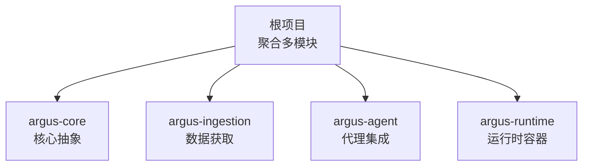
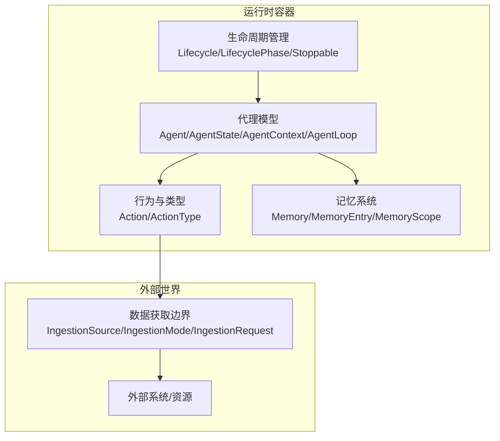
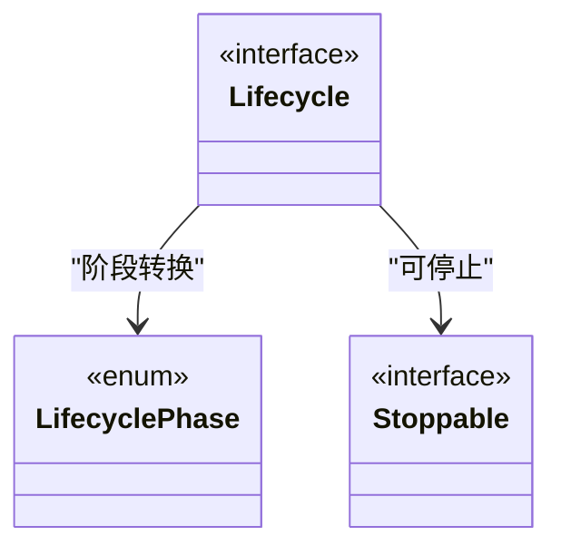
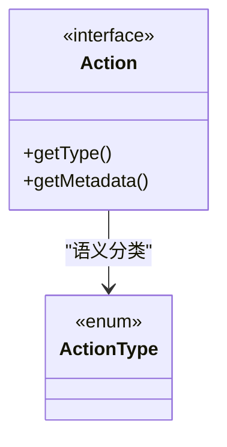
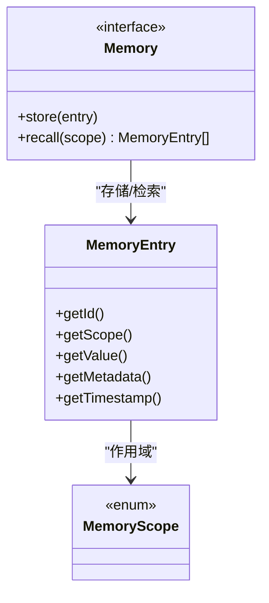
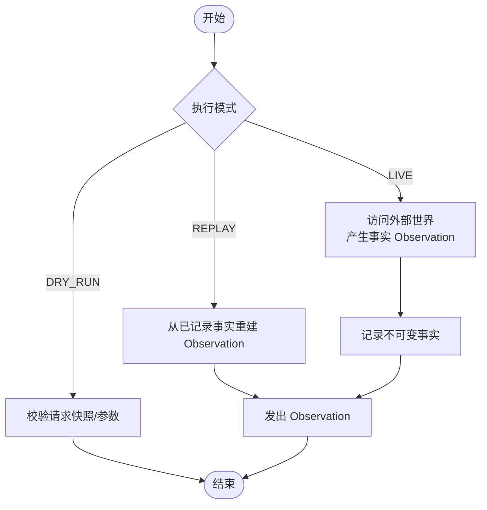
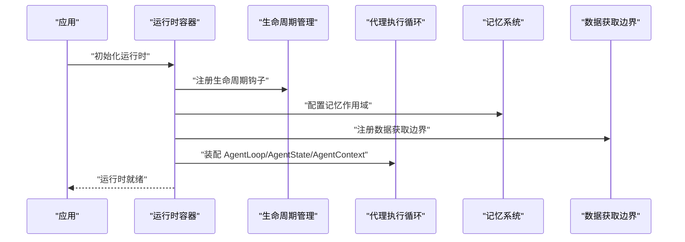
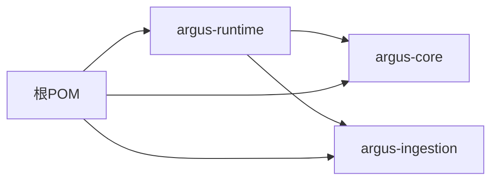

# argus-runtime 运行时模块

<cite>
**本文引用的文件**
- [pom.xml](file://argus-runtime/pom.xml)
- [pom.xml](file://pom.xml)
- [readme.md](file://readme.md)
- [package-info.java](file://argus-core/src/main/java/io/argus/core/package-info.java)
- [package-info.java](file://argus-core/src/main/java/io/argus/core/lifecycle/package-info.java)
- [Lifecycle.java](file://argus-core/src/main/java/io/argus/core/lifecycle/Lifecycle.java)
- [LifecyclePhase.java](file://argus-core/src/main/java/io/argus/core/lifecycle/LifecyclePhase.java)
- [Stoppable.java](file://argus-core/src/main/java/io/argus/core/lifecycle/Stoppable.java)
- [Agent.java](file://argus-core/src/main/java/io/argus/core/agent/Agent.java)
- [AgentState.java](file://argus-core/src/main/java/io/argus/core/agent/AgentState.java)
- [AgentContext.java](file://argus-core/src/main/java/io/argus/core/agent/AgentContext.java)
- [AgentLoop.java](file://argus-core/src/main/java/io/argus/core/agent/AgentLoop.java)
- [Action.java](file://argus-core/src/main/java/io/argus/core/action/Action.java)
- [ActionType.java](file://argus-core/src/main/java/io/argus/core/action/ActionType.java)
- [Memory.java](file://argus-core/src/main/java/io/argus/core/memory/Memory.java)
- [MemoryEntry.java](file://argus-core/src/main/java/io/argus/core/memory/MemoryEntry.java)
- [MemoryScope.java](file://argus-core/src/main/java/io/argus/core/memory/MemoryScope.java)
- [IngestionSource.java](file://argus-ingestion/src/main/java/io/argus/ingestion/source/IngestionSource.java)
- [IngestionMode.java](file://argus-ingestion/src/main/java/io/argus/ingestion/source/IngestionMode.java)
- [IngestionRequest.java](file://argus-ingestion/src/main/java/io/argus/ingestion/source/IngestionRequest.java)
- [FetchAction.java](file://argus-ingestion/src/main/java/io/argus/ingestion/fetch/FetchAction.java)
</cite>

## 目录
1. [简介](#简介)
2. [项目结构](#项目结构)
3. [核心组件](#核心组件)
4. [架构总览](#架构总览)
5. [详细组件分析](#详细组件分析)
6. [依赖关系分析](#依赖关系分析)
7. [性能考虑](#性能考虑)
8. [故障排查指南](#故障排查指南)
9. [结论](#结论)
10. [附录](#附录)

## 简介
argus-runtime 是 Argus 框架的生产级运行时容器模块，负责承载 Agent 的生命周期、状态与上下文管理，并为上层模块提供可审计、可控制、可复现的执行环境。根据项目顶层说明，Argus 的设计原则强调“可审计、可控制、可复现”，运行时模块作为基础设施，确保 Agent 的执行步骤明确、可观测、可回放。

- 运行时模块定位：生产级运行时容器，提供 Agent 执行的权威边界与可审计的执行历史。
- 关键职责：生命周期管理、状态快照、上下文隔离、与外部系统的事实性交互边界。
- 与其他模块的关系：与 argus-core 提供的抽象契约对齐；与 argus-ingestion 协作完成对外部世界的事实性采集；与 argus-agent 集成代理行为与决策循环。

**章节来源**
- file://readme.md#L1-L28
- file://pom.xml#L24-L29

## 项目结构
当前仓库采用多模块聚合结构，argus-runtime 作为独立模块存在，其 POM 文件定义了 artifactId、版本与简要描述。顶层 POM 将其纳入聚合构建范围。



**图表来源**
- [pom.xml](file://pom.xml#L24-L29)

**章节来源**
- file://argus-runtime/pom.xml#L1-L22
- file://pom.xml#L1-L40

## 核心组件
运行时模块围绕以下核心抽象展开，这些抽象来自 argus-core 并在运行时中被具体实现与使用：

- 生命周期与阶段：Lifecycle、LifecyclePhase、Stoppable，定义长时运行组件的启动、停止与阶段转换。
- 代理模型：Agent、AgentState、AgentContext、AgentLoop，定义代理的状态快照、可变上下文与决策循环。
- 行为与类型：Action、ActionType，定义代理意图的语义分类与元数据承载。
- 记忆与作用域：Memory、MemoryEntry、MemoryScope，定义可检索的记忆条目及其作用域。
- 数据获取边界：IngestionSource、IngestionMode、IngestionRequest，定义与外部世界的权威边界与回放语义。

上述组件共同构成运行时的“执行内核”：状态不可变、上下文可变但不参与回放、行为以意图表达、记忆按作用域组织、外部交互以事实产出。

**章节来源**
- file://argus-core/src/main/java/io/argus/core/lifecycle/package-info.java#L1-L15
- file://argus-core/src/main/java/io/argus/core/lifecycle/Lifecycle.java#L1-L8
- file://argus-core/src/main/java/io/argus/core/lifecycle/LifecyclePhase.java#L1-L8
- file://argus-core/src/main/java/io/argus/core/lifecycle/Stoppable.java#L1-L8
- file://argus-core/src/main/java/io/argus/core/agent/Agent.java#L1-L11
- file://argus-core/src/main/java/io/argus/core/agent/AgentState.java#L1-L46
- file://argus-core/src/main/java/io/argus/core/agent/AgentContext.java#L1-L98
- file://argus-core/src/main/java/io/argus/core/agent/AgentLoop.java#L1-L77
- file://argus-core/src/main/java/io/argus/core/action/Action.java#L1-L43
- file://argus-core/src/main/java/io/argus/core/action/ActionType.java#L44-L94
- file://argus-core/src/main/java/io/argus/core/memory/Memory.java#L1-L15
- file://argus-core/src/main/java/io/argus/core/memory/MemoryEntry.java#L1-L53
- file://argus-core/src/main/java/io/argus/core/memory/MemoryScope.java#L1-L8
- file://argus-ingestion/src/main/java/io/argus/ingestion/source/IngestionSource.java#L1-L110
- file://argus-ingestion/src/main/java/io/argus/ingestion/source/IngestionMode.java#L1-L8
- file://argus-ingestion/src/main/java/io/argus/ingestion/source/IngestionRequest.java#L1-L8
- file://argus-ingestion/src/main/java/io/argus/ingestion/fetch/FetchAction.java#L1-L21

## 架构总览
运行时容器的架构以“不可变状态 + 可变上下文”的双轨模型为核心，结合外部数据获取的权威边界，形成可审计、可回放、可控制的执行闭环。



**图表来源**
- [Lifecycle.java](file://argus-core/src/main/java/io/argus/core/lifecycle/Lifecycle.java#L1-L8)
- [LifecyclePhase.java](file://argus-core/src/main/java/io/argus/core/lifecycle/LifecyclePhase.java#L1-L8)
- [Stoppable.java](file://argus-core/src/main/java/io/argus/core/lifecycle/Stoppable.java#L1-L8)
- [Agent.java](file://argus-core/src/main/java/io/argus/core/agent/Agent.java#L1-L11)
- [AgentState.java](file://argus-core/src/main/java/io/argus/core/agent/AgentState.java#L1-L46)
- [AgentContext.java](file://argus-core/src/main/java/io/argus/core/agent/AgentContext.java#L1-L98)
- [AgentLoop.java](file://argus-core/src/main/java/io/argus/core/agent/AgentLoop.java#L1-L77)
- [Action.java](file://argus-core/src/main/java/io/argus/core/action/Action.java#L1-L43)
- [ActionType.java](file://argus-core/src/main/java/io/argus/core/action/ActionType.java#L44-L94)
- [Memory.java](file://argus-core/src/main/java/io/argus/core/memory/Memory.java#L1-L15)
- [MemoryEntry.java](file://argus-core/src/main/java/io/argus/core/memory/MemoryEntry.java#L1-L53)
- [MemoryScope.java](file://argus-core/src/main/java/io/argus/core/memory/MemoryScope.java#L1-L8)
- [IngestionSource.java](file://argus-ingestion/src/main/java/io/argus/ingestion/source/IngestionSource.java#L1-L110)
- [IngestionMode.java](file://argus-ingestion/src/main/java/io/argus/ingestion/source/IngestionMode.java#L1-L8)
- [IngestionRequest.java](file://argus-ingestion/src/main/java/io/argus/ingestion/source/IngestionRequest.java#L1-L8)

## 详细组件分析

### 生命周期与阶段管理
- 设计要点：通过 Lifecycle/LifecyclePhase/Stoppable 抽象统一长时运行组件的启动、停止与阶段转换，避免框架耦合。
- 运行时意义：为 AgentLoop、AgentContext 等组件提供可观察、可控制的生命周期边界，便于审计与回放。



**图表来源**
- [Lifecycle.java](file://argus-core/src/main/java/io/argus/core/lifecycle/Lifecycle.java#L1-L8)
- [LifecyclePhase.java](file://argus-core/src/main/java/io/argus/core/lifecycle/LifecyclePhase.java#L1-L8)
- [Stoppable.java](file://argus-core/src/main/java/io/argus/core/lifecycle/Stoppable.java#L1-L8)

**章节来源**
- file://argus-core/src/main/java/io/argus/core/lifecycle/package-info.java#L1-L15
- file://argus-core/src/main/java/io/argus/core/lifecycle/Lifecycle.java#L1-L8
- file://argus-core/src/main/java/io/argus/core/lifecycle/LifecyclePhase.java#L1-L8
- file://argus-core/src/main/java/io/argus/core/lifecycle/Stoppable.java#L1-L8

### 代理执行循环与状态边界
- AgentLoop 定义了单步决策循环的最小语义：评估上下文与状态、产生 Action、接收 Observation、过渡到新的 AgentState。
- AgentState 为不可变快照，确保可回放与可审计；AgentContext 为可变、瞬态的工作空间，禁止承载权威状态。
- 这一边界保证了执行历史的确定性与可重放性。

```mermaid
sequenceDiagram
participant Agent as "Agent"
participant Loop as "AgentLoop"
participant Ctx as "AgentContext"
participant Mem as "Memory"
participant Src as "IngestionSource"
Agent->>Loop : "step(Ctx)"
Loop->>Ctx : "读取当前状态/上下文"
Loop->>Mem : "按需检索记忆"
Loop->>Src : "发起外部事实采集请求"
Src-->>Loop : "返回不可变事实 Observation"
Loop-->>Agent : "生成新 AgentState"
```

**图表来源**
- [AgentLoop.java](file://argus-core/src/main/java/io/argus/core/agent/AgentLoop.java#L1-L77)
- [AgentContext.java](file://argus-core/src/main/java/io/argus/core/agent/AgentContext.java#L1-L98)
- [AgentState.java](file://argus-core/src/main/java/io/argus/core/agent/AgentState.java#L1-L46)
- [IngestionSource.java](file://argus-ingestion/src/main/java/io/argus/ingestion/source/IngestionSource.java#L1-L110)

**章节来源**
- file://argus-core/src/main/java/io/argus/core/agent/AgentLoop.java#L1-L77
- file://argus-core/src/main/java/io/argus/core/agent/AgentContext.java#L1-L98
- file://argus-core/src/main/java/io/argus/core/agent/AgentState.java#L1-L46

### 行为意图与类型系统
- Action 代表代理的意图表达，不包含执行逻辑；ActionType 对行为进行高层语义分类，如 REQUEST、FETCH、TRANSFORM 等。
- 这种解耦使得运行时可以专注于解释与执行，而不受具体技术实现绑定。



**图表来源**
- [Action.java](file://argus-core/src/main/java/io/argus/core/action/Action.java#L1-L43)
- [ActionType.java](file://argus-core/src/main/java/io/argus/core/action/ActionType.java#L44-L94)

**章节来源**
- file://argus-core/src/main/java/io/argus/core/action/Action.java#L1-L43
- file://argus-core/src/main/java/io/argus/core/action/ActionType.java#L44-L94

### 记忆系统与作用域
- Memory 以不可变的 MemoryEntry 形式存储事实，按 MemoryScope 组织，支持按作用域检索。
- 这为 Agent 的推理与决策提供权威依据，同时保持与回放无关的非权威记忆通道。



**图表来源**
- [Memory.java](file://argus-core/src/main/java/io/argus/core/memory/Memory.java#L1-L15)
- [MemoryEntry.java](file://argus-core/src/main/java/io/argus/core/memory/MemoryEntry.java#L1-L53)
- [MemoryScope.java](file://argus-core/src/main/java/io/argus/core/memory/MemoryScope.java#L1-L8)

**章节来源**
- file://argus-core/src/main/java/io/argus/core/memory/Memory.java#L1-L15
- file://argus-core/src/main/java/io/argus/core/memory/MemoryEntry.java#L1-L53
- file://argus-core/src/main/java/io/argus/core/memory/MemoryScope.java#L1-L8

### 数据获取边界与回放语义
- IngestionSource 定义与外部世界的权威边界：成功获取即为“事实”，必须不可变且权威；回放时不得再次访问外部世界，仅能从已记录的事实重建。
- IngestionMode 支持 LIVE、REPLAY、DRY_RUN 三种模式，确保审计与验证能力贯穿执行周期。
- IngestionRequest 作为请求快照，包含审计、回放所需的所有信息。



**图表来源**
- [IngestionSource.java](file://argus-ingestion/src/main/java/io/argus/ingestion/source/IngestionSource.java#L1-L110)
- [IngestionMode.java](file://argus-ingestion/src/main/java/io/argus/ingestion/source/IngestionMode.java#L1-L8)
- [IngestionRequest.java](file://argus-ingestion/src/main/java/io/argus/ingestion/source/IngestionRequest.java#L1-L8)

**章节来源**
- file://argus-ingestion/src/main/java/io/argus/ingestion/source/IngestionSource.java#L1-L110
- file://argus-ingestion/src/main/java/io/argus/ingestion/source/IngestionMode.java#L1-L8
- file://argus-ingestion/src/main/java/io/argus/ingestion/source/IngestionRequest.java#L1-L8

### 运行时初始化流程（装配、依赖注入、资源配置）
- 组件装配：运行时通过组合 argus-core 的抽象（AgentLoop、AgentState、AgentContext、Memory、Action）与 argus-ingestion 的边界（IngestionSource）实现装配。
- 依赖注入：建议通过构造函数注入或工厂方法注入上述接口，避免硬编码实现，提升可测试性与可替换性。
- 资源配置：生命周期管理（Lifecycle/LifecyclePhase/Stoppable）、记忆作用域（MemoryScope）、行为类型（ActionType）等作为全局配置项，集中管理以保证一致性。



**图表来源**
- [Lifecycle.java](file://argus-core/src/main/java/io/argus/core/lifecycle/Lifecycle.java#L1-L8)
- [LifecyclePhase.java](file://argus-core/src/main/java/io/argus/core/lifecycle/LifecyclePhase.java#L1-L8)
- [Stoppable.java](file://argus-core/src/main/java/io/argus/core/lifecycle/Stoppable.java#L1-L8)
- [AgentLoop.java](file://argus-core/src/main/java/io/argus/core/agent/AgentLoop.java#L1-L77)
- [AgentState.java](file://argus-core/src/main/java/io/argus/core/agent/AgentState.java#L1-L46)
- [AgentContext.java](file://argus-core/src/main/java/io/argus/core/agent/AgentContext.java#L1-L98)
- [Memory.java](file://argus-core/src/main/java/io/argus/core/memory/Memory.java#L1-L15)
- [IngestionSource.java](file://argus-ingestion/src/main/java/io/argus/ingestion/source/IngestionSource.java#L1-L110)

## 依赖关系分析
- 运行时模块与核心模块：运行时依赖 argus-core 的抽象契约，不包含具体实现，保持无框架依赖。
- 运行时模块与数据获取模块：运行时通过 IngestionSource 与外部世界交互，遵循回放语义与审计要求。
- 顶层聚合：运行时作为独立模块被根 POM 聚合，便于统一构建与发布。



**图表来源**
- [pom.xml](file://pom.xml#L24-L29)
- [argus-runtime/pom.xml](file://argus-runtime/pom.xml#L1-L22)

**章节来源**
- file://pom.xml#L1-L40
- file://argus-runtime/pom.xml#L1-L22

## 性能考虑
- 内存管理
  - 使用不可变状态（AgentState）减少并发冲突与拷贝成本，配合 MemoryEntry 的不可变特性降低 GC 压力。
  - MemoryScope 有助于按需检索，避免全量扫描带来的内存与 CPU 开销。
- 并发控制
  - AgentLoop 的单步执行模型天然利于串行化与可观察性；若需要并行，应通过外部线程池或事件驱动模型包装，同时保证状态快照的原子性。
- 资源调度
  - IngestionSource 的 LIVE/REPLAY 模式可在回放时避免重复外部调用，显著降低延迟与带宽消耗。
  - FetchAction 等行为类型可作为调度入口，结合限流与重试策略，平衡吞吐与稳定性。

[本节为通用性能指导，无需特定文件引用]

## 故障排查指南
- 回放失败
  - 检查 IngestionSource 是否在 REPLAY 模式下仍尝试访问外部世界；确认已正确记录并复用不可变事实。
- 状态不一致
  - 核对 AgentState 是否为不可变快照，AgentContext 是否未承载权威状态；避免将决策关键数据仅存放于上下文。
- 审计缺失
  - 确认 IngestionSource 是否在所有模式下均发出审计事件；核对 IngestionRequest 的快照完整性。
- 生命周期异常
  - 检查 Lifecycle/LifecyclePhase/Stoppable 的注册与回调是否正确触发；确保 Stoppable 实现能在终止信号到达时释放资源。

**章节来源**
- file://argus-ingestion/src/main/java/io/argus/ingestion/source/IngestionSource.java#L1-L110
- file://argus-core/src/main/java/io/argus/core/agent/AgentState.java#L1-L46
- file://argus-core/src/main/java/io/argus/core/agent/AgentContext.java#L1-L98
- file://argus-core/src/main/java/io/argus/core/lifecycle/Lifecycle.java#L1-L8
- file://argus-core/src/main/java/io/argus/core/lifecycle/LifecyclePhase.java#L1-L8
- file://argus-core/src/main/java/io/argus/core/lifecycle/Stoppable.java#L1-L8

## 结论
argus-runtime 以“不可变状态 + 可变上下文”的双轨模型为核心，结合权威的数据获取边界与生命周期管理，实现了可审计、可控制、可复现的代理执行环境。通过模块化的依赖关系与清晰的抽象契约，运行时模块为上层 Agent 与数据获取提供了稳定、可扩展的基础设施。

[本节为总结性内容，无需特定文件引用]

## 附录

### 部署配置示例（概念性说明）
- Docker 容器化
  - 基于 Java 运行时镜像，将打包产物复制至容器内，设置 JVM 参数（堆大小、GC 策略、JFR 启用）与应用启动参数。
- Kubernetes 编排
  - 使用 Deployment 管理副本数与滚动更新；通过 ConfigMap/Secret 注入运行时配置；暴露健康检查端点与指标端口。
- 环境差异
  - 开发：启用详细日志与调试参数；测试：开启 DRY_RUN 模式验证流程；生产：启用回放模式与只读外部访问。

[本节为通用部署指导，无需特定文件引用]

### 扩展点与插件机制（概念性说明）
- 插件化行为
  - 通过 Action/ActionType 的扩展点注册自定义行为类型；在运行时中以工厂或映射表注入具体实现。
- 记忆扩展
  - 实现 Memory 接口并选择合适的 MemoryScope，支持本地缓存、分布式存储或混合策略。
- 外部系统适配
  - 实现 IngestionSource 的不同变体以适配不同协议与平台；在回放模式下提供稳定的事实库。

[本节为通用扩展指导，无需特定文件引用]