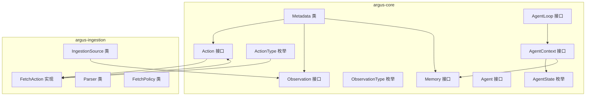
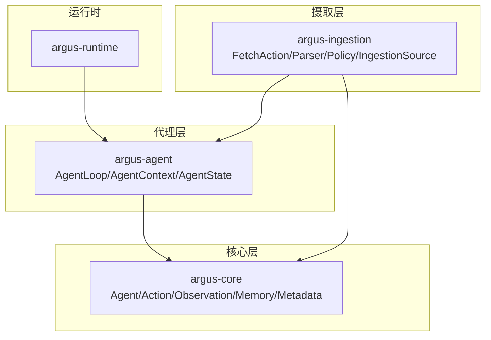
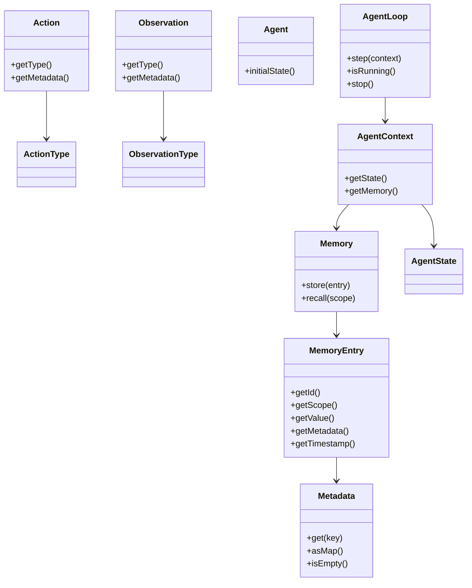
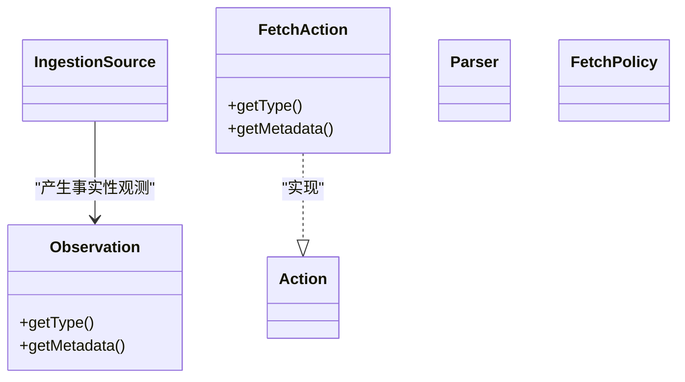
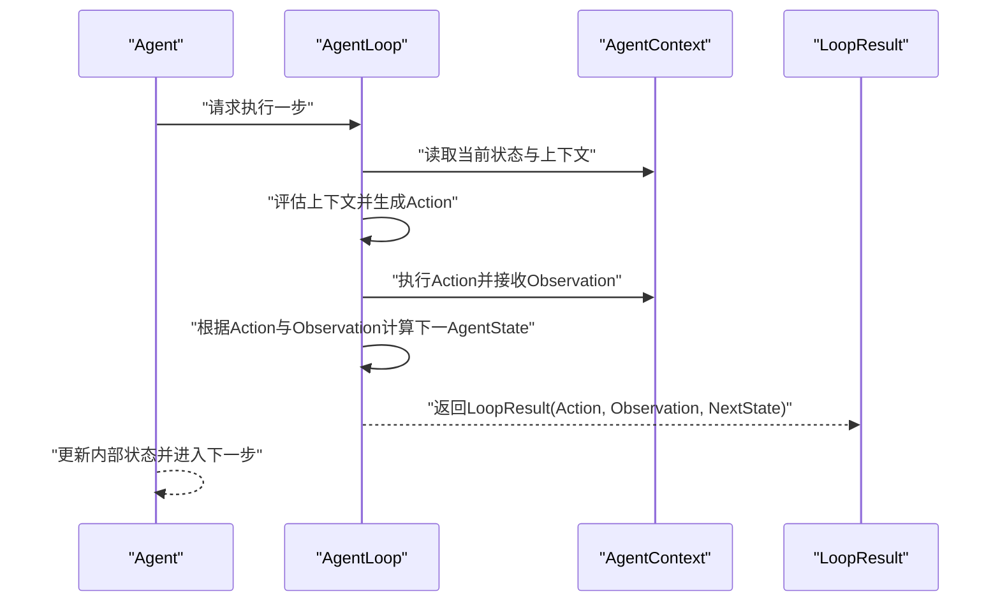
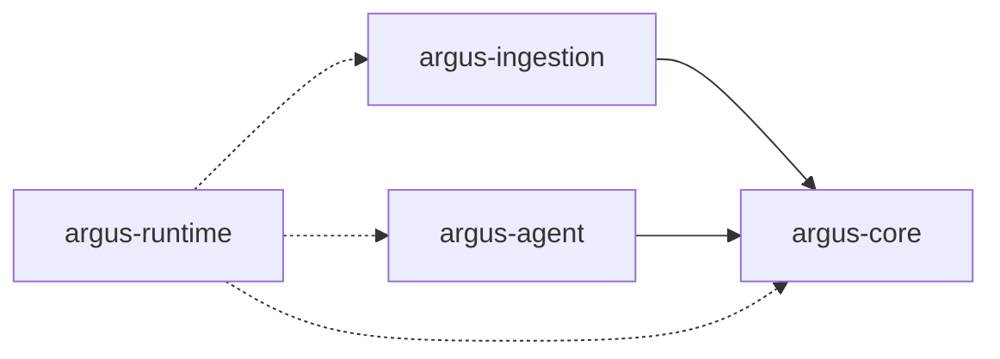

# 核心模块

<cite>
**本文引用的文件**
- [argus-core/src/main/java/io/argus/core/action/Action.java](file://argus-core/src/main/java/io/argus/core/action/Action.java)
- [argus-core/src/main/java/io/argus/core/action/ActionType.java](file://argus-core/src/main/java/io/argus/core/action/ActionType.java)
- [argus-core/src/main/java/io/argus/core/agent/Agent.java](file://argus-core/src/main/java/io/argus/core/agent/Agent.java)
- [argus-core/src/main/java/io/argus/core/agent/AgentLoop.java](file://argus-core/src/main/java/io/argus/core/agent/AgentLoop.java)
- [argus-core/src/main/java/io/argus/core/agent/AgentContext.java](file://argus-core/src/main/java/io/argus/core/agent/AgentContext.java)
- [argus-core/src/main/java/io/argus/core/agent/AgentState.java](file://argus-core/src/main/java/io/argus/core/agent/AgentState.java)
- [argus-core/src/main/java/io/argus/core/memory/Memory.java](file://argus-core/src/main/java/io/argus/core/memory/Memory.java)
- [argus-core/src/main/java/io/argus/core/memory/MemoryEntry.java](file://argus-core/src/main/java/io/argus/core/memory/MemoryEntry.java)
- [argus-core/src/main/java/io/argus/core/model/Metadata.java](file://argus-core/src/main/java/io/argus/core/model/Metadata.java)
- [argus-core/src/main/java/io/argus/core/observation/Observation.java](file://argus-core/src/main/java/io/argus/core/observation/Observation.java)
- [argus-core/src/main/java/io/argus/core/observation/ObservationType.java](file://argus-core/src/main/java/io/argus/core/observation/ObservationType.java)
- [argus-ingestion/src/main/java/io/argus/ingestion/fetch/FetchAction.java](file://argus-ingestion/src/main/java/io/argus/ingestion/fetch/FetchAction.java)
- [argus-ingestion/src/main/java/io/argus/ingestion/source/IngestionSource.java](file://argus-ingestion/src/main/java/io/argus/ingestion/source/IngestionSource.java)
- [argus-ingestion/src/main/java/io/argus/ingestion/parse/Parser.java](file://argus-ingestion/src/main/java/io/argus/ingestion/parse/Parser.java)
- [argus-ingestion/src/main/java/io/argus/ingestion/policy/FetchPolicy.java](file://argus-ingestion/src/main/java/io/argus/ingestion/policy/FetchPolicy.java)
</cite>

## 目录
1. [引言](#引言)
2. [项目结构](#项目结构)
3. [核心组件](#核心组件)
4. [架构总览](#架构总览)
5. [详细组件分析](#详细组件分析)
6. [依赖分析](#依赖分析)
7. [性能考虑](#性能考虑)
8. [故障排查指南](#故障排查指南)
9. [结论](#结论)

## 引言
本文件系统性介绍Argus框架的四个核心模块及其功能定位，并重点阐述以下内容：
- argus-core：作为基础模块，提供抽象接口与通用组件，包括Agent、Action、Observation、Memory等核心接口的设计理念与职责边界。
- argus-ingestion：负责数据获取能力，涵盖FetchAction、Parser、Policy等组件的职责与协作方式。
- argus-agent：实现确定性的代理执行循环与状态管理，强调可审计、可回放、可控制的单步决策模型。
- argus-runtime：提供运行时容器与生产级部署支持（当前模块结构为空，后续可扩展）。
- 各模块之间的依赖关系与协作机制。

## 项目结构
Argus采用多模块分层设计，以清晰的职责边界划分核心能力：
- argus-core：定义领域抽象与通用模型（动作、观察、记忆、元数据、代理状态与上下文等）。
- argus-ingestion：面向数据获取与处理，封装抓取、解析、策略与外部输入边界。
- argus-agent：面向代理执行循环与状态机，提供确定性、可观测的执行模型。
- argus-runtime：面向运行时容器与部署（当前模块结构为空，预留扩展空间）。

图表来源
- [argus-core/src/main/java/io/argus/core/action/Action.java](file://argus-core/src/main/java/io/argus/core/action/Action.java#L37-L43)
- [argus-core/src/main/java/io/argus/core/action/ActionType.java](file://argus-core/src/main/java/io/argus/core/action/ActionType.java#L22-L143)
- [argus-core/src/main/java/io/argus/core/observation/Observation.java](file://argus-core/src/main/java/io/argus/core/observation/Observation.java#L31-L37)
- [argus-core/src/main/java/io/argus/core/observation/ObservationType.java](file://argus-core/src/main/java/io/argus/core/observation/ObservationType.java#L18-L117)
- [argus-core/src/main/java/io/argus/core/memory/Memory.java](file://argus-core/src/main/java/io/argus/core/memory/Memory.java#L9-L15)
- [argus-core/src/main/java/io/argus/core/model/Metadata.java](file://argus-core/src/main/java/io/argus/core/model/Metadata.java#L12-L34)
- [argus-core/src/main/java/io/argus/core/agent/Agent.java](file://argus-core/src/main/java/io/argus/core/agent/Agent.java#L7-L11)
- [argus-core/src/main/java/io/argus/core/agent/AgentLoop.java](file://argus-core/src/main/java/io/argus/core/agent/AgentLoop.java#L49-L118)
- [argus-core/src/main/java/io/argus/core/agent/AgentContext.java](file://argus-core/src/main/java/io/argus/core/agent/AgentContext.java#L92-L98)
- [argus-core/src/main/java/io/argus/core/agent/AgentState.java](file://argus-core/src/main/java/io/argus/core/agent/AgentState.java#L79-L81)
- [argus-ingestion/src/main/java/io/argus/ingestion/fetch/FetchAction.java](file://argus-ingestion/src/main/java/io/argus/ingestion/fetch/FetchAction.java#L11-L21)
- [argus-ingestion/src/main/java/io/argus/ingestion/source/IngestionSource.java](file://argus-ingestion/src/main/java/io/argus/ingestion/source/IngestionSource.java#L109-L110)
- [argus-ingestion/src/main/java/io/argus/ingestion/parse/Parser.java](file://argus-ingestion/src/main/java/io/argus/ingestion/parse/Parser.java#L7-L8)
- [argus-ingestion/src/main/java/io/argus/ingestion/policy/FetchPolicy.java](file://argus-ingestion/src/main/java/io/argus/ingestion/policy/FetchPolicy.java#L7-L8)

章节来源
- [argus-core/src/main/java/io/argus/core/action/Action.java](file://argus-core/src/main/java/io/argus/core/action/Action.java#L1-L43)
- [argus-core/src/main/java/io/argus/core/agent/AgentLoop.java](file://argus-core/src/main/java/io/argus/core/agent/AgentLoop.java#L1-L118)
- [argus-ingestion/src/main/java/io/argus/ingestion/fetch/FetchAction.java](file://argus-ingestion/src/main/java/io/argus/ingestion/fetch/FetchAction.java#L1-L21)

## 核心组件
本节聚焦argus-core的基础抽象与通用组件，阐明其设计理念与职责边界。

- 动作（Action）与类型（ActionType）
  - Action代表代理在执行过程中表达的意图，强调“要做什么”而非“如何做”。每个Action必须由ActionType进行高层语义分类；额外信息通过Metadata传递，避免在类型枚举中编码技术细节。
  - ActionType覆盖DECIDE（内部决策）、REQUEST（请求外部能力）、FETCH（获取数据）、TRANSFORM（纯数据变换）、STORE（持久化）、EMIT（对外输出）等类别，支撑从推理到执行的全链路抽象。

- 观察（Observation）与类型（ObservationType）
  - Observation是对代理执行过程中所感知到的事实的不可变表达，可源自内部状态变化或外部系统反馈。每个Observation由ObservationType进行高层语义分类，事实性与不可变性确保可审计与可回放。

- 记忆（Memory）与条目（MemoryEntry）
  - Memory提供存储与召回能力，支持按作用域（MemoryScope）检索；MemoryEntry承载具体值、元数据与时间戳，保证可追溯性与一致性。

- 元数据（Metadata）
  - Metadata以不可变键值对形式承载上下文与领域特定信息，支持查询、映射导出与判空判断，贯穿Action、Observation、MemoryEntry等核心对象。

- 代理（Agent）、执行循环（AgentLoop）、上下文（AgentContext）、状态（AgentState）
  - Agent定义初始状态；AgentLoop定义确定性单步决策模型，强调可审计、可回放与可控；AgentContext提供执行期可变工作区，严格与不可变的AgentState分离；AgentState是权威快照，支持回放、时间旅行调试与分支。

章节来源
- [argus-core/src/main/java/io/argus/core/action/Action.java](file://argus-core/src/main/java/io/argus/core/action/Action.java#L37-L43)
- [argus-core/src/main/java/io/argus/core/action/ActionType.java](file://argus-core/src/main/java/io/argus/core/action/ActionType.java#L22-L143)
- [argus-core/src/main/java/io/argus/core/observation/Observation.java](file://argus-core/src/main/java/io/argus/core/observation/Observation.java#L31-L37)
- [argus-core/src/main/java/io/argus/core/observation/ObservationType.java](file://argus-core/src/main/java/io/argus/core/observation/ObservationType.java#L18-L117)
- [argus-core/src/main/java/io/argus/core/memory/Memory.java](file://argus-core/src/main/java/io/argus/core/memory/Memory.java#L9-L15)
- [argus-core/src/main/java/io/argus/core/memory/MemoryEntry.java](file://argus-core/src/main/java/io/argus/core/memory/MemoryEntry.java#L9-L53)
- [argus-core/src/main/java/io/argus/core/model/Metadata.java](file://argus-core/src/main/java/io/argus/core/model/Metadata.java#L12-L34)
- [argus-core/src/main/java/io/argus/core/agent/Agent.java](file://argus-core/src/main/java/io/argus/core/agent/Agent.java#L7-L11)
- [argus-core/src/main/java/io/argus/core/agent/AgentLoop.java](file://argus-core/src/main/java/io/argus/core/agent/AgentLoop.java#L49-L118)
- [argus-core/src/main/java/io/argus/core/agent/AgentContext.java](file://argus-core/src/main/java/io/argus/core/agent/AgentContext.java#L92-L98)
- [argus-core/src/main/java/io/argus/core/agent/AgentState.java](file://argus-core/src/main/java/io/argus/core/agent/AgentState.java#L79-L81)

## 架构总览
Argus通过清晰的边界与职责分离实现可审计、可回放、可控制的代理执行与数据获取：
- argus-core提供统一的领域抽象与执行模型；
- argus-ingestion在外部世界边界内完成事实采集与初步处理；
- argus-agent基于AgentLoop与AgentContext实现确定性执行循环；
- argus-runtime作为容器与部署层（当前为空，预留扩展）。

图表来源
- [argus-core/src/main/java/io/argus/core/agent/AgentLoop.java](file://argus-core/src/main/java/io/argus/core/agent/AgentLoop.java#L49-L118)
- [argus-core/src/main/java/io/argus/core/agent/AgentContext.java](file://argus-core/src/main/java/io/argus/core/agent/AgentContext.java#L92-L98)
- [argus-ingestion/src/main/java/io/argus/ingestion/fetch/FetchAction.java](file://argus-ingestion/src/main/java/io/argus/ingestion/fetch/FetchAction.java#L11-L21)
- [argus-ingestion/src/main/java/io/argus/ingestion/source/IngestionSource.java](file://argus-ingestion/src/main/java/io/argus/ingestion/source/IngestionSource.java#L109-L110)

## 详细组件分析

### argus-core：基础抽象与通用组件
- 设计理念
  - 以不可变事实（Observation）与意图（Action）为核心，通过Metadata承载上下文，避免在类型枚举中嵌入技术细节。
  - 将“状态”与“上下文”严格分离：AgentState是权威快照，AgentContext仅限执行期可变工作区，确保回放与审计的确定性。
- 关键接口与类
  - Action/ActionType：声明式意图与高层语义分类。
  - Observation/ObservationType：不可变事实与高层语义分类。
  - Memory/MemoryEntry：可检索的记忆存储与条目。
  - Metadata：不可变键值对上下文载体。
  - Agent/AgentLoop/AgentContext/AgentState：确定性执行循环与状态管理。

图表来源
- [argus-core/src/main/java/io/argus/core/action/Action.java](file://argus-core/src/main/java/io/argus/core/action/Action.java#L37-L43)
- [argus-core/src/main/java/io/argus/core/action/ActionType.java](file://argus-core/src/main/java/io/argus/core/action/ActionType.java#L22-L143)
- [argus-core/src/main/java/io/argus/core/observation/Observation.java](file://argus-core/src/main/java/io/argus/core/observation/Observation.java#L31-L37)
- [argus-core/src/main/java/io/argus/core/observation/ObservationType.java](file://argus-core/src/main/java/io/argus/core/observation/ObservationType.java#L18-L117)
- [argus-core/src/main/java/io/argus/core/memory/Memory.java](file://argus-core/src/main/java/io/argus/core/memory/Memory.java#L9-L15)
- [argus-core/src/main/java/io/argus/core/memory/MemoryEntry.java](file://argus-core/src/main/java/io/argus/core/memory/MemoryEntry.java#L9-L53)
- [argus-core/src/main/java/io/argus/core/model/Metadata.java](file://argus-core/src/main/java/io/argus/core/model/Metadata.java#L12-L34)
- [argus-core/src/main/java/io/argus/core/agent/Agent.java](file://argus-core/src/main/java/io/argus/core/agent/Agent.java#L7-L11)
- [argus-core/src/main/java/io/argus/core/agent/AgentLoop.java](file://argus-core/src/main/java/io/argus/core/agent/AgentLoop.java#L49-L118)
- [argus-core/src/main/java/io/argus/core/agent/AgentContext.java](file://argus-core/src/main/java/io/argus/core/agent/AgentContext.java#L92-L98)
- [argus-core/src/main/java/io/argus/core/agent/AgentState.java](file://argus-core/src/main/java/io/argus/core/agent/AgentState.java#L79-L81)

章节来源
- [argus-core/src/main/java/io/argus/core/action/Action.java](file://argus-core/src/main/java/io/argus/core/action/Action.java#L1-L43)
- [argus-core/src/main/java/io/argus/core/observation/Observation.java](file://argus-core/src/main/java/io/argus/core/observation/Observation.java#L1-L37)
- [argus-core/src/main/java/io/argus/core/memory/Memory.java](file://argus-core/src/main/java/io/argus/core/memory/Memory.java#L1-L15)
- [argus-core/src/main/java/io/argus/core/model/Metadata.java](file://argus-core/src/main/java/io/argus/core/model/Metadata.java#L1-L34)
- [argus-core/src/main/java/io/argus/core/agent/AgentLoop.java](file://argus-core/src/main/java/io/argus/core/agent/AgentLoop.java#L1-L118)
- [argus-core/src/main/java/io/argus/core/agent/AgentContext.java](file://argus-core/src/main/java/io/argus/core/agent/AgentContext.java#L1-L98)
- [argus-core/src/main/java/io/argus/core/agent/AgentState.java](file://argus-core/src/main/java/io/argus/core/agent/AgentState.java#L1-L81)

### argus-ingestion：数据获取与处理
- 职责边界
  - IngestionSource定义ARGUS与外部世界的权威边界，负责产生关于外部环境的事实性Observation；强调不可变、可审计与可回放。
  - FetchAction作为FETCH类型的Action实现，表达“获取数据”的意图；Parser与Policy分别承担解析与策略控制。
- 关键组件
  - IngestionSource：约束事实语义、回放语义、请求快照要求、审计与执行模式（LIVE/REPLAY/DRY_RUN）。
  - FetchAction：实现Action接口，提供FETCH类型与元数据承载。
  - Parser/FetchPolicy：作为处理与策略扩展点，当前类体为空，便于后续扩展。

图表来源
- [argus-ingestion/src/main/java/io/argus/ingestion/source/IngestionSource.java](file://argus-ingestion/src/main/java/io/argus/ingestion/source/IngestionSource.java#L109-L110)
- [argus-ingestion/src/main/java/io/argus/ingestion/fetch/FetchAction.java](file://argus-ingestion/src/main/java/io/argus/ingestion/fetch/FetchAction.java#L11-L21)
- [argus-ingestion/src/main/java/io/argus/ingestion/parse/Parser.java](file://argus-ingestion/src/main/java/io/argus/ingestion/parse/Parser.java#L7-L8)
- [argus-ingestion/src/main/java/io/argus/ingestion/policy/FetchPolicy.java](file://argus-ingestion/src/main/java/io/argus/ingestion/policy/FetchPolicy.java#L7-L8)
- [argus-core/src/main/java/io/argus/core/observation/Observation.java](file://argus-core/src/main/java/io/argus/core/observation/Observation.java#L31-L37)

章节来源
- [argus-ingestion/src/main/java/io/argus/ingestion/source/IngestionSource.java](file://argus-ingestion/src/main/java/io/argus/ingestion/source/IngestionSource.java#L1-L110)
- [argus-ingestion/src/main/java/io/argus/ingestion/fetch/FetchAction.java](file://argus-ingestion/src/main/java/io/argus/ingestion/fetch/FetchAction.java#L1-L21)
- [argus-ingestion/src/main/java/io/argus/ingestion/parse/Parser.java](file://argus-ingestion/src/main/java/io/argus/ingestion/parse/Parser.java#L1-L8)
- [argus-ingestion/src/main/java/io/argus/ingestion/policy/FetchPolicy.java](file://argus-ingestion/src/main/java/io/argus/ingestion/policy/FetchPolicy.java#L1-L8)

### argus-agent：确定性执行循环与状态管理
- AgentLoop：定义单步决策模型，强调原子性、可观测性与可审计性；step返回LoopResult，包含Action、Observation与下一AgentState；isRunning与stop提供运行控制。
- AgentContext：执行期可变工作区，严格与AgentState分离；允许短期推理缓冲、外部客户端、速率限制器、追踪与指标等，但禁止存放权威状态或隐藏副作用。
- AgentState：不可变权威快照，支持回放、时间旅行调试与分支；每次状态转移必须产生新实例。

图表来源
- [argus-core/src/main/java/io/argus/core/agent/AgentLoop.java](file://argus-core/src/main/java/io/argus/core/agent/AgentLoop.java#L49-L118)
- [argus-core/src/main/java/io/argus/core/agent/AgentContext.java](file://argus-core/src/main/java/io/argus/core/agent/AgentContext.java#L92-L98)
- [argus-core/src/main/java/io/argus/core/agent/AgentState.java](file://argus-core/src/main/java/io/argus/core/agent/AgentState.java#L79-L81)

章节来源
- [argus-core/src/main/java/io/argus/core/agent/AgentLoop.java](file://argus-core/src/main/java/io/argus/core/agent/AgentLoop.java#L1-L118)
- [argus-core/src/main/java/io/argus/core/agent/AgentContext.java](file://argus-core/src/main/java/io/argus/core/agent/AgentContext.java#L1-L98)
- [argus-core/src/main/java/io/argus/core/agent/AgentState.java](file://argus-core/src/main/java/io/argus/core/agent/AgentState.java#L1-L81)

### argus-runtime：运行时容器与生产级部署
- 当前状态：模块结构为空，未包含具体实现。
- 建议方向：作为运行时容器与部署层，可提供资源编排、生命周期管理、监控与日志、安全与权限控制、以及与argus-core/argus-agent/argus-ingestion的集成适配器。

章节来源
- [argus-runtime/pom.xml](file://argus-runtime/pom.xml)

## 依赖分析
- 模块间依赖
  - argus-ingestion依赖argus-core的Action、Observation、Metadata等抽象，以实现FETCH意图与事实性观测。
  - argus-agent依赖argus-core的AgentLoop、AgentContext、AgentState等，构建确定性执行循环。
  - argus-runtime与上述模块解耦，通过接口契约进行集成。
- 组件内依赖
  - Metadata广泛被Action、Observation、MemoryEntry使用，形成跨组件的上下文传递。
  - AgentContext持有AgentState与Memory，体现状态与上下文的协作。

图表来源
- [argus-ingestion/src/main/java/io/argus/ingestion/fetch/FetchAction.java](file://argus-ingestion/src/main/java/io/argus/ingestion/fetch/FetchAction.java#L11-L21)
- [argus-core/src/main/java/io/argus/core/agent/AgentLoop.java](file://argus-core/src/main/java/io/argus/core/agent/AgentLoop.java#L49-L118)
- [argus-core/src/main/java/io/argus/core/agent/AgentContext.java](file://argus-core/src/main/java/io/argus/core/agent/AgentContext.java#L92-L98)

章节来源
- [argus-ingestion/src/main/java/io/argus/ingestion/fetch/FetchAction.java](file://argus-ingestion/src/main/java/io/argus/ingestion/fetch/FetchAction.java#L1-L21)
- [argus-core/src/main/java/io/argus/core/agent/AgentLoop.java](file://argus-core/src/main/java/io/argus/core/agent/AgentLoop.java#L1-L118)
- [argus-core/src/main/java/io/argus/core/agent/AgentContext.java](file://argus-core/src/main/java/io/argus/core/agent/AgentContext.java#L1-L98)

## 性能考虑
- 单步原子性：AgentLoop的step必须保持原子性与可观测性，避免长阻塞；长时间运行应拆分为多次step调用。
- 上下文隔离：AgentContext为执行期可变工作区，避免将其作为持久状态存储，减少回放与审计成本。
- 回放确定性：IngestionSource在回放模式下不得访问外部世界，需完全依赖已记录的摄入结果重建Observation，确保回放性能与一致性。
- 元数据不可变：Metadata的不可变特性降低并发风险与拷贝开销，提升整体稳定性。

## 故障排查指南
- 执行循环异常
  - 检查AgentLoop的step是否包含无限循环或长阻塞操作；确认isRunning与stop的调用时机。
- 上下文与状态混淆
  - 确保仅在AgentState中保存权威状态，AgentContext仅存放执行期临时数据；避免将决策关键数据仅存于AgentContext。
- 摄取回放问题
  - IngestionSource在回放模式下必须仅依赖已记录的摄入结果；若出现外部访问或非确定性行为，需检查请求快照完整性与审计事件记录。
- 元数据缺失或错误
  - 检查Metadata构造与查询路径，确保键值对不可变且可导出；避免在类型枚举中硬编码技术细节。

章节来源
- [argus-core/src/main/java/io/argus/core/agent/AgentLoop.java](file://argus-core/src/main/java/io/argus/core/agent/AgentLoop.java#L49-L118)
- [argus-core/src/main/java/io/argus/core/agent/AgentContext.java](file://argus-core/src/main/java/io/argus/core/agent/AgentContext.java#L92-L98)
- [argus-ingestion/src/main/java/io/argus/ingestion/source/IngestionSource.java](file://argus-ingestion/src/main/java/io/argus/ingestion/source/IngestionSource.java#L109-L110)
- [argus-core/src/main/java/io/argus/core/model/Metadata.java](file://argus-core/src/main/java/io/argus/core/model/Metadata.java#L12-L34)

## 结论
Argus框架通过argus-core提供统一的领域抽象与执行模型，借助argus-ingestion在外部世界边界内完成事实采集，再由argus-agent以确定性循环驱动代理执行，最终由argus-runtime提供容器与部署支持。模块间以接口契约解耦，强调可审计、可回放与可控制，适合构建生产级智能代理系统。