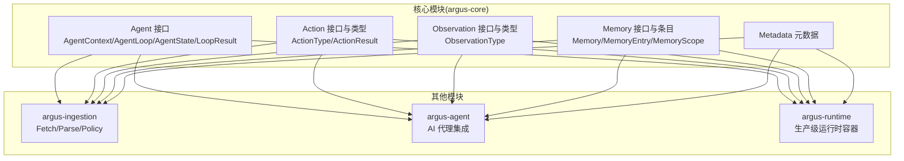
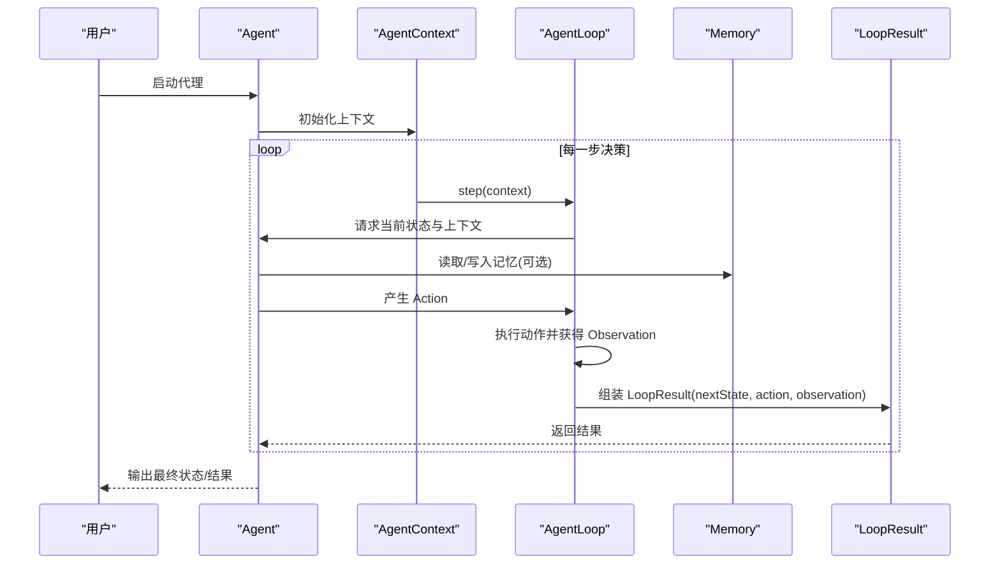
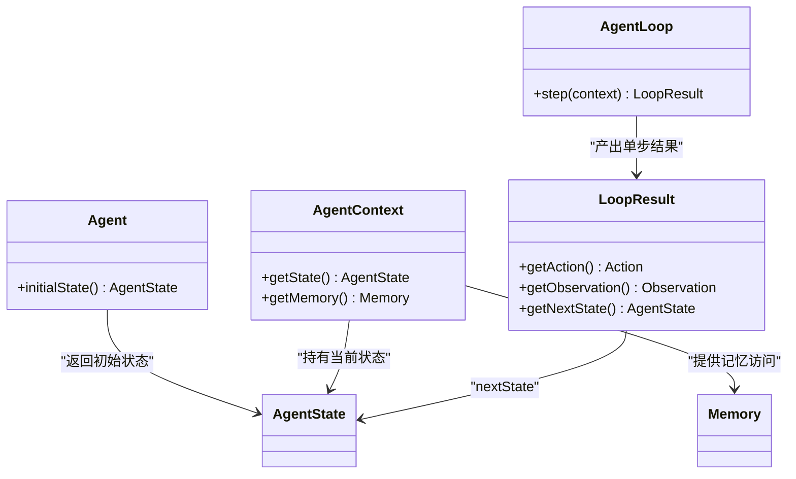
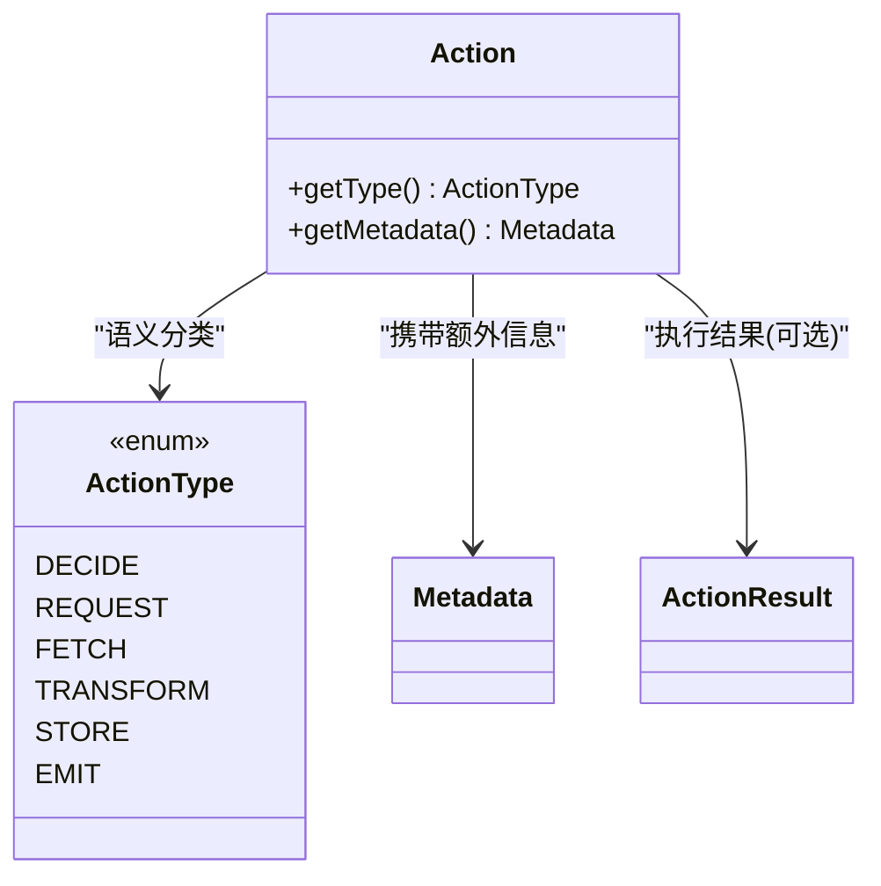
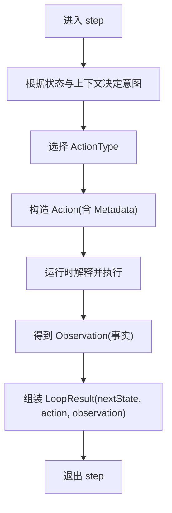
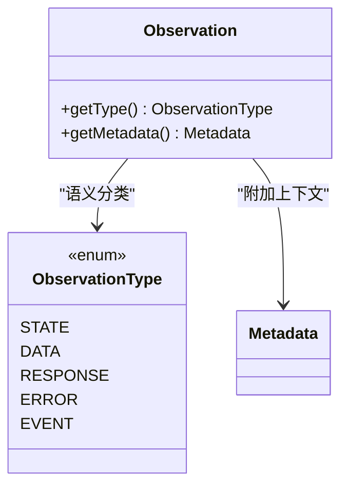
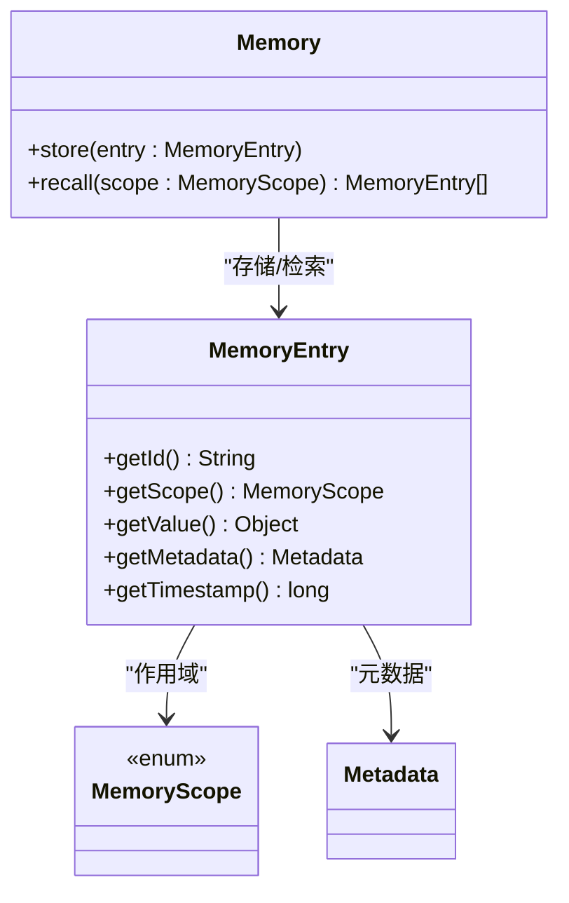
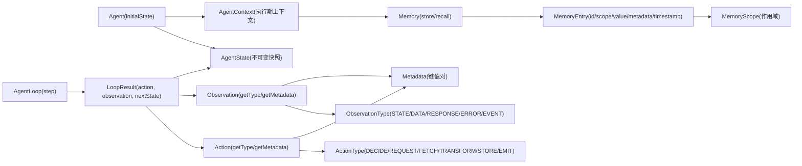

# 基础示例

<cite>
**本文引用的文件**
- [readme.md](file://readme.md)
- [Agent.java](file://argus-core/src/main/java/io/argus/core/agent/Agent.java)
- [AgentContext.java](file://argus-core/src/main/java/io/argus/core/agent/AgentContext.java)
- [AgentLoop.java](file://argus-core/src/main/java/io/argus/core/agent/AgentLoop.java)
- [AgentState.java](file://argus-core/src/main/java/io/argus/core/agent/AgentState.java)
- [LoopResult.java](file://argus-core/src/main/java/io/argus/core/agent/LoopResult.java)
- [Action.java](file://argus-core/src/main/java/io/argus/core/action/Action.java)
- [ActionType.java](file://argus-core/src/main/java/io/argus/core/action/ActionType.java)
- [ActionResult.java](file://argus-core/src/main/java/io/argus/core/action/ActionResult.java)
- [Observation.java](file://argus-core/src/main/java/io/argus/core/observation/Observation.java)
- [ObservationType.java](file://argus-core/src/main/java/io/argus/core/observation/ObservationType.java)
- [Memory.java](file://argus-core/src/main/java/io/argus/core/memory/Memory.java)
- [MemoryEntry.java](file://argus-core/src/main/java/io/argus/core/memory/MemoryEntry.java)
- [MemoryScope.java](file://argus-core/src/main/java/io/argus/core/memory/MemoryScope.java)
- [Metadata.java](file://argus-core/src/main/java/io/argus/core/model/Metadata.java)
</cite>

## 目录
1. [简介](#简介)
2. [项目结构](#项目结构)
3. [核心组件](#核心组件)
4. [架构总览](#架构总览)
5. [详细组件分析](#详细组件分析)
6. [依赖关系分析](#依赖关系分析)
7. [性能考虑](#性能考虑)
8. [故障排查指南](#故障排查指南)
9. [结论](#结论)
10. [附录](#附录)

## 简介
本示例面向初学者，目标是通过最小可行的自定义代理，帮助你快速掌握 Argus 框架的核心概念与基本用法。内容涵盖：
- 如何实现 Agent 接口，定义初始状态与执行循环
- Action 系统：如何定义与执行不同类型的动作
- Observation 系统：如何记录与处理代理的执行结果
- Memory 管理：如何存储与检索代理的状态信息
- 每个示例均给出完整的代码实现路径、详细注释说明与运行步骤，便于上手实践

Argus 的设计强调可审计、可控制、可复现，围绕“意图(Action)”“观测(Observation)”“状态(AgentState)”“记忆(Memory)”构建统一的执行模型。

章节来源
- file://readme.md#L1-L28

## 项目结构
Argus 采用多模块组织，核心能力集中在 argus-core，包含 Agent、Action、Observation、Memory 等基础抽象；另有 argus-ingestion 提供网络数据获取能力；argus-agent 与 argus-runtime 分别提供代理集成与运行时容器支持。

图表来源
- [readme.md](file://readme.md#L7-L14)

章节来源
- file://readme.md#L7-L14

## 核心组件
本节对 Agent、Action、Observation、Memory 及其相关类型进行概览，明确它们在执行循环中的职责与交互关系。

- Agent：定义代理的初始状态入口
- AgentContext：提供执行期的可变上下文（仅执行期有效）
- AgentLoop：定义单步决策循环，产出 LoopResult
- AgentState：不可变的代理状态快照
- Action/ActionType：代理意图的声明式表达
- Observation/ObservationType：代理观测到的事实
- Memory/MemoryEntry/MemoryScope：非权威的记忆存取
- Metadata：通用元数据容器

章节来源
- file://argus-core/src/main/java/io/argus/core/agent/Agent.java#L7-L11
- file://argus-core/src/main/java/io/argus/core/agent/AgentContext.java#L92-L98
- file://argus-core/src/main/java/io/argus/core/agent/AgentLoop.java#L49-L77
- file://argus-core/src/main/java/io/argus/core/agent/AgentState.java#L79-L81
- file://argus-core/src/main/java/io/argus/core/agent/LoopResult.java#L78-L115
- file://argus-core/src/main/java/io/argus/core/action/Action.java#L37-L43
- file://argus-core/src/main/java/io/argus/core/action/ActionType.java#L22-L143
- file://argus-core/src/main/java/io/argus/core/action/ActionResult.java#L7-L8
- file://argus-core/src/main/java/io/argus/core/observation/Observation.java#L31-L37
- file://argus-core/src/main/java/io/argus/core/observation/ObservationType.java#L18-L117
- file://argus-core/src/main/java/io/argus/core/memory/Memory.java#L9-L15
- file://argus-core/src/main/java/io/argus/core/memory/MemoryEntry.java#L9-L53
- file://argus-core/src/main/java/io/argus/core/memory/MemoryScope.java#L7-L8
- file://argus-core/src/main/java/io/argus/core/model/Metadata.java#L12-L34

## 架构总览
下图展示了从 Agent 到 Action、Observation、Memory 的典型执行流程，以及 LoopResult 如何串联一次决策周期。

图表来源
- [Agent.java](file://argus-core/src/main/java/io/argus/core/agent/Agent.java#L7-L11)
- [AgentContext.java](file://argus-core/src/main/java/io/argus/core/agent/AgentContext.java#L92-L98)
- [AgentLoop.java](file://argus-core/src/main/java/io/argus/core/agent/AgentLoop.java#L49-L77)
- [LoopResult.java](file://argus-core/src/main/java/io/argus/core/agent/LoopResult.java#L78-L115)
- [Memory.java](file://argus-core/src/main/java/io/argus/core/memory/Memory.java#L9-L15)

## 详细组件分析

### 示例一：创建最简单的自定义代理（实现 Agent 接口）
目标：实现一个最小可用的代理，至少包含初始状态定义与执行循环入口。

要点
- 实现 Agent 接口的 initialState 方法，返回 AgentState
- 在 AgentContext 中持有当前 AgentState，并提供 Memory 访问
- 使用 AgentLoop.step 驱动单步执行，产出 LoopResult
- 将 LoopResult 的 next AgentState 作为下一步的输入

图表来源
- [Agent.java](file://argus-core/src/main/java/io/argus/core/agent/Agent.java#L7-L11)
- [AgentContext.java](file://argus-core/src/main/java/io/argus/core/agent/AgentContext.java#L92-L98)
- [AgentLoop.java](file://argus-core/src/main/java/io/argus/core/agent/AgentLoop.java#L49-L77)
- [AgentState.java](file://argus-core/src/main/java/io/argus/core/agent/AgentState.java#L79-L81)
- [LoopResult.java](file://argus-core/src/main/java/io/argus/core/agent/LoopResult.java#L78-L115)
- [Memory.java](file://argus-core/src/main/java/io/argus/core/memory/Memory.java#L9-L15)

运行步骤
- 在你的工程中实现 Agent 接口，至少提供 initialState 返回值
- 在 AgentContext 中维护 AgentState，并按需提供 Memory 访问
- 使用 AgentLoop.step 驱动执行，循环读取 LoopResult 的 nextState 作为下一轮输入
- 若需要外部能力，可在 Action 中声明，由运行时解释执行

章节来源
- file://argus-core/src/main/java/io/argus/core/agent/Agent.java#L7-L11
- file://argus-core/src/main/java/io/argus/core/agent/AgentContext.java#L92-L98
- file://argus-core/src/main/java/io/argus/core/agent/AgentLoop.java#L49-L77
- file://argus-core/src/main/java/io/argus/core/agent/LoopResult.java#L78-L115

### 示例二：Action 系统使用（定义与执行不同类型的动作）
目标：展示如何定义不同类型的 Action，并在执行循环中产出 LoopResult。

Action 类型概览
- DECIDE：内部决策/推理，不直接对外产生副作用
- REQUEST：请求外部能力（如语言模型、工具）
- FETCH：从内外部源获取数据
- TRANSFORM：纯数据变换，无外部副作用
- STORE：持久化/提交到内存或存储
- EMIT：向外部环境发出信息或信号

图表来源
- [Action.java](file://argus-core/src/main/java/io/argus/core/action/Action.java#L37-L43)
- [ActionType.java](file://argus-core/src/main/java/io/argus/core/action/ActionType.java#L22-L143)
- [ActionResult.java](file://argus-core/src/main/java/io/argus/core/action/ActionResult.java#L7-L8)
- [Metadata.java](file://argus-core/src/main/java/io/argus/core/model/Metadata.java#L12-L34)

执行流程（概念）
- 在 AgentLoop.step 中，根据当前 AgentState 与 AgentContext 生成 Action
- 运行时解释 Action 的语义，执行对应能力
- 产出 Observation（如成功/失败/数据等），封装为 LoopResult

图表来源
- [AgentLoop.java](file://argus-core/src/main/java/io/argus/core/agent/AgentLoop.java#L49-L77)
- [Action.java](file://argus-core/src/main/java/io/argus/core/action/Action.java#L37-L43)
- [Observation.java](file://argus-core/src/main/java/io/argus/core/observation/Observation.java#L31-L37)
- [LoopResult.java](file://argus-core/src/main/java/io/argus/core/agent/LoopResult.java#L78-L115)

章节来源
- file://argus-core/src/main/java/io/argus/core/action/ActionType.java#L22-L143
- file://argus-core/src/main/java/io/argus/core/action/Action.java#L37-L43
- file://argus-core/src/main/java/io/argus/core/observation/Observation.java#L31-L37
- file://argus-core/src/main/java/io/argus/core/agent/AgentLoop.java#L49-L77
- file://argus-core/src/main/java/io/argus/core/agent/LoopResult.java#L78-L115

### 示例三：Observation 系统应用（记录与处理执行结果）
目标：展示如何在执行后记录并处理代理的观测结果。

Observation 类型概览
- STATE：内部状态变化
- DATA：原始或结构化数据
- RESPONSE：对先前 Action 的响应结果
- ERROR：错误或失败状态
- EVENT：外部或异步事件

图表来源
- [Observation.java](file://argus-core/src/main/java/io/argus/core/observation/Observation.java#L31-L37)
- [ObservationType.java](file://argus-core/src/main/java/io/argus/core/observation/ObservationType.java#L18-L117)
- [Metadata.java](file://argus-core/src/main/java/io/argus/core/model/Metadata.java#L12-L34)

处理建议
- 将 Observation 作为只读事实，不承载决策指令
- 使用 Metadata 传递领域特定上下文（如错误码、数据格式、来源标识等）
- 在 LoopResult 中同时记录 Action 与 Observation，确保可审计与可回放

章节来源
- file://argus-core/src/main/java/io/argus/core/observation/Observation.java#L31-L37
- file://argus-core/src/main/java/io/argus/core/observation/ObservationType.java#L18-L117
- file://argus-core/src/main/java/io/argus/core/model/Metadata.java#L12-L34
- file://argus-core/src/main/java/io/argus/core/agent/LoopResult.java#L78-L115

### 示例四：Memory 管理（存储与检索代理状态信息）
目标：展示如何使用 Memory 存储与检索代理状态信息，区分权威状态与非权威记忆。

要点
- Memory 接口提供 store 与 recall 两个核心操作
- MemoryEntry 为存储单元，包含 id、scope、value、metadata、timestamp
- MemoryScope 用于划分记忆范围（如会话、任务、全局）
- Metadata 支持附加属性（如来源、版本、标签）

图表来源
- [Memory.java](file://argus-core/src/main/java/io/argus/core/memory/Memory.java#L9-L15)
- [MemoryEntry.java](file://argus-core/src/main/java/io/argus/core/memory/MemoryEntry.java#L9-L53)
- [MemoryScope.java](file://argus-core/src/main/java/io/argus/core/memory/MemoryScope.java#L7-L8)
- [Metadata.java](file://argus-core/src/main/java/io/argus/core/model/Metadata.java#L12-L34)

使用建议
- 将权威状态放入 AgentState 与 LoopResult，确保可回放
- 将临时性、非权威的中间结果放入 Memory，便于调试与审计
- 通过 Metadata 记录来源与用途，便于检索与追踪

章节来源
- file://argus-core/src/main/java/io/argus/core/memory/Memory.java#L9-L15
- file://argus-core/src/main/java/io/argus/core/memory/MemoryEntry.java#L9-L53
- file://argus-core/src/main/java/io/argus/core/memory/MemoryScope.java#L7-L8
- file://argus-core/src/main/java/io/argus/core/model/Metadata.java#L12-L34

## 依赖关系分析
下图展示核心接口之间的依赖与耦合关系，体现“意图—观测—状态—记忆”的闭环。

图表来源
- [Agent.java](file://argus-core/src/main/java/io/argus/core/agent/Agent.java#L7-L11)
- [AgentContext.java](file://argus-core/src/main/java/io/argus/core/agent/AgentContext.java#L92-L98)
- [AgentLoop.java](file://argus-core/src/main/java/io/argus/core/agent/AgentLoop.java#L49-L77)
- [LoopResult.java](file://argus-core/src/main/java/io/argus/core/agent/LoopResult.java#L78-L115)
- [Action.java](file://argus-core/src/main/java/io/argus/core/action/Action.java#L37-L43)
- [ActionType.java](file://argus-core/src/main/java/io/argus/core/action/ActionType.java#L22-L143)
- [Observation.java](file://argus-core/src/main/java/io/argus/core/observation/Observation.java#L31-L37)
- [ObservationType.java](file://argus-core/src/main/java/io/argus/core/observation/ObservationType.java#L18-L117)
- [Memory.java](file://argus-core/src/main/java/io/argus/core/memory/Memory.java#L9-L15)
- [MemoryEntry.java](file://argus-core/src/main/java/io/argus/core/memory/MemoryEntry.java#L9-L53)
- [MemoryScope.java](file://argus-core/src/main/java/io/argus/core/memory/MemoryScope.java#L7-L8)
- [Metadata.java](file://argus-core/src/main/java/io/argus/core/model/Metadata.java#L12-L34)

章节来源
- file://argus-core/src/main/java/io/argus/core/agent/Agent.java#L7-L11
- file://argus-core/src/main/java/io/argus/core/agent/AgentLoop.java#L49-L77
- file://argus-core/src/main/java/io/argus/core/agent/LoopResult.java#L78-L115
- file://argus-core/src/main/java/io/argus/core/action/Action.java#L37-L43
- file://argus-core/src/main/java/io/argus/core/observation/Observation.java#L31-L37
- file://argus-core/src/main/java/io/argus/core/memory/Memory.java#L9-L15
- file://argus-core/src/main/java/io/argus/core/model/Metadata.java#L12-L34

## 性能考虑
- 将长任务拆分为多次 step 调用，避免单次 step 出现阻塞或无限循环
- 控制 LoopResult 的大小与数量，仅记录必要信息以保证回放效率
- 使用 Memory 进行非权威缓存，避免在 AgentState 中存放临时数据
- Metadata 的键值对应精简，避免冗余字段影响序列化与检索

## 故障排查指南
- 回放失败：检查 LoopResult 是否完整、是否遗漏必要的 nextState 或 action/observation
- 状态不一致：确认 AgentState 的不可变契约，避免在上下文中隐藏权威状态
- 记忆污染：区分 Memory 与 AgentState 的职责边界，不要把不可回放的上下文当作状态
- 元数据缺失：为 Action 与 Observation 提供充分的 Metadata，便于审计与定位问题

## 结论
通过以上四个基础示例，你可以：
- 快速实现一个最小可用的代理，理解 Agent、AgentContext、AgentLoop、AgentState 的职责
- 正确使用 Action 与 Observation，清晰分离意图与事实
- 合理运用 Memory，实现非权威状态的存储与检索
- 为后续扩展（如网络数据获取、LLM 调用、工具链集成）打下坚实基础

## 附录
- 快速编译与打包
  - 在仓库根目录执行编译打包命令，生成各模块 JAR 包
  - 参考：[readme.md](file://readme.md#L18-L21)

章节来源
- file://readme.md#L18-L21