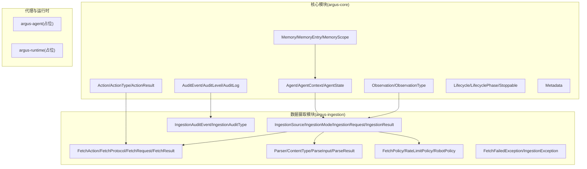
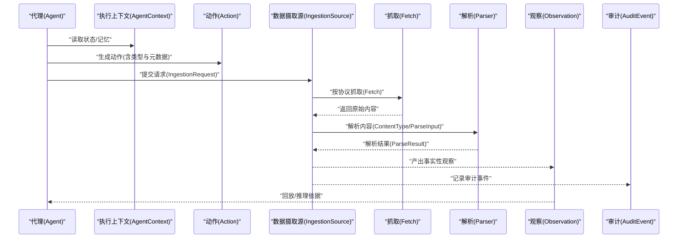
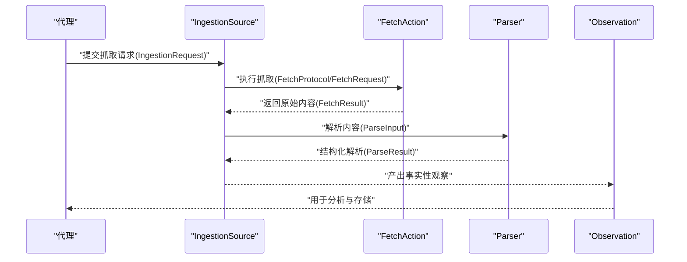
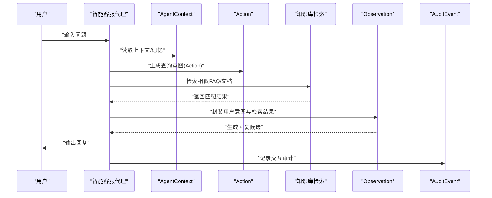
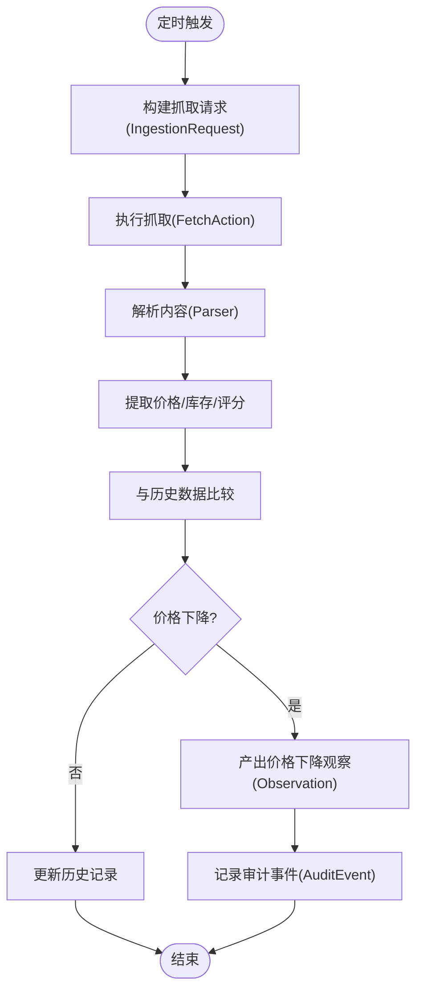
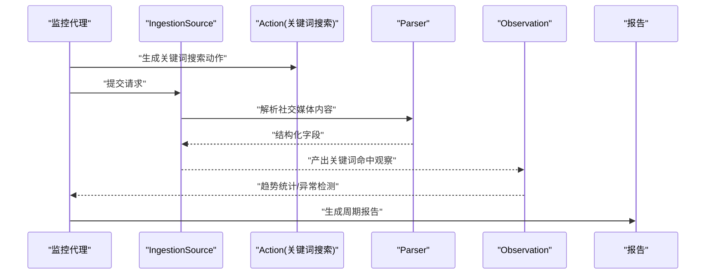
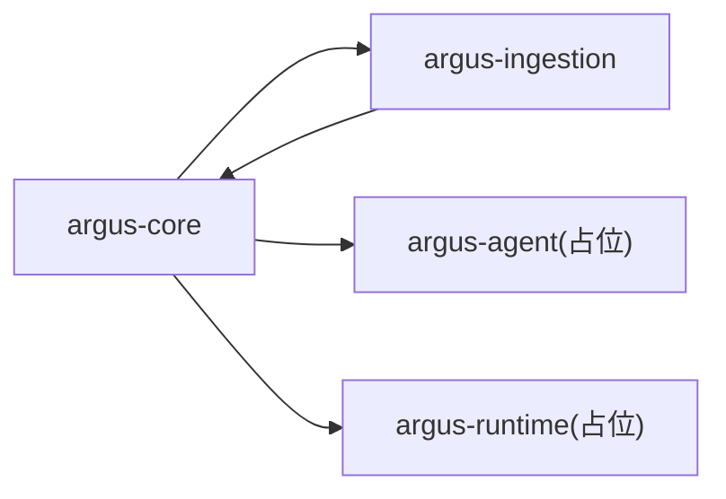

# 复杂业务场景

<cite>
**本文引用的文件**
- [readme.md](file://readme.md)
- [pom.xml](file://pom.xml)
- [Agent.java](file://argus-core/src/main/java/io/argus/core/agent/Agent.java)
- [AgentContext.java](file://argus-core/src/main/java/io/argus/core/agent/AgentContext.java)
- [AgentState.java](file://argus-core/src/main/java/io/argus/core/agent/AgentState.java)
- [Action.java](file://argus-core/src/main/java/io/argus/core/action/Action.java)
- [ActionType.java](file://argus-core/src/main/java/io/argus/core/action/ActionType.java)
- [ActionResult.java](file://argus-core/src/main/java/io/argus/core/action/ActionResult.java)
- [Observation.java](file://argus-core/src/main/java/io/argus/core/observation/Observation.java)
- [ObservationType.java](file://argus-core/src/main/java/io/argus/core/observation/ObservationType.java)
- [Metadata.java](file://argus-core/src/main/java/io/argus/core/model/Metadata.java)
- [Memory.java](file://argus-core/src/main/java/io/argus/core/memory/Memory.java)
- [MemoryEntry.java](file://argus-core/src/main/java/io/argus/core/memory/MemoryEntry.java)
- [MemoryScope.java](file://argus-core/src/main/java/io/argus/core/memory/MemoryScope.java)
- [AuditEvent.java](file://argus-core/src/main/java/io/argus/core/audit/AuditEvent.java)
- [AuditLevel.java](file://argus-core/src/main/java/io/argus/core/audit/AuditLevel.java)
- [AuditLog.java](file://argus-core/src/main/java/io/argus/core/audit/AuditLog.java)
- [Lifecycle.java](file://argus-core/src/main/java/io/argus/core/lifecycle/Lifecycle.java)
- [LifecyclePhase.java](file://argus-core/src/main/java/io/argus/core/lifecycle/LifecyclePhase.java)
- [Stoppable.java](file://argus-core/src/main/java/io/argus/core/lifecycle/Stoppable.java)
- [FetchAction.java](file://argus-ingestion/src/main/java/io/argus/ingestion/fetch/FetchAction.java)
- [FetchProtocol.java](file://argus-ingestion/src/main/java/io/argus/ingestion/fetch/FetchProtocol.java)
- [FetchRequest.java](file://argus-ingestion/src/main/java/io/argus/ingestion/fetch/FetchRequest.java)
- [FetchResult.java](file://argus-ingestion/src/main/java/io/argus/ingestion/fetch/FetchResult.java)
- [Parser.java](file://argus-ingestion/src/main/java/io/argus/ingestion/parse/Parser.java)
- [ContentType.java](file://argus-ingestion/src/main/java/io/argus/ingestion/parse/ContentType.java)
- [ParseInput.java](file://argus-ingestion/src/main/java/io/argus/ingestion/parse/ParseInput.java)
- [ParseResult.java](file://argus-ingestion/src/main/java/io/argus/ingestion/parse/ParseResult.java)
- [FetchPolicy.java](file://argus-ingestion/src/main/java/io/argus/ingestion/policy/FetchPolicy.java)
- [RateLimitPolicy.java](file://argus-ingestion/src/main/java/io/argus/ingestion/policy/RateLimitPolicy.java)
- [RobotPolicy.java](file://argus-ingestion/src/main/java/io/argus/ingestion/policy/RobotPolicy.java)
- [IngestionSource.java](file://argus-ingestion/src/main/java/io/argus/ingestion/source/IngestionSource.java)
- [IngestionMode.java](file://argus-ingestion/src/main/java/io/argus/ingestion/source/IngestionMode.java)
- [IngestionRequest.java](file://argus-ingestion/src/main/java/io/argus/ingestion/source/IngestionRequest.java)
- [IngestionResult.java](file://argus-ingestion/src/main/java/io/argus/ingestion/source/IngestionResult.java)
- [IngestionAuditEvent.java](file://argus-ingestion/src/main/java/io/argus/ingestion/audit/IngestionAuditEvent.java)
- [IngestionAuditType.java](file://argus-ingestion/src/main/java/io/argus/ingestion/audit/IngestionAuditType.java)
- [FetchFailedException.java](file://argus-ingestion/src/main/java/io/argus/ingestion/error/FetchFailedException.java)
- [IngestionException.java](file://argus-ingestion/src/main/java/io/argus/ingestion/error/IngestionException.java)
</cite>

## 目录
1. [引言](#引言)
2. [项目结构](#项目结构)
3. [核心组件](#核心组件)
4. [架构总览](#架构总览)
5. [详细组件分析](#详细组件分析)
6. [依赖分析](#依赖分析)
7. [性能考虑](#性能考虑)
8. [故障排查指南](#故障排查指南)
9. [结论](#结论)
10. [附录](#附录)

## 引言
本文件面向复杂业务场景下的系统设计与实现，围绕Argus框架提供的“可审计、可控制、可复现”的网络知识获取与AI代理能力，给出Web内容爬取与分析代理、智能客服代理、电商价格监控代理、社交媒体监控代理的综合应用方案。文档以模块化视角梳理框架能力，结合接口契约与抽象模型，帮助开发者在真实业务中落地可维护、可观测、可扩展的数据采集与分析流水线。

## 项目结构
Argus采用多模块聚合结构，核心模块职责清晰：
- argus-core：定义代理、动作、观察、记忆、审计、生命周期等基础抽象与契约
- argus-ingestion：提供网络数据获取（抓取、解析、策略）、来源边界与审计事件
- argus-agent：AI代理集成支持（当前仓库中为占位）
- argus-runtime：生产级运行时容器（当前仓库中为占位）

图表来源
- [pom.xml](file://pom.xml#L24-L29)
- [Agent.java](file://argus-core/src/main/java/io/argus/core/agent/Agent.java#L7-L11)
- [Action.java](file://argus-core/src/main/java/io/argus/core/action/Action.java#L37-L43)
- [Observation.java](file://argus-core/src/main/java/io/argus/core/observation/Observation.java#L31-L37)
- [Memory.java](file://argus-core/src/main/java/io/argus/core/memory/Memory.java#L9-L15)
- [AuditEvent.java](file://argus-core/src/main/java/io/argus/core/audit/AuditEvent.java#L9-L60)
- [IngestionSource.java](file://argus-ingestion/src/main/java/io/argus/ingestion/source/IngestionSource.java#L109-L110)
- [FetchAction.java](file://argus-ingestion/src/main/java/io/argus/ingestion/fetch/FetchAction.java#L11-L21)
- [Parser.java](file://argus-ingestion/src/main/java/io/argus/ingestion/parse/Parser.java#L7-L8)
- [FetchPolicy.java](file://argus-ingestion/src/main/java/io/argus/ingestion/policy/FetchPolicy.java#L7-L8)

章节来源
- [readme.md](file://readme.md#L7-L14)
- [pom.xml](file://pom.xml#L24-L29)

## 核心组件
本节聚焦于支撑复杂业务场景的关键抽象与契约，强调“意图-事实”分离、可审计性与可回放性。

- 代理与执行上下文
  - Agent：定义初始状态入口，体现“意图”模型
  - AgentContext：可变执行工作区，承载短期推理缓冲、外部客户端、限流器、指标与日志辅助、非权威记忆访问
  - AgentState：不可变、可回放、可审计的快照，严格区分于上下文

- 动作与观察
  - Action/ActionType/ActionResult：声明式意图表达，由运行时解释执行；元数据承载领域上下文
  - Observation/ObservationType：事实性感知，不可变，不包含决策指令；元数据承载上下文

- 记忆与审计
  - Memory/MemoryEntry/MemoryScope：非权威召回机制，避免将关键状态隐藏在上下文中
  - AuditEvent/AuditLevel/AuditLog：审计事件载体，贯穿Live/Replay/DryRun模式

- 模型与元数据
  - Metadata：不可变键值映射，作为扩展点承载任意上下文属性

章节来源
- [Agent.java](file://argus-core/src/main/java/io/argus/core/agent/Agent.java#L7-L11)
- [AgentContext.java](file://argus-core/src/main/java/io/argus/core/agent/AgentContext.java#L92-L98)
- [Action.java](file://argus-core/src/main/java/io/argus/core/action/Action.java#L37-L43)
- [Observation.java](file://argus-core/src/main/java/io/argus/core/observation/Observation.java#L31-L37)
- [Memory.java](file://argus-core/src/main/java/io/argus/core/memory/Memory.java#L9-L15)
- [AuditEvent.java](file://argus-core/src/main/java/io/argus/core/audit/AuditEvent.java#L9-L60)
- [Metadata.java](file://argus-core/src/main/java/io/argus/core/model/Metadata.java#L12-L34)

## 架构总览
下图展示了从代理到数据摄取、再到审计与回放的整体流程。代理通过动作表达意图，摄取源负责事实性采集并在可审计边界内执行，最终形成可回放的观察与审计记录。

图表来源
- [Agent.java](file://argus-core/src/main/java/io/argus/core/agent/Agent.java#L7-L11)
- [AgentContext.java](file://argus-core/src/main/java/io/argus/core/agent/AgentContext.java#L92-L98)
- [Action.java](file://argus-core/src/main/java/io/argus/core/action/Action.java#L37-L43)
- [IngestionSource.java](file://argus-ingestion/src/main/java/io/argus/ingestion/source/IngestionSource.java#L109-L110)
- [FetchAction.java](file://argus-ingestion/src/main/java/io/argus/ingestion/fetch/FetchAction.java#L11-L21)
- [Parser.java](file://argus-ingestion/src/main/java/io/argus/ingestion/parse/Parser.java#L7-L8)
- [Observation.java](file://argus-core/src/main/java/io/argus/core/observation/Observation.java#L31-L37)
- [AuditEvent.java](file://argus-core/src/main/java/io/argus/core/audit/AuditEvent.java#L9-L60)

## 详细组件分析

### Web内容爬取与分析代理
目标：构建可多页面抓取、数据清洗、结构化存储的代理流水线，满足复杂业务场景下的内容获取与分析需求。

- 架构设计要点
  - 使用FetchAction表达抓取意图，配合FetchProtocol/FetchRequest/FetchResult定义抓取协议与请求响应模型
  - 通过Parser与ContentType/ParseInput/ParseResult完成内容解析与结构化输出
  - 利用IngestionSource作为权威边界，确保事实性采集与可审计性
  - 将抓取与解析结果封装为Observation，供后续推理与存储使用

- 关键流程（抓取-解析-观察）

图表来源
- [FetchAction.java](file://argus-ingestion/src/main/java/io/argus/ingestion/fetch/FetchAction.java#L11-L21)
- [FetchProtocol.java](file://argus-ingestion/src/main/java/io/argus/ingestion/fetch/FetchProtocol.java)
- [FetchRequest.java](file://argus-ingestion/src/main/java/io/argus/ingestion/fetch/FetchRequest.java)
- [FetchResult.java](file://argus-ingestion/src/main/java/io/argus/ingestion/fetch/FetchResult.java)
- [Parser.java](file://argus-ingestion/src/main/java/io/argus/ingestion/parse/Parser.java#L7-L8)
- [ContentType.java](file://argus-ingestion/src/main/java/io/argus/ingestion/parse/ContentType.java)
- [ParseInput.java](file://argus-ingestion/src/main/java/io/argus/ingestion/parse/ParseInput.java)
- [ParseResult.java](file://argus-ingestion/src/main/java/io/argus/ingestion/parse/ParseResult.java)
- [IngestionSource.java](file://argus-ingestion/src/main/java/io/argus/ingestion/source/IngestionSource.java#L109-L110)

- 数据清洗与结构化存储
  - 清洗：在Parser阶段依据ParseInput进行字段抽取、去噪与格式统一
  - 存储：将ParseResult映射为结构化实体，结合Observation与Metadata进行持久化与检索
  - 可扩展：通过Metadata传递清洗规则版本、字段映射配置等上下文

- 性能优化策略
  - 并发抓取：在AgentContext中注入限流器与并发控制器，避免触发目标站点反爬
  - 缓存与去重：利用Memory进行非权威缓存，减少重复抓取；结合IngestionRequest快照保证可回放
  - 分层解析：先粗后精，优先抽取关键字段，再对热点内容做深度解析

- 扩展建议
  - 插件化解析：Parser可扩展为插件，按站点/模板动态加载
  - 失败重试与退避：在FetchPolicy中引入指数退避与最大重试次数
  - 多源聚合：多个IngestionSource并行，统一合并Observation

章节来源
- [FetchAction.java](file://argus-ingestion/src/main/java/io/argus/ingestion/fetch/FetchAction.java#L11-L21)
- [Parser.java](file://argus-ingestion/src/main/java/io/argus/ingestion/parse/Parser.java#L7-L8)
- [IngestionSource.java](file://argus-ingestion/src/main/java/io/argus/ingestion/source/IngestionSource.java#L109-L110)
- [AgentContext.java](file://argus-core/src/main/java/io/argus/core/agent/AgentContext.java#L92-L98)
- [FetchPolicy.java](file://argus-ingestion/src/main/java/io/argus/ingestion/policy/FetchPolicy.java#L7-L8)
- [RateLimitPolicy.java](file://argus-ingestion/src/main/java/io/argus/ingestion/policy/RateLimitPolicy.java)
- [RobotPolicy.java](file://argus-ingestion/src/main/java/io/argus/ingestion/policy/RobotPolicy.java)

### 智能客服代理
目标：结合自然语言处理与知识库查询，实现智能客服代理，支持意图识别、FAQ匹配与上下文对话管理。

- 架构设计要点
  - 代理通过Action表达“查询知识库/生成回复”等意图
  - 使用Observation承载用户输入、检索结果、回复候选等事实
  - AgentContext中注入外部NLP服务客户端与知识库检索器
  - AuditEvent记录交互过程，便于合规审计与质量评估

- 关键流程（意图-检索-回复-观察）

图表来源
- [Agent.java](file://argus-core/src/main/java/io/argus/core/agent/Agent.java#L7-L11)
- [AgentContext.java](file://argus-core/src/main/java/io/argus/core/agent/AgentContext.java#L92-L98)
- [Action.java](file://argus-core/src/main/java/io/argus/core/action/Action.java#L37-L43)
- [Observation.java](file://argus-core/src/main/java/io/argus/core/observation/Observation.java#L31-L37)
- [AuditEvent.java](file://argus-core/src/main/java/io/argus/core/audit/AuditEvent.java#L9-L60)

- NLP与知识库集成
  - 将NLP服务与检索器封装在AgentContext中，避免污染AgentState
  - 使用Metadata传递会话ID、意图标签、置信度阈值等上下文

- 性能优化策略
  - 上下文压缩：仅保留关键历史，避免无限增长
  - 缓存检索结果：对高频问题进行非权威缓存
  - 异步处理：将耗时的NLP调用异步化，提升吞吐

- 扩展建议
  - 多轮对话：引入对话状态机，结合Memory实现跨轮次上下文
  - 多模态：扩展Observation类型以支持图片/语音输入
  - A/B测试：通过Metadata标注实验组别，审计对比效果

章节来源
- [AgentContext.java](file://argus-core/src/main/java/io/argus/core/agent/AgentContext.java#L92-L98)
- [Action.java](file://argus-core/src/main/java/io/argus/core/action/Action.java#L37-L43)
- [Observation.java](file://argus-core/src/main/java/io/argus/core/observation/Observation.java#L31-L37)
- [AuditEvent.java](file://argus-core/src/main/java/io/argus/core/audit/AuditEvent.java#L9-L60)

### 电商价格监控代理
目标：定时抓取商品信息并进行价格变化分析，支持预警与趋势报告。

- 架构设计要点
  - 使用定时调度触发抓取任务，每次任务对应一次IngestionRequest
  - 抓取结果经Parser解析为价格、库存、评分等结构化字段
  - 通过Observation记录“价格变更事实”，结合历史数据进行对比分析

- 关键流程（定时-抓取-解析-比较-观察）

图表来源
- [IngestionSource.java](file://argus-ingestion/src/main/java/io/argus/ingestion/source/IngestionSource.java#L109-L110)
- [FetchAction.java](file://argus-ingestion/src/main/java/io/argus/ingestion/fetch/FetchAction.java#L11-L21)
- [Parser.java](file://argus-ingestion/src/main/java/io/argus/ingestion/parse/Parser.java#L7-L8)
- [Observation.java](file://argus-core/src/main/java/io/argus/core/observation/Observation.java#L31-L37)
- [AuditEvent.java](file://argus-core/src/main/java/io/argus/core/audit/AuditEvent.java#L9-L60)

- 价格变化分析
  - 使用Memory存储历史价格序列，结合Metadata记录时间戳与来源
  - 对比策略：绝对阈值、相对阈值、趋势回归等，通过Action元数据配置

- 性能优化策略
  - 批量抓取：合并同类商品请求，降低网络开销
  - 增量更新：仅对价格变动的商品发出告警
  - 并发限流：避免对目标站点造成压力

- 扩展建议
  - 多站点聚合：统一解析模板，跨站点对比
  - 预测与预警：引入简单的时间序列模型，预测未来价格走势
  - 报表自动化：将Observation转化为报告，定期发送

章节来源
- [FetchAction.java](file://argus-ingestion/src/main/java/io/argus/ingestion/fetch/FetchAction.java#L11-L21)
- [Parser.java](file://argus-ingestion/src/main/java/io/argus/ingestion/parse/Parser.java#L7-L8)
- [Observation.java](file://argus-core/src/main/java/io/argus/core/observation/Observation.java#L31-L37)
- [Memory.java](file://argus-core/src/main/java/io/argus/core/memory/Memory.java#L9-L15)

### 社交媒体监控代理
目标：跟踪关键词并生成分析报告，支持舆情监测与趋势分析。

- 架构设计要点
  - 代理周期性地生成“关键词搜索”动作，提交给IngestionSource
  - 解析阶段抽取发布时间、作者、正文、情感倾向等字段
  - 通过Observation记录“关键词命中事实”，结合时间窗口统计趋势

- 关键流程（关键词-抓取-解析-统计-报告）

图表来源
- [Action.java](file://argus-core/src/main/java/io/argus/core/action/Action.java#L37-L43)
- [IngestionSource.java](file://argus-ingestion/src/main/java/io/argus/ingestion/source/IngestionSource.java#L109-L110)
- [Parser.java](file://argus-ingestion/src/main/java/io/argus/ingestion/parse/Parser.java#L7-L8)
- [Observation.java](file://argus-core/src/main/java/io/argus/core/observation/Observation.java#L31-L37)

- 关键词与情感分析
  - 使用Metadata传递关键词列表、时间范围、地域过滤等条件
  - 结合外部情感分析服务，将结果封装为Observation

- 性能优化策略
  - 限流与退避：遵循平台速率限制，避免封禁
  - 增量扫描：仅扫描新增内容，避免重复处理
  - 分片并行：按关键词或地域分片，提升吞吐

- 扩展建议
  - 多平台适配：统一抽象不同平台的抓取与解析差异
  - 实时告警：对突发热点设置阈值告警
  - 可视化仪表盘：将Observation转化为可视化指标

章节来源
- [Action.java](file://argus-core/src/main/java/io/argus/core/action/Action.java#L37-L43)
- [IngestionSource.java](file://argus-ingestion/src/main/java/io/argus/ingestion/source/IngestionSource.java#L109-L110)
- [Parser.java](file://argus-ingestion/src/main/java/io/argus/ingestion/parse/Parser.java#L7-L8)
- [Observation.java](file://argus-core/src/main/java/io/argus/core/observation/Observation.java#L31-L37)

## 依赖分析
模块间依赖关系清晰，核心模块提供抽象契约，摄取模块在边界内实现事实性采集与解析。

图表来源
- [pom.xml](file://pom.xml#L24-L29)

章节来源
- [pom.xml](file://pom.xml#L24-L29)

## 性能考虑
- 并发与限流
  - 在AgentContext中注入限流器与并发控制器，避免触发目标站点反爬
  - 使用RateLimitPolicy与RobotPolicy约束抓取节奏与合规性

- 缓存与去重
  - 利用Memory进行非权威缓存，减少重复抓取
  - IngestionRequest快照确保可回放，避免隐式状态

- 解析与序列化
  - Parser按需解析，优先抽取关键字段，热点内容再做深度解析
  - 使用Metadata传递配置与版本信息，便于灰度与回滚

- 审计与可观测性
  - AuditEvent贯穿所有步骤，支持Live/Replay/DryRun模式
  - 结合Observation与Memory，形成可追溯的证据链

章节来源
- [AgentContext.java](file://argus-core/src/main/java/io/argus/core/agent/AgentContext.java#L92-L98)
- [FetchPolicy.java](file://argus-ingestion/src/main/java/io/argus/ingestion/policy/FetchPolicy.java#L7-L8)
- [RateLimitPolicy.java](file://argus-ingestion/src/main/java/io/argus/ingestion/policy/RateLimitPolicy.java)
- [RobotPolicy.java](file://argus-ingestion/src/main/java/io/argus/ingestion/policy/RobotPolicy.java)
- [AuditEvent.java](file://argus-core/src/main/java/io/argus/core/audit/AuditEvent.java#L9-L60)
- [Memory.java](file://argus-core/src/main/java/io/argus/core/memory/Memory.java#L9-L15)

## 故障排查指南
- 抓取失败
  - 使用FetchFailedException定位网络/协议错误
  - 通过IngestionAuditEvent记录失败原因与重试策略

- 解析异常
  - 使用IngestionException标识解析失败
  - 检查ContentType与ParseInput是否匹配目标页面结构

- 回放不一致
  - 确认IngestionSource严格遵守Replay语义，不访问外部世界
  - 校验IngestionRequest快照完整性与唯一性

- 审计缺失
  - 确保所有外部副作用均通过AuditEvent记录
  - 检查AgentState与AgentContext职责分离，避免隐藏状态

章节来源
- [FetchFailedException.java](file://argus-ingestion/src/main/java/io/argus/ingestion/error/FetchFailedException.java)
- [IngestionException.java](file://argus-ingestion/src/main/java/io/argus/ingestion/error/IngestionException.java)
- [IngestionAuditEvent.java](file://argus-ingestion/src/main/java/io/argus/ingestion/audit/IngestionAuditEvent.java)
- [IngestionAuditType.java](file://argus-ingestion/src/main/java/io/argus/ingestion/audit/IngestionAuditType.java)
- [IngestionSource.java](file://argus-ingestion/src/main/java/io/argus/ingestion/source/IngestionSource.java#L109-L110)

## 结论
Argus框架通过“意图-事实”分离与可审计边界，为复杂业务场景提供了稳健的基础设施。结合代理、动作、观察、记忆与审计等核心抽象，开发者可以快速构建可扩展、可维护、可复现的数据采集与分析系统。针对Web内容爬取、智能客服、电商价格监控与社交媒体监控等典型场景，框架既保证了工程落地的灵活性，也兼顾了合规与性能要求。

## 附录
- 快速开始
  - 编译打包：使用Maven命令进行编译与打包
- 设计原则
  - 可审计、可控制、可复现

章节来源
- [readme.md](file://readme.md#L16-L28)
- [pom.xml](file://pom.xml#L19-L21)