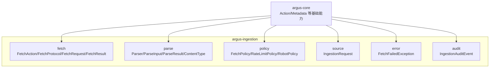
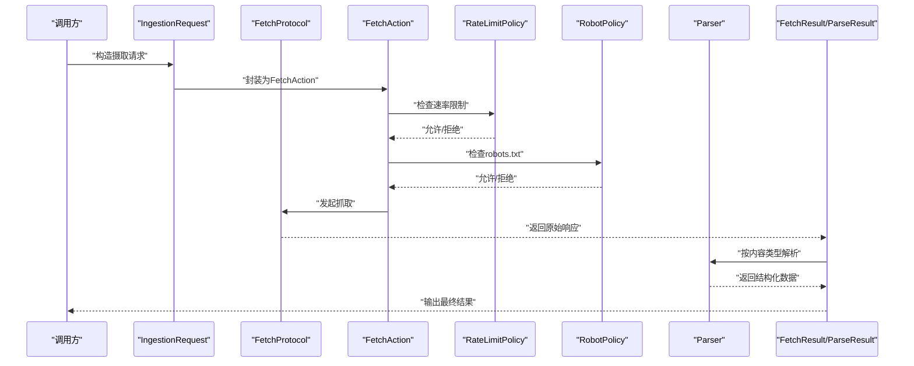
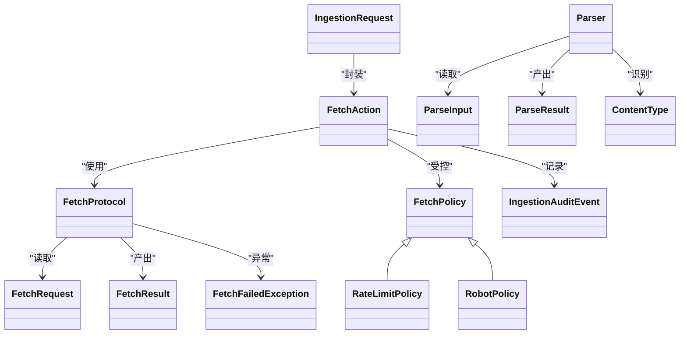
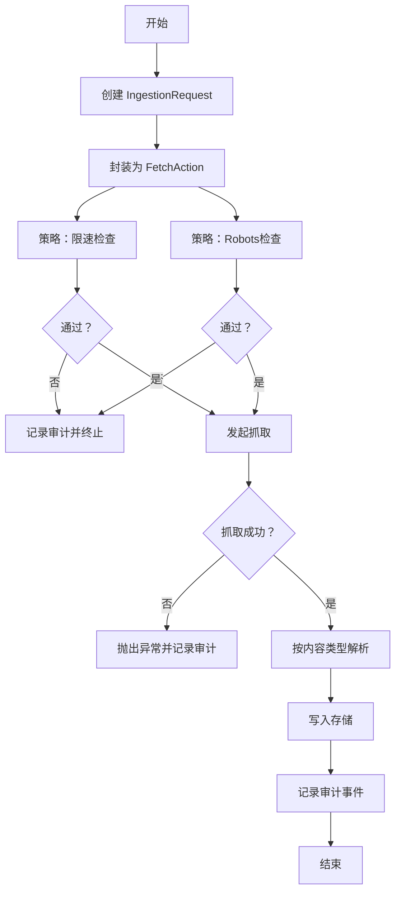

# 数据获取示例

<cite>
**本文引用的文件**
- [readme.md](file://readme.md)
- [FetchAction.java](file://argus-ingestion/src/main/java/io/argus/ingestion/fetch/FetchAction.java)
- [FetchProtocol.java](file://argus-ingestion/src/main/java/io/argus/ingestion/fetch/FetchProtocol.java)
- [FetchRequest.java](file://argus-ingestion/src/main/java/io/argus/ingestion/fetch/FetchRequest.java)
- [FetchResult.java](file://argus-ingestion/src/main/java/io/argus/ingestion/fetch/FetchResult.java)
- [Parser.java](file://argus-ingestion/src/main/java/io/argus/ingestion/parse/Parser.java)
- [ParseInput.java](file://argus-ingestion/src/main/java/io/argus/ingestion/parse/ParseInput.java)
- [ParseResult.java](file://argus-ingestion/src/main/java/io/argus/ingestion/parse/ParseResult.java)
- [ContentType.java](file://argus-ingestion/src/main/java/io/argus/ingestion/parse/ContentType.java)
- [FetchPolicy.java](file://argus-ingestion/src/main/java/io/argus/ingestion/policy/FetchPolicy.java)
- [RateLimitPolicy.java](file://argus-ingestion/src/main/java/io/argus/ingestion/policy/RateLimitPolicy.java)
- [RobotPolicy.java](file://argus-ingestion/src/main/java/io/argus/ingestion/policy/RobotPolicy.java)
- [IngestionRequest.java](file://argus-ingestion/src/main/java/io/argus/ingestion/source/IngestionRequest.java)
- [FetchFailedException.java](file://argus-ingestion/src/main/java/io/argus/ingestion/error/FetchFailedException.java)
- [IngestionAuditEvent.java](file://argus-ingestion/src/main/java/io/argus/ingestion/audit/IngestionAuditEvent.java)
</cite>

## 目录
1. [简介](#简介)
2. [项目结构](#项目结构)
3. [核心组件](#核心组件)
4. [架构总览](#架构总览)
5. [详细组件分析](#详细组件分析)
6. [依赖关系分析](#依赖关系分析)
7. [性能与策略建议](#性能与策略建议)
8. [故障排查指南](#故障排查指南)
9. [结论](#结论)
10. [附录：完整数据获取流水线示例](#附录完整数据获取流水线示例)

## 简介
本文件面向需要在Argus运行时中实现“网页内容抓取、解析与存储”的开发者，提供从请求发起到数据入库的端到端示例思路与最佳实践。Argus以“可审计、可控制、可复现”为设计原则，围绕“获取(Fetch)、解析(Parse)、策略(Policy)”三大模块构建数据摄取流水线。

## 项目结构
Argus采用多模块组织，其中与数据获取直接相关的是 argus-ingestion 模块，包含 Fetch、Parse、Policy、Source、Error、Audit 等子包，分别对应请求动作、协议与结果、输入输出、内容类型、策略控制、来源建模、异常与审计等职责。

图示来源
- [readme.md](file://readme.md#L7-L14)

章节来源
- [readme.md](file://readme.md#L1-L28)

## 核心组件
- 获取层（Fetch）
  - FetchAction：表示一次“抓取”动作，承载动作类型与元数据接口
  - FetchProtocol：抓取协议抽象
  - FetchRequest：抓取请求载体
  - FetchResult：抓取结果载体
- 解析层（Parse）
  - Parser：解析器抽象
  - ParseInput：解析输入
  - ParseResult：解析结果
  - ContentType：内容类型枚举或工具
- 策略层（Policy）
  - FetchPolicy：抓取策略基类
  - RateLimitPolicy：速率限制策略
  - RobotPolicy：Robots协议策略
- 来源层（Source）
  - IngestionRequest：摄取请求模型
- 错误与审计
  - FetchFailedException：抓取失败异常
  - IngestionAuditEvent：摄取审计事件

章节来源
- [FetchAction.java](file://argus-ingestion/src/main/java/io/argus/ingestion/fetch/FetchAction.java#L11-L21)
- [FetchProtocol.java](file://argus-ingestion/src/main/java/io/argus/ingestion/fetch/FetchProtocol.java#L7-L8)
- [FetchRequest.java](file://argus-ingestion/src/main/java/io/argus/ingestion/fetch/FetchRequest.java#L7-L8)
- [FetchResult.java](file://argus-ingestion/src/main/java/io/argus/ingestion/fetch/FetchResult.java#L7-L8)
- [Parser.java](file://argus-ingestion/src/main/java/io/argus/ingestion/parse/Parser.java#L7-L8)
- [ParseInput.java](file://argus-ingestion/src/main/java/io/argus/ingestion/parse/ParseInput.java#L7-L8)
- [ParseResult.java](file://argus-ingestion/src/main/java/io/argus/ingestion/parse/ParseResult.java#L7-L8)
- [ContentType.java](file://argus-ingestion/src/main/java/io/argus/ingestion/parse/ContentType.java#L7-L8)
- [FetchPolicy.java](file://argus-ingestion/src/main/java/io/argus/ingestion/policy/FetchPolicy.java#L7-L8)
- [RateLimitPolicy.java](file://argus-ingestion/src/main/java/io/argus/ingestion/policy/RateLimitPolicy.java#L7-L8)
- [RobotPolicy.java](file://argus-ingestion/src/main/java/io/argus/ingestion/policy/RobotPolicy.java#L7-L8)
- [IngestionRequest.java](file://argus-ingestion/src/main/java/io/argus/ingestion/source/IngestionRequest.java#L7-L8)
- [FetchFailedException.java](file://argus-ingestion/src/main/java/io/argus/ingestion/error/FetchFailedException.java#L7-L8)
- [IngestionAuditEvent.java](file://argus-ingestion/src/main/java/io/argus/ingestion/audit/IngestionAuditEvent.java#L7-L8)

## 架构总览
下图展示了从“请求建模”到“策略执行”再到“抓取与解析”的整体流程，以及异常与审计贯穿始终的可审计性保障。

图示来源
- [IngestionRequest.java](file://argus-ingestion/src/main/java/io/argus/ingestion/source/IngestionRequest.java#L7-L8)
- [FetchAction.java](file://argus-ingestion/src/main/java/io/argus/ingestion/fetch/FetchAction.java#L11-L21)
- [FetchProtocol.java](file://argus-ingestion/src/main/java/io/argus/ingestion/fetch/FetchProtocol.java#L7-L8)
- [RateLimitPolicy.java](file://argus-ingestion/src/main/java/io/argus/ingestion/policy/RateLimitPolicy.java#L7-L8)
- [RobotPolicy.java](file://argus-ingestion/src/main/java/io/argus/ingestion/policy/RobotPolicy.java#L7-L8)
- [Parser.java](file://argus-ingestion/src/main/java/io/argus/ingestion/parse/Parser.java#L7-L8)
- [FetchResult.java](file://argus-ingestion/src/main/java/io/argus/ingestion/fetch/FetchResult.java#L7-L8)
- [ParseResult.java](file://argus-ingestion/src/main/java/io/argus/ingestion/parse/ParseResult.java#L7-L8)

## 详细组件分析

### 组件一：FetchAction（抓取动作）
- 职责：作为一次“抓取”的动作实体，提供动作类型与元数据接口，便于统一调度与审计。
- 关键点：
  - 动作类型由外部上下文决定，此处留空便于扩展
  - 元数据用于记录抓取上下文信息，便于审计与追踪

章节来源
- [FetchAction.java](file://argus-ingestion/src/main/java/io/argus/ingestion/fetch/FetchAction.java#L11-L21)

### 组件二：FetchProtocol（抓取协议）
- 职责：抽象抓取协议，屏蔽底层HTTP/FTP等差异，统一对外提供“发起抓取”的能力。
- 关键点：
  - 与 FetchRequest/FetchResult 配合，形成请求-响应闭环
  - 可结合策略层进行限速与robots校验

章节来源
- [FetchProtocol.java](file://argus-ingestion/src/main/java/io/argus/ingestion/fetch/FetchProtocol.java#L7-L8)
- [FetchRequest.java](file://argus-ingestion/src/main/java/io/argus/ingestion/fetch/FetchRequest.java#L7-L8)
- [FetchResult.java](file://argus-ingestion/src/main/java/io/argus/ingestion/fetch/FetchResult.java#L7-L8)

### 组件三：Parser（解析器）
- 职责：根据内容类型对原始响应进行解析，输出结构化数据。
- 关键点：
  - ParseInput/ParseResult 提供输入输出契约
  - ContentType 用于识别响应类型，驱动不同的解析分支

章节来源
- [Parser.java](file://argus-ingestion/src/main/java/io/argus/ingestion/parse/Parser.java#L7-L8)
- [ParseInput.java](file://argus-ingestion/src/main/java/io/argus/ingestion/parse/ParseInput.java#L7-L8)
- [ParseResult.java](file://argus-ingestion/src/main/java/io/argus/ingestion/parse/ParseResult.java#L7-L8)
- [ContentType.java](file://argus-ingestion/src/main/java/io/argus/ingestion/parse/ContentType.java#L7-L8)

### 组件四：策略（FetchPolicy/RateLimitPolicy/RobotPolicy）
- 职责：控制抓取行为，确保合规与稳定
  - FetchPolicy：策略基类
  - RateLimitPolicy：限速控制（如每秒请求数、并发数）
  - RobotPolicy：遵循 robots.txt 规则
- 关键点：
  - 在 FetchAction 执行前进行预检
  - 失败时抛出 FetchFailedException 或触发审计事件

章节来源
- [FetchPolicy.java](file://argus-ingestion/src/main/java/io/argus/ingestion/policy/FetchPolicy.java#L7-L8)
- [RateLimitPolicy.java](file://argus-ingestion/src/main/java/io/argus/ingestion/policy/RateLimitPolicy.java#L7-L8)
- [RobotPolicy.java](file://argus-ingestion/src/main/java/io/argus/ingestion/policy/RobotPolicy.java#L7-L8)
- [FetchFailedException.java](file://argus-ingestion/src/main/java/io/argus/ingestion/error/FetchFailedException.java#L7-L8)

### 组件五：来源与审计（IngestionRequest/Audit）
- 职责：
  - IngestionRequest：描述一次摄取任务的输入与上下文
  - IngestionAuditEvent：记录抓取过程中的关键事件，满足可审计性
- 关键点：
  - 审计事件应包含时间戳、来源、状态、错误码等字段
  - 与 FetchAction 的元数据配合，形成可追溯链路

章节来源
- [IngestionRequest.java](file://argus-ingestion/src/main/java/io/argus/ingestion/source/IngestionRequest.java#L7-L8)
- [IngestionAuditEvent.java](file://argus-ingestion/src/main/java/io/argus/ingestion/audit/IngestionAuditEvent.java#L7-L8)

## 依赖关系分析
- 组件耦合
  - FetchAction 依赖于 FetchProtocol、FetchPolicy
  - Parser 依赖于 ContentType、ParseInput/ParseResult
  - 策略层独立于具体抓取实现，便于替换与组合
- 可能的循环依赖
  - 当前各组件均为简单类，未见循环依赖迹象
- 外部依赖
  - 通过 argus-core 的 Action/Metadata 接口与模型进行解耦

图示来源
- [FetchAction.java](file://argus-ingestion/src/main/java/io/argus/ingestion/fetch/FetchAction.java#L11-L21)
- [FetchProtocol.java](file://argus-ingestion/src/main/java/io/argus/ingestion/fetch/FetchProtocol.java#L7-L8)
- [FetchRequest.java](file://argus-ingestion/src/main/java/io/argus/ingestion/fetch/FetchRequest.java#L7-L8)
- [FetchResult.java](file://argus-ingestion/src/main/java/io/argus/ingestion/fetch/FetchResult.java#L7-L8)
- [Parser.java](file://argus-ingestion/src/main/java/io/argus/ingestion/parse/Parser.java#L7-L8)
- [ParseInput.java](file://argus-ingestion/src/main/java/io/argus/ingestion/parse/ParseInput.java#L7-L8)
- [ParseResult.java](file://argus-ingestion/src/main/java/io/argus/ingestion/parse/ParseResult.java#L7-L8)
- [ContentType.java](file://argus-ingestion/src/main/java/io/argus/ingestion/parse/ContentType.java#L7-L8)
- [FetchPolicy.java](file://argus-ingestion/src/main/java/io/argus/ingestion/policy/FetchPolicy.java#L7-L8)
- [RateLimitPolicy.java](file://argus-ingestion/src/main/java/io/argus/ingestion/policy/RateLimitPolicy.java#L7-L8)
- [RobotPolicy.java](file://argus-ingestion/src/main/java/io/argus/ingestion/policy/RobotPolicy.java#L7-L8)
- [IngestionRequest.java](file://argus-ingestion/src/main/java/io/argus/ingestion/source/IngestionRequest.java#L7-L8)
- [FetchFailedException.java](file://argus-ingestion/src/main/java/io/argus/ingestion/error/FetchFailedException.java#L7-L8)
- [IngestionAuditEvent.java](file://argus-ingestion/src/main/java/io/argus/ingestion/audit/IngestionAuditEvent.java#L7-L8)

## 性能与策略建议
- 限速控制（RateLimitPolicy）
  - 建议设置“每域名每秒请求数上限”和“并发连接数上限”，避免触发目标站点的限流或封禁
  - 可结合指数退避与随机抖动降低同时性
- 机器人协议（RobotPolicy）
  - 在抓取前主动读取并解析 robots.txt，严格遵守Disallow规则
  - 对未知规则采取保守策略，默认拒绝
- 重试机制
  - 对瞬时性错误（超时、5xx）启用有限次重试，避免对下游造成压力
  - 区分可重试与不可重试错误（如404、403），避免无效重试
- 内容解析优化
  - 根据 ContentType 选择合适的解析器，避免全量解析
  - 对大体积响应采用流式解析或分段处理

## 故障排查指南
- 常见错误与定位
  - 抓取失败：检查 FetchFailedException 的原因分类（网络、协议、权限、超时等）
  - 解析异常：核对 ParseInput 的内容类型与目标解析器是否匹配
  - 限流/封禁：查看审计事件中是否有速率限制触发记录
- 建议排查步骤
  - 启用细粒度日志与审计事件
  - 复现最小样例，逐步缩小范围
  - 对比 robots.txt 与实际抓取路径
- 异常与审计
  - 使用 IngestionAuditEvent 记录关键节点（开始、结束、重试、失败）
  - 将 FetchFailedException 的堆栈与审计ID关联，便于回溯

章节来源
- [FetchFailedException.java](file://argus-ingestion/src/main/java/io/argus/ingestion/error/FetchFailedException.java#L7-L8)
- [IngestionAuditEvent.java](file://argus-ingestion/src/main/java/io/argus/ingestion/audit/IngestionAuditEvent.java#L7-L8)

## 结论
Argus 的数据获取模块以清晰的分层与可插拔的策略为核心，既保证了抓取行为的可控与合规，又为后续解析与存储提供了稳定的输入。通过合理配置策略、完善异常与审计，可构建高可靠、可复现的知识摄取流水线。

## 附录：完整数据获取流水线示例
以下为从“请求建模”到“数据入库”的端到端示例流程，帮助快速落地：

- 步骤1：定义摄取请求
  - 使用 IngestionRequest 描述来源URL、目标内容类型、优先级等
- 步骤2：封装为抓取动作
  - 将 IngestionRequest 封装为 FetchAction，注入元数据（如来源ID、批次号）
- 步骤3：策略预检
  - RateLimitPolicy：检查当前窗口内的请求数与并发
  - RobotPolicy：读取并校验 robots.txt
  - 若任一策略拒绝，记录审计事件并终止
- 步骤4：发起抓取
  - 通过 FetchProtocol 发起请求，得到原始响应
  - 若发生网络/协议错误，抛出 FetchFailedException 并记录审计
- 步骤5：内容解析
  - 根据 ContentType 选择 Parser
  - 输入 ParseInput，输出 ParseResult
- 步骤6：结果归档
  - 将 ParseResult 写入目标存储（数据库/对象存储/消息队列）
  - 记录 IngestionAuditEvent，包含成功/失败、耗时、大小等指标

图示来源
- [IngestionRequest.java](file://argus-ingestion/src/main/java/io/argus/ingestion/source/IngestionRequest.java#L7-L8)
- [FetchAction.java](file://argus-ingestion/src/main/java/io/argus/ingestion/fetch/FetchAction.java#L11-L21)
- [RateLimitPolicy.java](file://argus-ingestion/src/main/java/io/argus/ingestion/policy/RateLimitPolicy.java#L7-L8)
- [RobotPolicy.java](file://argus-ingestion/src/main/java/io/argus/ingestion/policy/RobotPolicy.java#L7-L8)
- [FetchProtocol.java](file://argus-ingestion/src/main/java/io/argus/ingestion/fetch/FetchProtocol.java#L7-L8)
- [FetchFailedException.java](file://argus-ingestion/src/main/java/io/argus/ingestion/error/FetchFailedException.java#L7-L8)
- [ContentType.java](file://argus-ingestion/src/main/java/io/argus/ingestion/parse/ContentType.java#L7-L8)
- [Parser.java](file://argus-ingestion/src/main/java/io/argus/ingestion/parse/Parser.java#L7-L8)
- [IngestionAuditEvent.java](file://argus-ingestion/src/main/java/io/argus/ingestion/audit/IngestionAuditEvent.java#L7-L8)