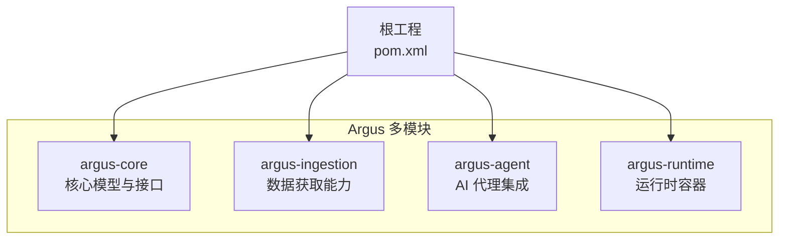
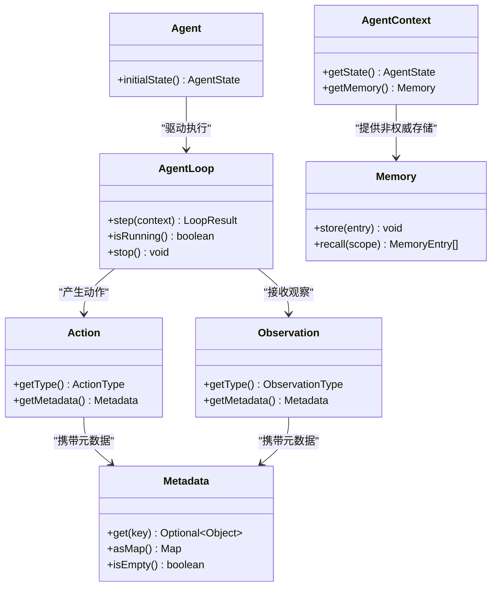
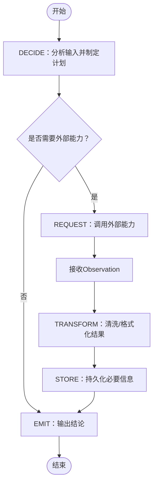
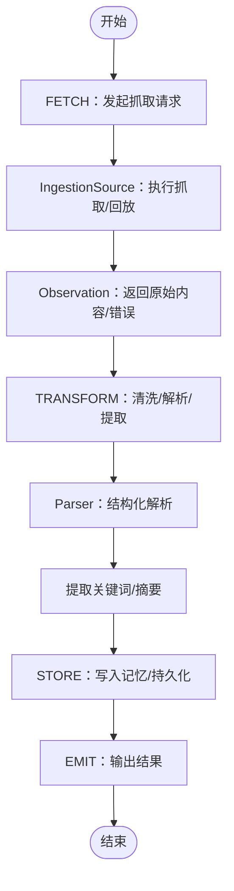
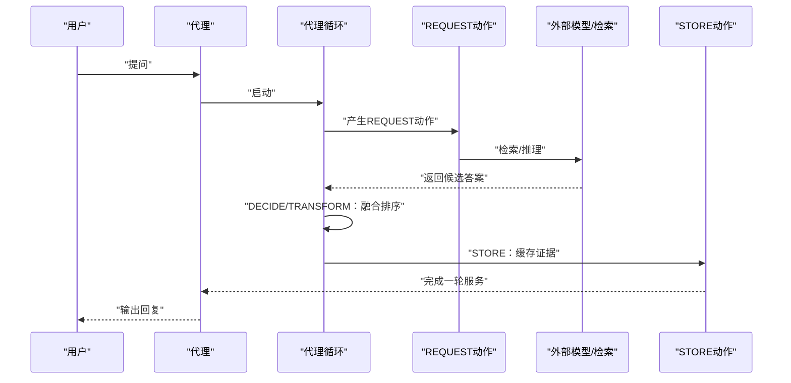
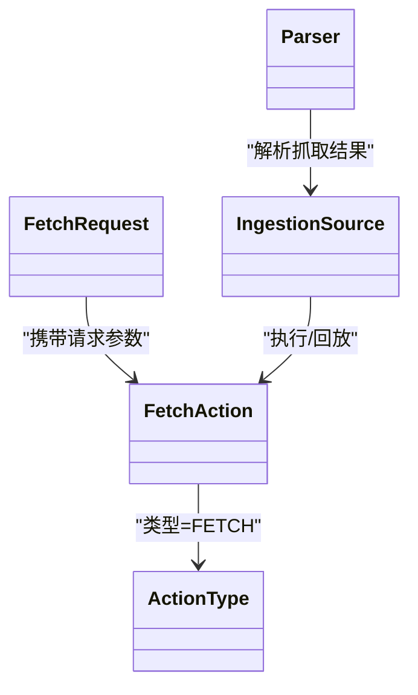
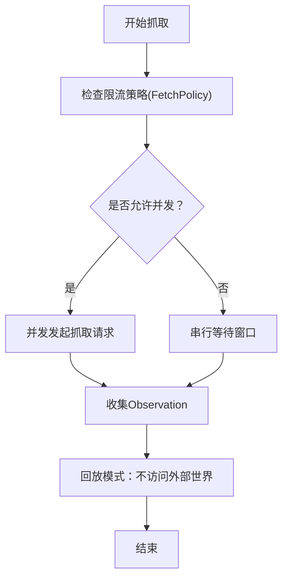
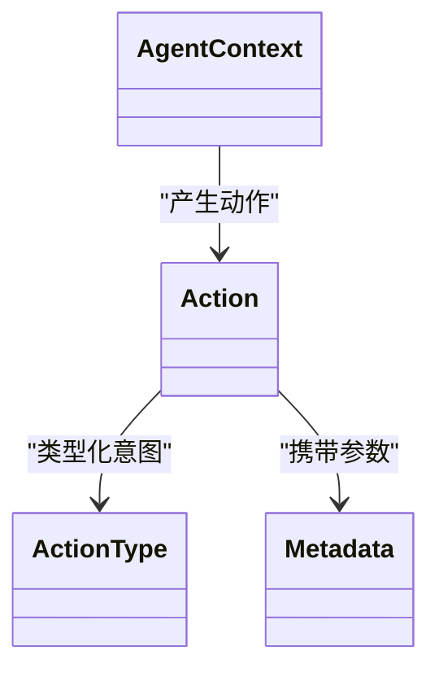
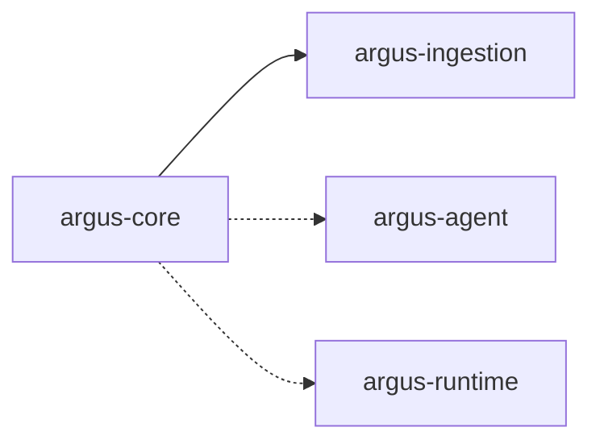

# 示例案例

<cite>
**本文引用的文件**
- [readme.md](file://readme.md)
- [pom.xml](file://pom.xml)
- [Agent.java](file://argus-core/src/main/java/io/argus/core/agent/Agent.java)
- [AgentContext.java](file://argus-core/src/main/java/io/argus/core/agent/AgentContext.java)
- [AgentLoop.java](file://argus-core/src/main/java/io/argus/core/agent/AgentLoop.java)
- [Action.java](file://argus-core/src/main/java/io/argus/core/action/Action.java)
- [ActionType.java](file://argus-core/src/main/java/io/argus/core/action/ActionType.java)
- [Observation.java](file://argus-core/src/main/java/io/argus/core/observation/Observation.java)
- [Metadata.java](file://argus-core/src/main/java/io/argus/core/model/Metadata.java)
- [Memory.java](file://argus-core/src/main/java/io/argus/core/memory/Memory.java)
- [FetchAction.java](file://argus-ingestion/src/main/java/io/argus/ingestion/fetch/FetchAction.java)
- [FetchRequest.java](file://argus-ingestion/src/main/java/io/argus/ingestion/fetch/FetchRequest.java)
- [IngestionSource.java](file://argus-ingestion/src/main/java/io/argus/ingestion/source/IngestionSource.java)
- [Parser.java](file://argus-ingestion/src/main/java/io/argus/ingestion/parse/Parser.java)
- [FetchPolicy.java](file://argus-ingestion/src/main/java/io/argus/ingestion/policy/FetchPolicy.java)
</cite>

## 目录
1. 引言
2. 项目结构
3. 核心组件
4. 架构总览
5. 详细组件分析
6. 依赖分析
7. 性能考虑
8. 故障排查指南
9. 结论
10. 附录

## 引言
本文件围绕 Argus 框架提供系统化的示例案例与实践指南，目标是帮助读者快速上手并掌握从基础代理到复杂业务场景的构建方法。Argus 的设计强调“可审计、可控制、可复现”，其核心围绕代理（Agent）、动作（Action）、观察（Observation）、记忆（Memory）与数据获取（Ingestion）五大要素展开。本文将结合框架提供的接口与模块，给出可直接落地的示例思路与扩展建议，并以图示方式呈现关键流程。

## 项目结构
Argus 采用多模块聚合工程组织，核心模块包括：
- argus-core：定义代理、动作、观察、记忆、元数据等基础模型与生命周期接口
- argus-ingestion：提供网络数据获取（抓取、解析、策略）能力
- argus-agent：面向 AI 代理的集成支持（预留）
- argus-runtime：生产级运行时容器（预留）



图表来源
- [pom.xml](file://pom.xml#L24-L29)

章节来源
- [readme.md](file://readme.md#L7-L14)
- [pom.xml](file://pom.xml#L1-L40)

## 核心组件
本节聚焦于框架中最关键的抽象与职责边界，帮助读者建立统一的认知模型。

- 代理（Agent）：定义初始状态入口，作为执行的起点
- 代理上下文（AgentContext）：可变的执行工作区，承载短期推理缓冲、外部客户端、限流器、指标与日志等；严禁存放权威状态
- 代理循环（AgentLoop）：定义单步决策循环，确保每一步可审计、可观测、可回放
- 动作（Action）：代理意图的声明式表达，通过动作类型（ActionType）划分语义类别
- 观察（Observation）：对外部事实或内部状态变化的不可变记录，不包含决策指令
- 元数据（Metadata）：键值对形式的附加信息载体
- 记忆（Memory）：非权威召回与存储的接口契约



图表来源
- [Agent.java](file://argus-core/src/main/java/io/argus/core/agent/Agent.java#L7-L11)
- [AgentContext.java](file://argus-core/src/main/java/io/argus/core/agent/AgentContext.java#L92-L98)
- [AgentLoop.java](file://argus-core/src/main/java/io/argus/core/agent/AgentLoop.java#L49-L118)
- [Action.java](file://argus-core/src/main/java/io/argus/core/action/Action.java#L37-L43)
- [Observation.java](file://argus-core/src/main/java/io/argus/core/observation/Observation.java#L31-L37)
- [Metadata.java](file://argus-core/src/main/java/io/argus/core/model/Metadata.java#L12-L34)
- [Memory.java](file://argus-core/src/main/java/io/argus/core/memory/Memory.java#L9-L15)

章节来源
- [Agent.java](file://argus-core/src/main/java/io/argus/core/agent/Agent.java#L1-L11)
- [AgentContext.java](file://argus-core/src/main/java/io/argus/core/agent/AgentContext.java#L1-L98)
- [AgentLoop.java](file://argus-core/src/main/java/io/argus/core/agent/AgentLoop.java#L1-L118)
- [Action.java](file://argus-core/src/main/java/io/argus/core/action/Action.java#L1-L43)
- [Observation.java](file://argus-core/src/main/java/io/argus/core/observation/Observation.java#L1-L37)
- [Metadata.java](file://argus-core/src/main/java/io/argus/core/model/Metadata.java#L1-L34)
- [Memory.java](file://argus-core/src/main/java/io/argus/core/memory/Memory.java#L1-L15)

## 架构总览
Argus 将“意图”“执行”“观察”“回放”四个维度解耦：
- 意图（Action）：由代理循环在每一步产出，类型化且与技术实现解耦
- 执行（Runtime/Ingestion）：由运行时解释动作并调用具体能力（如抓取、解析、存储）
- 观察（Observation）：对外部事实或内部状态变化的不可变记录
- 回放（Replay）：在不接触外部世界的前提下，基于已记录的事实与请求快照重放

```mermaid
sequenceDiagram
participant Agent as "代理"
participant Loop as "代理循环"
participant Act as "动作(Action)"
participant Obs as "观察(Observation)"
participant Ctx as "上下文(AgentContext)"
Agent->>Loop : "初始化/启动"
Loop->>Ctx : "获取当前上下文"
Loop->>Act : "产生动作(类型+元数据)"
Note right of Act : "动作类型区分意图语义"
Loop->>Obs : "接收外部/内部事实"
Note right of Obs : "不可变事实，不含决策指令"
Loop-->>Agent : "推进状态/决定下一步"
```

图表来源
- [AgentLoop.java](file://argus-core/src/main/java/io/argus/core/agent/AgentLoop.java#L49-L118)
- [Action.java](file://argus-core/src/main/java/io/argus/core/action/Action.java#L37-L43)
- [Observation.java](file://argus-core/src/main/java/io/argus/core/observation/Observation.java#L31-L37)
- [AgentContext.java](file://argus-core/src/main/java/io/argus/core/agent/AgentContext.java#L92-L98)

## 详细组件分析

### 示例一：基础问答代理（概念性实现）
目标：构建一个能根据用户输入生成回答的简单代理。该代理在每一步中：
- 使用 DECIDE 类型的动作进行内部推理与计划
- 使用 REQUEST 类型的动作请求语言模型能力
- 使用 EMIT 类型的动作输出最终答案
- 使用 MEMORY 进行非权威的短期记忆



说明
- 动作类型选择遵循框架约定，避免在动作中编码技术细节
- 上下文仅承载短期资源，权威状态与回放相关的信息需沉淀至状态或回放结果中

章节来源
- [ActionType.java](file://argus-core/src/main/java/io/argus/core/action/ActionType.java#L22-L143)
- [AgentLoop.java](file://argus-core/src/main/java/io/argus/core/agent/AgentLoop.java#L49-L118)
- [Memory.java](file://argus-core/src/main/java/io/argus/core/memory/Memory.java#L9-L15)

### 示例二：数据查询代理（概念性实现）
目标：代理从多个来源拉取数据并进行整合。关键步骤：
- 使用 FETCH 类型的动作抓取网页或数据库条目
- 使用 TRANSFORM 类型的动作清洗与转换数据
- 使用 STORE 类型的动作保存到记忆或持久化存储
- 使用 EMIT 类型的动作输出查询结果

```mermaid
sequenceDiagram
participant Agent as "代理"
participant Loop as "代理循环"
participant Fetch as "FETCH 动作"
participant Source as "IngestionSource"
participant Parse as "Parser"
participant Store as "STORE 动作"
Agent->>Loop : "启动"
Loop->>Fetch : "产生FETCH动作"
Fetch->>Source : "发起抓取请求"
Source-->>Loop : "返回Observation(事实)"
Loop->>Parse : "TRANSFORM：解析/清洗"
Parse-->>Loop : "返回结构化数据"
Loop->>Store : "STORE：写入记忆/存储"
Store-->>Agent : "完成一次查询周期"
```

图表来源
- [FetchAction.java](file://argus-ingestion/src/main/java/io/argus/ingestion/fetch/FetchAction.java#L11-L21)
- [IngestionSource.java](file://argus-ingestion/src/main/java/io/argus/ingestion/source/IngestionSource.java#L109-L110)
- [Parser.java](file://argus-ingestion/src/main/java/io/argus/ingestion/parse/Parser.java#L7-L8)
- [ActionType.java](file://argus-core/src/main/java/io/argus/core/action/ActionType.java#L61-L143)

章节来源
- [FetchAction.java](file://argus-ingestion/src/main/java/io/argus/ingestion/fetch/FetchAction.java#L1-L21)
- [IngestionSource.java](file://argus-ingestion/src/main/java/io/argus/ingestion/source/IngestionSource.java#L1-L110)
- [Parser.java](file://argus-ingestion/src/main/java/io/argus/ingestion/parse/Parser.java#L1-L8)
- [ActionType.java](file://argus-core/src/main/java/io/argus/core/action/ActionType.java#L1-L143)

### 示例三：Web 内容爬取与分析代理（完整案例）
目标：从指定 URL 抓取页面，解析正文与链接，提取关键词并输出摘要。实现要点：
- 使用 FETCH 动作发起抓取请求（参考 FetchAction 与 FetchRequest）
- 使用 IngestionSource 作为权威边界，保证事实不可变与回放一致性
- 使用 Parser 解析内容，生成结构化结果
- 使用 TRANSFORM 清洗与特征抽取
- 使用 STORE 持久化中间结果
- 使用 EMIT 输出最终报告



图表来源
- [FetchAction.java](file://argus-ingestion/src/main/java/io/argus/ingestion/fetch/FetchAction.java#L11-L21)
- [FetchRequest.java](file://argus-ingestion/src/main/java/io/argus/ingestion/fetch/FetchRequest.java#L7-L8)
- [IngestionSource.java](file://argus-ingestion/src/main/java/io/argus/ingestion/source/IngestionSource.java#L109-L110)
- [Parser.java](file://argus-ingestion/src/main/java/io/argus/ingestion/parse/Parser.java#L7-L8)
- [ActionType.java](file://argus-core/src/main/java/io/argus/core/action/ActionType.java#L61-L143)

章节来源
- [FetchAction.java](file://argus-ingestion/src/main/java/io/argus/ingestion/fetch/FetchAction.java#L1-L21)
- [FetchRequest.java](file://argus-ingestion/src/main/java/io/argus/ingestion/fetch/FetchRequest.java#L1-L8)
- [IngestionSource.java](file://argus-ingestion/src/main/java/io/argus/ingestion/source/IngestionSource.java#L1-L110)
- [Parser.java](file://argus-ingestion/src/main/java/io/argus/ingestion/parse/Parser.java#L1-L8)
- [ActionType.java](file://argus-core/src/main/java/io/argus/core/action/ActionType.java#L1-L143)

### 示例四：智能客服代理（完整案例）
目标：根据用户问题自动检索知识库并生成回复。流程：
- DECIDE：判断问题类型（FAQ/工单/咨询）
- REQUEST：调用检索或问答模型
- OBSERVE：接收检索结果或模型输出
- TRANSFORM：融合与排序候选答案
- STORE：缓存对话历史与检索证据
- EMIT：输出最终回复



图表来源
- [AgentLoop.java](file://argus-core/src/main/java/io/argus/core/agent/AgentLoop.java#L49-L118)
- [ActionType.java](file://argus-core/src/main/java/io/argus/core/action/ActionType.java#L22-L143)

章节来源
- [AgentLoop.java](file://argus-core/src/main/java/io/argus/core/agent/AgentLoop.java#L1-L118)
- [ActionType.java](file://argus-core/src/main/java/io/argus/core/action/ActionType.java#L1-L143)

### 示例五：数据获取功能的实际应用
- 网页抓取：使用 FetchAction 与 FetchRequest 描述抓取意图与参数，交由 IngestionSource 执行或回放
- API 集成：通过 REQUEST 动作抽象对外部 API 的调用，动作类型不绑定具体协议
- 数据解析：使用 Parser 对抓取结果进行结构化解析，配合 TRANSFORM 完成清洗与特征提取



图表来源
- [FetchAction.java](file://argus-ingestion/src/main/java/io/argus/ingestion/fetch/FetchAction.java#L11-L21)
- [FetchRequest.java](file://argus-ingestion/src/main/java/io/argus/ingestion/fetch/FetchRequest.java#L7-L8)
- [IngestionSource.java](file://argus-ingestion/src/main/java/io/argus/ingestion/source/IngestionSource.java#L109-L110)
- [Parser.java](file://argus-ingestion/src/main/java/io/argus/ingestion/parse/Parser.java#L7-L8)
- [ActionType.java](file://argus-core/src/main/java/io/argus/core/action/ActionType.java#L61-L81)

章节来源
- [FetchAction.java](file://argus-ingestion/src/main/java/io/argus/ingestion/fetch/FetchAction.java#L1-L21)
- [FetchRequest.java](file://argus-ingestion/src/main/java/io/argus/ingestion/fetch/FetchRequest.java#L1-L8)
- [IngestionSource.java](file://argus-ingestion/src/main/java/io/argus/ingestion/source/IngestionSource.java#L1-L110)
- [Parser.java](file://argus-ingestion/src/main/java/io/argus/ingestion/parse/Parser.java#L1-L8)
- [ActionType.java](file://argus-core/src/main/java/io/argus/core/action/ActionType.java#L1-L143)

### 示例六：性能优化与高并发实践
- 动作粒度拆分：将长任务拆分为多次 step，避免单步阻塞
- 限流与策略：通过 FetchPolicy 控制抓取速率与机器人协议遵守
- 并发抓取：在 AgentContext 中注入并发抓取客户端，但仅存放非权威资源
- 回放安全：确保回放阶段不访问外部世界，所有事实均来自历史记录



图表来源
- [FetchPolicy.java](file://argus-ingestion/src/main/java/io/argus/ingestion/policy/FetchPolicy.java#L7-L8)
- [AgentContext.java](file://argus-core/src/main/java/io/argus/core/agent/AgentContext.java#L92-L98)
- [AgentLoop.java](file://argus-core/src/main/java/io/argus/core/agent/AgentLoop.java#L64-L86)

章节来源
- [FetchPolicy.java](file://argus-ingestion/src/main/java/io/argus/ingestion/policy/FetchPolicy.java#L1-L8)
- [AgentContext.java](file://argus-core/src/main/java/io/argus/core/agent/AgentContext.java#L1-L98)
- [AgentLoop.java](file://argus-core/src/main/java/io/argus/core/agent/AgentLoop.java#L1-L118)

### 示例七：集成第三方服务
- 数据库连接：通过 REQUEST 动作抽象数据库查询，动作类型不绑定具体驱动
- 消息队列：使用 EMIT 动作发布消息，动作类型与实现解耦
- 外部 API：使用 REQUEST 动作封装调用，配合元数据传递参数与认证信息



图表来源
- [Action.java](file://argus-core/src/main/java/io/argus/core/action/Action.java#L37-L43)
- [ActionType.java](file://argus-core/src/main/java/io/argus/core/action/ActionType.java#L22-L143)
- [Metadata.java](file://argus-core/src/main/java/io/argus/core/model/Metadata.java#L12-L34)
- [AgentContext.java](file://argus-core/src/main/java/io/argus/core/agent/AgentContext.java#L92-L98)

章节来源
- [Action.java](file://argus-core/src/main/java/io/argus/core/action/Action.java#L1-L43)
- [ActionType.java](file://argus-core/src/main/java/io/argus/core/action/ActionType.java#L1-L143)
- [Metadata.java](file://argus-core/src/main/java/io/argus/core/model/Metadata.java#L1-L34)
- [AgentContext.java](file://argus-core/src/main/java/io/argus/core/agent/AgentContext.java#L1-L98)

## 依赖分析
- 模块间关系：根工程聚合四大模块，各模块职责清晰，无循环依赖
- 接口契约：核心模型（Agent、Action、Observation、Memory、Metadata）位于 argus-core，数据获取能力位于 argus-ingestion
- 可扩展性：通过动作类型与元数据扩展新能力，无需修改核心接口



图表来源
- [pom.xml](file://pom.xml#L24-L29)

章节来源
- [pom.xml](file://pom.xml#L1-L40)

## 性能考虑
- 单步原子化：确保每一步可审计、可观测、可回放，避免无限循环
- 并发与限流：在 AgentContext 中注入并发客户端与限流器，抓取阶段遵循 FetchPolicy
- 回放确定性：回放时不访问外部世界，所有事实来自历史记录
- 资源管理：上下文仅承载短期资源，权威状态与回放相关的信息需沉淀至状态或回放结果

## 故障排查指南
- 动作类型误用：若动作类型与语义不符，可能导致执行解释偏差。请对照动作类型枚举核对意图
- 上下文滥用：若将权威状态放入上下文，会破坏回放与审计。请将关键状态迁移至 AgentState 或 LoopResult
- 回放异常：若回放时出现外部访问，检查 IngestionSource 的回放模式实现
- 观察缺失：若缺少必要的事实记录，请确认审计事件与请求快照是否完整

章节来源
- [ActionType.java](file://argus-core/src/main/java/io/argus/core/action/ActionType.java#L1-L143)
- [AgentContext.java](file://argus-core/src/main/java/io/argus/core/agent/AgentContext.java#L1-L98)
- [IngestionSource.java](file://argus-ingestion/src/main/java/io/argus/ingestion/source/IngestionSource.java#L1-L110)

## 结论
Argus 通过“意图—执行—观察—回放”的解耦架构，提供了可审计、可控制、可复现的代理运行范式。借助动作类型与元数据，开发者可以快速扩展问答、数据查询、Web 爬取与智能客服等复杂业务场景。建议在实践中坚持以下原则：
- 动作类型与实现解耦
- 权威状态与回放相关的信息沉淀至状态或回放结果
- 回放阶段不访问外部世界
- 将长任务拆分为多次原子步骤

## 附录
- 快速开始：编译打包后即可在运行时环境中部署与测试
- 设计原则：可审计、可控制、可复现

章节来源
- [readme.md](file://readme.md#L16-L28)