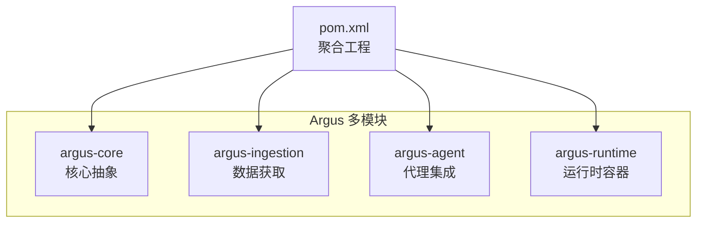
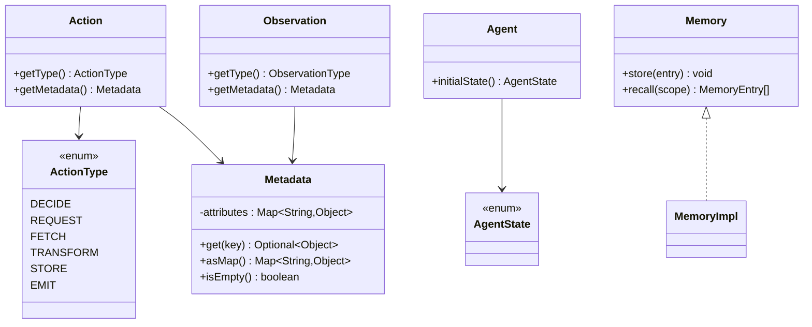
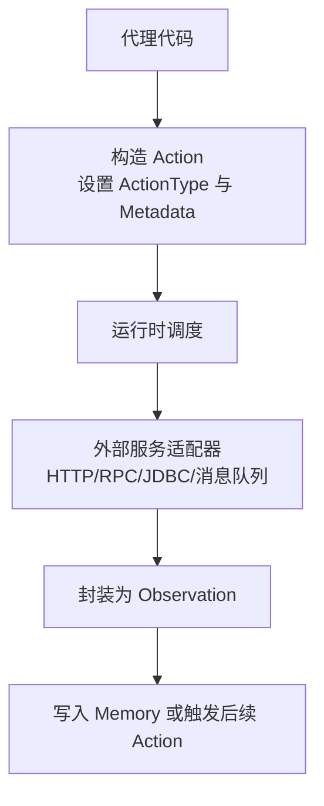
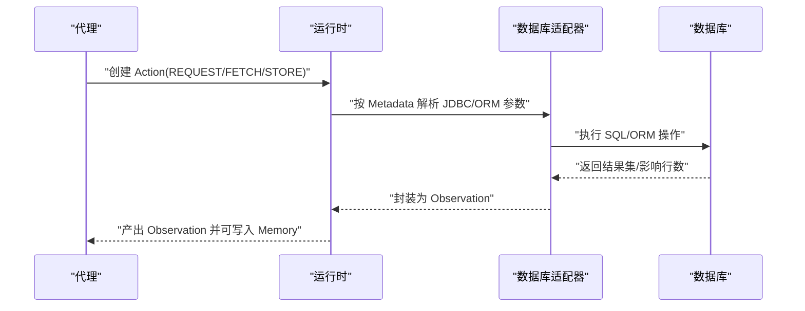
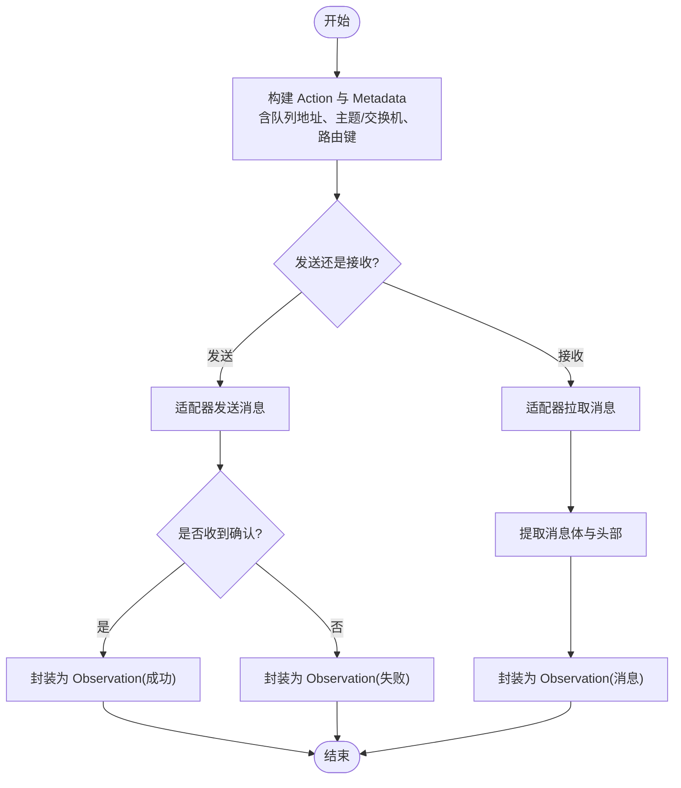
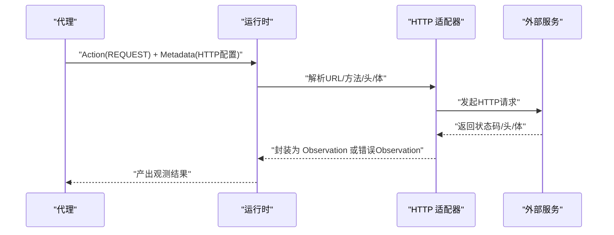
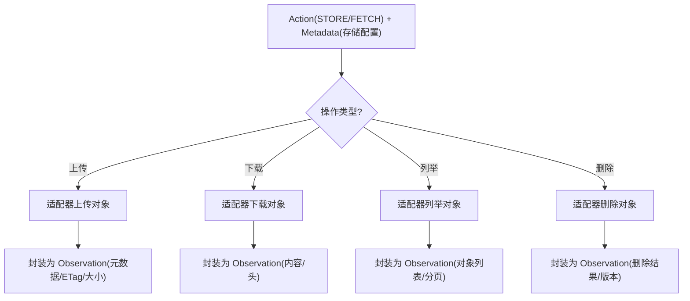
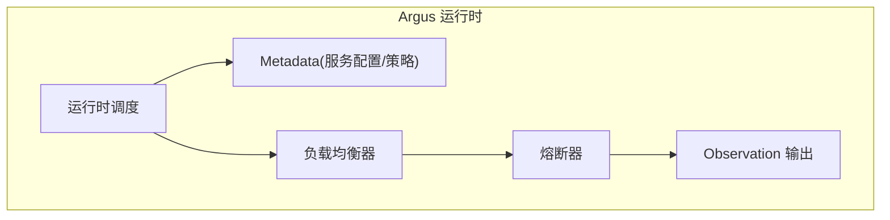
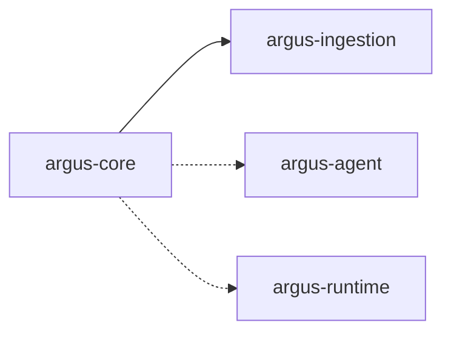

# 第三方集成示例

<cite>
**本文引用的文件**
- [readme.md](file://readme.md)
- [pom.xml](file://pom.xml)
- [Action.java](file://argus-core/src/main/java/io/argus/core/action/Action.java)
- [ActionType.java](file://argus-core/src/main/java/io/argus/core/action/ActionType.java)
- [Agent.java](file://argus-core/src/main/java/io/argus/core/agent/Agent.java)
- [AgentState.java](file://argus-core/src/main/java/io/argus/core/agent/AgentState.java)
- [Metadata.java](file://argus-core/src/main/java/io/argus/core/model/Metadata.java)
- [Memory.java](file://argus-core/src/main/java/io/argus/core/memory/Memory.java)
- [Observation.java](file://argus-core/src/main/java/io/argus/core/observation/Observation.java)
- [FetchAction.java](file://argus-ingestion/src/main/java/io/argus/ingestion/fetch/FetchAction.java)
- [FetchRequest.java](file://argus-ingestion/src/main/java/io/argus/ingestion/fetch/FetchRequest.java)
- [FetchResult.java](file://argus-ingestion/src/main/java/io/argus/ingestion/fetch/FetchResult.java)
- [IngestionSource.java](file://argus-ingestion/src/main/java/io/argus/ingestion/source/IngestionSource.java)
- [IngestionRequest.java](file://argus-ingestion/src/main/java/io/argus/ingestion/source/IngestionRequest.java)
- [IngestionResult.java](file://argus-ingestion/src/main/java/io/argus/ingestion/source/IngestionResult.java)
- [IngestionMode.java](file://argus-ingestion/src/main/java/io/argus/ingestion/source/IngestionMode.java)
- [Parser.java](file://argus-ingestion/src/main/java/io/argus/ingestion/parse/Parser.java)
- [FetchPolicy.java](file://argus-ingestion/src/main/java/io/argus/ingestion/policy/FetchPolicy.java)
- [IngestionException.java](file://argus-ingestion/src/main/java/io/argus/ingestion/error/IngestionException.java)
- [FetchFailedException.java](file://argus-ingestion/src/main/java/io/argus/ingestion/error/FetchFailedException.java)
</cite>

## 目录
1. [简介](#简介)
2. [项目结构](#项目结构)
3. [核心组件](#核心组件)
4. [架构总览](#架构总览)
5. [详细组件分析](#详细组件分析)
6. [依赖分析](#依赖分析)
7. [性能考虑](#性能考虑)
8. [故障排除指南](#故障排除指南)
9. [结论](#结论)
10. [附录](#附录)

## 简介
本文件面向在Argus框架基础上进行第三方服务集成的开发者，围绕数据库连接（JDBC/ORM/事务）、消息队列（RabbitMQ/Kafka）、外部API调用（REST/GraphQL/认证）、云存储（AWS S3/Azure Blob）以及微服务（服务发现/负载均衡/熔断）等主题，给出可落地的集成思路与最佳实践。由于当前仓库以核心接口与网络数据获取模块为主，本文将结合Argus的Action/Observation/Metadata等建模能力，提供与第三方系统的对接蓝图与实施建议。

## 项目结构
Argus采用多模块聚合工程组织，核心模块包括：
- argus-core：定义Action、Agent、Memory、Observation等基础抽象
- argus-ingestion：提供网络数据获取（Fetch/Parse/Policy）能力
- argus-agent：AI代理集成支持（预留）
- argus-runtime：生产级运行时容器（预留）

图表来源
- [pom.xml](file://pom.xml#L24-L29)

章节来源
- [readme.md](file://readme.md#L7-L14)
- [pom.xml](file://pom.xml#L1-L40)

## 核心组件
Argus通过一组清晰的领域抽象支撑第三方集成：
- Action/ActionType：抽象代理意图与语义类别（DECIDE/REQUEST/FETCH/TRANSFORM/STORE/EMIT）
- Observation/ObservationType：记录事实性观测，区分代理意图与外部事实
- Metadata：承载键值属性，用于携带协议/服务细节而不污染类型枚举
- Agent/AgentState：定义代理状态与不可变快照语义
- Memory：抽象记忆存储与检索
- Ingestion系列：封装从外部源获取数据的边界与审计要求

图表来源
- [Action.java](file://argus-core/src/main/java/io/argus/core/action/Action.java#L37-L43)
- [ActionType.java](file://argus-core/src/main/java/io/argus/core/action/ActionType.java#L22-L143)
- [Observation.java](file://argus-core/src/main/java/io/argus/core/observation/Observation.java#L31-L37)
- [Metadata.java](file://argus-core/src/main/java/io/argus/core/model/Metadata.java#L12-L34)
- [Agent.java](file://argus-core/src/main/java/io/argus/core/agent/Agent.java#L7-L11)
- [AgentState.java](file://argus-core/src/main/java/io/argus/core/agent/AgentState.java#L79-L81)
- [Memory.java](file://argus-core/src/main/java/io/argus/core/memory/Memory.java#L9-L15)

章节来源
- [Action.java](file://argus-core/src/main/java/io/argus/core/action/Action.java#L1-L43)
- [ActionType.java](file://argus-core/src/main/java/io/argus/core/action/ActionType.java#L1-L143)
- [Observation.java](file://argus-core/src/main/java/io/argus/core/observation/Observation.java#L1-L37)
- [Metadata.java](file://argus-core/src/main/java/io/argus/core/model/Metadata.java#L1-L34)
- [Agent.java](file://argus-core/src/main/java/io/argus/core/agent/Agent.java#L1-L11)
- [AgentState.java](file://argus-core/src/main/java/io/argus/core/agent/AgentState.java#L1-L81)
- [Memory.java](file://argus-core/src/main/java/io/argus/core/memory/Memory.java#L1-L15)

## 架构总览
Argus将“意图（Action）—观测（Observation）—记忆（Memory）”作为运行时核心，第三方集成应遵循以下原则：
- 使用ActionType.REQUEST/FETCH/STORE/EMIT表达意图
- 使用Metadata传递服务端点、凭据、参数等技术细节
- 使用Observation承载外部返回的事实，避免在Action中编码协议细节
- 使用Ingestion边界确保可审计、可重放、可Dry-run

## 详细组件分析

### 数据库连接集成（JDBC/ORM/事务）
目标：通过Argus Action请求外部数据库能力，统一以Observation呈现查询/变更结果，并保证可审计与可重放。

- 意图建模
  - 使用ActionType.REQUEST/FETCH/STORE/EMIT表达数据库读取、写入、事务提交等意图
  - 将JDBC驱动、连接串、SQL模板、参数等放入Metadata，避免在Action类型中硬编码
- 观测建模
  - 查询结果映射为Observation，包含数据行、元信息（字段名、时间戳等）
  - 写入/更新结果映射为Observation，包含影响行数、受影响主键集合等
- 事务管理
  - 将“开启事务—执行多个子动作—提交/回滚”封装为复合Action或运行时事务上下文
  - 事务边界内的所有Observation应可重放且无副作用
- ORM集成
  - ORM框架作为适配器，将实体映射为Observation，保持Metadata中包含实体类型、版本等审计信息

最佳实践
- 将连接池、超时、重试策略、只读事务隔离级别等配置放入Metadata，便于审计与重放
- 对DDL变更使用独立的ActionType与严格的Dry-run校验
- 对批量写入采用分批提交与幂等键，确保可重放一致性

### 消息队列集成（RabbitMQ/Kafka）
目标：通过Argus Action请求消息发送/接收，统一以Observation呈现消息体与元数据。

- 发送流程
  - 使用ActionType.REQUEST/FETCH/EMIT表达发送意图，Metadata包含交换机/主题、路由键、消息体格式、序列化方式
  - 适配器将消息投递到MQ后，封装为Observation（含消息ID、发送时间、确认状态）
- 接收流程
  - 使用ActionType.FECTH/EMIT表达拉取/消费意图，Metadata包含消费者组、偏移量、分区、反序列化策略
  - 适配器从MQ拉取消息后，封装为Observation（含消息体、头部、分区、偏移量）
- 幂等与重放
  - 使用Metadata记录消息ID与去重键，确保重放不重复处理
  - 对于Kafka，结合消费者组位点与幂等生产者配置

最佳实践
- 将重试、死信、延迟队列等配置放入Metadata，便于审计与切换
- 对高吞吐场景使用批量发送/拉取，并在Observation中记录批次统计

### 外部API调用（REST/GraphQL/认证）
目标：通过Argus Action请求外部API，统一以Observation呈现响应与错误。

- REST
  - 使用ActionType.REQUEST/FETCH表达HTTP请求意图，Metadata包含URL、方法、头、查询参数、请求体、超时、重试策略
  - 适配器解析响应状态码、头、体，封装为Observation；错误时封装为错误Observation
- GraphQL
  - 使用ActionType.REQUEST表达查询意图，Metadata包含查询字符串、变量、操作名
  - 适配器执行查询后，将结果映射为Observation，必要时携带路径/索引以便重放
- 认证机制
  - 支持Bearer Token、Basic Auth、API Key、OAuth等，均通过Metadata注入
  - 对敏感信息（密钥、令牌）仅在内存中传递，不在日志中落盘

最佳实践
- 将速率限制、并发上限、退避策略放入Metadata，便于在Dry-run中验证
- 对长链路追踪，使用Metadata携带TraceID，便于跨服务定位问题

### 云存储集成（AWS S3/Azure Blob）
目标：通过Argus Action请求对象存储的上传/下载/列举/删除，统一以Observation呈现元数据与结果。

- 典型动作
  - 上传：ActionType.STORE，Metadata包含桶/容器、对象Key、内容类型、ACL、加密策略
  - 下载：ActionType.FETCH，Metadata包含桶/容器、对象Key、范围、预签名URL有效期
  - 列举：ActionType.FECTH，Metadata包含前缀、分页、过滤条件
  - 删除：ActionType.STORE，Metadata包含对象列表、是否递归
- 观测与审计
  - 将ETag、大小、最后修改时间、版本号等放入Observation
  - 对删除/覆盖操作，保留版本信息以便回溯

最佳实践
- 将区域、Endpoint、凭据来源（Role/Key）放入Metadata，便于在不同环境切换
- 对大文件采用分片上传/断点续传，并在Observation中记录分片信息

### 微服务架构集成（服务发现/负载均衡/熔断）
目标：在Argus运行时中集成服务发现、负载均衡与熔断降级，保障系统弹性与可观测性。

- 服务发现
  - 通过Metadata注入服务名与命名空间，运行时解析为IP:Port列表
  - 对DNS/Consul/Nacos等发现机制，适配器负责刷新与缓存
- 负载均衡
  - 支持轮询、权重、最少连接、健康检查等策略，策略配置放入Metadata
- 熔断与限流
  - 对上游异常率/时延阈值启用熔断，降级为本地缓存或默认值
  - 限流策略（QPS/并发）通过Metadata配置，避免雪崩
- 可观测性
  - 通过Observation记录调用耗时、状态码、重试次数、熔断事件
  - 使用Metadata携带SpanID/TraceID，便于链路追踪

最佳实践
- 将熔断窗口、惩罚时间、最小请求数等阈值放入Metadata，便于灰度与调优
- 对关键路径增加快速失败与降级预案，确保系统可用性

## 依赖分析
Argus模块间关系清晰，核心抽象集中在argus-core，数据获取能力在argus-ingestion。第三方集成应通过适配器模式接入，避免直接耦合具体技术栈。

图表来源
- [pom.xml](file://pom.xml#L24-L29)

章节来源
- [pom.xml](file://pom.xml#L1-L40)

## 性能考虑
- 减少外部调用次数：合并请求、批量处理、缓存热点数据
- 控制序列化开销：优先使用二进制/压缩格式，避免冗余字段
- 合理设置超时与重试：避免阻塞线程池，使用指数退避
- 监控与采样：对慢调用与错误率建立告警，采样关键路径

## 故障排除指南
- 审计与回放
  - 所有外部交互均需记录到Observation，确保回放时不访问外部系统
  - Dry-run阶段验证请求参数与权限，提前暴露配置问题
- 错误分类
  - IngestionException：数据获取层通用异常
  - FetchFailedException：抓取失败的具体原因
  - 对于第三方服务异常，适配器应将其转换为可审计的Observation
- 常见问题
  - 认证失败：检查Metadata中的凭据注入与过期时间
  - 超时/限流：调整超时与重试策略，必要时启用降级
  - 幂等性：确保发送/消费侧具备去重键，避免重复处理

章节来源
- [IngestionException.java](file://argus-ingestion/src/main/java/io/argus/ingestion/error/IngestionException.java#L1-L8)
- [FetchFailedException.java](file://argus-ingestion/src/main/java/io/argus/ingestion/error/FetchFailedException.java#L1-L8)

## 结论
通过Action/Observation/Metadata等抽象，Argus为第三方服务集成提供了统一的建模语言与执行边界。遵循“意图声明、观测记录、不可变快照”的设计，可在数据库、消息队列、外部API、云存储与微服务等场景中实现可审计、可控制、可复现的集成方案。

## 附录
- 配置清单建议
  - 连接串/Endpoint/Region/Bucket/Topic/Queue等基础信息放入Metadata
  - 超时、重试、并发、限流、熔断阈值等策略放入Metadata
  - 认证凭据通过安全通道注入，不在代码或日志中明文出现
- 实施步骤
  1) 明确ActionType与Metadata键
  2) 编写适配器实现（HTTP/JDBC/MQ/存储）
  3) 单元测试与Dry-run验证
  4) 集成监控与审计
  5) 上线灰度与回滚预案