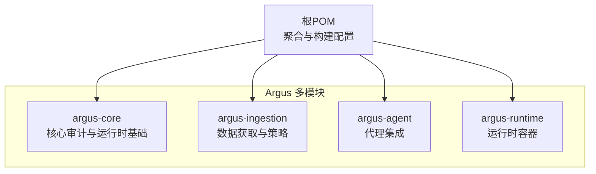
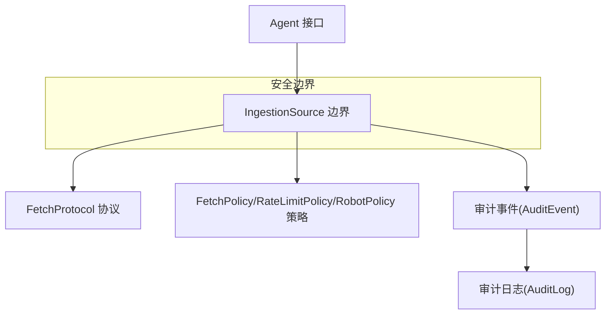
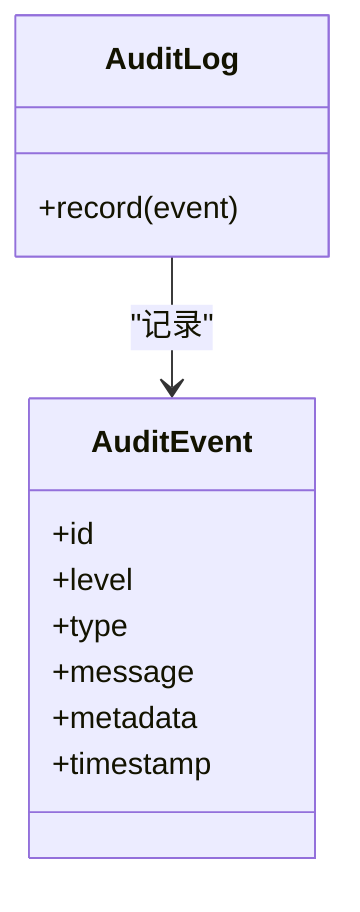
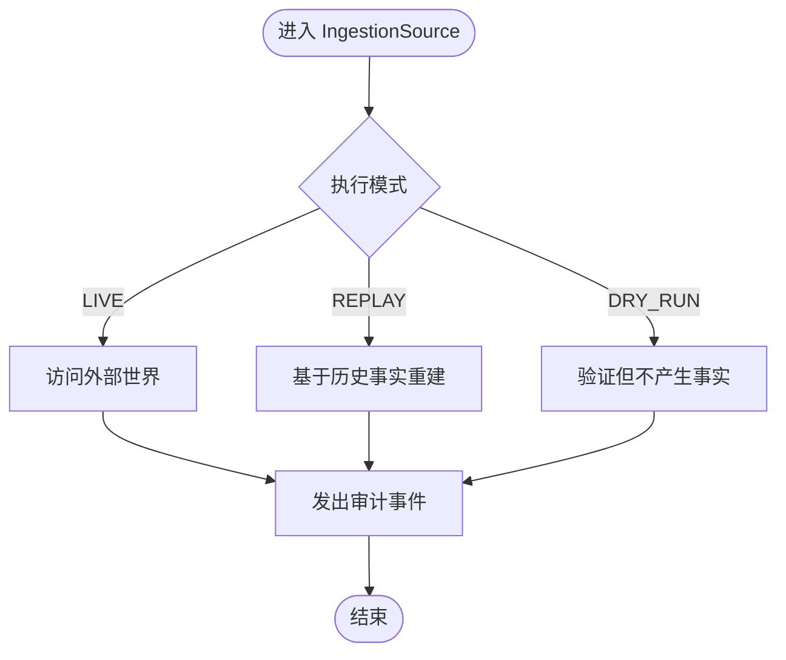
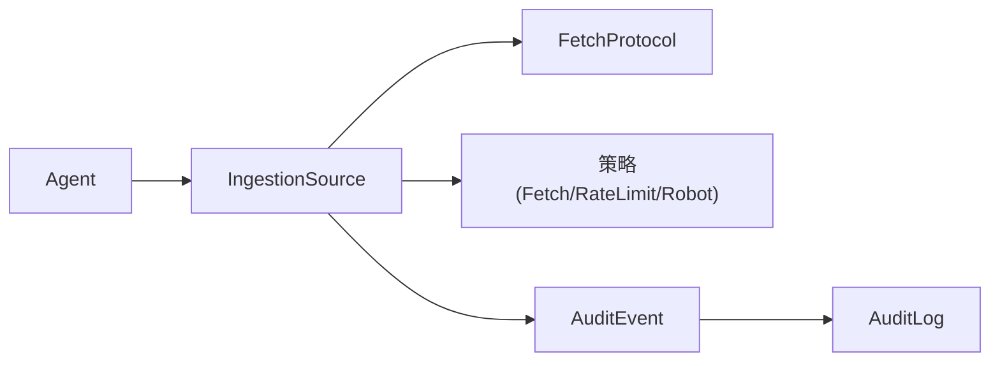

# 安全配置

<cite>
**本文引用的文件**
- [readme.md](file://readme.md)
- [pom.xml](file://pom.xml)
- [AuditEvent.java](file://argus-core/src/main/java/io/argus/core/audit/AuditEvent.java)
- [AuditLog.java](file://argus-core/src/main/java/io/argus/core/audit/AuditLog.java)
- [package-info.java（核心审计）](file://argus-core/src/main/java/io/argus/core/audit/package-info.java)
- [IngestionSource.java](file://argus-ingestion/src/main/java/io/argus/ingestion/source/IngestionSource.java)
- [FetchPolicy.java](file://argus-ingestion/src/main/java/io/argus/ingestion/policy/FetchPolicy.java)
- [RateLimitPolicy.java](file://argus-ingestion/src/main/java/io/argus/ingestion/policy/RateLimitPolicy.java)
- [RobotPolicy.java](file://argus-ingestion/src/main/java/io/argus/ingestion/policy/RobotPolicy.java)
- [FetchProtocol.java](file://argus-ingestion/src/main/java/io/argus/ingestion/fetch/FetchProtocol.java)
- [IngestionAuditEvent.java](file://argus-ingestion/src/main/java/io/argus/ingestion/audit/IngestionAuditEvent.java)
- [IngestionAuditType.java](file://argus-ingestion/src/main/java/io/argus/ingestion/audit/IngestionAuditType.java)
</cite>

## 目录
1. 引言
2. 项目结构
3. 核心组件
4. 架构总览
5. 详细组件分析
6. 依赖分析
7. 性能考虑
8. 故障排查指南
9. 结论
10. 附录

## 引言
本指南面向Argus框架的安全配置与落地实践，聚焦以下目标：
- 访问控制：明确Agent接口的安全边界与权限管理思路
- 数据获取安全：FetchPolicy与网络协议的限制与HTTPS配置建议
- 网络安全：防火墙与网络隔离策略
- 数据保护：敏感信息的加密存储与传输安全
- 身份认证与授权：API密钥与会话管理建议
- 安全审计：操作日志与访问记录的配置方法
- 安全漏洞防护与应急响应
- 合规检查清单与最佳实践

Argus强调“可审计、可控制、可复现”，其安全基线建立在严格的边界定义、可审计事件与可回放执行之上。

## 项目结构
Argus采用多模块聚合结构，核心模块围绕“可审计”“可控制”的设计原则组织：
- argus-core：核心基础设施（Action、Agent、Memory、Observation、Audit）
- argus-ingestion：网络数据获取（Fetch、Parse、Policy）
- argus-agent：AI代理集成支持
- argus-runtime：生产级运行时容器

图表来源
- [pom.xml](file://pom.xml#L24-L29)

章节来源
- [readme.md](file://readme.md#L7-L14)
- [pom.xml](file://pom.xml#L24-L29)

## 核心组件
- 审计基础设施
  - 审计事件模型：审计事件类型、级别、消息、元数据与时间戳
  - 审计日志接口：统一记录入口，确保审计事件持久化与可检索
- 数据获取边界
  - IngestionSource：定义ARGUS与外部世界的权威边界；强调不可逆副作用的可审计性与回放时的被动性
  - FetchPolicy/RateLimitPolicy/RobotPolicy：数据获取策略的扩展点
  - FetchProtocol：数据获取协议抽象
- 审计扩展
  - IngestionAuditEvent/IngestionAuditType：数据获取阶段的审计事件与类型

章节来源
- [AuditEvent.java](file://argus-core/src/main/java/io/argus/core/audit/AuditEvent.java#L9-L32)
- [AuditLog.java](file://argus-core/src/main/java/io/argus/core/audit/AuditLog.java#L7-L11)
- [package-info.java（核心审计）](file://argus-core/src/main/java/io/argus/core/audit/package-info.java#L1-L23)
- [IngestionSource.java](file://argus-ingestion/src/main/java/io/argus/ingestion/source/IngestionSource.java#L10-L107)
- [FetchPolicy.java](file://argus-ingestion/src/main/java/io/argus/ingestion/policy/FetchPolicy.java#L7-L8)
- [RateLimitPolicy.java](file://argus-ingestion/src/main/java/io/argus/ingestion/policy/RateLimitPolicy.java#L7-L8)
- [RobotPolicy.java](file://argus-ingestion/src/main/java/io/argus/ingestion/policy/RobotPolicy.java#L7-L8)
- [FetchProtocol.java](file://argus-ingestion/src/main/java/io/argus/ingestion/fetch/FetchProtocol.java#L7-L8)
- [IngestionAuditEvent.java](file://argus-ingestion/src/main/java/io/argus/ingestion/audit/IngestionAuditEvent.java#L7-L8)
- [IngestionAuditType.java](file://argus-ingestion/src/main/java/io/argus/ingestion/audit/IngestionAuditType.java#L7-L8)

## 架构总览
Argus的安全架构以“边界清晰、事件可审计、执行可回放”为核心。下图展示从Agent到IngestionSource的数据流与审计路径，以及策略层对访问控制与速率限制的约束。

图表来源
- [IngestionSource.java](file://argus-ingestion/src/main/java/io/argus/ingestion/source/IngestionSource.java#L10-L107)
- [FetchProtocol.java](file://argus-ingestion/src/main/java/io/argus/ingestion/fetch/FetchProtocol.java#L7-L8)
- [FetchPolicy.java](file://argus-ingestion/src/main/java/io/argus/ingestion/policy/FetchPolicy.java#L7-L8)
- [RateLimitPolicy.java](file://argus-ingestion/src/main/java/io/argus/ingestion/policy/RateLimitPolicy.java#L7-L8)
- [RobotPolicy.java](file://argus-ingestion/src/main/java/io/argus/ingestion/policy/RobotPolicy.java#L7-L8)
- [AuditEvent.java](file://argus-core/src/main/java/io/argus/core/audit/AuditEvent.java#L9-L32)
- [AuditLog.java](file://argus-core/src/main/java/io/argus/core/audit/AuditLog.java#L7-L11)

## 详细组件分析

### 审计与可追溯性
- 审计事件模型
  - 字段：标识、级别、类型、消息、元数据、时间戳
  - 设计要点：只读属性，确保事实性与不可篡改性
- 审计日志接口
  - 统一记录入口，便于替换实现（文件、数据库、远程上报）
- 审计包文档
  - 明确“审计不同于日志”，强调可回放与可分析的事实记录

图表来源
- [AuditEvent.java](file://argus-core/src/main/java/io/argus/core/audit/AuditEvent.java#L9-L32)
- [AuditLog.java](file://argus-core/src/main/java/io/argus/core/audit/AuditLog.java#L7-L11)

章节来源
- [AuditEvent.java](file://argus-core/src/main/java/io/argus/core/audit/AuditEvent.java#L9-L32)
- [AuditLog.java](file://argus-core/src/main/java/io/argus/core/audit/AuditLog.java#L7-L11)
- [package-info.java（核心审计）](file://argus-core/src/main/java/io/argus/core/audit/package-info.java#L1-L23)

### 数据获取边界与策略
- IngestionSource边界
  - 权威边界：区分ARGUS内部与外部世界
  - 回放语义：回放时不得再次访问外部世界，仅基于已记录事实重放
  - 审计要求：必须发出描述尝试、成功与失败的审计事件
  - 执行模式：LIVE/REPLAY/DRY_RUN
  - 非职责：不包含代理决策逻辑、不修改AgentState、不进行超出事实采集的解析
- FetchPolicy/RateLimitPolicy/RobotPolicy
  - 扩展点：用于定义获取策略、速率限制与Robots协议遵循
- FetchProtocol
  - 协议抽象：为HTTP/HTTPS等协议提供统一接入点

图表来源
- [IngestionSource.java](file://argus-ingestion/src/main/java/io/argus/ingestion/source/IngestionSource.java#L75-L83)
- [IngestionSource.java](file://argus-ingestion/src/main/java/io/argus/ingestion/source/IngestionSource.java#L40-L51)

章节来源
- [IngestionSource.java](file://argus-ingestion/src/main/java/io/argus/ingestion/source/IngestionSource.java#L10-L107)
- [FetchPolicy.java](file://argus-ingestion/src/main/java/io/argus/ingestion/policy/FetchPolicy.java#L7-L8)
- [RateLimitPolicy.java](file://argus-ingestion/src/main/java/io/argus/ingestion/policy/RateLimitPolicy.java#L7-L8)
- [RobotPolicy.java](file://argus-ingestion/src/main/java/io/argus/ingestion/policy/RobotPolicy.java#L7-L8)
- [FetchProtocol.java](file://argus-ingestion/src/main/java/io/argus/ingestion/fetch/FetchProtocol.java#L7-L8)

### 数据获取阶段的审计
- IngestionAuditEvent/IngestionAuditType
  - 用于在数据获取阶段补充审计事件与类型，便于细化追踪

章节来源
- [IngestionAuditEvent.java](file://argus-ingestion/src/main/java/io/argus/ingestion/audit/IngestionAuditEvent.java#L7-L8)
- [IngestionAuditType.java](file://argus-ingestion/src/main/java/io/argus/ingestion/audit/IngestionAuditType.java#L7-L8)

## 依赖分析
- 模块耦合
  - argus-ingestion依赖argus-core提供的审计事件与日志接口
  - IngestionSource作为边界组件，向上游Agent与下游策略解耦
- 关键依赖链
  - Agent → IngestionSource → FetchProtocol/策略 → 审计事件 → 审计日志

图表来源
- [IngestionSource.java](file://argus-ingestion/src/main/java/io/argus/ingestion/source/IngestionSource.java#L10-L107)
- [FetchProtocol.java](file://argus-ingestion/src/main/java/io/argus/ingestion/fetch/FetchProtocol.java#L7-L8)
- [FetchPolicy.java](file://argus-ingestion/src/main/java/io/argus/ingestion/policy/FetchPolicy.java#L7-L8)
- [RateLimitPolicy.java](file://argus-ingestion/src/main/java/io/argus/ingestion/policy/RateLimitPolicy.java#L7-L8)
- [RobotPolicy.java](file://argus-ingestion/src/main/java/io/argus/ingestion/policy/RobotPolicy.java#L7-L8)
- [AuditEvent.java](file://argus-core/src/main/java/io/argus/core/audit/AuditEvent.java#L9-L32)
- [AuditLog.java](file://argus-core/src/main/java/io/argus/core/audit/AuditLog.java#L7-L11)

## 性能考虑
- 审计开销控制
  - 审计事件批量写入与异步落盘，避免阻塞数据获取主路径
- 策略生效前置
  - 在进入外部访问前完成策略校验，减少无效请求
- 回放优化
  - 回放阶段尽量使用内存缓存与索引，避免重复I/O

## 故障排查指南
- 审计缺失
  - 症状：缺少数据获取事件
  - 排查：确认IngestionSource是否在成功/失败路径均发出审计事件；检查AuditLog实现是否可用
- 回放异常
  - 症状：回放时出现外部访问或非确定性结果
  - 排查：核对执行模式是否为REPLAY；确认历史事实是否完整
- 策略未生效
  - 症状：速率超限或违反Robots协议仍被允许
  - 排查：确认策略实现已在Fetch流程中调用；检查策略参数配置

章节来源
- [IngestionSource.java](file://argus-ingestion/src/main/java/io/argus/ingestion/source/IngestionSource.java#L64-L73)
- [AuditLog.java](file://argus-core/src/main/java/io/argus/core/audit/AuditLog.java#L7-L11)

## 结论
Argus通过“边界清晰、事件可审计、执行可回放”的设计，为安全配置提供了坚实基础。结合本文的策略与实践建议，可在保障功能完整性的同时，显著提升系统的安全性与可运维性。

## 附录

### 访问控制与Agent接口安全边界
- 明确Agent接口的调用边界，仅暴露必要方法
- 使用最小权限原则：每个Agent仅具备完成任务所需的最低权限
- 对外部输入进行严格校验与白名单控制

章节来源
- [IngestionSource.java](file://argus-ingestion/src/main/java/io/argus/ingestion/source/IngestionSource.java#L85-L94)

### 数据获取安全策略（FetchPolicy与HTTPS）
- FetchPolicy扩展点用于实现访问控制与合规限制
- HTTPS强制：所有外部访问优先使用HTTPS，禁用明文协议
- 证书校验：启用主机名验证与可信CA链校验
- 速率限制：通过RateLimitPolicy限制并发与频率，防止滥用

章节来源
- [FetchPolicy.java](file://argus-ingestion/src/main/java/io/argus/ingestion/policy/FetchPolicy.java#L7-L8)
- [RateLimitPolicy.java](file://argus-ingestion/src/main/java/io/argus/ingestion/policy/RateLimitPolicy.java#L7-L8)
- [FetchProtocol.java](file://argus-ingestion/src/main/java/io/argus/ingestion/fetch/FetchProtocol.java#L7-L8)

### 网络安全配置建议
- 防火墙规则
  - 仅开放运行时必需端口；对外出站仅允许必要的HTTPS端口
- 网络隔离
  - 将数据获取与审计服务置于独立子网，限制横向移动
- 传输安全
  - 强制TLS版本与密码套件；定期轮换证书

### 数据保护措施
- 加密存储
  - 审计日志与历史事实采用强加密存储；密钥分层管理
- 传输安全
  - 内外通信使用TLS；启用HSTS与OCSP Stapling
- 敏感信息脱敏
  - 审计事件中避免记录敏感字段；如需保留，进行去标识化处理

### 身份认证与授权
- API密钥管理
  - 密钥轮换与吊销机制；最小权限分配与作用域限制
- 会话管理
  - 无状态会话或短生命周期会话；会话令牌加密存储

### 安全审计配置
- 审计事件类型与级别
  - 明确事件分类（访问、变更、异常）与严重等级
- 审计日志管理
  - 分级存储与保留策略；支持远程上报与集中分析
- 可回放性
  - 回放阶段严格遵守被动性原则，不引入新事实

章节来源
- [package-info.java（核心审计）](file://argus-core/src/main/java/io/argus/core/audit/package-info.java#L1-L23)
- [IngestionSource.java](file://argus-ingestion/src/main/java/io/argus/ingestion/source/IngestionSource.java#L64-L73)

### 安全漏洞防护与应急响应
- 漏洞扫描与渗透测试
  - 定期对运行时与依赖进行漏洞扫描
- 应急响应
  - 建立事件分级与处置流程；快速隔离与恢复

### 合规检查清单与最佳实践
- 合规检查
  - 审计可追溯性、数据最小化、传输加密、访问最小权限
- 最佳实践
  - 开发阶段即内置安全策略；生产环境默认启用HTTPS与严格TLS；持续监控与告警