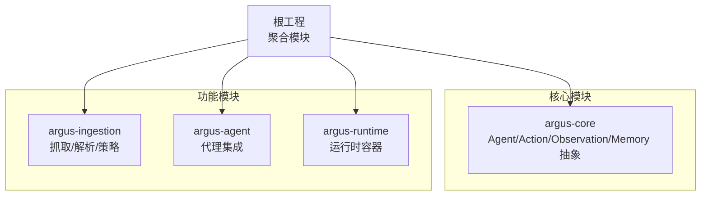
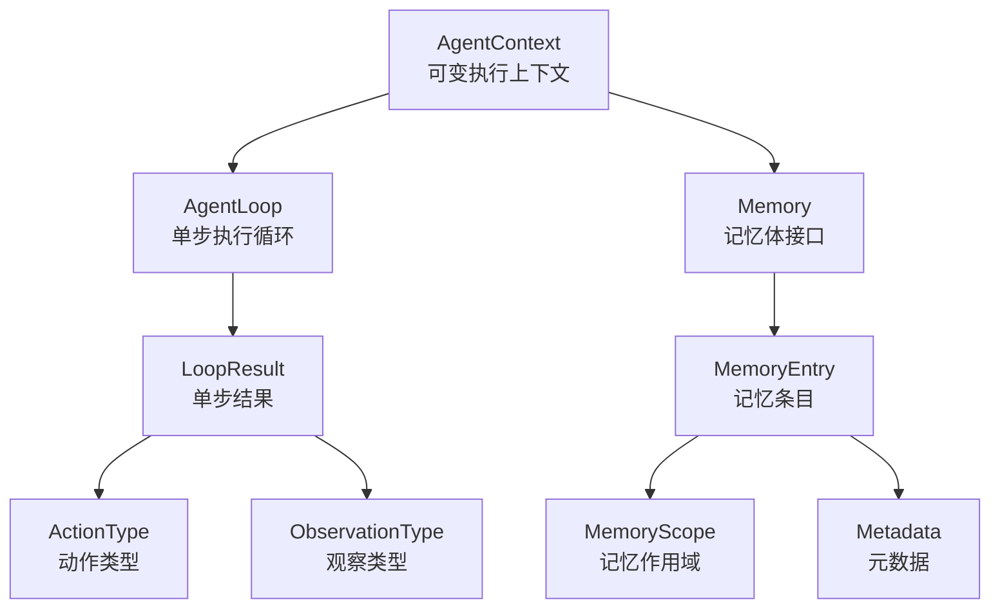
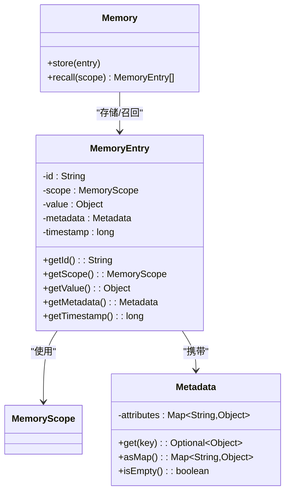
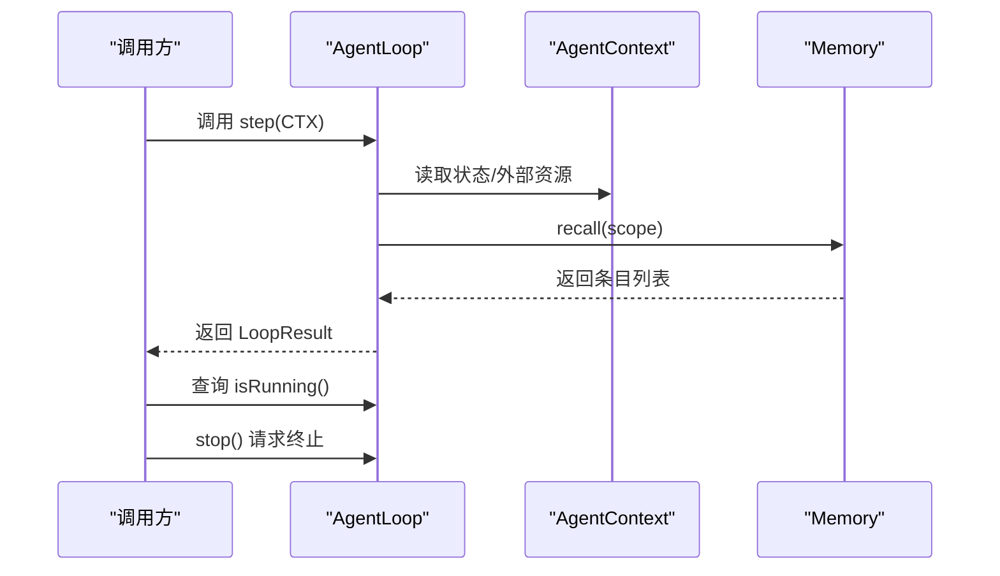
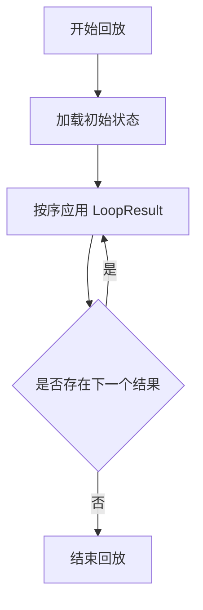
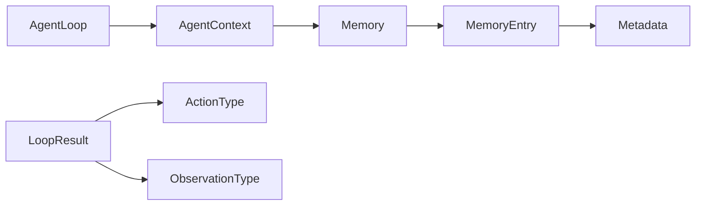

# 性能调优

<cite>
**本文引用的文件**
- [Memory.java](file://argus-core/src/main/java/io/argus/core/memory/Memory.java)
- [MemoryEntry.java](file://argus-core/src/main/java/io/argus/core/memory/MemoryEntry.java)
- [MemoryScope.java](file://argus-core/src/main/java/io/argus/core/memory/MemoryScope.java)
- [AgentLoop.java](file://argus-core/src/main/java/io/argus/core/agent/AgentLoop.java)
- [AgentContext.java](file://argus-core/src/main/java/io/argus/core/agent/AgentContext.java)
- [LoopResult.java](file://argus-core/src/main/java/io/argus/core/agent/LoopResult.java)
- [Metadata.java](file://argus-core/src/main/java/io/argus/core/model/Metadata.java)
- [ActionType.java](file://argus-core/src/main/java/io/argus/core/action/ActionType.java)
- [ObservationType.java](file://argus-core/src/main/java/io/argus/core/observation/ObservationType.java)
- [ArgusException.java](file://argus-core/src/main/java/io/argus/core/error/ArgusException.java)
- [AgentExecutionException.java](file://argus-core/src/main/java/io/argus/core/error/AgentExecutionException.java)
- [readme.md](file://readme.md)
- [pom.xml](file://pom.xml)
</cite>

## 目录
1. [简介](#简介)
2. [项目结构](#项目结构)
3. [核心组件](#核心组件)
4. [架构总览](#架构总览)
5. [详细组件分析](#详细组件分析)
6. [依赖关系分析](#依赖关系分析)
7. [性能考虑](#性能考虑)
8. [故障排查指南](#故障排查指南)
9. [结论](#结论)
10. [附录](#附录)

## 简介
本指南面向Argus框架的性能调优，聚焦以下方面：
- 内存使用优化：Memory与MemoryEntry的高效使用模式与生命周期管理
- 并发处理优化：AgentLoop的并行执行与资源池管理策略
- 配置参数调优：线程数、缓存大小、超时等参数建议
- 基准测试：压力测试与负载测试的实施方法
- 资源管理：CPU使用率控制与I/O优化
- 瓶颈识别：热点分析与内存泄漏检测
- 场景化案例：不同业务场景下的优化实践

## 项目结构
Argus采用多模块结构，核心能力集中在argus-core，提供Agent、Action、Observation、Memory等基础抽象；argus-ingestion负责网络知识获取；argus-agent与argus-runtime分别提供代理集成与运行时容器。

图表来源
- [readme.md](file://readme.md#L7-L14)
- [pom.xml](file://pom.xml#L24-L29)

章节来源
- [readme.md](file://readme.md#L1-L28)
- [pom.xml](file://pom.xml#L1-L40)

## 核心组件
- Memory接口：定义记忆体的存储与召回能力，支持按作用域召回
- MemoryEntry：不可变的记忆条目，包含id、作用域、值、元数据与时间戳
- MemoryScope：记忆作用域枚举（当前为空，建议后续扩展）
- AgentLoop：代理执行循环接口，定义单步决策周期与运行控制
- AgentContext：代理执行上下文，提供可变工作区与Memory访问
- LoopResult：单步执行结果载体，封装Action、Observation与下一状态
- Metadata：不可变键值对元数据，支持空安全读取
- ActionType/ObservationType：高层语义分类，约束实现不得绑定技术细节

章节来源
- [Memory.java](file://argus-core/src/main/java/io/argus/core/memory/Memory.java#L9-L15)
- [MemoryEntry.java](file://argus-core/src/main/java/io/argus/core/memory/MemoryEntry.java#L9-L53)
- [MemoryScope.java](file://argus-core/src/main/java/io/argus/core/memory/MemoryScope.java#L7-L8)
- [AgentLoop.java](file://argus-core/src/main/java/io/argus/core/agent/AgentLoop.java#L49-L118)
- [AgentContext.java](file://argus-core/src/main/java/io/argus/core/agent/AgentContext.java#L92-L98)
- [LoopResult.java](file://argus-core/src/main/java/io/argus/core/agent/LoopResult.java#L78-L115)
- [Metadata.java](file://argus-core/src/main/java/io/argus/core/model/Metadata.java#L12-L34)
- [ActionType.java](file://argus-core/src/main/java/io/argus/core/action/ActionType.java#L22-L94)
- [ObservationType.java](file://argus-core/src/main/java/io/argus/core/observation/ObservationType.java#L18-L52)

## 架构总览
Argus通过“不可变状态 + 可变上下文”的分离设计，确保可审计、可回放与可控制。AgentLoop定义单步决策循环，AgentContext提供短期工作区，Memory用于非权威性事实的临时存储与召回。

图表来源
- [AgentContext.java](file://argus-core/src/main/java/io/argus/core/agent/AgentContext.java#L92-L98)
- [AgentLoop.java](file://argus-core/src/main/java/io/argus/core/agent/AgentLoop.java#L49-L118)
- [LoopResult.java](file://argus-core/src/main/java/io/argus/core/agent/LoopResult.java#L78-L115)
- [Memory.java](file://argus-core/src/main/java/io/argus/core/memory/Memory.java#L9-L15)
- [MemoryEntry.java](file://argus-core/src/main/java/io/argus/core/memory/MemoryEntry.java#L9-L53)
- [MemoryScope.java](file://argus-core/src/main/java/io/argus/core/memory/MemoryScope.java#L7-L8)
- [Metadata.java](file://argus-core/src/main/java/io/argus/core/model/Metadata.java#L12-L34)
- [ActionType.java](file://argus-core/src/main/java/io/argus/core/action/ActionType.java#L22-L94)
- [ObservationType.java](file://argus-core/src/main/java/io/argus/core/observation/ObservationType.java#L18-L52)

## 详细组件分析

### Memory与MemoryEntry：内存使用优化策略
- 不可变性与零拷贝倾向：MemoryEntry为final类，字段均为不可变引用，有利于GC友好与共享安全
- 元数据不可变：Metadata构造时转为只读映射，避免并发读写竞争
- 时间戳与作用域：利用timestamp进行过期与排序，scope用于召回过滤
- 使用建议
  - 将频繁访问的轻量对象放入Memory，避免跨步骤持久化到不可变状态
  - 对大对象采用分页/流式处理，仅在必要时存入Memory
  - 合理设置作用域边界，减少召回范围
  - 使用时间戳做定期清理，防止无限增长

图表来源
- [Memory.java](file://argus-core/src/main/java/io/argus/core/memory/Memory.java#L9-L15)
- [MemoryEntry.java](file://argus-core/src/main/java/io/argus/core/memory/MemoryEntry.java#L9-L53)
- [MemoryScope.java](file://argus-core/src/main/java/io/argus/core/memory/MemoryScope.java#L7-L8)
- [Metadata.java](file://argus-core/src/main/java/io/argus/core/model/Metadata.java#L12-L34)

章节来源
- [Memory.java](file://argus-core/src/main/java/io/argus/core/memory/Memory.java#L9-L15)
- [MemoryEntry.java](file://argus-core/src/main/java/io/argus/core/memory/MemoryEntry.java#L9-L53)
- [Metadata.java](file://argus-core/src/main/java/io/argus/core/model/Metadata.java#L12-L34)

### AgentLoop：并发执行与资源池管理
- 单步原子性：step为原子决策单元，长任务需拆分为多次step
- 运行控制：isRunning与stop提供优雅停机与终止信号
- 并发模式：AgentLoop不强制具体并发模型，可在上层模块实现同步/异步/事件驱动/分布式
- 资源池建议
  - 线程池：根据CPU密集度与IO比例设置核心/最大线程数，队列长度与拒绝策略
  - 上下文隔离：每个Agent实例分配独立AgentContext，避免共享可变状态
  - 资源复用：外部客户端连接、限流器、指标采集器等放入AgentContext，随执行周期释放

图表来源
- [AgentLoop.java](file://argus-core/src/main/java/io/argus/core/agent/AgentLoop.java#L49-L118)
- [AgentContext.java](file://argus-core/src/main/java/io/argus/core/agent/AgentContext.java#L92-L98)
- [Memory.java](file://argus-core/src/main/java/io/argus/core/memory/Memory.java#L9-L15)

章节来源
- [AgentLoop.java](file://argus-core/src/main/java/io/argus/core/agent/AgentLoop.java#L49-L118)
- [AgentContext.java](file://argus-core/src/main/java/io/argus/core/agent/AgentContext.java#L92-L98)

### LoopResult：不可变结果与回放
- 不可变性：LoopResult封装Action、Observation与下一状态，便于回放与审计
- 回放契约：给定相同初始状态与有序LoopResult序列，可确定性重放
- 最佳实践
  - 将可再生/可计算的数据放入LoopResult，避免外部副作用
  - 仅携带回放所需信息，避免冗余

图表来源
- [LoopResult.java](file://argus-core/src/main/java/io/argus/core/agent/LoopResult.java#L78-L115)

章节来源
- [LoopResult.java](file://argus-core/src/main/java/io/argus/core/agent/LoopResult.java#L78-L115)

### 元数据与类型语义：避免过度耦合
- Metadata：不可变键值对，支持空安全读取
- ActionType/ObservationType：高层语义，禁止绑定具体协议/技术实现
- 性能意义
  - 类型语义清晰可降低分支复杂度
  - 不可变数据结构提升并发安全性

章节来源
- [Metadata.java](file://argus-core/src/main/java/io/argus/core/model/Metadata.java#L12-L34)
- [ActionType.java](file://argus-core/src/main/java/io/argus/core/action/ActionType.java#L22-L94)
- [ObservationType.java](file://argus-core/src/main/java/io/argus/core/observation/ObservationType.java#L18-L52)

## 依赖关系分析
- 组件内聚：Memory、MemoryEntry、Metadata围绕“事实存储”形成高内聚
- 接口解耦：AgentLoop与AgentContext通过接口解耦，便于替换并发模型
- 外部依赖：当前核心模块无框架依赖，利于移植与性能控制

图表来源
- [AgentLoop.java](file://argus-core/src/main/java/io/argus/core/agent/AgentLoop.java#L49-L118)
- [AgentContext.java](file://argus-core/src/main/java/io/argus/core/agent/AgentContext.java#L92-L98)
- [Memory.java](file://argus-core/src/main/java/io/argus/core/memory/Memory.java#L9-L15)
- [MemoryEntry.java](file://argus-core/src/main/java/io/argus/core/memory/MemoryEntry.java#L9-L53)
- [Metadata.java](file://argus-core/src/main/java/io/argus/core/model/Metadata.java#L12-L34)
- [LoopResult.java](file://argus-core/src/main/java/io/argus/core/agent/LoopResult.java#L78-L115)
- [ActionType.java](file://argus-core/src/main/java/io/argus/core/action/ActionType.java#L22-L94)
- [ObservationType.java](file://argus-core/src/main/java/io/argus/core/observation/ObservationType.java#L18-L52)

## 性能考虑

### 内存使用优化
- 对象池与复用
  - 外部客户端连接、限流器、指标采集器等放入AgentContext，随执行周期释放
  - 避免在LoopResult中存放可再生数据，减少序列化/传输开销
- 数据结构选择
  - 使用不可变集合（如Metadata）避免并发写入
  - MemoryEntry字段尽量为轻量对象，避免大对象频繁复制
- 清理策略
  - 基于timestamp定期清理过期条目
  - 限制Memory总量或条目数量，超过阈值触发淘汰

### 并发处理优化
- 线程模型
  - CPU密集型：线程数≈CPU核数
  - IO密集型：适当增加线程数，配合背压与限流
- 调度与队列
  - 使用有界队列，结合拒绝策略（快速失败/降级）
  - 分级队列：高优任务优先执行
- 资源池
  - 连接池：最大连接数、空闲超时、健康检查
  - 执行池：核心/最大线程数、存活时间、队列容量

### 配置参数调优建议
- 线程数
  - 初始值：CPU核数或2×CPU核数
  - 动态调整：根据吞吐与延迟曲线微调
- 缓存大小
  - Memory条目上限：按峰值QPS×保留秒数估算
  - 元数据大小：限制单条目大小，避免内存碎片
- 超时参数
  - 连接超时：网络RTT×2
  - 读写超时：任务期望耗时×1.5
  - 循环超时：单步最大容忍时间，超过则拆分为多次step

### 基准测试方法与工具
- 压力测试
  - 工具：JMH（微基准）、Gatling（HTTP）、自定义JVM进程
  - 指标：吞吐、P99延迟、错误率、GC次数/时间
- 负载测试
  - 工具：k6/Locust/JMeter
  - 场景：逐步加压至SLA边界，记录瓶颈点
- 回放验证
  - 使用LoopResult序列在不同硬件/配置上重放，对比一致性

### 资源管理策略
- CPU控制
  - 限速：令牌桶/漏桶算法
  - 优先级：实时任务优先，批处理退避
- I/O优化
  - 批处理：合并小请求
  - 异步：非阻塞I/O，合理背压
  - 缓存：热点数据本地缓存

### 瓶颈识别与解决
- 热点分析
  - 方法：火焰图（Async Profiler/Java Flight Recorder）
  - 关注：CPU占用、锁竞争、GC停顿
- 内存泄漏检测
  - 工具：Eclipse MAT/VisualVM
  - 关注：堆外内存、线程本地缓存、静态集合
- 解决路径
  - 锁争用：减少共享状态、使用无锁结构
  - GC压力：对象池、避免短生命周期大对象
  - I/O阻塞：异步化、连接池、批量处理

### 场景化案例与最佳实践
- 高频小任务（搜索/解析）
  - 线程池：核心=CPU核数，最大=2×核心，队列=1000
  - Memory：按会话作用域召回，条目上限100
  - 超时：连接100ms，读写500ms
- 批处理任务（下载/解析/入库）
  - 线程池：核心=CPU核数，最大=4×核心，队列=无界但受内存限制
  - Memory：仅存中间结果，完成后清理
  - 超时：连接2s，读写60s
- 实时推理（LLM/插件调用）
  - 线程池：核心=CPU核数，最大=8×核心，队列=100
  - Memory：短期上下文，按轮次清理
  - 超时：连接500ms，读写10s

## 故障排查指南
- 异常类型
  - ArgusException：框架级异常基类
  - AgentExecutionException：代理执行异常
- 排查步骤
  - 检查AgentLoop实现是否违反“单步原子性”
  - 核对Memory召回范围与条目数量
  - 审核LoopResult是否包含回放所需信息
  - 观察外部系统（网络/数据库）响应与错误码

章节来源
- [ArgusException.java](file://argus-core/src/main/java/io/argus/core/error/ArgusException.java#L7-L8)
- [AgentExecutionException.java](file://argus-core/src/main/java/io/argus/core/error/AgentExecutionException.java#L7-L8)

## 结论
通过“不可变状态 + 可变上下文”的设计，Argus在可审计与可复现的前提下提供了灵活的性能调优空间。围绕Memory的高效使用、AgentLoop的并发模型与资源池、以及完善的基准测试与故障排查流程，可以在不同业务场景下获得稳定且可预期的性能表现。

## 附录
- 参考文档与模块说明见根目录readme
- Maven聚合模块定义见根pom

章节来源
- [readme.md](file://readme.md#L1-L28)
- [pom.xml](file://pom.xml#L1-L40)