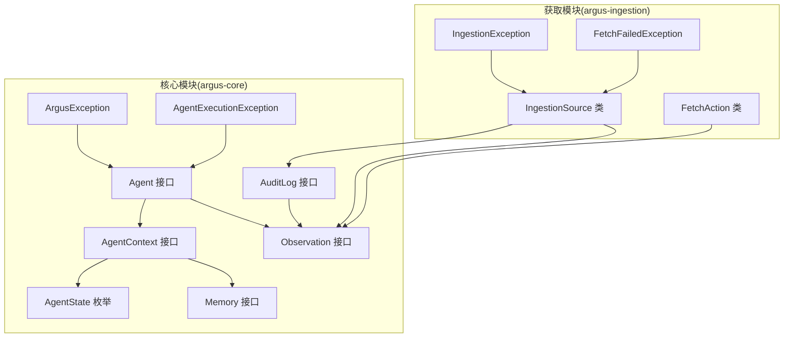
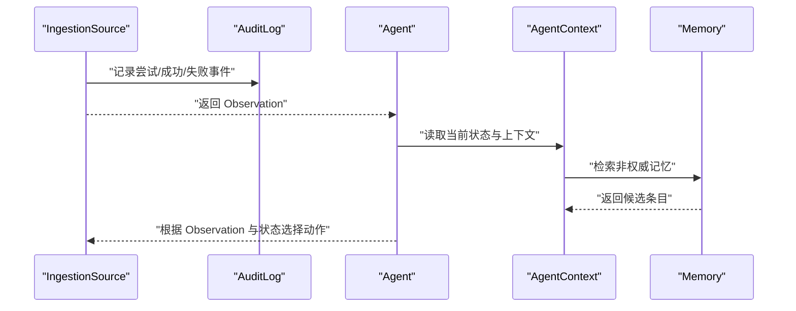
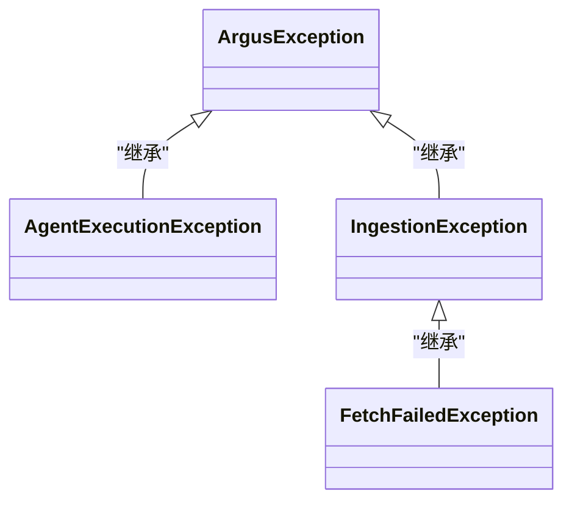
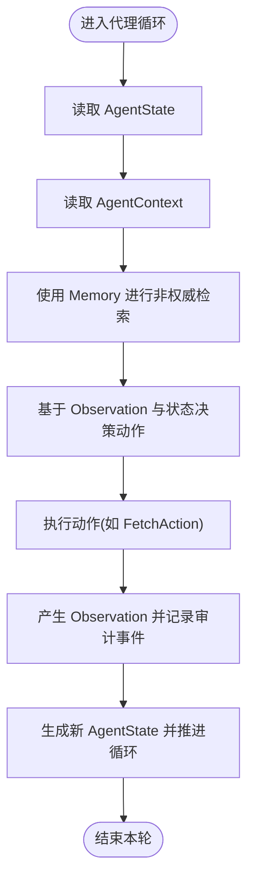
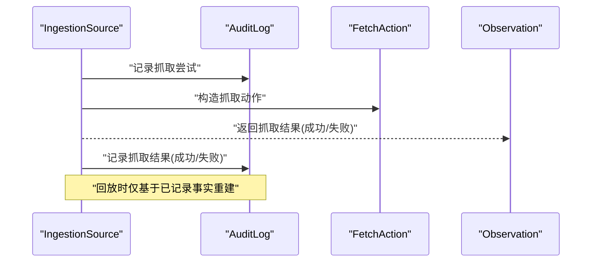
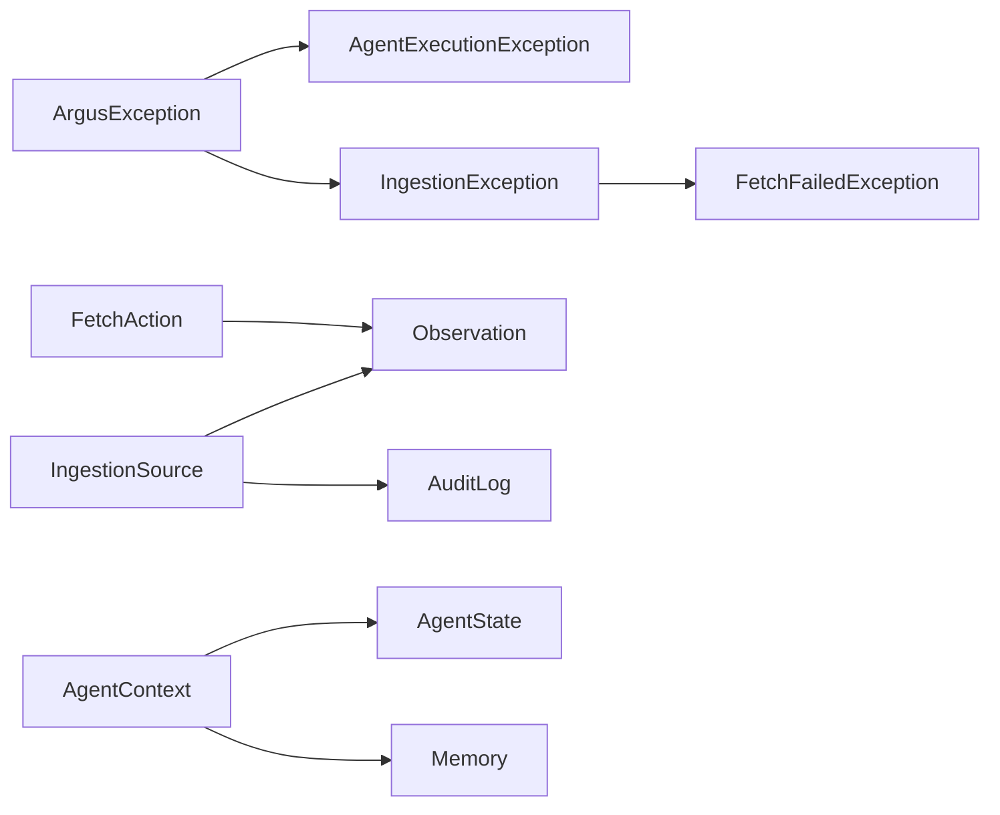

# 故障排除

<cite>
**本文引用的文件**
- [ArgusException.java](file://argus-core/src/main/java/io/argus/core/error/ArgusException.java)
- [AgentExecutionException.java](file://argus-core/src/main/java/io/argus/core/error/AgentExecutionException.java)
- [IngestionException.java](file://argus-ingestion/src/main/java/io/argus/ingestion/error/IngestionException.java)
- [FetchFailedException.java](file://argus-ingestion/src/main/java/io/argus/ingestion/error/FetchFailedException.java)
- [Agent.java](file://argus-core/src/main/java/io/argus/core/agent/Agent.java)
- [AgentContext.java](file://argus-core/src/main/java/io/argus/core/agent/AgentContext.java)
- [AgentState.java](file://argus-core/src/main/java/io/argus/core/agent/AgentState.java)
- [AuditLog.java](file://argus-core/src/main/java/io/argus/core/audit/AuditLog.java)
- [IngestionSource.java](file://argus-ingestion/src/main/java/io/argus/ingestion/source/IngestionSource.java)
- [Memory.java](file://argus-core/src/main/java/io/argus/core/memory/Memory.java)
- [Observation.java](file://argus-core/src/main/java/io/argus/core/observation/Observation.java)
- [FetchAction.java](file://argus-ingestion/src/main/java/io/argus/ingestion/fetch/FetchAction.java)
- [readme.md](file://readme.md)
</cite>

## 目录
1. 引言
2. 项目结构
3. 核心组件
4. 架构总览
5. 详细组件分析
6. 依赖分析
7. 性能考虑
8. 故障排除指南
9. 结论
10. 附录

## 引言
本手册面向使用 Argus 框架进行网络知识获取与 AI 代理集成的开发者与运维人员，聚焦于常见问题的诊断与处置流程。重点覆盖以下方面：
- 异常体系：ArgusException、AgentExecutionException 的排查路径与定位要点
- 网络数据获取失败：IngestionException、FetchFailedException 的成因与处理策略
- 代理执行异常调试：状态检查、执行轨迹分析与回放验证
- 系统级故障：内存溢出、死锁、资源耗尽的识别与缓解
- 预防与应急：故障预防措施、应急响应流程与问题报告模板

## 项目结构
Argus 采用多模块架构，围绕“可审计、可控制、可复现”的设计目标组织：
- argus-core：核心抽象与运行时基础（Agent、Memory、Observation、Audit、Lifecycle 等）
- argus-ingestion：网络数据获取（Fetch、Parse、Policy、Source）与异常建模
- argus-agent：AI 代理集成支持
- argus-runtime：生产级运行时容器

图表来源
- [Agent.java](file://argus-core/src/main/java/io/argus/core/agent/Agent.java#L1-L11)
- [AgentContext.java](file://argus-core/src/main/java/io/argus/core/agent/AgentContext.java#L1-L98)
- [AgentState.java](file://argus-core/src/main/java/io/argus/core/agent/AgentState.java#L1-L81)
- [Memory.java](file://argus-core/src/main/java/io/argus/core/memory/Memory.java#L1-L15)
- [Observation.java](file://argus-core/src/main/java/io/argus/core/observation/Observation.java#L1-L37)
- [AuditLog.java](file://argus-core/src/main/java/io/argus/core/audit/AuditLog.java#L1-L11)
- [IngestionSource.java](file://argus-ingestion/src/main/java/io/argus/ingestion/source/IngestionSource.java#L1-L110)
- [IngestionException.java](file://argus-ingestion/src/main/java/io/argus/ingestion/error/IngestionException.java#L1-L8)
- [FetchFailedException.java](file://argus-ingestion/src/main/java/io/argus/ingestion/error/FetchFailedException.java#L1-L8)
- [FetchAction.java](file://argus-ingestion/src/main/java/io/argus/ingestion/fetch/FetchAction.java#L1-L21)

章节来源
- [readme.md](file://readme.md#L1-L28)

## 核心组件
- Agent 与 AgentContext：定义代理生命周期中的“权威状态”与“瞬态上下文”，二者职责清晰分离，确保可审计与可回放
- AgentState：不可变快照，承载可重放的执行状态
- Memory：非权威记忆检索接口，仅用于推理辅助，不得作为权威状态
- Observation：不可变事实观测，区分“发生了什么”与“应该如何做”
- AuditLog：审计事件记录接口，贯穿 Live/Replay/DryRun
- IngestionSource：外部世界输入的权威边界，负责产生“事实”并保证回放确定性
- 异常体系：ArgusException、AgentExecutionException、IngestionException、FetchFailedException

章节来源
- [Agent.java](file://argus-core/src/main/java/io/argus/core/agent/Agent.java#L1-L11)
- [AgentContext.java](file://argus-core/src/main/java/io/argus/core/agent/AgentContext.java#L1-L98)
- [AgentState.java](file://argus-core/src/main/java/io/argus/core/agent/AgentState.java#L1-L81)
- [Memory.java](file://argus-core/src/main/java/io/argus/core/memory/Memory.java#L1-L15)
- [Observation.java](file://argus-core/src/main/java/io/argus/core/observation/Observation.java#L1-L37)
- [AuditLog.java](file://argus-core/src/main/java/io/argus/core/audit/AuditLog.java#L1-L11)
- [IngestionSource.java](file://argus-ingestion/src/main/java/io/argus/ingestion/source/IngestionSource.java#L1-L110)
- [ArgusException.java](file://argus-core/src/main/java/io/argus/core/error/ArgusException.java#L1-L8)
- [AgentExecutionException.java](file://argus-core/src/main/java/io/argus/core/error/AgentExecutionException.java#L1-L8)
- [IngestionException.java](file://argus-ingestion/src/main/java/io/argus/ingestion/error/IngestionException.java#L1-L8)
- [FetchFailedException.java](file://argus-ingestion/src/main/java/io/argus/ingestion/error/FetchFailedException.java#L1-L8)

## 架构总览
Argus 将“事实采集”与“代理推理”解耦。IngestionSource 负责从外部世界获取事实并以 Observation 形式产出；Agent 通过 AgentContext 访问 Memory 与外部服务，结合 Observation 与 AgentState 决策下一步动作。

图表来源
- [IngestionSource.java](file://argus-ingestion/src/main/java/io/argus/ingestion/source/IngestionSource.java#L1-L110)
- [AuditLog.java](file://argus-core/src/main/java/io/argus/core/audit/AuditLog.java#L1-L11)
- [Agent.java](file://argus-core/src/main/java/io/argus/core/agent/Agent.java#L1-L11)
- [AgentContext.java](file://argus-core/src/main/java/io/argus/core/agent/AgentContext.java#L1-L98)
- [Memory.java](file://argus-core/src/main/java/io/argus/core/memory/Memory.java#L1-L15)
- [Observation.java](file://argus-core/src/main/java/io/argus/core/observation/Observation.java#L1-L37)

## 详细组件分析

### 异常体系与诊断路径
- ArgusException：框架级异常基类，建议用于封装与传播核心运行时错误
- AgentExecutionException：代理执行阶段异常，建议用于捕获代理动作、状态转换、上下文操作等环节的错误
- IngestionException：数据获取阶段异常，建议用于封装网络、解析、策略等环节的失败
- FetchFailedException：抓取失败的具体异常，建议用于网络请求、协议、超时、权限等场景

图表来源
- [ArgusException.java](file://argus-core/src/main/java/io/argus/core/error/ArgusException.java#L1-L8)
- [AgentExecutionException.java](file://argus-core/src/main/java/io/argus/core/error/AgentExecutionException.java#L1-L8)
- [IngestionException.java](file://argus-ingestion/src/main/java/io/argus/ingestion/error/IngestionException.java#L1-L8)
- [FetchFailedException.java](file://argus-ingestion/src/main/java/io/argus/ingestion/error/FetchFailedException.java#L1-L8)

章节来源
- [ArgusException.java](file://argus-core/src/main/java/io/argus/core/error/ArgusException.java#L1-L8)
- [AgentExecutionException.java](file://argus-core/src/main/java/io/argus/core/error/AgentExecutionException.java#L1-L8)
- [IngestionException.java](file://argus-ingestion/src/main/java/io/argus/ingestion/error/IngestionException.java#L1-L8)
- [FetchFailedException.java](file://argus-ingestion/src/main/java/io/argus/ingestion/error/FetchFailedException.java#L1-L8)

### 代理执行与状态检查
- AgentState 不可变且可回放，任何状态变更必须产生新实例
- AgentContext 仅在执行期存在，不可替代 AgentState 的权威性
- Memory 仅提供非权威检索，不得作为决策依据
- AuditLog 记录贯穿执行与回放，便于定位异常时间点与上下文

图表来源
- [AgentState.java](file://argus-core/src/main/java/io/argus/core/agent/AgentState.java#L1-L81)
- [AgentContext.java](file://argus-core/src/main/java/io/argus/core/agent/AgentContext.java#L1-L98)
- [Memory.java](file://argus-core/src/main/java/io/argus/core/memory/Memory.java#L1-L15)
- [Observation.java](file://argus-core/src/main/java/io/argus/core/observation/Observation.java#L1-L37)
- [FetchAction.java](file://argus-ingestion/src/main/java/io/argus/ingestion/fetch/FetchAction.java#L1-L21)

章节来源
- [Agent.java](file://argus-core/src/main/java/io/argus/core/agent/Agent.java#L1-L11)
- [AgentContext.java](file://argus-core/src/main/java/io/argus/core/agent/AgentContext.java#L1-L98)
- [AgentState.java](file://argus-core/src/main/java/io/argus/core/agent/AgentState.java#L1-L81)
- [Memory.java](file://argus-core/src/main/java/io/argus/core/memory/Memory.java#L1-L15)
- [Observation.java](file://argus-core/src/main/java/io/argus/core/observation/Observation.java#L1-L37)
- [FetchAction.java](file://argus-ingestion/src/main/java/io/argus/ingestion/fetch/FetchAction.java#L1-L21)

### 网络数据获取与抓取失败
- IngestionSource 负责权威边界内的事实采集，必须在回放模式下不访问外部世界
- FetchAction 代表抓取动作，其元数据可用于审计与追踪
- FetchFailedException 用于表达抓取失败，应结合审计日志定位具体失败原因

图表来源
- [IngestionSource.java](file://argus-ingestion/src/main/java/io/argus/ingestion/source/IngestionSource.java#L1-L110)
- [AuditLog.java](file://argus-core/src/main/java/io/argus/core/audit/AuditLog.java#L1-L11)
- [FetchAction.java](file://argus-ingestion/src/main/java/io/argus/ingestion/fetch/FetchAction.java#L1-L21)
- [Observation.java](file://argus-core/src/main/java/io/argus/core/observation/Observation.java#L1-L37)

章节来源
- [IngestionSource.java](file://argus-ingestion/src/main/java/io/argus/ingestion/source/IngestionSource.java#L1-L110)
- [FetchAction.java](file://argus-ingestion/src/main/java/io/argus/ingestion/fetch/FetchAction.java#L1-L21)
- [FetchFailedException.java](file://argus-ingestion/src/main/java/io/argus/ingestion/error/FetchFailedException.java#L1-L8)

## 依赖分析
- 异常类之间形成清晰的继承关系，便于按层次捕获与处理
- IngestionSource 依赖 Observation 与 AuditLog，强调事实性与可审计性
- AgentContext 依赖 AgentState 与 Memory，强调执行期上下文与非权威记忆的边界
- FetchAction 实现 Action 接口，承载抓取动作语义

图表来源
- [ArgusException.java](file://argus-core/src/main/java/io/argus/core/error/ArgusException.java#L1-L8)
- [AgentExecutionException.java](file://argus-core/src/main/java/io/argus/core/error/AgentExecutionException.java#L1-L8)
- [IngestionException.java](file://argus-ingestion/src/main/java/io/argus/ingestion/error/IngestionException.java#L1-L8)
- [FetchFailedException.java](file://argus-ingestion/src/main/java/io/argus/ingestion/error/FetchFailedException.java#L1-L8)
- [IngestionSource.java](file://argus-ingestion/src/main/java/io/argus/ingestion/source/IngestionSource.java#L1-L110)
- [Observation.java](file://argus-core/src/main/java/io/argus/core/observation/Observation.java#L1-L37)
- [AuditLog.java](file://argus-core/src/main/java/io/argus/core/audit/AuditLog.java#L1-L11)
- [AgentContext.java](file://argus-core/src/main/java/io/argus/core/agent/AgentContext.java#L1-L98)
- [AgentState.java](file://argus-core/src/main/java/io/argus/core/agent/AgentState.java#L1-L81)
- [Memory.java](file://argus-core/src/main/java/io/argus/core/memory/Memory.java#L1-L15)
- [FetchAction.java](file://argus-ingestion/src/main/java/io/argus/ingestion/fetch/FetchAction.java#L1-L21)

## 性能考虑
- 回放确定性：避免在 AgentState 中隐藏状态，确保回放不依赖 AgentContext
- 审计成本：在高吞吐场景下，合理裁剪审计粒度，但保留关键失败事件
- 记忆检索：Memory 仅用于短期推理缓冲，避免将其作为持久化存储
- 抓取策略：在 IngestionSource 中实现速率限制与重试策略，降低外部依赖抖动对系统的影响

## 故障排除指南

### 一、异常排查流程

#### 1) ArgusException
- 典型表现：框架级错误，通常由基础设施或核心运行时问题引发
- 排查步骤
  - 检查异常堆栈中涉及的核心模块（core/ingestion/agent/runtime）
  - 对照审计日志，定位异常发生的时间点与上下文
  - 若为代理执行相关，优先检查 AgentState 与 AgentContext 的一致性
- 处置建议
  - 将通用错误包装为 ArgusException，统一上报与归档
  - 区分是否可恢复：若可恢复，记录回放所需的状态快照

章节来源
- [ArgusException.java](file://argus-core/src/main/java/io/argus/core/error/ArgusException.java#L1-L8)
- [AuditLog.java](file://argus-core/src/main/java/io/argus/core/audit/AuditLog.java#L1-L11)

#### 2) AgentExecutionException
- 典型表现：代理在执行动作、状态转换或上下文操作时抛出
- 排查步骤
  - 捕获异常前后的 AgentState 快照，确认状态变更是否符合预期
  - 检查 AgentContext 是否包含临时状态导致的非幂等行为
  - 使用回放验证：在 DryRun/Replay 模式下重放相同输入，确认异常是否可重现
- 处置建议
  - 将不可恢复的执行错误转为 AgentExecutionException，并记录必要的审计事件
  - 对可恢复错误，提供最小化补偿措施并确保不破坏回放一致性

章节来源
- [AgentExecutionException.java](file://argus-core/src/main/java/io/argus/core/error/AgentExecutionException.java#L1-L8)
- [AgentState.java](file://argus-core/src/main/java/io/argus/core/agent/AgentState.java#L1-L81)
- [AgentContext.java](file://argus-core/src/main/java/io/argus/core/agent/AgentContext.java#L1-L98)

#### 3) IngestionException 与 FetchFailedException
- 典型表现：网络数据获取失败，可能由超时、权限、协议错误、限流等引起
- 排查步骤
  - 查看审计日志中的抓取尝试与失败事件，定位失败阶段
  - 检查 IngestionSource 的执行模式（LIVE/REPLAY/DRY_RUN），确认是否在回放中误用外部调用
  - 分析 FetchAction 的元数据与请求快照，核对目标地址、参数、认证信息
- 处置建议
  - 对可重试场景（如网络抖动）配置指数退避与最大重试次数
  - 对永久性失败（如权限不足）提供明确的错误码与提示信息
  - 在回放模式下，确保仅依赖已记录的事实，避免引入新的外部副作用

章节来源
- [IngestionException.java](file://argus-ingestion/src/main/java/io/argus/ingestion/error/IngestionException.java#L1-L8)
- [FetchFailedException.java](file://argus-ingestion/src/main/java/io/argus/ingestion/error/FetchFailedException.java#L1-L8)
- [IngestionSource.java](file://argus-ingestion/src/main/java/io/argus/ingestion/source/IngestionSource.java#L1-L110)
- [FetchAction.java](file://argus-ingestion/src/main/java/io/argus/ingestion/fetch/FetchAction.java#L1-L21)

### 二、代理执行异常调试技巧
- 状态检查
  - 对比前后 AgentState，确认状态变更是否符合动作语义
  - 避免将关键决策写入 AgentContext，确保回放可重构
- 执行轨迹分析
  - 通过审计日志串联“尝试—结果—后续动作”，定位异常分支
  - 在 DryRun/Replay 模式下重放，验证异常是否可稳定复现
- 回放验证
  - 将关键输入与请求快照保存为可审计证据
  - 确保回放不访问外部世界，仅依赖历史事实

章节来源
- [Agent.java](file://argus-core/src/main/java/io/argus/core/agent/Agent.java#L1-L11)
- [AgentContext.java](file://argus-core/src/main/java/io/argus/core/agent/AgentContext.java#L1-L98)
- [AgentState.java](file://argus-core/src/main/java/io/argus/core/agent/AgentState.java#L1-L81)
- [AuditLog.java](file://argus-core/src/main/java/io/argus/core/audit/AuditLog.java#L1-L11)

### 三、系统级故障排查
- 内存溢出
  - 现象：GC 频繁、Full GC 时间过长、OOM
  - 排查：检查 Memory 使用量与生命周期，确认是否存在未释放的外部客户端句柄
  - 处置：限制短期缓冲大小，及时释放外部资源，必要时拆分任务批次
- 死锁
  - 现象：线程停滞、无进度
  - 排查：结合审计日志定位并发热点，检查外部系统（数据库/缓存/HTTP）的锁竞争
  - 处置：引入超时与重试，避免跨模块阻塞；必要时降级为单线程执行
- 资源耗尽
  - 现象：连接池耗尽、文件描述符不足、CPU 占满
  - 排查：监控外部依赖的连接数、并发数与超时阈值
  - 处置：调整限流策略、增加连接池容量、优化批处理与异步化

### 四、故障预防与应急响应
- 预防措施
  - 明确职责边界：AgentState 与 AgentContext、Memory 与外部系统
  - 审计全覆盖：所有关键动作均需记录审计事件
  - 回放可用：确保回放不依赖外部世界，仅使用历史事实
- 应急响应
  - 快速隔离：停止受影响的任务队列，避免扩大影响
  - 降级策略：关闭非关键功能，启用只读回放模式
  - 恢复验证：在 DryRun/Replay 下验证修复效果后再上线

### 五、问题报告标准格式
- 基本信息
  - 模块：core/ingestion/agent/runtime
  - 版本：框架版本与构建号
  - 环境：JVM 版本、操作系统、部署方式
- 事件摘要
  - 异常类型与堆栈摘要
  - 发生时间与频率
- 复现步骤
  - 最小化输入与请求快照
  - 关键审计事件序列
- 影响范围
  - 受影响的数据集/任务数
  - 是否可回放与回滚范围
- 已采取措施
  - 当前状态与已尝试的修复
- 附件
  - 审计日志片段
  - AgentState 快照（如有）

## 结论
Argus 通过清晰的职责边界与可审计机制，为复杂代理系统的故障诊断提供了坚实基础。遵循本文的异常排查流程、代理调试技巧与系统级故障处理方法，可显著缩短定位时间并提升稳定性。同时，完善的预防与应急流程有助于在问题发生时快速止损与恢复。

## 附录

### A. 错误代码与异常信息解读指引
- ArgusException：框架级错误，通常需要升级或修复基础设施
- AgentExecutionException：代理执行错误，优先检查状态与上下文一致性
- IngestionException：获取阶段错误，优先检查网络与策略配置
- FetchFailedException：抓取失败，优先检查目标可达性与认证信息

章节来源
- [ArgusException.java](file://argus-core/src/main/java/io/argus/core/error/ArgusException.java#L1-L8)
- [AgentExecutionException.java](file://argus-core/src/main/java/io/argus/core/error/AgentExecutionException.java#L1-L8)
- [IngestionException.java](file://argus-ingestion/src/main/java/io/argus/ingestion/error/IngestionException.java#L1-L8)
- [FetchFailedException.java](file://argus-ingestion/src/main/java/io/argus/ingestion/error/FetchFailedException.java#L1-L8)

### B. 信息收集清单
- 模块与版本
- JVM 与操作系统信息
- 异常堆栈与审计日志
- 请求快照与 AgentState 快照
- 外部依赖的访问日志（网络/数据库）
- 回放模式下的 DryRun 输出