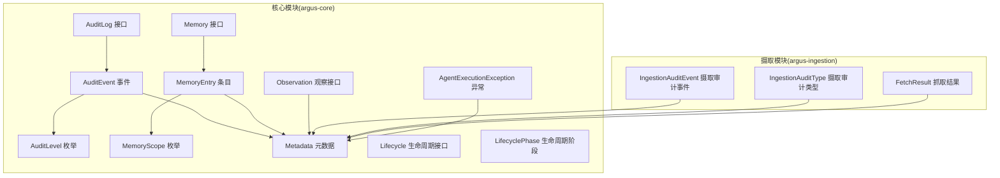
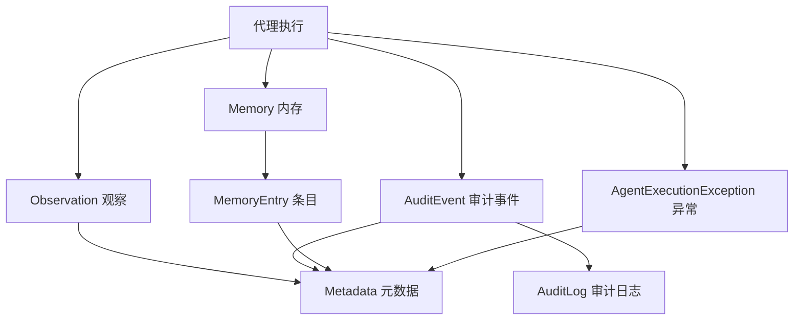
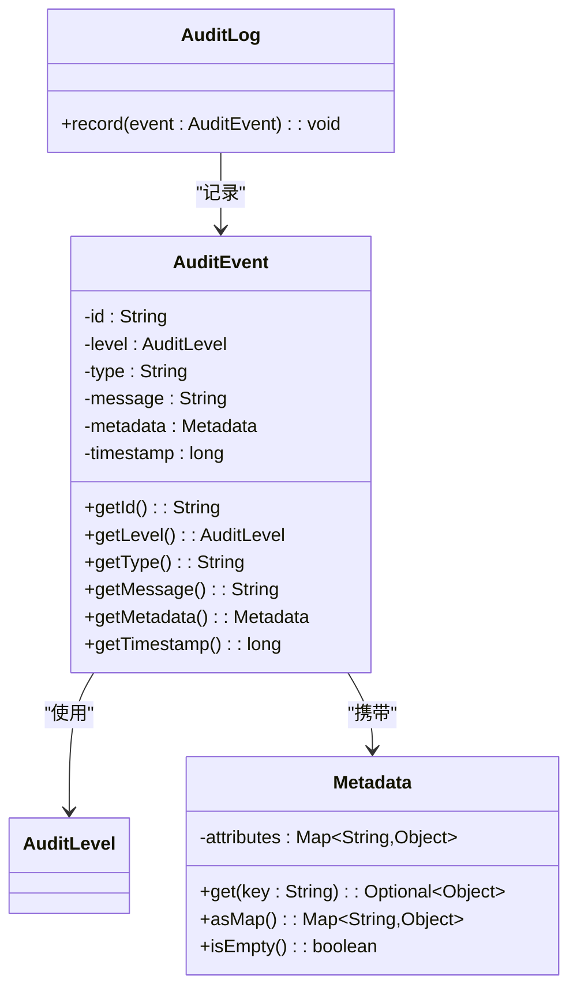
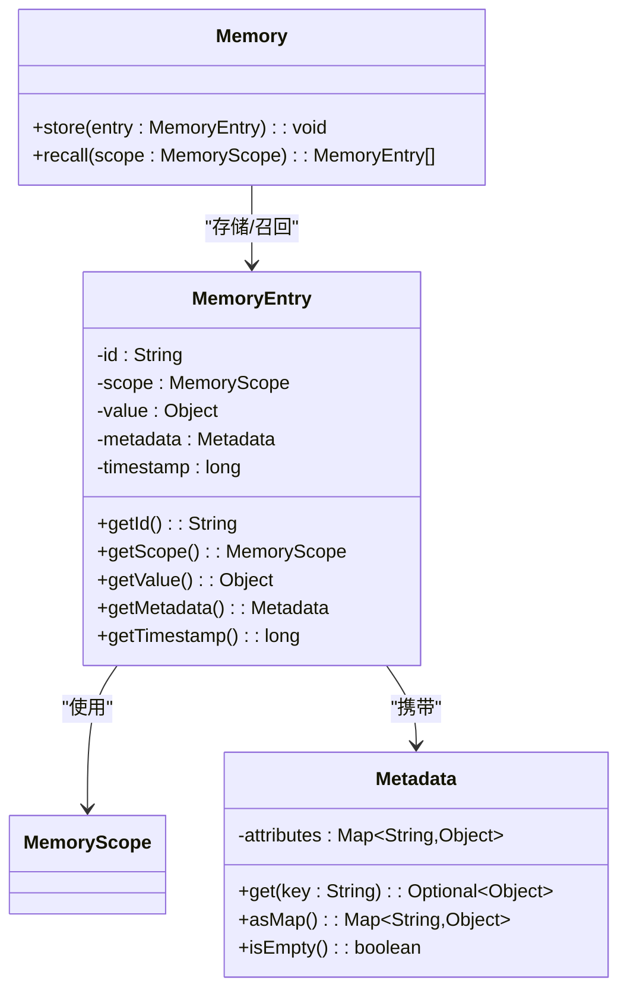
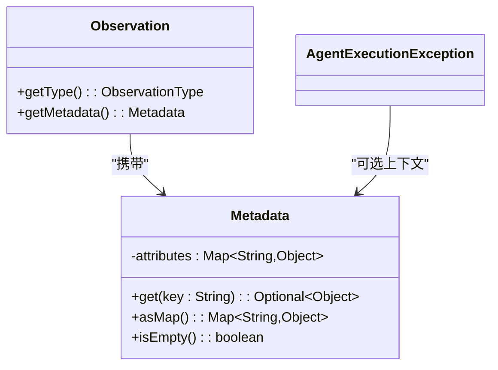
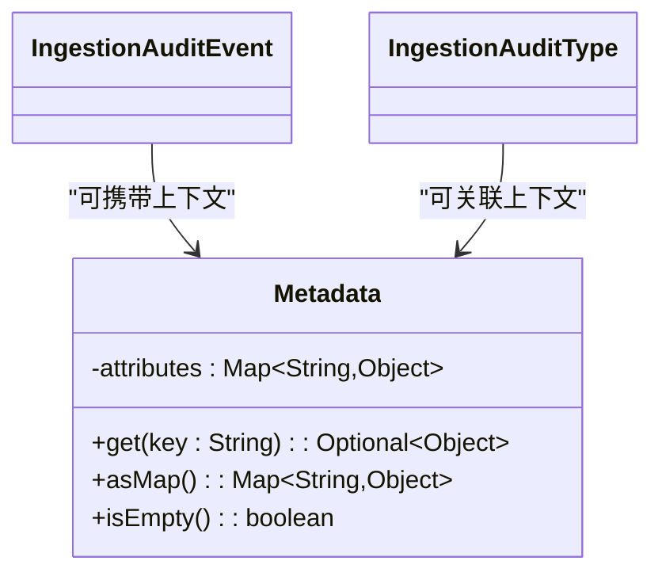
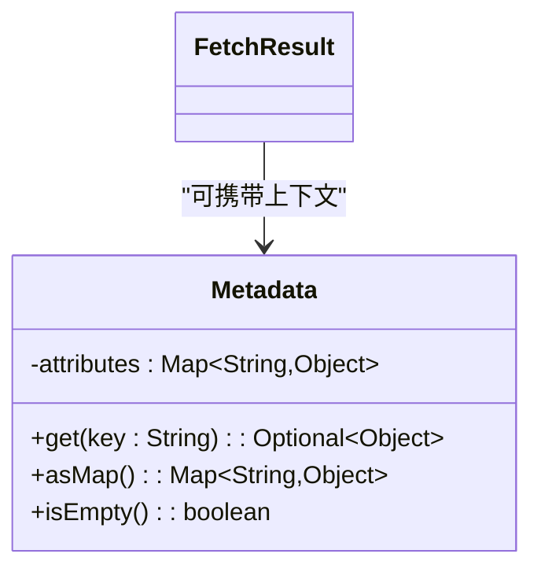
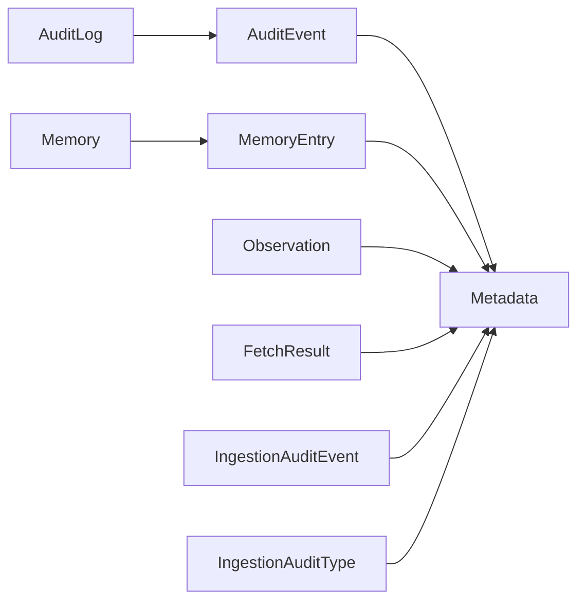

# 监控日志

<cite>
**本文引用的文件**
- [readme.md](file://readme.md)
- [AuditLog.java](file://argus-core/src/main/java/io/argus/core/audit/AuditLog.java)
- [AuditEvent.java](file://argus-core/src/main/java/io/argus/core/audit/AuditEvent.java)
- [AuditLevel.java](file://argus-core/src/main/java/io/argus/core/audit/AuditLevel.java)
- [IngestionAuditEvent.java](file://argus-ingestion/src/main/java/io/argus/ingestion/audit/IngestionAuditEvent.java)
- [IngestionAuditType.java](file://argus-ingestion/src/main/java/io/argus/ingestion/audit/IngestionAuditType.java)
- [Memory.java](file://argus-core/src/main/java/io/argus/core/memory/Memory.java)
- [MemoryEntry.java](file://argus-core/src/main/java/io/argus/core/memory/MemoryEntry.java)
- [MemoryScope.java](file://argus-core/src/main/java/io/argus/core/memory/MemoryScope.java)
- [Metadata.java](file://argus-core/src/main/java/io/argus/core/model/Metadata.java)
- [Observation.java](file://argus-core/src/main/java/io/argus/core/observation/Observation.java)
- [Lifecycle.java](file://argus-core/src/main/java/io/argus/core/lifecycle/Lifecycle.java)
- [LifecyclePhase.java](file://argus-core/src/main/java/io/argus/core/lifecycle/LifecyclePhase.java)
- [AgentExecutionException.java](file://argus-core/src/main/java/io/argus/core/error/AgentExecutionException.java)
- [FetchResult.java](file://argus-ingestion/src/main/java/io/argus/ingestion/fetch/FetchResult.java)
</cite>

## 目录
1. [简介](#简介)
2. [项目结构](#项目结构)
3. [核心组件](#核心组件)
4. [架构总览](#架构总览)
5. [详细组件分析](#详细组件分析)
6. [依赖分析](#依赖分析)
7. [性能考虑](#性能考虑)
8. [故障排查指南](#故障排查指南)
9. [结论](#结论)
10. [附录](#附录)

## 简介
本指南围绕Argus框架的监控与日志配置展开，重点覆盖以下方面：
- 可审计性系统：AuditLog接口与AuditEvent事件模型的配置与记录机制
- 性能指标采集与监控策略：代理执行时间、内存使用与网络请求统计
- 日志配置最佳实践：日志级别、日志轮转与存储策略
- 监控仪表板搭建：关键指标的可视化展示建议
- 告警机制配置：阈值设定与通知策略
- 故障诊断方法与工具：日志分析与性能分析技术

Argus的设计原则强调可审计、可控制、可复现，这为构建完善的监控与日志体系提供了清晰的方向。

**章节来源**
- [readme.md](file://readme.md#L23-L28)

## 项目结构
Argus采用多模块结构，核心能力集中在核心模块，网络数据获取能力位于独立模块，便于扩展与维护。下图展示了与监控和日志密切相关的模块与关键类关系：

**图表来源**
- [AuditLog.java](file://argus-core/src/main/java/io/argus/core/audit/AuditLog.java#L7-L11)
- [AuditEvent.java](file://argus-core/src/main/java/io/argus/core/audit/AuditEvent.java#L9-L60)
- [AuditLevel.java](file://argus-core/src/main/java/io/argus/core/audit/AuditLevel.java#L7-L8)
- [Memory.java](file://argus-core/src/main/java/io/argus/core/memory/Memory.java#L9-L15)
- [MemoryEntry.java](file://argus-core/src/main/java/io/argus/core/memory/MemoryEntry.java#L9-L53)
- [MemoryScope.java](file://argus-core/src/main/java/io/argus/core/memory/MemoryScope.java#L7-L8)
- [Metadata.java](file://argus-core/src/main/java/io/argus/core/model/Metadata.java#L12-L34)
- [Observation.java](file://argus-core/src/main/java/io/argus/core/observation/Observation.java#L31-L37)
- [Lifecycle.java](file://argus-core/src/main/java/io/argus/core/lifecycle/Lifecycle.java#L7-L8)
- [LifecyclePhase.java](file://argus-core/src/main/java/io/argus/core/lifecycle/LifecyclePhase.java#L7-L8)
- [AgentExecutionException.java](file://argus-core/src/main/java/io/argus/core/error/AgentExecutionException.java#L7-L8)
- [IngestionAuditEvent.java](file://argus-ingestion/src/main/java/io/argus/ingestion/audit/IngestionAuditEvent.java#L7-L8)
- [IngestionAuditType.java](file://argus-ingestion/src/main/java/io/argus/ingestion/audit/IngestionAuditType.java#L7-L8)
- [FetchResult.java](file://argus-ingestion/src/main/java/io/argus/ingestion/fetch/FetchResult.java#L7-L8)

**章节来源**
- [readme.md](file://readme.md#L7-L14)

## 核心组件
本节聚焦于与监控和日志直接相关的组件，包括审计、内存、元数据与观察等。

- 审计接口与事件
  - AuditLog：定义统一的审计记录入口，所有审计事件通过该接口进行持久化或上报
  - AuditEvent：不可变的审计事件载体，包含标识、级别、类型、消息、元数据与时间戳
  - AuditLevel：审计事件的严重等级枚举（需在实现中补充具体等级）
- 内存与条目
  - Memory：抽象的内存存储接口，提供存储与召回能力
  - MemoryEntry：内存中的条目，包含标识、作用域、值、元数据与时间戳
  - MemoryScope：内存作用域枚举（需在实现中补充具体范围）
- 元数据
  - Metadata：不可变键值对容器，提供只读访问与空值安全查询
- 观察与生命周期
  - Observation：代理在执行过程中观察到的事实，包含类型与元数据
  - Lifecycle/LifecyclePhase：生命周期接口与阶段，可用于监控系统启动、停止与异常阶段

**章节来源**
- [AuditLog.java](file://argus-core/src/main/java/io/argus/core/audit/AuditLog.java#L7-L11)
- [AuditEvent.java](file://argus-core/src/main/java/io/argus/core/audit/AuditEvent.java#L9-L60)
- [AuditLevel.java](file://argus-core/src/main/java/io/argus/core/audit/AuditLevel.java#L7-L8)
- [Memory.java](file://argus-core/src/main/java/io/argus/core/memory/Memory.java#L9-L15)
- [MemoryEntry.java](file://argus-core/src/main/java/io/argus/core/memory/MemoryEntry.java#L9-L53)
- [MemoryScope.java](file://argus-core/src/main/java/io/argus/core/memory/MemoryScope.java#L7-L8)
- [Metadata.java](file://argus-core/src/main/java/io/argus/core/model/Metadata.java#L12-L34)
- [Observation.java](file://argus-core/src/main/java/io/argus/core/observation/Observation.java#L31-L37)
- [Lifecycle.java](file://argus-core/src/main/java/io/argus/core/lifecycle/Lifecycle.java#L7-L8)
- [LifecyclePhase.java](file://argus-core/src/main/java/io/argus/core/lifecycle/LifecyclePhase.java#L7-L8)

## 架构总览
下图展示了监控与日志在Argus中的整体交互：代理执行产生观察与异常，审计事件通过统一接口记录；内存用于临时存储中间结果；元数据承载上下文信息；生命周期阶段用于监控系统状态。

**图表来源**
- [Observation.java](file://argus-core/src/main/java/io/argus/core/observation/Observation.java#L31-L37)
- [AgentExecutionException.java](file://argus-core/src/main/java/io/argus/core/error/AgentExecutionException.java#L7-L8)
- [AuditEvent.java](file://argus-core/src/main/java/io/argus/core/audit/AuditEvent.java#L9-L60)
- [AuditLog.java](file://argus-core/src/main/java/io/argus/core/audit/AuditLog.java#L7-L11)
- [Memory.java](file://argus-core/src/main/java/io/argus/core/memory/Memory.java#L9-L15)
- [MemoryEntry.java](file://argus-core/src/main/java/io/argus/core/memory/MemoryEntry.java#L9-L53)
- [Metadata.java](file://argus-core/src/main/java/io/argus/core/model/Metadata.java#L12-L34)

## 详细组件分析

### 审计系统：AuditLog 与 AuditEvent
- AuditLog接口定义了统一的记录入口，实现方负责将AuditEvent持久化或上报至集中式审计平台
- AuditEvent作为不可变对象，承载审计所需的最小必要信息，结合Metadata可扩展上下文
- AuditLevel用于区分事件严重程度，建议在实现中补充具体等级（如INFO、WARN、ERROR、FATAL）

**图表来源**
- [AuditLog.java](file://argus-core/src/main/java/io/argus/core/audit/AuditLog.java#L7-L11)
- [AuditEvent.java](file://argus-core/src/main/java/io/argus/core/audit/AuditEvent.java#L9-L60)
- [AuditLevel.java](file://argus-core/src/main/java/io/argus/core/audit/AuditLevel.java#L7-L8)
- [Metadata.java](file://argus-core/src/main/java/io/argus/core/model/Metadata.java#L12-L34)

**章节来源**
- [AuditLog.java](file://argus-core/src/main/java/io/argus/core/audit/AuditLog.java#L7-L11)
- [AuditEvent.java](file://argus-core/src/main/java/io/argus/core/audit/AuditEvent.java#L9-L60)
- [AuditLevel.java](file://argus-core/src/main/java/io/argus/core/audit/AuditLevel.java#L7-L8)
- [Metadata.java](file://argus-core/src/main/java/io/argus/core/model/Metadata.java#L12-L34)

### 内存系统：Memory 与 MemoryEntry
- Memory接口提供存储与召回能力，适合缓存短期中间结果以支撑性能监控
- MemoryEntry封装条目的标识、作用域、值与时间戳，并通过Metadata扩展上下文
- MemoryScope用于限定召回范围，建议按会话、任务或全局维度划分

**图表来源**
- [Memory.java](file://argus-core/src/main/java/io/argus/core/memory/Memory.java#L9-L15)
- [MemoryEntry.java](file://argus-core/src/main/java/io/argus/core/memory/MemoryEntry.java#L9-L53)
- [MemoryScope.java](file://argus-core/src/main/java/io/argus/core/memory/MemoryScope.java#L7-L8)
- [Metadata.java](file://argus-core/src/main/java/io/argus/core/model/Metadata.java#L12-L34)

**章节来源**
- [Memory.java](file://argus-core/src/main/java/io/argus/core/memory/Memory.java#L9-L15)
- [MemoryEntry.java](file://argus-core/src/main/java/io/argus/core/memory/MemoryEntry.java#L9-L53)
- [MemoryScope.java](file://argus-core/src/main/java/io/argus/core/memory/MemoryScope.java#L7-L8)
- [Metadata.java](file://argus-core/src/main/java/io/argus/core/model/Metadata.java#L12-L34)

### 观察与异常：Observation 与 AgentExecutionException
- Observation接口用于表达代理观察到的事实，结合Metadata可承载性能与状态信息
- AgentExecutionException用于捕获代理执行中的异常，便于统一记录与告警

**图表来源**
- [Observation.java](file://argus-core/src/main/java/io/argus/core/observation/Observation.java#L31-L37)
- [AgentExecutionException.java](file://argus-core/src/main/java/io/argus/core/error/AgentExecutionException.java#L7-L8)
- [Metadata.java](file://argus-core/src/main/java/io/argus/core/model/Metadata.java#L12-L34)

**章节来源**
- [Observation.java](file://argus-core/src/main/java/io/argus/core/observation/Observation.java#L31-L37)
- [AgentExecutionException.java](file://argus-core/src/main/java/io/argus/core/error/AgentExecutionException.java#L7-L8)
- [Metadata.java](file://argus-core/src/main/java/io/argus/core/model/Metadata.java#L12-L34)

### 摄取审计：IngestionAuditEvent 与 IngestionAuditType
- 摄取模块提供审计事件与类型的占位类，建议在实现中补充具体的审计类型与事件内容，以便对网络抓取与解析过程进行可观测

**图表来源**
- [IngestionAuditEvent.java](file://argus-ingestion/src/main/java/io/argus/ingestion/audit/IngestionAuditEvent.java#L7-L8)
- [IngestionAuditType.java](file://argus-ingestion/src/main/java/io/argus/ingestion/audit/IngestionAuditType.java#L7-L8)
- [Metadata.java](file://argus-core/src/main/java/io/argus/core/model/Metadata.java#L12-L34)

**章节来源**
- [IngestionAuditEvent.java](file://argus-ingestion/src/main/java/io/argus/ingestion/audit/IngestionAuditEvent.java#L7-L8)
- [IngestionAuditType.java](file://argus-ingestion/src/main/java/io/argus/ingestion/audit/IngestionAuditType.java#L7-L8)
- [Metadata.java](file://argus-core/src/main/java/io/argus/core/model/Metadata.java#L12-L34)

### 网络抓取结果：FetchResult
- FetchResult用于承载抓取阶段的结果，可结合Metadata记录网络请求耗时、状态码、重试次数等性能指标

**图表来源**
- [FetchResult.java](file://argus-ingestion/src/main/java/io/argus/ingestion/fetch/FetchResult.java#L7-L8)
- [Metadata.java](file://argus-core/src/main/java/io/argus/core/model/Metadata.java#L12-L34)

**章节来源**
- [FetchResult.java](file://argus-ingestion/src/main/java/io/argus/ingestion/fetch/FetchResult.java#L7-L8)
- [Metadata.java](file://argus-core/src/main/java/io/argus/core/model/Metadata.java#L12-L34)

## 依赖分析
- 组件内聚与耦合
  - AuditEvent与Metadata强耦合，确保审计事件具备可检索的上下文
  - MemoryEntry与Metadata强耦合，便于在内存中保留带上下文的观测与中间结果
  - Observation与Metadata强耦合，便于在代理执行过程中携带性能与状态信息
- 外部依赖与集成点
  - AuditLog为外部实现点，可对接集中式审计平台或本地文件系统
  - Memory为可插拔组件，可对接本地缓存或分布式存储
  - FetchResult与IngestionAuditEvent/Type为网络层可观测性的扩展点

**图表来源**
- [AuditEvent.java](file://argus-core/src/main/java/io/argus/core/audit/AuditEvent.java#L9-L60)
- [Metadata.java](file://argus-core/src/main/java/io/argus/core/model/Metadata.java#L12-L34)
- [MemoryEntry.java](file://argus-core/src/main/java/io/argus/core/memory/MemoryEntry.java#L9-L53)
- [Memory.java](file://argus-core/src/main/java/io/argus/core/memory/Memory.java#L9-L15)
- [Observation.java](file://argus-core/src/main/java/io/argus/core/observation/Observation.java#L31-L37)
- [AuditLog.java](file://argus-core/src/main/java/io/argus/core/audit/AuditLog.java#L7-L11)
- [FetchResult.java](file://argus-ingestion/src/main/java/io/argus/ingestion/fetch/FetchResult.java#L7-L8)
- [IngestionAuditEvent.java](file://argus-ingestion/src/main/java/io/argus/ingestion/audit/IngestionAuditEvent.java#L7-L8)
- [IngestionAuditType.java](file://argus-ingestion/src/main/java/io/argus/ingestion/audit/IngestionAuditType.java#L7-L8)

**章节来源**
- [AuditEvent.java](file://argus-core/src/main/java/io/argus/core/audit/AuditEvent.java#L9-L60)
- [Metadata.java](file://argus-core/src/main/java/io/argus/core/model/Metadata.java#L12-L34)
- [MemoryEntry.java](file://argus-core/src/main/java/io/argus/core/memory/MemoryEntry.java#L9-L53)
- [Memory.java](file://argus-core/src/main/java/io/argus/core/memory/Memory.java#L9-L15)
- [Observation.java](file://argus-core/src/main/java/io/argus/core/observation/Observation.java#L31-L37)
- [AuditLog.java](file://argus-core/src/main/java/io/argus/core/audit/AuditLog.java#L7-L11)
- [FetchResult.java](file://argus-ingestion/src/main/java/io/argus/ingestion/fetch/FetchResult.java#L7-L8)
- [IngestionAuditEvent.java](file://argus-ingestion/src/main/java/io/argus/ingestion/audit/IngestionAuditEvent.java#L7-L8)
- [IngestionAuditType.java](file://argus-ingestion/src/main/java/io/argus/ingestion/audit/IngestionAuditType.java#L7-L8)

## 性能考虑
- 代理执行时间
  - 在代理循环前后记录时间戳，结合Metadata记录执行阶段与耗时，用于生成执行时间序列
  - 使用Memory缓存最近N次执行的耗时，便于计算均值、P95等指标
- 内存使用
  - 利用MemoryEntry记录内存占用快照与时间戳，结合Metadata标注来源（如任务ID、阶段）
  - MemoryScope按任务或会话隔离，避免跨任务干扰
- 网络请求统计
  - FetchResult中记录状态码、耗时、重试次数与目标URL，结合Metadata标注来源与上下文
  - 将网络统计聚合为速率、错误率与延迟分布，用于仪表板展示
- 指标采集策略
  - 采用周期性采样与事件驱动采样相结合：关键事件必须记录，常规指标定期汇总
  - 对高基数标签（如URL）进行采样或聚合，避免指标风暴

[本节为通用性能指导，无需特定文件引用]

## 故障排查指南
- 日志分析
  - 使用AuditEvent记录关键路径与异常事件，结合Metadata定位上下文
  - 对AgentExecutionException进行统一捕获与记录，形成异常趋势与根因分析
- 性能分析
  - 通过MemoryEntry记录的执行时间与内存快照，定位性能瓶颈
  - 结合FetchResult的网络统计，识别慢请求与失败热点
- 诊断流程
  - 采集期：开启细粒度日志与性能采样
  - 分析期：利用AuditEvent与MemoryEntry进行回放与对比
  - 修复期：根据Metadata中的上下文信息快速定位问题并验证修复

**章节来源**
- [AgentExecutionException.java](file://argus-core/src/main/java/io/argus/core/error/AgentExecutionException.java#L7-L8)
- [AuditEvent.java](file://argus-core/src/main/java/io/argus/core/audit/AuditEvent.java#L9-L60)
- [MemoryEntry.java](file://argus-core/src/main/java/io/argus/core/memory/MemoryEntry.java#L9-L53)
- [FetchResult.java](file://argus-ingestion/src/main/java/io/argus/ingestion/fetch/FetchResult.java#L7-L8)

## 结论
Argus框架通过AuditEvent/AuditLog、Memory/MemoryEntry与Metadata等核心组件，为监控与日志提供了清晰的抽象与扩展点。结合本文的配置与实践建议，可在保证可审计性的同时，建立完善的性能监控、日志管理与故障诊断体系。

[本节为总结性内容，无需特定文件引用]

## 附录
- 监控仪表板建议
  - 关键指标：代理执行时间（均值/P95）、内存占用峰值、网络请求速率与错误率、异常数量
  - 展示方式：折线图（趋势）、柱状图（分布）、热力图（按来源/类型聚合）
- 告警机制建议
  - 阈值：执行时间P95超过基线XX%、错误率超过X%、内存占用超过Y%
  - 通知：邮件/IM/电话分级通知，结合Metadata中的环境与任务标签精准定位
- 日志配置最佳实践
  - 级别：生产环境INFO及以上，关键路径DEBUG
  - 轮转：按大小与时间轮转，保留7-30天
  - 存储：本地落盘+归档到对象存储，索引与检索能力可选

[本节为通用实践建议，无需特定文件引用]