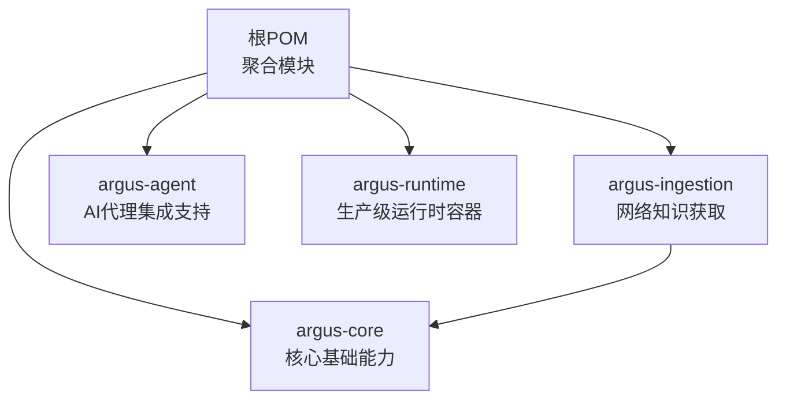
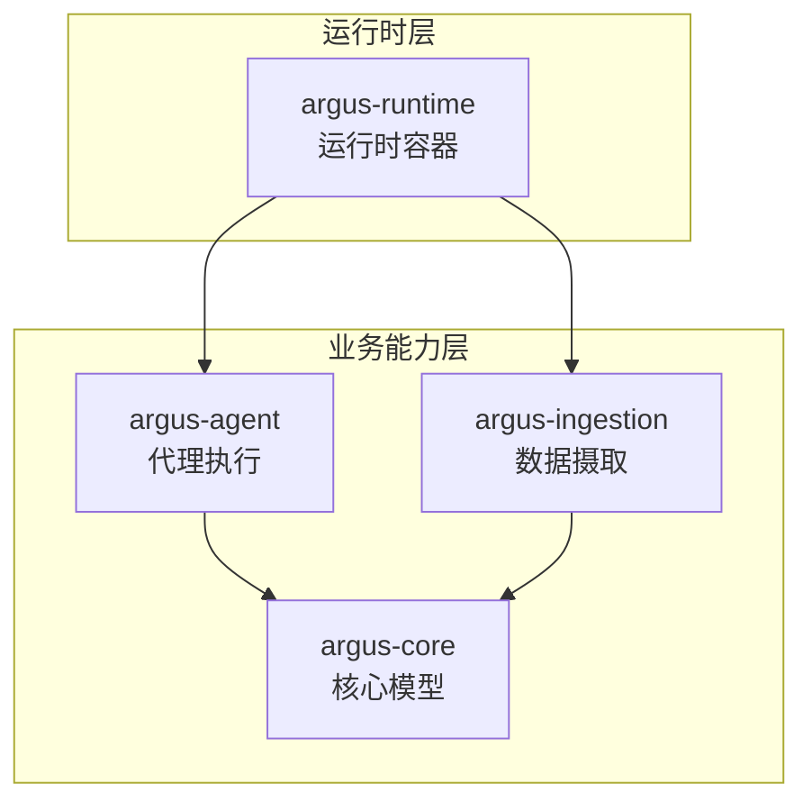
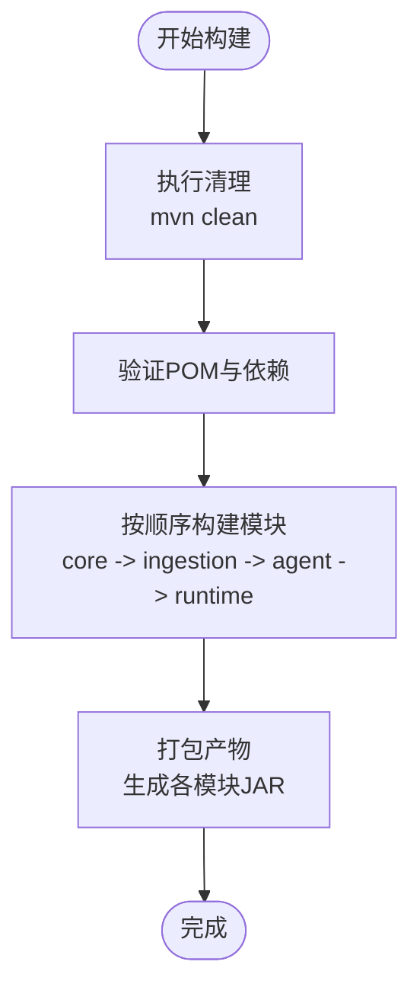
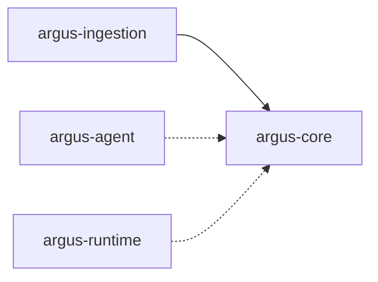

# 部署指南

<cite>
**本文引用的文件**
- [根POM](file://pom.xml)
- [核心模块POM](file://argus-core/pom.xml)
- [数据摄取模块POM](file://argus-ingestion/pom.xml)
- [代理模块POM](file://argus-agent/pom.xml)
- [运行时模块POM](file://argus-runtime/pom.xml)
- [项目说明](file://readme.md)
</cite>

## 目录
1. [简介](#简介)
2. [项目结构](#项目结构)
3. [核心组件](#核心组件)
4. [架构总览](#架构总览)
5. [详细组件分析](#详细组件分析)
6. [依赖关系分析](#依赖关系分析)
7. [性能考虑](#性能考虑)
8. [故障排查指南](#故障排查指南)
9. [结论](#结论)
10. [附录](#附录)

## 简介
本指南面向生产环境部署Argus框架，涵盖Maven构建配置、模块依赖管理与打包策略，并提供容器化与Kubernetes部署的实施建议。同时给出微服务集成思路、高可用部署策略、多环境配置差异与最佳实践，以及部署前的环境准备与预检清单。

## 项目结构
Argus采用多模块Maven聚合工程组织，顶层POM声明了四个子模块：核心、数据摄取、代理与运行时。各模块通过父POM继承版本与属性，形成统一的构建与发布体系。

图表来源
- [根POM](file://pom.xml#L24-L29)
- [核心模块POM](file://argus-core/pom.xml#L6-L10)
- [数据摄取模块POM](file://argus-ingestion/pom.xml#L5-L9)
- [代理模块POM](file://argus-agent/pom.xml#L5-L9)
- [运行时模块POM](file://argus-runtime/pom.xml#L5-L9)

章节来源
- [根POM](file://pom.xml#L1-L40)
- [项目说明](file://readme.md#L7-L15)

## 核心组件
- argus-core：提供动作(Action)、代理(Agent)、记忆(Memory)、观察(Observation)等基础模型与生命周期抽象，是其他模块的基础依赖。
- argus-ingestion：实现抓取(Fetch)、解析(Parse)、策略(Policy)等功能，依赖argus-core。
- argus-agent：提供代理循环与状态管理，用于在运行时驱动Agent执行。
- argus-runtime：作为生产级运行时容器，承载上述能力并提供可部署的运行时构件。

章节来源
- [项目说明](file://readme.md#L9-L14)
- [核心模块POM](file://argus-core/pom.xml#L1-L18)
- [数据摄取模块POM](file://argus-ingestion/pom.xml#L1-L29)
- [代理模块POM](file://argus-agent/pom.xml#L1-L23)
- [运行时模块POM](file://argus-runtime/pom.xml#L1-L22)

## 架构总览
下图展示Argus在生产环境中的典型部署形态：运行时容器承载Agent与Ingestion能力，通过策略与配置实现可审计、可控制、可复现的数据获取与执行。

图表来源
- [根POM](file://pom.xml#L24-L29)
- [核心模块POM](file://argus-core/pom.xml#L6-L10)
- [数据摄取模块POM](file://argus-ingestion/pom.xml#L21-L27)
- [代理模块POM](file://argus-agent/pom.xml#L5-L9)
- [运行时模块POM](file://argus-runtime/pom.xml#L5-L9)

## 详细组件分析

### Maven构建与打包策略
- 聚合工程：顶层POM以POM打包方式聚合四个子模块，便于统一版本与属性管理。
- 版本与编码：统一源码字符集与版本号，确保跨模块一致性。
- 测试依赖：顶层声明测试依赖，供所有模块共享。
- 子模块依赖：数据摄取模块显式依赖核心模块；代理与运行时模块未声明额外依赖，保持轻量。

图表来源
- [根POM](file://pom.xml#L19-L21)
- [项目说明](file://readme.md#L18-L21)

章节来源
- [根POM](file://pom.xml#L1-L40)
- [项目说明](file://readme.md#L18-L21)

### 容器化与Kubernetes部署建议
说明：当前仓库未包含Dockerfile或Kubernetes配置文件。以下为通用实践建议，便于在生产环境中落地。

- Docker镜像构建
  - 基础镜像：选择精简的OpenJDK运行时镜像。
  - 多阶段构建：使用构建阶段产出JAR，运行阶段仅复制必要文件，减小镜像体积。
  - 入口命令：设置JAVA_OPTS与主类，暴露健康检查端口。
  - 安全：非root用户运行，最小权限原则。
- Kubernetes部署
  - Deployment：定义副本数、滚动更新策略与资源限制。
  - Service：暴露运行时端口，支持ClusterIP或LoadBalancer。
  - ConfigMap/Secret：注入运行参数、日志级别与外部服务地址。
  - 健康检查：liveness/readiness探针指向健康检查端点。
  - Pod亲和性/反亲和性：结合节点标签实现高可用部署。
  - Ingress：对外暴露API或管理接口（如需）。
- 日志与监控
  - 标准输出采集，结合集中式日志系统。
  - 暴露指标端点，接入Prometheus与告警系统。

[本节为通用实践建议，不直接分析具体文件，故无“章节来源”]

### 微服务架构集成指南
- 边界划分：将Argus运行时作为独立服务，通过HTTP或消息队列与现有微服务交互。
- 接口设计：围绕Agent执行与Ingestion任务设计REST或事件驱动接口。
- 认证与授权：在网关层统一鉴权，Argus内部通过服务间信任或令牌传递。
- 配置中心：将运行时参数、策略与外部系统凭据集中管理。
- 链路追踪：为每个请求生成Trace ID，贯穿Argus与上游服务。
- 限流与熔断：在网关或Argus侧设置QPS与超时策略，避免雪崩。

[本节为通用实践建议，不直接分析具体文件，故无“章节来源”]

### 集群配置与高可用部署策略
- 负载均衡：Kubernetes Service或外部LB分发流量至多个Pod实例。
- 故障转移：副本数≥2，滚动更新配合就绪探针，确保零停机。
- 状态管理：运行时应无状态化，状态通过外部存储（数据库/对象存储）持久化。
- 数据一致性：对关键操作使用幂等设计，结合重试与去重机制。
- 灾备：跨可用区部署，定期备份配置与日志。

[本节为通用实践建议，不直接分析具体文件，故无“章节来源”]

### 不同环境的配置差异与最佳实践
- 开发环境
  - 日志级别：DEBUG，开启详细审计。
  - 超时与重试：较短超时，快速反馈。
  - 依赖：本地或内网服务，简化认证。
- 测试环境
  - 日志级别：INFO，保留关键审计。
  - 资源：适度压测资源，模拟真实负载。
  - 策略：启用部分限流与降级开关。
- 生产环境
  - 日志级别：WARN/ERROR为主，关键审计保留。
  - 资源：明确CPU/内存配额与HPA策略。
  - 安全：严格访问控制、TLS加密、只读文件系统。
  - 可观测性：完善指标、日志与链路追踪。

[本节为通用实践建议，不直接分析具体文件，故无“章节来源”]

## 依赖关系分析
Argus模块间的依赖关系清晰：数据摄取依赖核心模块，代理与运行时模块未声明额外依赖，便于按需组合。

图表来源
- [数据摄取模块POM](file://argus-ingestion/pom.xml#L21-L27)

章节来源
- [数据摄取模块POM](file://argus-ingestion/pom.xml#L1-L29)

## 性能考虑
- 构建性能
  - 使用并行构建与合适的线程数，减少重复编译。
  - 将测试排除在常规构建之外，仅在CI中执行。
- 运行时性能
  - 合理设置JVM堆大小与GC策略，结合应用特性调优。
  - 对I/O密集型任务（抓取/解析）使用异步与连接池。
  - 通过指标监控吞吐与延迟，识别瓶颈。
- 扩展性
  - 无状态化设计，支持水平扩展。
  - 使用队列或事件总线解耦上下游，提升弹性。

[本节为通用实践建议，不直接分析具体文件，故无“章节来源”]

## 故障排查指南
- 构建失败
  - 检查Java与Maven版本是否满足要求。
  - 清理本地仓库中损坏的依赖缓存。
  - 确认网络可访问中央仓库或配置私有仓库。
- 运行异常
  - 查看启动日志与健康检查端点响应。
  - 检查配置文件路径与权限，确认敏感信息已正确注入。
  - 关注审计日志，定位异常Agent或Ingestion任务。
- 性能问题
  - 分析GC日志与线程转储，识别内存泄漏或阻塞。
  - 对比指标曲线，定位热点模块与慢查询。

[本节为通用实践建议，不直接分析具体文件，故无“章节来源”]

## 结论
Argus框架通过清晰的模块化设计与统一的Maven构建体系，为生产环境提供了可审计、可控制、可复现的能力基座。结合本文提供的容器化与Kubernetes部署建议、微服务集成思路、高可用策略与多环境最佳实践，可在企业级环境中稳定落地。

## 附录
- 快速开始命令参考
  - 编译打包：使用顶层POM进行全模块构建与打包。
- 预检清单
  - 环境：安装并验证Java与Maven版本。
  - 网络：可访问依赖仓库，代理与防火墙放行必要端口。
  - 安全：准备证书与密钥，规划只读文件系统与最小权限。
  - 观测：准备日志、指标与链路追踪基础设施。

章节来源
- [项目说明](file://readme.md#L18-L21)