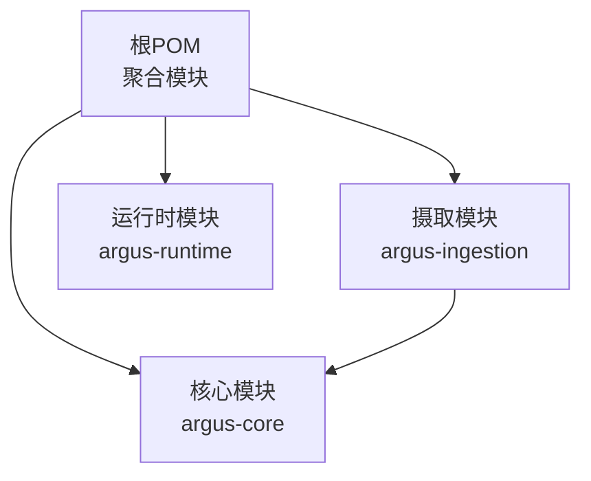
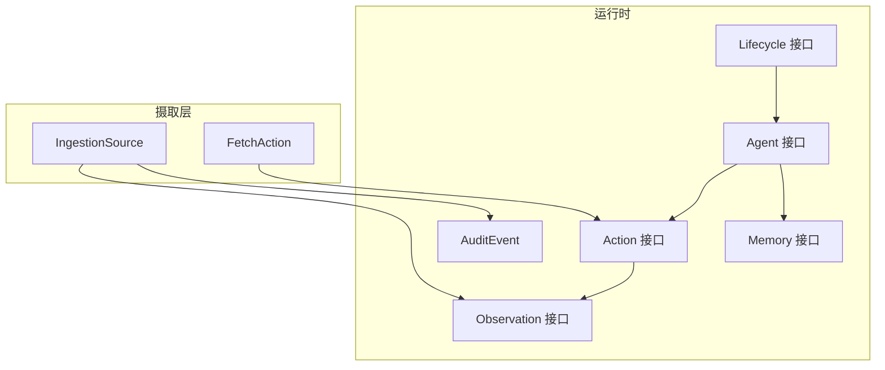
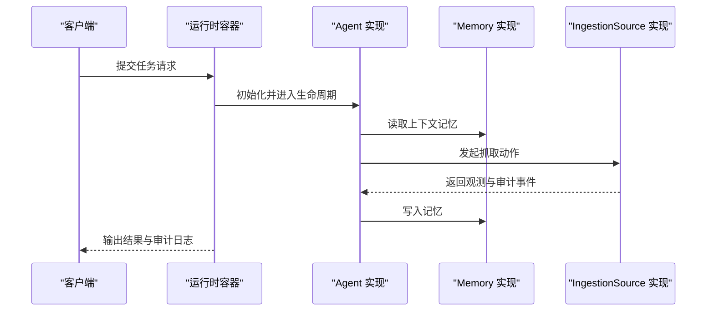
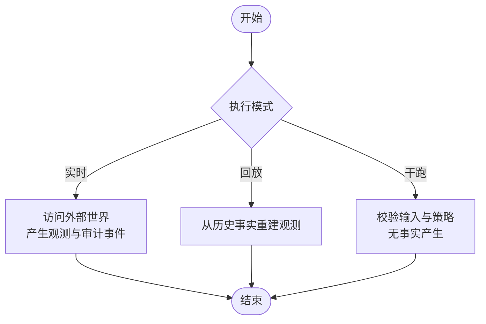
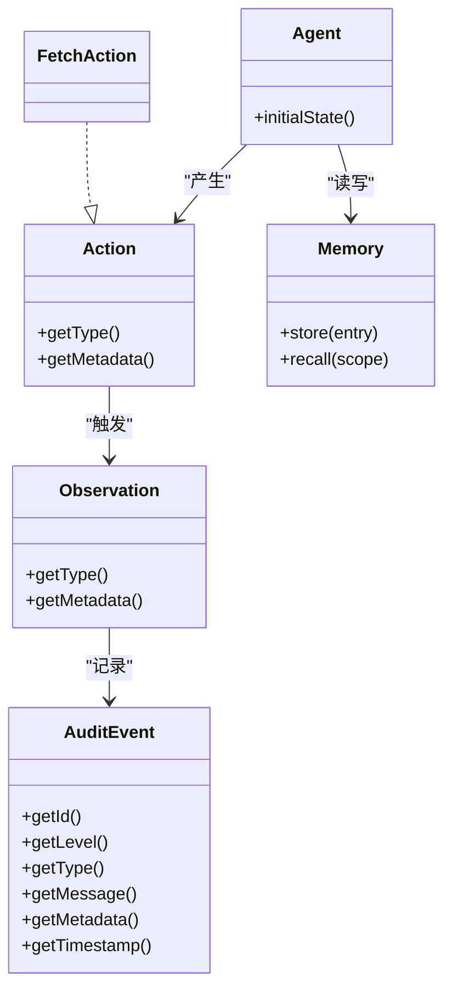
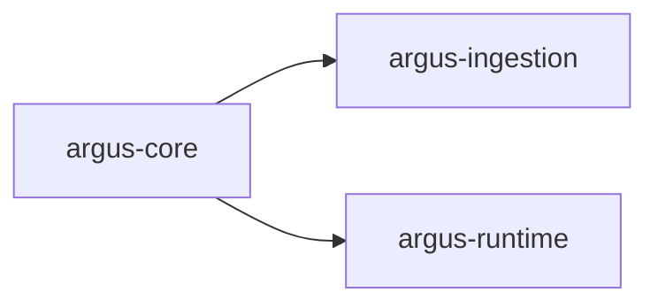

# 部署运维

<cite>
**本文引用的文件**
- [根POM](file://pom.xml)
- [核心模块POM](file://argus-core/pom.xml)
- [摄取模块POM](file://argus-ingestion/pom.xml)
- [运行时模块POM](file://argus-runtime/pom.xml)
- [README](file://readme.md)
- [Agent接口](file://argus-core/src/main/java/io/argus/core/agent/Agent.java)
- [记忆接口](file://argus-core/src/main/java/io/argus/core/memory/Memory.java)
- [动作接口](file://argus-core/src/main/java/io/argus/core/action/Action.java)
- [观测接口](file://argus-core/src/main/java/io/argus/core/observation/Observation.java)
- [生命周期接口](file://argus-core/src/main/java/io/argus/core/lifecycle/Lifecycle.java)
- [审计事件类](file://argus-core/src/main/java/io/argus/core/audit/AuditEvent.java)
- [抓取动作实现](file://argus-ingestion/src/main/java/io/argus/ingestion/fetch/FetchAction.java)
- [摄取源定义](file://argus-ingestion/src/main/java/io/argus/ingestion/source/IngestionSource.java)
</cite>

## 目录
1. [简介](#简介)
2. [项目结构](#项目结构)
3. [核心组件](#核心组件)
4. [架构总览](#架构总览)
5. [详细组件分析](#详细组件分析)
6. [依赖关系分析](#依赖关系分析)
7. [性能考虑](#性能考虑)
8. [故障排除指南](#故障排除指南)
9. [结论](#结论)
10. [附录](#附录)

## 简介
本指南面向Argus框架的生产部署与运维，结合当前仓库中的模块结构与核心接口，给出容器化部署、微服务集成、集群配置、监控日志、性能调优、故障排除、备份恢复与安全加固等运维实践建议。由于当前仓库以接口与抽象为主，部署侧重点在于如何将这些抽象能力打包为可运行的容器镜像，并在生产环境中通过统一的运行时进行编排与治理。

## 项目结构
Argus采用多模块Maven聚合工程组织，核心模块提供运行时抽象与契约，摄取模块提供网络数据获取能力，运行时模块提供生产级容器封装。模块间通过依赖关系形成清晰的分层：运行时模块依赖核心模块；摄取模块依赖核心模块；应用侧可按需引入运行时模块以获得完整的运行时能力。

图表来源
- [根POM](file://pom.xml#L24-L29)
- [核心模块POM](file://argus-core/pom.xml#L6-L15)
- [摄取模块POM](file://argus-ingestion/pom.xml#L5-L19)
- [运行时模块POM](file://argus-runtime/pom.xml#L5-L19)

章节来源
- [根POM](file://pom.xml#L1-L40)
- [README](file://readme.md#L7-L14)

## 核心组件
- Agent接口：定义代理的初始状态入口，作为运行时调度与生命周期管理的起点。
- Memory接口：提供记忆存储与召回能力，支持按作用域检索历史信息。
- Action接口：声明代理意图的抽象，强调语义分类与元数据承载，避免在动作中内嵌执行细节。
- Observation接口：表达代理所感知到的事实，强调不可变性与语义分类。
- AuditEvent：审计事件载体，记录可审计、可追溯的运行轨迹。
- IngestionSource：定义与外部世界的权威边界，负责产生“事实”观测，并支持回放模式。
- FetchAction：具体动作实现示例，体现动作与执行解耦的设计思想。
- Lifecycle：生命周期抽象，便于运行时统一管理启动、运行与停止流程。

章节来源
- [Agent接口](file://argus-core/src/main/java/io/argus/core/agent/Agent.java#L7-L11)
- [记忆接口](file://argus-core/src/main/java/io/argus/core/memory/Memory.java#L9-L15)
- [动作接口](file://argus-core/src/main/java/io/argus/core/action/Action.java#L37-L43)
- [观测接口](file://argus-core/src/main/java/io/argus/core/observation/Observation.java#L31-L37)
- [审计事件类](file://argus-core/src/main/java/io/argus/core/audit/AuditEvent.java#L9-L60)
- [摄取源定义](file://argus-ingestion/src/main/java/io/argus/ingestion/source/IngestionSource.java#L109-L110)
- [抓取动作实现](file://argus-ingestion/src/main/java/io/argus/ingestion/fetch/FetchAction.java#L11-L21)
- [生命周期接口](file://argus-core/src/main/java/io/argus/core/lifecycle/Lifecycle.java#L7-L8)

## 架构总览
Argus的运行时架构围绕“可审计、可控制、可复现”的设计原则构建。运行时负责调度代理、协调动作与观测、维护记忆与审计日志，并通过摄取源与外部世界交互。摄取源在不同执行模式下（实时、回放、干跑）提供一致的行为语义，确保结果可复现且审计完整。

图表来源
- [Agent接口](file://argus-core/src/main/java/io/argus/core/agent/Agent.java#L7-L11)
- [动作接口](file://argus-core/src/main/java/io/argus/core/action/Action.java#L37-L43)
- [观测接口](file://argus-core/src/main/java/io/argus/core/observation/Observation.java#L31-L37)
- [记忆接口](file://argus-core/src/main/java/io/argus/core/memory/Memory.java#L9-L15)
- [审计事件类](file://argus-core/src/main/java/io/argus/core/audit/AuditEvent.java#L9-L60)
- [生命周期接口](file://argus-core/src/main/java/io/argus/core/lifecycle/Lifecycle.java#L7-L8)
- [摄取源定义](file://argus-ingestion/src/main/java/io/argus/ingestion/source/IngestionSource.java#L109-L110)
- [抓取动作实现](file://argus-ingestion/src/main/java/io/argus/ingestion/fetch/FetchAction.java#L11-L21)

## 详细组件分析

### 组件A：运行时容器与编排
- 容器化建议
  - 基于运行时模块产物构建镜像，暴露必要的健康检查端点与配置挂载点。
  - 将Agent实现、动作扩展与摄取策略以插件形式打包，通过配置动态加载。
  - 使用只读根文件系统与最小权限原则，敏感配置通过密钥管理服务注入。
- 微服务集成
  - 运行时作为独立服务，通过消息队列或HTTP接口接收任务请求，输出观测与审计事件。
  - 与外部系统通过标准化的摄取源协议对接，确保回放一致性。
- 集群配置
  - 使用副本数与亲和性策略保证高可用与就近处理。
  - 通过水平扩展应对峰值流量，结合限流与重试策略保障稳定性。

图表来源
- [Agent接口](file://argus-core/src/main/java/io/argus/core/agent/Agent.java#L7-L11)
- [记忆接口](file://argus-core/src/main/java/io/argus/core/memory/Memory.java#L9-L15)
- [摄取源定义](file://argus-ingestion/src/main/java/io/argus/ingestion/source/IngestionSource.java#L109-L110)

章节来源
- [运行时模块POM](file://argus-runtime/pom.xml#L11-L19)

### 组件B：摄取源与回放语义
- 回放模式
  - 在回放模式下，摄取源仅基于已记录的事实重建观测，不得再次访问外部世界。
  - 所有请求快照必须完整，确保审计与复现的完整性。
- 干跑模式
  - 干跑用于验证输入与策略，不产生事实，仅产出审计事件。
- 审计与不可变事实
  - 成功的摄取即为“事实”，必须不可变且权威，支撑后续推理与回溯。

图表来源
- [摄取源定义](file://argus-ingestion/src/main/java/io/argus/ingestion/source/IngestionSource.java#L75-L83)
- [摄取源定义](file://argus-ingestion/src/main/java/io/argus/ingestion/source/IngestionSource.java#L40-L51)

章节来源
- [摄取源定义](file://argus-ingestion/src/main/java/io/argus/ingestion/source/IngestionSource.java#L1-L110)

### 组件C：动作与观测模型
- 动作模型
  - 动作强调“意图”而非“执行细节”，通过类型与元数据承载领域信息。
  - 抓取动作作为示例，展示如何将具体行为映射到抽象动作接口。
- 观测模型
  - 观测是不可变的事实，用于驱动代理决策，但不包含行为指令。
  - 类型与元数据共同描述观测的语义与上下文。

图表来源
- [动作接口](file://argus-core/src/main/java/io/argus/core/action/Action.java#L37-L43)
- [观测接口](file://argus-core/src/main/java/io/argus/core/observation/Observation.java#L31-L37)
- [抓取动作实现](file://argus-ingestion/src/main/java/io/argus/ingestion/fetch/FetchAction.java#L11-L21)
- [Agent接口](file://argus-core/src/main/java/io/argus/core/agent/Agent.java#L7-L11)
- [记忆接口](file://argus-core/src/main/java/io/argus/core/memory/Memory.java#L9-L15)
- [审计事件类](file://argus-core/src/main/java/io/argus/core/audit/AuditEvent.java#L9-L60)

章节来源
- [动作接口](file://argus-core/src/main/java/io/argus/core/action/Action.java#L1-L43)
- [观测接口](file://argus-core/src/main/java/io/argus/core/observation/Observation.java#L1-L37)
- [抓取动作实现](file://argus-ingestion/src/main/java/io/argus/ingestion/fetch/FetchAction.java#L1-L21)

## 依赖关系分析
- 模块依赖
  - 运行时模块依赖核心模块，提供运行时容器能力。
  - 摄取模块依赖核心模块，复用动作、观测、记忆与审计等抽象。
- 外部依赖
  - 测试依赖Junit，生产侧应移除测试范围依赖，避免污染运行时镜像。
- 版本与兼容
  - 当前各模块版本一致，升级时建议同步更新以保持契约兼容。

图表来源
- [根POM](file://pom.xml#L24-L29)
- [核心模块POM](file://argus-core/pom.xml#L6-L15)
- [摄取模块POM](file://argus-ingestion/pom.xml#L21-L27)
- [运行时模块POM](file://argus-runtime/pom.xml#L5-L19)

章节来源
- [根POM](file://pom.xml#L31-L38)
- [核心模块POM](file://argus-core/pom.xml#L1-L18)
- [摄取模块POM](file://argus-ingestion/pom.xml#L1-L29)
- [运行时模块POM](file://argus-runtime/pom.xml#L1-L22)

## 性能考虑
- 内存使用优化
  - 合理设置运行时堆大小与GC参数，结合业务峰值流量评估内存占用。
  - 利用记忆作用域进行数据分区，避免全局缓存膨胀。
- 并发处理
  - 通过线程池与异步I/O提升摄取吞吐，同时限制最大并发以防止外部系统过载。
  - 在回放模式下尽量减少外部依赖，优先使用本地缓存与历史事实。
- 资源管理
  - 为运行时容器设置CPU与内存配额，启用水平扩展与自动伸缩策略。
  - 对外部抓取操作实施速率限制与重试退避，避免抖动放大。

## 故障排除指南
- 常见问题
  - 审计缺失：确认摄取源是否在所有模式下均发出审计事件。
  - 回放异常：检查请求快照是否完整，确保回放期间不访问外部世界。
  - 记忆不一致：核对记忆存储实现与作用域划分，避免跨会话污染。
- 诊断方法
  - 采集运行时日志与审计事件，定位失败节点与时间窗口。
  - 在干跑模式下验证输入与策略，快速隔离问题范围。
  - 对比实时与回放结果，验证事实的权威性与一致性。

章节来源
- [审计事件类](file://argus-core/src/main/java/io/argus/core/audit/AuditEvent.java#L9-L60)
- [摄取源定义](file://argus-ingestion/src/main/java/io/argus/ingestion/source/IngestionSource.java#L64-L74)
- [摄取源定义](file://argus-ingestion/src/main/java/io/argus/ingestion/source/IngestionSource.java#L40-L51)

## 结论
Argus框架通过清晰的模块划分与抽象契约，为生产级部署提供了坚实基础。结合本文的容器化、微服务集成、集群配置、监控日志、性能调优与故障排除建议，可在保证可审计、可控制与可复现的前提下，稳定地支撑大规模网络知识获取与AI代理场景。

## 附录
- 快速开始
  - 编译打包：使用Maven聚合构建，生成各模块产物。
- 版本升级与兼容
  - 升级时保持模块版本一致，优先进行干跑与回放验证，确保契约兼容。
- 安全配置
  - 最小权限与只读根文件系统；敏感配置通过密钥管理服务注入；启用网络策略与镜像签名。
- 备份与恢复
  - 定期备份审计事件与记忆数据；制定回放验证清单，确保恢复后一致性。
- 灾难恢复
  - 建立多活或多可用区部署；配置自动故障转移与数据复制；定期演练恢复流程。

章节来源
- [README](file://readme.md#L16-L21)
- [根POM](file://pom.xml#L19-L22)