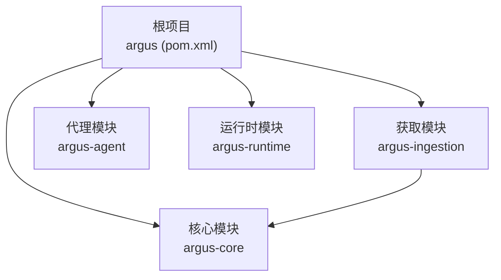
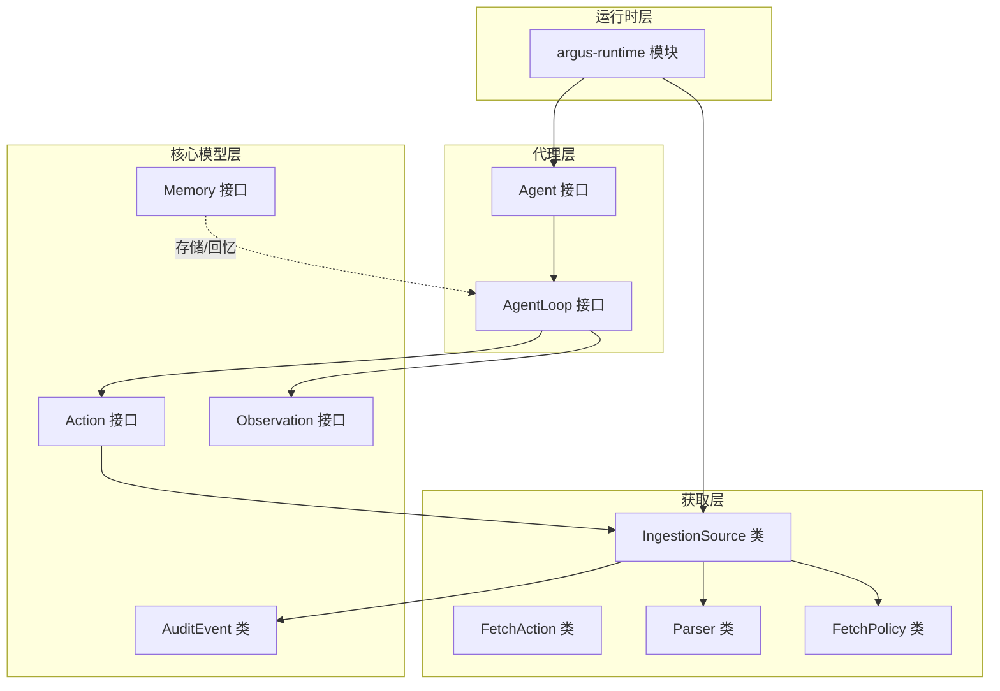
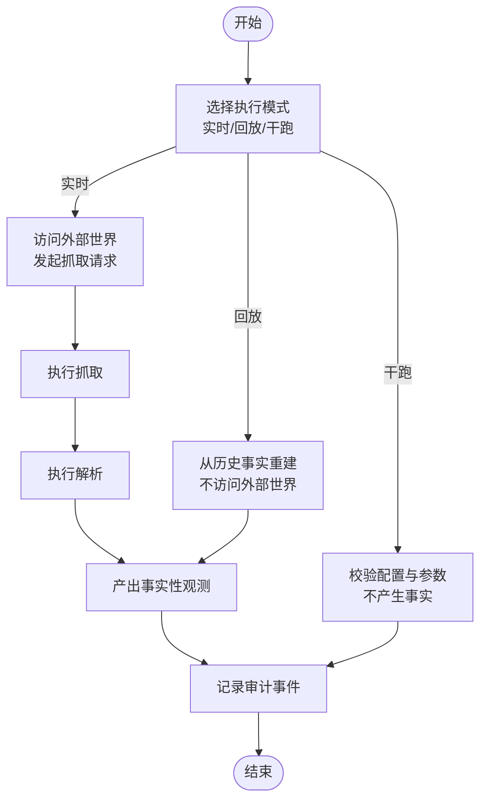
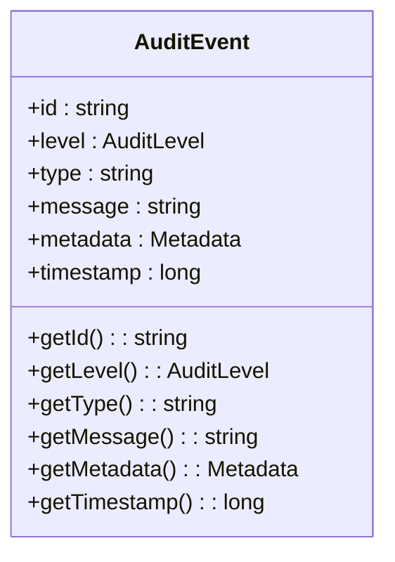
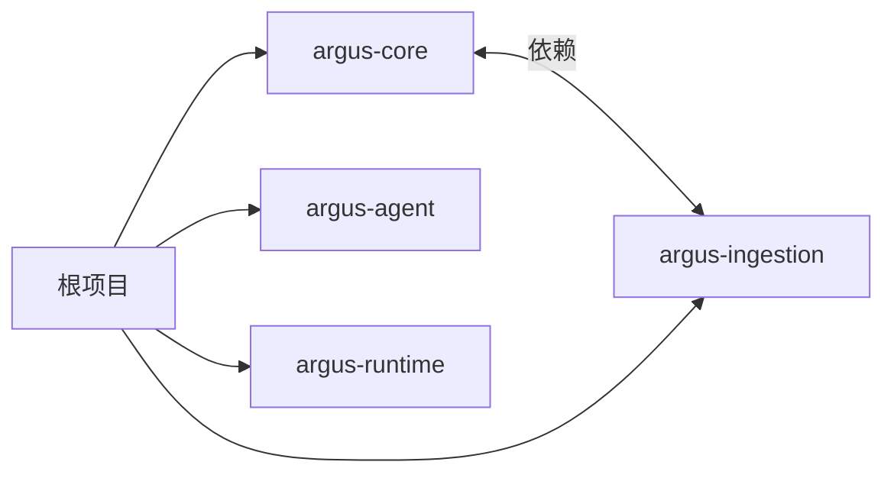

# 项目概述

<cite>
**本文引用的文件**
- [readme.md](file://readme.md)
- [pom.xml](file://pom.xml)
- [argus-core/pom.xml](file://argus-core/pom.xml)
- [argus-ingestion/pom.xml](file://argus-ingestion/pom.xml)
- [argus-agent/pom.xml](file://argus-agent/pom.xml)
- [argus-runtime/pom.xml](file://argus-runtime/pom.xml)
- [Action.java](file://argus-core/src/main/java/io/argus/core/action/Action.java)
- [Agent.java](file://argus-core/src/main/java/io/argus/core/agent/Agent.java)
- [AgentLoop.java](file://argus-core/src/main/java/io/argus/core/agent/AgentLoop.java)
- [Memory.java](file://argus-core/src/main/java/io/argus/core/memory/Memory.java)
- [Observation.java](file://argus-core/src/main/java/io/argus/core/observation/Observation.java)
- [AuditEvent.java](file://argus-core/src/main/java/io/argus/core/audit/AuditEvent.java)
- [FetchAction.java](file://argus-ingestion/src/main/java/io/argus/ingestion/fetch/FetchAction.java)
- [IngestionSource.java](file://argus-ingestion/src/main/java/io/argus/ingestion/source/IngestionSource.java)
- [Parser.java](file://argus-ingestion/src/main/java/io/argus/ingestion/parse/Parser.java)
- [FetchPolicy.java](file://argus-ingestion/src/main/java/io/argus/ingestion/policy/FetchPolicy.java)
</cite>

## 目录
1. 引言
2. 项目结构
3. 核心组件
4. 架构总览
5. 详细组件分析
6. 依赖分析
7. 性能考虑
8. 故障排查指南
9. 结论
10. 附录

## 引言
Argus 是面向网络知识获取与 AI 代理的“全视”运行时，定位于为基于代理的系统提供可审计、可控制、可复现的网络数据获取能力。其核心使命是通过严谨的执行模型与事实性观测机制，确保代理在与外部世界交互时的行为具备透明可追溯、行为确定可控、结果一致可复现的特性。Argus 的设计理念强调“事实优先”的数据获取范式：任何成功获取的数据都应作为不可变的事实，既可用于实时推理，也可用于回放与审计。

Argus 在 AI 代理生态中的定位是“基础设施层”。它不直接实现具体的代理策略或决策算法，而是提供统一的代理执行循环、意图与观测模型、可审计的事件体系，以及可回放的数据获取边界。通过这些基础能力，上层代理可以构建更稳健、可验证的智能体系统。

Argus 解决的问题主要体现在三个方面：
- 可审计性：通过审计事件与请求快照，完整记录每次数据获取尝试、成功与失败，支持事后复盘与合规审查。
- 可控性：通过明确的执行循环与执行模式（实时/回放/干跑），确保代理行为在受控范围内，避免未预期的副作用。
- 可复现性：通过事实化数据与严格的回放约束，保证相同输入在相同条件下得到一致输出，便于调试、测试与回归验证。

## 项目结构
Argus 采用多模块聚合工程组织，根 POM 定义了四大核心模块：
- argus-core：核心基础能力，包括动作(Action)、代理(Agent)、记忆(Memory)、观测(Observation)、审计(Audit)等抽象与模型。
- argus-ingestion：网络知识获取模块，负责从外部世界采集数据，提供抓取(Fetch)、解析(Parse)、策略(Policy)与数据源(IngestionSource)等能力。
- argus-agent：AI 代理集成支持模块，承载代理生命周期与执行循环的实现。
- argus-runtime：生产级运行时容器模块，提供运行时装配与部署能力。



图表来源
- [pom.xml](file://pom.xml#L24-L29)
- [argus-ingestion/pom.xml](file://argus-ingestion/pom.xml#L21-L27)

章节来源
- [readme.md](file://readme.md#L7-L14)
- [pom.xml](file://pom.xml#L1-L40)

## 核心组件
本节对四大模块的关键抽象进行概览，帮助读者快速理解各模块职责与协作关系。

- argus-core
  - 动作(Action)：代理意图的声明式表示，强调“意图”而非“执行细节”，由运行时解释与执行。
  - 代理(Agent)：定义代理初始状态，作为执行循环的入口。
  - 执行循环(AgentLoop)：定义代理的单步决策模型，强调确定性、可观测性与可审计性。
  - 记忆(Memory)：提供存储与回忆能力，支持不同作用域的记忆检索。
  - 观测(Observation)：代理在执行过程中观察到的事实，强调不可变与无指令性。
  - 审计(AuditEvent)：统一的审计事件模型，记录事实、级别、类型、消息、元数据与时间戳。
- argus-ingestion
  - 数据源(IngestionSource)：与外部世界的权威边界，负责产出事实性观测；支持实时、回放与干跑三种执行模式。
  - 抓取(FetchAction)：用于触发网络抓取的动作实现。
  - 解析(Parser)：负责将原始数据转换为结构化结果。
  - 策略(FetchPolicy)：定义抓取策略，如速率限制、Robots 协议等。
- argus-agent：承载代理生命周期与执行循环的具体实现，连接核心模型与运行时。
- argus-runtime：提供生产级运行时容器，负责装配与部署上述模块。

章节来源
- [Action.java](file://argus-core/src/main/java/io/argus/core/action/Action.java#L1-L43)
- [Agent.java](file://argus-core/src/main/java/io/argus/core/agent/Agent.java#L1-L11)
- [AgentLoop.java](file://argus-core/src/main/java/io/argus/core/agent/AgentLoop.java#L1-L118)
- [Memory.java](file://argus-core/src/main/java/io/argus/core/memory/Memory.java#L1-L15)
- [Observation.java](file://argus-core/src/main/java/io/argus/core/observation/Observation.java#L1-L37)
- [AuditEvent.java](file://argus-core/src/main/java/io/argus/core/audit/AuditEvent.java#L1-L60)
- [FetchAction.java](file://argus-ingestion/src/main/java/io/argus/ingestion/fetch/FetchAction.java#L1-L21)
- [IngestionSource.java](file://argus-ingestion/src/main/java/io/argus/ingestion/source/IngestionSource.java#L1-L110)
- [Parser.java](file://argus-ingestion/src/main/java/io/argus/ingestion/parse/Parser.java#L1-L8)
- [FetchPolicy.java](file://argus-ingestion/src/main/java/io/argus/ingestion/policy/FetchPolicy.java#L1-L8)

## 架构总览
Argus 的整体架构围绕“事实性数据获取”展开：代理通过执行循环产生动作，数据源在受控模式下完成事实采集，产出不可变的观测，审计事件贯穿始终，确保可审计、可控制、可复现。



图表来源
- [Agent.java](file://argus-core/src/main/java/io/argus/core/agent/Agent.java#L1-L11)
- [AgentLoop.java](file://argus-core/src/main/java/io/argus/core/agent/AgentLoop.java#L1-L118)
- [Action.java](file://argus-core/src/main/java/io/argus/core/action/Action.java#L1-L43)
- [Observation.java](file://argus-core/src/main/java/io/argus/core/observation/Observation.java#L1-L37)
- [Memory.java](file://argus-core/src/main/java/io/argus/core/memory/Memory.java#L1-L15)
- [AuditEvent.java](file://argus-core/src/main/java/io/argus/core/audit/AuditEvent.java#L1-L60)
- [FetchAction.java](file://argus-ingestion/src/main/java/io/argus/ingestion/fetch/FetchAction.java#L1-L21)
- [IngestionSource.java](file://argus-ingestion/src/main/java/io/argus/ingestion/source/IngestionSource.java#L1-L110)
- [Parser.java](file://argus-ingestion/src/main/java/io/argus/ingestion/parse/Parser.java#L1-L8)
- [FetchPolicy.java](file://argus-ingestion/src/main/java/io/argus/ingestion/policy/FetchPolicy.java#L1-L8)

## 详细组件分析

### 执行循环与代理模型
- AgentLoop 定义了代理的单步决策模型，强调确定性、可观测性与可审计性。每次 step 代表一次原子决策周期，包含评估上下文、产生动作、接收观测与状态转移。
- Agent 提供初始状态，作为执行循环的起点。
- Memory 支持代理在不同作用域内进行信息存储与回忆，为推理与决策提供上下文支撑。

```mermaid
sequenceDiagram
participant Agent as "Agent"
participant Loop as "AgentLoop"
participant Exec as "执行器"
participant Src as "IngestionSource"
participant Obs as "Observation"
Agent->>Loop : "初始化/进入循环"
Loop->>Exec : "step(context)"
Exec->>Src : "根据动作触发数据获取"
Src-->>Exec : "返回事实性观测"
Exec-->>Loop : "返回观测"
Loop->>Loop : "更新状态/决定是否继续"
Loop-->>Agent : "返回执行结果"
```

图表来源
- [AgentLoop.java](file://argus-core/src/main/java/io/argus/core/agent/AgentLoop.java#L49-L118)
- [Agent.java](file://argus-core/src/main/java/io/argus/core/agent/Agent.java#L7-L11)
- [IngestionSource.java](file://argus-ingestion/src/main/java/io/argus/ingestion/source/IngestionSource.java#L1-L110)

章节来源
- [AgentLoop.java](file://argus-core/src/main/java/io/argus/core/agent/AgentLoop.java#L1-L118)
- [Agent.java](file://argus-core/src/main/java/io/argus/core/agent/Agent.java#L1-L11)
- [Memory.java](file://argus-core/src/main/java/io/argus/core/memory/Memory.java#L1-L15)

### 数据获取与事实模型
- IngestionSource 明确了与外部世界的权威边界，强调“事实”语义：成功获取即为不可变事实，回放时不得再次访问外部世界，仅能从已记录的事实中重建。
- FetchAction 作为抓取意图的实现，结合 IngestionSource 的执行模式（实时/回放/干跑）工作。
- Parser 与 FetchPolicy 分别承担解析与策略职责，确保获取流程的结构化与合规性。



图表来源
- [IngestionSource.java](file://argus-ingestion/src/main/java/io/argus/ingestion/source/IngestionSource.java#L75-L107)
- [FetchAction.java](file://argus-ingestion/src/main/java/io/argus/ingestion/fetch/FetchAction.java#L1-L21)
- [Parser.java](file://argus-ingestion/src/main/java/io/argus/ingestion/parse/Parser.java#L1-L8)
- [FetchPolicy.java](file://argus-ingestion/src/main/java/io/argus/ingestion/policy/FetchPolicy.java#L1-L8)

章节来源
- [IngestionSource.java](file://argus-ingestion/src/main/java/io/argus/ingestion/source/IngestionSource.java#L1-L110)
- [FetchAction.java](file://argus-ingestion/src/main/java/io/argus/ingestion/fetch/FetchAction.java#L1-L21)
- [Parser.java](file://argus-ingestion/src/main/java/io/argus/ingestion/parse/Parser.java#L1-L8)
- [FetchPolicy.java](file://argus-ingestion/src/main/java/io/argus/ingestion/policy/FetchPolicy.java#L1-L8)

### 审计与可复现性
- AuditEvent 提供统一的审计载体，包含标识、级别、类型、消息、元数据与时间戳，确保每次执行环节均可被记录与追踪。
- IngestionSource 的回放语义要求在回放模式下不得引入新的外部观测，必须完全依赖历史事实，从而保证结果可复现。



图表来源
- [AuditEvent.java](file://argus-core/src/main/java/io/argus/core/audit/AuditEvent.java#L9-L60)

章节来源
- [AuditEvent.java](file://argus-core/src/main/java/io/argus/core/audit/AuditEvent.java#L1-L60)
- [IngestionSource.java](file://argus-ingestion/src/main/java/io/argus/ingestion/source/IngestionSource.java#L34-L52)

## 依赖分析
- argus-ingestion 依赖 argus-core，表明获取模块建立在核心模型之上，使用 Action、Observation、Audit 等抽象。
- 其他模块（argus-agent、argus-runtime）在根 POM 中声明，但当前仓库中仅包含占位文件，实际实现需在后续版本中完善。



图表来源
- [argus-ingestion/pom.xml](file://argus-ingestion/pom.xml#L21-L27)
- [pom.xml](file://pom.xml#L24-L29)

章节来源
- [argus-ingestion/pom.xml](file://argus-ingestion/pom.xml#L1-L29)
- [pom.xml](file://pom.xml#L1-L40)

## 性能考虑
- 单步执行模型：AgentLoop 的 step 为原子决策单元，避免无限循环，长任务拆分为多次 step，有利于资源调度与可观测性。
- 回放模式：IngestionSource 在回放时仅依赖历史事实，减少外部依赖带来的性能波动，提升稳定性与一致性。
- 审计开销：审计事件记录应尽量轻量，避免对主路径造成显著延迟；可通过批量写入与异步审计降低影响。

## 故障排查指南
- 审计事件缺失：检查 IngestionSource 是否在所有路径上正确发出审计事件，确保尝试、成功与失败均被记录。
- 回放异常：确认回放模式下未发生外部世界访问，所有观测均来自历史事实；核对请求快照完整性。
- 执行循环卡顿：检查 AgentLoop 的 step 是否存在潜在阻塞或未终止条件，必要时拆分复杂逻辑为多次 step。
- 获取策略冲突：核对 FetchPolicy 与目标站点规则，避免因速率限制或 Robots 协议导致的失败。

## 结论
Argus 通过“事实优先”的数据获取范式与严谨的执行模型，为 AI 代理系统提供了可审计、可控制、可复现的基础能力。核心模块围绕 Action/Agent/Loop/Observation/Audit 等抽象构建，获取模块以 IngestionSource 为核心边界，确保事实性与可回放性。随着 argus-agent 与 argus-runtime 模块的逐步完善，Argus 将形成从模型到运行时的完整基础设施，支撑更复杂的代理应用落地。

## 附录
- 快速开始：编译打包命令可在根目录的 readme 中找到，建议在本地执行以验证环境与依赖。
- 设计原则：可审计、可控制、可复现三大原则贯穿于模块设计与接口契约之中。

章节来源
- [readme.md](file://readme.md#L16-L28)
- [pom.xml](file://pom.xml#L23-L28)